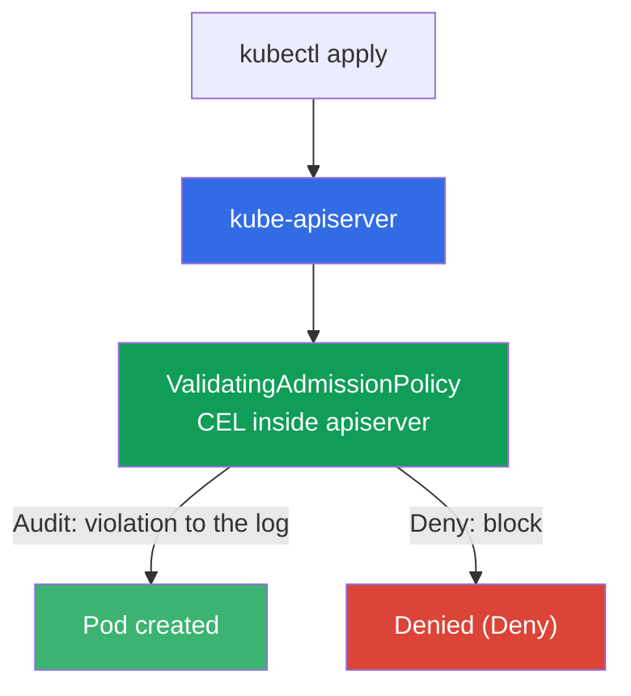
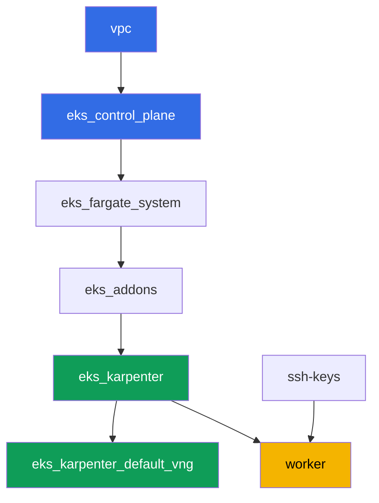

[Русская версия](README_RU.MD) · [Versión en español](README_ES.MD) · [Version française](README_FR.MD) · [Deutsche Version](README_DE.MD) · [ქართული ვერსია](README_GE.MD) · [繁體中文版](README_TW.MD) · [日本語版](README_JP.MD)

# Lab 127 - Policy without an engine: ValidatingAdmissionPolicy on CEL

## Description

Kyverno and Gatekeeper are external policy engines that work through an admission webhook:
they bring their own rules, but also their own service, which might not answer. Kubernetes
has a built-in alternative - `ValidatingAdmissionPolicy`, where a CEL (Common Expression
Language) rule is evaluated right inside the apiserver, with no external service and no
risk of "the webhook didn't answer".

In this lab you write a CEL policy, walk through the Audit -> Deny rollout path (the same
as with PSA and Kyverno, just without a third-party engine) and work out what
`failurePolicy` is actually responsible for.

Tasks are written in a production style: a short statement plus acceptance criteria.
Checking is automatic, via the `check_result` command.

## Goal

Reinforce the material from the course chapter:

- [Chapter 22. Policies and multi-tenancy: Kyverno and Gatekeeper, team
  isolation](../../course/22/ru.md) - where ValidatingAdmissionPolicy sits among policy engines

## What we're creating

The cluster is already deployed as code (the same base as in lab 101). You add two CEL
admission policies to it and check their behavior on test pods.

| Object | What it is | Why it's in this lab |
|--------|---------|-------------------|
| Namespace `eks-127` | a cluster section for the lab's workload | scope of the policies |
| `ValidatingAdmissionPolicy` `disallow-latest-tag` | a CEL rule against the `:latest` tag | your own rule with no external engine |
| `ValidatingAdmissionPolicyBinding` (Audit -> Deny) | the rule's enforcement mode | a rollout path with no risk to the workload |
| Artifact `denied.txt` | apiserver's denial message | seeing the text of a CEL violation |
| `ValidatingAdmissionPolicy` `require-resources-requests` | a CEL rule about `resources.requests` | a second policy straight in Deny |
| Artifact `failurepolicy.txt` | explanation of `failurePolicy` | the boundary of responsibility: a CEL error versus a webhook being unreachable |

How the built-in check fits into the admission pipeline:



## Infrastructure

The environment is deployed in AWS (`eu-central-1`) via Terragrunt. The base matches lab
101: ValidatingAdmissionPolicy needs no special components, it's a built-in capability of
the apiserver control plane version `1.36` (available starting with Kubernetes `1.30`).

### Modules and dependencies

| Directory (component) | Module (`terraform/modules/`) | Depends on | What it creates |
|---------------------|-------------------------------|------------|-------------|
| `vpc` | `vpc_v3` | - | VPC `10.10.0.0/16`, subnets in two AZs, NAT |
| `ssh-keys` | `ssh-keys` | - | an SSH key pair for the worker machine and nodes |
| `eks_control_plane` | `eks_v2_control_plane` | `vpc` | EKS control plane `1.36`, OIDC, security groups |
| `eks_fargate_system` | `eks_v2_fargate` | `vpc`, `eks_control_plane` | Fargate profile for `kube-system` and `karpenter` |
| `eks_addons` | `eks_v2_addons` | `eks_control_plane`, `eks_fargate_system` | coredns, kube-proxy, vpc-cni, pod-identity add-ons |
| `eks_karpenter` | `eks_v2_karpenter` | `vpc`, `eks_control_plane`, `eks_addons`, `eks_fargate_system` | Karpenter controller, node IAM role |
| `eks_karpenter_default_vng` | `eks_v2_karpenter_vng` | `vpc`, `eks_control_plane`, `eks_karpenter` | default NodePool `default` on AL2023 |
| `worker` | `eks_v2_work_pc` | `ssh-keys`, `vpc`, `eks_control_plane`, `eks_karpenter` | worker machine with kubectl, tests and `check_result` |

Dependency graph (what gets applied earlier is lower down the arrow):



EC2 nodes for the test pods are brought up by Karpenter, system pods go to Fargate - same
as in lab 101. You write all `ValidatingAdmissionPolicy` manifests yourself on the worker
machine, no additional terraform components are needed for this.

### Where things are configured

`env.hcl` (shared environment parameters):

| Parameter | Value in the lab | What it affects |
|----------|-----------------|---------------|
| `region` | `eu-central-1` | region of all resources |
| `prefix` | `eks-task127` | prefix for resource names and tags |
| `stack_name` | `eks127` | used to build `env_name` - the cluster name |
| `k8_version` | `1.36.0` | kubectl version on the worker machine |
| `instance_type_worker` | `t3.medium` | worker machine instance type |
| `ssh_password_enable`, `access_cidrs` | `true`, `0.0.0.0/0` | SSH access to the worker machine |

`inputs` in each component's `terragrunt.hcl`:

| File | Key settings |
|------|--------------------|
| `eks_control_plane/terragrunt.hcl` | `eks.version = "1.36"` (ValidatingAdmissionPolicy available since `1.30`) |
| `eks_addons/terragrunt.hcl` | add-on versions for 1.36 |
| `eks_karpenter_default_vng/terragrunt.hcl` | default NodePool for the test pods |
| `worker/terragrunt.hcl` | `test_url` and `task_script_url` pointing to this lab's files |

## Deployment

```bash
TASK=127 make run_eks_task
```

Deployment takes roughly 15-20 minutes. In the output, find the line with the SSH
connection to the worker machine and connect to it. kubectl there is already configured on
the target cluster.

Useful commands on the worker machine:

```bash
time_left       # how much environment time is left
check_result    # check the solution
```

> Environment security. `env.hcl` has `ssh_password_enable = true` and
> `access_cidrs = ["0.0.0.0/0"]` enabled - convenient for a training environment, but this
> is not something to do in production. Per the course standards (chapters 0.2, 2, 19),
> access to worker machines should go through AWS SSM Session Manager without exposing
> public SSH ports, and `access_cidrs` should be narrowed down to specific addresses. Here
> public SSH is left in place only to keep the setup simple.

## Tasks

---
|        **1**        | **Namespace for the lab's workload**                             |
| :-----------------: | :---------------------------------------------------------- |
| What to do          | Create a namespace named `eks-127`. All objects in this lab are created inside it. |
| Acceptance criteria    | - namespace `eks-127` exists. |
---
|        **2**        | **CEL policy in Audit mode: a pod with `:latest` gets through**   |
| :-----------------: | :---------------------------------------------------------- |
| What to do          | Create a `ValidatingAdmissionPolicy` named `disallow-latest-tag`: a CEL expression forbids pods from using an image with the `:latest` tag (`object.spec.containers.all(c, !c.image.endsWith(':latest'))`), scoped to namespace `eks-127`. Create a `ValidatingAdmissionPolicyBinding` `disallow-latest-tag-binding` with `validationActions: ["Audit"]`. Deploy Pod `latest-audit-pod` with image `viktoruj/ping_pong:latest` in `eks-127` - it should be CREATED, since `Audit` only records the violation without blocking the request. |
| Acceptance criteria    | - `ValidatingAdmissionPolicy` `disallow-latest-tag` exists;<br/>- Pod `latest-audit-pod` in `eks-127` with an image ending in `:latest` is created. |
---
|        **3**        | **Switching to Deny: a pod with `:latest` is rejected**          |
| :-----------------: | :---------------------------------------------------------- |
| What to do          | Update `disallow-latest-tag-binding`, changing `validationActions` to `["Deny"]` (via `kubectl apply`). Try to create Pod `latest-deny-pod` with image `viktoruj/ping_pong:latest` in `eks-127` - the apiserver should REJECT the request. Save the rejection message (stderr of `kubectl apply`) to the file `/var/work/tests/artifacts/3/denied.txt`. |
| Acceptance criteria    | - `disallow-latest-tag-binding` has `validationActions: ["Deny"]`;<br/>- Pod `latest-deny-pod` in `eks-127` does NOT exist;<br/>- file `denied.txt` is not empty and contains the words `latest` and `forbidden`. |
---
|        **4**        | **A legit pod with an explicit tag gets through even under Deny**        |
| :-----------------: | :---------------------------------------------------------- |
| What to do          | Create Pod `tagged-pod` in `eks-127` with image `viktoruj/ping_pong:53833ea` (a specific tag, not `:latest`). Make sure the `disallow-latest-tag` policy in `Deny` mode doesn't block this pod, and that the pod reaches `Running` - the tag must actually exist in the registry, otherwise admission would pass while the pod stays in `ErrImagePull`, and "the policy doesn't block it" would end up an unverified claim. |
| Acceptance criteria    | - Pod `tagged-pod` in `eks-127` is created, image doesn't end in `:latest`;<br/>- the pod is in `Running` state. |
---
|        **5**        | **Second CEL policy: mandatory resources.requests**    |
| :-----------------: | :---------------------------------------------------------- |
| What to do          | Create a `ValidatingAdmissionPolicy` `require-resources-requests`: a CEL expression requires that every container has `resources.requests` set (`object.spec.containers.all(c, has(c.resources) && has(c.resources.requests))`), scoped to `eks-127`. Create a `ValidatingAdmissionPolicyBinding` `require-resources-requests-binding` with `validationActions: ["Deny"]`. Try to create Pod `no-requests-pod` without `resources.requests` - it should be REJECTED. Create Pod `requests-ok-pod` with `resources.requests` set - it should get through. |
| Acceptance criteria    | - `ValidatingAdmissionPolicy` `require-resources-requests` and its Binding in `Deny`;<br/>- Pod `no-requests-pod` in `eks-127` does NOT exist;<br/>- Pod `requests-ok-pod` in `eks-127` is created with `resources.requests` set. |
---
|        **6**        | **failurePolicy: a boundary of responsibility without a webhook**      |
| :-----------------: | :---------------------------------------------------------- |
| What to do          | Explicitly set `spec.failurePolicy: Fail` on the `disallow-latest-tag` policy. Work out and save to the file `/var/work/tests/artifacts/6/failurepolicy.txt` an explanation of why the built-in `ValidatingAdmissionPolicy` doesn't have the "the webhook didn't answer" risk that's typical for Kyverno and Gatekeeper: CEL is evaluated inside the apiserver, with no call to an external service. The text must contain the words `webhook` and `apiserver`. |
| Acceptance criteria    | - `disallow-latest-tag` has `spec.failurePolicy: Fail`;<br/>- file `failurepolicy.txt` is not empty and mentions `webhook` and `apiserver`. |
---

## Checking the result

On the worker machine, run the automatic check:

```bash
check_result
```

The script runs the tests and shows the percentage of completed tasks.

## Solution

Reference solution: [worker/files/solutions/1.MD](worker/files/solutions/1.MD)

## Deleting the cluster and resources

> **Admission policies live outside the namespace.** `ValidatingAdmissionPolicy` and
> `ValidatingAdmissionPolicyBinding` are cluster-level objects, so deleting namespace
> `eks-127` does NOT remove them. This doesn't affect tearing down the stand (they go away
> together with the control plane), but if you want to repeat the lab on the same cluster,
> a leftover policy in `Deny` mode will greet you with rejections when creating pods in the
> freshly created namespace. This lab doesn't create any AWS resources by hand.

```bash
# 1. Remove the workload
kubectl delete namespace eks-127 --ignore-not-found

# 2. Remove the admission policies and their bindings - they are cluster-scoped and the
#    namespace deletion doesn't take them with it
kubectl delete validatingadmissionpolicybinding disallow-latest-tag-binding \
  require-resources-requests-binding --ignore-not-found
kubectl delete validatingadmissionpolicy disallow-latest-tag \
  require-resources-requests --ignore-not-found

# 3. Wait for Karpenter to remove the EC2 node under the test pods (only fargate-* should
#    remain), otherwise an orphaned secondary ENI will delay deletion of the node security
#    group
while kubectl get nodes --no-headers 2>/dev/null | grep -qv fargate; do
  echo "EC2 node still alive, waiting..."; sleep 15
done
```

Only after that, tear down the stack:

```bash
TASK=127 make delete_eks_task
```
