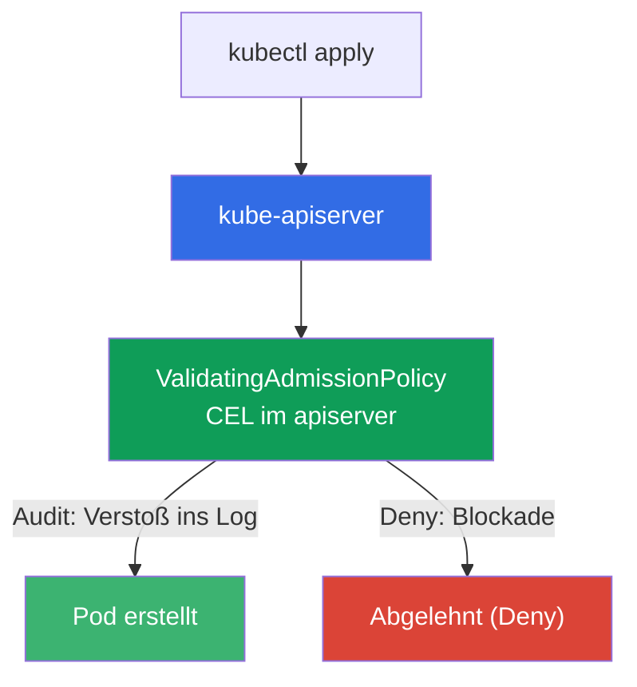
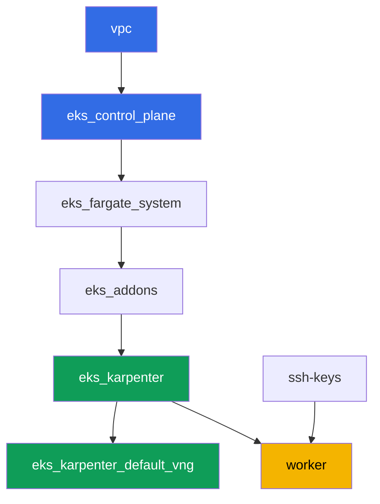

[Русская версия](README_RU.MD) · [Eng version](README.MD) · [Versión en español](README_ES.MD) · [Version française](README_FR.MD) · [ქართული ვერსია](README_GE.MD) · [繁體中文版](README_TW.MD) · [日本語版](README_JP.MD)

# Lab 127 - Policy ohne Engine: ValidatingAdmissionPolicy mit CEL

## Beschreibung

Kyverno und Gatekeeper sind externe Policy-Engines, die über ein Admission-Webhook
arbeiten: sie bringen ihre eigenen Regeln mit, aber auch ihren eigenen Dienst, der
möglicherweise nicht antwortet. Kubernetes hat eine eingebaute Alternative -
`ValidatingAdmissionPolicy`, bei der eine Regel in CEL (Common Expression Language) direkt
im apiserver ausgewertet wird, ohne externen Dienst und ohne das Risiko, dass "das Webhook
nicht geantwortet hat".

In dieser Lab schreiben Sie eine CEL-Policy, durchlaufen den Einführungsweg Audit -> Deny
(wie bei PSA und Kyverno, nur ohne Drittanbieter-Engine) und finden heraus, wofür
`failurePolicy` eigentlich zuständig ist.

Die Aufgaben sind im Produktionsstil formuliert: eine kurze Aufgabenstellung plus
Abnahmekriterien. Die Prüfung erfolgt automatisch über den Befehl `check_result`.

## Ziel

Den Stoff aus dem Kurskapitel vertiefen:

- [Kapitel 22. Policies und Multi-Tenancy: Kyverno und Gatekeeper, Team-Isolation](../../course/22/ru.md) -
  der Platz von ValidatingAdmissionPolicy unter den Policy-Engines

## Was wir erstellen

Der Cluster ist bereits als Code deployt (die gleiche Basis wie in Lab 101). Sie fügen ihm
zwei CEL-Admission-Policies hinzu und prüfen ihr Verhalten an Test-Pods.

| Objekt | Was ist das | Wofür in dieser Lab |
|--------|---------|-------------------|
| Namespace `eks-127` | ein Cluster-Abschnitt für die Last dieser Lab | Geltungsbereich der Policies |
| `ValidatingAdmissionPolicy` `disallow-latest-tag` | eine CEL-Regel gegen das Tag `:latest` | Ihre eigene Regel ohne externe Engine |
| `ValidatingAdmissionPolicyBinding` (Audit -> Deny) | der Erzwingungsmodus der Regel | ein Einführungsweg ohne Risiko für die Last |
| Artefakt `denied.txt` | Ablehnungsmeldung des apiservers | Sichtbarmachung des CEL-Verstoßtexts |
| `ValidatingAdmissionPolicy` `require-resources-requests` | eine CEL-Regel zu `resources.requests` | zweite Policy direkt in Deny |
| Artefakt `failurepolicy.txt` | Erklärung von `failurePolicy` | die Verantwortungsgrenze: ein CEL-Fehler gegenüber der Nichterreichbarkeit eines Webhooks |

Wie die eingebaute Prüfung in die Admission-Pipeline eingebettet ist:



## Infrastruktur

Die Umgebung wird in AWS (`eu-central-1`) über Terragrunt bereitgestellt. Die Basis
entspricht Lab 101: ValidatingAdmissionPolicy benötigt keine speziellen Komponenten, es ist
eine eingebaute Fähigkeit des apiservers der Control-Plane-Version `1.36` (verfügbar ab
Kubernetes `1.30`).

### Module und Abhängigkeiten

| Verzeichnis (Komponente) | Modul (`terraform/modules/`) | Abhängig von | Was es erstellt |
|---------------------|-------------------------------|------------|-------------|
| `vpc` | `vpc_v3` | - | VPC `10.10.0.0/16`, Subnetze in zwei AZs, NAT |
| `ssh-keys` | `ssh-keys` | - | ein SSH-Schlüsselpaar für die Worker-Maschine und die Nodes |
| `eks_control_plane` | `eks_v2_control_plane` | `vpc` | EKS-Control-Plane `1.36`, OIDC, Security Groups |
| `eks_fargate_system` | `eks_v2_fargate` | `vpc`, `eks_control_plane` | Fargate-Profil für `kube-system` und `karpenter` |
| `eks_addons` | `eks_v2_addons` | `eks_control_plane`, `eks_fargate_system` | Add-ons coredns, kube-proxy, vpc-cni, pod-identity |
| `eks_karpenter` | `eks_v2_karpenter` | `vpc`, `eks_control_plane`, `eks_addons`, `eks_fargate_system` | Karpenter-Controller, Node-IAM-Rolle |
| `eks_karpenter_default_vng` | `eks_v2_karpenter_vng` | `vpc`, `eks_control_plane`, `eks_karpenter` | Standard-NodePool `default` auf AL2023 |
| `worker` | `eks_v2_work_pc` | `ssh-keys`, `vpc`, `eks_control_plane`, `eks_karpenter` | Worker-Maschine mit kubectl, Tests und `check_result` |

Abhängigkeitsgraph (was früher angewendet wird, steht weiter unten am Pfeil):



EC2-Nodes für die Test-Pods werden von Karpenter hochgefahren, System-Pods laufen auf
Fargate - wie in Lab 101. Alle `ValidatingAdmissionPolicy`-Manifeste schreiben Sie selbst
auf der Worker-Maschine, dafür sind keine zusätzlichen Terraform-Komponenten erforderlich.

### Wo was konfiguriert wird

`env.hcl` (gemeinsame Umgebungsparameter):

| Parameter | Wert in der Lab | Was er beeinflusst |
|----------|-----------------|---------------|
| `region` | `eu-central-1` | Region aller Ressourcen |
| `prefix` | `eks-task127` | Präfix für Ressourcennamen und Tags |
| `stack_name` | `eks127` | daraus wird `env_name` gebildet - der Cluster-Name |
| `k8_version` | `1.36.0` | kubectl-Version auf der Worker-Maschine |
| `instance_type_worker` | `t3.medium` | Instance-Typ der Worker-Maschine |
| `ssh_password_enable`, `access_cidrs` | `true`, `0.0.0.0/0` | SSH-Zugriff auf die Worker-Maschine |

`inputs` im `terragrunt.hcl` jeder Komponente:

| Datei | Wichtige Einstellungen |
|------|--------------------|
| `eks_control_plane/terragrunt.hcl` | `eks.version = "1.36"` (ValidatingAdmissionPolicy verfügbar ab `1.30`) |
| `eks_addons/terragrunt.hcl` | Add-on-Versionen für 1.36 |
| `eks_karpenter_default_vng/terragrunt.hcl` | Standard-NodePool für die Test-Pods |
| `worker/terragrunt.hcl` | `test_url` und `task_script_url` verweisen auf die Dateien dieser Lab |

## Deployment

```bash
TASK=127 make run_eks_task
```

Das Deployment dauert etwa 15-20 Minuten. Suchen Sie in der Ausgabe die Zeile mit der
SSH-Verbindung zur Worker-Maschine und verbinden Sie sich mit ihr. kubectl ist dort bereits
auf den richtigen Cluster konfiguriert.

Nützliche Befehle auf der Worker-Maschine:

```bash
time_left       # wie viel Umgebungszeit noch übrig ist
check_result    # die Lösung prüfen
```

> Sicherheit des Stands. In `env.hcl` sind `ssh_password_enable = true` und
> `access_cidrs = ["0.0.0.0/0"]` aktiviert - das ist praktisch für eine Lernumgebung, aber
> so sollte man es in der Produktion nicht machen. Nach den Kursstandards (Kapitel 0.2, 2,
> 19) wird der Zugriff auf Worker-Maschinen über den AWS SSM Session Manager geöffnet, ohne
> öffentliche SSH-Ports nach außen, und `access_cidrs` wird auf konkrete Adressen
> eingeschränkt. Hier bleibt öffentliches SSH nur der Einfachheit halber erhalten.

## Aufgaben

---
|        **1**        | **Namespace für die Last dieser Lab**                             |
| :-----------------: | :---------------------------------------------------------- |
| Was zu tun ist          | Erstellen Sie einen Namespace mit dem Namen `eks-127`. Alle Objekte dieser Lab werden darin erstellt. |
| Abnahmekriterien    | - Namespace `eks-127` existiert. |
---
|        **2**        | **CEL-Policy im Audit-Modus: ein Pod mit `:latest` kommt durch**   |
| :-----------------: | :---------------------------------------------------------- |
| Was zu tun ist          | Erstellen Sie eine `ValidatingAdmissionPolicy` mit dem Namen `disallow-latest-tag`: ein CEL-Ausdruck verbietet Pods, ein Image mit dem Tag `:latest` zu verwenden (`object.spec.containers.all(c, !c.image.endsWith(':latest'))`), mit Geltungsbereich Namespace `eks-127`. Erstellen Sie ein `ValidatingAdmissionPolicyBinding` `disallow-latest-tag-binding` mit `validationActions: ["Audit"]`. Deployen Sie den Pod `latest-audit-pod` mit dem Image `viktoruj/ping_pong:latest` in `eks-127` - er sollte ERSTELLT werden, da `Audit` den Verstoß nur protokolliert, ohne die Anfrage zu blockieren. |
| Abnahmekriterien    | - `ValidatingAdmissionPolicy` `disallow-latest-tag` existiert;<br/>- Pod `latest-audit-pod` in `eks-127` mit einem auf `:latest` endenden Image ist erstellt. |
---
|        **3**        | **Umschalten auf Deny: ein Pod mit `:latest` wird abgelehnt**          |
| :-----------------: | :---------------------------------------------------------- |
| Was zu tun ist          | Aktualisieren Sie `disallow-latest-tag-binding`, indem Sie `validationActions` auf `["Deny"]` ändern (über `kubectl apply`). Versuchen Sie, den Pod `latest-deny-pod` mit dem Image `viktoruj/ping_pong:latest` in `eks-127` zu erstellen - der apiserver sollte die Anfrage ABLEHNEN. Speichern Sie die Ablehnungsmeldung (stderr von `kubectl apply`) in der Datei `/var/work/tests/artifacts/3/denied.txt`. |
| Abnahmekriterien    | - `disallow-latest-tag-binding` hat `validationActions: ["Deny"]`;<br/>- Pod `latest-deny-pod` in `eks-127` existiert NICHT;<br/>- die Datei `denied.txt` ist nicht leer und enthält die Wörter `latest` und `forbidden`. |
---
|        **4**        | **Ein legitimer Pod mit explizitem Tag kommt auch bei Deny durch**        |
| :-----------------: | :---------------------------------------------------------- |
| Was zu tun ist          | Erstellen Sie den Pod `tagged-pod` in `eks-127` mit dem Image `viktoruj/ping_pong:53833ea` (ein konkretes Tag, nicht `:latest`). Stellen Sie sicher, dass die Policy `disallow-latest-tag` im Modus `Deny` diesen Pod nicht blockiert, und dass der Pod `Running` erreicht - das Tag muss tatsächlich im Registry existieren, sonst würde die Admission durchgehen, während der Pod in `ErrImagePull` verbliebe, und die Behauptung "die Policy stört nicht" bliebe unbelegt. |
| Abnahmekriterien    | - Pod `tagged-pod` in `eks-127` ist erstellt, Image endet nicht auf `:latest`;<br/>- der Pod befindet sich im Zustand `Running`. |
---
|        **5**        | **Zweite CEL-Policy: obligatorische resources.requests**    |
| :-----------------: | :---------------------------------------------------------- |
| Was zu tun ist          | Erstellen Sie eine `ValidatingAdmissionPolicy` `require-resources-requests`: ein CEL-Ausdruck fordert, dass jeder Container `resources.requests` gesetzt hat (`object.spec.containers.all(c, has(c.resources) && has(c.resources.requests))`), mit Geltungsbereich `eks-127`. Erstellen Sie ein `ValidatingAdmissionPolicyBinding` `require-resources-requests-binding` mit `validationActions: ["Deny"]`. Versuchen Sie, den Pod `no-requests-pod` ohne `resources.requests` zu erstellen - er sollte ABGELEHNT werden. Erstellen Sie den Pod `requests-ok-pod` mit gesetztem `resources.requests` - er sollte durchkommen. |
| Abnahmekriterien    | - `ValidatingAdmissionPolicy` `require-resources-requests` und ihr Binding in `Deny`;<br/>- Pod `no-requests-pod` in `eks-127` existiert NICHT;<br/>- Pod `requests-ok-pod` in `eks-127` ist mit gesetztem `resources.requests` erstellt. |
---
|        **6**        | **failurePolicy: Verantwortungsgrenze ohne Webhook**      |
| :-----------------: | :---------------------------------------------------------- |
| Was zu tun ist          | Setzen Sie explizit `spec.failurePolicy: Fail` auf der Policy `disallow-latest-tag`. Finden Sie heraus und speichern Sie in der Datei `/var/work/tests/artifacts/6/failurepolicy.txt` eine Erklärung, warum die eingebaute `ValidatingAdmissionPolicy` nicht das für Kyverno und Gatekeeper typische Risiko "das Webhook hat nicht geantwortet" hat: CEL wird innerhalb des apiservers ausgewertet, ohne Aufruf eines externen Dienstes. Der Text muss die Wörter `webhook` und `apiserver` enthalten. |
| Abnahmekriterien    | - `disallow-latest-tag` hat `spec.failurePolicy: Fail`;<br/>- die Datei `failurepolicy.txt` ist nicht leer und erwähnt `webhook` und `apiserver`. |
---

## Ergebnisprüfung

Führen Sie auf der Worker-Maschine die automatische Prüfung aus:

```bash
check_result
```

Das Skript führt die Tests aus und zeigt den Prozentsatz der erledigten Aufgaben an.

## Lösung

Referenzlösung: [worker/files/solutions/1_DE.MD](worker/files/solutions/1_DE.MD)

## Löschen des Clusters und der Ressourcen

> **Admission-Policies leben außerhalb des Namespace.** `ValidatingAdmissionPolicy` und
> `ValidatingAdmissionPolicyBinding` sind Objekte auf Cluster-Ebene, daher entfernt das
> Löschen des Namespace `eks-127` sie NICHT. Das hat keinen Einfluss auf den Abbau des
> Stands (sie verschwinden zusammen mit der Control Plane), aber wenn Sie die Lab auf
> demselben Cluster wiederholen möchten, wird eine im `Deny`-Modus verbliebene Policy Sie
> mit Ablehnungen beim Erstellen von Pods im neu erstellten Namespace begrüßen. Diese Lab
> erstellt keine AWS-Ressourcen von Hand.

```bash
# 1. Last entfernen
kubectl delete namespace eks-127 --ignore-not-found

# 2. Admission-Policies und ihre Bindings entfernen - sie sind Cluster-weit und der
#    Namespace nimmt sie nicht mit
kubectl delete validatingadmissionpolicybinding disallow-latest-tag-binding \
  require-resources-requests-binding --ignore-not-found
kubectl delete validatingadmissionpolicy disallow-latest-tag \
  require-resources-requests --ignore-not-found

# 3. Warten, bis Karpenter den EC2-Node unter den Test-Pods entfernt (nur fargate-*
#    sollten übrig bleiben), sonst verzögert ein verwaistes sekundäres ENI die Löschung
#    der Node-Security-Group
while kubectl get nodes --no-headers 2>/dev/null | grep -qv fargate; do
  echo "EC2-Node lebt noch, warte..."; sleep 15
done
```

Erst danach den Stand abbauen:

```bash
TASK=127 make delete_eks_task
```
