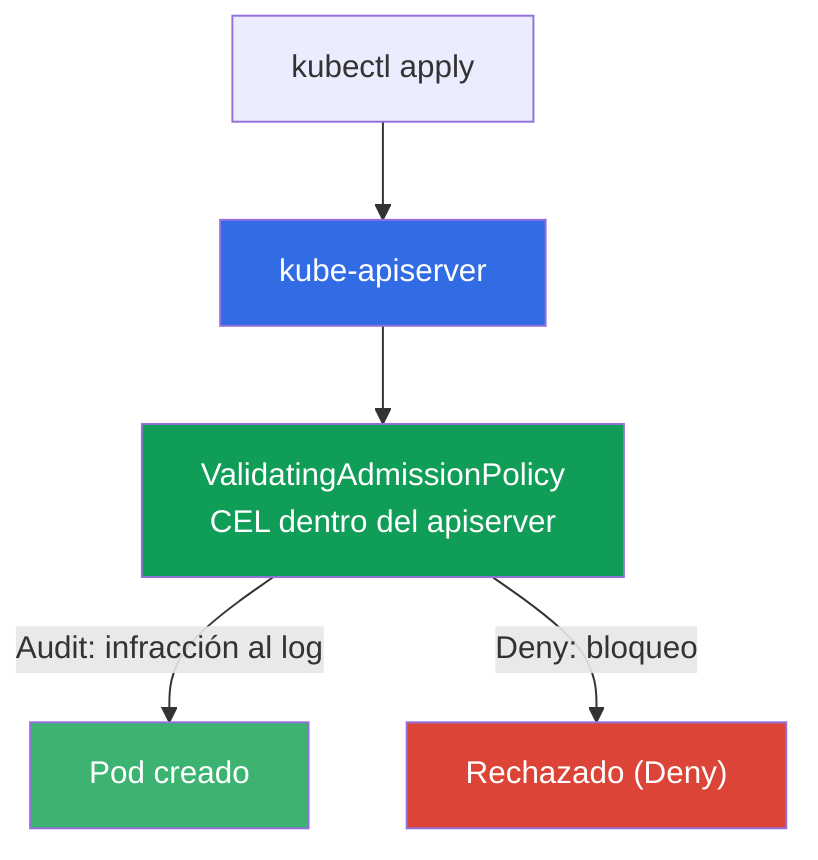
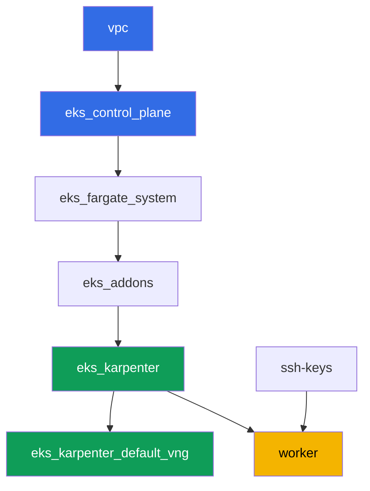

[Русская версия](README_RU.MD) · [Eng version](README.MD) · [Version française](README_FR.MD) · [Deutsche Version](README_DE.MD) · [ქართული ვერსია](README_GE.MD) · [繁體中文版](README_TW.MD) · [日本語版](README_JP.MD)

# Laboratorio 127 - Políticas sin motor: ValidatingAdmissionPolicy en CEL

## Descripción

Kyverno y Gatekeeper son policy engines externos que funcionan a través de un admission
webhook: tienen sus propias reglas, pero también su propio servicio, que puede no responder.
Kubernetes tiene una alternativa integrada - `ValidatingAdmissionPolicy`, donde la regla en
CEL (Common Expression Language) se evalúa directamente dentro del apiserver, sin servicio
externo y sin el riesgo de "el webhook no respondió".

En este laboratorio escribes una política CEL, recorres el camino de implementación
Audit -> Deny (igual que con PSA y Kyverno, solo que sin un motor de terceros) y entiendes de
qué es responsable `failurePolicy`.

Las tareas están redactadas en estilo de producción: un planteamiento breve más criterios de
aceptación. La verificación es automática, con el comando `check_result`.

## Objetivo

Consolidar el material del capítulo del curso:

- [Capítulo 22. Políticas y multi-tenancy: Kyverno y Gatekeeper, aislamiento de
  equipos](../../course/22/es.md) - el lugar de ValidatingAdmissionPolicy entre los policy
  engines

## Qué vamos a crear

El clúster ya está desplegado como código (la misma base que en el laboratorio 101). Le
añades dos políticas de admisión CEL y verificas su comportamiento con pods de prueba.

| Objeto | Qué es | Para qué sirve en este laboratorio |
|--------|---------|-------------------|
| Namespace `eks-127` | una sección del clúster para la carga del laboratorio | ámbito de las políticas |
| `ValidatingAdmissionPolicy` `disallow-latest-tag` | regla CEL contra el tag `:latest` | tu propia regla sin motor externo |
| `ValidatingAdmissionPolicyBinding` (Audit -> Deny) | modo de aplicación de la regla | camino de implementación sin riesgo para la carga |
| Artefacto `denied.txt` | mensaje de rechazo del apiserver | vemos el texto de la infracción CEL |
| `ValidatingAdmissionPolicy` `require-resources-requests` | regla CEL sobre `resources.requests` | segunda política directamente en Deny |
| Artefacto `failurepolicy.txt` | explicación de `failurePolicy` | límite de responsabilidad: error de CEL frente a indisponibilidad del webhook |

Cómo se integra la verificación integrada en el pipeline de admisión:



## Infraestructura

El entorno se despliega en AWS (`eu-central-1`) mediante Terragrunt. La base coincide con el
laboratorio 101: ValidatingAdmissionPolicy no requiere componentes especiales, es una
capacidad integrada del apiserver del control plane versión `1.36` (disponible desde
Kubernetes `1.30`).

### Módulos y dependencias

| Directorio (componente) | Módulo (`terraform/modules/`) | Depende de | Qué crea |
|---------------------|-------------------------------|------------|-------------|
| `vpc` | `vpc_v3` | - | VPC `10.10.0.0/16`, subredes en dos AZ, NAT |
| `ssh-keys` | `ssh-keys` | - | par de claves SSH para la máquina de trabajo y los nodos |
| `eks_control_plane` | `eks_v2_control_plane` | `vpc` | control plane de EKS `1.36`, OIDC, security groups |
| `eks_fargate_system` | `eks_v2_fargate` | `vpc`, `eks_control_plane` | perfil Fargate para `kube-system` y `karpenter` |
| `eks_addons` | `eks_v2_addons` | `eks_control_plane`, `eks_fargate_system` | add-ons coredns, kube-proxy, vpc-cni, pod-identity |
| `eks_karpenter` | `eks_v2_karpenter` | `vpc`, `eks_control_plane`, `eks_addons`, `eks_fargate_system` | controlador Karpenter, rol IAM de los nodos |
| `eks_karpenter_default_vng` | `eks_v2_karpenter_vng` | `vpc`, `eks_control_plane`, `eks_karpenter` | NodePool por defecto `default` en AL2023 |
| `worker` | `eks_v2_work_pc` | `ssh-keys`, `vpc`, `eks_control_plane`, `eks_karpenter` | máquina de trabajo con kubectl, tests y `check_result` |

Grafo de dependencias (lo que se aplica antes queda más abajo en la flecha):



Karpenter levanta los nodos EC2 para los pods de prueba, los pods del sistema van a Fargate -
igual que en el laboratorio 101. Todos los manifiestos de `ValidatingAdmissionPolicy` los
escribes tú mismo en la máquina de trabajo, no se necesitan componentes de terraform
adicionales para esto.

### Dónde se configura qué

`env.hcl` (parámetros comunes del entorno):

| Parámetro | Valor en el laboratorio | Qué afecta |
|----------|-----------------|---------------|
| `region` | `eu-central-1` | región de todos los recursos |
| `prefix` | `eks-task127` | prefijo de nombres de recursos y tags |
| `stack_name` | `eks127` | a partir de él se forma `env_name` - el nombre del clúster |
| `k8_version` | `1.36.0` | versión de kubectl en la máquina de trabajo |
| `instance_type_worker` | `t3.medium` | tipo de instancia de la máquina de trabajo |
| `ssh_password_enable`, `access_cidrs` | `true`, `0.0.0.0/0` | acceso por SSH a la máquina de trabajo |

`inputs` en el `terragrunt.hcl` de cada componente:

| Archivo | Configuraciones clave |
|------|--------------------|
| `eks_control_plane/terragrunt.hcl` | `eks.version = "1.36"` (ValidatingAdmissionPolicy disponible desde `1.30`) |
| `eks_addons/terragrunt.hcl` | versiones de los add-ons para 1.36 |
| `eks_karpenter_default_vng/terragrunt.hcl` | NodePool por defecto para los pods de prueba |
| `worker/terragrunt.hcl` | `test_url` y `task_script_url` de los archivos del laboratorio 127 |

## Despliegue

```bash
TASK=127 make run_eks_task
```

El despliegue tarda aproximadamente 15-20 minutos. En la salida busca la línea con la
conexión SSH a la máquina de trabajo y conéctate a ella. kubectl ya está configurado allí
para el clúster correcto.

Comandos útiles en la máquina de trabajo:

```bash
time_left       # cuánto tiempo queda del entorno
check_result    # verificar la solución
```

> Seguridad del entorno. En `env.hcl` están habilitados `ssh_password_enable = true` y
> `access_cidrs = ["0.0.0.0/0"]` - esto es cómodo para un entorno de aprendizaje, pero no se
> debe hacer en producción. Según los estándares del curso (capítulos 0.2, 2, 19), el acceso
> a las máquinas de trabajo se abre a través de AWS SSM Session Manager sin puertos SSH
> públicos hacia afuera, y `access_cidrs` se restringe a direcciones concretas. Aquí se deja
> el SSH público solo para simplificar el arranque.

## Tareas

---
|        **1**        | **Namespace para la carga del laboratorio**                             |
| :-----------------: | :---------------------------------------------------------- |
| Qué hacer          | Crea un namespace con el nombre `eks-127`. Todos los objetos del laboratorio se crean dentro de él. |
| Criterios de aceptación    | - el namespace `eks-127` existe. |
---
|        **2**        | **Política CEL en modo Audit: un pod con `:latest` pasa**   |
| :-----------------: | :---------------------------------------------------------- |
| Qué hacer          | Crea una `ValidatingAdmissionPolicy` con el nombre `disallow-latest-tag`: la expresión CEL prohíbe a los pods usar una imagen con el tag `:latest` (`object.spec.containers.all(c, !c.image.endsWith(':latest'))`), con ámbito en el namespace `eks-127`. Crea un `ValidatingAdmissionPolicyBinding` `disallow-latest-tag-binding` con `validationActions: ["Audit"]`. Despliega el Pod `latest-audit-pod` con la imagen `viktoruj/ping_pong:latest` en `eks-127` - debe QUEDAR CREADO, ya que `Audit` solo registra la infracción, sin bloquear la solicitud. |
| Criterios de aceptación    | - la `ValidatingAdmissionPolicy` `disallow-latest-tag` existe;<br/>- el Pod `latest-audit-pod` en `eks-127` con una imagen que termina en `:latest` está creado. |
---
|        **3**        | **Cambio a Deny: un pod con `:latest` es rechazado**          |
| :-----------------: | :---------------------------------------------------------- |
| Qué hacer          | Actualiza `disallow-latest-tag-binding`, cambiando `validationActions` a `["Deny"]` (mediante `kubectl apply`). Intenta crear el Pod `latest-deny-pod` con la imagen `viktoruj/ping_pong:latest` en `eks-127` - el apiserver debe RECHAZAR la solicitud. Guarda el mensaje de rechazo (stderr de `kubectl apply`) en el archivo `/var/work/tests/artifacts/3/denied.txt`. El mensaje del apiserver lleva el texto propio de la política, que literalmente dice que el tag está `forbidden` (prohibido) - es esa palabra exacta la que verás en la salida y que debes conservar en el artefacto. |
| Criterios de aceptación    | - `disallow-latest-tag-binding` tiene `validationActions: ["Deny"]`;<br/>- el Pod `latest-deny-pod` en `eks-127` NO existe;<br/>- el archivo `denied.txt` no está vacío y contiene las palabras `latest` y `forbidden`. |
---
|        **4**        | **Un pod legítimo con un tag explícito pasa incluso con Deny**        |
| :-----------------: | :---------------------------------------------------------- |
| Qué hacer          | Crea el Pod `tagged-pod` en `eks-127` con la imagen `viktoruj/ping_pong:53833ea` (un tag concreto, no `:latest`). Comprueba que la política `disallow-latest-tag` en modo `Deny` no le afecta a este pod, y que llega a `Running` - el tag debe existir realmente en el registro, de lo contrario la admisión pasa, pero el pod se queda en `ErrImagePull`, y "la política no lo bloquea" resultaría una afirmación imposible de verificar. |
| Criterios de aceptación    | - el Pod `tagged-pod` en `eks-127` está creado, la imagen no termina en `:latest`;<br/>- el pod está en estado `Running`. |
---
|        **5**        | **Segunda política CEL: `resources.requests` obligatorio**    |
| :-----------------: | :---------------------------------------------------------- |
| Qué hacer          | Crea la `ValidatingAdmissionPolicy` `require-resources-requests`: la expresión CEL exige que cada contenedor tenga definido `resources.requests` (`object.spec.containers.all(c, has(c.resources) && has(c.resources.requests))`), con ámbito en `eks-127`. Crea el `ValidatingAdmissionPolicyBinding` `require-resources-requests-binding` con `validationActions: ["Deny"]`. Intenta crear el Pod `no-requests-pod` sin `resources.requests` - debe ser RECHAZADO. Crea el Pod `requests-ok-pod` con `resources.requests` definido - debe pasar. |
| Criterios de aceptación    | - la `ValidatingAdmissionPolicy` `require-resources-requests` y su Binding están en `Deny`;<br/>- el Pod `no-requests-pod` en `eks-127` NO existe;<br/>- el Pod `requests-ok-pod` en `eks-127` está creado con `resources.requests` definido. |
---
|        **6**        | **failurePolicy: límite de responsabilidad sin webhook**      |
| :-----------------: | :---------------------------------------------------------- |
| Qué hacer          | Establece explícitamente `spec.failurePolicy: Fail` en la política `disallow-latest-tag`. Averigua y guarda en el archivo `/var/work/tests/artifacts/6/failurepolicy.txt` una explicación de por qué la `ValidatingAdmissionPolicy` integrada no tiene el riesgo de "el webhook no respondió", característico de Kyverno y Gatekeeper: CEL se evalúa dentro del apiserver, sin llamar a un servicio externo. El texto debe contener las palabras `webhook` y `apiserver`. |
| Criterios de aceptación    | - `disallow-latest-tag` tiene `spec.failurePolicy: Fail`;<br/>- el archivo `failurepolicy.txt` no está vacío y menciona `webhook` y `apiserver`. |
---

## Verificación del resultado

En la máquina de trabajo, ejecuta la verificación automática:

```bash
check_result
```

El script ejecutará las pruebas y mostrará el porcentaje de tareas completadas.

## Solución

Solución de referencia: [worker/files/solutions/1_ES.MD](worker/files/solutions/1_ES.MD)

## Eliminación del clúster y los recursos

> **Las políticas de admisión viven fuera del namespace.** `ValidatingAdmissionPolicy` y
> `ValidatingAdmissionPolicyBinding` son objetos de ámbito de clúster, así que eliminar el
> namespace `eks-127` NO las elimina. Esto no afecta al desmontaje del stand (se van junto
> con el control plane), pero si quieres repetir el laboratorio en el mismo clúster, una
> política que quedó en modo `Deny` te recibirá con rechazos al crear pods en el namespace
> recién creado. Este laboratorio no crea recursos de AWS a mano.

```bash
# 1. Retirar la carga
kubectl delete namespace eks-127 --ignore-not-found

# 2. Retirar las políticas de admisión y sus bindings - son de ámbito de clúster y el namespace no se las lleva
kubectl delete validatingadmissionpolicybinding disallow-latest-tag-binding \
  require-resources-requests-binding --ignore-not-found
kubectl delete validatingadmissionpolicy disallow-latest-tag \
  require-resources-requests --ignore-not-found

# 3. Esperar a que Karpenter retire el nodo EC2 con los pods de prueba (deben quedar solo fargate-*),
#    de lo contrario un ENI secundario huérfano retrasará la eliminación del security group de los nodos
while kubectl get nodes --no-headers 2>/dev/null | grep -qv fargate; do
  echo "El nodo EC2 sigue vivo, esperando..."; sleep 15
done
```

Solo después de esto, desmonta el stand:

```bash
TASK=127 make delete_eks_task
```
