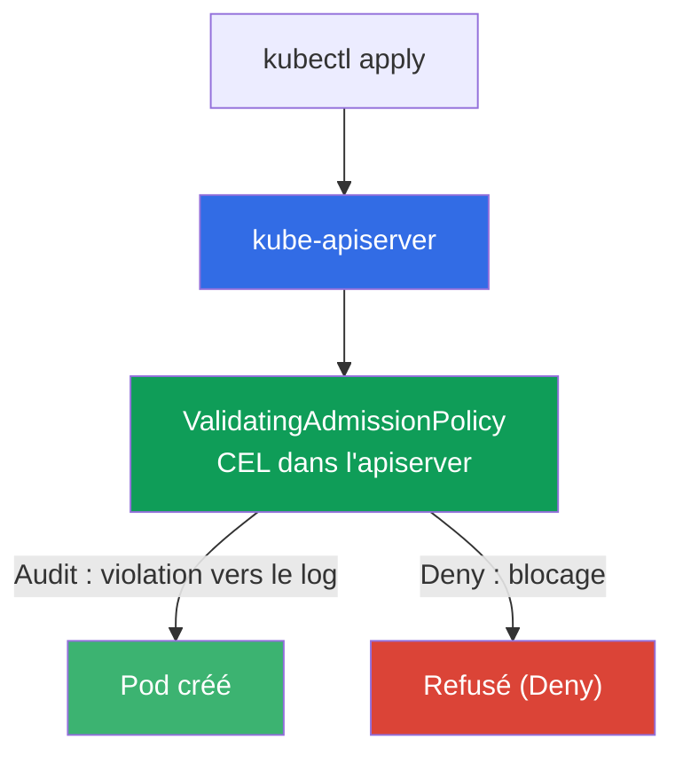
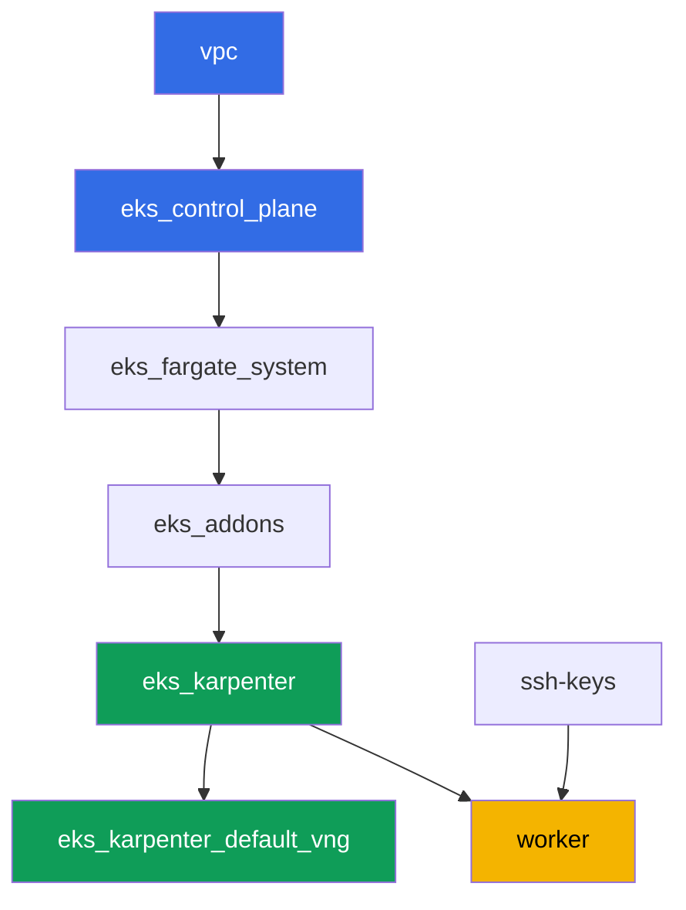

[Русская версия](README_RU.MD) · [Eng version](README.MD) · [Versión en español](README_ES.MD) · [Deutsche Version](README_DE.MD) · [ქართული ვერსია](README_GE.MD) · [繁體中文版](README_TW.MD) · [日本語版](README_JP.MD)

# Lab 127 - Politique sans moteur : ValidatingAdmissionPolicy en CEL

## Description

Kyverno et Gatekeeper sont des policy engines externes qui fonctionnent via un admission
webhook : ils apportent leurs propres règles, mais aussi leur propre service, qui peut ne
pas répondre. Kubernetes a une alternative intégrée - `ValidatingAdmissionPolicy`, où une
règle en CEL (Common Expression Language) est évaluée directement dans l'apiserver, sans
service externe et sans le risque que « le webhook n'a pas répondu ».

Dans cette lab, vous écrivez une politique CEL, parcourez le chemin de déploiement
Audit -> Deny (comme avec PSA et Kyverno, mais sans moteur tiers) et déterminez de quoi
`failurePolicy` est vraiment responsable.

Les tâches sont rédigées dans un style production : un énoncé court plus des critères
d'acceptation. La vérification est automatique, via la commande `check_result`.

## Objectif

Consolider la matière du chapitre du cours :

- [Chapitre 22. Politiques et multi-tenance : Kyverno et Gatekeeper, isolation des
  équipes](../../course/22/ru.md) - la place de ValidatingAdmissionPolicy parmi les policy engines

## Ce que nous créons

Le cluster est déjà déployé sous forme de code (la même base que dans la lab 101). Vous y
ajoutez deux politiques d'admission CEL et vérifiez leur comportement sur des pods de test.

| Objet | Ce que c'est | Pourquoi dans cette lab |
|--------|---------|-------------------|
| Namespace `eks-127` | une section du cluster pour la charge de la lab | portée des politiques |
| `ValidatingAdmissionPolicy` `disallow-latest-tag` | une règle CEL contre le tag `:latest` | votre propre règle sans moteur externe |
| `ValidatingAdmissionPolicyBinding` (Audit -> Deny) | le mode d'application de la règle | un chemin de déploiement sans risque pour la charge |
| Artefact `denied.txt` | message de refus de l'apiserver | voir le texte de la violation CEL |
| `ValidatingAdmissionPolicy` `require-resources-requests` | une règle CEL sur `resources.requests` | seconde politique directement en Deny |
| Artefact `failurepolicy.txt` | explication de `failurePolicy` | la frontière de responsabilité : une erreur CEL face à l'indisponibilité d'un webhook |

Comment la vérification intégrée s'insère dans le pipeline d'admission :



## Infrastructure

L'environnement est déployé sur AWS (`eu-central-1`) via Terragrunt. La base correspond à
la lab 101 : ValidatingAdmissionPolicy ne nécessite aucun composant spécial, c'est une
capacité intégrée de l'apiserver du control plane version `1.36` (disponible depuis
Kubernetes `1.30`).

### Modules et dépendances

| Répertoire (composant) | Module (`terraform/modules/`) | Dépend de | Ce qu'il crée |
|---------------------|-------------------------------|------------|-------------|
| `vpc` | `vpc_v3` | - | VPC `10.10.0.0/16`, sous-réseaux dans deux AZ, NAT |
| `ssh-keys` | `ssh-keys` | - | une paire de clés SSH pour la machine worker et les nœuds |
| `eks_control_plane` | `eks_v2_control_plane` | `vpc` | control plane EKS `1.36`, OIDC, security groups |
| `eks_fargate_system` | `eks_v2_fargate` | `vpc`, `eks_control_plane` | profil Fargate pour `kube-system` et `karpenter` |
| `eks_addons` | `eks_v2_addons` | `eks_control_plane`, `eks_fargate_system` | add-ons coredns, kube-proxy, vpc-cni, pod-identity |
| `eks_karpenter` | `eks_v2_karpenter` | `vpc`, `eks_control_plane`, `eks_addons`, `eks_fargate_system` | contrôleur Karpenter, rôle IAM des nœuds |
| `eks_karpenter_default_vng` | `eks_v2_karpenter_vng` | `vpc`, `eks_control_plane`, `eks_karpenter` | NodePool par défaut `default` sur AL2023 |
| `worker` | `eks_v2_work_pc` | `ssh-keys`, `vpc`, `eks_control_plane`, `eks_karpenter` | machine worker avec kubectl, tests et `check_result` |

Graphe de dépendances (ce qui est appliqué en premier se trouve plus bas dans la flèche) :



Les nœuds EC2 pour les pods de test sont créés par Karpenter, les pods système tournent sur
Fargate - comme dans la lab 101. Vous écrivez vous-même tous les manifestes
`ValidatingAdmissionPolicy` sur la machine worker, aucun composant terraform supplémentaire
n'est requis pour cela.

### Où les choses sont configurées

`env.hcl` (paramètres d'environnement partagés) :

| Paramètre | Valeur dans la lab | Ce qu'il affecte |
|----------|-----------------|---------------|
| `region` | `eu-central-1` | région de toutes les ressources |
| `prefix` | `eks-task127` | préfixe des noms de ressources et des tags |
| `stack_name` | `eks127` | utilisé pour construire `env_name` - le nom du cluster |
| `k8_version` | `1.36.0` | version de kubectl sur la machine worker |
| `instance_type_worker` | `t3.medium` | type d'instance de la machine worker |
| `ssh_password_enable`, `access_cidrs` | `true`, `0.0.0.0/0` | accès SSH à la machine worker |

`inputs` dans le `terragrunt.hcl` de chaque composant :

| Fichier | Paramètres clés |
|------|--------------------|
| `eks_control_plane/terragrunt.hcl` | `eks.version = "1.36"` (ValidatingAdmissionPolicy disponible depuis `1.30`) |
| `eks_addons/terragrunt.hcl` | versions des add-ons pour 1.36 |
| `eks_karpenter_default_vng/terragrunt.hcl` | NodePool par défaut pour les pods de test |
| `worker/terragrunt.hcl` | `test_url` et `task_script_url` pointant vers les fichiers de cette lab |

## Déploiement

```bash
TASK=127 make run_eks_task
```

Le déploiement prend environ 15-20 minutes. Dans la sortie, trouvez la ligne avec la
connexion SSH à la machine worker et connectez-vous. kubectl y est déjà configuré sur le
bon cluster.

Commandes utiles sur la machine worker :

```bash
time_left       # temps restant de l'environnement
check_result    # vérifier la solution
```

> Sécurité de l'environnement. `env.hcl` active `ssh_password_enable = true` et
> `access_cidrs = ["0.0.0.0/0"]` - pratique pour un environnement de formation, mais à
> proscrire en production. Selon les standards du cours (chapitres 0.2, 2, 19), l'accès aux
> machines worker doit passer par AWS SSM Session Manager sans exposer de ports SSH publics,
> et `access_cidrs` doit être restreint à des adresses précises. Ici, le SSH public est
> laissé uniquement pour simplifier le démarrage.

## Tâches

---
|        **1**        | **Namespace pour la charge de la lab**                             |
| :-----------------: | :---------------------------------------------------------- |
| Ce qu'on fait          | Créez un namespace nommé `eks-127`. Tous les objets de cette lab sont créés à l'intérieur. |
| Critères d'acceptation    | - le namespace `eks-127` existe. |
---
|        **2**        | **Politique CEL en mode Audit : un pod avec `:latest` passe**   |
| :-----------------: | :---------------------------------------------------------- |
| Ce qu'on fait          | Créez une `ValidatingAdmissionPolicy` nommée `disallow-latest-tag` : une expression CEL interdit aux pods d'utiliser une image avec le tag `:latest` (`object.spec.containers.all(c, !c.image.endsWith(':latest'))`), avec une portée limitée au namespace `eks-127`. Créez un `ValidatingAdmissionPolicyBinding` `disallow-latest-tag-binding` avec `validationActions: ["Audit"]`. Déployez le Pod `latest-audit-pod` avec l'image `viktoruj/ping_pong:latest` dans `eks-127` - il doit être CRÉÉ, puisque `Audit` ne fait qu'enregistrer la violation sans bloquer la requête. |
| Critères d'acceptation    | - la `ValidatingAdmissionPolicy` `disallow-latest-tag` existe;<br/>- le Pod `latest-audit-pod` dans `eks-127` avec une image se terminant par `:latest` est créé. |
---
|        **3**        | **Passage en Deny : un pod avec `:latest` est refusé**          |
| :-----------------: | :---------------------------------------------------------- |
| Ce qu'on fait          | Mettez à jour `disallow-latest-tag-binding`, en changeant `validationActions` en `["Deny"]` (via `kubectl apply`). Essayez de créer le Pod `latest-deny-pod` avec l'image `viktoruj/ping_pong:latest` dans `eks-127` - l'apiserver doit REFUSER la requête. Enregistrez le message de refus (stderr de `kubectl apply`) dans le fichier `/var/work/tests/artifacts/3/denied.txt`. |
| Critères d'acceptation    | - `disallow-latest-tag-binding` a `validationActions: ["Deny"]`;<br/>- le Pod `latest-deny-pod` dans `eks-127` N'existe PAS;<br/>- le fichier `denied.txt` n'est pas vide et contient les mots `latest` et `запрещён`. |
---
|        **4**        | **Un pod légitime avec un tag explicite passe même en Deny**        |
| :-----------------: | :---------------------------------------------------------- |
| Ce qu'on fait          | Créez le Pod `tagged-pod` dans `eks-127` avec l'image `viktoruj/ping_pong:53833ea` (un tag précis, pas `:latest`). Assurez-vous que la politique `disallow-latest-tag` en mode `Deny` ne bloque pas ce pod, et que le pod atteint `Running` - le tag doit réellement exister dans le registre, sinon l'admission passerait alors que le pod resterait bloqué en `ErrImagePull`, et « la politique ne gêne pas » resterait une affirmation non vérifiée. |
| Critères d'acceptation    | - le Pod `tagged-pod` dans `eks-127` est créé, l'image ne se termine pas par `:latest`;<br/>- le pod est à l'état `Running`. |
---
|        **5**        | **Seconde politique CEL : resources.requests obligatoire**    |
| :-----------------: | :---------------------------------------------------------- |
| Ce qu'on fait          | Créez une `ValidatingAdmissionPolicy` `require-resources-requests` : une expression CEL exige que chaque conteneur ait `resources.requests` défini (`object.spec.containers.all(c, has(c.resources) && has(c.resources.requests))`), avec une portée limitée à `eks-127`. Créez un `ValidatingAdmissionPolicyBinding` `require-resources-requests-binding` avec `validationActions: ["Deny"]`. Essayez de créer le Pod `no-requests-pod` sans `resources.requests` - il doit être REFUSÉ. Créez le Pod `requests-ok-pod` avec `resources.requests` défini - il doit passer. |
| Critères d'acceptation    | - la `ValidatingAdmissionPolicy` `require-resources-requests` et son Binding en `Deny`;<br/>- le Pod `no-requests-pod` dans `eks-127` N'existe PAS;<br/>- le Pod `requests-ok-pod` dans `eks-127` est créé avec `resources.requests` défini. |
---
|        **6**        | **failurePolicy : une frontière de responsabilité sans webhook**      |
| :-----------------: | :---------------------------------------------------------- |
| Ce qu'on fait          | Fixez explicitement `spec.failurePolicy: Fail` sur la politique `disallow-latest-tag`. Déterminez et enregistrez dans le fichier `/var/work/tests/artifacts/6/failurepolicy.txt` une explication de la raison pour laquelle la `ValidatingAdmissionPolicy` intégrée n'a pas le risque « le webhook n'a pas répondu » typique de Kyverno et Gatekeeper : CEL est évalué à l'intérieur de l'apiserver, sans appel à un service externe. Le texte doit contenir les mots `webhook` et `apiserver`. |
| Critères d'acceptation    | - `disallow-latest-tag` a `spec.failurePolicy: Fail`;<br/>- le fichier `failurepolicy.txt` n'est pas vide et mentionne `webhook` et `apiserver`. |
---

## Vérification du résultat

Sur la machine worker, lancez la vérification automatique :

```bash
check_result
```

Le script exécute les tests et affiche le pourcentage de tâches accomplies.

## Solution

Solution de référence : [worker/files/solutions/1_FR.MD](worker/files/solutions/1_FR.MD)

## Suppression du cluster et des ressources

> **Les politiques d'admission vivent en dehors du namespace.** `ValidatingAdmissionPolicy`
> et `ValidatingAdmissionPolicyBinding` sont des objets de niveau cluster, donc la
> suppression du namespace `eks-127` ne les retire PAS. Cela n'affecte pas la destruction de
> l'environnement (elles disparaissent avec le control plane), mais si vous voulez refaire
> la lab sur le même cluster, une politique restée en mode `Deny` vous accueillera avec des
> refus lors de la création de pods dans le namespace nouvellement créé. Cette lab ne crée
> aucune ressource AWS à la main.

```bash
# 1. Retirer la charge
kubectl delete namespace eks-127 --ignore-not-found

# 2. Retirer les politiques d'admission et leurs bindings - ils sont de niveau cluster et
#    le namespace ne les emporte pas avec lui
kubectl delete validatingadmissionpolicybinding disallow-latest-tag-binding \
  require-resources-requests-binding --ignore-not-found
kubectl delete validatingadmissionpolicy disallow-latest-tag \
  require-resources-requests --ignore-not-found

# 3. Attendre que Karpenter retire le nœud EC2 sous les pods de test (seuls les fargate-*
#    doivent rester), sinon un ENI secondaire orphelin retardera la suppression du
#    security group des nœuds
while kubectl get nodes --no-headers 2>/dev/null | grep -qv fargate; do
  echo "Le nœud EC2 est encore vivant, attente..."; sleep 15
done
```

Ce n'est qu'après cela que vous détruisez l'environnement :

```bash
TASK=127 make delete_eks_task
```
