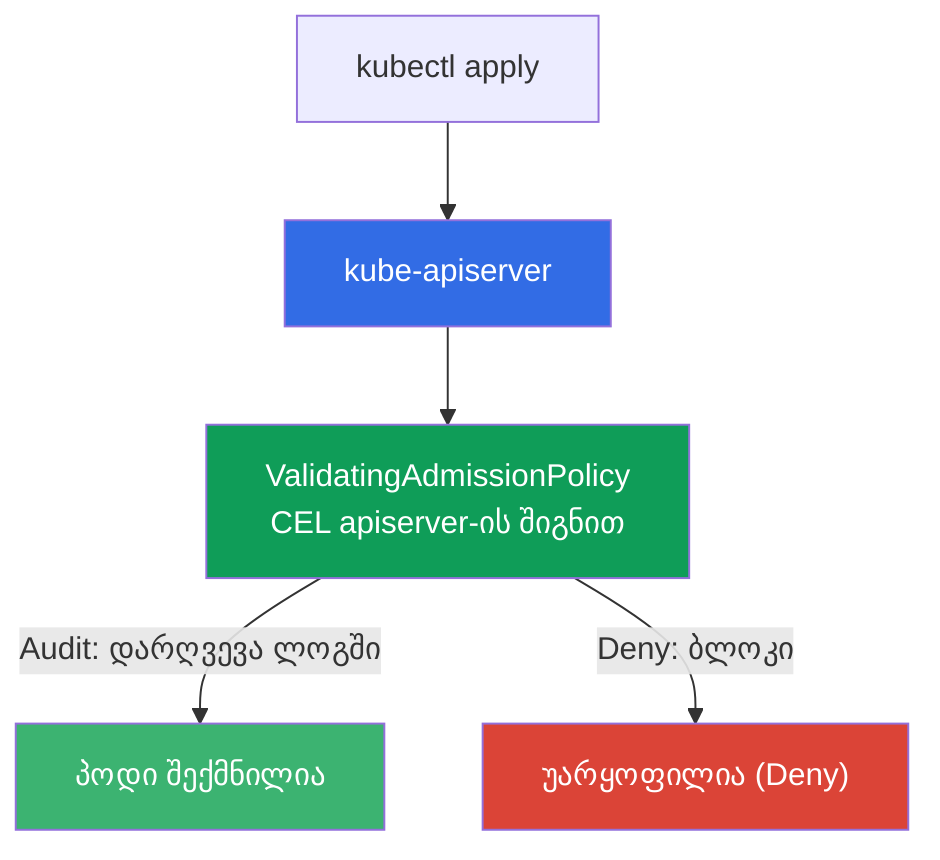
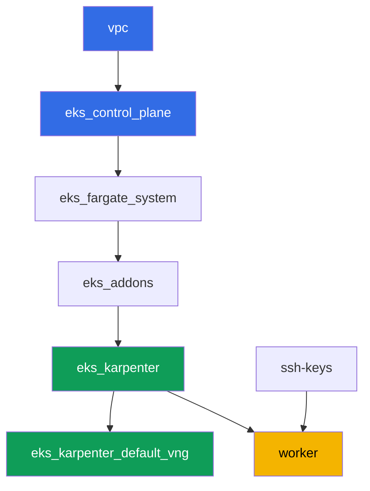

[Русская версия](README_RU.MD) · [Eng version](README.MD) · [Versión en español](README_ES.MD) · [Version française](README_FR.MD) · [Deutsche Version](README_DE.MD) · [繁體中文版](README_TW.MD) · [日本語版](README_JP.MD)

# ლაბა 127 - პოლიტიკა მოტორის გარეშე: ValidatingAdmissionPolicy CEL-ზე

## აღწერა

Kyverno და Gatekeeper გარეშე policy engine-ებია, რომლებიც მუშაობენ admission webhook-ის
მეშვეობით: მოიტანენ საკუთარ წესებს, მაგრამ ასევე საკუთარ სერვისს, რომელმაც შესაძლოა არ
უპასუხოს. Kubernetes-ს აქვს ჩაშენებული ალტერნატივა - `ValidatingAdmissionPolicy`, სადაც
წესი CEL-ზე (Common Expression Language) ითვლება პირდაპირ apiserver-ის შიგნით, გარეშე
სერვისისა და "webhook-მა არ უპასუხა"-ს რისკის გარეშე.

ამ ლაბაში თქვენ წერთ CEL-პოლიტიკას, გადიხართ Audit -> Deny დანერგვის გზას (ისევე
როგორც PSA-სთან და Kyverno-სთან, მხოლოდ გარეშე მოტორის გარეშე) და ერკვევით, რაზეა
პასუხისმგებელი `failurePolicy`.

დავალებები დაწერილია production-სტილში: მოკლე დავალება პლუს მიღების კრიტერიუმები.
შემოწმება ავტომატურია, ბრძანებით `check_result`.

## მიზანი

გავამყაროთ კურსის ამ თავის მასალა:

- [თავი 22. პოლიტიკები და მულტიტენანტურობა: Kyverno და Gatekeeper, გუნდების
  იზოლაცია](../../course/22/ru.md) - ValidatingAdmissionPolicy-ის ადგილი policy engine-ებში

## რას ვქმნით

კლასტერი უკვე დეპლოირებულია როგორც კოდი (იგივე ბაზა, რაც ლაბა 101-ში). თქვენ ამატებთ
მასში ორ CEL-ის დაშვების პოლიტიკას და ამოწმებთ მათ ქცევას ტესტურ პოდებზე.

| ობიექტი | რა არის ეს | რისთვის ამ ლაბაში |
|--------|---------|-------------------|
| Namespace `eks-127` | კლასტერის სექცია ლაბის დატვირთვისთვის | პოლიტიკების მოქმედების არეალი |
| `ValidatingAdmissionPolicy` `disallow-latest-tag` | CEL-წესი ტეგის `:latest` წინააღმდეგ | საკუთარი წესი გარეშე მოტორის გარეშე |
| `ValidatingAdmissionPolicyBinding` (Audit -> Deny) | წესის გამოყენების რეჟიმი | დანერგვის გზა დატვირთვისთვის რისკის გარეშე |
| არტეფაქტი `denied.txt` | apiserver-ის უარის შესახებ შეტყობინება | ვხედავთ CEL-დარღვევის ტექსტს |
| `ValidatingAdmissionPolicy` `require-resources-requests` | CEL-წესი `resources.requests`-ის შესახებ | მეორე პოლიტიკა პირდაპირ Deny-ში |
| არტეფაქტი `failurepolicy.txt` | `failurePolicy`-ის განმარტება | პასუხისმგებლობის საზღვარი: CEL-ის შეცდომა webhook-ის მიუწვდომლობის წინააღმდეგ |

როგორ ჯდება ჩაშენებული შემოწმება დაშვების კონვეიერში:



## ინფრასტრუქტურა

გარემო დეპლოირდება AWS-ში (`eu-central-1`) Terragrunt-ის მეშვეობით. ბაზა ემთხვევა
ლაბა 101-ს: ValidatingAdmissionPolicy-ს არ სჭირდება სპეციალური კომპონენტები, ეს არის
apiserver-ის control plane-ის ვერსია `1.36`-ის ჩაშენებული შესაძლებლობა (ხელმისაწვდომია
Kubernetes `1.30`-იდან).

### მოდულები და დამოკიდებულებები

| დირექტორია (კომპონენტი) | მოდული (`terraform/modules/`) | დამოკიდებულია | რას ქმნის |
|---------------------|-------------------------------|------------|-------------|
| `vpc` | `vpc_v3` | - | VPC `10.10.0.0/16`, ქვექსელები ორ AZ-ში, NAT |
| `ssh-keys` | `ssh-keys` | - | SSH-გასაღებების წყვილი სამუშაო მანქანისა და ნოუდებისთვის |
| `eks_control_plane` | `eks_v2_control_plane` | `vpc` | EKS control plane `1.36`, OIDC, security groups |
| `eks_fargate_system` | `eks_v2_fargate` | `vpc`, `eks_control_plane` | Fargate-პროფილი `kube-system`-ისთვის და `karpenter`-ისთვის |
| `eks_addons` | `eks_v2_addons` | `eks_control_plane`, `eks_fargate_system` | დამატებები coredns, kube-proxy, vpc-cni, pod-identity |
| `eks_karpenter` | `eks_v2_karpenter` | `vpc`, `eks_control_plane`, `eks_addons`, `eks_fargate_system` | Karpenter-ის კონტროლერი, ნოუდების IAM-როლი |
| `eks_karpenter_default_vng` | `eks_v2_karpenter_vng` | `vpc`, `eks_control_plane`, `eks_karpenter` | ნაგულისხმევი NodePool `default` AL2023-ზე |
| `worker` | `eks_v2_work_pc` | `ssh-keys`, `vpc`, `eks_control_plane`, `eks_karpenter` | სამუშაო მანქანა kubectl-ით, ტესტებით და `check_result`-ით |

დამოკიდებულებების გრაფი (რაც უფრო ადრე აპლიცირდება, ის ხრიხისკენ ქვემოთაა):



EC2-ნოუდებს ტესტური პოდებისთვის ამართავს Karpenter, სისტემური პოდები ხვდებიან
Fargate-ზე - ისევე როგორც ლაბა 101-ში. ყველა `ValidatingAdmissionPolicy` მანიფესტს
თქვენ თავად წერთ სამუშაო მანქანაზე, ამისთვის დამატებითი terraform-კომპონენტები არ
სჭირდება.

### სად რა კონფიგურირდება

`env.hcl` (გარემოს საერთო პარამეტრები):

| პარამეტრი | მნიშვნელობა ლაბაში | რაზე ახდენს გავლენას |
|----------|-----------------|---------------|
| `region` | `eu-central-1` | ყველა რესურსის რეგიონი |
| `prefix` | `eks-task127` | რესურსების სახელებისა და ტეგების პრეფიქსი |
| `stack_name` | `eks127` | მისგან იწყობა `env_name` - კლასტერის სახელი |
| `k8_version` | `1.36.0` | kubectl-ის ვერსია სამუშაო მანქანაზე |
| `instance_type_worker` | `t3.medium` | სამუშაო მანქანის instance-ის ტიპი |
| `ssh_password_enable`, `access_cidrs` | `true`, `0.0.0.0/0` | SSH-წვდომა სამუშაო მანქანაზე |

`inputs`-ი თითოეული კომპონენტის `terragrunt.hcl`-ში:

| ფაილი | მთავარი პარამეტრები |
|------|--------------------|
| `eks_control_plane/terragrunt.hcl` | `eks.version = "1.36"` (ValidatingAdmissionPolicy ხელმისაწვდომია `1.30`-იდან) |
| `eks_addons/terragrunt.hcl` | დამატებების ვერსიები 1.36-ისთვის |
| `eks_karpenter_default_vng/terragrunt.hcl` | ნაგულისხმევი NodePool ტესტური პოდებისთვის |
| `worker/terragrunt.hcl` | `test_url` და `task_script_url` მიუთითებენ ამ ლაბის ფაილებზე |

## განლაგება

```bash
TASK=127 make run_eks_task
```

განლაგება გრძელდება დაახლოებით 15-20 წუთი. output-ში მოძებნეთ ხაზი SSH-შეერთებით
სამუშაო მანქანასთან და დაუკავშირდით მას. kubectl იქ უკვე კონფიგურირებულია სწორ
კლასტერზე.

სასარგებლო ბრძანებები სამუშაო მანქანაზე:

```bash
time_left       # რამდენი დრო დარჩა გარემოს
check_result    # გადამოწმება
```

> სტენდის უსაფრთხოება. `env.hcl`-ში ჩართულია `ssh_password_enable = true` და
> `access_cidrs = ["0.0.0.0/0"]` - ეს მოსახერხებელია სასწავლო გარემოსთვის, მაგრამ ასე
> არ უნდა გავხადოთ production-ში. კურსის სტანდარტების მიხედვით (თავები 0.2, 2, 19)
> სამუშაო მანქანებზე წვდომა იხსნება AWS SSM Session Manager-ის მეშვეობით, საჯარო
> SSH-პორტების გარეთ გამოტანის გარეშე, ხოლო `access_cidrs` ვიწროვდება კონკრეტულ
> მისამართებზე. აქ საჯარო SSH დარჩენილია მხოლოდ გაშვების გასამარტივებლად.

## დავალებები

---
|        **1**        | **Namespace ლაბის დატვირთვისთვის**                             |
| :-----------------: | :---------------------------------------------------------- |
| რას ვაკეთებთ          | შექმენით namespace სახელით `eks-127`. ამ ლაბის ყველა ობიექტი შექმნილია მის შიგნით. |
| მიღების კრიტერიუმები    | - namespace `eks-127` არსებობს. |
---
|        **2**        | **CEL-პოლიტიკა Audit რეჟიმში: პოდი `:latest`-ით გადის**   |
| :-----------------: | :---------------------------------------------------------- |
| რას ვაკეთებთ          | შექმენით `ValidatingAdmissionPolicy` სახელით `disallow-latest-tag`: CEL-გამოსახულება უკრძალავს პოდებს ტეგით `:latest` image-ის გამოყენებას (`object.spec.containers.all(c, !c.image.endsWith(':latest'))`), მოქმედების არეალი - namespace `eks-127`. შექმენით `ValidatingAdmissionPolicyBinding` `disallow-latest-tag-binding` `validationActions: ["Audit"]`-ით. დეპლოირეთ Pod `latest-audit-pod` image-ით `viktoruj/ping_pong:latest` `eks-127`-ში - ის უნდა შეიქმნას, რადგან `Audit` მხოლოდ ფიქსირებს დარღვევას, არ ბლოკავს მოთხოვნას. |
| მიღების კრიტერიუმები    | - `ValidatingAdmissionPolicy` `disallow-latest-tag` არსებობს;<br/>- Pod `latest-audit-pod` `eks-127`-ში image-ით, რომელიც მთავრდება `:latest`-ზე, შექმნილია. |
---
|        **3**        | **გადართვა Deny-ზე: პოდი `:latest`-ით უარყოფილია**          |
| :-----------------: | :---------------------------------------------------------- |
| რას ვაკეთებთ          | განაახლეთ `disallow-latest-tag-binding`, შეცვალეთ `validationActions` `["Deny"]`-ზე (`kubectl apply`-ის მეშვეობით). სცადეთ შექმნათ Pod `latest-deny-pod` image-ით `viktoruj/ping_pong:latest` `eks-127`-ში - apiserver-მა უნდა უარყოს მოთხოვნა. შეინახეთ უარის შესახებ შეტყობინება (stderr `kubectl apply`-ისა) ფაილში `/var/work/tests/artifacts/3/denied.txt`. |
| მიღების კრიტერიუმები    | - `disallow-latest-tag-binding`-ს აქვს `validationActions: ["Deny"]`;<br/>- Pod `latest-deny-pod` `eks-127`-ში არ არსებობს;<br/>- ფაილი `denied.txt` არ არის ცარიელი და შეიცავს სიტყვებს `latest` და `forbidden`. |
---
|        **4**        | **ლეგიტიმური პოდი ცალსახა ტეგით გადის Deny-ის დროსაც**        |
| :-----------------: | :---------------------------------------------------------- |
| რას ვაკეთებთ          | შექმენით Pod `tagged-pod` `eks-127`-ში image-ით `viktoruj/ping_pong:53833ea` (კონკრეტული ტეგი, არა `:latest`). დარწმუნდით, რომ პოლიტიკა `disallow-latest-tag` `Deny` რეჟიმში არ ხელს არ უშლის ამ პოდს, და რომ პოდი ხდება `Running` - ტეგი უნდა არსებობდეს რეესტრში ფაქტობრივად, თუნდაც დაშვება გაივლიდა, ხოლო პოდი დარჩებოდა `ErrImagePull`-ში, და "პოლიტიკა არ ხელს უშლის" დარჩებოდა დაუმტკიცებელ განცხადებად. |
| მიღების კრიტერიუმები    | - Pod `tagged-pod` `eks-127`-ში შექმნილია, image არ მთავრდება `:latest`-ზე;<br/>- პოდი მდგომარეობაშია `Running`. |
---
|        **5**        | **მეორე CEL-პოლიტიკა: სავალდებულო resources.requests**    |
| :-----------------: | :---------------------------------------------------------- |
| რას ვაკეთებთ          | შექმენით `ValidatingAdmissionPolicy` `require-resources-requests`: CEL-გამოსახულება მოითხოვს, რომ ყოველ კონტეინერს ჰქონდეს დაყენებული `resources.requests` (`object.spec.containers.all(c, has(c.resources) && has(c.resources.requests))`), მოქმედების არეალი - `eks-127`. შექმენით `ValidatingAdmissionPolicyBinding` `require-resources-requests-binding` `validationActions: ["Deny"]`-ით. სცადეთ შექმნათ Pod `no-requests-pod` `resources.requests`-ის გარეშე - ის უნდა იქნას უარყოფილი. შექმენით Pod `requests-ok-pod` დაყენებული `resources.requests`-ით - ის უნდა გაიაროს. |
| მიღების კრიტერიუმები    | - `ValidatingAdmissionPolicy` `require-resources-requests` და მისი Binding `Deny`-ში;<br/>- Pod `no-requests-pod` `eks-127`-ში არ არსებობს;<br/>- Pod `requests-ok-pod` `eks-127`-ში შექმნილია დაყენებული `resources.requests`-ით. |
---
|        **6**        | **failurePolicy: პასუხისმგებლობის საზღვარი webhook-ის გარეშე**      |
| :-----------------: | :---------------------------------------------------------- |
| რას ვაკეთებთ          | ცალსახად დააყენეთ `spec.failurePolicy: Fail` პოლიტიკაზე `disallow-latest-tag`. გაერკვევით და შეინახეთ ფაილში `/var/work/tests/artifacts/6/failurepolicy.txt` განმარტება იმისა, თუ რატომ არ აქვს ჩაშენებულ `ValidatingAdmissionPolicy`-ს Kyverno-სთვის და Gatekeeper-ისთვის დამახასიათებელი "webhook-მა არ უპასუხა" რისკი: CEL ითვლება პირდაპირ apiserver-ის შიგნით, გარეშე სერვისის გამოძახების გარეშე. ტექსტში უნდა იყოს სიტყვები `webhook` და `apiserver`. |
| მიღების კრიტერიუმები    | - `disallow-latest-tag`-ს აქვს `spec.failurePolicy: Fail`;<br/>- ფაილი `failurepolicy.txt` არ არის ცარიელი და ახსენებს `webhook`-ს და `apiserver`-ს. |
---

## შედეგის შემოწმება

სამუშაო მანქანაზე გაუშვით ავტომატური შემოწმება:

```bash
check_result
```

სკრიპტი გაუშვებს ტესტებს და გამოაჩენს შესრულებული დავალებების პროცენტს.

## გადაწყვეტა

ეტალონური გადაწყვეტა: [worker/files/solutions/1_GE.MD](worker/files/solutions/1_GE.MD)

## კლასტერისა და რესურსების წაშლა

> **დაშვების პოლიტიკები ცხოვრობენ namespace-ის გარეთ.** `ValidatingAdmissionPolicy` და
> `ValidatingAdmissionPolicyBinding` კლასტერის დონის ობიექტებია, ამიტომ namespace
> `eks-127`-ის წაშლა მათ არ ხსნის. სტენდის დანგრევაზე ეს გავლენას არ ახდენს (ისინი
> ქრებიან control plane-თან ერთად), მაგრამ თუ გადაწყვეტთ ლაბის გამეორებას იმავე
> კლასტერზე, `Deny` რეჟიმში დარჩენილი პოლიტიკა შეგვხვდებათ უარით პოდების შექმნისას
> ახლად შექმნილ namespace-ში. AWS-რესურსებს ხელით ეს ლაბა არ ქმნის.

```bash
# 1. მოხსენით დატვირთვა
kubectl delete namespace eks-127 --ignore-not-found

# 2. მოხსენით დაშვების პოლიტიკები და მათი bindings - ისინი კლასტერულია და namespace
#    მათ არ ხსნის
kubectl delete validatingadmissionpolicybinding disallow-latest-tag-binding \
  require-resources-requests-binding --ignore-not-found
kubectl delete validatingadmissionpolicy disallow-latest-tag \
  require-resources-requests --ignore-not-found

# 3. დაელოდეთ, სანამ Karpenter მოხსნის EC2-ნოუდს ტესტური პოდების ქვეშ (დარჩება
#    მხოლოდ fargate-*), თუ არა, მიტანილი მეორადი ENI შეაფერხებს ნოუდების
#    security group-ის წაშლას
while kubectl get nodes --no-headers 2>/dev/null | grep -qv fargate; do
  echo "EC2-ნოუდი ჯერ კიდევ ცოცხალია, ველოდებით..."; sleep 15
done
```

მხოლოდ ამის შემდეგ დაანგრიეთ სტენდი:

```bash
TASK=127 make delete_eks_task
```
