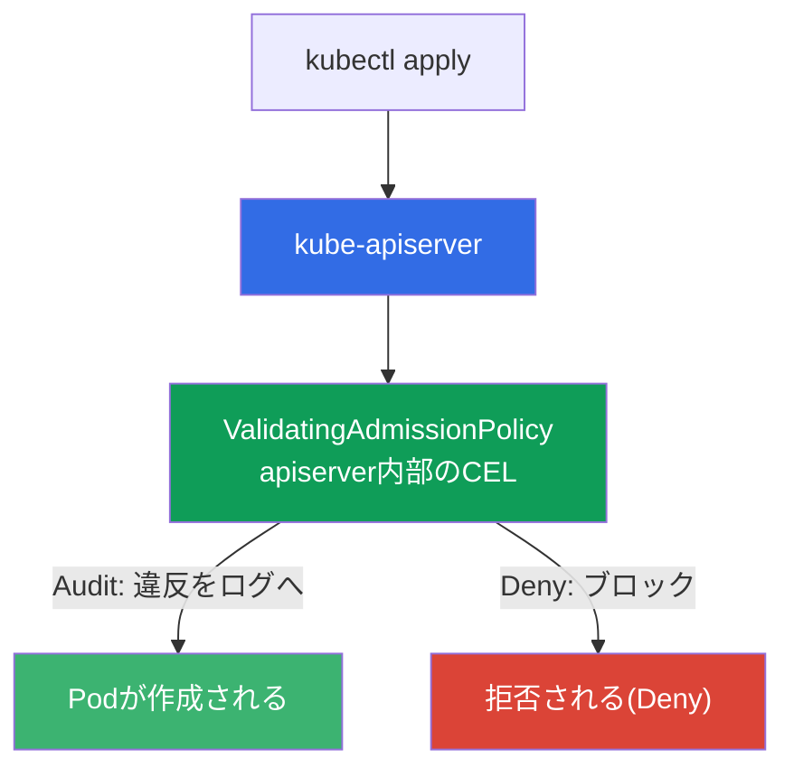
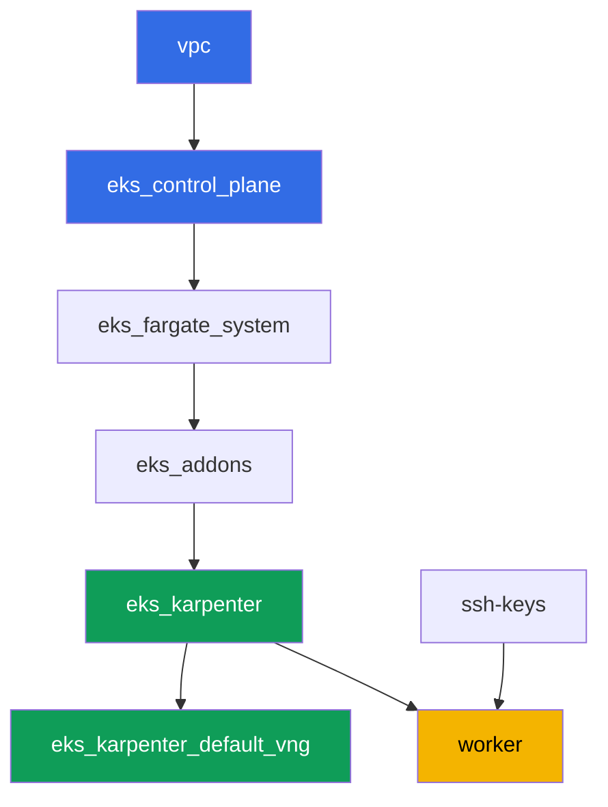

[Русская версия](README_RU.MD) · [Eng version](README.MD) · [Versión en español](README_ES.MD) · [Version française](README_FR.MD) · [Deutsche Version](README_DE.MD) · [ქართული ვერსია](README_GE.MD) · [繁體中文版](README_TW.MD)

# ラボ127 - エンジンなしのポリシー: CELによるValidatingAdmissionPolicy

## 説明

KyvernoとGatekeeperは、admission webhookを通じて動作する外部のpolicy engineです。自
分たちのルールを持ち込む一方で、応答しないかもしれない自分たちのサービスも持ち込みま
す。Kubernetesには組み込みの代替手段があります - `ValidatingAdmissionPolicy`。ここで
はCEL(Common Expression Language)によるルールがapiserverの内部で直接評価され、外部
サービスも「webhookが応答しなかった」というリスクもありません。

このラボでは、CELポリシーを書き、Audit -> Denyという導入パス(PSAやKyvernoと同じです
が、サードパーティのエンジンなしで)をたどり、`failurePolicy`が実際に何の責任を負って
いるのかを解き明かします。

タスクはプロダクションスタイルで記述されています: 短い課題文と受け入れ基準です。チェ
ックは`check_result`コマンドによって自動的に行われます。

## ゴール

コースの章の内容を定着させます:

- [第22章 ポリシーとマルチテナンシー: KyvernoとGatekeeper、チームの分離](../../course/22/ru.md) -
  policy engineの中でのValidatingAdmissionPolicyの位置づけ

## 作成するもの

クラスタはすでにコードとしてデプロイされています(ラボ101と同じベース)。このラボで
は、そこに2つのCEL admissionポリシーを追加し、テストpodでその挙動を確認します。

| オブジェクト | それが何か | このラボにある理由 |
|--------|---------|-------------------|
| Namespace `eks-127` | ラボのワークロード用のクラスタ区画 | ポリシーの適用範囲 |
| `ValidatingAdmissionPolicy` `disallow-latest-tag` | `:latest`タグに対するCELルール | 外部エンジンなしの自分のルール |
| `ValidatingAdmissionPolicyBinding`(Audit -> Deny) | ルールの適用モード | ワークロードにリスクのない導入パス |
| アーティファクト `denied.txt` | apiserverの拒否メッセージ | CEL違反のテキストを確認する |
| `ValidatingAdmissionPolicy` `require-resources-requests` | `resources.requests`に関するCELルール | 最初からDenyの2つ目のポリシー |
| アーティファクト `failurepolicy.txt` | `failurePolicy`の説明 | 責任の境界線: CELのエラーとwebhookの到達不能の違い |

組み込みのチェックがadmissionパイプラインにどう組み込まれるか:



## インフラストラクチャ

環境はTerragrunt経由でAWS(`eu-central-1`)にデプロイされています。ベースはラボ101と
一致します: ValidatingAdmissionPolicyには特別なコンポーネントは不要で、これはcontrol
planeバージョン`1.36`のapiserverに組み込まれた機能です(Kubernetes `1.30`から利用可
能)。

### モジュールと依存関係

| ディレクトリ(コンポーネント) | モジュール(`terraform/modules/`) | 依存先 | 作成するもの |
|---------------------|-------------------------------|------------|-------------|
| `vpc` | `vpc_v3` | - | VPC `10.10.0.0/16`、2つのAZのサブネット、NAT |
| `ssh-keys` | `ssh-keys` | - | ワーカーマシンとノード用のSSHキーペア |
| `eks_control_plane` | `eks_v2_control_plane` | `vpc` | EKS control plane `1.36`、OIDC、security groups |
| `eks_fargate_system` | `eks_v2_fargate` | `vpc`、`eks_control_plane` | `kube-system`と`karpenter`用のFargateプロファイル |
| `eks_addons` | `eks_v2_addons` | `eks_control_plane`、`eks_fargate_system` | coredns、kube-proxy、vpc-cni、pod-identityアドオン |
| `eks_karpenter` | `eks_v2_karpenter` | `vpc`、`eks_control_plane`、`eks_addons`、`eks_fargate_system` | Karpenterコントローラー、ノードIAMロール |
| `eks_karpenter_default_vng` | `eks_v2_karpenter_vng` | `vpc`、`eks_control_plane`、`eks_karpenter` | AL2023上のデフォルトのNodePool `default` |
| `worker` | `eks_v2_work_pc` | `ssh-keys`、`vpc`、`eks_control_plane`、`eks_karpenter` | kubectl、テスト、`check_result`を備えたワーカーマシン |

依存関係グラフ(矢印の下にあるほど先に適用される):



テストpod用のEC2ノードはKarpenterが起動し、システムpodはFargate上で実行されます -
ラボ101と同様です。すべての`ValidatingAdmissionPolicy`マニフェストはワーカーマシン上
で自分で書きます。このために追加のterraformコンポーネントは必要ありません。

### 設定箇所

`env.hcl`(共通の環境パラメータ):

| パラメータ | ラボでの値 | 影響範囲 |
|----------|-----------------|---------------|
| `region` | `eu-central-1` | すべてのリソースのリージョン |
| `prefix` | `eks-task127` | リソース名とタグのプレフィックス |
| `stack_name` | `eks127` | `env_name`(クラスタ名)の組み立てに使用 |
| `k8_version` | `1.36.0` | ワーカーマシン上のkubectlバージョン |
| `instance_type_worker` | `t3.medium` | ワーカーマシンのインスタンスタイプ |
| `ssh_password_enable`、`access_cidrs` | `true`、`0.0.0.0/0` | ワーカーマシンへのSSHアクセス |

各コンポーネントの`terragrunt.hcl`内の`inputs`:

| ファイル | 主要な設定 |
|------|--------------------|
| `eks_control_plane/terragrunt.hcl` | `eks.version = "1.36"`(ValidatingAdmissionPolicyは`1.30`から利用可能) |
| `eks_addons/terragrunt.hcl` | 1.36向けのアドオンバージョン |
| `eks_karpenter_default_vng/terragrunt.hcl` | テストpod用のデフォルトのNodePool |
| `worker/terragrunt.hcl` | `test_url`と`task_script_url`がこのラボのファイルを指す |

## デプロイ

```bash
TASK=127 make run_eks_task
```

デプロイには約15〜20分かかります。出力の中からワーカーマシンへのSSH接続の行を見つけ
て接続してください。そこではkubectlが対象のクラスタに対してすでに設定されています。

ワーカーマシン上で役立つコマンド:

```bash
time_left       # 環境の残り時間
check_result    # 解答を確認する
```

> 環境のセキュリティについて。`env.hcl`では`ssh_password_enable = true`と
> `access_cidrs = ["0.0.0.0/0"]`が有効になっています - トレーニング環境としては便利で
> すが、プロダクションでは行うべきではありません。コースの基準(第0.2章、第2章、第19
> 章)に従うと、ワーカーマシンへのアクセスは公開SSHポートを晒さずにAWS SSM Session
> Manager経由で行い、`access_cidrs`は特定のアドレスに絞り込むべきです。ここでは、セ
> ットアップを簡単にするためだけに公開SSHが残されています。

## タスク

---
|        **1**        | **ラボのワークロード用のNamespace**                             |
| :-----------------: | :---------------------------------------------------------- |
| 何をするか          | `eks-127`という名前のnamespaceを作成してください。このラボのすべてのオブジェクトはその中に作成されます。 |
| 受け入れ基準    | - namespace `eks-127`が存在する。 |
---
|        **2**        | **Auditモードのポリシー: `:latest`のpodは通過する**   |
| :-----------------: | :---------------------------------------------------------- |
| 何をするか          | `disallow-latest-tag`という名前の`ValidatingAdmissionPolicy`を作成してください: CEL式がpodに対して`:latest`タグのイメージを禁止します(`object.spec.containers.all(c, !c.image.endsWith(':latest'))`)、適用範囲はnamespace `eks-127`です。`validationActions: ["Audit"]`の`ValidatingAdmissionPolicyBinding` `disallow-latest-tag-binding`を作成してください。`eks-127`にイメージ`viktoruj/ping_pong:latest`のPod `latest-audit-pod`をデプロイしてください - `Audit`は違反を記録するだけでリクエストをブロックしないため、これは作成されるはずです。 |
| 受け入れ基準    | - `ValidatingAdmissionPolicy` `disallow-latest-tag`が存在する;<br/>- `eks-127`に`:latest`で終わるイメージのPod `latest-audit-pod`が作成されている。 |
---
|        **3**        | **Denyへの切り替え: `:latest`のpodは拒否される**          |
| :-----------------: | :---------------------------------------------------------- |
| 何をするか          | `disallow-latest-tag-binding`を更新し、`validationActions`を`["Deny"]`に変更してください(`kubectl apply`経由)。`eks-127`にイメージ`viktoruj/ping_pong:latest`のPod `latest-deny-pod`を作成しようとしてください - apiserverはこのリクエストを拒否するはずです。拒否メッセージ(`kubectl apply`のstderr)をファイル`/var/work/tests/artifacts/3/denied.txt`に保存してください。 |
| 受け入れ基準    | - `disallow-latest-tag-binding`の`validationActions`が`["Deny"]`である;<br/>- `eks-127`のPod `latest-deny-pod`が存在しない;<br/>- ファイル`denied.txt`が空でなく、`latest`と`запрещён`という単語を含んでいる。 |
---
|        **4**        | **明示的なタグを持つ正当なpodはDenyでも通過する**        |
| :-----------------: | :---------------------------------------------------------- |
| 何をするか          | `eks-127`に、イメージ`viktoruj/ping_pong:53833ea`(`:latest`ではない具体的なタグ)を持つPod `tagged-pod`を作成してください。`Deny`モードの`disallow-latest-tag`ポリシーがこのpodをブロックしないこと、そしてこのpodが`Running`に到達することを確認してください - タグはレジストリ内に実際に存在していなければなりません。そうでなければ許可は通過し、podは`ErrImagePull`のままになってしまい、「ポリシーは妨げない」という主張を確認する手立てがなくなってしまいます。 |
| 受け入れ基準    | - `eks-127`のPod `tagged-pod`が作成されており、イメージが`:latest`で終わっていない;<br/>- そのpodが`Running`状態である。 |
---
|        **5**        | **2つ目のCELポリシー: 必須のresources.requests**    |
| :-----------------: | :---------------------------------------------------------- |
| 何をするか          | `require-resources-requests`という`ValidatingAdmissionPolicy`を作成してください: CEL式が、すべてのコンテナに`resources.requests`が設定されていることを要求します(`object.spec.containers.all(c, has(c.resources) && has(c.resources.requests))`)、適用範囲は`eks-127`です。`validationActions: ["Deny"]`の`ValidatingAdmissionPolicyBinding` `require-resources-requests-binding`を作成してください。`resources.requests`を持たないPod `no-requests-pod`を作成しようとしてください - これは拒否されるはずです。`resources.requests`を設定したPod `requests-ok-pod`を作成してください - これは通過するはずです。 |
| 受け入れ基準    | - `ValidatingAdmissionPolicy` `require-resources-requests`とそのBindingが`Deny`である;<br/>- `eks-127`のPod `no-requests-pod`が存在しない;<br/>- `eks-127`に`resources.requests`が設定されたPod `requests-ok-pod`が作成されている。 |
---
|        **6**        | **failurePolicy: webhookなしの責任の境界**      |
| :-----------------: | :---------------------------------------------------------- |
| 何をするか          | `disallow-latest-tag`ポリシーに明示的に`spec.failurePolicy: Fail`を設定してください。組み込みの`ValidatingAdmissionPolicy`がKyvernoやGatekeeperに特有の「webhookが応答しなかった」というリスクを持たない理由を解き明かし、ファイル`/var/work/tests/artifacts/6/failurepolicy.txt`に説明を保存してください: CELはapiserverの内部で評価され、外部サービスの呼び出しはありません。テキストには`webhook`と`apiserver`という単語が含まれている必要があります。 |
| 受け入れ基準    | - `disallow-latest-tag`の`spec.failurePolicy`が`Fail`である;<br/>- ファイル`failurepolicy.txt`が空でなく、`webhook`と`apiserver`に言及している。 |
---

## 結果の確認

ワーカーマシン上で自動チェックを実行してください:

```bash
check_result
```

スクリプトはテストを実行し、完了したタスクの割合を表示します。

## ソリューション

参考解答: [worker/files/solutions/1_JP.MD](worker/files/solutions/1_JP.MD)

## クラスタとリソースの削除

> **admissionポリシーはnamespaceの外に存在します。** `ValidatingAdmissionPolicy`と
> `ValidatingAdmissionPolicyBinding`はクラスタレベルのオブジェクトなので、namespace
> `eks-127`を削除してもこれらは削除されません。これはスタックの解体には影響しません
> (control planeと一緒に消えます)が、同じクラスタでこのラボをもう一度実施したい場
> 合、`Deny`モードのまま残ったポリシーが、新しく作成したnamespaceでpodを作成する際に
> 拒否として出迎えることになります。このラボは手動でAWSリソースを作成しません。

```bash
# 1. ワークロードを取り除く
kubectl delete namespace eks-127 --ignore-not-found

# 2. admissionポリシーとそのbindingを取り除く - これらはクラスタスコープであり、
#    namespaceと一緒には消えない
kubectl delete validatingadmissionpolicybinding disallow-latest-tag-binding \
  require-resources-requests-binding --ignore-not-found
kubectl delete validatingadmissionpolicy disallow-latest-tag \
  require-resources-requests --ignore-not-found

# 3. Karpenterがテストpod配下のEC2ノードを取り除くのを待つ(fargate-*だけが残るはず)、
#    そうしないと孤立したセカンダリENIがノードのsecurity groupの削除を遅らせる
while kubectl get nodes --no-headers 2>/dev/null | grep -qv fargate; do
  echo "EC2ノードはまだ残っています、待機中..."; sleep 15
done
```

それが終わってから初めて、スタックを解体してください:

```bash
TASK=127 make delete_eks_task
```
