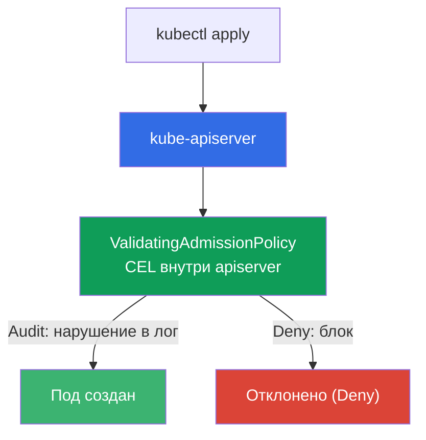
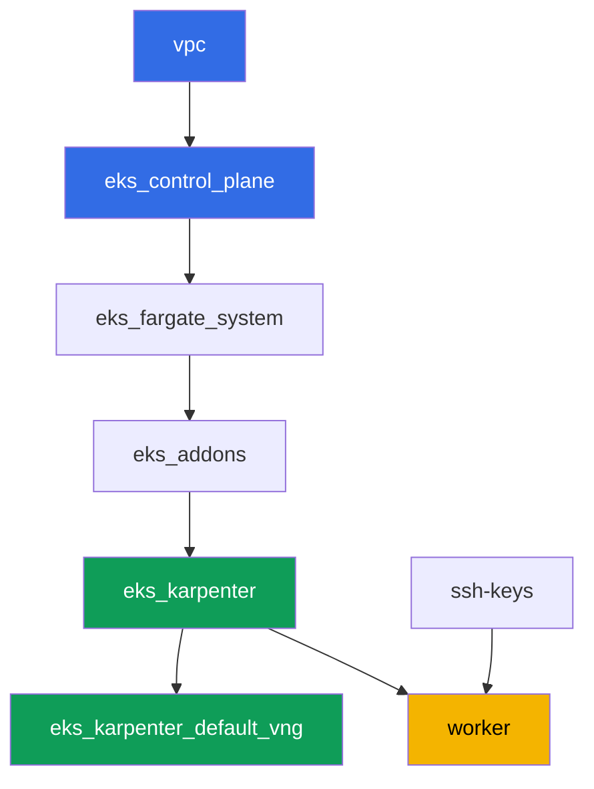

# Лаба 127 - Политики без движка: ValidatingAdmissionPolicy на CEL

## Описание

Kyverno и Gatekeeper - это внешние policy engine, работающие через admission webhook: свои
правила, но и свой сервис, который может не ответить. У Kubernetes есть встроенная
альтернатива - `ValidatingAdmissionPolicy`, где правило на CEL (Common Expression Language)
считается прямо внутри apiserver, без внешнего сервиса и без риска "webhook не ответил".

В этой лабе вы пишете CEL-политику, проходите путь внедрения Audit -> Deny (как с PSA и
Kyverno, только без стороннего движка) и разбираетесь, за что отвечает `failurePolicy`.

Задания в продакшн-стиле: короткая постановка плюс критерии приёмки. Проверка -
автоматическая, командой `check_result`.

## Цель

Закрепить материал главы курса:

- [Глава 22. Политики и мультитенантность: Kyverno и Gatekeeper, изоляция команд](../../course/22/ru.md) - место ValidatingAdmissionPolicy среди policy engine

## Что мы создаём

Кластер уже развёрнут как код (та же база, что в лабе 101). Вы добавляете в него две
CEL-политики допуска и проверяете их поведение на тестовых подах.

| Объект | Что это | Зачем в этой лабе |
|--------|---------|-------------------|
| Namespace `eks-127` | раздел кластера под нагрузку лабы | область действия политик |
| `ValidatingAdmissionPolicy` `disallow-latest-tag` | CEL-правило против тега `:latest` | своё правило без внешнего движка |
| `ValidatingAdmissionPolicyBinding` (Audit -> Deny) | режим применения правила | путь внедрения без риска для нагрузки |
| Артефакт `denied.txt` | сообщение apiserver об отказе | видим текст CEL-нарушения |
| `ValidatingAdmissionPolicy` `require-resources-requests` | CEL-правило про `resources.requests` | вторая политика сразу в Deny |
| Артефакт `failurepolicy.txt` | объяснение `failurePolicy` | граница ответственности: ошибка CEL против недоступности webhook |

Как встроенная проверка встаёт в конвейер допуска:



## Инфраструктура

Окружение разворачивается в AWS (`eu-central-1`) через Terragrunt. База совпадает с лабой
101: специальных компонентов под ValidatingAdmissionPolicy не требуется, это встроенная
возможность apiserver control plane версии `1.36` (доступна начиная с Kubernetes `1.30`).

### Модули и зависимости

| Каталог (компонент) | Модуль (`terraform/modules/`) | Зависит от | Что создаёт |
|---------------------|-------------------------------|------------|-------------|
| `vpc` | `vpc_v3` | - | VPC `10.10.0.0/16`, подсети в двух AZ, NAT |
| `ssh-keys` | `ssh-keys` | - | пара SSH-ключей для рабочей машины и нод |
| `eks_control_plane` | `eks_v2_control_plane` | `vpc` | control plane EKS `1.36`, OIDC, security groups |
| `eks_fargate_system` | `eks_v2_fargate` | `vpc`, `eks_control_plane` | Fargate-профиль для `kube-system` и `karpenter` |
| `eks_addons` | `eks_v2_addons` | `eks_control_plane`, `eks_fargate_system` | аддоны coredns, kube-proxy, vpc-cni, pod-identity |
| `eks_karpenter` | `eks_v2_karpenter` | `vpc`, `eks_control_plane`, `eks_addons`, `eks_fargate_system` | контроллер Karpenter, IAM-роль нод |
| `eks_karpenter_default_vng` | `eks_v2_karpenter_vng` | `vpc`, `eks_control_plane`, `eks_karpenter` | дефолтный NodePool `default` на AL2023 |
| `worker` | `eks_v2_work_pc` | `ssh-keys`, `vpc`, `eks_control_plane`, `eks_karpenter` | рабочая машина с kubectl, тестами и `check_result` |

Граф зависимостей (что применяется раньше, то ниже по стрелке):



EC2-ноды под тестовые поды поднимает Karpenter, системные поды идут на Fargate - как в
лабе 101. Все манифесты `ValidatingAdmissionPolicy` вы пишете сами на рабочей машине,
никаких дополнительных terraform-компонентов для этого не требуется.

### Где что настраивается

`env.hcl` (общие параметры окружения):

| Параметр | Значение в лабе | На что влияет |
|----------|-----------------|---------------|
| `region` | `eu-central-1` | регион всех ресурсов |
| `prefix` | `eks-task127` | префикс имён ресурсов и тегов |
| `stack_name` | `eks127` | из него собирается `env_name` - имя кластера |
| `k8_version` | `1.36.0` | версия kubectl на рабочей машине |
| `instance_type_worker` | `t3.medium` | тип инстанса рабочей машины |
| `ssh_password_enable`, `access_cidrs` | `true`, `0.0.0.0/0` | доступ по SSH к рабочей машине |

`inputs` в `terragrunt.hcl` каждого компонента:

| Файл | Ключевые настройки |
|------|--------------------|
| `eks_control_plane/terragrunt.hcl` | `eks.version = "1.36"` (ValidatingAdmissionPolicy доступна с `1.30`) |
| `eks_addons/terragrunt.hcl` | версии аддонов под 1.36 |
| `eks_karpenter_default_vng/terragrunt.hcl` | дефолтный NodePool для тестовых подов |
| `worker/terragrunt.hcl` | `test_url` и `task_script_url` на файлы лабы 127 |

## Развёртывание

```bash
TASK=127 make run_eks_task
```

Развёртывание занимает примерно 15-20 минут. В выводе найдите строку с SSH-подключением к
рабочей машине и подключитесь к ней. kubectl там уже настроен на нужный кластер.

Полезные команды на рабочей машине:

```bash
time_left       # сколько осталось времени окружения
check_result    # проверить решение
```

> Безопасность стенда. В `env.hcl` включены `ssh_password_enable = true` и
> `access_cidrs = ["0.0.0.0/0"]` - это удобно для учебного окружения, но так делать в
> продакшене нельзя. По стандартам курса (главы 0.2, 2, 19) доступ к рабочим машинам
> открывают через AWS SSM Session Manager без публичных SSH-портов наружу, а `access_cidrs`
> сужают до конкретных адресов. Здесь публичный SSH оставлен только ради простоты запуска.

## Задания

---
|        **1**        | **Namespace для нагрузки лабы**                             |
| :-----------------: | :---------------------------------------------------------- |
| Что делаем          | Создайте namespace с именем `eks-127`. Все объекты лабы создаются внутри него. |
| Критерии приёмки    | - namespace `eks-127` существует. |
---
|        **2**        | **CEL-политика в режиме Audit: под с `:latest` проходит**   |
| :-----------------: | :---------------------------------------------------------- |
| Что делаем          | Создайте `ValidatingAdmissionPolicy` с именем `disallow-latest-tag`: CEL-выражение запрещает у подов образ с тегом `:latest` (`object.spec.containers.all(c, !c.image.endsWith(':latest'))`), область действия - namespace `eks-127`. Создайте `ValidatingAdmissionPolicyBinding` `disallow-latest-tag-binding` со `validationActions: ["Audit"]`. Задеплойте Pod `latest-audit-pod` с образом `viktoruj/ping_pong:latest` в `eks-127` - он должен СОЗДАТЬСЯ, так как `Audit` только фиксирует нарушение, не блокируя запрос. |
| Критерии приёмки    | - `ValidatingAdmissionPolicy` `disallow-latest-tag` существует;<br/>- Pod `latest-audit-pod` в `eks-127` с образом, оканчивающимся на `:latest`, создан. |
---
|        **3**        | **Переключение на Deny: под с `:latest` отклонён**          |
| :-----------------: | :---------------------------------------------------------- |
| Что делаем          | Обновите `disallow-latest-tag-binding`, поменяв `validationActions` на `["Deny"]` (через `kubectl apply`). Попытайтесь создать Pod `latest-deny-pod` с образом `viktoruj/ping_pong:latest` в `eks-127` - apiserver должен ОТКЛОНИТЬ запрос. Сохраните сообщение об отклонении (stderr `kubectl apply`) в файл `/var/work/tests/artifacts/3/denied.txt`. |
| Критерии приёмки    | - `disallow-latest-tag-binding` имеет `validationActions: ["Deny"]`;<br/>- Pod `latest-deny-pod` в `eks-127` НЕ существует;<br/>- файл `denied.txt` не пуст и содержит слова `latest` и `запрещён`. |
---
|        **4**        | **Легитимный под с явным тегом проходит и при Deny**        |
| :-----------------: | :---------------------------------------------------------- |
| Что делаем          | Создайте Pod `tagged-pod` в `eks-127` с образом `viktoruj/ping_pong:1.0` (конкретный тег, не `:latest`). Убедитесь, что политика `disallow-latest-tag` в режиме `Deny` не мешает этому поду. |
| Критерии приёмки    | - Pod `tagged-pod` в `eks-127` создан, образ не оканчивается на `:latest`. |
---
|        **5**        | **Вторая CEL-политика: обязательные resources.requests**    |
| :-----------------: | :---------------------------------------------------------- |
| Что делаем          | Создайте `ValidatingAdmissionPolicy` `require-resources-requests`: CEL-выражение требует, чтобы у каждого контейнера были заданы `resources.requests` (`object.spec.containers.all(c, has(c.resources) && has(c.resources.requests))`), область действия - `eks-127`. Создайте `ValidatingAdmissionPolicyBinding` `require-resources-requests-binding` со `validationActions: ["Deny"]`. Попытайтесь создать Pod `no-requests-pod` без `resources.requests` - он должен быть ОТКЛОНЁН. Создайте Pod `requests-ok-pod` с заданными `resources.requests` - он должен пройти. |
| Критерии приёмки    | - `ValidatingAdmissionPolicy` `require-resources-requests` и её Binding в `Deny`;<br/>- Pod `no-requests-pod` в `eks-127` НЕ существует;<br/>- Pod `requests-ok-pod` в `eks-127` создан с заданными `resources.requests`. |
---
|        **6**        | **failurePolicy: граница ответственности без webhook**      |
| :-----------------: | :---------------------------------------------------------- |
| Что делаем          | Явно выставьте `spec.failurePolicy: Fail` на политике `disallow-latest-tag`. Разберитесь и сохраните в файл `/var/work/tests/artifacts/6/failurepolicy.txt` объяснение, почему у встроенной `ValidatingAdmissionPolicy` нет риска "webhook не ответил", характерного для Kyverno и Gatekeeper: CEL считается внутри apiserver, без вызова внешнего сервиса. В тексте должны быть слова `webhook` и `apiserver`. |
| Критерии приёмки    | - `disallow-latest-tag` имеет `spec.failurePolicy: Fail`;<br/>- файл `failurepolicy.txt` не пуст и упоминает `webhook` и `apiserver`. |
---

## Проверка результата

На рабочей машине запустите автоматическую проверку:

```bash
check_result
```

Скрипт прогонит тесты и покажет процент выполненных заданий.

## Решение

Эталонное решение: [worker/files/solutions/1.MD](worker/files/solutions/1.MD)

## Удаление кластера и ресурсов

```bash
TASK=127 make delete_eks_task
```
