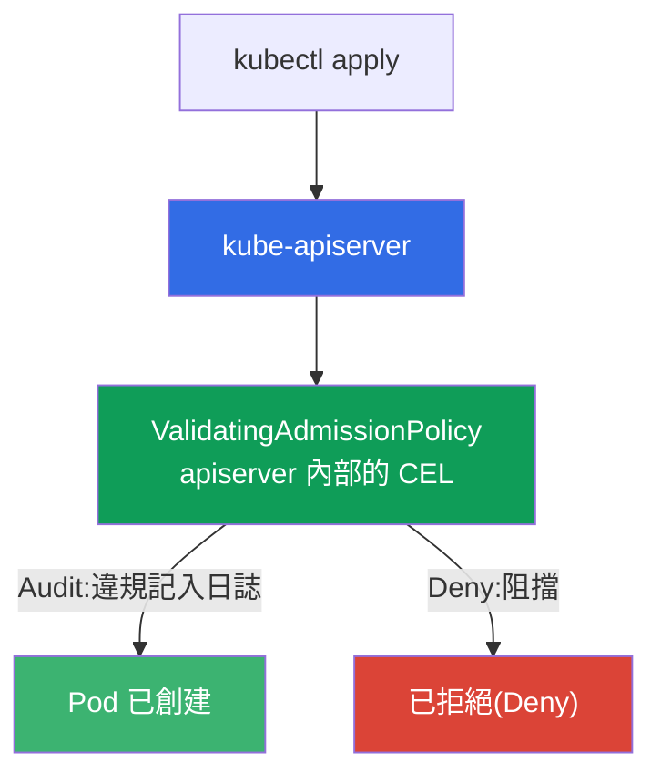
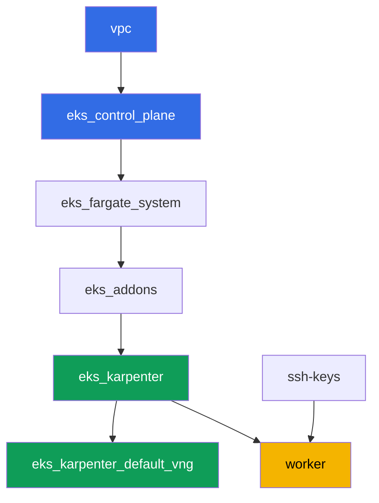

[Русская версия](README_RU.MD) · [Eng version](README.MD) · [Versión en español](README_ES.MD) · [Version française](README_FR.MD) · [Deutsche Version](README_DE.MD) · [ქართული ვერსია](README_GE.MD) · [日本語版](README_JP.MD)

# 實驗 127 - 沒有引擎的政策:CEL 上的 ValidatingAdmissionPolicy

## 說明

Kyverno 和 Gatekeeper 是透過 admission webhook 運作的外部 policy engine:它們帶來自己
的規則,但也帶來自己的服務,而這個服務可能不會回應。Kubernetes 有一個內建的替代方案 -
`ValidatingAdmissionPolicy`,其中用 CEL(Common Expression Language)寫的規則直接在
apiserver 內部計算,不需要外部服務,也沒有「webhook 沒有回應」的風險。

在這個實驗中,你會撰寫一個 CEL 政策,走過 Audit -> Deny 的推行路徑(和 PSA、Kyverno 一
樣,只是沒有第三方引擎),並弄清楚 `failurePolicy` 到底負責什麼。

任務以生產風格編寫:簡短的任務描述加驗收標準。驗證是自動的,透過 `check_result` 命令
完成。

## 目標

鞏固以下課程章節的內容:

- [第 22 章。政策與多租戶:Kyverno 與 Gatekeeper,團隊隔離](../../course/22/tw.md) -
  ValidatingAdmissionPolicy 在 policy engine 中的位置

## 我們要創建什麼

集群已經以程式碼形式部署完成(與實驗 101 相同的基礎)。你會為它添加兩個 CEL 准入政
策,並在測試 pod 上驗證它們的行為。

| 對象 | 這是什麼 | 在這個實驗中的作用 |
|--------|---------|-------------------|
| Namespace `eks-127` | 集群中供這個實驗負載使用的區段 | 政策的作用範圍 |
| `ValidatingAdmissionPolicy` `disallow-latest-tag` | 針對 `:latest` 標籤的 CEL 規則 | 沒有外部引擎的自訂規則 |
| `ValidatingAdmissionPolicyBinding`(Audit -> Deny) | 規則的執行模式 | 對負載沒有風險的推行路徑 |
| 產物 `denied.txt` | apiserver 的拒絕訊息 | 看到 CEL 違規的文字內容 |
| `ValidatingAdmissionPolicy` `require-resources-requests` | 關於 `resources.requests` 的 CEL 規則 | 第二個直接進入 Deny 的政策 |
| 產物 `failurepolicy.txt` | `failurePolicy` 的說明 | 責任邊界:CEL 計算錯誤與 webhook 無法連線的差異 |

內建檢查如何嵌入准入流程:



## 基礎設施

環境透過 Terragrunt 部署在 AWS(`eu-central-1`)。基礎與實驗 101 相同:
ValidatingAdmissionPolicy 不需要任何特殊組件,它是 control plane 版本 `1.36` 的
apiserver 內建功能(從 Kubernetes `1.30` 開始可用)。

### 模組與依賴關係

| 目錄(組件) | 模組(`terraform/modules/`) | 依賴於 | 創建了什麼 |
|---------------------|-------------------------------|------------|-------------|
| `vpc` | `vpc_v3` | - | VPC `10.10.0.0/16`,兩個 AZ 中的子網,NAT |
| `ssh-keys` | `ssh-keys` | - | 供工作機與節點使用的一對 SSH 金鑰 |
| `eks_control_plane` | `eks_v2_control_plane` | `vpc` | EKS control plane `1.36`、OIDC、security groups |
| `eks_fargate_system` | `eks_v2_fargate` | `vpc`、`eks_control_plane` | `kube-system` 與 `karpenter` 的 Fargate 配置檔 |
| `eks_addons` | `eks_v2_addons` | `eks_control_plane`、`eks_fargate_system` | coredns、kube-proxy、vpc-cni、pod-identity 附加元件 |
| `eks_karpenter` | `eks_v2_karpenter` | `vpc`、`eks_control_plane`、`eks_addons`、`eks_fargate_system` | Karpenter 控制器、節點 IAM 角色 |
| `eks_karpenter_default_vng` | `eks_v2_karpenter_vng` | `vpc`、`eks_control_plane`、`eks_karpenter` | 基於 AL2023 的預設 NodePool `default` |
| `worker` | `eks_v2_work_pc` | `ssh-keys`、`vpc`、`eks_control_plane`、`eks_karpenter` | 帶有 kubectl、測試腳本和 `check_result` 的工作機 |

依賴關係圖(較早套用的組件位於箭頭下方):



供測試 pod 使用的 EC2 節點由 Karpenter 拉起,系統 pod 運行在 Fargate 上 - 與實驗 101 相
同。所有 `ValidatingAdmissionPolicy` manifest 都由你自己在工作機上撰寫,不需要任何額
外的 terraform 組件。

### 哪裡配置了什麼

`env.hcl`(環境的共用參數):

| 參數 | 這個實驗中的值 | 影響的內容 |
|----------|-----------------|---------------|
| `region` | `eu-central-1` | 所有資源的區域 |
| `prefix` | `eks-task127` | 資源名稱與標籤的前綴 |
| `stack_name` | `eks127` | 用來組成 `env_name` - 集群名稱 |
| `k8_version` | `1.36.0` | 工作機上的 kubectl 版本 |
| `instance_type_worker` | `t3.medium` | 工作機的 instance 類型 |
| `ssh_password_enable`、`access_cidrs` | `true`、`0.0.0.0/0` | 對工作機的 SSH 存取 |

每個組件 `terragrunt.hcl` 中的 `inputs`:

| 檔案 | 關鍵設定 |
|------|--------------------|
| `eks_control_plane/terragrunt.hcl` | `eks.version = "1.36"`(ValidatingAdmissionPolicy 從 `1.30` 開始可用) |
| `eks_addons/terragrunt.hcl` | 對應 1.36 的附加元件版本 |
| `eks_karpenter_default_vng/terragrunt.hcl` | 供測試 pod 使用的預設 NodePool |
| `worker/terragrunt.hcl` | `test_url` 和 `task_script_url` 指向這個實驗的檔案 |

## 部署

```bash
TASK=127 make run_eks_task
```

部署大約需要 15-20 分鐘。在輸出中找到連接工作機的 SSH 那一行並連接上去。那裡的
kubectl 已經配置好對應的集群。

工作機上的常用命令:

```bash
time_left       # 環境剩餘的時間
check_result    # 檢查解答
```

> 環境安全性。`env.hcl` 中啟用了 `ssh_password_enable = true` 和
> `access_cidrs = ["0.0.0.0/0"]` - 這對於學習環境很方便,但在生產環境中不應該這樣做。
> 依照課程標準(第 0.2、2、19 章),對工作機的存取應透過 AWS SSM Session Manager 進
> 行,不對外暴露公開的 SSH 端口,並將 `access_cidrs` 限制到具體的位址。這裡保留公開
> SSH 只是為了簡化啟動流程。

## 任務

---
|        **1**        | **這個實驗負載用的 Namespace**                             |
| :-----------------: | :---------------------------------------------------------- |
| 我們要做什麼          | 創建一個名為 `eks-127` 的 namespace。這個實驗的所有對象都創建在它內部。 |
| 驗收標準    | - namespace `eks-127` 存在。 |
---
|        **2**        | **Audit 模式下的 CEL 政策:帶有 `:latest` 的 pod 能通過**   |
| :-----------------: | :---------------------------------------------------------- |
| 我們要做什麼          | 創建一個名為 `disallow-latest-tag` 的 `ValidatingAdmissionPolicy`:一個 CEL 表達式禁止 pod 使用帶有 `:latest` 標籤的映像(`object.spec.containers.all(c, !c.image.endsWith(':latest'))`),作用範圍為 namespace `eks-127`。創建一個 `validationActions: ["Audit"]` 的 `ValidatingAdmissionPolicyBinding` `disallow-latest-tag-binding`。在 `eks-127` 中部署映像為 `viktoruj/ping_pong:latest` 的 Pod `latest-audit-pod` - 它應該被創建,因為 `Audit` 只記錄違規而不阻擋請求。 |
| 驗收標準    | - `ValidatingAdmissionPolicy` `disallow-latest-tag` 存在;<br/>- `eks-127` 中映像以 `:latest` 結尾的 Pod `latest-audit-pod` 已創建。 |
---
|        **3**        | **切換到 Deny:帶有 `:latest` 的 pod 被拒絕**          |
| :-----------------: | :---------------------------------------------------------- |
| 我們要做什麼          | 更新 `disallow-latest-tag-binding`,將 `validationActions` 改為 `["Deny"]`(透過 `kubectl apply`)。嘗試在 `eks-127` 中創建映像為 `viktoruj/ping_pong:latest` 的 Pod `latest-deny-pod` - apiserver 應該拒絕這個請求。把拒絕訊息(`kubectl apply` 的 stderr)保存到檔案 `/var/work/tests/artifacts/3/denied.txt`。 |
| 驗收標準    | - `disallow-latest-tag-binding` 的 `validationActions` 為 `["Deny"]`;<br/>- `eks-127` 中的 Pod `latest-deny-pod` 不存在;<br/>- 檔案 `denied.txt` 不為空,且包含 `latest` 和 `forbidden` 這兩個詞。 |
---
|        **4**        | **帶有明確標籤的合法 pod 即使在 Deny 下也能通過**        |
| :-----------------: | :---------------------------------------------------------- |
| 我們要做什麼          | 在 `eks-127` 中創建映像為 `viktoruj/ping_pong:53833ea`(一個具體的標籤,不是 `:latest`)的 Pod `tagged-pod`。確認 `Deny` 模式下的 `disallow-latest-tag` 政策不會阻擋這個 pod,並且這個 pod 能到達 `Running` 狀態 - 標籤必須真的存在於倉庫中,否則准入會通過,而 pod 會停留在 `ErrImagePull`,「政策沒有阻擋」這個說法就無法被驗證。 |
| 驗收標準    | - `eks-127` 中的 Pod `tagged-pod` 已創建,映像不以 `:latest` 結尾;<br/>- 該 pod 處於 `Running` 狀態。 |
---
|        **5**        | **第二個 CEL 政策:強制要求 resources.requests**    |
| :-----------------: | :---------------------------------------------------------- |
| 我們要做什麼          | 創建一個 `ValidatingAdmissionPolicy` `require-resources-requests`:一個 CEL 表達式要求每個容器都設定了 `resources.requests`(`object.spec.containers.all(c, has(c.resources) && has(c.resources.requests))`),作用範圍為 `eks-127`。創建一個 `validationActions: ["Deny"]` 的 `ValidatingAdmissionPolicyBinding` `require-resources-requests-binding`。嘗試創建沒有 `resources.requests` 的 Pod `no-requests-pod` - 它應該被拒絕。創建設定了 `resources.requests` 的 Pod `requests-ok-pod` - 它應該能通過。 |
| 驗收標準    | - `ValidatingAdmissionPolicy` `require-resources-requests` 及其 Binding 處於 `Deny`;<br/>- `eks-127` 中的 Pod `no-requests-pod` 不存在;<br/>- `eks-127` 中設定了 `resources.requests` 的 Pod `requests-ok-pod` 已創建。 |
---
|        **6**        | **failurePolicy:沒有 webhook 情況下的責任邊界**      |
| :-----------------: | :---------------------------------------------------------- |
| 我們要做什麼          | 在 `disallow-latest-tag` 政策上明確設定 `spec.failurePolicy: Fail`。弄清楚並保存到檔案 `/var/work/tests/artifacts/6/failurepolicy.txt` 一段說明:為什麼內建的 `ValidatingAdmissionPolicy` 沒有 Kyverno 和 Gatekeeper 常見的「webhook 沒有回應」風險:CEL 是在 apiserver 內部計算的,不需要呼叫外部服務。文字中必須包含 `webhook` 和 `apiserver` 這兩個詞。 |
| 驗收標準    | - `disallow-latest-tag` 的 `spec.failurePolicy` 為 `Fail`;<br/>- 檔案 `failurepolicy.txt` 不為空,且提到 `webhook` 和 `apiserver`。 |
---

## 檢查結果

在工作機上執行自動檢查:

```bash
check_result
```

腳本會執行測試,並顯示已完成任務的百分比。

## 解決方案

參考解決方案:[worker/files/solutions/1_TW.MD](worker/files/solutions/1_TW.MD)

## 刪除集群與資源

> **准入政策存在於 namespace 之外。** `ValidatingAdmissionPolicy` 和
> `ValidatingAdmissionPolicyBinding` 是集群層級的對象,所以刪除 namespace `eks-127`
> 並不會移除它們。這不會影響環境的拆除(它們會隨著 control plane 一起消失),但如果
> 你想在同一個集群上重做這個實驗,一個殘留在 `Deny` 模式下的政策會在你於新創建的
> namespace 中創建 pod 時,以拒絕來迎接你。這個實驗不會手動創建任何 AWS 資源。

```bash
# 1. 移除負載
kubectl delete namespace eks-127 --ignore-not-found

# 2. 移除准入政策和它們的 binding - 它們是集群層級的,namespace 不會把它們一起帶走
kubectl delete validatingadmissionpolicybinding disallow-latest-tag-binding \
  require-resources-requests-binding --ignore-not-found
kubectl delete validatingadmissionpolicy disallow-latest-tag \
  require-resources-requests --ignore-not-found

# 3. 等待 Karpenter 移除測試 pod 所在的 EC2 節點(應該只剩下 fargate-*),否則一個
#    孤立的次要 ENI 會延遲節點 security group 的刪除
while kubectl get nodes --no-headers 2>/dev/null | grep -qv fargate; do
  echo "EC2 節點仍然存在,等待中..."; sleep 15
done
```

只有在此之後,才能拆除這個環境:

```bash
TASK=127 make delete_eks_task
```
