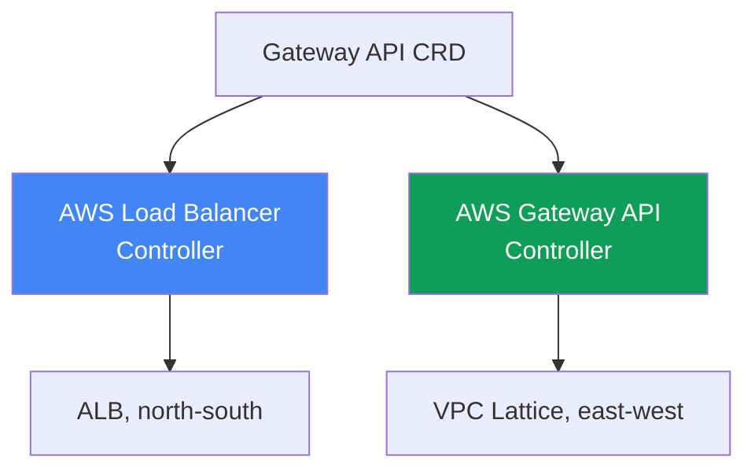
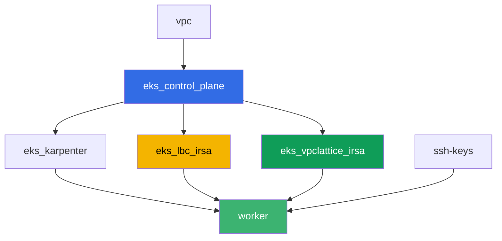

[Русская версия](README_RU.MD) · [Versión en español](README_ES.MD) · [Version française](README_FR.MD) · [Deutsche Version](README_DE.MD) · [ქართული ვერსია](README_GE.MD) · [繁體中文版](README_TW.MD) · [日本語版](README_JP.MD)

# Lab 128 - Gateway API on AWS: ALB Gateway API and VPC Lattice

## Description

An Ingress with a dozen `alb.ingress.kubernetes.io/` annotations mixes application
routing and load balancer settings into a single object, and the platform team and the
developer end up editing the same file. Gateway API introduces roles and typed objects:
the platform sets up `GatewayClass`, the platform team owns `Gateway`, and the developer
owns `HTTPRoute`. In this lab you work through both Gateway API implementations on AWS -
the AWS Load Balancer Controller on top of ALB for external ingress, and the AWS Gateway
API Controller on top of VPC Lattice for service-to-service traffic across namespaces
without hitting the perimeter - and you reproduce a typical symptom where a route doesn't
get applied because the backend's owner hasn't granted permission via `ReferenceGrant`.

Tasks are written in a production style: a short statement plus acceptance criteria.
Checking is automatic, via the `check_result` command.

## Goal

Reinforce the material from the course chapter:

- [Chapter 28. Gateway API on AWS: ALB Gateway API and VPC
  Lattice](../../course/28/en.md)

## What we're creating

The cluster is already deployed as code (control plane, Fargate for system pods,
Karpenter for the workload). Terraform additionally creates two IRSA IAM roles - for the
AWS Load Balancer Controller and for the AWS Gateway API Controller. You install both
controllers and the Gateway API CRDs, then create Gateway API objects for both
implementations.

| Object | What it is | Why it's in this lab |
|--------|---------|-------------------|
| Namespace `eks-128` | a cluster section for the lab's workload | keeps resources separate from system ones |
| GatewayClass `aws-alb` | the `gateway.k8s.aws/alb` class | links Gateway to the AWS Load Balancer Controller |
| Gateway `web` + HTTPRoute `app` | L7 ingress on top of ALB | infrastructure owner is the platform, route owner is the developer |
| `TargetGroupConfiguration` `frontend` and `backend` | target group settings for a Service | typed replacement for the `alb.ingress.kubernetes.io/target-type` annotation |
| GatewayClass `amazon-vpc-lattice` | the VPC Lattice controller class | links Gateway to the AWS Gateway API Controller |
| Gateway `eks-task128-mesh` (class `amazon-vpc-lattice`) | a VPC Lattice Service Network | east-west connectivity between namespaces with no perimeter |
| Deployment `backend` in `eks-128-backend` | a target service for HTTPRoute | shows a cross-namespace reference and `ReferenceGrant` |
| HTTPRoute `rates` in `eks-128` | a route to `backend` in another namespace through Gateway `web` | reproduces the `RefNotPermitted` symptom without a `ReferenceGrant` |
| HTTPRoute `rates-lattice` in `eks-128` | the same route through the VPC Lattice Gateway | control experiment: this implementation doesn't check the grant |
| `ReferenceGrant` in `eks-128-backend` | permission for the cross-namespace reference | fixes the symptom, route `rates` gets `ResolvedRefs: True` |

Two Gateway API implementations side by side:



## Infrastructure

The environment is deployed in AWS (`eu-central-1`) via Terragrunt. Each lab directory is
a single component with its own `terragrunt.hcl`, which references the shared module in
`terraform/modules/` and declares dependencies through `dependency` blocks. The base is
the same as in lab 101 (control plane, Fargate for system pods, Karpenter for the
workload), plus two IRSA roles for the controllers.

### Modules and dependencies

| Directory (component) | Module (`terraform/modules/`) | Depends on | What it creates |
|---------------------|-------------------------------|------------|-------------|
| `vpc` | `vpc_v3` | - | VPC `10.10.0.0/16`, subnets in two AZs, NAT |
| `ssh-keys` | `ssh-keys` | - | an SSH key pair for the worker machine |
| `eks_control_plane` | `eks_v2_control_plane` | `vpc` | EKS control plane `1.36`, OIDC provider |
| `eks_fargate_system` | `eks_v2_fargate` | `vpc`, `eks_control_plane` | Fargate profile for `kube-system` and `karpenter` |
| `eks_addons` | `eks_v2_addons` | `eks_control_plane`, `eks_fargate_system` | coredns, kube-proxy, vpc-cni, pod-identity |
| `eks_karpenter` | `eks_v2_karpenter` | `vpc`, `eks_control_plane`, `eks_addons`, `eks_fargate_system` | Karpenter controller, node IAM role |
| `eks_karpenter_default_vng` | `eks_v2_karpenter_vng` | `vpc`, `eks_control_plane`, `eks_karpenter` | default NodePool `default` on AL2023 |
| `eks_lbc_irsa` | `eks_v2_lbc_irsa` | `eks_control_plane` | IRSA IAM role for the AWS Load Balancer Controller |
| `eks_vpclattice_irsa` | `eks_v2_vpclattice_irsa` | `eks_control_plane` | IRSA IAM role for the AWS Gateway API Controller |
| `worker` | `eks_v2_work_pc` | `ssh-keys`, `vpc`, `eks_control_plane`, `eks_karpenter`, `eks_lbc_irsa`, `eks_vpclattice_irsa` | worker machine with kubectl, tests and `check_result` |

The `eks_v2_vpclattice_irsa` module was built after the pattern of `eks_v2_lbc_irsa`: an
IAM role with a trust policy on the cluster's OIDC (a `sub` condition on
`system:serviceaccount:aws-application-networking-system:gateway-api-controller`) and an
inline policy copied from `recommended-inline-policy.json` in the official
`aws/aws-application-networking-k8s` repository (`vpc-lattice:*` permission plus
VPC/subnet/SG describe calls, log delivery, tags, and ACM certificates for
`IAMAuthPolicy`).

Dependency graph (what gets applied earlier is lower down the arrow):



Components `eks_fargate_system`, `eks_addons`, `eks_karpenter_default_vng` are left out of
the graph above for readability (no more than 8 nodes) - they get applied in the standard
order between `eks_control_plane` and `eks_karpenter`, same as in lab 101.

### Worker permissions for this lab

The worker role (`eks_v2_work_pc/iam.tf`) already had broad `ec2:Describe*` and `eks:*`
permissions. For VPC Lattice diagnostics in this lab, one additional `Sid`
`VpcLatticeReadForLabs` was added with `vpc-lattice:List*`, `vpc-lattice:Get*` and
`ec2:DescribeManagedPrefixLists` permissions (needed to find the VPC Lattice managed
prefix list for the security group rule) - following the pattern of the existing `Sid`
entries in this file, without changing the rest of the policy.

## Deployment

```bash
TASK=128 make run_eks_task
```

Deployment takes roughly 15-20 minutes. In the output, find the line with the SSH
connection to the worker machine and connect to it. kubectl there is already configured
on the target cluster.

Useful commands on the worker machine:

```bash
time_left       # how much environment time is left
check_result    # check the solution
```

> Environment security. `env.hcl` has `ssh_password_enable = true` and
> `access_cidrs = ["0.0.0.0/0"]` enabled - convenient for a training environment, but this
> is not something to do in production. Per the course standards (chapters 0.2, 2, 19),
> access to worker machines should go through AWS SSM Session Manager without exposing
> public SSH ports, and `access_cidrs` should be narrowed down to specific addresses. Here
> public SSH is left in place only to keep the setup simple.

## Tasks

---
|        **1**        | **Gateway API CRDs and the lab's namespaces**                |
| :-----------------: | :---------------------------------------------------------- |
| What to do          | Install the standard Gateway API CRDs (`kubectl apply --server-side=true -f https://github.com/kubernetes-sigs/gateway-api/releases/download/v1.2.0/standard-install.yaml`). Create namespaces `eks-128` and `eks-128-backend`. |
| Acceptance criteria    | - CRD `gateways.gateway.networking.k8s.io` exists;<br/>- namespaces `eks-128` and `eks-128-backend` exist. |
---
|        **2**        | **AWS Load Balancer Controller and a Gateway of the ALB class (L7)**  |
| :-----------------: | :---------------------------------------------------------- |
| What to do          | Find the ARN of the `<cluster-name>-lbc-irsa` role and create ServiceAccount `aws-load-balancer-controller` in `kube-system` annotated with it. Install the AWS Load Balancer Controller via Helm (repository `https://aws.github.io/eks-charts`, chart `aws-load-balancer-controller`, flags `--set serviceAccount.create=false --set serviceAccount.name=aws-load-balancer-controller --set clusterName=<cluster> --set region=eu-central-1 --set vpcId=<vpc-id>`). The last two flags are mandatory: the controller's pod lands in `kube-system`, and that namespace runs on Fargate, which has no IMDS, so without explicit values the controller ends up in `CrashLoopBackOff` with `failed to get VPC ID ... ec2imds`. Create `GatewayClass` `aws-alb` (`controllerName: gateway.k8s.aws/alb`), then `Gateway` `web` in `eks-128` (`gatewayClassName: aws-alb`, an `http` listener on port `80`). Wait for `status.conditions` to show `type: Programmed`, `status: "True"` - the ALB becomes active in 3-4 minutes. |
| Acceptance criteria    | - Deployment `aws-load-balancer-controller` in `kube-system` has at least one ready replica;<br/>- `GatewayClass` `aws-alb` with `controllerName: gateway.k8s.aws/alb`;<br/>- `Gateway` `web` in `eks-128` has condition `Programmed: True`. |
---
|        **3**        | **HTTPRoute on ALB: application routing**                     |
| :-----------------: | :---------------------------------------------------------- |
| What to do          | In `eks-128` create Deployment `frontend` (image `viktoruj/ping_pong:latest`, `2` replicas, port `8080`) and Service `frontend` (`ClusterIP`, port `80`, `targetPort: 8080`). Create `HTTPRoute` `app` in `eks-128`, `parentRefs` pointing to `Gateway` `web` (`sectionName: http`), a rule with `backendRefs` to Service `frontend` port `80`. Then create `TargetGroupConfiguration` `frontend` in `eks-128` (`apiVersion: gateway.k8s.aws/v1`, `spec.targetReference.name: frontend`, `spec.defaultConfiguration.targetType: ip`): without it the controller infers target type as `instance`, and `instance` requires a Service of type `NodePort` or `LoadBalancer`, so `Gateway` goes into `Accepted: False`, `reason: Invalid`, and the controller log keeps showing `TargetGroup port is empty`. Wait for `Programmed: True`, save the output of `aws elbv2 describe-load-balancers` (by the DNS name from `status.addresses`) into `/var/work/tests/artifacts/3/alb.txt` and check that the ALB responds: `curl http://<address>/` returns `200`. |
| Acceptance criteria    | - `HTTPRoute` `app` in `eks-128` with status `Accepted: True`;<br/>- `Gateway` `web` has a non-empty `status.addresses` and `Programmed: True`;<br/>- `TargetGroupConfiguration` `frontend` in `eks-128` with `targetType: ip`;<br/>- file `3/alb.txt` is not empty and contains `"Type": "application"`;<br/>- a request to the ALB address returns `200`. |
---
|        **4**        | **AWS Gateway API Controller and a Gateway of the VPC Lattice class**  |
| :-----------------: | :---------------------------------------------------------- |
| What to do          | Allow VPC Lattice traffic into the node SG: find the `PrefixListId` via `aws ec2 describe-managed-prefix-lists --query "PrefixLists[?PrefixListName=='com.amazonaws.eu-central-1.vpc-lattice'].PrefixListId"` and add a rule via `aws ec2 authorize-security-group-ingress --group-id <node sg> --ip-permissions "PrefixListIds=[{PrefixListId=<id>}],IpProtocol=-1"`. Find the ARN of the `<cluster-name>-vpclattice-irsa` role, create namespace `aws-application-networking-system`, ServiceAccount `gateway-api-controller` in it annotated with the role. Install the controller via Helm (`oci://public.ecr.aws/aws-application-networking-k8s/aws-gateway-controller-chart`, `--version=v1.1.0`, `--set=serviceAccount.create=false`, `--set=defaultServiceNetwork=eks-task128-mesh`) and make sure to pass `--set=awsRegion`, `--set=awsAccountId`, `--set=clusterVpcId`, `--set=clusterName`: its pod runs on a regular EC2 node, but IMDSv2 with hop limit 1 doesn't answer the pod, and without these values the controller fails immediately with `init config failed: vpcId is not specified: EC2MetadataError ... status code: 401`. Create `GatewayClass` `amazon-vpc-lattice` (`controllerName: application-networking.k8s.aws/gateway-api-controller`), then `Gateway` `eks-task128-mesh` in `eks-128` (`gatewayClassName: amazon-vpc-lattice`, an `http` listener on port `80`). The `Gateway` name must match the Service Network name: the controller looks up the network by the object's name, not by `defaultServiceNetwork`, and on a mismatch `Gateway` stays `Programmed: False` forever with `VPC Lattice Service Network not found`. Wait for `Programmed: True`. |
| Acceptance criteria    | - the controller's Deployment in `aws-application-networking-system` has at least one ready replica;<br/>- `GatewayClass` `amazon-vpc-lattice` with the correct `controllerName`;<br/>- `Gateway` `eks-task128-mesh` has condition `Programmed: True`, and the condition message shows the service network's ARN. |
---
|        **5**        | **Symptom: HTTPRoute without a ReferenceGrant, backend in another namespace** |
| :-----------------: | :---------------------------------------------------------- |
| What to do          | In `eks-128-backend` create Deployment `backend` (image `viktoruj/ping_pong:latest`, `1` replica, port `8080`), Service `backend` (`ClusterIP`, port `80`, `targetPort: 8080`) and `TargetGroupConfiguration` `backend` in the same namespace (`targetType: ip`, same as in task 3 - the object must live in the namespace of its own Service). In `eks-128` create `HTTPRoute` `rates`, `parentRefs` pointing to `Gateway` `web`, a rule with path prefix `/rates` and `backendRefs` to Service `backend` **with a `namespace: eks-128-backend` field** - a cross-namespace reference with no permission. Then create `HTTPRoute` `rates-lattice` with the same `backendRefs`, but `parentRefs` pointing to `Gateway` `eks-task128-mesh` - this is the control experiment. Compare `status.parents[0].conditions` of both routes and save both states to `/var/work/tests/artifacts/5/refnotpermitted.txt`. Work out for yourself why they differ: the `ReferenceGrant` rule is enforced by the implementation, not the API server. |
| Acceptance criteria    | - `HTTPRoute` `rates` in `eks-128` exists, `backendRefs[0].namespace` equals `eks-128-backend`;<br/>- `rates` has condition `ResolvedRefs` equal to `False` with `reason: RefNotPermitted`;<br/>- `rates-lattice` has the same condition equal to `True` with no `ReferenceGrant` at all;<br/>- file `5/refnotpermitted.txt` is not empty and contains `RefNotPermitted`. |
---
|        **6**        | **Fix: ReferenceGrant allows the cross-namespace reference**      |
| :-----------------: | :---------------------------------------------------------- |
| What to do          | Create a `ReferenceGrant` in namespace `eks-128-backend` (the owner of the target backend), allowing references `from` `HTTPRoute` in namespace `eks-128` `to` `Service` (no name - the whole namespace). Wait until `status.parents[0].conditions` of route `rates` shows `ResolvedRefs: True` (takes seconds). Then confirm the whole path actually works: `curl http://<ALB address>/rates` should return `200` from the `backend` pod (target registration in the target group adds a minute or two to the wait). Save the output to `/var/work/tests/artifacts/6/resolved.txt`. |
| Acceptance criteria    | - `ReferenceGrant` in `eks-128-backend` with `spec.from[0].kind: HTTPRoute`, `spec.from[0].namespace: eks-128`, `spec.to[0].kind: Service`;<br/>- `HTTPRoute` `rates` has condition `ResolvedRefs: True`;<br/>- a `curl http://<ALB address>/rates` request returns `200`, meaning traffic actually reaches `backend` in the neighboring namespace;<br/>- file `6/resolved.txt` is not empty and contains `ResolvedRefs` and `True`. |
---

## Checking the result

On the worker machine, run the automatic check:

```bash
check_result
```

The script runs the tests and shows the percentage of completed tasks.

## Solution

Reference solution: [worker/files/solutions/1.MD](worker/files/solutions/1.MD)

## Deleting the cluster and resources

> **Before deleting.** Gateway `web` of the `aws-alb` class created a real ALB and its
> security group, and Gateway `mesh` of the `amazon-vpc-lattice` class created a service
> network and VPC Lattice services. Controllers did all of this through the AWS API, so
> none of these resources are in terraform state. Delete the Kubernetes objects first and
> let the controllers trigger deletion in AWS themselves (the finalizer won't release the
> object until the AWS resource is torn down). If you delete the cluster first, the
> controllers will be gone: the ALB and its SG will be left orphaned, their ENIs will keep
> holding the subnets, and `destroy` will hang on `Still destroying...` for the VPC,
> Internet Gateway, or security group.

Step 1. Remove the routes and Gateways, wait for the controllers to clean up the AWS
resources:

```bash
kubectl delete httproute app rates rates-lattice -n eks-128
kubectl delete referencegrant allow-from-eks-128 -n eks-128-backend
kubectl delete gateway web eks-task128-mesh -n eks-128
kubectl wait --for=delete gateway/web gateway/eks-task128-mesh -n eks-128 --timeout=300s

# the load balancer and the VPC Lattice service should be gone, both outputs empty
aws elbv2 describe-load-balancers \
  --query "LoadBalancers[?contains(LoadBalancerName,'eks128')].LoadBalancerName" --output text
aws vpc-lattice list-services --query "items[].name" --output text
```

Step 2. Delete the VPC Lattice Service Network - the controller does NOT delete it. It
creates the network from `defaultServiceNetwork`, but on `Gateway` deletion it only tears
down the services, while the network itself and its VPC association stay `ACTIVE`
(verified on the stand). The association keeps holding the VPC, so without this step
`destroy` will get stuck on the network:

```bash
SN=$(aws vpc-lattice list-service-networks \
  --query "items[?name=='eks-task128-mesh'].id" --output text)
SNVA=$(aws vpc-lattice list-service-network-vpc-associations \
  --service-network-identifier "$SN" --query "items[].id" --output text)
aws vpc-lattice delete-service-network-vpc-association \
  --service-network-vpc-association-identifier "$SNVA"

# wait until the association is gone, only then delete the network itself
while [ -n "$(aws vpc-lattice list-service-network-vpc-associations \
  --service-network-identifier "$SN" --query 'items[].id' --output text)" ]; do
  echo "association is still there, waiting..." ; sleep 15
done
aws vpc-lattice delete-service-network --service-network-identifier "$SN"
```

Step 3. Remove the rule added by hand in task 4, and remove the workload so Karpenter's
EC2 nodes go away before the cluster is deleted (otherwise a leftover secondary ENI from
the VPC CNI will stay `available` and delay deletion of the node security group):

```bash
NODE_SG=$(grep '^node_sg_id' ~/lab128_hints.txt | awk '{print $3}')
PREFIX_LIST_ID=$(aws ec2 describe-managed-prefix-lists \
  --query "PrefixLists[?PrefixListName=='com.amazonaws.eu-central-1.vpc-lattice'].PrefixListId" \
  --output text)
aws ec2 revoke-security-group-ingress --group-id "$NODE_SG" \
  --ip-permissions "PrefixListIds=[{PrefixListId=${PREFIX_LIST_ID}}],IpProtocol=-1"

kubectl delete namespace eks-128 eks-128-backend
helm uninstall gateway-api-controller -n aws-application-networking-system
helm uninstall aws-load-balancer-controller -n kube-system

while [ "$(kubectl get nodes --no-headers | grep -vc fargate)" != "0" ]; do
  echo "EC2 nodes are still running, waiting..." ; sleep 20
done
```

Step 4. Tear down the stand:

```bash
TASK=128 make delete_eks_task
```

If `destroy` still hangs, look for orphaned controller resources and remove them by hand:

```bash
# the lab's ALB (identifiable by the elbv2.k8s.aws/cluster and gateway.k8s.aws/* tags)
aws elbv2 describe-load-balancers \
  --query "LoadBalancers[?contains(LoadBalancerName,'eks128')].LoadBalancerArn" --output text
aws elbv2 delete-load-balancer --load-balancer-arn <arn>
# who's holding the security group that won't delete
aws ec2 describe-network-interfaces --filters "Name=group-id,Values=<sg-id>" \
  --query 'NetworkInterfaces[].[NetworkInterfaceId,Description]' --output table
# VPC Lattice resources left over from the amazon-vpc-lattice class Gateway
aws vpc-lattice list-services
aws vpc-lattice list-service-networks
# and the main culprit - the network's VPC association, which is what blocks VPC deletion
aws vpc-lattice list-service-network-vpc-associations --vpc-identifier <vpc-id>
```
