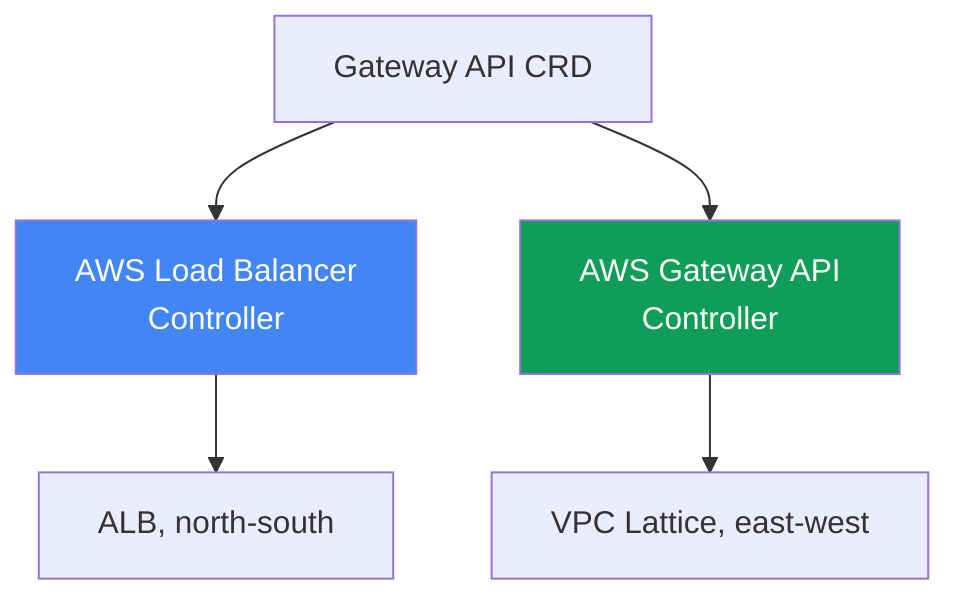
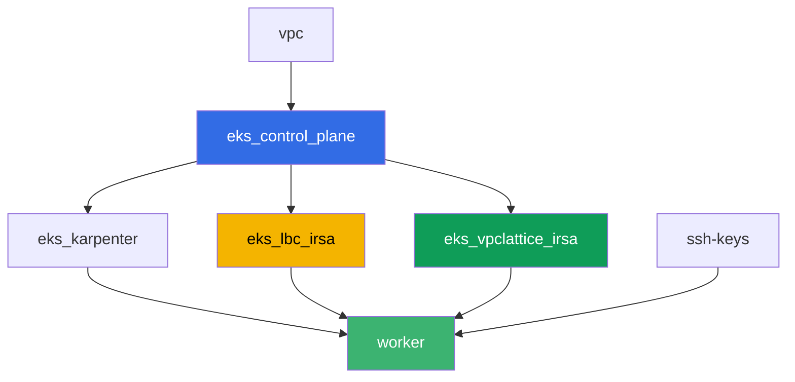

[Русская версия](README_RU.MD) · [Eng version](README.MD) · [Versión en español](README_ES.MD) · [Version française](README_FR.MD) · [ქართული ვერსია](README_GE.MD) · [繁體中文版](README_TW.MD) · [日本語版](README_JP.MD)

# Lab 128 - Gateway API auf AWS: ALB Gateway API und VPC Lattice

## Beschreibung

Ein Ingress mit einem Dutzend `alb.ingress.kubernetes.io/`-Annotationen vermischt in
einem Objekt das Anwendungsrouting und die Einstellungen des Load Balancers selbst, und
das Plattformteam und der Entwickler bearbeiten dieselbe Datei. Gateway API führt Rollen
und typisierte Objekte ein: die Plattform richtet `GatewayClass` ein, das Plattformteam
besitzt `Gateway`, der Entwickler besitzt `HTTPRoute`. In diesem Lab arbeiten Sie beide
Gateway-API-Implementierungen auf AWS durch - den AWS Load Balancer Controller auf ALB
für den Zugang von außen und den AWS Gateway API Controller auf VPC Lattice für die
Kommunikation zwischen Services verschiedener Namespaces ohne den Weg über den Perimeter
- und reproduzieren ein typisches Symptom, bei dem eine Route nicht angewendet wird, weil
der Eigentümer des Backends keine Berechtigung über `ReferenceGrant` erteilt hat.

Die Aufgaben sind im Produktionsstil geschrieben: eine kurze Aufgabenstellung plus
Abnahmekriterien. Die Prüfung erfolgt automatisch über den Befehl `check_result`.

## Ziel

Den Stoff aus dem Kurskapitel vertiefen:

- [Kapitel 28. Gateway API auf AWS: ALB Gateway API und VPC
  Lattice](../../course/28/ru.md)

## Was wir erstellen

Der Cluster ist bereits als Code bereitgestellt (Control Plane, Fargate für die
System-Pods, Karpenter für die Workload). Terraform erstellt zusätzlich zwei IRSA-IAM-
Rollen - für den AWS Load Balancer Controller und für den AWS Gateway API Controller. Sie
installieren beide Controller und die Gateway-API-CRDs und erstellen dann die
Gateway-API-Objekte für beide Implementierungen.

| Objekt | Was es ist | Wozu in diesem Lab |
|--------|---------|-------------------|
| Namespace `eks-128` | ein Cluster-Abschnitt für die Workload des Labs | hält die Ressourcen getrennt von den System-Ressourcen |
| GatewayClass `aws-alb` | die Klasse `gateway.k8s.aws/alb` | verbindet das Gateway mit dem AWS Load Balancer Controller |
| Gateway `web` + HTTPRoute `app` | L7-Eingang über ALB | Eigentümer der Infrastruktur ist die Plattform, Eigentümer der Route ist der Entwickler |
| `TargetGroupConfiguration` `frontend` und `backend` | Target-Group-Einstellungen für einen Service | typisierter Ersatz für die Annotation `alb.ingress.kubernetes.io/target-type` |
| GatewayClass `amazon-vpc-lattice` | die Klasse des VPC-Lattice-Controllers | verbindet das Gateway mit dem AWS Gateway API Controller |
| Gateway `eks-task128-mesh` (Klasse `amazon-vpc-lattice`) | ein VPC Lattice Service Network | East-West-Konnektivität zwischen Namespaces ohne Perimeter |
| Deployment `backend` in `eks-128-backend` | ein Zielservice für HTTPRoute | zeigt eine Cross-Namespace-Referenz und `ReferenceGrant` |
| HTTPRoute `rates` in `eks-128` | eine Route zu `backend` in einem anderen Namespace über das Gateway `web` | reproduziert das Symptom `RefNotPermitted` ohne `ReferenceGrant` |
| HTTPRoute `rates-lattice` in `eks-128` | dieselbe Route über das VPC-Lattice-Gateway | Kontrollexperiment: diese Implementierung prüft den Grant nicht |
| `ReferenceGrant` in `eks-128-backend` | Erlaubnis für die Cross-Namespace-Referenz | behebt das Symptom, die Route `rates` erhält `ResolvedRefs: True` |

Die beiden Gateway-API-Implementierungen nebeneinander:



## Infrastruktur

Die Umgebung wird in AWS (`eu-central-1`) über Terragrunt bereitgestellt. Jedes
Lab-Verzeichnis ist eine Komponente mit eigener `terragrunt.hcl`, die auf das gemeinsame
Modul in `terraform/modules/` verweist und Abhängigkeiten über `dependency`-Blöcke
deklariert. Die Basis ist dieselbe wie in Lab 101 (Control Plane, Fargate für
System-Pods, Karpenter für die Workload), plus zwei IRSA-Rollen für die Controller.

### Module und Abhängigkeiten

| Verzeichnis (Komponente) | Modul (`terraform/modules/`) | Abhängig von | Was es erstellt |
|---------------------|-------------------------------|------------|-------------|
| `vpc` | `vpc_v3` | - | VPC `10.10.0.0/16`, Subnetze in zwei AZs, NAT |
| `ssh-keys` | `ssh-keys` | - | ein SSH-Schlüsselpaar für die Arbeitsmaschine |
| `eks_control_plane` | `eks_v2_control_plane` | `vpc` | EKS-Control-Plane `1.36`, OIDC-Provider |
| `eks_fargate_system` | `eks_v2_fargate` | `vpc`, `eks_control_plane` | Fargate-Profil für `kube-system` und `karpenter` |
| `eks_addons` | `eks_v2_addons` | `eks_control_plane`, `eks_fargate_system` | coredns, kube-proxy, vpc-cni, pod-identity |
| `eks_karpenter` | `eks_v2_karpenter` | `vpc`, `eks_control_plane`, `eks_addons`, `eks_fargate_system` | Karpenter-Controller, IAM-Rolle der Nodes |
| `eks_karpenter_default_vng` | `eks_v2_karpenter_vng` | `vpc`, `eks_control_plane`, `eks_karpenter` | Standard-NodePool `default` auf AL2023 |
| `eks_lbc_irsa` | `eks_v2_lbc_irsa` | `eks_control_plane` | IRSA-IAM-Rolle für den AWS Load Balancer Controller |
| `eks_vpclattice_irsa` | `eks_v2_vpclattice_irsa` | `eks_control_plane` | IRSA-IAM-Rolle für den AWS Gateway API Controller |
| `worker` | `eks_v2_work_pc` | `ssh-keys`, `vpc`, `eks_control_plane`, `eks_karpenter`, `eks_lbc_irsa`, `eks_vpclattice_irsa` | Arbeitsmaschine mit kubectl, Tests und `check_result` |

Das Modul `eks_v2_vpclattice_irsa` wurde nach dem Muster von `eks_v2_lbc_irsa` erstellt:
eine IAM-Rolle mit Trust Policy auf das OIDC des Clusters (eine `sub`-Bedingung auf
`system:serviceaccount:aws-application-networking-system:gateway-api-controller`) und
eine Inline-Policy, kopiert aus `recommended-inline-policy.json` des offiziellen
Repositorys `aws/aws-application-networking-k8s` (Recht `vpc-lattice:*` plus
Beschreibungen von VPC/Subnetzen/SG, Log-Zustellung, Tags und ACM-Zertifikate für
`IAMAuthPolicy`).

Abhängigkeitsgraph (was früher angewendet wird, steht weiter unten am Pfeil):



Die Komponenten `eks_fargate_system`, `eks_addons`, `eks_karpenter_default_vng` sind im
Graphen oben aus Gründen der Lesbarkeit nicht enthalten (nicht mehr als 8 Knoten) - sie
werden in der Standardreihenfolge zwischen `eks_control_plane` und `eks_karpenter`
angewendet, genau wie in Lab 101.

### Worker-Rechte für dieses Lab

Die Worker-Rolle (`eks_v2_work_pc/iam.tf`) hatte bereits umfassende `ec2:Describe*`- und
`eks:*`-Rechte. Für die VPC-Lattice-Diagnose in diesem Lab wurde eine zusätzliche `Sid`
`VpcLatticeReadForLabs` mit den Rechten `vpc-lattice:List*`, `vpc-lattice:Get*` und
`ec2:DescribeManagedPrefixLists` hinzugefügt (nötig, um die Managed Prefix List von VPC
Lattice für die Security-Group-Regel zu finden) - nach dem Muster der bereits
vorhandenen `Sid`-Einträge in dieser Datei, ohne den Rest der Policy zu ändern.

## Bereitstellung

```bash
TASK=128 make run_eks_task
```

Die Bereitstellung dauert etwa 15-20 Minuten. Suchen Sie in der Ausgabe die Zeile mit der
SSH-Verbindung zur Arbeitsmaschine und verbinden Sie sich damit. kubectl ist dort bereits
auf den gewünschten Cluster konfiguriert.

Nützliche Befehle auf der Arbeitsmaschine:

```bash
time_left       # verbleibende Zeit der Umgebung
check_result    # Lösung prüfen
```

> Sicherheit der Umgebung. In `env.hcl` sind `ssh_password_enable = true` und
> `access_cidrs = ["0.0.0.0/0"]` aktiviert - praktisch für eine Lernumgebung, aber so
> sollte man es in der Produktion nicht machen. Nach den Standards des Kurses (Kapitel
> 0.2, 2, 19) sollte der Zugang zu Arbeitsmaschinen über AWS SSM Session Manager erfolgen,
> ohne öffentliche SSH-Ports nach außen zu öffnen, und `access_cidrs` sollte auf konkrete
> Adressen eingeschränkt werden. Hier bleibt öffentliches SSH nur der Einfachheit halber
> beim Start bestehen.

## Aufgaben

---
|        **1**        | **Gateway-API-CRDs und Namespaces des Labs**                  |
| :-----------------: | :---------------------------------------------------------- |
| Was zu tun ist          | Installieren Sie die Standard-CRDs von Gateway API (`kubectl apply --server-side=true -f https://github.com/kubernetes-sigs/gateway-api/releases/download/v1.2.0/standard-install.yaml`). Erstellen Sie die Namespaces `eks-128` und `eks-128-backend`. |
| Abnahmekriterien    | - das CRD `gateways.gateway.networking.k8s.io` existiert;<br/>- die Namespaces `eks-128` und `eks-128-backend` existieren. |
---
|        **2**        | **AWS Load Balancer Controller und ein Gateway der ALB-Klasse (L7)**  |
| :-----------------: | :---------------------------------------------------------- |
| Was zu tun ist          | Finden Sie die ARN der Rolle `<cluster-name>-lbc-irsa` und erstellen Sie den ServiceAccount `aws-load-balancer-controller` in `kube-system` mit einer Annotation darauf. Installieren Sie den AWS Load Balancer Controller über Helm (Repository `https://aws.github.io/eks-charts`, Chart `aws-load-balancer-controller`, Flags `--set serviceAccount.create=false --set serviceAccount.name=aws-load-balancer-controller --set clusterName=<cluster> --set region=eu-central-1 --set vpcId=<vpc-id>`). Die letzten beiden Flags sind zwingend erforderlich: der Pod des Controllers landet in `kube-system`, und dieser Namespace läuft auf Fargate, wo es keinen IMDS gibt, und ohne explizite Werte gerät der Controller in `CrashLoopBackOff` mit `failed to get VPC ID ... ec2imds`. Erstellen Sie die `GatewayClass` `aws-alb` (`controllerName: gateway.k8s.aws/alb`), dann das `Gateway` `web` in `eks-128` (`gatewayClassName: aws-alb`, ein Listener `http` auf Port `80`). Warten Sie, bis `status.conditions` `type: Programmed`, `status: "True"` anzeigt - der ALB wird in 3-4 Minuten aktiv. |
| Abnahmekriterien    | - das Deployment `aws-load-balancer-controller` in `kube-system` hat mindestens eine bereite Replik;<br/>- `GatewayClass` `aws-alb` mit `controllerName: gateway.k8s.aws/alb`;<br/>- `Gateway` `web` in `eks-128` hat die Bedingung `Programmed: True`. |
---
|        **3**        | **HTTPRoute auf ALB: Anwendungsrouting**                       |
| :-----------------: | :---------------------------------------------------------- |
| Was zu tun ist          | Erstellen Sie in `eks-128` das Deployment `frontend` (Image `viktoruj/ping_pong:latest`, `2` Repliken, Port `8080`) und den Service `frontend` (`ClusterIP`, Port `80`, `targetPort: 8080`). Erstellen Sie das `HTTPRoute` `app` in `eks-128`, `parentRefs` auf das `Gateway` `web` (`sectionName: http`), eine Regel mit `backendRefs` auf den Service `frontend` Port `80`. Erstellen Sie dann die `TargetGroupConfiguration` `frontend` in `eks-128` (`apiVersion: gateway.k8s.aws/v1`, `spec.targetReference.name: frontend`, `spec.defaultConfiguration.targetType: ip`): ohne sie leitet der Controller den Zieltyp als `instance` ab, und `instance` erfordert einen Service vom Typ `NodePort` oder `LoadBalancer`, sodass das `Gateway` in `Accepted: False`, `reason: Invalid` gerät und im Controller-Log wiederholt `TargetGroup port is empty` steht. Warten Sie auf `Programmed: True`, speichern Sie die Ausgabe von `aws elbv2 describe-load-balancers` (per DNS-Namen aus `status.addresses`) in `/var/work/tests/artifacts/3/alb.txt` und prüfen Sie, dass der ALB antwortet: `curl http://<Adresse>/` liefert `200`. |
| Abnahmekriterien    | - `HTTPRoute` `app` in `eks-128` mit Status `Accepted: True`;<br/>- `Gateway` `web` hat ein nicht leeres `status.addresses` und `Programmed: True`;<br/>- `TargetGroupConfiguration` `frontend` in `eks-128` mit `targetType: ip`;<br/>- die Datei `3/alb.txt` ist nicht leer und enthält `"Type": "application"`;<br/>- eine Anfrage an die ALB-Adresse liefert `200`. |
---
|        **4**        | **AWS Gateway API Controller und ein Gateway der VPC-Lattice-Klasse**  |
| :-----------------: | :---------------------------------------------------------- |
| Was zu tun ist          | Öffnen Sie die SG der Nodes für VPC-Lattice-Verkehr: finden Sie die `PrefixListId` über `aws ec2 describe-managed-prefix-lists --query "PrefixLists[?PrefixListName=='com.amazonaws.eu-central-1.vpc-lattice'].PrefixListId"` und fügen Sie eine Regel über `aws ec2 authorize-security-group-ingress --group-id <Node-SG> --ip-permissions "PrefixListIds=[{PrefixListId=<id>}],IpProtocol=-1"` hinzu. Finden Sie die ARN der Rolle `<cluster-name>-vpclattice-irsa`, erstellen Sie den Namespace `aws-application-networking-system`, den ServiceAccount `gateway-api-controller` darin mit einer Annotation auf die Rolle. Installieren Sie den Controller über Helm (`oci://public.ecr.aws/aws-application-networking-k8s/aws-gateway-controller-chart`, `--version=v1.1.0`, `--set=serviceAccount.create=false`, `--set=defaultServiceNetwork=eks-task128-mesh`) und geben Sie ihm unbedingt `--set=awsRegion`, `--set=awsAccountId`, `--set=clusterVpcId`, `--set=clusterName`: sein Pod läuft auf einem gewöhnlichen EC2-Node, aber IMDSv2 mit Hop-Limit 1 antwortet dem Pod nicht, und ohne diese Werte scheitert der Controller sofort mit `init config failed: vpcId is not specified: EC2MetadataError ... status code: 401`. Erstellen Sie die `GatewayClass` `amazon-vpc-lattice` (`controllerName: application-networking.k8s.aws/gateway-api-controller`), dann das `Gateway` `eks-task128-mesh` in `eks-128` (`gatewayClassName: amazon-vpc-lattice`, ein Listener `http` auf Port `80`). Der Name des `Gateway` muss mit dem Namen des Service Network übereinstimmen: der Controller sucht das Netzwerk nach dem Namen des Objekts, nicht nach `defaultServiceNetwork`, und bei einer Abweichung bleibt das `Gateway` für immer `Programmed: False` mit `VPC Lattice Service Network not found`. Warten Sie auf `Programmed: True`. |
| Abnahmekriterien    | - das Deployment des Controllers in `aws-application-networking-system` hat mindestens eine bereite Replik;<br/>- `GatewayClass` `amazon-vpc-lattice` mit dem korrekten `controllerName`;<br/>- `Gateway` `eks-task128-mesh` hat die Bedingung `Programmed: True`, und in der Bedingungsmeldung ist die ARN des Service Network sichtbar. |
---
|        **5**        | **Symptom: HTTPRoute ohne ReferenceGrant, Backend in einem anderen Namespace** |
| :-----------------: | :---------------------------------------------------------- |
| Was zu tun ist          | Erstellen Sie in `eks-128-backend` das Deployment `backend` (Image `viktoruj/ping_pong:latest`, `1` Replik, Port `8080`), den Service `backend` (`ClusterIP`, Port `80`, `targetPort: 8080`) und die `TargetGroupConfiguration` `backend` im selben Namespace (`targetType: ip`, wie in Aufgabe 3 - das Objekt muss sich im Namespace seines eigenen Service befinden). Erstellen Sie in `eks-128` das `HTTPRoute` `rates`, `parentRefs` auf das `Gateway` `web`, eine Regel mit Pfadpräfix `/rates` und `backendRefs` auf den Service `backend` **mit dem Feld `namespace: eks-128-backend`** - eine Cross-Namespace-Referenz ohne Erlaubnis. Erstellen Sie dann das `HTTPRoute` `rates-lattice` mit denselben `backendRefs`, aber `parentRefs` auf das `Gateway` `eks-task128-mesh` - das ist das Kontrollexperiment. Vergleichen Sie `status.parents[0].conditions` beider Routen und speichern Sie beide Zustände in `/var/work/tests/artifacts/5/refnotpermitted.txt`. Erklären Sie sich den Unterschied: die Regel `ReferenceGrant` wird von der Implementierung eingehalten, nicht vom API-Server. |
| Abnahmekriterien    | - `HTTPRoute` `rates` in `eks-128` existiert, `backendRefs[0].namespace` ist gleich `eks-128-backend`;<br/>- bei `rates` ist die Bedingung `ResolvedRefs` gleich `False` mit `reason: RefNotPermitted`;<br/>- bei `rates-lattice` ist dieselbe Bedingung gleich `True` ganz ohne `ReferenceGrant`;<br/>- die Datei `5/refnotpermitted.txt` ist nicht leer und enthält `RefNotPermitted`. |
---
|        **6**        | **Fix: ReferenceGrant erlaubt die Cross-Namespace-Referenz**      |
| :-----------------: | :---------------------------------------------------------- |
| Was zu tun ist          | Erstellen Sie ein `ReferenceGrant` im Namespace `eks-128-backend` (Eigentümer des Ziel-Backends), das Referenzen `from` `HTTPRoute` aus dem Namespace `eks-128` `to` `Service` erlaubt (ohne Namen - der gesamte Namespace). Warten Sie, bis `status.parents[0].conditions` der Route `rates` `ResolvedRefs: True` zeigt (dauert Sekunden). Vergewissern Sie sich dann, dass der gesamte Pfad funktioniert: `curl http://<ALB-Adresse>/rates` sollte `200` vom Pod `backend` zurückgeben (die Registrierung der Ziele in der Target Group verlängert die Wartezeit um eine bis zwei Minuten). Speichern Sie die Ausgabe in `/var/work/tests/artifacts/6/resolved.txt`. |
| Abnahmekriterien    | - `ReferenceGrant` in `eks-128-backend` mit `spec.from[0].kind: HTTPRoute`, `spec.from[0].namespace: eks-128`, `spec.to[0].kind: Service`;<br/>- `HTTPRoute` `rates` hat die Bedingung `ResolvedRefs: True`;<br/>- eine `curl http://<ALB-Adresse>/rates`-Anfrage liefert `200`, das heißt, der Verkehr erreicht tatsächlich `backend` im benachbarten Namespace;<br/>- die Datei `6/resolved.txt` ist nicht leer und enthält `ResolvedRefs` und `True`. |
---

## Prüfung des Ergebnisses

Führen Sie auf der Arbeitsmaschine die automatische Prüfung aus:

```bash
check_result
```

Das Skript führt die Tests aus und zeigt den Prozentsatz der erledigten Aufgaben an.

## Lösung

Musterlösung: [worker/files/solutions/1_DE.MD](worker/files/solutions/1_DE.MD)

## Löschen des Clusters und der Ressourcen

> **Vor dem Löschen.** Das Gateway `web` der Klasse `aws-alb` hat einen echten ALB und
> dessen Security Group erstellt, und das Gateway `mesh` der Klasse `amazon-vpc-lattice`
> hat ein Service Network und VPC-Lattice-Services erstellt. Das alles haben die
> Controller über die AWS-API gemacht, im Terraform-State existieren diese Ressourcen
> nicht. Löschen Sie zuerst die Kubernetes-Objekte und lassen Sie die Controller selbst
> die Löschung in AWS auslösen (der Finalizer gibt das Objekt erst frei, wenn die
> AWS-Ressource abgebaut ist). Wenn Sie zuerst den Cluster löschen, gibt es die Controller
> nicht mehr: der ALB und seine SG bleiben verwaist, ihre ENIs halten weiterhin die
> Subnetze, und `destroy` bleibt bei `Still destroying...` an der VPC, dem Internet
> Gateway oder der Security Group hängen.

Schritt 1. Routen und Gateways entfernen, warten, bis die Controller die AWS-Ressourcen
abbauen:

```bash
kubectl delete httproute app rates rates-lattice -n eks-128
kubectl delete referencegrant allow-from-eks-128 -n eks-128-backend
kubectl delete gateway web eks-task128-mesh -n eks-128
kubectl wait --for=delete gateway/web gateway/eks-task128-mesh -n eks-128 --timeout=300s

# der Load Balancer und der VPC-Lattice-Service müssen verschwunden sein, beide Ausgaben leer
aws elbv2 describe-load-balancers \
  --query "LoadBalancers[?contains(LoadBalancerName,'eks128')].LoadBalancerName" --output text
aws vpc-lattice list-services --query "items[].name" --output text
```

Schritt 2. Das VPC Lattice Service Network löschen - der Controller löscht es NICHT. Er
erstellt das Netzwerk anhand von `defaultServiceNetwork`, aber beim Löschen des `Gateway`
entfernt er nur die Services, während das Netzwerk selbst und seine VPC-Assoziation im
Zustand `ACTIVE` bleiben (auf dem Testaufbau überprüft). Die Assoziation hält die VPC,
daher bleibt `destroy` ohne diesen Schritt am Netzwerk hängen:

```bash
SN=$(aws vpc-lattice list-service-networks \
  --query "items[?name=='eks-task128-mesh'].id" --output text)
SNVA=$(aws vpc-lattice list-service-network-vpc-associations \
  --service-network-identifier "$SN" --query "items[].id" --output text)
aws vpc-lattice delete-service-network-vpc-association \
  --service-network-vpc-association-identifier "$SNVA"

# wir warten, bis die Assoziation weg ist, erst danach löschen wir das Netzwerk selbst
while [ -n "$(aws vpc-lattice list-service-network-vpc-associations \
  --service-network-identifier "$SN" --query 'items[].id' --output text)" ]; do
  echo "association is still there, waiting..." ; sleep 15
done
aws vpc-lattice delete-service-network --service-network-identifier "$SN"
```

Schritt 3. Die in Aufgabe 4 von Hand hinzugefügte Regel entfernen und die Workload
entfernen, damit die EC2-Nodes von Karpenter verschwinden, bevor der Cluster gelöscht
wird (sonst bleibt ein sekundäres ENI vom VPC CNI `available` und verzögert das Löschen
der Node-Security-Group):

```bash
NODE_SG=$(grep '^node_sg_id' ~/lab128_hints.txt | awk '{print $3}')
PREFIX_LIST_ID=$(aws ec2 describe-managed-prefix-lists \
  --query "PrefixLists[?PrefixListName=='com.amazonaws.eu-central-1.vpc-lattice'].PrefixListId" \
  --output text)
aws ec2 revoke-security-group-ingress --group-id "$NODE_SG" \
  --ip-permissions "PrefixListIds=[{PrefixListId=${PREFIX_LIST_ID}}],IpProtocol=-1"

kubectl delete namespace eks-128 eks-128-backend
helm uninstall gateway-api-controller -n aws-application-networking-system
helm uninstall aws-load-balancer-controller -n kube-system

while [ "$(kubectl get nodes --no-headers | grep -vc fargate)" != "0" ]; do
  echo "EC2 nodes are still running, waiting..." ; sleep 20
done
```

Schritt 4. Den Stand abbauen:

```bash
TASK=128 make delete_eks_task
```

Wenn `destroy` trotzdem hängen bleibt, suchen Sie nach verwaisten Controller-Ressourcen
und entfernen Sie sie von Hand:

```bash
# der ALB des Labs (erkennbar an den Tags elbv2.k8s.aws/cluster und gateway.k8s.aws/*)
aws elbv2 describe-load-balancers \
  --query "LoadBalancers[?contains(LoadBalancerName,'eks128')].LoadBalancerArn" --output text
aws elbv2 delete-load-balancer --load-balancer-arn <arn>
# wer die Security Group hält, die sich nicht löschen lässt
aws ec2 describe-network-interfaces --filters "Name=group-id,Values=<sg-id>" \
  --query 'NetworkInterfaces[].[NetworkInterfaceId,Description]' --output table
# VPC-Lattice-Ressourcen, die vom Gateway der Klasse amazon-vpc-lattice übrig geblieben sind
aws vpc-lattice list-services
aws vpc-lattice list-service-networks
# und vor allem - die Assoziation des Netzwerks mit der VPC, die das Löschen der VPC blockiert
aws vpc-lattice list-service-network-vpc-associations --vpc-identifier <vpc-id>
```
