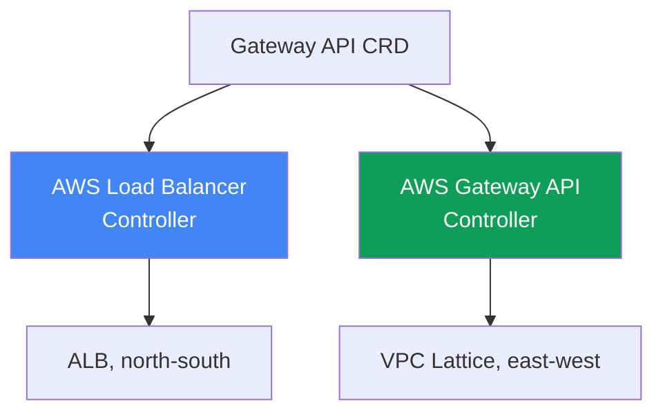
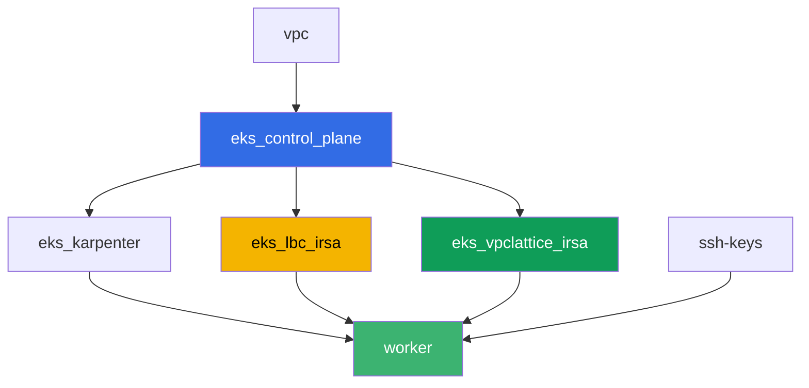

[Русская версия](README_RU.MD) · [Eng version](README.MD) · [Version française](README_FR.MD) · [Deutsche Version](README_DE.MD) · [ქართული ვერსია](README_GE.MD) · [繁體中文版](README_TW.MD) · [日本語版](README_JP.MD)

# Laboratorio 128 - Gateway API en AWS: ALB Gateway API y VPC Lattice

## Descripción

Un Ingress con una decena de anotaciones `alb.ingress.kubernetes.io/` mezcla en un mismo
objeto el enrutamiento de la aplicación y la configuración del propio balanceador, y el
equipo de plataforma y el desarrollador acaban editando el mismo archivo. Gateway API
introduce roles y objetos con tipo: la plataforma configura `GatewayClass`, el equipo de
plataforma es dueño de `Gateway`, el desarrollador es dueño de `HTTPRoute`. En este
laboratorio trabajarás con las dos implementaciones de Gateway API en AWS - el AWS Load
Balancer Controller sobre ALB para el ingreso desde el exterior y el AWS Gateway API
Controller sobre VPC Lattice para la comunicación entre servicios de distintos namespace
sin llegar al perímetro - y reproducirás un síntoma típico en el que una ruta no se aplica
porque el propietario del backend no ha otorgado permiso mediante `ReferenceGrant`.

Las tareas están escritas en estilo de producción: un planteamiento breve más criterios de
aceptación. La verificación es automática, con el comando `check_result`.

## Objetivo

Reforzar el material del capítulo del curso:

- [Capítulo 28. Gateway API en AWS: ALB Gateway API y VPC
  Lattice](../../course/28/es.md)

## Qué vamos a crear

El clúster ya está desplegado como código (control plane, Fargate para los pods del
sistema, Karpenter para la carga de trabajo). Terraform crea además dos roles IAM IRSA -
uno para el AWS Load Balancer Controller y otro para el AWS Gateway API Controller.
Instalarás ambos controladores y los CRD de Gateway API, y luego crearás los objetos de
Gateway API para las dos implementaciones.

| Objeto | Qué es | Para qué sirve en este laboratorio |
|--------|---------|-------------------|
| Namespace `eks-128` | una sección del clúster para la carga de trabajo del laboratorio | mantiene los recursos separados de los del sistema |
| GatewayClass `aws-alb` | la clase `gateway.k8s.aws/alb` | conecta el Gateway con el AWS Load Balancer Controller |
| Gateway `web` + HTTPRoute `app` | entrada L7 sobre ALB | el dueño de la infraestructura es la plataforma, el dueño de la ruta es el desarrollador |
| `TargetGroupConfiguration` `frontend` y `backend` | configuración del target group de un Service | sustituto con tipo de la anotación `alb.ingress.kubernetes.io/target-type` |
| GatewayClass `amazon-vpc-lattice` | la clase del controlador de VPC Lattice | conecta el Gateway con el AWS Gateway API Controller |
| Gateway `eks-task128-mesh` (clase `amazon-vpc-lattice`) | una Service Network de VPC Lattice | conectividad east-west entre namespace sin pasar por el perímetro |
| Deployment `backend` en `eks-128-backend` | un servicio de destino para HTTPRoute | muestra una referencia entre namespace y `ReferenceGrant` |
| HTTPRoute `rates` en `eks-128` | una ruta hacia `backend` en otro namespace a través del Gateway `web` | reproduce el síntoma `RefNotPermitted` sin un `ReferenceGrant` |
| HTTPRoute `rates-lattice` en `eks-128` | la misma ruta a través del Gateway de VPC Lattice | experimento de control: esta implementación no comprueba el grant |
| `ReferenceGrant` en `eks-128-backend` | permiso para la referencia entre namespace | corrige el síntoma, la ruta `rates` obtiene `ResolvedRefs: True` |

Las dos implementaciones de Gateway API lado a lado:



## Infraestructura

El entorno se despliega en AWS (`eu-central-1`) mediante Terragrunt. Cada carpeta del
laboratorio es un componente con su propio `terragrunt.hcl`, que hace referencia al módulo
común en `terraform/modules/` y declara dependencias mediante bloques `dependency`. La
base es la misma que en el laboratorio 101 (control plane, Fargate para los pods del
sistema, Karpenter para la carga de trabajo), más dos roles IRSA para los controladores.

### Módulos y dependencias

| Carpeta (componente) | Módulo (`terraform/modules/`) | Depende de | Qué crea |
|---------------------|-------------------------------|------------|-------------|
| `vpc` | `vpc_v3` | - | VPC `10.10.0.0/16`, subredes en dos AZ, NAT |
| `ssh-keys` | `ssh-keys` | - | un par de claves SSH para la máquina de trabajo |
| `eks_control_plane` | `eks_v2_control_plane` | `vpc` | control plane de EKS `1.36`, proveedor OIDC |
| `eks_fargate_system` | `eks_v2_fargate` | `vpc`, `eks_control_plane` | perfil de Fargate para `kube-system` y `karpenter` |
| `eks_addons` | `eks_v2_addons` | `eks_control_plane`, `eks_fargate_system` | coredns, kube-proxy, vpc-cni, pod-identity |
| `eks_karpenter` | `eks_v2_karpenter` | `vpc`, `eks_control_plane`, `eks_addons`, `eks_fargate_system` | controlador Karpenter, rol IAM de los nodos |
| `eks_karpenter_default_vng` | `eks_v2_karpenter_vng` | `vpc`, `eks_control_plane`, `eks_karpenter` | NodePool por defecto `default` en AL2023 |
| `eks_lbc_irsa` | `eks_v2_lbc_irsa` | `eks_control_plane` | rol IAM IRSA para el AWS Load Balancer Controller |
| `eks_vpclattice_irsa` | `eks_v2_vpclattice_irsa` | `eks_control_plane` | rol IAM IRSA para el AWS Gateway API Controller |
| `worker` | `eks_v2_work_pc` | `ssh-keys`, `vpc`, `eks_control_plane`, `eks_karpenter`, `eks_lbc_irsa`, `eks_vpclattice_irsa` | máquina de trabajo con kubectl, pruebas y `check_result` |

El módulo `eks_v2_vpclattice_irsa` se creó siguiendo el patrón de `eks_v2_lbc_irsa`: un rol
IAM con trust policy sobre el OIDC del clúster (una condición `sub` sobre
`system:serviceaccount:aws-application-networking-system:gateway-api-controller`) y una
política inline copiada de `recommended-inline-policy.json` del repositorio oficial
`aws/aws-application-networking-k8s` (permiso `vpc-lattice:*` más descripciones de
VPC/subredes/SG, entrega de logs, etiquetas y certificados ACM para `IAMAuthPolicy`).

Grafo de dependencias (lo que se aplica antes queda más abajo en la flecha):



Los componentes `eks_fargate_system`, `eks_addons`, `eks_karpenter_default_vng` no se
incluyen en el grafo anterior por claridad (no más de 8 nodos) - se aplican en el orden
estándar entre `eks_control_plane` y `eks_karpenter`, igual que en el laboratorio 101.

### Permisos del worker para este laboratorio

El rol del worker (`eks_v2_work_pc/iam.tf`) ya tenía amplios permisos `ec2:Describe*` y
`eks:*`. Para el diagnóstico de VPC Lattice en este laboratorio se añadió un `Sid`
adicional `VpcLatticeReadForLabs` con permisos `vpc-lattice:List*`, `vpc-lattice:Get*` y
`ec2:DescribeManagedPrefixLists` (necesario para encontrar la managed prefix list de VPC
Lattice para la regla del security group) - siguiendo el patrón de los `Sid` ya existentes
en este archivo, sin modificar el resto de la política.

## Despliegue

```bash
TASK=128 make run_eks_task
```

El despliegue tarda aproximadamente 15-20 minutos. En la salida, busca la línea con la
conexión SSH a la máquina de trabajo y conéctate a ella. kubectl ya está configurado ahí
para el clúster correspondiente.

Comandos útiles en la máquina de trabajo:

```bash
time_left       # cuánto tiempo queda del entorno
check_result    # comprobar la solución
```

> Seguridad del entorno. En `env.hcl` están activados `ssh_password_enable = true` y
> `access_cidrs = ["0.0.0.0/0"]` - es cómodo para un entorno de aprendizaje, pero no debe
> hacerse así en producción. Según los estándares del curso (capítulos 0.2, 2, 19), el
> acceso a las máquinas de trabajo debe hacerse a través de AWS SSM Session Manager sin
> exponer puertos SSH públicos, y `access_cidrs` debe reducirse a direcciones concretas.
> Aquí se deja el SSH público solo para simplificar el arranque.

## Tareas

---
|        **1**        | **CRD de Gateway API y namespaces del laboratorio**            |
| :-----------------: | :---------------------------------------------------------- |
| Qué hacer          | Instala los CRD estándar de Gateway API (`kubectl apply --server-side=true -f https://github.com/kubernetes-sigs/gateway-api/releases/download/v1.2.0/standard-install.yaml`). Crea los namespaces `eks-128` y `eks-128-backend`. |
| Criterios de aceptación    | - existe el CRD `gateways.gateway.networking.k8s.io`;<br/>- existen los namespaces `eks-128` y `eks-128-backend`. |
---
|        **2**        | **AWS Load Balancer Controller y un Gateway de clase ALB (L7)**  |
| :-----------------: | :---------------------------------------------------------- |
| Qué hacer          | Busca el ARN del rol `<cluster-name>-lbc-irsa` y crea el ServiceAccount `aws-load-balancer-controller` en `kube-system` con una anotación hacia él. Instala el AWS Load Balancer Controller con Helm (repositorio `https://aws.github.io/eks-charts`, chart `aws-load-balancer-controller`, flags `--set serviceAccount.create=false --set serviceAccount.name=aws-load-balancer-controller --set clusterName=<cluster> --set region=eu-central-1 --set vpcId=<vpc-id>`). Los dos últimos flags son obligatorios: el pod del controlador cae en `kube-system`, y ese namespace corre sobre Fargate, donde no hay IMDS, y sin valores explícitos el controlador entra en `CrashLoopBackOff` con `failed to get VPC ID ... ec2imds`. Crea el `GatewayClass` `aws-alb` (`controllerName: gateway.k8s.aws/alb`), luego el `Gateway` `web` en `eks-128` (`gatewayClassName: aws-alb`, un listener `http` en el puerto `80`). Espera a que `status.conditions` muestre `type: Programmed`, `status: "True"` - el ALB se activa en 3-4 minutos. |
| Criterios de aceptación    | - el Deployment `aws-load-balancer-controller` en `kube-system` tiene al menos una réplica lista;<br/>- `GatewayClass` `aws-alb` con `controllerName: gateway.k8s.aws/alb`;<br/>- `Gateway` `web` en `eks-128` tiene la condición `Programmed: True`. |
---
|        **3**        | **HTTPRoute sobre ALB: enrutamiento de la aplicación**         |
| :-----------------: | :---------------------------------------------------------- |
| Qué hacer          | En `eks-128` crea el Deployment `frontend` (imagen `viktoruj/ping_pong:latest`, `2` réplicas, puerto `8080`) y el Service `frontend` (`ClusterIP`, puerto `80`, `targetPort: 8080`). Crea el `HTTPRoute` `app` en `eks-128`, `parentRefs` hacia el `Gateway` `web` (`sectionName: http`), una regla con `backendRefs` hacia el Service `frontend` puerto `80`. Luego crea el `TargetGroupConfiguration` `frontend` en `eks-128` (`apiVersion: gateway.k8s.aws/v1`, `spec.targetReference.name: frontend`, `spec.defaultConfiguration.targetType: ip`): sin él el controlador deduce el tipo de destino como `instance`, y `instance` requiere un Service de tipo `NodePort` o `LoadBalancer`, por lo que el `Gateway` entra en `Accepted: False`, `reason: Invalid`, y en el log del controlador aparece `TargetGroup port is empty`. Espera a `Programmed: True`, guarda la salida de `aws elbv2 describe-load-balancers` (por el nombre DNS de `status.addresses`) en `/var/work/tests/artifacts/3/alb.txt` y comprueba que el ALB responde: `curl http://<dirección>/` devuelve `200`. |
| Criterios de aceptación    | - `HTTPRoute` `app` en `eks-128` con estado `Accepted: True`;<br/>- `Gateway` `web` tiene un `status.addresses` no vacío y `Programmed: True`;<br/>- `TargetGroupConfiguration` `frontend` en `eks-128` con `targetType: ip`;<br/>- el archivo `3/alb.txt` no está vacío y contiene `"Type": "application"`;<br/>- una petición a la dirección del ALB devuelve `200`. |
---
|        **4**        | **AWS Gateway API Controller y un Gateway de clase VPC Lattice**  |
| :-----------------: | :---------------------------------------------------------- |
| Qué hacer          | Permite el tráfico de VPC Lattice en el SG de los nodos: busca el `PrefixListId` con `aws ec2 describe-managed-prefix-lists --query "PrefixLists[?PrefixListName=='com.amazonaws.eu-central-1.vpc-lattice'].PrefixListId"` y añade una regla con `aws ec2 authorize-security-group-ingress --group-id <sg de nodos> --ip-permissions "PrefixListIds=[{PrefixListId=<id>}],IpProtocol=-1"`. Busca el ARN del rol `<cluster-name>-vpclattice-irsa`, crea el namespace `aws-application-networking-system`, el ServiceAccount `gateway-api-controller` en él con una anotación hacia el rol. Instala el controlador con Helm (`oci://public.ecr.aws/aws-application-networking-k8s/aws-gateway-controller-chart`, `--version=v1.1.0`, `--set=serviceAccount.create=false`, `--set=defaultServiceNetwork=eks-task128-mesh`) y asegúrate de pasarle `--set=awsRegion`, `--set=awsAccountId`, `--set=clusterVpcId`, `--set=clusterName`: su pod corre en un nodo EC2 normal, pero IMDSv2 con hop limit 1 no responde al pod, y sin estos valores el controlador falla al instante con `init config failed: vpcId is not specified: EC2MetadataError ... status code: 401`. Crea el `GatewayClass` `amazon-vpc-lattice` (`controllerName: application-networking.k8s.aws/gateway-api-controller`), luego el `Gateway` `eks-task128-mesh` en `eks-128` (`gatewayClassName: amazon-vpc-lattice`, un listener `http` en el puerto `80`). El nombre del `Gateway` debe coincidir con el nombre de la Service Network: el controlador busca la red por el nombre del objeto, no por `defaultServiceNetwork`, y si no coincide el `Gateway` se queda para siempre en `Programmed: False` con `VPC Lattice Service Network not found`. Espera a `Programmed: True`. |
| Criterios de aceptación    | - el Deployment del controlador en `aws-application-networking-system` tiene al menos una réplica lista;<br/>- `GatewayClass` `amazon-vpc-lattice` con el `controllerName` correcto;<br/>- `Gateway` `eks-task128-mesh` tiene la condición `Programmed: True`, y el mensaje de la condición muestra el ARN de la service network. |
---
|        **5**        | **Síntoma: HTTPRoute sin ReferenceGrant, backend en otro namespace** |
| :-----------------: | :---------------------------------------------------------- |
| Qué hacer          | En `eks-128-backend` crea el Deployment `backend` (imagen `viktoruj/ping_pong:latest`, `1` réplica, puerto `8080`), el Service `backend` (`ClusterIP`, puerto `80`, `targetPort: 8080`) y el `TargetGroupConfiguration` `backend` en el mismo namespace (`targetType: ip`, igual que en la tarea 3 - el objeto debe estar en el namespace de su propio Service). En `eks-128` crea el `HTTPRoute` `rates`, `parentRefs` hacia el `Gateway` `web`, una regla con prefijo de ruta `/rates` y `backendRefs` hacia el Service `backend` **con el campo `namespace: eks-128-backend`** - una referencia entre namespace sin permiso. Luego crea el `HTTPRoute` `rates-lattice` con los mismos `backendRefs`, pero `parentRefs` hacia el `Gateway` `eks-task128-mesh` - este es el experimento de control. Compara `status.parents[0].conditions` de ambas rutas y guarda los dos estados en `/var/work/tests/artifacts/5/refnotpermitted.txt`. Averigua por qué difieren: la regla `ReferenceGrant` la aplica la implementación, no el API server. |
| Criterios de aceptación    | - `HTTPRoute` `rates` en `eks-128` existe, `backendRefs[0].namespace` es igual a `eks-128-backend`;<br/>- `rates` tiene la condición `ResolvedRefs` igual a `False` con `reason: RefNotPermitted`;<br/>- `rates-lattice` tiene la misma condición igual a `True` sin ningún `ReferenceGrant`;<br/>- el archivo `5/refnotpermitted.txt` no está vacío y contiene `RefNotPermitted`. |
---
|        **6**        | **Fix: ReferenceGrant permite la referencia entre namespace**      |
| :-----------------: | :---------------------------------------------------------- |
| Qué hacer          | Crea un `ReferenceGrant` en el namespace `eks-128-backend` (propietario del backend de destino), que permita referencias `from` `HTTPRoute` desde el namespace `eks-128` `to` `Service` (sin nombre - todo el namespace). Espera hasta que `status.parents[0].conditions` de la ruta `rates` muestre `ResolvedRefs: True` (tarda segundos). Luego comprueba que el camino completo funciona: `curl http://<dirección del ALB>/rates` debe devolver `200` desde el pod `backend` (el registro de destinos en el target group añade uno o dos minutos a la espera). Guarda la salida en `/var/work/tests/artifacts/6/resolved.txt`. |
| Criterios de aceptación    | - `ReferenceGrant` en `eks-128-backend` con `spec.from[0].kind: HTTPRoute`, `spec.from[0].namespace: eks-128`, `spec.to[0].kind: Service`;<br/>- `HTTPRoute` `rates` tiene la condición `ResolvedRefs: True`;<br/>- una petición `curl http://<dirección del ALB>/rates` devuelve `200`, es decir, el tráfico llega realmente al `backend` del namespace vecino;<br/>- el archivo `6/resolved.txt` no está vacío y contiene `ResolvedRefs` y `True`. |
---

## Comprobación del resultado

En la máquina de trabajo, ejecuta la comprobación automática:

```bash
check_result
```

El script ejecuta las pruebas y muestra el porcentaje de tareas completadas.

## Solución

Solución de referencia: [worker/files/solutions/1_ES.MD](worker/files/solutions/1_ES.MD)

## Eliminación del clúster y los recursos

> **Antes de eliminar.** El Gateway `web` de clase `aws-alb` creó un ALB real y su
> security group, y el Gateway `mesh` de clase `amazon-vpc-lattice` creó una service
> network y servicios de VPC Lattice. Todo esto lo hicieron los controladores a través de
> la API de AWS, y estos recursos no están en el state de terraform. Elimina primero los
> objetos de Kubernetes y deja que los controladores disparen la eliminación en AWS por sí
> mismos (el finalizer no liberará el objeto hasta que el recurso de AWS haya sido
> eliminado). Si eliminas el clúster primero, los controladores ya no existirán: el ALB y
> su SG quedarán huérfanos, sus ENI seguirán reteniendo las subredes, y `destroy` se
> quedará colgado en `Still destroying...` en la VPC, el Internet Gateway o el security
> group.

Paso 1. Quitar las rutas y los Gateway, esperar a que los controladores retiren los
recursos de AWS:

```bash
kubectl delete httproute app rates rates-lattice -n eks-128
kubectl delete referencegrant allow-from-eks-128 -n eks-128-backend
kubectl delete gateway web eks-task128-mesh -n eks-128
kubectl wait --for=delete gateway/web gateway/eks-task128-mesh -n eks-128 --timeout=300s

# el balanceador y el servicio de VPC Lattice deben haber desaparecido, ambas salidas vacías
aws elbv2 describe-load-balancers \
  --query "LoadBalancers[?contains(LoadBalancerName,'eks128')].LoadBalancerName" --output text
aws vpc-lattice list-services --query "items[].name" --output text
```

Paso 2. Eliminar la Service Network de VPC Lattice - el controlador NO la elimina. Crea la
red a partir de `defaultServiceNetwork`, pero al eliminar el `Gateway` solo retira los
servicios, mientras que la red misma y su asociación con la VPC quedan en estado `ACTIVE`
(comprobado en el entorno de pruebas). La asociación mantiene la VPC retenida, así que sin
este paso `destroy` se quedará bloqueado en la red:

```bash
SN=$(aws vpc-lattice list-service-networks \
  --query "items[?name=='eks-task128-mesh'].id" --output text)
SNVA=$(aws vpc-lattice list-service-network-vpc-associations \
  --service-network-identifier "$SN" --query "items[].id" --output text)
aws vpc-lattice delete-service-network-vpc-association \
  --service-network-vpc-association-identifier "$SNVA"

# esperamos a que la asociación desaparezca, solo entonces eliminamos la propia red
while [ -n "$(aws vpc-lattice list-service-network-vpc-associations \
  --service-network-identifier "$SN" --query 'items[].id' --output text)" ]; do
  echo "association is still there, waiting..." ; sleep 15
done
aws vpc-lattice delete-service-network --service-network-identifier "$SN"
```

Paso 3. Quitar la regla añadida a mano en la tarea 4, y retirar la carga de trabajo para
que los nodos EC2 de Karpenter desaparezcan antes de eliminar el clúster (de otro modo un
ENI secundario del VPC CNI quedará `available` y retrasará la eliminación del security
group de los nodos):

```bash
NODE_SG=$(grep '^node_sg_id' ~/lab128_hints.txt | awk '{print $3}')
PREFIX_LIST_ID=$(aws ec2 describe-managed-prefix-lists \
  --query "PrefixLists[?PrefixListName=='com.amazonaws.eu-central-1.vpc-lattice'].PrefixListId" \
  --output text)
aws ec2 revoke-security-group-ingress --group-id "$NODE_SG" \
  --ip-permissions "PrefixListIds=[{PrefixListId=${PREFIX_LIST_ID}}],IpProtocol=-1"

kubectl delete namespace eks-128 eks-128-backend
helm uninstall gateway-api-controller -n aws-application-networking-system
helm uninstall aws-load-balancer-controller -n kube-system

while [ "$(kubectl get nodes --no-headers | grep -vc fargate)" != "0" ]; do
  echo "EC2 nodes are still running, waiting..." ; sleep 20
done
```

Paso 4. Eliminar el entorno:

```bash
TASK=128 make delete_eks_task
```

Si `destroy` sigue colgado, busca recursos huérfanos de los controladores y elimínalos a
mano:

```bash
# el ALB del laboratorio (identificable por las etiquetas elbv2.k8s.aws/cluster y gateway.k8s.aws/*)
aws elbv2 describe-load-balancers \
  --query "LoadBalancers[?contains(LoadBalancerName,'eks128')].LoadBalancerArn" --output text
aws elbv2 delete-load-balancer --load-balancer-arn <arn>
# quién retiene el security group que no se puede eliminar
aws ec2 describe-network-interfaces --filters "Name=group-id,Values=<sg-id>" \
  --query 'NetworkInterfaces[].[NetworkInterfaceId,Description]' --output table
# recursos de VPC Lattice que quedaron del Gateway de clase amazon-vpc-lattice
aws vpc-lattice list-services
aws vpc-lattice list-service-networks
# y lo principal - la asociación de la red con la VPC, que es lo que impide eliminar la VPC
aws vpc-lattice list-service-network-vpc-associations --vpc-identifier <vpc-id>
```
