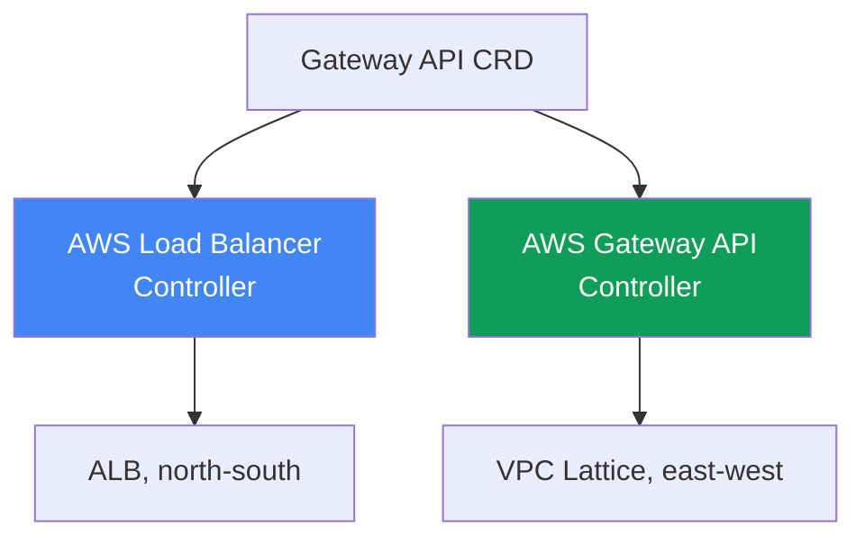
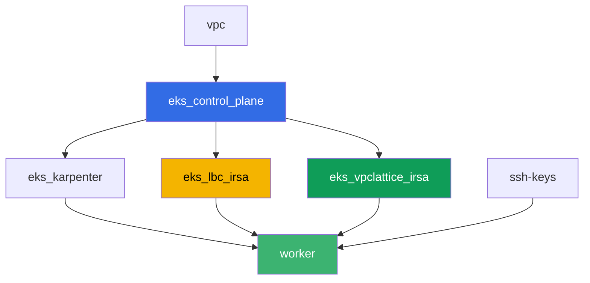

[Русская версия](README_RU.MD) · [Eng version](README.MD) · [Versión en español](README_ES.MD) · [Deutsche Version](README_DE.MD) · [ქართული ვერსია](README_GE.MD) · [繁體中文版](README_TW.MD) · [日本語版](README_JP.MD)

# Labo 128 - Gateway API sur AWS : ALB Gateway API et VPC Lattice

## Description

Un Ingress avec une dizaine d'annotations `alb.ingress.kubernetes.io/` mélange dans un
seul objet le routage applicatif et la configuration du load balancer lui-même, et
l'équipe plateforme et le développeur finissent par modifier le même fichier. Gateway API
introduit des rôles et des objets typés : la plateforme configure `GatewayClass`, l'équipe
plateforme possède `Gateway`, le développeur possède `HTTPRoute`. Dans ce labo, vous allez
étudier les deux implémentations de Gateway API sur AWS - l'AWS Load Balancer Controller
au-dessus d'ALB pour l'entrée depuis l'extérieur, et l'AWS Gateway API Controller au-dessus
de VPC Lattice pour la communication entre services de namespaces différents sans passer
par le périmètre - et vous reproduirez un symptôme classique où une route ne s'applique pas
parce que le propriétaire du backend n'a pas accordé d'autorisation via `ReferenceGrant`.

Les tâches sont écrites dans un style production : un énoncé court plus des critères
d'acceptation. La vérification est automatique, via la commande `check_result`.

## Objectif

Consolider la matière du chapitre du cours :

- [Chapitre 28. Gateway API sur AWS : ALB Gateway API et VPC
  Lattice](../../course/28/fr.md)

## Ce que nous créons

Le cluster est déjà déployé sous forme de code (control plane, Fargate pour les pods
système, Karpenter pour la charge de travail). Terraform crée en plus deux rôles IAM IRSA
- pour l'AWS Load Balancer Controller et pour l'AWS Gateway API Controller. Vous installez
les deux contrôleurs et les CRD de Gateway API, puis vous créez les objets Gateway API
pour les deux implémentations.

| Objet | Ce que c'est | Pourquoi dans ce labo |
|--------|---------|-------------------|
| Namespace `eks-128` | une section du cluster pour la charge de travail du labo | garde les ressources séparées de celles du système |
| GatewayClass `aws-alb` | la classe `gateway.k8s.aws/alb` | relie le Gateway à l'AWS Load Balancer Controller |
| Gateway `web` + HTTPRoute `app` | entrée L7 au-dessus d'ALB | le propriétaire de l'infrastructure est la plateforme, le propriétaire de la route est le développeur |
| `TargetGroupConfiguration` `frontend` et `backend` | configuration du target group d'un Service | remplacement typé de l'annotation `alb.ingress.kubernetes.io/target-type` |
| GatewayClass `amazon-vpc-lattice` | la classe du contrôleur VPC Lattice | relie le Gateway à l'AWS Gateway API Controller |
| Gateway `eks-task128-mesh` (classe `amazon-vpc-lattice`) | un Service Network VPC Lattice | connectivité east-west entre namespaces sans passer par le périmètre |
| Deployment `backend` dans `eks-128-backend` | un service cible pour HTTPRoute | montre une référence cross-namespace et `ReferenceGrant` |
| HTTPRoute `rates` dans `eks-128` | une route vers `backend` dans un autre namespace via le Gateway `web` | reproduit le symptôme `RefNotPermitted` sans `ReferenceGrant` |
| HTTPRoute `rates-lattice` dans `eks-128` | la même route via le Gateway VPC Lattice | expérience de contrôle : cette implémentation ne vérifie pas le grant |
| `ReferenceGrant` dans `eks-128-backend` | autorisation pour la référence cross-namespace | corrige le symptôme, la route `rates` obtient `ResolvedRefs: True` |

Les deux implémentations de Gateway API côte à côte :



## Infrastructure

L'environnement est déployé sur AWS (`eu-central-1`) via Terragrunt. Chaque dossier du
labo est un composant avec son propre `terragrunt.hcl`, qui référence le module commun
dans `terraform/modules/` et déclare les dépendances via des blocs `dependency`. La base
est la même que dans le labo 101 (control plane, Fargate pour les pods système, Karpenter
pour la charge de travail), plus deux rôles IRSA pour les contrôleurs.

### Modules et dépendances

| Dossier (composant) | Module (`terraform/modules/`) | Dépend de | Ce qu'il crée |
|---------------------|-------------------------------|------------|-------------|
| `vpc` | `vpc_v3` | - | VPC `10.10.0.0/16`, sous-réseaux dans deux AZ, NAT |
| `ssh-keys` | `ssh-keys` | - | une paire de clés SSH pour la machine de travail |
| `eks_control_plane` | `eks_v2_control_plane` | `vpc` | control plane EKS `1.36`, fournisseur OIDC |
| `eks_fargate_system` | `eks_v2_fargate` | `vpc`, `eks_control_plane` | profil Fargate pour `kube-system` et `karpenter` |
| `eks_addons` | `eks_v2_addons` | `eks_control_plane`, `eks_fargate_system` | coredns, kube-proxy, vpc-cni, pod-identity |
| `eks_karpenter` | `eks_v2_karpenter` | `vpc`, `eks_control_plane`, `eks_addons`, `eks_fargate_system` | contrôleur Karpenter, rôle IAM des nœuds |
| `eks_karpenter_default_vng` | `eks_v2_karpenter_vng` | `vpc`, `eks_control_plane`, `eks_karpenter` | NodePool par défaut `default` sur AL2023 |
| `eks_lbc_irsa` | `eks_v2_lbc_irsa` | `eks_control_plane` | rôle IAM IRSA pour l'AWS Load Balancer Controller |
| `eks_vpclattice_irsa` | `eks_v2_vpclattice_irsa` | `eks_control_plane` | rôle IAM IRSA pour l'AWS Gateway API Controller |
| `worker` | `eks_v2_work_pc` | `ssh-keys`, `vpc`, `eks_control_plane`, `eks_karpenter`, `eks_lbc_irsa`, `eks_vpclattice_irsa` | machine de travail avec kubectl, les tests et `check_result` |

Le module `eks_v2_vpclattice_irsa` a été créé sur le modèle de `eks_v2_lbc_irsa` : un rôle
IAM avec une trust policy sur l'OIDC du cluster (une condition `sub` sur
`system:serviceaccount:aws-application-networking-system:gateway-api-controller`) et une
politique inline copiée de `recommended-inline-policy.json` du dépôt officiel
`aws/aws-application-networking-k8s` (droit `vpc-lattice:*` plus des descriptions de
VPC/sous-réseaux/SG, livraison de logs, tags et certificats ACM pour `IAMAuthPolicy`).

Graphe des dépendances (ce qui est appliqué plus tôt est plus bas dans la flèche) :



Les composants `eks_fargate_system`, `eks_addons`, `eks_karpenter_default_vng` ne sont pas
inclus dans le graphe ci-dessus pour la lisibilité (pas plus de 8 nœuds) - ils sont
appliqués dans l'ordre standard entre `eks_control_plane` et `eks_karpenter`, comme dans le
labo 101.

### Droits du worker pour ce labo

Le rôle du worker (`eks_v2_work_pc/iam.tf`) avait déjà de larges droits `ec2:Describe*` et
`eks:*`. Pour le diagnostic de VPC Lattice dans ce labo, un `Sid` supplémentaire
`VpcLatticeReadForLabs` a été ajouté avec les droits `vpc-lattice:List*`,
`vpc-lattice:Get*` et `ec2:DescribeManagedPrefixLists` (nécessaire pour trouver la managed
prefix list de VPC Lattice pour la règle du security group) - sur le modèle des `Sid` déjà
présents dans ce fichier, sans modifier le reste de la politique.

## Déploiement

```bash
TASK=128 make run_eks_task
```

Le déploiement prend environ 15-20 minutes. Dans la sortie, trouvez la ligne avec la
connexion SSH à la machine de travail et connectez-vous. kubectl y est déjà configuré sur
le cluster voulu.

Commandes utiles sur la machine de travail :

```bash
time_left       # temps restant de l'environnement
check_result    # vérifier la solution
```

> Sécurité de l'environnement. `env.hcl` active `ssh_password_enable = true` et
> `access_cidrs = ["0.0.0.0/0"]` - pratique pour un environnement d'apprentissage, mais à
> ne pas faire en production. Selon les standards du cours (chapitres 0.2, 2, 19), l'accès
> aux machines de travail doit passer par AWS SSM Session Manager sans exposer de ports SSH
> publics, et `access_cidrs` doit être restreint à des adresses précises. Ici le SSH public
> est laissé uniquement pour simplifier le lancement.

## Tâches

---
|        **1**        | **CRD Gateway API et namespaces du labo**                     |
| :-----------------: | :---------------------------------------------------------- |
| Ce qu'il faut faire | Installez les CRD standard de Gateway API (`kubectl apply --server-side=true -f https://github.com/kubernetes-sigs/gateway-api/releases/download/v1.2.0/standard-install.yaml`). Créez les namespaces `eks-128` et `eks-128-backend`. |
| Critères d'acceptation    | - le CRD `gateways.gateway.networking.k8s.io` existe;<br/>- les namespaces `eks-128` et `eks-128-backend` existent. |
---
|        **2**        | **AWS Load Balancer Controller et un Gateway de classe ALB (L7)**  |
| :-----------------: | :---------------------------------------------------------- |
| Ce qu'il faut faire | Trouvez l'ARN du rôle `<cluster-name>-lbc-irsa` et créez le ServiceAccount `aws-load-balancer-controller` dans `kube-system` annoté avec celui-ci. Installez l'AWS Load Balancer Controller via Helm (dépôt `https://aws.github.io/eks-charts`, chart `aws-load-balancer-controller`, flags `--set serviceAccount.create=false --set serviceAccount.name=aws-load-balancer-controller --set clusterName=<cluster> --set region=eu-central-1 --set vpcId=<vpc-id>`). Les deux derniers flags sont obligatoires : le pod du contrôleur atterrit dans `kube-system`, et ce namespace est couvert par Fargate, où il n'y a pas d'IMDS, et sans valeurs explicites le contrôleur passe en `CrashLoopBackOff` avec `failed to get VPC ID ... ec2imds`. Créez le `GatewayClass` `aws-alb` (`controllerName: gateway.k8s.aws/alb`), puis le `Gateway` `web` dans `eks-128` (`gatewayClassName: aws-alb`, un listener `http` sur le port `80`). Attendez que `status.conditions` affiche `type: Programmed`, `status: "True"` - l'ALB devient actif en 3-4 minutes. |
| Critères d'acceptation    | - le Deployment `aws-load-balancer-controller` dans `kube-system` a au moins une réplique prête;<br/>- `GatewayClass` `aws-alb` avec `controllerName: gateway.k8s.aws/alb`;<br/>- `Gateway` `web` dans `eks-128` a la condition `Programmed: True`. |
---
|        **3**        | **HTTPRoute sur ALB : routage applicatif**                    |
| :-----------------: | :---------------------------------------------------------- |
| Ce qu'il faut faire | Dans `eks-128`, créez le Deployment `frontend` (image `viktoruj/ping_pong:latest`, `2` répliques, port `8080`) et le Service `frontend` (`ClusterIP`, port `80`, `targetPort: 8080`). Créez le `HTTPRoute` `app` dans `eks-128`, `parentRefs` vers le `Gateway` `web` (`sectionName: http`), une règle avec `backendRefs` vers le Service `frontend` port `80`. Puis créez le `TargetGroupConfiguration` `frontend` dans `eks-128` (`apiVersion: gateway.k8s.aws/v1`, `spec.targetReference.name: frontend`, `spec.defaultConfiguration.targetType: ip`) : sans lui le contrôleur déduit le type de cible comme `instance`, et `instance` exige un Service de type `NodePort` ou `LoadBalancer`, donc le `Gateway` passe en `Accepted: False`, `reason: Invalid`, et le log du contrôleur répète `TargetGroup port is empty`. Attendez `Programmed: True`, enregistrez la sortie de `aws elbv2 describe-load-balancers` (par le nom DNS de `status.addresses`) dans `/var/work/tests/artifacts/3/alb.txt` et vérifiez que l'ALB répond : `curl http://<adresse>/` renvoie `200`. |
| Critères d'acceptation    | - `HTTPRoute` `app` dans `eks-128` avec le statut `Accepted: True`;<br/>- `Gateway` `web` a un `status.addresses` non vide et `Programmed: True`;<br/>- `TargetGroupConfiguration` `frontend` dans `eks-128` avec `targetType: ip`;<br/>- le fichier `3/alb.txt` n'est pas vide et contient `"Type": "application"`;<br/>- une requête vers l'adresse de l'ALB renvoie `200`. |
---
|        **4**        | **AWS Gateway API Controller et un Gateway de classe VPC Lattice**  |
| :-----------------: | :---------------------------------------------------------- |
| Ce qu'il faut faire | Autorisez le trafic VPC Lattice dans le SG des nœuds : trouvez le `PrefixListId` via `aws ec2 describe-managed-prefix-lists --query "PrefixLists[?PrefixListName=='com.amazonaws.eu-central-1.vpc-lattice'].PrefixListId"` et ajoutez une règle via `aws ec2 authorize-security-group-ingress --group-id <sg des nœuds> --ip-permissions "PrefixListIds=[{PrefixListId=<id>}],IpProtocol=-1"`. Trouvez l'ARN du rôle `<cluster-name>-vpclattice-irsa`, créez le namespace `aws-application-networking-system`, le ServiceAccount `gateway-api-controller` dedans annoté avec le rôle. Installez le contrôleur via Helm (`oci://public.ecr.aws/aws-application-networking-k8s/aws-gateway-controller-chart`, `--version=v1.1.0`, `--set=serviceAccount.create=false`, `--set=defaultServiceNetwork=eks-task128-mesh`) et passez-lui bien `--set=awsRegion`, `--set=awsAccountId`, `--set=clusterVpcId`, `--set=clusterName` : son pod tourne sur un nœud EC2 normal, mais IMDSv2 avec un hop limit de 1 ne répond pas au pod, et sans ces valeurs le contrôleur échoue instantanément avec `init config failed: vpcId is not specified: EC2MetadataError ... status code: 401`. Créez le `GatewayClass` `amazon-vpc-lattice` (`controllerName: application-networking.k8s.aws/gateway-api-controller`), puis le `Gateway` `eks-task128-mesh` dans `eks-128` (`gatewayClassName: amazon-vpc-lattice`, un listener `http` sur le port `80`). Le nom du `Gateway` doit correspondre au nom du Service Network : le contrôleur recherche le réseau par le nom de l'objet, pas par `defaultServiceNetwork`, et en cas de non-correspondance le `Gateway` reste pour toujours `Programmed: False` avec `VPC Lattice Service Network not found`. Attendez `Programmed: True`. |
| Critères d'acceptation    | - le Deployment du contrôleur dans `aws-application-networking-system` a au moins une réplique prête;<br/>- `GatewayClass` `amazon-vpc-lattice` avec le bon `controllerName`;<br/>- `Gateway` `eks-task128-mesh` a la condition `Programmed: True`, et le message de la condition affiche l'ARN du service network. |
---
|        **5**        | **Symptôme : HTTPRoute sans ReferenceGrant, backend dans un autre namespace** |
| :-----------------: | :---------------------------------------------------------- |
| Ce qu'il faut faire | Dans `eks-128-backend`, créez le Deployment `backend` (image `viktoruj/ping_pong:latest`, `1` réplique, port `8080`), le Service `backend` (`ClusterIP`, port `80`, `targetPort: 8080`) et le `TargetGroupConfiguration` `backend` dans le même namespace (`targetType: ip`, comme dans la tâche 3 - l'objet doit se trouver dans le namespace de son propre Service). Dans `eks-128`, créez le `HTTPRoute` `rates`, `parentRefs` vers le `Gateway` `web`, une règle avec le préfixe de chemin `/rates` et `backendRefs` vers le Service `backend` **avec le champ `namespace: eks-128-backend`** - une référence cross-namespace sans autorisation. Puis créez le `HTTPRoute` `rates-lattice` avec les mêmes `backendRefs`, mais `parentRefs` vers le `Gateway` `eks-task128-mesh` - c'est l'expérience de contrôle. Comparez `status.parents[0].conditions` des deux routes et enregistrez les deux états dans `/var/work/tests/artifacts/5/refnotpermitted.txt`. Comprenez la différence : la règle `ReferenceGrant` est respectée par l'implémentation, pas par l'API server. |
| Critères d'acceptation    | - `HTTPRoute` `rates` dans `eks-128` existe, `backendRefs[0].namespace` vaut `eks-128-backend`;<br/>- `rates` a la condition `ResolvedRefs` égale à `False` avec `reason: RefNotPermitted`;<br/>- `rates-lattice` a la même condition égale à `True` sans aucun `ReferenceGrant`;<br/>- le fichier `5/refnotpermitted.txt` n'est pas vide et contient `RefNotPermitted`. |
---
|        **6**        | **Fix : ReferenceGrant autorise la référence cross-namespace**      |
| :-----------------: | :---------------------------------------------------------- |
| Ce qu'il faut faire | Créez un `ReferenceGrant` dans le namespace `eks-128-backend` (propriétaire du backend cible), autorisant les références `from` `HTTPRoute` depuis le namespace `eks-128` `to` `Service` (sans nom - tout le namespace). Attendez que `status.parents[0].conditions` de la route `rates` affiche `ResolvedRefs: True` (prend quelques secondes). Puis vérifiez que le chemin fonctionne entièrement : `curl http://<adresse ALB>/rates` doit renvoyer `200` depuis le pod `backend` (l'enregistrement des cibles dans le target group ajoute une ou deux minutes à l'attente). Enregistrez la sortie dans `/var/work/tests/artifacts/6/resolved.txt`. |
| Critères d'acceptation    | - `ReferenceGrant` dans `eks-128-backend` avec `spec.from[0].kind: HTTPRoute`, `spec.from[0].namespace: eks-128`, `spec.to[0].kind: Service`;<br/>- `HTTPRoute` `rates` a la condition `ResolvedRefs: True`;<br/>- une requête `curl http://<adresse ALB>/rates` renvoie `200`, c'est-à-dire que le trafic atteint bien `backend` dans le namespace voisin;<br/>- le fichier `6/resolved.txt` n'est pas vide et contient `ResolvedRefs` et `True`. |
---

## Vérification du résultat

Sur la machine de travail, lancez la vérification automatique :

```bash
check_result
```

Le script exécute les tests et affiche le pourcentage de tâches accomplies.

## Solution

Solution de référence : [worker/files/solutions/1_FR.MD](worker/files/solutions/1_FR.MD)

## Suppression du cluster et des ressources

> **Avant de supprimer.** Le Gateway `web` de classe `aws-alb` a créé un véritable ALB et
> son security group, et le Gateway `mesh` de classe `amazon-vpc-lattice` a créé un
> service network et des services VPC Lattice. Tout cela a été fait par les contrôleurs via
> l'API AWS, ces ressources ne sont pas dans le state terraform. Supprimez d'abord les
> objets Kubernetes et laissez les contrôleurs déclencher eux-mêmes la suppression sur AWS
> (le finalizer ne libérera pas l'objet avant que la ressource AWS ne soit détruite). Si
> vous supprimez le cluster en premier, les contrôleurs n'existeront plus : l'ALB et son SG
> resteront orphelins, leurs ENI continueront de retenir les sous-réseaux, et `destroy`
> restera bloqué sur `Still destroying...` pour le VPC, l'Internet Gateway ou le security
> group.

Étape 1. Retirer les routes et les Gateway, attendre que les contrôleurs suppriment les
ressources AWS :

```bash
kubectl delete httproute app rates rates-lattice -n eks-128
kubectl delete referencegrant allow-from-eks-128 -n eks-128-backend
kubectl delete gateway web eks-task128-mesh -n eks-128
kubectl wait --for=delete gateway/web gateway/eks-task128-mesh -n eks-128 --timeout=300s

# le load balancer et le service VPC Lattice doivent avoir disparu, les deux sorties vides
aws elbv2 describe-load-balancers \
  --query "LoadBalancers[?contains(LoadBalancerName,'eks128')].LoadBalancerName" --output text
aws vpc-lattice list-services --query "items[].name" --output text
```

Étape 2. Supprimer le Service Network VPC Lattice - le contrôleur ne le supprime PAS. Il
crée le réseau à partir de `defaultServiceNetwork`, mais à la suppression du `Gateway` il
ne retire que les services, tandis que le réseau lui-même et son association au VPC
restent à l'état `ACTIVE` (vérifié sur le banc de test). L'association retient le VPC,
donc sans cette étape `destroy` restera bloqué sur le réseau :

```bash
SN=$(aws vpc-lattice list-service-networks \
  --query "items[?name=='eks-task128-mesh'].id" --output text)
SNVA=$(aws vpc-lattice list-service-network-vpc-associations \
  --service-network-identifier "$SN" --query "items[].id" --output text)
aws vpc-lattice delete-service-network-vpc-association \
  --service-network-vpc-association-identifier "$SNVA"

# on attend que l'association disparaisse, puis seulement on supprime le réseau lui-même
while [ -n "$(aws vpc-lattice list-service-network-vpc-associations \
  --service-network-identifier "$SN" --query 'items[].id' --output text)" ]; do
  echo "association is still there, waiting..." ; sleep 15
done
aws vpc-lattice delete-service-network --service-network-identifier "$SN"
```

Étape 3. Retirer la règle ajoutée à la main dans la tâche 4, et retirer la charge de
travail pour que les nœuds EC2 de Karpenter disparaissent avant la suppression du cluster
(sinon un ENI secondaire du VPC CNI restera `available` et retardera la suppression du
security group des nœuds) :

```bash
NODE_SG=$(grep '^node_sg_id' ~/lab128_hints.txt | awk '{print $3}')
PREFIX_LIST_ID=$(aws ec2 describe-managed-prefix-lists \
  --query "PrefixLists[?PrefixListName=='com.amazonaws.eu-central-1.vpc-lattice'].PrefixListId" \
  --output text)
aws ec2 revoke-security-group-ingress --group-id "$NODE_SG" \
  --ip-permissions "PrefixListIds=[{PrefixListId=${PREFIX_LIST_ID}}],IpProtocol=-1"

kubectl delete namespace eks-128 eks-128-backend
helm uninstall gateway-api-controller -n aws-application-networking-system
helm uninstall aws-load-balancer-controller -n kube-system

while [ "$(kubectl get nodes --no-headers | grep -vc fargate)" != "0" ]; do
  echo "EC2 nodes are still running, waiting..." ; sleep 20
done
```

Étape 4. Détruire le banc de test :

```bash
TASK=128 make delete_eks_task
```

Si `destroy` reste bloqué, cherchez les ressources orphelines des contrôleurs et
supprimez-les à la main :

```bash
# l'ALB du labo (identifiable par les tags elbv2.k8s.aws/cluster et gateway.k8s.aws/*)
aws elbv2 describe-load-balancers \
  --query "LoadBalancers[?contains(LoadBalancerName,'eks128')].LoadBalancerArn" --output text
aws elbv2 delete-load-balancer --load-balancer-arn <arn>
# qui retient le security group qui ne se supprime pas
aws ec2 describe-network-interfaces --filters "Name=group-id,Values=<sg-id>" \
  --query 'NetworkInterfaces[].[NetworkInterfaceId,Description]' --output table
# ressources VPC Lattice restantes du Gateway de classe amazon-vpc-lattice
aws vpc-lattice list-services
aws vpc-lattice list-service-networks
# et surtout - l'association du réseau au VPC, c'est elle qui bloque la suppression du VPC
aws vpc-lattice list-service-network-vpc-associations --vpc-identifier <vpc-id>
```
