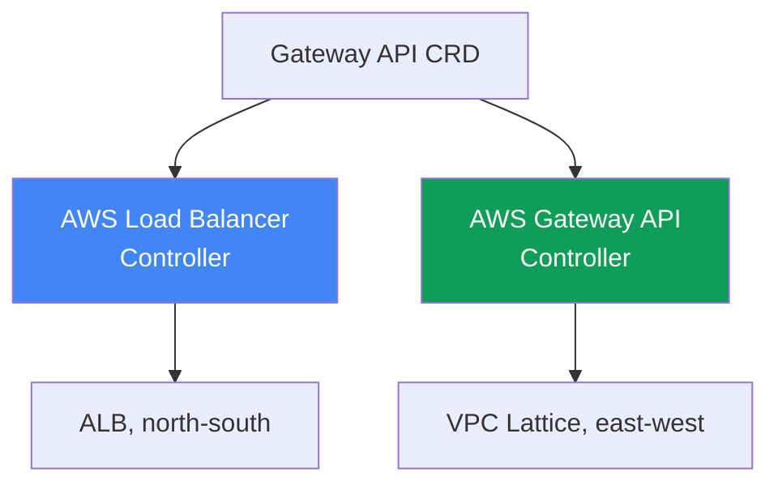
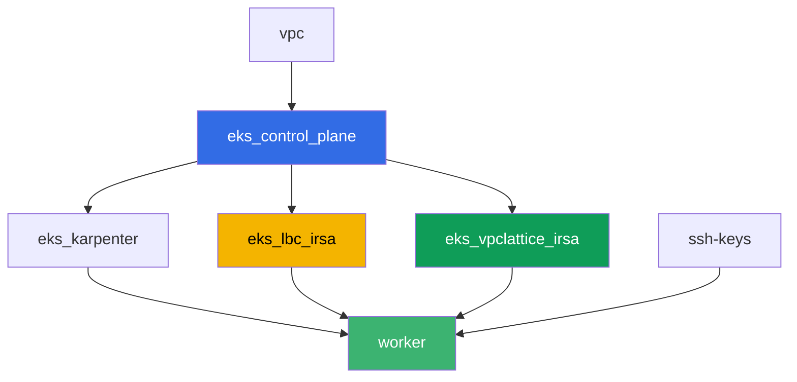

[Русская версия](README_RU.MD) · [Eng version](README.MD) · [Versión en español](README_ES.MD) · [Version française](README_FR.MD) · [Deutsche Version](README_DE.MD) · [繁體中文版](README_TW.MD) · [日本語版](README_JP.MD)

# ლაბა 128 - Gateway API AWS-ში: ALB Gateway API და VPC Lattice

## აღწერა

Ingress ათეულ ანოტაციასთან `alb.ingress.kubernetes.io/` ერთ ობიექტში ერევს
აპლიკაციურ მარშრუტიზაციას და თავად ბალანსერის პარამეტრებს, ხოლო პლატფორმის გუნდი და
დეველოპერი ერთსა და იმავე ფაილს ასწორებენ. Gateway API ინერგავს როლებსა და
ტიპიზაციას: `GatewayClass`-ს აწესებს პლატფორმა, `Gateway`-ს - პლატფორმის გუნდი,
`HTTPRoute`-ს - დეველოპერი. ამ ლაბაში დაშლით Gateway API-ის ორივე რეალიზაციას
AWS-ში - AWS Load Balancer Controller ALB-ის ზემოთ გარედან შესასვლელისთვის და AWS
Gateway API Controller VPC Lattice-ის ზემოთ namespace-ებს შორის სერვისების
დასაკავშირებლად პერიმეტრზე გასვლის გარეშე - და გამოირჩევთ ტიპურ სიმპტომს, როცა route
არ გამოიყენება, რადგან backend-ის მფლობელმა არ გასცა ნებართვა `ReferenceGrant`-ის
მეშვეობით.

დავალებები დაწერილია production-სტილში: მოკლე დავალება პლუს მიღების კრიტერიუმები.
შემოწმება ავტომატურია, ბრძანებით `check_result`.

## მიზანი

გავამყაროთ კურსის ამ თავის მასალა:

- [თავი 28. Gateway API AWS-ში: ALB Gateway API და VPC
  Lattice](../../course/28/ge.md)

## რას ვქმნით

კლასტერი უკვე დეპლოირებულია როგორც კოდი (control plane, Fargate სისტემური
პოდებისთვის, Karpenter დატვირთვისთვის). Terraform დამატებით ქმნის ორ IAM-როლს
IRSA - AWS Load Balancer Controller-ისთვის და AWS Gateway API Controller-ისთვის.
თქვენ აყენებთ ორივე კონტროლერს და Gateway API CRD-ს, შემდეგ ქმნით Gateway API-ის
ობიექტებს ორივე რეალიზაციისთვის.

| ობიექტი | რა არის ეს | რისთვის ამ ლაბაში |
|--------|---------|-------------------|
| Namespace `eks-128` | კლასტერის სექცია ლაბის დატვირთვისთვის | ვინახავთ რესურსებს სისტემურისგან განცალკევებით |
| GatewayClass `aws-alb` | კლასი `gateway.k8s.aws/alb` | აკავშირებს Gateway-ს AWS Load Balancer Controller-თან |
| Gateway `web` + HTTPRoute `app` | L7-შესასვლელი ALB-ის ზემოთ | ინფრასტრუქტურის მფლობელი - პლატფორმა, მარშრუტის მფლობელი - დეველოპერი |
| `TargetGroupConfiguration` `frontend` და `backend` | target group-ის პარამეტრები Service-ისთვის | ტიპიზებული ჩანაცვლება ანოტაციისთვის `alb.ingress.kubernetes.io/target-type` |
| GatewayClass `amazon-vpc-lattice` | VPC Lattice კონტროლერის კლასი | აკავშირებს Gateway-ს AWS Gateway API Controller-თან |
| Gateway `eks-task128-mesh` (კლასი `amazon-vpc-lattice`) | Service Network VPC Lattice | east-west კავშირი namespace-ებს შორის პერიმეტრის გარეშე |
| Deployment `backend` `eks-128-backend`-ში | სერვის-სამიზნე HTTPRoute-ისთვის | აჩვენებს კროს-namespace ბმულს და `ReferenceGrant`-ს |
| HTTPRoute `rates` `eks-128`-ში | მარშრუტი `backend`-ზე სხვა namespace-ში Gateway `web`-ის მეშვეობით | აწარმოებს სიმპტომს `RefNotPermitted` `ReferenceGrant`-ის გარეშე |
| HTTPRoute `rates-lattice` `eks-128`-ში | ის ივე მარშრუტი VPC Lattice Gateway-ის მეშვეობით | საკონტროლო ცდა: ეს რეალიზაცია grant-ს არ ამოწმებს |
| `ReferenceGrant` `eks-128-backend`-ში | ნებართვა კროს-namespace ბმულზე | სიმპტომის ფიქსი, მარშრუტი `rates` იღებს `ResolvedRefs: True` |

Gateway API-ის ორი რეალიზაცია გვერდიგვერდ:



## ინფრასტრუქტურა

გარემო დეპლოირდება AWS-ში (`eu-central-1`) Terragrunt-ის მეშვეობით. ლაბის
თითოეული კატალოგი არის ერთი კომპონენტი საკუთარი `terragrunt.hcl`-ით, რომელიც
მიუთითებს საერთო მოდულზე `terraform/modules/`-ში და აცხადებს დამოკიდებულებებს
`dependency` ბლოკების მეშვეობით. ბაზა იგივეა, რაც ლაბა 101-ში (control plane,
Fargate სისტემური პოდებისთვის, Karpenter დატვირთვისთვის), პლუს ორი IRSA-როლი
კონტროლერებისთვის.

### მოდულები და დამოკიდებულებები

| დირექტორია (კომპონენტი) | მოდული (`terraform/modules/`) | დამოკიდებულია | რას ქმნის |
|---------------------|-------------------------------|------------|-------------|
| `vpc` | `vpc_v3` | - | VPC `10.10.0.0/16`, ქვექსელები ორ AZ-ში, NAT |
| `ssh-keys` | `ssh-keys` | - | SSH-გასაღებების წყვილი სამუშაო მანქანისთვის |
| `eks_control_plane` | `eks_v2_control_plane` | `vpc` | EKS control plane `1.36`, OIDC-პროვაიდერი |
| `eks_fargate_system` | `eks_v2_fargate` | `vpc`, `eks_control_plane` | Fargate-პროფილი `kube-system`-ისთვის და `karpenter`-ისთვის |
| `eks_addons` | `eks_v2_addons` | `eks_control_plane`, `eks_fargate_system` | coredns, kube-proxy, vpc-cni, pod-identity |
| `eks_karpenter` | `eks_v2_karpenter` | `vpc`, `eks_control_plane`, `eks_addons`, `eks_fargate_system` | Karpenter-ის კონტროლერი, ნოუდების IAM-როლი |
| `eks_karpenter_default_vng` | `eks_v2_karpenter_vng` | `vpc`, `eks_control_plane`, `eks_karpenter` | ნაგულისხმევი NodePool `default` AL2023-ზე |
| `eks_lbc_irsa` | `eks_v2_lbc_irsa` | `eks_control_plane` | IAM-როლი IRSA AWS Load Balancer Controller-ისთვის |
| `eks_vpclattice_irsa` | `eks_v2_vpclattice_irsa` | `eks_control_plane` | IAM-როლი IRSA AWS Gateway API Controller-ისთვის |
| `worker` | `eks_v2_work_pc` | `ssh-keys`, `vpc`, `eks_control_plane`, `eks_karpenter`, `eks_lbc_irsa`, `eks_vpclattice_irsa` | სამუშაო მანქანა kubectl-ით, ტესტებით და `check_result`-ით |

მოდული `eks_v2_vpclattice_irsa` შექმნილია `eks_v2_lbc_irsa`-ის ნიმუშზე: IAM-როლი
trust policy-ით კლასტერის OIDC-ზე (პირობა `sub`
`system:serviceaccount:aws-application-networking-system:gateway-api-controller`-ზე)
და inline-პოლიტიკა, გადმოღებული `recommended-inline-policy.json`-იდან ოფიციალური
რეპოზიტორიდან `aws/aws-application-networking-k8s` (უფლება `vpc-lattice:*` პლუს
VPC/ქვექსელების/SG-ის აღწერები, ლოგების მიწოდება, ტეგები და ACM-სერტიფიკატები
`IAMAuthPolicy`-სთვის).

დამოკიდებულებების გრაფი (რაც უფრო ადრე აპლიცირდება, ის ხრიხისკენ ქვემოთაა):



კომპონენტები `eks_fargate_system`, `eks_addons`, `eks_karpenter_default_vng`
ზემოთ მოცემულ გრაფში არ არის ჩართული წაკითხვადობის გულისთვის (არაუმეტეს 8
კვანძისა) - ისინი აპლიცირდება სტანდარტული თანმიმდევრობით `eks_control_plane`-სა
და `eks_karpenter`-ს შორის, როგორც ლაბა 101-ში.

### Worker-ის უფლებები ამ ლაბისთვის

Worker-ის როლს (`eks_v2_work_pc/iam.tf`) უკვე ჰქონდა ფართო `ec2:Describe*` და
`eks:*`. VPC Lattice-ის დიაგნოსტიკისთვის ამ ლაბაში დამატებულია ერთი დამატებითი
`Sid` `VpcLatticeReadForLabs` უფლებებით `vpc-lattice:List*`, `vpc-lattice:Get*`
და `ec2:DescribeManagedPrefixLists` (საჭიროა VPC Lattice-ის managed prefix list-ის
საპოვნელად security group-ის წესისთვის) - ამ ფაილში უკვე არსებული `Sid`-ების
ანალოგიით, დარჩენილი პოლიტიკის შეცვლის გარეშე.

## განლაგება

```bash
TASK=128 make run_eks_task
```

განლაგება გრძელდება დაახლოებით 15-20 წუთი. output-ში მოძებნეთ ხაზი SSH-შეერთებით
სამუშაო მანქანასთან და დაუკავშირდით მას. kubectl იქ უკვე კონფიგურირებულია სწორ
კლასტერზე.

სასარგებლო ბრძანებები სამუშაო მანქანაზე:

```bash
time_left       # რამდენი დრო დარჩა გარემოს
check_result    # გადამოწმება
```

> სტენდის უსაფრთხოება. `env.hcl`-ში ჩართულია `ssh_password_enable = true` და
> `access_cidrs = ["0.0.0.0/0"]` - ეს მოსახერხებელია სასწავლო გარემოსთვის, მაგრამ ასე
> არ უნდა გავხადოთ production-ში. კურსის სტანდარტების მიხედვით (თავები 0.2, 2, 19)
> სამუშაო მანქანებზე წვდომა იხსნება AWS SSM Session Manager-ის მეშვეობით, საჯარო
> SSH-პორტების გარეთ გამოტანის გარეშე, ხოლო `access_cidrs` ვიწროვდება კონკრეტულ
> მისამართებზე. აქ საჯარო SSH დარჩენილია მხოლოდ გაშვების გასამარტივებლად.

## დავალებები

---
|        **1**        | **Gateway API CRD და ლაბის namespace**                        |
| :-----------------: | :---------------------------------------------------------- |
| რას ვაკეთებთ          | დააინსტალირეთ Gateway API-ის სტანდარტული CRD-ები (`kubectl apply --server-side=true -f https://github.com/kubernetes-sigs/gateway-api/releases/download/v1.2.0/standard-install.yaml`). შექმენით namespace `eks-128` და `eks-128-backend`. |
| მიღების კრიტერიუმები    | - CRD `gateways.gateway.networking.k8s.io` არსებობს;<br/>- namespace `eks-128` და `eks-128-backend` არსებობს. |
---
|        **2**        | **AWS Load Balancer Controller და Gateway კლასის ALB (L7)**  |
| :-----------------: | :---------------------------------------------------------- |
| რას ვაკეთებთ          | მოძებნეთ როლის `<cluster-name>-lbc-irsa` ARN და შექმენით ServiceAccount `aws-load-balancer-controller` `kube-system`-ში მასზე ანოტაციით. დააინსტალირეთ AWS Load Balancer Controller Helm-ის მეშვეობით (რეპოზიტორია `https://aws.github.io/eks-charts`, chart `aws-load-balancer-controller`, ფლაგები `--set serviceAccount.create=false --set serviceAccount.name=aws-load-balancer-controller --set clusterName=<cluster> --set region=eu-central-1 --set vpcId=<vpc-id>`). ბოლო ორი ფლაგი სავალდებულოა: კონტროლერის პოდი ხვდება `kube-system`-ში, ხოლო ეს namespace Fargate-ზეა, სადაც IMDS არ არსებობს, და ცალსახა მნიშვნელობების გარეშე კონტროლერი გადადის `CrashLoopBackOff`-ში `failed to get VPC ID ... ec2imds`-ით. შექმენით `GatewayClass` `aws-alb` (`controllerName: gateway.k8s.aws/alb`), შემდეგ `Gateway` `web` `eks-128`-ში (`gatewayClassName: aws-alb`, listener `http` პორტზე `80`). დაელოდეთ `status.conditions`-ს `type: Programmed`, `status: "True"`-ით - ALB აქტიური ხდება 3-4 წუთში. |
| მიღების კრიტერიუმები    | - Deployment `aws-load-balancer-controller` `kube-system`-ში აქვს სულ მცირე ერთი მზა რეპლიკა;<br/>- `GatewayClass` `aws-alb` `controllerName: gateway.k8s.aws/alb`-ით;<br/>- `Gateway` `web` `eks-128`-ში აქვს პირობა `Programmed: True`. |
---
|        **3**        | **HTTPRoute ALB-ზე: აპლიკაციური მარშრუტიზაცია**                |
| :-----------------: | :---------------------------------------------------------- |
| რას ვაკეთებთ          | `eks-128`-ში შექმენით Deployment `frontend` (image `viktoruj/ping_pong:latest`, `2` რეპლიკა, პორტი `8080`) და Service `frontend` (`ClusterIP`, პორტი `80`, `targetPort: 8080`). შექმენით `HTTPRoute` `app` `eks-128`-ში, `parentRefs` `Gateway` `web`-ზე (`sectionName: http`), წესი `backendRefs`-ით Service `frontend`-ზე პორტი `80`. შემდეგ შექმენით `TargetGroupConfiguration` `frontend` `eks-128`-ში (`apiVersion: gateway.k8s.aws/v1`, `spec.targetReference.name: frontend`, `spec.defaultConfiguration.targetType: ip`): მის გარეშე კონტროლერი გამოაქვს სამიზნეების ტიპი `instance`-ად, ხოლო `instance`-ს სჭირდება Service ტიპის `NodePort` ან `LoadBalancer`, ამიტომ `Gateway` გადადის `Accepted: False`-ში, `reason: Invalid`, ხოლო კონტროლერის ლოგში ჩამოკიდებულია `TargetGroup port is empty`. დაელოდეთ `Programmed: True`-ს, შეინახეთ `aws elbv2 describe-load-balancers`-ის output (DNS-სახელით `status.addresses`-იდან) `/var/work/tests/artifacts/3/alb.txt`-ში და შემოწმეთ, რომ ALB პასუხობს: `curl http://<მისამართი>/` აბრუნებს `200`-ს. |
| მიღების კრიტერიუმები    | - `HTTPRoute` `app` `eks-128`-ში სტატუსით `Accepted: True`;<br/>- `Gateway` `web`-ს აქვს არაცარიელი `status.addresses` და `Programmed: True`;<br/>- `TargetGroupConfiguration` `frontend` `eks-128`-ში `targetType: ip`-ით;<br/>- ფაილი `3/alb.txt` არ არის ცარიელი და შეიცავს `"Type": "application"`;<br/>- მოთხოვნა ALB-ის მისამართზე აბრუნებს `200`-ს. |
---
|        **4**        | **AWS Gateway API Controller და Gateway კლასის VPC Lattice**  |
| :-----------------: | :---------------------------------------------------------- |
| რას ვაკეთებთ          | დაუშვით VPC Lattice-ის ტრაფიკი ნოუდების SG-ში: მოძებნეთ `PrefixListId` ბრძანებით `aws ec2 describe-managed-prefix-lists --query "PrefixLists[?PrefixListName=='com.amazonaws.eu-central-1.vpc-lattice'].PrefixListId"` და დაამატეთ წესი `aws ec2 authorize-security-group-ingress --group-id <ნოუდების sg> --ip-permissions "PrefixListIds=[{PrefixListId=<id>}],IpProtocol=-1"`. მოძებნეთ როლის `<cluster-name>-vpclattice-irsa` ARN, შექმენით namespace `aws-application-networking-system`, ServiceAccount `gateway-api-controller` მასში როლზე ანოტაციით. დააინსტალირეთ კონტროლერი Helm-ის მეშვეობით (`oci://public.ecr.aws/aws-application-networking-k8s/aws-gateway-controller-chart`, `--version=v1.1.0`, `--set=serviceAccount.create=false`, `--set=defaultServiceNetwork=eks-task128-mesh`) და აუცილებლად გადააწოდეთ მას `--set=awsRegion`, `--set=awsAccountId`, `--set=clusterVpcId`, `--set=clusterName`: მისი პოდი დგება EC2-ნოუდზე, მაგრამ IMDSv2 hop limit 1-ით არ პასუხობს პოდებს, და ამ მნიშვნელობების გარეშე კონტროლერი ვარდება `init config failed: vpcId is not specified: EC2MetadataError ... status code: 401`-ით. შექმენით `GatewayClass` `amazon-vpc-lattice` (`controllerName: application-networking.k8s.aws/gateway-api-controller`), შემდეგ `Gateway` `eks-task128-mesh` `eks-128`-ში (`gatewayClassName: amazon-vpc-lattice`, listener `http` პორტზე `80`). `Gateway`-ის სახელი ვალდებულია ემთხვეოდეს Service Network-ის სახელს: კონტროლერი ეძებს ქსელს ობიექტის სახელით, არა `defaultServiceNetwork`-ით, და შეუთანხმებლობის შემთხვევაში `Gateway` მუდამ დარჩება `Programmed: False`-ში `VPC Lattice Service Network not found`-ით. დაელოდეთ `Programmed: True`-ს. |
| მიღების კრიტერიუმები    | - კონტროლერის Deployment `aws-application-networking-system`-ში აქვს სულ მცირე ერთი მზა რეპლიკა;<br/>- `GatewayClass` `amazon-vpc-lattice` სწორი `controllerName`-ით;<br/>- `Gateway` `eks-task128-mesh`-ს აქვს პირობა `Programmed: True`, ხოლო პირობის შეტყობინებაში ჩანს service network-ის ARN. |
---
|        **5**        | **სიმპტომი: HTTPRoute ReferenceGrant-ის გარეშე, backend სხვა namespace-ში** |
| :-----------------: | :---------------------------------------------------------- |
| რას ვაკეთებთ          | `eks-128-backend`-ში შექმენით Deployment `backend` (image `viktoruj/ping_pong:latest`, `1` რეპლიკა, პორტი `8080`), Service `backend` (`ClusterIP`, პორტი `80`, `targetPort: 8080`) და `TargetGroupConfiguration` `backend` იმავე ადგილას (`targetType: ip`, როგორც დავალება 3-ში - ობიექტი ვალდებულია იდოს საკუთარი Service-ის namespace-ში). `eks-128`-ში შექმენით `HTTPRoute` `rates`, `parentRefs` `Gateway` `web`-ზე, წესი ბილიკის პრეფიქსით `/rates` და `backendRefs`-ით Service `backend`-ზე **ველით `namespace: eks-128-backend`** - კროს-namespace ბმული ნებართვის გარეშე. შემდეგ შექმენით `HTTPRoute` `rates-lattice` იმავე `backendRefs`-ით, მაგრამ `parentRefs` `Gateway` `eks-task128-mesh`-ზე - ეს არის საკონტროლო ცდა. შეადარეთ `status.parents[0].conditions` ორივე მარშრუტს და შეინახეთ ორივე მდგომარეობა `/var/work/tests/artifacts/5/refnotpermitted.txt`-ში. აუხსენით საკუთარ თავს განსხვავება: წესს `ReferenceGrant` აკვირდება რეალიზაცია, არა API-სერვერი. |
| მიღების კრიტერიუმები    | - `HTTPRoute` `rates` `eks-128`-ში არსებობს, `backendRefs[0].namespace` ტოლია `eks-128-backend`-ის;<br/>- `rates`-ს პირობა `ResolvedRefs` ტოლია `False`-ის `reason: RefNotPermitted`-ით;<br/>- `rates-lattice`-ს იგივე პირობა ტოლია `True`-ის ყოველგვარი `ReferenceGrant`-ის გარეშე;<br/>- ფაილი `5/refnotpermitted.txt` არ არის ცარიელი და შეიცავს `RefNotPermitted`-ს. |
---
|        **6**        | **Fix: ReferenceGrant უშვებს კროს-namespace ბმულს**      |
| :-----------------: | :---------------------------------------------------------- |
| რას ვაკეთებთ          | შექმენით `ReferenceGrant` namespace `eks-128-backend`-ში (სამიზნე backend-ის მფლობელი), რომელიც უშვებს ბმულებს `from` `HTTPRoute` namespace `eks-128`-იდან `to` `Service`-ზე (სახელის გარეშე - მთელი namespace). დაელოდეთ, სანამ მარშრუტ `rates`-ის `status.parents[0].conditions` აჩვენებს `ResolvedRefs: True`-ს (წამები სჭირდება). შემდეგ დარწმუნდით, რომ გზა მთლიანად ამუშავდა: `curl http://<ALB-ის მისამართი>/rates` უნდა დააბრუნოს `200` პოდ `backend`-იდან (სამიზნეების რეგისტრაცია target group-ში ლოდინს ამატებს წუთ-ორ წუთს). შეინახეთ output `/var/work/tests/artifacts/6/resolved.txt`-ში. |
| მიღების კრიტერიუმები    | - `ReferenceGrant` `eks-128-backend`-ში `spec.from[0].kind: HTTPRoute`, `spec.from[0].namespace: eks-128`, `spec.to[0].kind: Service`-ით;<br/>- `HTTPRoute` `rates`-ს აქვს პირობა `ResolvedRefs: True`;<br/>- მოთხოვნა `curl http://<ALB-ის მისამართი>/rates` აბრუნებს `200`-ს, ესე იგი ტრაფიკი ნამდვილად აღწევს `backend`-მდე მეზობელ namespace-ში;<br/>- ფაილი `6/resolved.txt` არ არის ცარიელი და შეიცავს `ResolvedRefs`-ს და `True`-ს. |
---

## შედეგის შემოწმება

სამუშაო მანქანაზე გაუშვით ავტომატური შემოწმება:

```bash
check_result
```

სკრიპტი გაუშვებს ტესტებს და გამოაჩენს შესრულებული დავალებების პროცენტს.

## გადაწყვეტა

ეტალონური გადაწყვეტა: [worker/files/solutions/1_GE.MD](worker/files/solutions/1_GE.MD)

## კლასტერისა და რესურსების წაშლა

> **წაშლის წინ.** Gateway `web` კლასის `aws-alb` შექმნა ნამდვილი ALB და მისი security
> group, ხოლო Gateway `mesh` კლასის `amazon-vpc-lattice` - service network და VPC Lattice-ის
> სერვისები. ეს ყველაფერი კონტროლერებმა გააკეთეს AWS API-ის მეშვეობით, terraform-ის
> state-ში ეს რესურსები არ არსებობს. წაშალეთ თავდაპირველად Kubernetes-ის ობიექტები და
> მიეცით კონტროლერებს თავად გამოიწვიონ წაშლა AWS-ში (finalizer არ გაათავისუფლებს
> ობიექტს, სანამ AWS-რესურსი არ იქნება მოშორებული). თუ თავდაპირველად წაშლით კლასტერს,
> კონტროლერები უკვე არ იქნებიან: ALB და მისი SG დარჩებიან ღვიძლმშობლების გარეშე, მათ
> ENI-ებს ქვექსელები გააგრძელებენ ჩაჭერას, და `destroy` გაჩერდება
> `Still destroying...`-ში VPC-ზე, Internet Gateway-ზე ან security group-ზე.

ნაბიჯი 1. მოხსენით მარშრუტები და Gateway, დაელოდეთ, სანამ კონტროლერები მოხსნიან
AWS-რესურსებს:

```bash
kubectl delete httproute app rates rates-lattice -n eks-128
kubectl delete referencegrant allow-from-eks-128 -n eks-128-backend
kubectl delete gateway web eks-task128-mesh -n eks-128
kubectl wait --for=delete gateway/web gateway/eks-task128-mesh -n eks-128 --timeout=300s

# ბალანსერი და VPC Lattice-ის სერვისი უნდა გაქრეს, ორივე output ცარიელია
aws elbv2 describe-load-balancers \
  --query "LoadBalancers[?contains(LoadBalancerName,'eks128')].LoadBalancerName" --output text
aws vpc-lattice list-services --query "items[].name" --output text
```

ნაბიჯი 2. წაშალეთ VPC Lattice-ის Service Network - მას კონტროლერი არ ხსნის. ის ქმნის
ქსელს `defaultServiceNetwork`-ის მიხედვით, მაგრამ `Gateway`-ის წაშლისას მოხსნის მხოლოდ
სერვისებს, ხოლო თავად ქსელი და მისი ასოციაცია VPC-სთან რჩება `ACTIVE`
მდგომარეობაში (გადამოწმებულია სტენდზე). ასოციაცია ჩაჭერს VPC-ს, ამიტომ ამ ნაბიჯის
გარეშე `destroy` ჩერდება ქსელზე:

```bash
SN=$(aws vpc-lattice list-service-networks \
  --query "items[?name=='eks-task128-mesh'].id" --output text)
SNVA=$(aws vpc-lattice list-service-network-vpc-associations \
  --service-network-identifier "$SN" --query "items[].id" --output text)
aws vpc-lattice delete-service-network-vpc-association \
  --service-network-vpc-association-identifier "$SNVA"

# ველოდებით, სანამ ასოციაცია გაქრება, მხოლოდ შემდეგ ვშლით თავად ქსელს
while [ -n "$(aws vpc-lattice list-service-network-vpc-associations \
  --service-network-identifier "$SN" --query 'items[].id' --output text)" ]; do
  echo "association is still there, waiting..." ; sleep 15
done
aws vpc-lattice delete-service-network --service-network-identifier "$SN"
```

ნაბიჯი 3. მოხსენით წესი, დამატებული ხელით დავალება 4-ში, და მოხსენით დატვირთვა, რომ
Karpenter-ის EC2-ნოუდები წავიდნენ კლასტერის წაშლამდე (თუ არა, VPC CNI-ის მეორადი ENI
დარჩება `available`-ში და დააყოვნებს ნოუდების security group-ის წაშლას):

```bash
NODE_SG=$(grep '^node_sg_id' ~/lab128_hints.txt | awk '{print $3}')
PREFIX_LIST_ID=$(aws ec2 describe-managed-prefix-lists \
  --query "PrefixLists[?PrefixListName=='com.amazonaws.eu-central-1.vpc-lattice'].PrefixListId" \
  --output text)
aws ec2 revoke-security-group-ingress --group-id "$NODE_SG" \
  --ip-permissions "PrefixListIds=[{PrefixListId=${PREFIX_LIST_ID}}],IpProtocol=-1"

kubectl delete namespace eks-128 eks-128-backend
helm uninstall gateway-api-controller -n aws-application-networking-system
helm uninstall aws-load-balancer-controller -n kube-system

while [ "$(kubectl get nodes --no-headers | grep -vc fargate)" != "0" ]; do
  echo "EC2 nodes are still running, waiting..." ; sleep 20
done
```

ნაბიჯი 4. წაშალეთ სტენდი:

```bash
TASK=128 make delete_eks_task
```

თუ `destroy` ისევ ჩერდება, მოძებნეთ კონტროლერების ღვიძლმშობლების გარეშე დარჩენილი
რესურსები და მოხსენით ხელით:

```bash
# ლაბის ALB (ჩანს ტეგებით elbv2.k8s.aws/cluster და gateway.k8s.aws/*)
aws elbv2 describe-load-balancers \
  --query "LoadBalancers[?contains(LoadBalancerName,'eks128')].LoadBalancerArn" --output text
aws elbv2 delete-load-balancer --load-balancer-arn <arn>
# ვინ ჩაჭერს security group-ს, რომლის მოშორება ვერ ხერხდება
aws ec2 describe-network-interfaces --filters "Name=group-id,Values=<sg-id>" \
  --query 'NetworkInterfaces[].[NetworkInterfaceId,Description]' --output table
# VPC Lattice-ის რესურსები, დარჩენილი Gateway კლასის amazon-vpc-lattice-ის შემდეგ
aws vpc-lattice list-services
aws vpc-lattice list-service-networks
# და მთავარი - ქსელის ასოციაცია VPC-სთან, ის ზუსტად ხელს არ უშვებს VPC-ის წაშლას
aws vpc-lattice list-service-network-vpc-associations --vpc-identifier <vpc-id>
```
