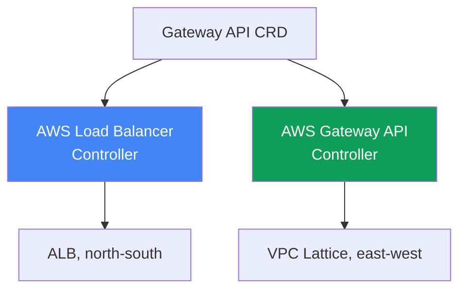
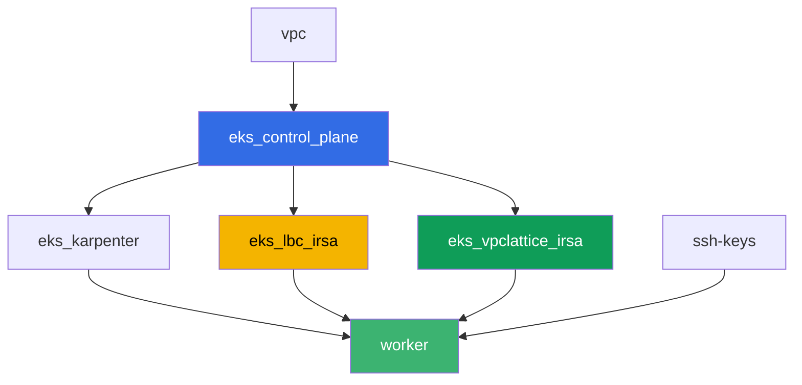

[Русская версия](README_RU.MD) · [Eng version](README.MD) · [Versión en español](README_ES.MD) · [Version française](README_FR.MD) · [Deutsche Version](README_DE.MD) · [ქართული ვერსია](README_GE.MD) · [繁體中文版](README_TW.MD)

# ラボ128 - AWSにおけるGateway API: ALB Gateway APIとVPC Lattice

## 説明

`alb.ingress.kubernetes.io/`という十数個のアノテーションを持つIngressは、アプリケー
ションのルーティングとロードバランサー自体の設定を1つのオブジェクトに混ぜ込んでしま
い、プラットフォームチームと開発者が同じファイルを編集することになります。Gateway
APIはロールと型付けを導入します: `GatewayClass`はプラットフォームが用意し、
`Gateway`はプラットフォームチームが、`HTTPRoute`は開発者が用意します。このラボで
は、AWSにおけるGateway APIの2つの実装を分解します - 外部からの入口用にALBの上に構築
されるAWS Load Balancer Controllerと、境界を越えずにnamespace間でサービスを接続する
ためVPC Latticeの上に構築されるAWS Gateway API Controllerです。そして、backendの所
有者が`ReferenceGrant`で許可を出していないためにrouteが適用されないという典型的な症
状を再現します。

タスクはプロダクションスタイルで記述されています: 短い課題文と受け入れ基準です。チェ
ックは`check_result`コマンドによって自動的に行われます。

## ゴール

コースの章の内容を定着させます:

- [第28章 AWSにおけるGateway API: ALB Gateway APIとVPC
  Lattice](../../course/28/jp.md)

## 作成するもの

クラスタはすでにコードとしてデプロイされています(control plane、システムpod用の
Fargate、ワークロード用のKarpenter)。Terraformは追加で2つのIAMロールIRSAを作成しま
す - AWS Load Balancer Controller用とAWS Gateway API Controller用です。両方のコン
トローラーとGateway API CRDをセットアップし、その後両方の実装に対してGateway APIの
オブジェクトを作成します。

| オブジェクト | それが何か | このラボにある理由 |
|--------|---------|-------------------|
| Namespace `eks-128` | このラボのワークロード用のクラスタ区画 | システムのリソースと分けて保持する |
| GatewayClass `aws-alb` | クラス`gateway.k8s.aws/alb` | GatewayをAWS Load Balancer Controllerに結びつける |
| Gateway `web` + HTTPRoute `app` | ALBの上のL7入口 | インフラの所有者はプラットフォーム、ルートの所有者は開発者 |
| `TargetGroupConfiguration` `frontend`と`backend` | Service用のtarget group設定 | `alb.ingress.kubernetes.io/target-type`アノテーションを置き換える型付けされた仕組み |
| GatewayClass `amazon-vpc-lattice` | VPC Latticeコントローラーのクラス | GatewayをAWS Gateway API Controllerに結びつける |
| Gateway `eks-task128-mesh`(クラス`amazon-vpc-lattice`) | VPC LatticeのService Network | 境界を越えないnamespace間のeast-west接続 |
| `eks-128-backend`内のDeployment `backend` | HTTPRouteの対象サービス | クロスnamespace参照と`ReferenceGrant`を示す |
| `eks-128`内のHTTPRoute `rates` | Gateway `web`を通じて別のnamespaceの`backend`へのルート | `ReferenceGrant`なしでの`RefNotPermitted`症状を再現する |
| `eks-128`内のHTTPRoute `rates-lattice` | VPC Lattice Gatewayを通じた同じルート | 対照実験: この実装はgrantをチェックしない |
| `eks-128-backend`内の`ReferenceGrant` | クロスnamespace参照の許可 | 症状の修正、ルート`rates`が`ResolvedRefs: True`を得る |

Gateway APIの2つの実装を並べて:



## インフラストラクチャ

環境はTerragrunt経由でAWS(`eu-central-1`)にデプロイされています。ラボの各ディレク
トリは、`terraform/modules/`内の共通モジュールを参照し、`dependency`ブロックで依存
関係を宣言する、自分専用の`terragrunt.hcl`を持つ1つのコンポーネントです。ベースはラ
ボ101と同じです(control plane、システムpod用のFargate、ワークロード用の
Karpenter)。それに加えて、コントローラー用の2つのIRSAロールがあります。

### モジュールと依存関係

| ディレクトリ(コンポーネント) | モジュール(`terraform/modules/`) | 依存先 | 作成するもの |
|---------------------|-------------------------------|------------|-------------|
| `vpc` | `vpc_v3` | - | VPC `10.10.0.0/16`、2つのAZのサブネット、NAT |
| `ssh-keys` | `ssh-keys` | - | ワーカーマシン用のSSHキーペア |
| `eks_control_plane` | `eks_v2_control_plane` | `vpc` | EKS control plane `1.36`、OIDCプロバイダー |
| `eks_fargate_system` | `eks_v2_fargate` | `vpc`、`eks_control_plane` | `kube-system`と`karpenter`用のFargateプロファイル |
| `eks_addons` | `eks_v2_addons` | `eks_control_plane`、`eks_fargate_system` | coredns、kube-proxy、vpc-cni、pod-identityアドオン |
| `eks_karpenter` | `eks_v2_karpenter` | `vpc`、`eks_control_plane`、`eks_addons`、`eks_fargate_system` | Karpenterコントローラー、ノードIAMロール |
| `eks_karpenter_default_vng` | `eks_v2_karpenter_vng` | `vpc`、`eks_control_plane`、`eks_karpenter` | AL2023上のデフォルトのNodePool `default` |
| `eks_lbc_irsa` | `eks_v2_lbc_irsa` | `eks_control_plane` | AWS Load Balancer Controller用のIRSA IAMロール |
| `eks_vpclattice_irsa` | `eks_v2_vpclattice_irsa` | `eks_control_plane` | AWS Gateway API Controller用のIRSA IAMロール |
| `worker` | `eks_v2_work_pc` | `ssh-keys`、`vpc`、`eks_control_plane`、`eks_karpenter`、`eks_lbc_irsa`、`eks_vpclattice_irsa` | kubectl、テスト、`check_result`を備えたワーカーマシン |

モジュール`eks_v2_vpclattice_irsa`は`eks_v2_lbc_irsa`をモデルにして作られています:
クラスタのOIDCを信頼するtrust policy(条件`sub`が
`system:serviceaccount:aws-application-networking-system:gateway-api-controller`)
を持つIAMロールと、公式リポジトリ`aws/aws-application-networking-k8s`の
`recommended-inline-policy.json`からコピーされたinlineポリシー(`vpc-lattice:*`の権
限に加えて、VPC/サブネット/SGの記述、ログ配信、タグ、`IAMAuthPolicy`用のACM証明書)
です。

依存関係グラフ(矢印の下にあるほど先に適用される):



コンポーネント`eks_fargate_system`、`eks_addons`、`eks_karpenter_default_vng`は読み
やすさのため上のグラフには含まれていません(ノードは8つ以内)- これらは
`eks_control_plane`と`eks_karpenter`の間で、ラボ101と同じ標準的な順序で適用されま
す。

### このラボにおけるworkerの権限

workerロール(`eks_v2_work_pc/iam.tf`)はすでに広範な`ec2:Describe*`と`eks:*`を持っ
ていました。このラボでVPC Latticeの診断を行うために、`vpc-lattice:List*`、
`vpc-lattice:Get*`、`ec2:DescribeManagedPrefixLists`(security groupのルール用にVPC
Latticeのmanaged prefix listを見つけるために必要)という権限を持つ`Sid`
`VpcLatticeReadForLabs`が1つ追加されています - このファイル内に既存の`Sid`と同じ流
儀で、それ以外のポリシーを変更することなく追加されています。

## デプロイ

```bash
TASK=128 make run_eks_task
```

デプロイには約15〜20分かかります。出力の中からワーカーマシンへのSSH接続の行を見つけ
て接続してください。そこではkubectlが対象のクラスタに対してすでに設定されています。

ワーカーマシン上で役立つコマンド:

```bash
time_left       # 環境の残り時間
check_result    # 解答を確認する
```

> 環境のセキュリティについて。`env.hcl`では`ssh_password_enable = true`と
> `access_cidrs = ["0.0.0.0/0"]`が有効になっています - トレーニング環境としては便利で
> すが、プロダクションでは行うべきではありません。コースの基準(第0.2章、第2章、第19
> 章)に従うと、ワーカーマシンへのアクセスは公開SSHポートを晒さずにAWS SSM Session
> Manager経由で行い、`access_cidrs`は特定のアドレスに絞り込むべきです。ここでは、セ
> ットアップを簡単にするためだけに公開SSHが残されています。

## タスク

---
|        **1**        | **Gateway API CRDとラボのNamespace**                        |
| :-----------------: | :---------------------------------------------------------- |
| 何をするか          | 標準のGateway API CRDをインストールしてください(`kubectl apply --server-side=true -f https://github.com/kubernetes-sigs/gateway-api/releases/download/v1.2.0/standard-install.yaml`)。namespace `eks-128`と`eks-128-backend`を作成してください。 |
| 受け入れ基準    | - CRD `gateways.gateway.networking.k8s.io`が存在する;<br/>- namespace `eks-128`と`eks-128-backend`が存在する。 |
---
|        **2**        | **AWS Load Balancer ControllerとALBクラスのGateway(L7)**  |
| :-----------------: | :---------------------------------------------------------- |
| 何をするか          | ロール`<cluster-name>-lbc-irsa`のARNを見つけ、`kube-system`にそのロールへのアノテーションを付けたServiceAccount `aws-load-balancer-controller`を作成してください。AWS Load Balancer ControllerをHelm経由でインストールしてください(リポジトリ`https://aws.github.io/eks-charts`、チャート`aws-load-balancer-controller`、フラグ`--set serviceAccount.create=false --set serviceAccount.name=aws-load-balancer-controller --set clusterName=<cluster> --set region=eu-central-1 --set vpcId=<vpc-id>`)。最後の2つのフラグは必須です: コントローラーのpodは`kube-system`に配置され、このnamespaceはIMDSのないFargate上にあるため、明示的な値がないとコントローラーは`failed to get VPC ID ... ec2imds`とともに`CrashLoopBackOff`に陥ります。`GatewayClass` `aws-alb`(`controllerName: gateway.k8s.aws/alb`)を作成し、続いて`eks-128`に`Gateway` `web`(`gatewayClassName: aws-alb`、ポート`80`のlistener `http`)を作成してください。`status.conditions`に`type: Programmed`、`status: "True"`が現れるのを待ってください - ALBは3〜4分で稼働状態になります。 |
| 受け入れ基準    | - `kube-system`のDeployment `aws-load-balancer-controller`が少なくとも1つのReadyなレプリカを持つ;<br/>- `GatewayClass` `aws-alb`が`controllerName: gateway.k8s.aws/alb`を持つ;<br/>- `eks-128`の`Gateway` `web`が`Programmed: True`という条件を持つ。 |
---
|        **3**        | **ALB上のHTTPRoute: アプリケーションのルーティング**                |
| :-----------------: | :---------------------------------------------------------- |
| 何をするか          | `eks-128`にDeployment `frontend`(イメージ`viktoruj/ping_pong:latest`、レプリカ数`2`、ポート`8080`)とService `frontend`(`ClusterIP`、ポート`80`、`targetPort: 8080`)を作成してください。`eks-128`に`HTTPRoute` `app`を作成してください。`parentRefs`は`Gateway` `web`(`sectionName: http`)を指し、ルールの`backendRefs`はService `frontend`のポート`80`を指します。続いて`eks-128`に`TargetGroupConfiguration` `frontend`を作成してください(`apiVersion: gateway.k8s.aws/v1`、`spec.targetReference.name: frontend`、`spec.defaultConfiguration.targetType: ip`): これがないと、コントローラーはターゲットの種類を`instance`と推論し、`instance`には`NodePort`または`LoadBalancer`タイプのServiceが必要になるため、`Gateway`は`Accepted: False`、`reason: Invalid`に陥り、コントローラーのログには`TargetGroup port is empty`が居座ります。`Programmed: True`を待ち、`aws elbv2 describe-load-balancers`の出力(`status.addresses`のDNS名で検索)を`/var/work/tests/artifacts/3/alb.txt`に保存し、ALBが応答することを確認してください: `curl http://<アドレス>/`が`200`を返すはずです。 |
| 受け入れ基準    | - `eks-128`の`HTTPRoute` `app`のステータスが`Accepted: True`である;<br/>- `Gateway` `web`の`status.addresses`が空でなく、`Programmed: True`である;<br/>- `eks-128`の`TargetGroupConfiguration` `frontend`が`targetType: ip`を持つ;<br/>- ファイル`3/alb.txt`が空でなく、`"Type": "application"`を含んでいる;<br/>- ALBのアドレスへのリクエストが`200`を返す。 |
---
|        **4**        | **AWS Gateway API ControllerとVPC LatticeクラスのGateway**  |
| :-----------------: | :---------------------------------------------------------- |
| 何をするか          | ノードのSGでVPC Latticeのトラフィックを許可してください: `aws ec2 describe-managed-prefix-lists --query "PrefixLists[?PrefixListName=='com.amazonaws.eu-central-1.vpc-lattice'].PrefixListId"`で`PrefixListId`を見つけ、ルール`aws ec2 authorize-security-group-ingress --group-id <ノードのsg> --ip-permissions "PrefixListIds=[{PrefixListId=<id>}],IpProtocol=-1"`を追加してください。ロール`<cluster-name>-vpclattice-irsa`のARNを見つけ、namespace `aws-application-networking-system`を作成し、その中にそのロールへのアノテーションを付けたServiceAccount `gateway-api-controller`を作成してください。コントローラーをHelm経由でインストールしてください(`oci://public.ecr.aws/aws-application-networking-k8s/aws-gateway-controller-chart`、`--version=v1.1.0`、`--set=serviceAccount.create=false`、`--set=defaultServiceNetwork=eks-task128-mesh`)。そして必ず`--set=awsRegion`、`--set=awsAccountId`、`--set=clusterVpcId`、`--set=clusterName`を渡してください: このコントローラーのpodはEC2ノード上に配置されますが、hop limitが1のIMDSv2はpodに応答しないため、これらの値がないとコントローラーは即座に`init config failed: vpcId is not specified: EC2MetadataError ... status code: 401`で落ちます。`GatewayClass` `amazon-vpc-lattice`(`controllerName: application-networking.k8s.aws/gateway-api-controller`)を作成し、続いて`eks-128`に`Gateway` `eks-task128-mesh`(`gatewayClassName: amazon-vpc-lattice`、ポート`80`のlistener `http`)を作成してください。`Gateway`の名前はService Networkの名前と一致していなければなりません: コントローラーはオブジェクトの名前でネットワークを検索するのであり、`defaultServiceNetwork`ではありません。一致しない場合、`Gateway`は永久に`Programmed: False`のままとなり、`VPC Lattice Service Network not found`というメッセージが出ます。`Programmed: True`を待ってください。 |
| 受け入れ基準    | - `aws-application-networking-system`のコントローラーのDeploymentが少なくとも1つのReadyなレプリカを持つ;<br/>- `GatewayClass` `amazon-vpc-lattice`が正しい`controllerName`を持つ;<br/>- `Gateway` `eks-task128-mesh`が`Programmed: True`という条件を持ち、その条件のメッセージにservice networkのARNが見える。 |
---
|        **5**        | **症状: ReferenceGrantなしのHTTPRoute、別のnamespaceのbackend** |
| :-----------------: | :---------------------------------------------------------- |
| 何をするか          | `eks-128-backend`にDeployment `backend`(イメージ`viktoruj/ping_pong:latest`、レプリカ数`1`、ポート`8080`)、Service `backend`(`ClusterIP`、ポート`80`、`targetPort: 8080`)、そして同じ場所に`TargetGroupConfiguration` `backend`(`targetType: ip`、タスク3と同様 - このオブジェクトは自分のServiceのnamespaceに置かれなければなりません)を作成してください。`eks-128`に`HTTPRoute` `rates`を作成してください。`parentRefs`は`Gateway` `web`を指し、ルールにはパスプレフィックス`/rates`と、**`namespace: eks-128-backend`フィールドを持つ**Service `backend`への`backendRefs`を設定します - これは許可のないクロスnamespace参照です。続いて、同じ`backendRefs`を持つが`parentRefs`が`Gateway` `eks-task128-mesh`を指す`HTTPRoute` `rates-lattice`を作成してください - これは対照実験です。両方のルートの`status.parents[0].conditions`を比較し、両方の状態を`/var/work/tests/artifacts/5/refnotpermitted.txt`に保存してください。その違いを自分で説明してください: `ReferenceGrant`というルールを守るのはAPIサーバーではなく実装です。 |
| 受け入れ基準    | - `eks-128`の`HTTPRoute` `rates`が存在し、`backendRefs[0].namespace`が`eks-128-backend`と等しい;<br/>- `rates`の`ResolvedRefs`条件が`False`で、`reason`が`RefNotPermitted`である;<br/>- `rates-lattice`の同じ条件が、`ReferenceGrant`が一切ないにもかかわらず`True`である;<br/>- ファイル`5/refnotpermitted.txt`が空でなく、`RefNotPermitted`を含んでいる。 |
---
|        **6**        | **修正: ReferenceGrantがクロスnamespace参照を許可する**      |
| :-----------------: | :---------------------------------------------------------- |
| 何をするか          | namespace `eks-128-backend`(対象backendの所有者)に、namespace `eks-128`からの`HTTPRoute`(`from`)による`Service`への参照(`to`、名前なし - namespace全体)を許可する`ReferenceGrant`を作成してください。ルート`rates`の`status.parents[0].conditions`が`ResolvedRefs: True`を示すのを待ってください(数秒かかります)。続いて、経路全体が本当に機能しているか確認してください: `curl http://<ALBのアドレス>/rates`が`backend`podから`200`を返すはずです(target groupへのターゲットの登録により、さらに1〜2分待つ必要があります)。出力を`/var/work/tests/artifacts/6/resolved.txt`に保存してください。 |
| 受け入れ基準    | - `eks-128-backend`の`ReferenceGrant`が`spec.from[0].kind: HTTPRoute`、`spec.from[0].namespace: eks-128`、`spec.to[0].kind: Service`を持つ;<br/>- `HTTPRoute` `rates`が`ResolvedRefs: True`という条件を持つ;<br/>- リクエスト`curl http://<ALBのアドレス>/rates`が`200`を返す、つまりトラフィックが実際に隣接するnamespaceの`backend`まで届いている;<br/>- ファイル`6/resolved.txt`が空でなく、`ResolvedRefs`と`True`を含んでいる。 |
---

## 結果の確認

ワーカーマシン上で自動チェックを実行してください:

```bash
check_result
```

スクリプトはテストを実行し、完了したタスクの割合を表示します。

## ソリューション

参考解答: [worker/files/solutions/1_JP.MD](worker/files/solutions/1_JP.MD)

## クラスタとリソースの削除

> **削除前に。** `aws-alb`クラスのGateway `web`は実際のALBとそのsecurity groupを作成
> し、`amazon-vpc-lattice`クラスのGateway `mesh`はservice networkとVPC Latticeのサー
> ビスを作成しました。これらすべてはコントローラーがAWS API経由で行ったもので、
> terraformのstateにはこれらのリソースはありません。まずKubernetesのオブジェクトを削
> 除し、コントローラー自身にAWS側の削除を呼び出させてください(AWSリソースが取り除
> かれるまで、finalizerはオブジェクトを解放しません)。先にクラスタを削除すると、コ
> ントローラーはもう存在しません: ALBとそのSGは孤立したまま残り、そのENIがサブネッ
> トを引き続き掴み続け、`destroy`はVPC、Internet Gateway、またはsecurity groupの
> `Still destroying...`で止まります。

ステップ1. ルートとGatewayを取り除き、コントローラーがAWSリソースを取り除くのを待ち
ます:

```bash
kubectl delete httproute app rates rates-lattice -n eks-128
kubectl delete referencegrant allow-from-eks-128 -n eks-128-backend
kubectl delete gateway web eks-task128-mesh -n eks-128
kubectl wait --for=delete gateway/web gateway/eks-task128-mesh -n eks-128 --timeout=300s

# ロードバランサーとVPC Latticeのサービスは消えているはずで、両方の出力は空になる
aws elbv2 describe-load-balancers \
  --query "LoadBalancers[?contains(LoadBalancerName,'eks128')].LoadBalancerName" --output text
aws vpc-lattice list-services --query "items[].name" --output text
```

ステップ2. VPC LatticeのService Networkを削除します - コントローラーはこれを削除し
ません。コントローラーは`defaultServiceNetwork`に基づいてネットワークを作成します
が、`Gateway`を削除する際にはサービスだけを取り除き、ネットワーク自体とVPCとの関連付
けは`ACTIVE`のまま残ります(検証済み)。この関連付けがVPCを掴んでいるため、このス
テップを行わないと`destroy`はネットワークのところで止まります:

```bash
SN=$(aws vpc-lattice list-service-networks \
  --query "items[?name=='eks-task128-mesh'].id" --output text)
SNVA=$(aws vpc-lattice list-service-network-vpc-associations \
  --service-network-identifier "$SN" --query "items[].id" --output text)
aws vpc-lattice delete-service-network-vpc-association \
  --service-network-vpc-association-identifier "$SNVA"

# 関連付けがなくなるのを待ち、その後でネットワーク自体を削除する
while [ -n "$(aws vpc-lattice list-service-network-vpc-associations \
  --service-network-identifier "$SN" --query 'items[].id' --output text)" ]; do
  echo "association is still there, waiting..." ; sleep 15
done
aws vpc-lattice delete-service-network --service-network-identifier "$SN"
```

ステップ3. タスク4で手動追加したルールを取り除き、ワークロードを取り除いて、クラス
タの削除前にKarpenterのEC2ノードを消してください(そうしないと、VPC CNIのセカンダリ
ENIが`available`のまま残り、ノードのsecurity groupの削除を遅らせます):

```bash
NODE_SG=$(grep '^node_sg_id' ~/lab128_hints.txt | awk '{print $3}')
PREFIX_LIST_ID=$(aws ec2 describe-managed-prefix-lists \
  --query "PrefixLists[?PrefixListName=='com.amazonaws.eu-central-1.vpc-lattice'].PrefixListId" \
  --output text)
aws ec2 revoke-security-group-ingress --group-id "$NODE_SG" \
  --ip-permissions "PrefixListIds=[{PrefixListId=${PREFIX_LIST_ID}}],IpProtocol=-1"

kubectl delete namespace eks-128 eks-128-backend
helm uninstall gateway-api-controller -n aws-application-networking-system
helm uninstall aws-load-balancer-controller -n kube-system

while [ "$(kubectl get nodes --no-headers | grep -vc fargate)" != "0" ]; do
  echo "EC2 nodes are still running, waiting..." ; sleep 20
done
```

ステップ4. スタックを削除します:

```bash
TASK=128 make delete_eks_task
```

それでも`destroy`が止まる場合は、コントローラーが残した孤立リソースを探して手動で取
り除いてください:

```bash
# ラボのALB(タグelbv2.k8s.aws/clusterとgateway.k8s.aws/*で見つかる)
aws elbv2 describe-load-balancers \
  --query "LoadBalancers[?contains(LoadBalancerName,'eks128')].LoadBalancerArn" --output text
aws elbv2 delete-load-balancer --load-balancer-arn <arn>
# 削除できないsecurity groupを誰が掴んでいるか
aws ec2 describe-network-interfaces --filters "Name=group-id,Values=<sg-id>" \
  --query 'NetworkInterfaces[].[NetworkInterfaceId,Description]' --output table
# amazon-vpc-lattice クラスのGatewayの後に残ったVPC Latticeのリソース
aws vpc-lattice list-services
aws vpc-lattice list-service-networks
# 最も重要なのは - VPCとのネットワークの関連付けで、これがVPCの削除を妨げている
aws vpc-lattice list-service-network-vpc-associations --vpc-identifier <vpc-id>
```
