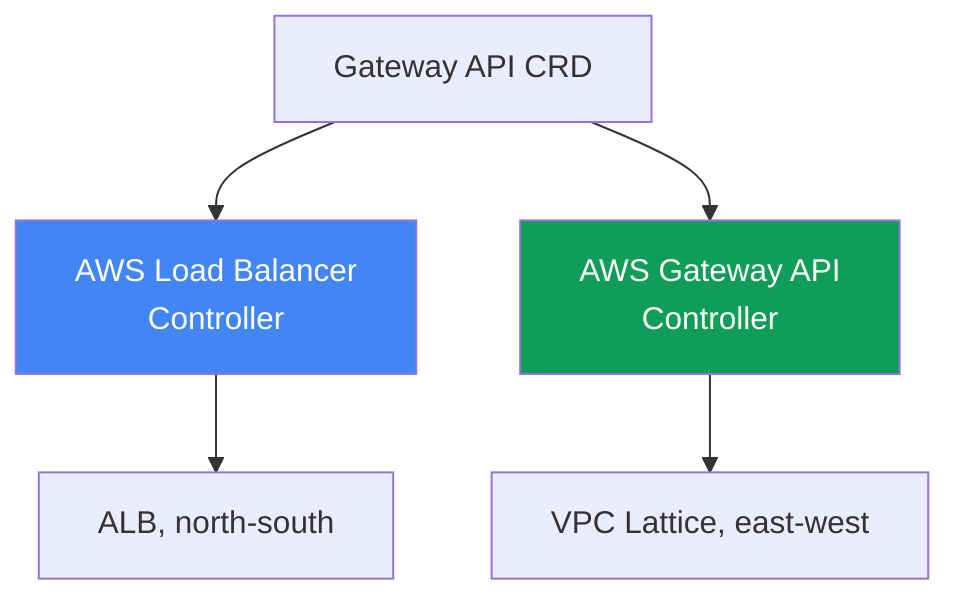
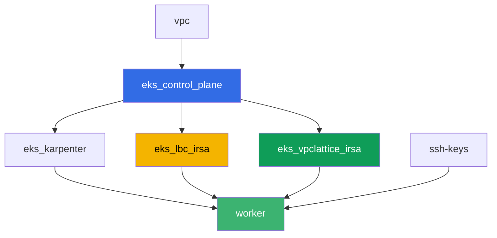

# Лаба 128 - Gateway API в AWS: ALB Gateway API и VPC Lattice

## Описание

Ingress с десятком аннотаций `alb.ingress.kubernetes.io/` смешивает в одном объекте
прикладную маршрутизацию и настройки самого балансировщика, а платформенная команда и
разработчик правят один и тот же файл. Gateway API вводит роли и типизацию: `GatewayClass`
заводит платформа, `Gateway` - платформенная команда, `HTTPRoute` - разработчик. В этой
лабе вы разберёте обе реализации Gateway API в AWS - AWS Load Balancer Controller поверх
ALB для входа снаружи и AWS Gateway API Controller поверх VPC Lattice для связи сервисов
между namespace без выхода на периметр - и воспроизведёте типичный симптом, когда route не
применяется, потому что владелец backend не выдал разрешение через `ReferenceGrant`.

Задания в продакшн-стиле: короткая постановка плюс критерии приёмки. Проверка -
автоматическая, командой `check_result`.

## Цель

Закрепить материал главы курса:

- [Глава 28. Gateway API в AWS: ALB Gateway API и VPC
  Lattice](../../course/28/ru.md)

## Что мы создаём

Кластер уже развёрнут как код (control plane, Fargate под системные поды, Karpenter под
нагрузку). Terraform дополнительно создаёт две IAM-роли IRSA - для AWS Load Balancer
Controller и для AWS Gateway API Controller. Вы ставите оба контроллера и Gateway API CRD,
затем создаёте объекты Gateway API для обеих реализаций.

| Объект | Что это | Зачем в этой лабе |
|--------|---------|-------------------|
| Namespace `eks-128` | раздел кластера под нагрузку лабы | держим ресурсы отдельно от системных |
| GatewayClass `aws-alb` | класс `gateway.k8s.aws/alb` | связывает Gateway с AWS Load Balancer Controller |
| Gateway `web` + HTTPRoute `app` | L7-вход поверх ALB | владелец инфраструктуры - платформа, владелец маршрута - разработчик |
| `TargetGroupConfiguration` `frontend` и `backend` | настройки target group для Service | типизированная замена аннотации `alb.ingress.kubernetes.io/target-type` |
| GatewayClass `amazon-vpc-lattice` | класс контроллера VPC Lattice | связывает Gateway с AWS Gateway API Controller |
| Gateway `eks-task128-mesh` (класс `amazon-vpc-lattice`) | Service Network VPC Lattice | east-west связь между namespace без периметра |
| Deployment `backend` в `eks-128-backend` | сервис-цель для HTTPRoute | показывает кросс-namespace ссылку и `ReferenceGrant` |
| HTTPRoute `rates` в `eks-128` | маршрут на `backend` в другом namespace через Gateway `web` | воспроизводит симптом `RefNotPermitted` без `ReferenceGrant` |
| HTTPRoute `rates-lattice` в `eks-128` | тот же маршрут через Gateway VPC Lattice | контрольный опыт: эта реализация grant не проверяет |
| `ReferenceGrant` в `eks-128-backend` | разрешение на кросс-namespace ссылку | фикс симптома, маршрут `rates` получает `ResolvedRefs: True` |

Две реализации Gateway API рядом:



## Инфраструктура

Окружение разворачивается в AWS (`eu-central-1`) через Terragrunt. Каждый каталог лабы -
это один компонент со своим `terragrunt.hcl`, который ссылается на общий модуль в
`terraform/modules/` и объявляет зависимости через блоки `dependency`. База - та же, что в
лабе 101 (control plane, Fargate под системные поды, Karpenter под нагрузку), плюс две
IRSA-роли для контроллеров.

### Модули и зависимости

| Каталог (компонент) | Модуль (`terraform/modules/`) | Зависит от | Что создаёт |
|---------------------|-------------------------------|------------|-------------|
| `vpc` | `vpc_v3` | - | VPC `10.10.0.0/16`, подсети в двух AZ, NAT |
| `ssh-keys` | `ssh-keys` | - | пара SSH-ключей для рабочей машины |
| `eks_control_plane` | `eks_v2_control_plane` | `vpc` | control plane EKS `1.36`, OIDC-провайдер |
| `eks_fargate_system` | `eks_v2_fargate` | `vpc`, `eks_control_plane` | Fargate-профиль для `kube-system` и `karpenter` |
| `eks_addons` | `eks_v2_addons` | `eks_control_plane`, `eks_fargate_system` | coredns, kube-proxy, vpc-cni, pod-identity |
| `eks_karpenter` | `eks_v2_karpenter` | `vpc`, `eks_control_plane`, `eks_addons`, `eks_fargate_system` | контроллер Karpenter, IAM-роль нод |
| `eks_karpenter_default_vng` | `eks_v2_karpenter_vng` | `vpc`, `eks_control_plane`, `eks_karpenter` | дефолтный NodePool `default` на AL2023 |
| `eks_lbc_irsa` | `eks_v2_lbc_irsa` | `eks_control_plane` | IAM-роль IRSA для AWS Load Balancer Controller |
| `eks_vpclattice_irsa` | `eks_v2_vpclattice_irsa` | `eks_control_plane` | IAM-роль IRSA для AWS Gateway API Controller |
| `worker` | `eks_v2_work_pc` | `ssh-keys`, `vpc`, `eks_control_plane`, `eks_karpenter`, `eks_lbc_irsa`, `eks_vpclattice_irsa` | рабочая машина с kubectl, тестами и `check_result` |

Модуль `eks_v2_vpclattice_irsa` создан по образцу `eks_v2_lbc_irsa`: IAM-роль с trust
policy на OIDC кластера (условие `sub` на
`system:serviceaccount:aws-application-networking-system:gateway-api-controller`) и
inline-политика, скопированная из `recommended-inline-policy.json` официального
репозитория `aws/aws-application-networking-k8s` (право `vpc-lattice:*` плюс описания
VPC/подсетей/SG, доставка логов, теги и ACM-сертификаты для `IAMAuthPolicy`).

Граф зависимостей (что применяется раньше, то ниже по стрелке):



Компоненты `eks_fargate_system`, `eks_addons`, `eks_karpenter_default_vng` в граф выше не
включены ради читаемости (не больше 8 узлов) - они применяются в стандартном порядке
между `eks_control_plane` и `eks_karpenter`, как в лабе 101.

### Права worker для этой лабы

Роль worker (`eks_v2_work_pc/iam.tf`) уже имела широкие `ec2:Describe*` и `eks:*`. Для
диагностики VPC Lattice в этой лабе добавлен один дополнительный `Sid`
`VpcLatticeReadForLabs` с правами `vpc-lattice:List*`, `vpc-lattice:Get*` и
`ec2:DescribeManagedPrefixLists` (нужно, чтобы найти managed prefix list VPC Lattice для
правила security group) - по аналогии с уже существующими `Sid` в этом файле, без
изменения остальной политики.

## Развёртывание

```bash
TASK=128 make run_eks_task
```

Развёртывание занимает примерно 15-20 минут. В выводе найдите строку с SSH-подключением к
рабочей машине и подключитесь к ней. kubectl там уже настроен на нужный кластер.

Полезные команды на рабочей машине:

```bash
time_left       # сколько осталось времени окружения
check_result    # проверить решение
```

> Безопасность стенда. В `env.hcl` включены `ssh_password_enable = true` и
> `access_cidrs = ["0.0.0.0/0"]` - это удобно для учебного окружения, но так делать в
> продакшене нельзя. По стандартам курса (главы 0.2, 2, 19) доступ к рабочим машинам
> открывают через AWS SSM Session Manager без публичных SSH-портов наружу, а `access_cidrs`
> сужают до конкретных адресов. Здесь публичный SSH оставлен только ради простоты запуска.

## Задания

---
|        **1**        | **Gateway API CRD и namespace лабы**                        |
| :-----------------: | :---------------------------------------------------------- |
| Что делаем          | Установите стандартные CRD Gateway API (`kubectl apply --server-side=true -f https://github.com/kubernetes-sigs/gateway-api/releases/download/v1.2.0/standard-install.yaml`). Создайте namespace `eks-128` и `eks-128-backend`. |
| Критерии приёмки    | - CRD `gateways.gateway.networking.k8s.io` существует;<br/>- namespace `eks-128` и `eks-128-backend` существуют. |
---
|        **2**        | **AWS Load Balancer Controller и Gateway класса ALB (L7)**  |
| :-----------------: | :---------------------------------------------------------- |
| Что делаем          | Найдите ARN роли `<cluster-name>-lbc-irsa` и создайте ServiceAccount `aws-load-balancer-controller` в `kube-system` с аннотацией на неё. Поставьте AWS Load Balancer Controller через Helm (репозиторий `https://aws.github.io/eks-charts`, чарт `aws-load-balancer-controller`, флаги `--set serviceAccount.create=false --set serviceAccount.name=aws-load-balancer-controller --set clusterName=<cluster> --set region=eu-central-1 --set vpcId=<vpc-id>`). Последние два флага обязательны: под контроллера попадает в `kube-system`, а этот namespace на Fargate, где нет IMDS, и без явных значений контроллер уходит в `CrashLoopBackOff` с `failed to get VPC ID ... ec2imds`. Создайте `GatewayClass` `aws-alb` (`controllerName: gateway.k8s.aws/alb`), затем `Gateway` `web` в `eks-128` (`gatewayClassName: aws-alb`, listener `http` на порту `80`). Дождитесь `status.conditions` с `type: Programmed`, `status: "True"` - ALB становится активным за 3-4 минуты. |
| Критерии приёмки    | - Deployment `aws-load-balancer-controller` в `kube-system` имеет хотя бы одну готовую реплику;<br/>- `GatewayClass` `aws-alb` с `controllerName: gateway.k8s.aws/alb`;<br/>- `Gateway` `web` в `eks-128` имеет условие `Programmed: True`. |
---
|        **3**        | **HTTPRoute на ALB: прикладная маршрутизация**                |
| :-----------------: | :---------------------------------------------------------- |
| Что делаем          | В `eks-128` создайте Deployment `frontend` (образ `viktoruj/ping_pong:latest`, `2` реплики, порт `8080`) и Service `frontend` (`ClusterIP`, порт `80`, `targetPort: 8080`). Создайте `HTTPRoute` `app` в `eks-128`, `parentRefs` на `Gateway` `web` (`sectionName: http`), правило с `backendRefs` на Service `frontend` порт `80`. Затем создайте `TargetGroupConfiguration` `frontend` в `eks-128` (`apiVersion: gateway.k8s.aws/v1`, `spec.targetReference.name: frontend`, `spec.defaultConfiguration.targetType: ip`): без него контроллер выводит тип целей как `instance`, а для `instance` нужен Service типа `NodePort` или `LoadBalancer`, поэтому `Gateway` уходит в `Accepted: False`, `reason: Invalid`, а в логе контроллера висит `TargetGroup port is empty`. Дождитесь `Programmed: True`, сохраните вывод `aws elbv2 describe-load-balancers` (по DNS-имени из `status.addresses`) в `/var/work/tests/artifacts/3/alb.txt` и проверьте, что ALB отвечает: `curl http://<адрес>/` даёт `200`. |
| Критерии приёмки    | - `HTTPRoute` `app` в `eks-128` со статусом `Accepted: True`;<br/>- `Gateway` `web` имеет непустой `status.addresses` и `Programmed: True`;<br/>- `TargetGroupConfiguration` `frontend` в `eks-128` с `targetType: ip`;<br/>- файл `3/alb.txt` не пуст и содержит `"Type": "application"`;<br/>- запрос на адрес ALB возвращает `200`. |
---
|        **4**        | **AWS Gateway API Controller и Gateway класса VPC Lattice**  |
| :-----------------: | :---------------------------------------------------------- |
| Что делаем          | Разрешите трафик VPC Lattice в SG нод: найдите `PrefixListId` через `aws ec2 describe-managed-prefix-lists --query "PrefixLists[?PrefixListName=='com.amazonaws.eu-central-1.vpc-lattice'].PrefixListId"` и добавьте правило `aws ec2 authorize-security-group-ingress --group-id <sg нод> --ip-permissions "PrefixListIds=[{PrefixListId=<id>}],IpProtocol=-1"`. Найдите ARN роли `<cluster-name>-vpclattice-irsa`, создайте namespace `aws-application-networking-system`, ServiceAccount `gateway-api-controller` в нём с аннотацией на роль. Поставьте контроллер через Helm (`oci://public.ecr.aws/aws-application-networking-k8s/aws-gateway-controller-chart`, `--version=v1.1.0`, `--set=serviceAccount.create=false`, `--set=defaultServiceNetwork=eks-task128-mesh`) и обязательно передайте ему `--set=awsRegion`, `--set=awsAccountId`, `--set=clusterVpcId`, `--set=clusterName`: его под стоит на EC2-ноде, но IMDSv2 с hop limit 1 не отвечает подам, и без этих значений контроллер падает с `init config failed: vpcId is not specified: EC2MetadataError ... status code: 401`. Создайте `GatewayClass` `amazon-vpc-lattice` (`controllerName: application-networking.k8s.aws/gateway-api-controller`), затем `Gateway` `eks-task128-mesh` в `eks-128` (`gatewayClassName: amazon-vpc-lattice`, listener `http` на порту `80`). Имя `Gateway` обязано совпадать с именем Service Network: контроллер ищет сеть по имени объекта, а не по `defaultServiceNetwork`, и при несовпадении `Gateway` навсегда остаётся `Programmed: False` с `VPC Lattice Service Network not found`. Дождитесь `Programmed: True`. |
| Критерии приёмки    | - Deployment контроллера в `aws-application-networking-system` имеет хотя бы одну готовую реплику;<br/>- `GatewayClass` `amazon-vpc-lattice` с правильным `controllerName`;<br/>- `Gateway` `eks-task128-mesh` имеет условие `Programmed: True`, а в сообщении условия виден ARN service network. |
---
|        **5**        | **Симптом: HTTPRoute без ReferenceGrant, backend в другом namespace** |
| :-----------------: | :---------------------------------------------------------- |
| Что делаем          | В `eks-128-backend` создайте Deployment `backend` (образ `viktoruj/ping_pong:latest`, `1` реплика, порт `8080`), Service `backend` (`ClusterIP`, порт `80`, `targetPort: 8080`) и `TargetGroupConfiguration` `backend` там же (`targetType: ip`, как в задании 3 - объект обязан лежать в namespace своего Service). В `eks-128` создайте `HTTPRoute` `rates`, `parentRefs` на `Gateway` `web`, правило с префиксом пути `/rates` и `backendRefs` на Service `backend` **с полем `namespace: eks-128-backend`** - кросс-namespace ссылка без разрешения. Затем создайте `HTTPRoute` `rates-lattice` с тем же `backendRefs`, но `parentRefs` на `Gateway` `eks-task128-mesh` - это контрольный опыт. Сравните `status.parents[0].conditions` обоих маршрутов и сохраните оба состояния в `/var/work/tests/artifacts/5/refnotpermitted.txt`. Объясните себе разницу: правило `ReferenceGrant` соблюдает реализация, а не API-сервер. |
| Критерии приёмки    | - `HTTPRoute` `rates` в `eks-128` существует, `backendRefs[0].namespace` равен `eks-128-backend`;<br/>- у `rates` условие `ResolvedRefs` равно `False` с `reason: RefNotPermitted`;<br/>- у `rates-lattice` то же условие равно `True` без всякого `ReferenceGrant`;<br/>- файл `5/refnotpermitted.txt` не пуст и содержит `RefNotPermitted`. |
---
|        **6**        | **Fix: ReferenceGrant разрешает кросс-namespace ссылку**      |
| :-----------------: | :---------------------------------------------------------- |
| Что делаем          | Создайте `ReferenceGrant` в namespace `eks-128-backend` (владелец целевого backend), разрешающий ссылки `from` `HTTPRoute` из namespace `eks-128` `to` `Service` (без имени - весь namespace). Дождитесь, пока `status.parents[0].conditions` маршрута `rates` покажет `ResolvedRefs: True` (занимает секунды). Затем убедитесь, что путь заработал целиком: `curl http://<адрес ALB>/rates` должен вернуть `200` от пода `backend` (регистрация целей в target group добавляет к ожиданию минуту-две). Сохраните вывод в `/var/work/tests/artifacts/6/resolved.txt`. |
| Критерии приёмки    | - `ReferenceGrant` в `eks-128-backend` с `spec.from[0].kind: HTTPRoute`, `spec.from[0].namespace: eks-128`, `spec.to[0].kind: Service`;<br/>- `HTTPRoute` `rates` имеет условие `ResolvedRefs: True`;<br/>- запрос `curl http://<адрес ALB>/rates` возвращает `200`, то есть трафик действительно доходит до `backend` в соседнем namespace;<br/>- файл `6/resolved.txt` не пуст и содержит `ResolvedRefs` и `True`. |
---

## Проверка результата

На рабочей машине запустите автоматическую проверку:

```bash
check_result
```

Скрипт прогонит тесты и покажет процент выполненных заданий.

## Решение

Эталонное решение: [worker/files/solutions/1.MD](worker/files/solutions/1.MD)

## Удаление кластера и ресурсов

> **Перед удалением.** Gateway `web` класса `aws-alb` создал реальный ALB и его security
> group, а Gateway `mesh` класса `amazon-vpc-lattice` - service network и сервисы VPC Lattice.
> Всё это сделали контроллеры через AWS API, в state terraform этих ресурсов нет. Удалите
> сначала объекты Kubernetes и дайте контроллерам самим вызвать удаление в AWS (finalizer не
> отпустит объект, пока AWS-ресурс не снесён). Если сначала удалить кластер, контроллеров уже
> не будет: ALB и его SG останутся осиротевшими, их ENI продолжат держать подсети, и
> `destroy` зависнет в `Still destroying...` на VPC, Internet Gateway или security group.

Шаг 1. Снять маршруты и Gateway, дождаться, пока контроллеры уберут AWS-ресурсы:

```bash
kubectl delete httproute app rates rates-lattice -n eks-128
kubectl delete referencegrant allow-from-eks-128 -n eks-128-backend
kubectl delete gateway web eks-task128-mesh -n eks-128
kubectl wait --for=delete gateway/web gateway/eks-task128-mesh -n eks-128 --timeout=300s

# балансировщик и сервис VPC Lattice должны исчезнуть, оба вывода пустые
aws elbv2 describe-load-balancers \
  --query "LoadBalancers[?contains(LoadBalancerName,'eks128')].LoadBalancerName" --output text
aws vpc-lattice list-services --query "items[].name" --output text
```

Шаг 2. Удалить Service Network VPC Lattice - её контроллер НЕ удаляет. Он создаёт сеть по
`defaultServiceNetwork`, но при удалении `Gateway` снимает только сервисы, а сама сеть и её
ассоциация с VPC остаются в состоянии `ACTIVE` (проверено на стенде). Ассоциация держит VPC,
поэтому без этого шага `destroy` встанет на сети:

```bash
SN=$(aws vpc-lattice list-service-networks \
  --query "items[?name=='eks-task128-mesh'].id" --output text)
SNVA=$(aws vpc-lattice list-service-network-vpc-associations \
  --service-network-identifier "$SN" --query "items[].id" --output text)
aws vpc-lattice delete-service-network-vpc-association \
  --service-network-vpc-association-identifier "$SNVA"

# ждём, пока ассоциация уйдёт, только потом удаляем саму сеть
while [ -n "$(aws vpc-lattice list-service-network-vpc-associations \
  --service-network-identifier "$SN" --query 'items[].id' --output text)" ]; do
  echo "association is still there, waiting..." ; sleep 15
done
aws vpc-lattice delete-service-network --service-network-identifier "$SN"
```

Шаг 3. Снять правило, добавленное руками в задании 4, и убрать нагрузку, чтобы EC2-ноды
Karpenter ушли до удаления кластера (иначе вторичный ENI от VPC CNI останется `available` и
задержит удаление security group нод):

```bash
NODE_SG=$(grep '^node_sg_id' ~/lab128_hints.txt | awk '{print $3}')
PREFIX_LIST_ID=$(aws ec2 describe-managed-prefix-lists \
  --query "PrefixLists[?PrefixListName=='com.amazonaws.eu-central-1.vpc-lattice'].PrefixListId" \
  --output text)
aws ec2 revoke-security-group-ingress --group-id "$NODE_SG" \
  --ip-permissions "PrefixListIds=[{PrefixListId=${PREFIX_LIST_ID}}],IpProtocol=-1"

kubectl delete namespace eks-128 eks-128-backend
helm uninstall gateway-api-controller -n aws-application-networking-system
helm uninstall aws-load-balancer-controller -n kube-system

while [ "$(kubectl get nodes --no-headers | grep -vc fargate)" != "0" ]; do
  echo "EC2 nodes are still running, waiting..." ; sleep 20
done
```

Шаг 4. Удалить стенд:

```bash
TASK=128 make delete_eks_task
```

Если `destroy` всё же зависает, ищите осиротевшие ресурсы контроллеров и убирайте вручную:

```bash
# ALB лабы (виден по тегам elbv2.k8s.aws/cluster и gateway.k8s.aws/*)
aws elbv2 describe-load-balancers \
  --query "LoadBalancers[?contains(LoadBalancerName,'eks128')].LoadBalancerArn" --output text
aws elbv2 delete-load-balancer --load-balancer-arn <arn>
# кто держит security group, которую не удаётся снести
aws ec2 describe-network-interfaces --filters "Name=group-id,Values=<sg-id>" \
  --query 'NetworkInterfaces[].[NetworkInterfaceId,Description]' --output table
# ресурсы VPC Lattice, оставшиеся после Gateway класса amazon-vpc-lattice
aws vpc-lattice list-services
aws vpc-lattice list-service-networks
# и главное - ассоциация сети с VPC, именно она не даёт удалить VPC
aws vpc-lattice list-service-network-vpc-associations --vpc-identifier <vpc-id>
```
