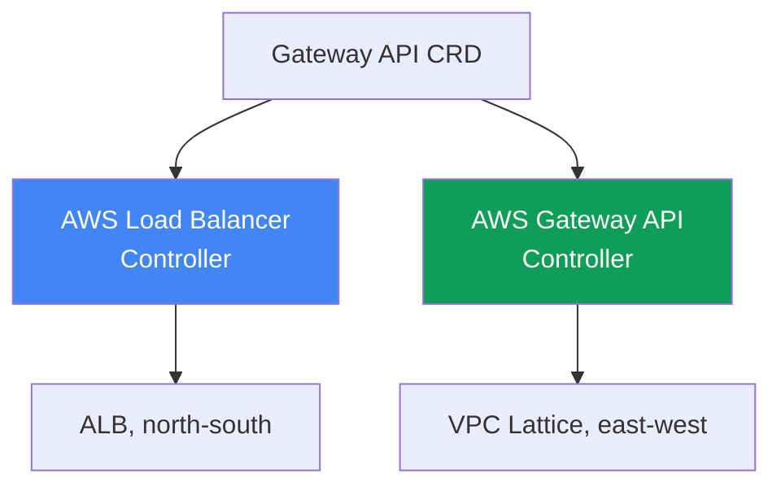
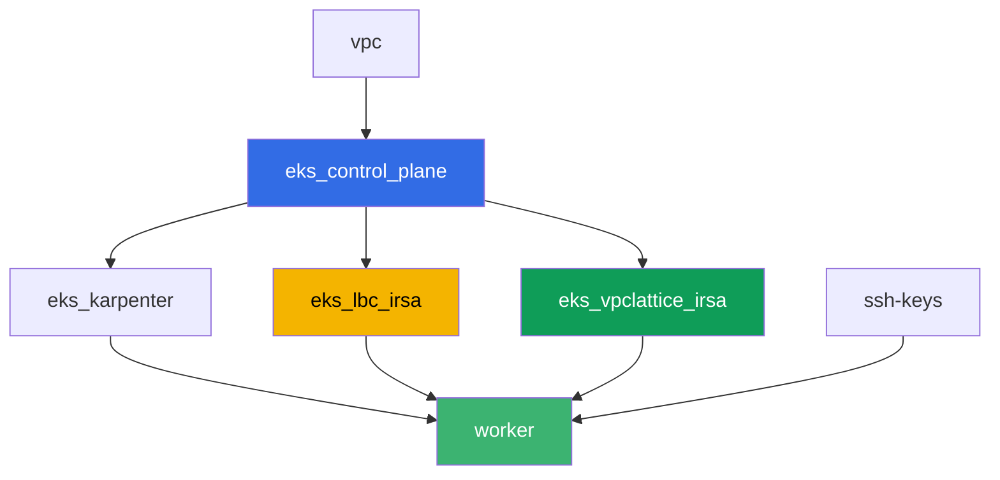

# Лаба 128 - Gateway API в AWS: ALB Gateway API и VPC Lattice

## Описание

Ingress с десятком аннотаций `alb.ingress.kubernetes.io/` смешивает в одном объекте
прикладную маршрутизацию и настройки самого балансировщика, а платформенная команда и
разработчик правят один и тот же файл. Gateway API вводит роли и типизацию: `GatewayClass`
заводит платформа, `Gateway` - платформенная команда, `HTTPRoute` - разработчик. В этой
лабе вы разберёте обе реализации Gateway API в AWS - AWS Load Balancer Controller поверх
ALB для входа снаружи и AWS Gateway API Controller поверх VPC Lattice для связи сервисов
между namespace без выхода на периметр - и воспроизведёте типичный симптом, когда route не
применяется, потому что владелец backend не выдал разрешение через `ReferenceGrant`.

Задания в продакшн-стиле: короткая постановка плюс критерии приёмки. Проверка -
автоматическая, командой `check_result`.

## Цель

Закрепить материал главы курса:

- [Глава 28. Gateway API в AWS: ALB Gateway API и VPC
  Lattice](../../course/28/ru.md)

## Что мы создаём

Кластер уже развёрнут как код (control plane, Fargate под системные поды, Karpenter под
нагрузку). Terraform дополнительно создаёт две IAM-роли IRSA - для AWS Load Balancer
Controller и для AWS Gateway API Controller. Вы ставите оба контроллера и Gateway API CRD,
затем создаёте объекты Gateway API для обеих реализаций.

| Объект | Что это | Зачем в этой лабе |
|--------|---------|-------------------|
| Namespace `eks-128` | раздел кластера под нагрузку лабы | держим ресурсы отдельно от системных |
| GatewayClass `aws-alb` | класс `gateway.k8s.aws/alb` | связывает Gateway с AWS Load Balancer Controller |
| Gateway `web` + HTTPRoute `app` | L7-вход поверх ALB | владелец инфраструктуры - платформа, владелец маршрута - разработчик |
| GatewayClass `amazon-vpc-lattice` | класс контроллера VPC Lattice | связывает Gateway с AWS Gateway API Controller |
| Gateway `mesh` (класс `amazon-vpc-lattice`) | Service Network VPC Lattice | east-west связь между namespace без периметра |
| Deployment `backend` в `eks-128-backend` | сервис-цель для HTTPRoute | показывает кросс-namespace ссылку и `ReferenceGrant` |
| HTTPRoute `rates` в `eks-128` | маршрут на `backend` в другом namespace | воспроизводит симптом `RefNotPermitted` без `ReferenceGrant` |
| `ReferenceGrant` в `eks-128-backend` | разрешение на кросс-namespace ссылку | фикс симптома, маршрут получает `ResolvedRefs: True` |

Две реализации Gateway API рядом:



## Инфраструктура

Окружение разворачивается в AWS (`eu-central-1`) через Terragrunt. Каждый каталог лабы -
это один компонент со своим `terragrunt.hcl`, который ссылается на общий модуль в
`terraform/modules/` и объявляет зависимости через блоки `dependency`. База - та же, что в
лабе 101 (control plane, Fargate под системные поды, Karpenter под нагрузку), плюс две
IRSA-роли для контроллеров.

### Модули и зависимости

| Каталог (компонент) | Модуль (`terraform/modules/`) | Зависит от | Что создаёт |
|---------------------|-------------------------------|------------|-------------|
| `vpc` | `vpc_v3` | - | VPC `10.10.0.0/16`, подсети в двух AZ, NAT |
| `ssh-keys` | `ssh-keys` | - | пара SSH-ключей для рабочей машины |
| `eks_control_plane` | `eks_v2_control_plane` | `vpc` | control plane EKS `1.36`, OIDC-провайдер |
| `eks_fargate_system` | `eks_v2_fargate` | `vpc`, `eks_control_plane` | Fargate-профиль для `kube-system` и `karpenter` |
| `eks_addons` | `eks_v2_addons` | `eks_control_plane`, `eks_fargate_system` | coredns, kube-proxy, vpc-cni, pod-identity |
| `eks_karpenter` | `eks_v2_karpenter` | `vpc`, `eks_control_plane`, `eks_addons`, `eks_fargate_system` | контроллер Karpenter, IAM-роль нод |
| `eks_karpenter_default_vng` | `eks_v2_karpenter_vng` | `vpc`, `eks_control_plane`, `eks_karpenter` | дефолтный NodePool `default` на AL2023 |
| `eks_lbc_irsa` | `eks_v2_lbc_irsa` | `eks_control_plane` | IAM-роль IRSA для AWS Load Balancer Controller |
| `eks_vpclattice_irsa` | `eks_v2_vpclattice_irsa` | `eks_control_plane` | IAM-роль IRSA для AWS Gateway API Controller |
| `worker` | `eks_v2_work_pc` | `ssh-keys`, `vpc`, `eks_control_plane`, `eks_karpenter`, `eks_lbc_irsa`, `eks_vpclattice_irsa` | рабочая машина с kubectl, тестами и `check_result` |

Модуль `eks_v2_vpclattice_irsa` создан по образцу `eks_v2_lbc_irsa`: IAM-роль с trust
policy на OIDC кластера (условие `sub` на
`system:serviceaccount:aws-application-networking-system:gateway-api-controller`) и
inline-политика, скопированная из `recommended-inline-policy.json` официального
репозитория `aws/aws-application-networking-k8s` (право `vpc-lattice:*` плюс описания
VPC/подсетей/SG, доставка логов, теги и ACM-сертификаты для `IAMAuthPolicy`).

Граф зависимостей (что применяется раньше, то ниже по стрелке):



Компоненты `eks_fargate_system`, `eks_addons`, `eks_karpenter_default_vng` в граф выше не
включены ради читаемости (не больше 8 узлов) - они применяются в стандартном порядке
между `eks_control_plane` и `eks_karpenter`, как в лабе 101.

### Права worker для этой лабы

Роль worker (`eks_v2_work_pc/iam.tf`) уже имела широкие `ec2:Describe*` и `eks:*`. Для
диагностики VPC Lattice в этой лабе добавлен один дополнительный `Sid`
`VpcLatticeReadForLabs` с правами `vpc-lattice:List*`, `vpc-lattice:Get*` и
`ec2:DescribeManagedPrefixLists` (нужно, чтобы найти managed prefix list VPC Lattice для
правила security group) - по аналогии с уже существующими `Sid` в этом файле, без
изменения остальной политики.

## Развёртывание

```bash
TASK=128 make run_eks_task
```

Развёртывание занимает примерно 15-20 минут. В выводе найдите строку с SSH-подключением к
рабочей машине и подключитесь к ней. kubectl там уже настроен на нужный кластер.

Полезные команды на рабочей машине:

```bash
time_left       # сколько осталось времени окружения
check_result    # проверить решение
```

> Безопасность стенда. В `env.hcl` включены `ssh_password_enable = true` и
> `access_cidrs = ["0.0.0.0/0"]` - это удобно для учебного окружения, но так делать в
> продакшене нельзя. По стандартам курса (главы 0.2, 2, 19) доступ к рабочим машинам
> открывают через AWS SSM Session Manager без публичных SSH-портов наружу, а `access_cidrs`
> сужают до конкретных адресов. Здесь публичный SSH оставлен только ради простоты запуска.

## Задания

---
|        **1**        | **Gateway API CRD и namespace лабы**                        |
| :-----------------: | :---------------------------------------------------------- |
| Что делаем          | Установите стандартные CRD Gateway API (`kubectl apply --server-side=true -f https://github.com/kubernetes-sigs/gateway-api/releases/download/v1.2.0/standard-install.yaml`). Создайте namespace `eks-128` и `eks-128-backend`. |
| Критерии приёмки    | - CRD `gateways.gateway.networking.k8s.io` существует;<br/>- namespace `eks-128` и `eks-128-backend` существуют. |
---
|        **2**        | **AWS Load Balancer Controller и Gateway класса ALB (L7)**  |
| :-----------------: | :---------------------------------------------------------- |
| Что делаем          | Найдите ARN роли `<cluster-name>-lbc-irsa` и создайте ServiceAccount `aws-load-balancer-controller` в `kube-system` с аннотацией на неё. Поставьте AWS Load Balancer Controller через Helm (репозиторий `https://aws.github.io/eks-charts`, чарт `aws-load-balancer-controller`, флаги `--set serviceAccount.create=false --set serviceAccount.name=aws-load-balancer-controller --set clusterName=<cluster>`). Создайте `GatewayClass` `aws-alb` (`controllerName: gateway.k8s.aws/alb`), затем `Gateway` `web` в `eks-128` (`gatewayClassName: aws-alb`, listener `http` на порту `80`). Дождитесь `status.conditions` с `type: Programmed`, `status: "True"`. |
| Критерии приёмки    | - Deployment `aws-load-balancer-controller` в `kube-system` имеет хотя бы одну готовую реплику;<br/>- `GatewayClass` `aws-alb` с `controllerName: gateway.k8s.aws/alb`;<br/>- `Gateway` `web` в `eks-128` имеет условие `Programmed: True`. |
---
|        **3**        | **HTTPRoute на ALB: прикладная маршрутизация**                |
| :-----------------: | :---------------------------------------------------------- |
| Что делаем          | В `eks-128` создайте Deployment `frontend` (образ `viktoruj/ping_pong:latest`, `2` реплики, порт `8080`) и Service `frontend` (`ClusterIP`, порт `80`, `targetPort: 8080`). Создайте `HTTPRoute` `app` в `eks-128`, `parentRefs` на `Gateway` `web` (`sectionName: http`), правило с `backendRefs` на Service `frontend` порт `80`. Дождитесь адреса ALB (`kubectl get gateway web -n eks-128 -o wide`) и сохраните вывод `aws elbv2 describe-load-balancers` (по DNS-имени из `status.addresses`) в `/var/work/tests/artifacts/3/alb.txt`. |
| Критерии приёмки    | - `HTTPRoute` `app` в `eks-128` со статусом `Accepted: True`;<br/>- `Gateway` `web` имеет непустой `status.addresses`;<br/>- файл `3/alb.txt` не пуст и содержит `"Type": "application"`. |
---
|        **4**        | **AWS Gateway API Controller и Gateway класса VPC Lattice**  |
| :-----------------: | :---------------------------------------------------------- |
| Что делаем          | Разрешите трафик VPC Lattice в SG нод: найдите `PrefixListId` через `aws ec2 describe-managed-prefix-lists --query "PrefixLists[?PrefixListName=='com.amazonaws.eu-central-1.vpc-lattice'].PrefixListId"` и добавьте правило `aws ec2 authorize-security-group-ingress --group-id <sg нод> --ip-permissions "PrefixListIds=[{PrefixListId=<id>}],IpProtocol=-1"`. Найдите ARN роли `<cluster-name>-vpclattice-irsa`, создайте namespace `aws-application-networking-system`, ServiceAccount `gateway-api-controller` в нём с аннотацией на роль. Поставьте контроллер через Helm (`oci://public.ecr.aws/aws-application-networking-k8s/aws-gateway-controller-chart`, `--set=serviceAccount.create=false`, `--set=defaultServiceNetwork=eks-task128-mesh`). Создайте `GatewayClass` `amazon-vpc-lattice` (`controllerName: application-networking.k8s.aws/gateway-api-controller`), затем `Gateway` `mesh` (`gatewayClassName: amazon-vpc-lattice`, listener `http` на порту `80`). Дождитесь `Programmed: True`. |
| Критерии приёмки    | - Deployment контроллера в `aws-application-networking-system` имеет хотя бы одну готовую реплику;<br/>- `GatewayClass` `amazon-vpc-lattice` с правильным `controllerName`;<br/>- `Gateway` `mesh` имеет условие `Programmed: True`. |
---
|        **5**        | **Симптом: HTTPRoute без ReferenceGrant, backend в другом namespace** |
| :-----------------: | :---------------------------------------------------------- |
| Что делаем          | В `eks-128-backend` создайте Deployment `backend` (образ `viktoruj/ping_pong:latest`, `1` реплика, порт `8080`) и Service `backend` (`ClusterIP`, порт `80`, `targetPort: 8080`). В `eks-128` создайте `HTTPRoute` `rates`, `parentRefs` на `Gateway` `mesh`, правило с `backendRefs` на Service `backend` **с полем `namespace: eks-128-backend`** - кросс-namespace ссылка без разрешения. Проверьте `status.parents[0].conditions` маршрута: условие `ResolvedRefs` должно быть `False` с `reason: RefNotPermitted`. Сохраните это в `/var/work/tests/artifacts/5/refnotpermitted.txt`. |
| Критерии приёмки    | - `HTTPRoute` `rates` в `eks-128` существует, `backendRefs[0].namespace` равен `eks-128-backend`;<br/>- `status.parents[0].conditions` содержит условие `ResolvedRefs` со `status: "False"` и `reason: RefNotPermitted`;<br/>- файл `5/refnotpermitted.txt` не пуст и содержит `RefNotPermitted`. |
---
|        **6**        | **Fix: ReferenceGrant разрешает кросс-namespace ссылку**      |
| :-----------------: | :---------------------------------------------------------- |
| Что делаем          | Создайте `ReferenceGrant` в namespace `eks-128-backend` (владелец целевого backend), разрешающий ссылки `from` `HTTPRoute` из namespace `eks-128` `to` `Service` (без имени - весь namespace). Дождитесь, пока `status.parents[0].conditions` маршрута `rates` покажет `ResolvedRefs: True`. Сохраните вывод в `/var/work/tests/artifacts/6/resolved.txt`. |
| Критерии приёмки    | - `ReferenceGrant` в `eks-128-backend` с `spec.from[0].kind: HTTPRoute`, `spec.from[0].namespace: eks-128`, `spec.to[0].kind: Service`;<br/>- `HTTPRoute` `rates` имеет условие `ResolvedRefs: True`;<br/>- файл `6/resolved.txt` не пуст и содержит `ResolvedRefs` и `True`. |
---

## Проверка результата

На рабочей машине запустите автоматическую проверку:

```bash
check_result
```

Скрипт прогонит тесты и покажет процент выполненных заданий.

## Решение

Эталонное решение: [worker/files/solutions/1.MD](worker/files/solutions/1.MD)

## Удаление кластера и ресурсов

```bash
TASK=128 make delete_eks_task
```
