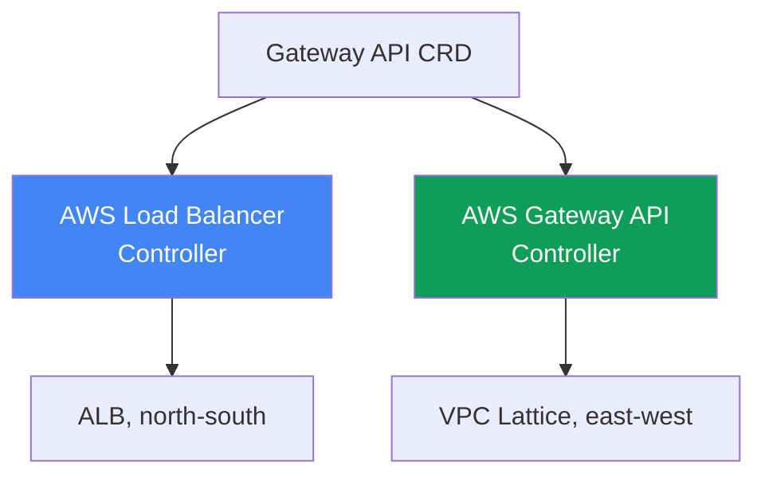
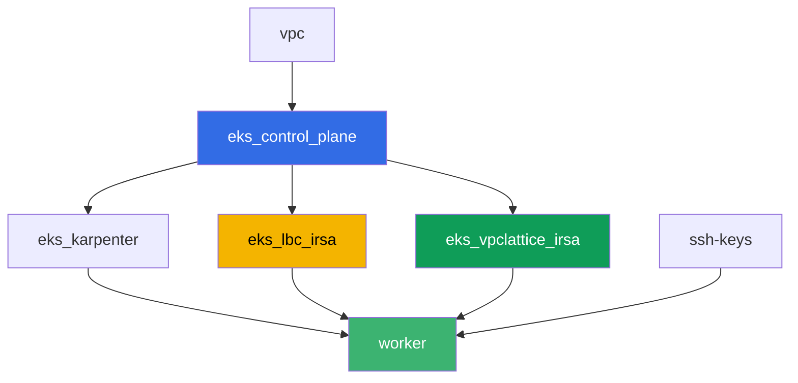

[Русская версия](README_RU.MD) · [Eng version](README.MD) · [Versión en español](README_ES.MD) · [Version française](README_FR.MD) · [Deutsche Version](README_DE.MD) · [ქართული ვერსია](README_GE.MD) · [日本語版](README_JP.MD)

# 實驗 128 - AWS 上的 Gateway API:ALB Gateway API 與 VPC Lattice

## 說明

帶有十幾個 `alb.ingress.kubernetes.io/` 註解的 Ingress 會把應用層路由和負載平衡器本
身的設定混在同一個對象裡,而平台團隊和開發者要修改同一個檔案。Gateway API 引入了角
色和類型化:`GatewayClass` 由平台建立,`Gateway` 由平台團隊建立,`HTTPRoute` 由開發
者建立。在這個實驗中,你會拆解 AWS 上 Gateway API 的兩種實現 - 用於外部入口的 AWS
Load Balancer Controller 搭配 ALB,以及用於 namespace 之間服務互連而不暴露到邊界的
AWS Gateway API Controller 搭配 VPC Lattice - 並重現一個典型的症狀:route 沒有生
效,因為 backend 的擁有者沒有透過 `ReferenceGrant` 給予許可。

任務以生產風格編寫:簡短的任務描述加驗收標準。驗證是自動的,透過 `check_result` 命令
完成。

## 目標

鞏固以下課程章節的內容:

- [第 28 章。AWS 上的 Gateway API:ALB Gateway API 與 VPC
  Lattice](../../course/28/tw.md)

## 我們要創建什麼

集群已經以程式碼形式部署完成(control plane、供系統 pod 使用的 Fargate、供負載使用
的 Karpenter)。Terraform 另外創建了兩個 IAM 角色 IRSA - 分別供 AWS Load Balancer
Controller 和 AWS Gateway API Controller 使用。你會安裝這兩個控制器和 Gateway API
CRD,然後為兩種實現創建 Gateway API 對象。

| 對象 | 這是什麼 | 在這個實驗中的作用 |
|--------|---------|-------------------|
| Namespace `eks-128` | 集群中供這個實驗負載使用的區段 | 讓資源與系統資源分開 |
| GatewayClass `aws-alb` | 類別 `gateway.k8s.aws/alb` | 把 Gateway 與 AWS Load Balancer Controller 連接起來 |
| Gateway `web` + HTTPRoute `app` | ALB 之上的 L7 入口 | 基礎設施的擁有者是平台,路由的擁有者是開發者 |
| `TargetGroupConfiguration` `frontend` 與 `backend` | Service 的 target group 設定 | 取代 `alb.ingress.kubernetes.io/target-type` 註解的類型化方案 |
| GatewayClass `amazon-vpc-lattice` | VPC Lattice 控制器的類別 | 把 Gateway 與 AWS Gateway API Controller 連接起來 |
| Gateway `eks-task128-mesh`(類別 `amazon-vpc-lattice`) | VPC Lattice 的 Service Network | namespace 之間的 east-west 連接,不經過邊界 |
| `eks-128-backend` 中的 Deployment `backend` | HTTPRoute 的目標服務 | 展示跨 namespace 引用與 `ReferenceGrant` |
| `eks-128` 中的 HTTPRoute `rates` | 透過 Gateway `web` 指向另一個 namespace 中 `backend` 的路由 | 重現沒有 `ReferenceGrant` 時的 `RefNotPermitted` 症狀 |
| `eks-128` 中的 HTTPRoute `rates-lattice` | 透過 VPC Lattice Gateway 的同一路由 | 對照實驗:這個實現不檢查 grant |
| `eks-128-backend` 中的 `ReferenceGrant` | 允許跨 namespace 引用 | 修復症狀,路由 `rates` 得到 `ResolvedRefs: True` |

Gateway API 的兩種實現並列:



## 基礎設施

環境透過 Terragrunt 部署在 AWS(`eu-central-1`)。實驗的每個目錄都是一個帶有自己
`terragrunt.hcl` 的組件,它引用 `terraform/modules/` 中的共用模組,並透過
`dependency` 區塊宣告依賴關係。基礎與實驗 101 相同(control plane、供系統 pod 使用
的 Fargate、供負載使用的 Karpenter),再加上供控制器使用的兩個 IRSA 角色。

### 模組與依賴關係

| 目錄(組件) | 模組(`terraform/modules/`) | 依賴於 | 創建了什麼 |
|---------------------|-------------------------------|------------|-------------|
| `vpc` | `vpc_v3` | - | VPC `10.10.0.0/16`,兩個 AZ 中的子網,NAT |
| `ssh-keys` | `ssh-keys` | - | 供工作機使用的一對 SSH 金鑰 |
| `eks_control_plane` | `eks_v2_control_plane` | `vpc` | EKS control plane `1.36`、OIDC 提供者 |
| `eks_fargate_system` | `eks_v2_fargate` | `vpc`、`eks_control_plane` | `kube-system` 與 `karpenter` 的 Fargate 配置檔 |
| `eks_addons` | `eks_v2_addons` | `eks_control_plane`、`eks_fargate_system` | coredns、kube-proxy、vpc-cni、pod-identity |
| `eks_karpenter` | `eks_v2_karpenter` | `vpc`、`eks_control_plane`、`eks_addons`、`eks_fargate_system` | Karpenter 控制器、節點 IAM 角色 |
| `eks_karpenter_default_vng` | `eks_v2_karpenter_vng` | `vpc`、`eks_control_plane`、`eks_karpenter` | 基於 AL2023 的預設 NodePool `default` |
| `eks_lbc_irsa` | `eks_v2_lbc_irsa` | `eks_control_plane` | 供 AWS Load Balancer Controller 使用的 IRSA IAM 角色 |
| `eks_vpclattice_irsa` | `eks_v2_vpclattice_irsa` | `eks_control_plane` | 供 AWS Gateway API Controller 使用的 IRSA IAM 角色 |
| `worker` | `eks_v2_work_pc` | `ssh-keys`、`vpc`、`eks_control_plane`、`eks_karpenter`、`eks_lbc_irsa`、`eks_vpclattice_irsa` | 帶有 kubectl、測試腳本和 `check_result` 的工作機 |

模組 `eks_v2_vpclattice_irsa` 是仿照 `eks_v2_lbc_irsa` 建立的:一個 IAM 角色,其
trust policy 指向集群的 OIDC(條件 `sub` 為
`system:serviceaccount:aws-application-networking-system:gateway-api-controller`),
以及從官方倉庫 `aws/aws-application-networking-k8s` 的
`recommended-inline-policy.json` 中複製過來的 inline 政策(權限 `vpc-lattice:*`,
再加上 VPC/子網/SG 的描述、日誌傳送、標籤和供 `IAMAuthPolicy` 使用的 ACM 憑證)。

依賴關係圖(較早套用的組件位於箭頭下方):



組件 `eks_fargate_system`、`eks_addons`、`eks_karpenter_default_vng` 為了可讀性沒有
包含在上面的圖中(不超過 8 個節點) - 它們以標準順序在 `eks_control_plane` 和
`eks_karpenter` 之間套用,和實驗 101 中一樣。

### 這個實驗中 worker 的權限

worker 角色(`eks_v2_work_pc/iam.tf`)本來就有廣泛的 `ec2:Describe*` 和 `eks:*`。為了
在這個實驗中診斷 VPC Lattice,添加了一個額外的 `Sid` `VpcLatticeReadForLabs`,權限為
`vpc-lattice:List*`、`vpc-lattice:Get*` 和 `ec2:DescribeManagedPrefixLists`(需要用
它找到 VPC Lattice 的 managed prefix list,用於 security group 規則) - 仿照這個檔案
中已有的 `Sid`,沒有改動其餘的政策。

## 部署

```bash
TASK=128 make run_eks_task
```

部署大約需要 15-20 分鐘。在輸出中找到連接工作機的 SSH 那一行並連接上去。那裡的
kubectl 已經配置好對應的集群。

工作機上的常用命令:

```bash
time_left       # 環境剩餘的時間
check_result    # 檢查解答
```

> 環境安全性。`env.hcl` 中啟用了 `ssh_password_enable = true` 和
> `access_cidrs = ["0.0.0.0/0"]` - 這對於學習環境很方便,但在生產環境中不應該這樣做。
> 依照課程標準(第 0.2、2、19 章),對工作機的存取應透過 AWS SSM Session Manager 進
> 行,不對外暴露公開的 SSH 端口,並將 `access_cidrs` 限制到具體的位址。這裡保留公開
> SSH 只是為了簡化啟動流程。

## 任務

---
|        **1**        | **Gateway API CRD 與實驗的 namespace**                        |
| :-----------------: | :---------------------------------------------------------- |
| 我們要做什麼          | 安裝標準的 Gateway API CRD(`kubectl apply --server-side=true -f https://github.com/kubernetes-sigs/gateway-api/releases/download/v1.2.0/standard-install.yaml`)。創建 namespace `eks-128` 和 `eks-128-backend`。 |
| 驗收標準    | - CRD `gateways.gateway.networking.k8s.io` 存在;<br/>- namespace `eks-128` 和 `eks-128-backend` 存在。 |
---
|        **2**        | **AWS Load Balancer Controller 與 ALB 類別的 Gateway(L7)**  |
| :-----------------: | :---------------------------------------------------------- |
| 我們要做什麼          | 找到角色 `<cluster-name>-lbc-irsa` 的 ARN,並在 `kube-system` 中創建帶有該角色註解的 ServiceAccount `aws-load-balancer-controller`。透過 Helm 安裝 AWS Load Balancer Controller(倉庫 `https://aws.github.io/eks-charts`,chart `aws-load-balancer-controller`,參數 `--set serviceAccount.create=false --set serviceAccount.name=aws-load-balancer-controller --set clusterName=<cluster> --set region=eu-central-1 --set vpcId=<vpc-id>`)。最後兩個參數是必須的:控制器的 pod 落在 `kube-system` 中,而這個 namespace 位於 Fargate 上,沒有 IMDS,沒有明確的值控制器就會進入 `CrashLoopBackOff`,並出現 `failed to get VPC ID ... ec2imds`。創建 `GatewayClass` `aws-alb`(`controllerName: gateway.k8s.aws/alb`),然後在 `eks-128` 中創建 `Gateway` `web`(`gatewayClassName: aws-alb`,listener `http` 使用端口 `80`)。等待 `status.conditions` 中出現 `type: Programmed`、`status: "True"` - ALB 會在 3-4 分鐘內變為啟用狀態。 |
| 驗收標準    | - `kube-system` 中的 Deployment `aws-load-balancer-controller` 至少有一個就緒的副本;<br/>- `GatewayClass` `aws-alb` 帶有 `controllerName: gateway.k8s.aws/alb`;<br/>- `eks-128` 中的 `Gateway` `web` 具有 `Programmed: True` 這個條件。 |
---
|        **3**        | **ALB 上的 HTTPRoute:應用層路由**                |
| :-----------------: | :---------------------------------------------------------- |
| 我們要做什麼          | 在 `eks-128` 中創建 Deployment `frontend`(映像 `viktoruj/ping_pong:latest`,`2` 個副本,端口 `8080`)和 Service `frontend`(`ClusterIP`,端口 `80`,`targetPort: 8080`)。在 `eks-128` 中創建 `HTTPRoute` `app`,`parentRefs` 指向 `Gateway` `web`(`sectionName: http`),規則中的 `backendRefs` 指向 Service `frontend` 的端口 `80`。然後在 `eks-128` 中創建 `TargetGroupConfiguration` `frontend`(`apiVersion: gateway.k8s.aws/v1`,`spec.targetReference.name: frontend`,`spec.defaultConfiguration.targetType: ip`):沒有它,控制器會把目標類型推斷為 `instance`,而 `instance` 需要 `NodePort` 或 `LoadBalancer` 類型的 Service,因此 `Gateway` 會進入 `Accepted: False`、`reason: Invalid`,控制器日誌中會卡著 `TargetGroup port is empty`。等待 `Programmed: True`,把 `aws elbv2 describe-load-balancers` 的輸出(用 `status.addresses` 中的 DNS 名稱查詢)保存到 `/var/work/tests/artifacts/3/alb.txt`,並確認 ALB 能回應:`curl http://<地址>/` 應回傳 `200`。 |
| 驗收標準    | - `eks-128` 中的 `HTTPRoute` `app` 狀態為 `Accepted: True`;<br/>- `Gateway` `web` 的 `status.addresses` 非空,且 `Programmed: True`;<br/>- `eks-128` 中的 `TargetGroupConfiguration` `frontend` 帶有 `targetType: ip`;<br/>- 檔案 `3/alb.txt` 不為空且包含 `"Type": "application"`;<br/>- 向 ALB 地址發送的請求回傳 `200`。 |
---
|        **4**        | **AWS Gateway API Controller 與 VPC Lattice 類別的 Gateway**  |
| :-----------------: | :---------------------------------------------------------- |
| 我們要做什麼          | 在節點的 SG 中允許 VPC Lattice 的流量:透過 `aws ec2 describe-managed-prefix-lists --query "PrefixLists[?PrefixListName=='com.amazonaws.eu-central-1.vpc-lattice'].PrefixListId"` 找到 `PrefixListId`,並添加規則 `aws ec2 authorize-security-group-ingress --group-id <節點的 sg> --ip-permissions "PrefixListIds=[{PrefixListId=<id>}],IpProtocol=-1"`。找到角色 `<cluster-name>-vpclattice-irsa` 的 ARN,創建 namespace `aws-application-networking-system`,並在其中創建帶有角色註解的 ServiceAccount `gateway-api-controller`。透過 Helm 安裝控制器(`oci://public.ecr.aws/aws-application-networking-k8s/aws-gateway-controller-chart`,`--version=v1.1.0`,`--set=serviceAccount.create=false`,`--set=defaultServiceNetwork=eks-task128-mesh`),並務必傳入 `--set=awsRegion`、`--set=awsAccountId`、`--set=clusterVpcId`、`--set=clusterName`:它的 pod 位於 EC2 節點上,但 hop limit 為 1 的 IMDSv2 不會回應 pod,沒有這些值,控制器會立刻崩潰,出現 `init config failed: vpcId is not specified: EC2MetadataError ... status code: 401`。創建 `GatewayClass` `amazon-vpc-lattice`(`controllerName: application-networking.k8s.aws/gateway-api-controller`),然後在 `eks-128` 中創建 `Gateway` `eks-task128-mesh`(`gatewayClassName: amazon-vpc-lattice`,listener `http` 使用端口 `80`)。`Gateway` 的名稱必須與 Service Network 的名稱一致:控制器是按對象的名稱找網路的,而不是按 `defaultServiceNetwork`,一旦不一致,`Gateway` 就會永遠停留在 `Programmed: False`,並出現 `VPC Lattice Service Network not found`。等待 `Programmed: True`。 |
| 驗收標準    | - `aws-application-networking-system` 中控制器的 Deployment 至少有一個就緒的副本;<br/>- `GatewayClass` `amazon-vpc-lattice` 帶有正確的 `controllerName`;<br/>- `Gateway` `eks-task128-mesh` 具有 `Programmed: True` 這個條件,且該條件的訊息中能看到 service network 的 ARN。 |
---
|        **5**        | **症狀:沒有 ReferenceGrant 的 HTTPRoute,backend 在另一個 namespace** |
| :-----------------: | :---------------------------------------------------------- |
| 我們要做什麼          | 在 `eks-128-backend` 中創建 Deployment `backend`(映像 `viktoruj/ping_pong:latest`,`1` 個副本,端口 `8080`)、Service `backend`(`ClusterIP`,端口 `80`,`targetPort: 8080`)以及同樣位於這裡的 `TargetGroupConfiguration` `backend`(`targetType: ip`,和任務 3 中一樣 - 這個對象必須位於它所屬 Service 的 namespace 中)。在 `eks-128` 中創建 `HTTPRoute` `rates`,`parentRefs` 指向 `Gateway` `web`,規則中路徑前綴為 `/rates`,`backendRefs` 指向 Service `backend`,**帶有欄位 `namespace: eks-128-backend`** - 這是一個沒有許可的跨 namespace 引用。然後創建 `HTTPRoute` `rates-lattice`,它的 `backendRefs` 相同,但 `parentRefs` 指向 `Gateway` `eks-task128-mesh` - 這是一個對照實驗。比較這兩個路由的 `status.parents[0].conditions`,並把兩者的狀態都保存到 `/var/work/tests/artifacts/5/refnotpermitted.txt`。為自己解釋這個差異:`ReferenceGrant` 這個規則是由實現去遵守的,而不是 API 伺服器。 |
| 驗收標準    | - `eks-128` 中的 `HTTPRoute` `rates` 存在,`backendRefs[0].namespace` 等於 `eks-128-backend`;<br/>- `rates` 的 `ResolvedRefs` 條件等於 `False`,`reason` 為 `RefNotPermitted`;<br/>- `rates-lattice` 的同一條件等於 `True`,沒有任何 `ReferenceGrant`;<br/>- 檔案 `5/refnotpermitted.txt` 不為空且包含 `RefNotPermitted`。 |
---
|        **6**        | **修復:ReferenceGrant 允許跨 namespace 引用**      |
| :-----------------: | :---------------------------------------------------------- |
| 我們要做什麼          | 在 namespace `eks-128-backend`(目標 backend 的擁有者)中創建 `ReferenceGrant`,允許來自 namespace `eks-128` 的 `HTTPRoute`(`from`)引用 `Service`(`to`,不帶名稱 - 整個 namespace)。等待路由 `rates` 的 `status.parents[0].conditions` 顯示 `ResolvedRefs: True`(需要幾秒鐘)。然後確認整條路徑真的通了:`curl http://<ALB 地址>/rates` 應該從 `backend` pod 回傳 `200`(target group 中目標的註冊會讓等待再多一兩分鐘)。把輸出保存到 `/var/work/tests/artifacts/6/resolved.txt`。 |
| 驗收標準    | - `eks-128-backend` 中的 `ReferenceGrant` 帶有 `spec.from[0].kind: HTTPRoute`、`spec.from[0].namespace: eks-128`、`spec.to[0].kind: Service`;<br/>- `HTTPRoute` `rates` 具有 `ResolvedRefs: True` 這個條件;<br/>- 請求 `curl http://<ALB 地址>/rates` 回傳 `200`,也就是流量確實到達了相鄰 namespace 中的 `backend`;<br/>- 檔案 `6/resolved.txt` 不為空,且包含 `ResolvedRefs` 和 `True`。 |
---

## 檢查結果

在工作機上執行自動檢查:

```bash
check_result
```

腳本會執行測試,並顯示已完成任務的百分比。

## 解決方案

參考解決方案:[worker/files/solutions/1_TW.MD](worker/files/solutions/1_TW.MD)

## 刪除集群與資源

> **刪除之前。** 類別為 `aws-alb` 的 Gateway `web` 創建了一個真實的 ALB 及其
> security group,而類別為 `amazon-vpc-lattice` 的 Gateway `mesh` 創建了 service
> network 和 VPC Lattice 的服務。這一切都是控制器透過 AWS API 完成的,terraform 的
> state 中沒有這些資源。先刪除 Kubernetes 對象,讓控制器自己去觸發 AWS 中的刪除
> (在 AWS 資源被清除之前,finalizer 不會釋放對象)。如果先刪除集群,控制器就不存
> 在了:ALB 及其 SG 會變成孤兒,它們的 ENI 會繼續佔用子網,`destroy` 會卡在 VPC、
> Internet Gateway 或 security group 上的 `Still destroying...`。

第 1 步。移除路由和 Gateway,等待控制器移除 AWS 資源:

```bash
kubectl delete httproute app rates rates-lattice -n eks-128
kubectl delete referencegrant allow-from-eks-128 -n eks-128-backend
kubectl delete gateway web eks-task128-mesh -n eks-128
kubectl wait --for=delete gateway/web gateway/eks-task128-mesh -n eks-128 --timeout=300s

# 負載平衡器和 VPC Lattice 服務應該消失,兩個輸出都應為空
aws elbv2 describe-load-balancers \
  --query "LoadBalancers[?contains(LoadBalancerName,'eks128')].LoadBalancerName" --output text
aws vpc-lattice list-services --query "items[].name" --output text
```

第 2 步。刪除 VPC Lattice 的 Service Network - 控制器不會刪除它。它按
`defaultServiceNetwork` 創建網路,但在刪除 `Gateway` 時只會移除服務,網路本身及其與
VPC 的關聯會保持在 `ACTIVE` 狀態(已在測試環境中驗證)。這個關聯會佔用 VPC,所以沒有
這一步,`destroy` 會卡在網路上:

```bash
SN=$(aws vpc-lattice list-service-networks \
  --query "items[?name=='eks-task128-mesh'].id" --output text)
SNVA=$(aws vpc-lattice list-service-network-vpc-associations \
  --service-network-identifier "$SN" --query "items[].id" --output text)
aws vpc-lattice delete-service-network-vpc-association \
  --service-network-vpc-association-identifier "$SNVA"

# 等待關聯消失,之後才刪除網路本身
while [ -n "$(aws vpc-lattice list-service-network-vpc-associations \
  --service-network-identifier "$SN" --query 'items[].id' --output text)" ]; do
  echo "association is still there, waiting..." ; sleep 15
done
aws vpc-lattice delete-service-network --service-network-identifier "$SN"
```

第 3 步。移除任務 4 中手動添加的規則,並移除負載,讓 Karpenter 的 EC2 節點在集群刪除
之前消失(否則 VPC CNI 的次要 ENI 會保持 `available` 狀態,延遲節點 security group 的
刪除):

```bash
NODE_SG=$(grep '^node_sg_id' ~/lab128_hints.txt | awk '{print $3}')
PREFIX_LIST_ID=$(aws ec2 describe-managed-prefix-lists \
  --query "PrefixLists[?PrefixListName=='com.amazonaws.eu-central-1.vpc-lattice'].PrefixListId" \
  --output text)
aws ec2 revoke-security-group-ingress --group-id "$NODE_SG" \
  --ip-permissions "PrefixListIds=[{PrefixListId=${PREFIX_LIST_ID}}],IpProtocol=-1"

kubectl delete namespace eks-128 eks-128-backend
helm uninstall gateway-api-controller -n aws-application-networking-system
helm uninstall aws-load-balancer-controller -n kube-system

while [ "$(kubectl get nodes --no-headers | grep -vc fargate)" != "0" ]; do
  echo "EC2 nodes are still running, waiting..." ; sleep 20
done
```

第 4 步。刪除環境:

```bash
TASK=128 make delete_eks_task
```

如果 `destroy` 仍然卡住,尋找控制器留下的孤兒資源並手動移除:

```bash
# 實驗的 ALB(可以透過標籤 elbv2.k8s.aws/cluster 和 gateway.k8s.aws/* 找到)
aws elbv2 describe-load-balancers \
  --query "LoadBalancers[?contains(LoadBalancerName,'eks128')].LoadBalancerArn" --output text
aws elbv2 delete-load-balancer --load-balancer-arn <arn>
# 是誰佔用了無法刪除的 security group
aws ec2 describe-network-interfaces --filters "Name=group-id,Values=<sg-id>" \
  --query 'NetworkInterfaces[].[NetworkInterfaceId,Description]' --output table
# amazon-vpc-lattice 類別的 Gateway 留下的 VPC Lattice 資源
aws vpc-lattice list-services
aws vpc-lattice list-service-networks
# 最重要的 - 網路與 VPC 的關聯,正是它阻止了 VPC 的刪除
aws vpc-lattice list-service-network-vpc-associations --vpc-identifier <vpc-id>
```
