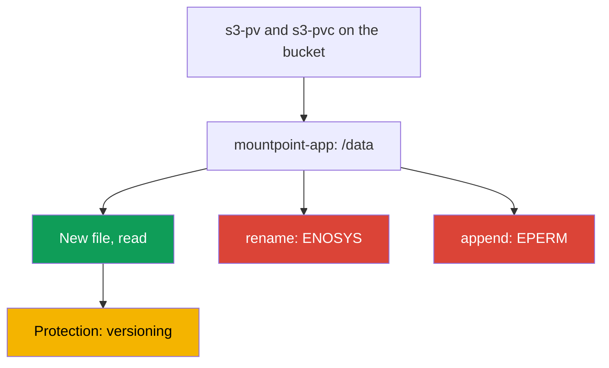
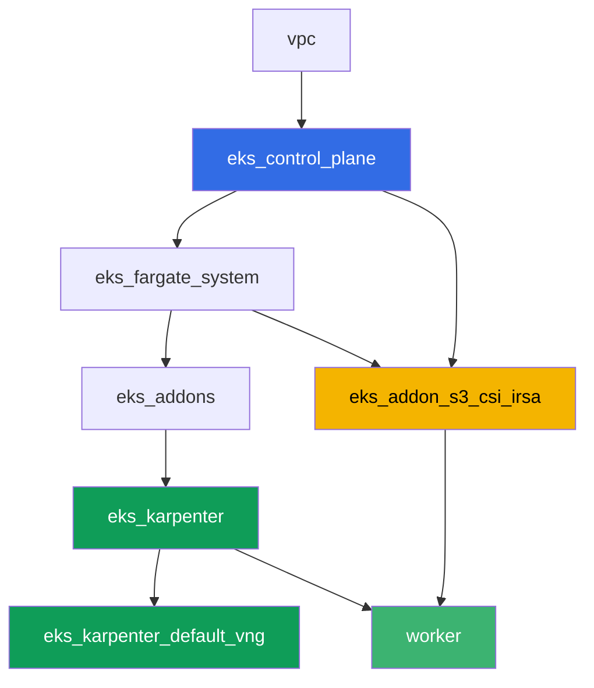

[Русская версия](README_RU.MD) · [Versión en español](README_ES.MD) · [Version française](README_FR.MD) · [Deutsche Version](README_DE.MD) · [ქართული ვერსია](README_GE.MD) · [繁體中文版](README_TW.MD) · [日本語版](README_JP.MD)

# Lab 129 - Mountpoint for S3: where file semantics break and why there is no backup

## Description

A lab about the most common mistake with the Mountpoint for Amazon S3 CSI: the volume is
mounted, the application has started, but familiar filesystem operations fail. You will
bring up a static PV/PVC on a real bucket, confirm that creating a new file and reading
work fine, then reproduce the symptom on `rename`, append and a write into the middle of
a file - all three fail with `Operation not permitted`, because S3 is object storage, not
a POSIX filesystem. At the end you will work through the second half of the topic: why the
objects behind this PVC are not covered by the usual EKS volume backup, and what protects
the data instead of a snapshot.

Tasks are written in a production style: a short statement plus acceptance criteria.
Checking is automatic, via the `check_result` command.

## Goal

Reinforce the material from the course chapter:

- [Chapter 25. S3 in applications: Mountpoint for Amazon S3 CSI and access
  patterns](../../course/25/ru.md) - the main material of the lab
- [Chapter 41-42. AWS Backup for EKS](../../course/41/ru.md) - why EBS snapshots don't
  apply here

## What we're creating

| Object | What it is | Why it's in this lab |
|--------|---------|-------------------|
| Namespace `eks-129` | a cluster section for the lab's workload | keeps resources separate (chapter 4) |
| PV `s3-pv` / PVC `s3-pvc` | a static volume on a real bucket | Mountpoint only supports static provisioning (chapter 25) |
| Deployment `mountpoint-app` | a pod with this PVC on `/data` | a place to test filesystem operations (chapter 25) |
| Artifact `3/create.txt`, `3/read.txt` | proof that creating and reading a file works | successful operations: new file, read (chapter 25) |
| Artifact `4/rename.txt` | output of `mv` on the volume | symptom: `rename` fails (chapter 25) |
| Artifact `5/writesemantics.txt` | output of `append` and a write into the middle | symptom: partial writes are not possible (chapter 25) |
| Artifact `6/backup.txt` | explanation and `get-bucket-versioning` | why there is no snapshot, but there is versioning (chapters 25, 41) |

The path from working operations to the symptom:



## Infrastructure

The environment is deployed in AWS (`eu-central-1`) via Terragrunt. Each lab directory is
one component with its own `terragrunt.hcl`, which references a shared module in
`terraform/modules/` and declares dependencies through `dependency` blocks. Terragrunt
builds the dependency graph and applies the components in the right order. The base is the
same as in lab 101 (control plane, Fargate for system pods, Karpenter for the workload),
plus a separate component for the Mountpoint S3 CSI and a demo bucket.

### Modules and dependencies

| Directory (component) | Module (`terraform/modules/`) | Depends on | What it creates |
|---------------------|-------------------------------|------------|-------------|
| `vpc` | `vpc_v3` | - | VPC `10.10.0.0/16`, subnets in two AZs, NAT |
| `ssh-keys` | `ssh-keys` | - | an SSH key pair for the worker machine and nodes |
| `eks_control_plane` | `eks_v2_control_plane` | `vpc` | EKS control plane `1.36`, OIDC, security groups |
| `eks_fargate_system` | `eks_v2_fargate` | `vpc`, `eks_control_plane` | Fargate profile for `kube-system` and `karpenter` |
| `eks_addons` | `eks_v2_addons` | `eks_control_plane`, `eks_fargate_system` | coredns, kube-proxy, vpc-cni, pod-identity |
| `eks_karpenter` | `eks_v2_karpenter` | `vpc`, `eks_control_plane`, `eks_addons`, `eks_fargate_system` | Karpenter controller, node IAM role |
| `eks_karpenter_default_vng` | `eks_v2_karpenter_vng` | `vpc`, `eks_control_plane`, `eks_karpenter` | default NodePool `default` on AL2023 |
| `eks_addon_s3_csi_irsa` | `eks_v2_s3_csi_irsa` | `eks_fargate_system`, `eks_control_plane` | S3 bucket with versioning, managed addon `aws-mountpoint-s3-csi-driver`, IAM role via IRSA |
| `worker` | `eks_v2_work_pc` | `ssh-keys`, `vpc`, `eks_control_plane`, `eks_karpenter`, `eks_addon_s3_csi_irsa` | worker machine with kubectl, tests and `check_result` |

The `eks_addon_s3_csi_irsa` component creates a `<prefix>-mountpoint-demo` bucket with
versioning enabled and a test object `readme.txt`, installs the driver as a managed addon
and grants it an IAM role via IRSA with `s3:ListBucket` on the bucket and
`s3:GetObject`/`s3:PutObject`/`s3:AbortMultipartUpload` on objects - no
`AmazonS3FullAccess`. By the time you create the PV, the driver is already ready (`worker`
depends on `eks_addon_s3_csi_irsa`).

Dependency graph (what gets applied earlier is lower down the arrow):



### Where things are configured

`env.hcl` (shared environment parameters, read by every component):

| Parameter | Value in the lab | What it affects |
|----------|-----------------|---------------|
| `region` | `eu-central-1` | region of all resources and the volume's `mountOptions` |
| `prefix` | `eks-task129` | resource name prefix, including the bucket name |
| `stack_name` | `eks129` | used to build `env_name` - the cluster name |
| `k8_version` | `1.36.0` | kubectl version on the worker machine |

`inputs` in each component's `terragrunt.hcl` (settings of the specific module):

| File | Key settings |
|------|--------------------|
| `eks_addon_s3_csi_irsa/terragrunt.hcl` | managed addon `aws-mountpoint-s3-csi-driver`, role via IRSA on the cluster's `oidc_provider_arn` |
| `worker/terragrunt.hcl` | `test_url` and `task_script_url` pointing to lab 129's files, dependency on `eks_addon_s3_csi_irsa` |

> The `aws-mountpoint-s3-csi-driver` managed addon version in the `eks_v2_s3_csi_irsa`
> module is `v1.15.0-eksbuild.1`, verified on EKS 1.36 (the addon reaches `ACTIVE`). When
> the cluster's minor version changes, check it with
> `aws eks describe-addon-versions --addon-name aws-mountpoint-s3-csi-driver`.

## Deployment

```bash
TASK=129 make run_eks_task
```

Deployment takes roughly 15-20 minutes. In the output, find the line with the SSH
connection to the worker machine and connect to it. kubectl there is already configured on
the target cluster, and the Mountpoint S3 CSI driver and the bucket are already ready.

Useful commands on the worker machine:

```bash
time_left       # how much environment time is left
check_result    # check the solution
```

You can find the real bucket name like this:

```bash
aws s3api list-buckets --query "Buckets[?contains(Name,'mountpoint-demo')].Name" --output text
```

> Environment security. `env.hcl` has `ssh_password_enable = true` and
> `access_cidrs = ["0.0.0.0/0"]` enabled - convenient for a training environment, but this
> is not something to do in production. Per the course standards (chapters 0.2, 2, 19),
> access to worker machines should go through AWS SSM Session Manager without exposing
> public SSH ports, and `access_cidrs` should be narrowed down to specific addresses. Here
> public SSH is left in place only to keep the setup simple.

## Tasks

---
|        **1**        | **Namespace for the lab's workload**                             |
| :-----------------: | :---------------------------------------------------------- |
| What to do          | Create a namespace named `eks-129`. All objects in this lab are created inside it. |
| Acceptance criteria    | - namespace `eks-129` exists. |
---
|        **2**        | **Static PV/PVC on a real bucket**                    |
| :-----------------: | :---------------------------------------------------------- |
| What to do          | Find the bucket name (`aws s3api list-buckets --query "Buckets[?contains(Name,'mountpoint-demo')].Name" --output text`). Create PV `s3-pv`: `driver: s3.csi.aws.com`, a unique `volumeHandle`, `volumeAttributes.bucketName` equal to the real bucket, `accessModes: ["ReadWriteMany"]`, `storageClassName: ""`, `mountOptions: ["region eu-central-1"]`. Create PVC `s3-pvc` in `eks-129` with `volumeName: s3-pv`, the same `accessModes` and `storageClassName: ""`. Mountpoint only supports static provisioning: the PV is written by hand, the bucket is already created by terraform. |
| Acceptance criteria    | - PV `s3-pv` with `driver: s3.csi.aws.com`, a real `bucketName`, `accessModes: ReadWriteMany`, `storageClassName: ""`, `region eu-central-1` in `mountOptions`;<br/>- PVC `s3-pvc` in `eks-129` in `Bound` state on `s3-pv`. |
---
|        **3**        | **Successful operations: a new file and reading**                  |
| :-----------------: | :---------------------------------------------------------- |
| What to do          | In `eks-129`, create Deployment `mountpoint-app` (image `busybox:1.36`, `command: ["sh", "-c", "sleep 86400"]`, `1` replica) with PVC `s3-pvc` mounted on `/data`. The image needs a shell and the utilities `mv`, `dd`, `cat` - this whole lab is built around filesystem operations inside the pod. Through `kubectl exec`, create a new file `echo test > /data/newfile.txt` and read it back. Separately, read the bucket's existing test object `readme.txt` through the same volume. Save both results as artifacts: creating and reading the new file into `/var/work/tests/artifacts/3/create.txt`, the contents of `readme.txt` into `/var/work/tests/artifacts/3/read.txt`. |
| Acceptance criteria    | - Deployment `mountpoint-app` in `eks-129`, volume `s3-pvc` mounted on `/data`, pod `Running`;<br/>- `create.txt` is not empty and contains `test`;<br/>- `read.txt` is not empty and contains `mountpoint demo bucket`. |
---
|        **4**        | **Symptom: `rename` fails**                                |
| :-----------------: | :---------------------------------------------------------- |
| What to do          | In pod `mountpoint-app`, try renaming a file: `mv /data/newfile.txt /data/renamed.txt`. The command must fail. Save the full error output to `/var/work/tests/artifacts/4/rename.txt`. Pay attention to the error text: here it is `Function not implemented`, i.e. `ENOSYS` - Mountpoint doesn't implement the `rename` syscall at all. This is a different kind of failure than in task 5, where the operation is implemented but forbidden (`EPERM`, `Operation not permitted`). Make sure the bucket didn't end up in an intermediate state: object `newfile.txt` is still there, and object `renamed.txt` doesn't exist. |
| Acceptance criteria    | - file `4/rename.txt` is not empty;<br/>- contains `Function not implemented` (or `Operation not permitted`, if the driver version answers differently);<br/>- the bucket has object `newfile.txt` and no object `renamed.txt`. |
---
|        **5**        | **Symptom: append and a write into the middle of a file fail**      |
| :-----------------: | :---------------------------------------------------------- |
| What to do          | In pod `mountpoint-app`, try to append to the existing file: `echo more >> /data/newfile.txt`. Then try to write into the middle of the same file: `dd of=/data/newfile.txt bs=1 seek=1 conv=notrunc` (the input data doesn't matter). Both commands must fail with `Operation not permitted`. While you're at it, check two neighboring operations and explain them to yourself: overwriting an existing file (`echo test2 > /data/newfile.txt`) and deletion (`rm /data/newfile.txt`) also fail with `Operation not permitted`, because by default Mountpoint doesn't enable `allow-overwrite` and `allow-delete`, while `mkdir /data/sub` succeeds silently, because directories in S3 are virtual and no object is created for them. Save the outputs together with a short explanation (an S3 object is immutable and is only updated whole, via a new `PutObject`) to `/var/work/tests/artifacts/5/writesemantics.txt`. |
| Acceptance criteria    | - file `5/writesemantics.txt` is not empty;<br/>- contains `Operation not permitted`;<br/>- contains at least one of `append`, `rename`, `середин`. |
---
|        **6**        | **Why prefixes behind this PVC aren't backed up via AWS Backup** |
| :-----------------: | :---------------------------------------------------------- |
| What to do          | AWS Backup for EKS (chapters 41-42) protects EBS volumes through CSI snapshots. A Mountpoint volume has no EBS under the hood: the data already lives in S3 as objects, not on a block device, so this kind of PVC has no snapshot in the same sense. Data protection here relies on plain S3 mechanisms, primarily bucket versioning (terraform enabled it on this bucket). Confirm this with `aws s3api get-bucket-versioning --bucket <bucket>` and save its output together with an explanation (the volume isn't EBS, there's no snapshot, protection is via versioning) to `/var/work/tests/artifacts/6/backup.txt`. |
| Acceptance criteria    | - file `6/backup.txt` is not empty;<br/>- contains `versioning` and `snapshot` (or `снапшот`);<br/>- contains `Enabled` (the confirmed status of the bucket's versioning). |
---

## Checking the result

On the worker machine, run the automatic check:

```bash
check_result
```

The script runs the tests and shows the percentage of completed tasks.

## Solution

Reference solution: [worker/files/solutions/1.MD](worker/files/solutions/1.MD)

## Deleting the cluster and resources

> **First remove the workload and the bucket's contents.** The bucket was created by
> terraform, but the objects in it appeared from the pods through Mountpoint - for
> terraform these are foreign data. A non-empty bucket can't be deleted, and `destroy` will
> get stuck on it. The volumes here are static (a PV on the Mountpoint CSI driver), but the
> namespace still needs to be deleted first, so the pods release their mount points and
> Karpenter has time to remove the node before the cluster is torn down.

```bash
kubectl delete namespace eks-129 --ignore-not-found

while kubectl get nodes --no-headers 2>/dev/null | grep -qv fargate; do
  echo "EC2 node from Karpenter still alive, waiting..."; sleep 15
done

BUCKET=$(grep '^bucket_name' ~/lab129_hints.txt | awk '{print $3}')
# if versioning is enabled on the bucket, you need both object versions and delete markers
aws s3 rm "s3://${BUCKET}" --recursive
aws s3api list-object-versions --bucket "$BUCKET" \
  --query '{Objects: Versions[].{Key:Key,VersionId:VersionId}}' --output json > /tmp/vers.json
aws s3api delete-objects --bucket "$BUCKET" --delete file:///tmp/vers.json 2>/dev/null
aws s3api list-object-versions --bucket "$BUCKET" \
  --query '{Objects: DeleteMarkers[].{Key:Key,VersionId:VersionId}}' --output json > /tmp/dm.json
aws s3api delete-objects --bucket "$BUCKET" --delete file:///tmp/dm.json 2>/dev/null

# the bucket should become empty: both commands should print None (empty list)
# (length(Versions) doesn't work here - on an empty bucket the field is null and jmespath complains)
aws s3api list-object-versions --bucket "$BUCKET" --query 'Versions[].Key' --output text
aws s3api list-object-versions --bucket "$BUCKET" --query 'DeleteMarkers[].Key' --output text
```

Objects have to be removed via the AWS CLI, not from the pod: `rm` inside the volume fails
with `Operation not permitted`, because Mountpoint mounts without `allow-delete` by default
(the same thing you observed in task 5).

```bash
TASK=129 make delete_eks_task
```
