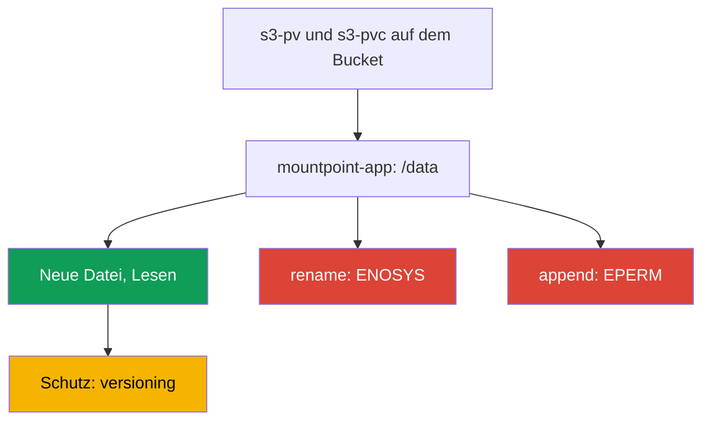
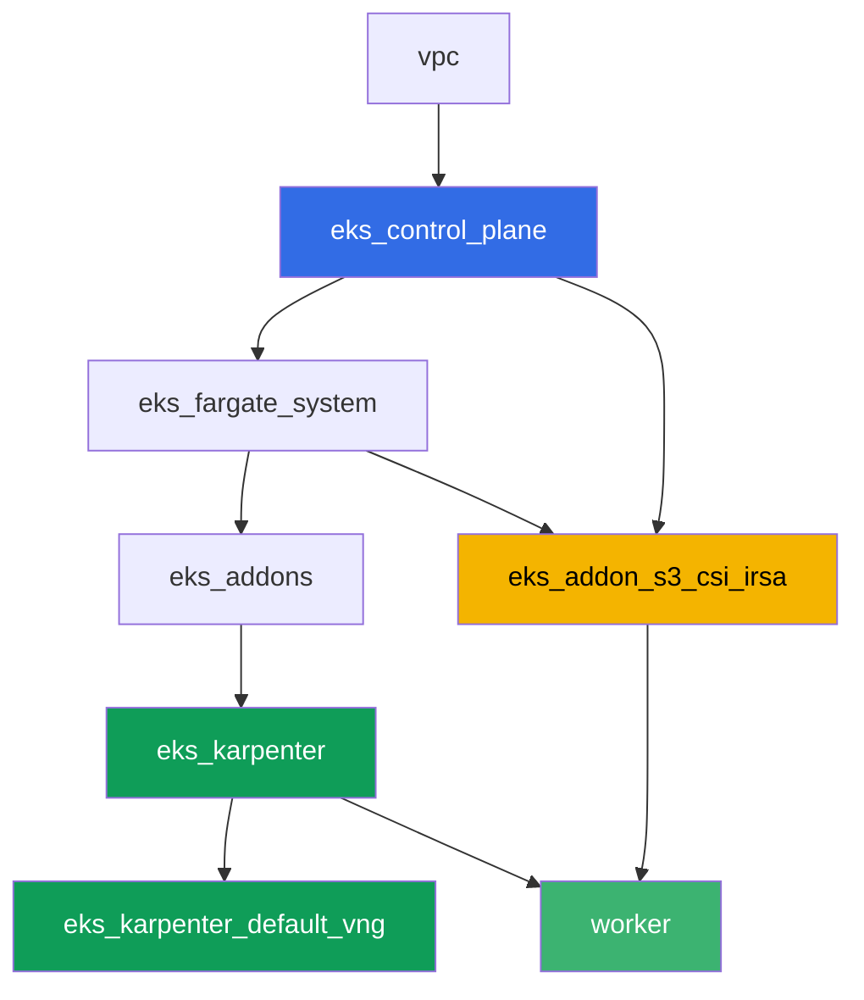

[Русская версия](README_RU.MD) · [Eng version](README.MD) · [Versión en español](README_ES.MD) · [Version française](README_FR.MD) · [ქართული ვერსია](README_GE.MD) · [繁體中文版](README_TW.MD) · [日本語版](README_JP.MD)

# Lab 129 - Mountpoint for S3: wo die Dateisemantik bricht und warum es kein Backup gibt

## Beschreibung

Ein Lab über den häufigsten Fehler mit Mountpoint for Amazon S3 CSI: das Volume ist
gemountet, die Anwendung ist gestartet, aber gewohnte Dateisystemoperationen schlagen fehl.
Sie richten ein statisches PV/PVC auf einem echten Bucket ein, bestätigen, dass das
Erstellen einer neuen Datei und das Lesen funktionieren, und reproduzieren anschließend das
Symptom bei `rename`, beim Append und beim Schreiben in die Mitte einer Datei - alle drei
schlagen mit `Operation not permitted` fehl, weil S3 ein Objektspeicher ist und kein
POSIX-Dateisystem. Am Ende arbeiten Sie die zweite Hälfte des Themas durch: warum die
Objekte hinter diesem PVC nicht vom üblichen EKS-Volume-Backup erfasst werden und was die
Daten anstelle eines Snapshots schützt.

Die Aufgaben sind im Produktionsstil geschrieben: eine kurze Aufgabenstellung plus
Abnahmekriterien. Die Prüfung erfolgt automatisch über den Befehl `check_result`.

## Ziel

Den Stoff aus dem Kurskapitel vertiefen:

- [Kapitel 25. S3 in Anwendungen: Mountpoint for Amazon S3 CSI und
  Zugriffsmuster](../../course/25/ru.md) - das Hauptmaterial des Labs
- [Kapitel 41-42. AWS Backup für EKS](../../course/41/ru.md) - warum EBS-Snapshots hier
  nicht anwendbar sind

## Was wir erstellen

| Objekt | Was das ist | Wozu in diesem Lab |
|--------|---------|-------------------|
| Namespace `eks-129` | ein Cluster-Bereich für die Lab-Workload | hält Ressourcen getrennt (Kapitel 4) |
| PV `s3-pv` / PVC `s3-pvc` | ein statisches Volume auf einem echten Bucket | Mountpoint unterstützt nur statisches Provisioning (Kapitel 25) |
| Deployment `mountpoint-app` | ein Pod mit diesem PVC unter `/data` | Testfeld für Dateisystemoperationen (Kapitel 25) |
| Artefakt `3/create.txt`, `3/read.txt` | Nachweis, dass Erstellen und Lesen einer Datei funktionieren | erfolgreiche Operationen: neue Datei, Lesen (Kapitel 25) |
| Artefakt `4/rename.txt` | Ausgabe von `mv` auf dem Volume | Symptom: `rename` schlägt fehl (Kapitel 25) |
| Artefakt `5/writesemantics.txt` | Ausgabe von Append und einem Schreiben in die Mitte | Symptom: Teilweises Schreiben ist nicht möglich (Kapitel 25) |
| Artefakt `6/backup.txt` | Erklärung und `get-bucket-versioning` | warum es keinen Snapshot gibt, aber Versioning (Kapitel 25, 41) |

Der Weg von funktionierenden Operationen zum Symptom:



## Infrastruktur

Die Umgebung wird in AWS (`eu-central-1`) über Terragrunt bereitgestellt. Jedes
Lab-Verzeichnis ist eine Komponente mit eigenem `terragrunt.hcl`, das auf ein
gemeinsames Modul in `terraform/modules/` verweist und Abhängigkeiten über
`dependency`-Blöcke deklariert. Terragrunt baut den Abhängigkeitsgraphen und wendet die
Komponenten in der richtigen Reihenfolge an. Die Basis ist dieselbe wie in Lab 101
(Control Plane, Fargate für System-Pods, Karpenter für die Workload), plus eine separate
Komponente für Mountpoint S3 CSI und einen Demo-Bucket.

### Module und Abhängigkeiten

| Verzeichnis (Komponente) | Modul (`terraform/modules/`) | Abhängig von | Was es erstellt |
|---------------------|-------------------------------|------------|-------------|
| `vpc` | `vpc_v3` | - | VPC `10.10.0.0/16`, Subnetze in zwei AZs, NAT |
| `ssh-keys` | `ssh-keys` | - | ein SSH-Schlüsselpaar für die Worker-Maschine und die Knoten |
| `eks_control_plane` | `eks_v2_control_plane` | `vpc` | EKS-Control-Plane `1.36`, OIDC, Security Groups |
| `eks_fargate_system` | `eks_v2_fargate` | `vpc`, `eks_control_plane` | Fargate-Profil für `kube-system` und `karpenter` |
| `eks_addons` | `eks_v2_addons` | `eks_control_plane`, `eks_fargate_system` | coredns, kube-proxy, vpc-cni, pod-identity |
| `eks_karpenter` | `eks_v2_karpenter` | `vpc`, `eks_control_plane`, `eks_addons`, `eks_fargate_system` | Karpenter-Controller, IAM-Rolle der Knoten |
| `eks_karpenter_default_vng` | `eks_v2_karpenter_vng` | `vpc`, `eks_control_plane`, `eks_karpenter` | Standard-NodePool `default` auf AL2023 |
| `eks_addon_s3_csi_irsa` | `eks_v2_s3_csi_irsa` | `eks_fargate_system`, `eks_control_plane` | S3-Bucket mit Versioning, verwalteter Addon `aws-mountpoint-s3-csi-driver`, IAM-Rolle via IRSA |
| `worker` | `eks_v2_work_pc` | `ssh-keys`, `vpc`, `eks_control_plane`, `eks_karpenter`, `eks_addon_s3_csi_irsa` | Worker-Maschine mit kubectl, Tests und `check_result` |

Die Komponente `eks_addon_s3_csi_irsa` erstellt einen Bucket `<prefix>-mountpoint-demo` mit
aktiviertem Versioning und einem Testobjekt `readme.txt`, installiert den Driver als
verwalteten Addon und gibt ihm eine IAM-Rolle via IRSA mit `s3:ListBucket` auf den Bucket
und `s3:GetObject`/`s3:PutObject`/`s3:AbortMultipartUpload` auf die Objekte - ohne
`AmazonS3FullAccess`. Wenn Sie das PV erstellen, ist der Driver bereits fertig (`worker`
hängt von `eks_addon_s3_csi_irsa` ab).

Abhängigkeitsgraph (was früher angewendet wird, steht weiter unten am Pfeil):



### Wo was konfiguriert wird

`env.hcl` (gemeinsame Umgebungsparameter, von allen Komponenten gelesen):

| Parameter | Wert im Lab | Was es beeinflusst |
|----------|-----------------|---------------|
| `region` | `eu-central-1` | Region aller Ressourcen und der `mountOptions` des Volumes |
| `prefix` | `eks-task129` | Präfix der Ressourcennamen, einschließlich des Bucket-Namens |
| `stack_name` | `eks129` | daraus wird `env_name` gebildet - der Cluster-Name |
| `k8_version` | `1.36.0` | kubectl-Version auf der Worker-Maschine |

`inputs` in `terragrunt.hcl` jeder Komponente (Parameter des jeweiligen Moduls):

| Datei | Wichtige Einstellungen |
|------|--------------------|
| `eks_addon_s3_csi_irsa/terragrunt.hcl` | verwalteter Addon `aws-mountpoint-s3-csi-driver`, Rolle via IRSA auf der `oidc_provider_arn` des Clusters |
| `worker/terragrunt.hcl` | `test_url` und `task_script_url` auf die Dateien von Lab 129, Abhängigkeit von `eks_addon_s3_csi_irsa` |

> Version des verwalteten Addons `aws-mountpoint-s3-csi-driver` im Modul
> `eks_v2_s3_csi_irsa`: `v1.15.0-eksbuild.1`, geprüft auf EKS 1.36 (der Addon erreicht
> `ACTIVE`). Bei einem Wechsel der Cluster-Minor-Version prüfen Sie sie mit
> `aws eks describe-addon-versions --addon-name aws-mountpoint-s3-csi-driver`.

## Bereitstellung

```bash
TASK=129 make run_eks_task
```

Die Bereitstellung dauert etwa 15-20 Minuten. Suchen Sie in der Ausgabe die Zeile mit der
SSH-Verbindung zur Worker-Maschine und verbinden Sie sich damit. kubectl ist dort bereits
auf dem passenden Cluster konfiguriert, und der Mountpoint-S3-CSI-Driver sowie der Bucket
sind bereits fertig.

Nützliche Befehle auf der Worker-Maschine:

```bash
time_left       # verbleibende Zeit der Umgebung
check_result    # Lösung prüfen
```

Den Namen des echten Buckets finden Sie so:

```bash
aws s3api list-buckets --query "Buckets[?contains(Name,'mountpoint-demo')].Name" --output text
```

> Sicherheit des Stands. In `env.hcl` sind `ssh_password_enable = true` und
> `access_cidrs = ["0.0.0.0/0"]` aktiviert - praktisch für eine Lernumgebung, aber so sollte
> es in Produktion nicht gemacht werden. Nach den Kursstandards (Kapitel 0.2, 2, 19) erfolgt
> der Zugriff auf Worker-Maschinen über AWS SSM Session Manager ohne öffentlich exponierte
> SSH-Ports, und `access_cidrs` wird auf konkrete Adressen eingeschränkt. Hier bleibt
> öffentliches SSH nur der Einfachheit des Starts wegen bestehen.

## Aufgaben

---
|        **1**        | **Namespace für die Lab-Workload**                             |
| :-----------------: | :---------------------------------------------------------- |
| Was zu tun ist          | Erstellen Sie einen Namespace mit dem Namen `eks-129`. Alle Objekte des Labs werden darin erstellt. |
| Abnahmekriterien    | - Namespace `eks-129` existiert. |
---
|        **2**        | **Statisches PV/PVC auf einem echten Bucket**                    |
| :-----------------: | :---------------------------------------------------------- |
| Was zu tun ist          | Finden Sie den Bucket-Namen (`aws s3api list-buckets --query "Buckets[?contains(Name,'mountpoint-demo')].Name" --output text`). Erstellen Sie das PV `s3-pv`: `driver: s3.csi.aws.com`, ein eindeutiges `volumeHandle`, `volumeAttributes.bucketName` gleich dem echten Bucket, `accessModes: ["ReadWriteMany"]`, `storageClassName: ""`, `mountOptions: ["region eu-central-1"]`. Erstellen Sie das PVC `s3-pvc` in `eks-129` mit `volumeName: s3-pv`, denselben `accessModes` und `storageClassName: ""`. Mountpoint unterstützt nur statisches Provisioning: das PV wird händisch geschrieben, der Bucket ist bereits von terraform erstellt. |
| Abnahmekriterien    | - PV `s3-pv` mit `driver: s3.csi.aws.com`, echtem `bucketName`, `accessModes: ReadWriteMany`, `storageClassName: ""`, `region eu-central-1` in `mountOptions`;<br/>- PVC `s3-pvc` in `eks-129` im Zustand `Bound` auf `s3-pv`. |
---
|        **3**        | **Erfolgreiche Operationen: neue Datei und Lesen**                  |
| :-----------------: | :---------------------------------------------------------- |
| Was zu tun ist          | Erstellen Sie in `eks-129` das Deployment `mountpoint-app` (Image `busybox:1.36`, `command: ["sh", "-c", "sleep 86400"]`, `1` Replica) mit dem PVC `s3-pvc`, gemountet auf `/data`. Das Image braucht eine Shell und die Utilities `mv`, `dd`, `cat` - dieses ganze Lab basiert auf Dateisystemoperationen innerhalb des Pods. Erstellen Sie über `kubectl exec` eine neue Datei `echo test > /data/newfile.txt` und lesen Sie sie zurück. Lesen Sie separat das vorhandene Testobjekt des Buckets `readme.txt` über dasselbe Volume. Speichern Sie beide Ergebnisse als Artefakte: das Erstellen und Lesen der neuen Datei in `/var/work/tests/artifacts/3/create.txt`, den Inhalt von `readme.txt` in `/var/work/tests/artifacts/3/read.txt`. |
| Abnahmekriterien    | - Deployment `mountpoint-app` in `eks-129`, Volume `s3-pvc` gemountet auf `/data`, Pod `Running`;<br/>- `create.txt` ist nicht leer und enthält `test`;<br/>- `read.txt` ist nicht leer und enthält `mountpoint demo bucket`. |
---
|        **4**        | **Symptom: `rename` schlägt fehl**                                |
| :-----------------: | :---------------------------------------------------------- |
| Was zu tun ist          | Versuchen Sie im Pod `mountpoint-app`, eine Datei umzubenennen: `mv /data/newfile.txt /data/renamed.txt`. Der Befehl muss fehlschlagen. Speichern Sie die vollständige Fehlerausgabe in `/var/work/tests/artifacts/4/rename.txt`. Achten Sie auf den Fehlertext: hier ist es `Function not implemented`, also `ENOSYS` - Mountpoint implementiert den Systemaufruf `rename` überhaupt nicht. Das ist ein anderer Fehlertyp als in Aufgabe 5, wo die Operation implementiert, aber verboten ist (`EPERM`, `Operation not permitted`). Stellen Sie sicher, dass der Bucket nicht in einem Zwischenzustand hängen geblieben ist: das Objekt `newfile.txt` ist noch da, das Objekt `renamed.txt` existiert nicht. |
| Abnahmekriterien    | - Datei `4/rename.txt` ist nicht leer;<br/>- enthält `Function not implemented` (oder `Operation not permitted`, falls die Driver-Version anders antwortet);<br/>- im Bucket existiert das Objekt `newfile.txt` und nicht das Objekt `renamed.txt`. |
---
|        **5**        | **Symptom: Append und Schreiben in die Mitte einer Datei schlagen fehl**      |
| :-----------------: | :---------------------------------------------------------- |
| Was zu tun ist          | Versuchen Sie im Pod `mountpoint-app`, an die vorhandene Datei anzuhängen (append): `echo more >> /data/newfile.txt`. Versuchen Sie dann, in die Mitte derselben Datei zu schreiben: `dd of=/data/newfile.txt bs=1 seek=1 conv=notrunc` (die Eingabedaten sind egal). Beide Befehle müssen mit `Operation not permitted` fehlschlagen. Prüfen Sie dabei auch zwei benachbarte Operationen und erklären Sie sie sich: Das Überschreiben einer vorhandenen Datei (`echo test2 > /data/newfile.txt`) und das Löschen (`rm /data/newfile.txt`) schlagen ebenfalls mit `Operation not permitted` fehl, weil Mountpoint standardmäßig `allow-overwrite` und `allow-delete` nicht aktiviert, während `mkdir /data/sub` klaglos durchgeht, weil Verzeichnisse in S3 virtuell sind und dafür kein Objekt erstellt wird. Speichern Sie die Ausgaben zusammen mit einer kurzen Erklärung (ein S3-Objekt ist unveränderlich und wird nur als Ganzes über ein neues `PutObject` aktualisiert) in `/var/work/tests/artifacts/5/writesemantics.txt`. |
| Abnahmekriterien    | - Datei `5/writesemantics.txt` ist nicht leer;<br/>- enthält `Operation not permitted`;<br/>- enthält mindestens eines von `append`, `rename`, `середин`. |
---
|        **6**        | **Warum Präfixe hinter diesem PVC nicht über AWS Backup gesichert werden** |
| :-----------------: | :---------------------------------------------------------- |
| Was zu tun ist          | AWS Backup für EKS (Kapitel 41-42) schützt EBS-Volumes über CSI-Snapshots. Ein Mountpoint-Volume hat kein EBS unter der Haube: die Daten liegen bereits in S3 als Objekte, nicht auf einem Blockgerät, daher hat dieser PVC-Typ keinen Snapshot im gleichen Sinne. Der Datenschutz beruht hier auf den üblichen S3-Mechanismen, vor allem dem Versioning des Buckets (terraform hat es auf diesem Bucket aktiviert). Bestätigen Sie das mit `aws s3api get-bucket-versioning --bucket <bucket>` und speichern Sie die Ausgabe zusammen mit einer Erklärung (das Volume ist kein EBS, es gibt keinen Snapshot, der Schutz erfolgt über Versioning) in `/var/work/tests/artifacts/6/backup.txt`. |
| Abnahmekriterien    | - Datei `6/backup.txt` ist nicht leer;<br/>- enthält `versioning` und `snapshot` (oder `снапшот`);<br/>- enthält `Enabled` (der bestätigte Status des Bucket-Versioning). |
---

## Ergebnisprüfung

Führen Sie auf der Worker-Maschine die automatische Prüfung aus:

```bash
check_result
```

Das Skript führt die Tests aus und zeigt den Prozentsatz abgeschlossener Aufgaben.

## Lösung

Musterlösung: [worker/files/solutions/1_DE.MD](worker/files/solutions/1_DE.MD)

## Löschen des Clusters und der Ressourcen

> **Entfernen Sie zuerst die Workload und den Inhalt des Buckets.** Der Bucket wurde von
> terraform erstellt, aber die Objekte darin sind aus den Pods über Mountpoint entstanden -
> für terraform sind das fremde Daten. Ein nicht leerer Bucket kann nicht gelöscht werden,
> und `destroy` bleibt daran hängen. Die Volumes hier sind statisch (ein PV auf dem
> Mountpoint-CSI-Driver), aber der Namespace muss trotzdem zuerst gelöscht werden, damit die
> Pods ihre Mountpunkte freigeben und Karpenter Zeit hat, den Knoten zu entfernen, bevor der
> Cluster abgebaut wird.

```bash
kubectl delete namespace eks-129 --ignore-not-found

while kubectl get nodes --no-headers 2>/dev/null | grep -qv fargate; do
  echo "EC2-Knoten von Karpenter lebt noch, warte..."; sleep 15
done

BUCKET=$(grep '^bucket_name' ~/lab129_hints.txt | awk '{print $3}')
# wenn Versioning auf dem Bucket aktiviert ist, braucht man sowohl Objektversionen als auch Delete-Marker
aws s3 rm "s3://${BUCKET}" --recursive
aws s3api list-object-versions --bucket "$BUCKET" \
  --query '{Objects: Versions[].{Key:Key,VersionId:VersionId}}' --output json > /tmp/vers.json
aws s3api delete-objects --bucket "$BUCKET" --delete file:///tmp/vers.json 2>/dev/null
aws s3api list-object-versions --bucket "$BUCKET" \
  --query '{Objects: DeleteMarkers[].{Key:Key,VersionId:VersionId}}' --output json > /tmp/dm.json
aws s3api delete-objects --bucket "$BUCKET" --delete file:///tmp/dm.json 2>/dev/null

# der Bucket muss leer werden: beide Befehle sollten None ausgeben (leere Liste)
# (length(Versions) funktioniert hier nicht - bei einem leeren Bucket ist das Feld null und jmespath meckert)
aws s3api list-object-versions --bucket "$BUCKET" --query 'Versions[].Key' --output text
aws s3api list-object-versions --bucket "$BUCKET" --query 'DeleteMarkers[].Key' --output text
```

Die Objekte müssen über die AWS CLI entfernt werden, nicht aus dem Pod: `rm` innerhalb des
Volumes schlägt mit `Operation not permitted` fehl, weil Mountpoint standardmäßig ohne
`allow-delete` gemountet wird (das haben Sie schon in Aufgabe 5 beobachtet).

```bash
TASK=129 make delete_eks_task
```
