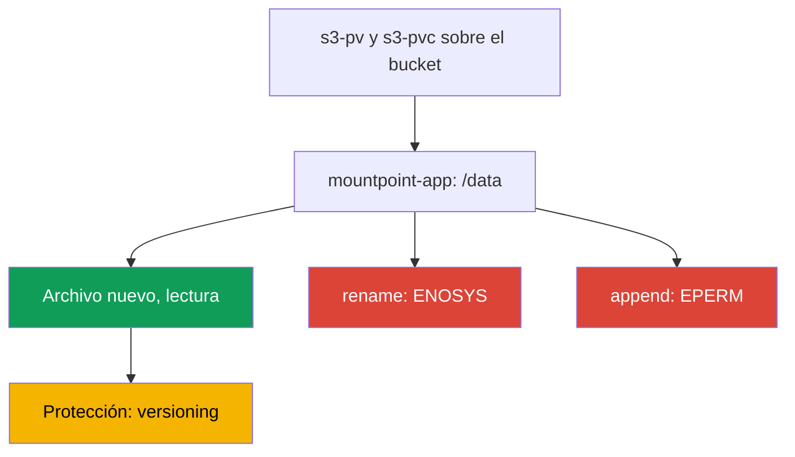
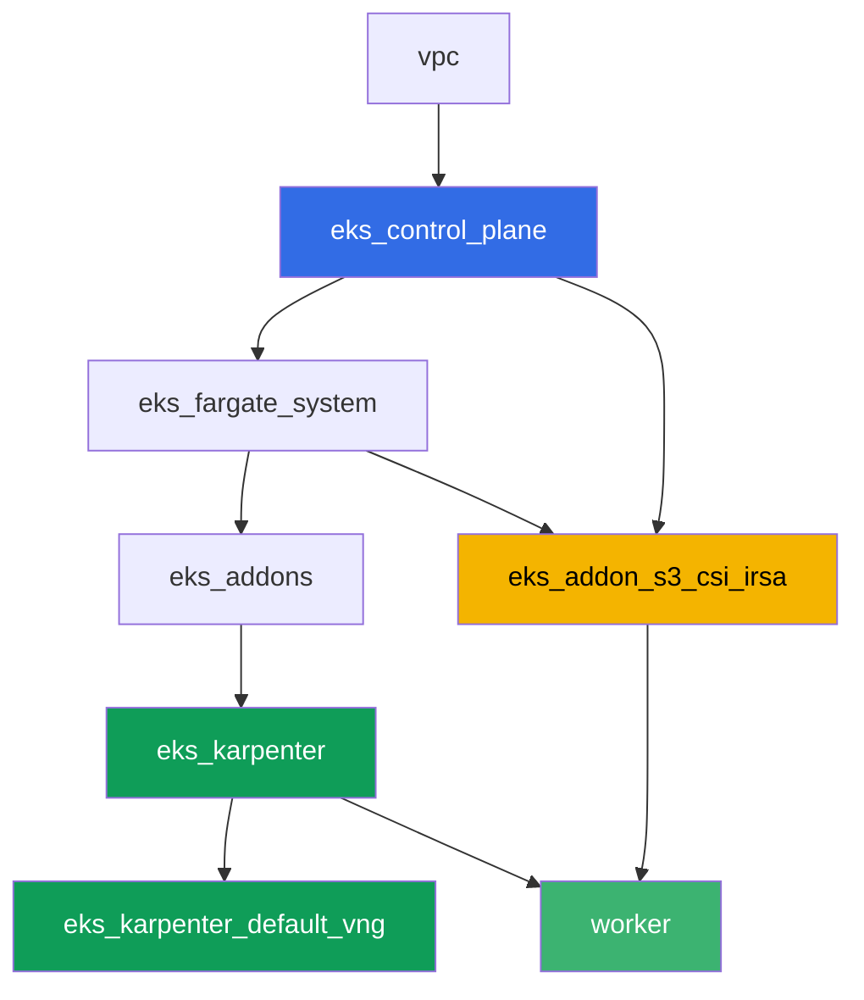

[Русская версия](README_RU.MD) · [Eng version](README.MD) · [Version française](README_FR.MD) · [Deutsche Version](README_DE.MD) · [ქართული ვერსია](README_GE.MD) · [繁體中文版](README_TW.MD) · [日本語版](README_JP.MD)

# Laboratorio 129 - Mountpoint for S3: donde se rompe la semántica de archivos y por qué no hay backup

## Descripción

Un laboratorio sobre el error más frecuente con Mountpoint for Amazon S3 CSI: el volumen
está montado, la aplicación arrancó, pero las operaciones habituales del sistema de
archivos fallan. Vas a levantar un PV/PVC estático sobre un bucket real, comprobarás que
crear un archivo nuevo y leerlo funcionan, y luego reproducirás el síntoma con `rename`,
con append y con una escritura en medio del archivo: las tres fallan con
`Operation not permitted`, porque S3 es almacenamiento de objetos, no un sistema de
archivos POSIX. Al final trabajarás la segunda mitad del tema: por qué los objetos detrás
de este PVC no entran en el backup habitual de volúmenes de EKS y qué protege los datos en
lugar de un snapshot.

Las tareas están escritas en estilo de producción: un planteamiento corto más criterios de
aceptación. La verificación es automática, con el comando `check_result`.

## Objetivo

Reforzar el material del capítulo del curso:

- [Capítulo 25. S3 en aplicaciones: Mountpoint for Amazon S3 CSI y patrones de
  acceso](../../course/25/ru.md) - material principal del laboratorio
- [Capítulo 41-42. AWS Backup para EKS](../../course/41/ru.md) - por qué los snapshots de
  EBS no aplican aquí

## Qué vamos a crear

| Objeto | Qué es | Para qué sirve en este laboratorio |
|--------|---------|-------------------|
| Namespace `eks-129` | una sección del clúster para la carga del laboratorio | mantiene los recursos separados (capítulo 4) |
| PV `s3-pv` / PVC `s3-pvc` | un volumen estático sobre un bucket real | Mountpoint solo soporta aprovisionamiento estático (capítulo 25) |
| Deployment `mountpoint-app` | un pod con este PVC en `/data` | lugar para probar operaciones del sistema de archivos (capítulo 25) |
| Artefacto `3/create.txt`, `3/read.txt` | prueba de que crear y leer un archivo funciona | operaciones exitosas: archivo nuevo, lectura (capítulo 25) |
| Artefacto `4/rename.txt` | salida de `mv` en el volumen | síntoma: `rename` falla (capítulo 25) |
| Artefacto `5/writesemantics.txt` | salida de `append` y de una escritura en medio | síntoma: las escrituras parciales no son posibles (capítulo 25) |
| Artefacto `6/backup.txt` | explicación y `get-bucket-versioning` | por qué no hay snapshot, pero sí hay versioning (capítulos 25, 41) |

El camino desde las operaciones que funcionan hasta el síntoma:



## Infraestructura

El entorno se despliega en AWS (`eu-central-1`) mediante Terragrunt. Cada directorio del
laboratorio es un componente con su propio `terragrunt.hcl`, que hace referencia a un
módulo compartido en `terraform/modules/` y declara sus dependencias mediante bloques
`dependency`. Terragrunt construye el grafo de dependencias y aplica los componentes en el
orden correcto. La base es la misma que en el laboratorio 101 (control plane, Fargate para
los pods del sistema, Karpenter para la carga), más un componente aparte para el Mountpoint
S3 CSI y un bucket de demostración.

### Módulos y dependencias

| Directorio (componente) | Módulo (`terraform/modules/`) | Depende de | Qué crea |
|---------------------|-------------------------------|------------|-------------|
| `vpc` | `vpc_v3` | - | VPC `10.10.0.0/16`, subredes en dos AZ, NAT |
| `ssh-keys` | `ssh-keys` | - | un par de claves SSH para la máquina de trabajo y los nodos |
| `eks_control_plane` | `eks_v2_control_plane` | `vpc` | control plane de EKS `1.36`, OIDC, security groups |
| `eks_fargate_system` | `eks_v2_fargate` | `vpc`, `eks_control_plane` | perfil de Fargate para `kube-system` y `karpenter` |
| `eks_addons` | `eks_v2_addons` | `eks_control_plane`, `eks_fargate_system` | coredns, kube-proxy, vpc-cni, pod-identity |
| `eks_karpenter` | `eks_v2_karpenter` | `vpc`, `eks_control_plane`, `eks_addons`, `eks_fargate_system` | controlador Karpenter, rol IAM de los nodos |
| `eks_karpenter_default_vng` | `eks_v2_karpenter_vng` | `vpc`, `eks_control_plane`, `eks_karpenter` | NodePool por defecto `default` sobre AL2023 |
| `eks_addon_s3_csi_irsa` | `eks_v2_s3_csi_irsa` | `eks_fargate_system`, `eks_control_plane` | bucket S3 con versioning, addon administrado `aws-mountpoint-s3-csi-driver`, rol IAM vía IRSA |
| `worker` | `eks_v2_work_pc` | `ssh-keys`, `vpc`, `eks_control_plane`, `eks_karpenter`, `eks_addon_s3_csi_irsa` | máquina de trabajo con kubectl, pruebas y `check_result` |

El componente `eks_addon_s3_csi_irsa` crea un bucket `<prefix>-mountpoint-demo` con
versioning habilitado y un objeto de prueba `readme.txt`, instala el driver como addon
administrado y le otorga un rol IAM vía IRSA con permisos `s3:ListBucket` sobre el bucket y
`s3:GetObject`/`s3:PutObject`/`s3:AbortMultipartUpload` sobre los objetos, sin
`AmazonS3FullAccess`. Cuando creas el PV, el driver ya está listo (`worker` depende de
`eks_addon_s3_csi_irsa`).

Grafo de dependencias (lo que se aplica antes queda más abajo en la flecha):



### Dónde se configura cada cosa

`env.hcl` (parámetros comunes del entorno, leídos por todos los componentes):

| Parámetro | Valor en el laboratorio | Qué afecta |
|----------|-----------------|---------------|
| `region` | `eu-central-1` | región de todos los recursos y de `mountOptions` del volumen |
| `prefix` | `eks-task129` | prefijo de los nombres de recursos, incluido el nombre del bucket |
| `stack_name` | `eks129` | se usa para construir `env_name` - el nombre del clúster |
| `k8_version` | `1.36.0` | versión de kubectl en la máquina de trabajo |

`inputs` en el `terragrunt.hcl` de cada componente (parámetros del módulo concreto):

| Archivo | Configuraciones clave |
|------|--------------------|
| `eks_addon_s3_csi_irsa/terragrunt.hcl` | addon administrado `aws-mountpoint-s3-csi-driver`, rol vía IRSA sobre el `oidc_provider_arn` del clúster |
| `worker/terragrunt.hcl` | `test_url` y `task_script_url` apuntando a los archivos del laboratorio 129, dependencia de `eks_addon_s3_csi_irsa` |

> Versión del addon administrado `aws-mountpoint-s3-csi-driver` en el módulo
> `eks_v2_s3_csi_irsa`: `v1.15.0-eksbuild.1`, verificada en EKS 1.36 (el addon llega a
> `ACTIVE`). Si cambia la versión menor del clúster, verifícala con
> `aws eks describe-addon-versions --addon-name aws-mountpoint-s3-csi-driver`.

## Despliegue

```bash
TASK=129 make run_eks_task
```

El despliegue tarda aproximadamente 15-20 minutos. En la salida, busca la línea con la
conexión SSH a la máquina de trabajo y conéctate a ella. kubectl ya está configurado ahí
sobre el clúster correcto, y el driver de Mountpoint S3 CSI y el bucket ya están listos.

Comandos útiles en la máquina de trabajo:

```bash
time_left       # cuánto tiempo queda del entorno
check_result    # verificar la solución
```

El nombre del bucket real se encuentra así:

```bash
aws s3api list-buckets --query "Buckets[?contains(Name,'mountpoint-demo')].Name" --output text
```

> Seguridad del stand. En `env.hcl` están habilitados `ssh_password_enable = true` y
> `access_cidrs = ["0.0.0.0/0"]`, lo cual es cómodo para un entorno de aprendizaje, pero no
> debe hacerse así en producción. Según los estándares del curso (capítulos 0.2, 2, 19), el
> acceso a las máquinas de trabajo se hace mediante AWS SSM Session Manager sin puertos SSH
> públicos abiertos hacia afuera, y `access_cidrs` se restringe a direcciones concretas.
> Aquí se deja SSH público solo para simplificar el arranque.

## Tareas

---
|        **1**        | **Namespace para la carga del laboratorio**                             |
| :-----------------: | :---------------------------------------------------------- |
| Qué hacemos          | Crea un namespace llamado `eks-129`. Todos los objetos del laboratorio se crean dentro de él. |
| Criterios de aceptación    | - el namespace `eks-129` existe. |
---
|        **2**        | **PV/PVC estático sobre un bucket real**                    |
| :-----------------: | :---------------------------------------------------------- |
| Qué hacemos          | Encuentra el nombre del bucket (`aws s3api list-buckets --query "Buckets[?contains(Name,'mountpoint-demo')].Name" --output text`). Crea el PV `s3-pv`: `driver: s3.csi.aws.com`, un `volumeHandle` único, `volumeAttributes.bucketName` igual al bucket real, `accessModes: ["ReadWriteMany"]`, `storageClassName: ""`, `mountOptions: ["region eu-central-1"]`. Crea el PVC `s3-pvc` en `eks-129` con `volumeName: s3-pv`, los mismos `accessModes` y `storageClassName: ""`. Mountpoint solo soporta aprovisionamiento estático: el PV se escribe a mano, el bucket ya está creado por terraform. |
| Criterios de aceptación    | - PV `s3-pv` con `driver: s3.csi.aws.com`, un `bucketName` real, `accessModes: ReadWriteMany`, `storageClassName: ""`, `region eu-central-1` en `mountOptions`;<br/>- PVC `s3-pvc` en `eks-129` en estado `Bound` sobre `s3-pv`. |
---
|        **3**        | **Operaciones exitosas: archivo nuevo y lectura**                  |
| :-----------------: | :---------------------------------------------------------- |
| Qué hacemos          | En `eks-129`, crea el Deployment `mountpoint-app` (imagen `busybox:1.36`, `command: ["sh", "-c", "sleep 86400"]`, `1` réplica) con el PVC `s3-pvc` montado en `/data`. La imagen necesita shell y las utilidades `mv`, `dd`, `cat` - todo el laboratorio se basa en operaciones del sistema de archivos dentro del pod. Con `kubectl exec`, crea un archivo nuevo `echo test > /data/newfile.txt` y léelo de vuelta. Por separado, lee el objeto de prueba existente del bucket `readme.txt` a través del mismo volumen. Guarda ambos resultados como artefactos: la creación y lectura del archivo nuevo en `/var/work/tests/artifacts/3/create.txt`, el contenido de `readme.txt` en `/var/work/tests/artifacts/3/read.txt`. |
| Criterios de aceptación    | - Deployment `mountpoint-app` en `eks-129`, volumen `s3-pvc` montado en `/data`, pod en `Running`;<br/>- `create.txt` no está vacío y contiene `test`;<br/>- `read.txt` no está vacío y contiene `mountpoint demo bucket`. |
---
|        **4**        | **Síntoma: `rename` falla**                                |
| :-----------------: | :---------------------------------------------------------- |
| Qué hacemos          | En el pod `mountpoint-app`, intenta renombrar un archivo: `mv /data/newfile.txt /data/renamed.txt`. El comando debe fallar. Guarda la salida completa del error en `/var/work/tests/artifacts/4/rename.txt`. Fíjate en el texto del error: aquí es `Function not implemented`, es decir `ENOSYS` - Mountpoint no implementa la llamada al sistema `rename` en absoluto. Es un fallo distinto del de la tarea 5, donde la operación está implementada pero prohibida (`EPERM`, `Operation not permitted`). Asegúrate de que el bucket no quedó en un estado intermedio: el objeto `newfile.txt` sigue en su lugar y el objeto `renamed.txt` no existe. |
| Criterios de aceptación    | - el archivo `4/rename.txt` no está vacío;<br/>- contiene `Function not implemented` (u `Operation not permitted`, si la versión del driver responde de otra forma);<br/>- en el bucket existe el objeto `newfile.txt` y no existe el objeto `renamed.txt`. |
---
|        **5**        | **Síntoma: el append y la escritura en medio del archivo fallan**      |
| :-----------------: | :---------------------------------------------------------- |
| Qué hacemos          | En el pod `mountpoint-app`, intenta hacer append al archivo existente: `echo more >> /data/newfile.txt`. Luego intenta escribir en medio del mismo archivo: `dd of=/data/newfile.txt bs=1 seek=1 conv=notrunc` (el contenido de entrada no importa). Ambos comandos deben fallar con `Operation not permitted`. De paso, comprueba dos operaciones vecinas y explícatelas: sobrescribir un archivo existente (`echo test2 > /data/newfile.txt`) y borrarlo (`rm /data/newfile.txt`) también fallan con `Operation not permitted`, porque por defecto Mountpoint no habilita `allow-overwrite` ni `allow-delete`, mientras que `mkdir /data/sub` se ejecuta sin error, porque los directorios en S3 son virtuales y no se crea ningún objeto para ellos. Guarda las salidas junto con una breve explicación (un objeto de S3 es inmutable y solo se actualiza entero mediante un nuevo `PutObject`) en `/var/work/tests/artifacts/5/writesemantics.txt`. |
| Criterios de aceptación    | - el archivo `5/writesemantics.txt` no está vacío;<br/>- contiene `Operation not permitted`;<br/>- contiene al menos una de las palabras `append`, `rename`. |
---
|        **6**        | **Por qué los prefijos detrás de este PVC no se respaldan con AWS Backup** |
| :-----------------: | :---------------------------------------------------------- |
| Qué hacemos          | AWS Backup para EKS (capítulos 41-42) protege los volúmenes EBS mediante snapshots CSI. Un volumen Mountpoint no tiene EBS debajo: los datos ya están en S3 como objetos, no en un dispositivo de bloques, así que este tipo de PVC no tiene snapshot en ese mismo sentido. La protección de los datos aquí recae en los mecanismos habituales de S3, principalmente el versioning del bucket (terraform lo habilitó en este bucket). Confírmalo con `aws s3api get-bucket-versioning --bucket <bucket>` y guarda su salida junto con una explicación (el volumen no es EBS, no hay snapshot, la protección es vía versioning) en `/var/work/tests/artifacts/6/backup.txt`. |
| Criterios de aceptación    | - el archivo `6/backup.txt` no está vacío;<br/>- contiene `versioning` y `snapshot`;<br/>- contiene `Enabled` (el estado confirmado del versioning del bucket). |
---

## Verificación del resultado

En la máquina de trabajo, ejecuta la verificación automática:

```bash
check_result
```

El script ejecuta las pruebas y muestra el porcentaje de tareas completadas.

## Solución

Solución de referencia: [worker/files/solutions/1_ES.MD](worker/files/solutions/1_ES.MD)

## Eliminación del clúster y los recursos

> **Primero elimina la carga de trabajo y el contenido del bucket.** El bucket lo creó
> terraform, pero los objetos que hay dentro llegaron desde los pods a través de
> Mountpoint - para terraform son datos ajenos. Un bucket que no está vacío no se puede
> eliminar, y `destroy` se quedará atascado en él. Los volúmenes aquí son estáticos (un PV
> sobre el driver CSI de Mountpoint), pero el namespace igual debe eliminarse primero, para
> que los pods liberen los puntos de montaje y Karpenter tenga tiempo de retirar el nodo
> antes de desmontar el clúster.

```bash
kubectl delete namespace eks-129 --ignore-not-found

while kubectl get nodes --no-headers 2>/dev/null | grep -qv fargate; do
  echo "El nodo EC2 de Karpenter todavía está vivo, esperando..."; sleep 15
done

BUCKET=$(grep '^bucket_name' ~/lab129_hints.txt | awk '{print $3}')
# si el bucket tiene versioning habilitado, hacen falta tanto las versiones de los objetos como los delete markers
aws s3 rm "s3://${BUCKET}" --recursive
aws s3api list-object-versions --bucket "$BUCKET" \
  --query '{Objects: Versions[].{Key:Key,VersionId:VersionId}}' --output json > /tmp/vers.json
aws s3api delete-objects --bucket "$BUCKET" --delete file:///tmp/vers.json 2>/dev/null
aws s3api list-object-versions --bucket "$BUCKET" \
  --query '{Objects: DeleteMarkers[].{Key:Key,VersionId:VersionId}}' --output json > /tmp/dm.json
aws s3api delete-objects --bucket "$BUCKET" --delete file:///tmp/dm.json 2>/dev/null

# el bucket debe quedar vacío: ambos comandos deben imprimir None (lista vacía)
# (aquí length(Versions) no sirve - en un bucket vacío el campo es null y jmespath se queja)
aws s3api list-object-versions --bucket "$BUCKET" --query 'Versions[].Key' --output text
aws s3api list-object-versions --bucket "$BUCKET" --query 'DeleteMarkers[].Key' --output text
```

Hay que eliminar los objetos con la AWS CLI, no desde el pod: `rm` dentro del volumen falla
con `Operation not permitted`, porque Mountpoint se monta sin `allow-delete` por defecto
(lo mismo que observaste en la tarea 5).

```bash
TASK=129 make delete_eks_task
```
