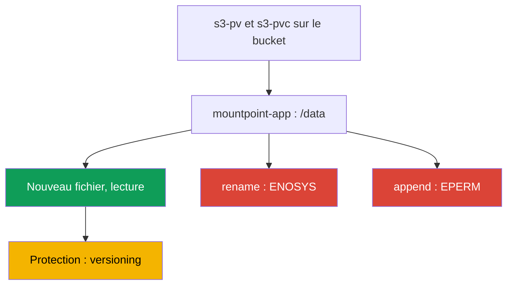
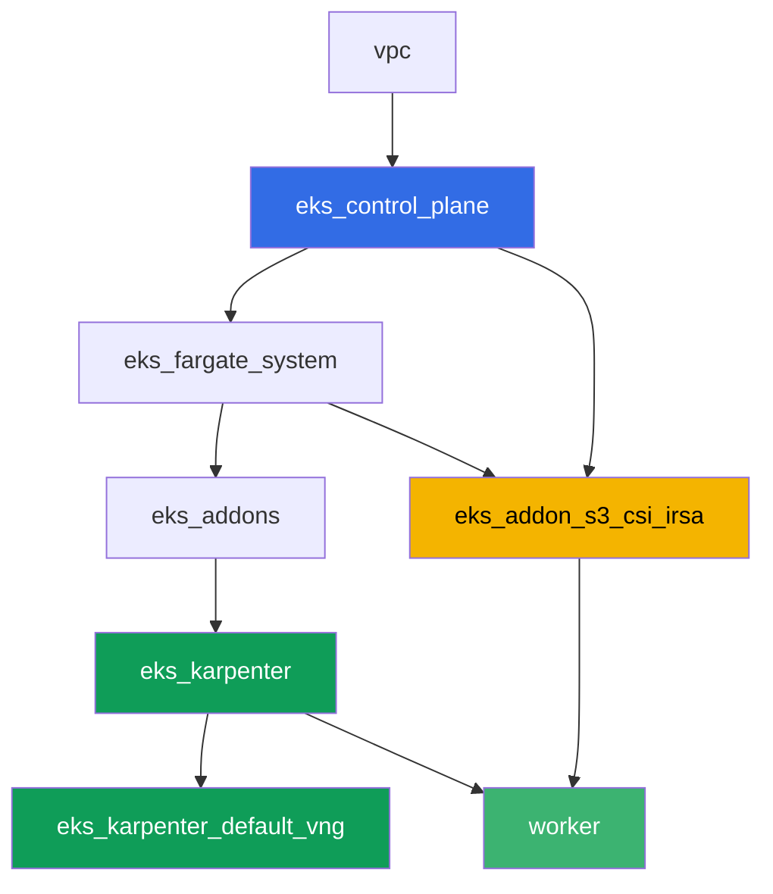

[Русская версия](README_RU.MD) · [Eng version](README.MD) · [Versión en español](README_ES.MD) · [Deutsche Version](README_DE.MD) · [ქართული ვერსია](README_GE.MD) · [繁體中文版](README_TW.MD) · [日本語版](README_JP.MD)

# Lab 129 - Mountpoint for S3 : où la sémantique des fichiers casse et pourquoi il n'y a pas de backup

## Description

Un labo sur l'erreur la plus fréquente avec Mountpoint for Amazon S3 CSI : le volume est
monté, l'application a démarré, mais les opérations habituelles du système de fichiers
échouent. Vous allez déployer un PV/PVC statique sur un vrai bucket, vérifier que la
création d'un nouveau fichier et sa lecture fonctionnent, puis reproduire le symptôme sur
`rename`, sur l'append et sur une écriture au milieu d'un fichier - les trois échouent avec
`Operation not permitted`, car S3 est un stockage d'objets, pas un système de fichiers
POSIX. À la fin, vous traiterez la seconde moitié du sujet : pourquoi les objets derrière ce
PVC ne sont pas couverts par le backup habituel des volumes EKS, et ce qui protège les
données à la place d'un snapshot.

Les tâches sont rédigées dans un style production : un énoncé court plus des critères
d'acceptation. La vérification est automatique, via la commande `check_result`.

## Objectif

Renforcer le contenu du chapitre du cours :

- [Chapitre 25. S3 dans les applications : Mountpoint for Amazon S3 CSI et les patterns
  d'accès](../../course/25/ru.md) - matière principale du labo
- [Chapitre 41-42. AWS Backup pour EKS](../../course/41/ru.md) - pourquoi les snapshots EBS
  ne s'appliquent pas ici

## Ce que nous créons

| Objet | Ce que c'est | Pourquoi dans ce labo |
|--------|---------|-------------------|
| Namespace `eks-129` | une section du cluster pour la charge du labo | garde les ressources séparées (chapitre 4) |
| PV `s3-pv` / PVC `s3-pvc` | un volume statique sur un vrai bucket | Mountpoint ne supporte que le provisionnement statique (chapitre 25) |
| Deployment `mountpoint-app` | un pod avec ce PVC sur `/data` | terrain pour tester les opérations du système de fichiers (chapitre 25) |
| Artefact `3/create.txt`, `3/read.txt` | preuve que la création et la lecture d'un fichier fonctionnent | opérations réussies : nouveau fichier, lecture (chapitre 25) |
| Artefact `4/rename.txt` | sortie de `mv` sur le volume | symptôme : `rename` échoue (chapitre 25) |
| Artefact `5/writesemantics.txt` | sortie de l'append et d'une écriture au milieu | symptôme : les écritures partielles sont impossibles (chapitre 25) |
| Artefact `6/backup.txt` | explication et `get-bucket-versioning` | pourquoi il n'y a pas de snapshot, mais du versioning (chapitres 25, 41) |

Le chemin des opérations qui fonctionnent jusqu'au symptôme :



## Infrastructure

L'environnement est déployé sur AWS (`eu-central-1`) via Terragrunt. Chaque répertoire du
labo est un composant avec son propre `terragrunt.hcl`, qui référence un module commun dans
`terraform/modules/` et déclare ses dépendances via des blocs `dependency`. Terragrunt
construit le graphe de dépendances et applique les composants dans le bon ordre. La base
est la même que dans le labo 101 (control plane, Fargate pour les pods système, Karpenter
pour la charge), plus un composant à part pour le Mountpoint S3 CSI et un bucket de
démonstration.

### Modules et dépendances

| Répertoire (composant) | Module (`terraform/modules/`) | Dépend de | Ce qu'il crée |
|---------------------|-------------------------------|------------|-------------|
| `vpc` | `vpc_v3` | - | VPC `10.10.0.0/16`, sous-réseaux dans deux AZ, NAT |
| `ssh-keys` | `ssh-keys` | - | une paire de clés SSH pour la machine de travail et les nœuds |
| `eks_control_plane` | `eks_v2_control_plane` | `vpc` | control plane EKS `1.36`, OIDC, security groups |
| `eks_fargate_system` | `eks_v2_fargate` | `vpc`, `eks_control_plane` | profil Fargate pour `kube-system` et `karpenter` |
| `eks_addons` | `eks_v2_addons` | `eks_control_plane`, `eks_fargate_system` | coredns, kube-proxy, vpc-cni, pod-identity |
| `eks_karpenter` | `eks_v2_karpenter` | `vpc`, `eks_control_plane`, `eks_addons`, `eks_fargate_system` | contrôleur Karpenter, rôle IAM des nœuds |
| `eks_karpenter_default_vng` | `eks_v2_karpenter_vng` | `vpc`, `eks_control_plane`, `eks_karpenter` | NodePool par défaut `default` sur AL2023 |
| `eks_addon_s3_csi_irsa` | `eks_v2_s3_csi_irsa` | `eks_fargate_system`, `eks_control_plane` | bucket S3 avec versioning, addon managé `aws-mountpoint-s3-csi-driver`, rôle IAM via IRSA |
| `worker` | `eks_v2_work_pc` | `ssh-keys`, `vpc`, `eks_control_plane`, `eks_karpenter`, `eks_addon_s3_csi_irsa` | machine de travail avec kubectl, tests et `check_result` |

Le composant `eks_addon_s3_csi_irsa` crée un bucket `<prefix>-mountpoint-demo` avec le
versioning activé et un objet de test `readme.txt`, installe le driver en tant qu'addon
managé et lui attribue un rôle IAM via IRSA avec les droits `s3:ListBucket` sur le bucket et
`s3:GetObject`/`s3:PutObject`/`s3:AbortMultipartUpload` sur les objets - sans
`AmazonS3FullAccess`. Au moment où vous créez le PV, le driver est déjà prêt (`worker`
dépend de `eks_addon_s3_csi_irsa`).

Graphe de dépendances (ce qui est appliqué en premier est plus bas dans la flèche) :



### Où configurer quoi

`env.hcl` (paramètres communs de l'environnement, lus par tous les composants) :

| Paramètre | Valeur dans le labo | Ce qu'il affecte |
|----------|-----------------|---------------|
| `region` | `eu-central-1` | région de toutes les ressources et des `mountOptions` du volume |
| `prefix` | `eks-task129` | préfixe des noms de ressources, y compris le nom du bucket |
| `stack_name` | `eks129` | utilisé pour construire `env_name` - le nom du cluster |
| `k8_version` | `1.36.0` | version de kubectl sur la machine de travail |

`inputs` dans le `terragrunt.hcl` de chaque composant (paramètres du module concerné) :

| Fichier | Réglages clés |
|------|--------------------|
| `eks_addon_s3_csi_irsa/terragrunt.hcl` | addon managé `aws-mountpoint-s3-csi-driver`, rôle via IRSA sur l'`oidc_provider_arn` du cluster |
| `worker/terragrunt.hcl` | `test_url` et `task_script_url` pointant vers les fichiers du labo 129, dépendance à `eks_addon_s3_csi_irsa` |

> Version de l'addon managé `aws-mountpoint-s3-csi-driver` dans le module
> `eks_v2_s3_csi_irsa` : `v1.15.0-eksbuild.1`, vérifiée sur EKS 1.36 (l'addon passe à
> `ACTIVE`). Lors d'un changement de version mineure du cluster, vérifiez-la avec
> `aws eks describe-addon-versions --addon-name aws-mountpoint-s3-csi-driver`.

## Déploiement

```bash
TASK=129 make run_eks_task
```

Le déploiement prend environ 15-20 minutes. Dans la sortie, trouvez la ligne avec la
connexion SSH à la machine de travail et connectez-vous. kubectl y est déjà configuré sur
le bon cluster, et le driver Mountpoint S3 CSI ainsi que le bucket sont déjà prêts.

Commandes utiles sur la machine de travail :

```bash
time_left       # temps restant de l'environnement
check_result    # vérifier la solution
```

Le nom du vrai bucket se trouve ainsi :

```bash
aws s3api list-buckets --query "Buckets[?contains(Name,'mountpoint-demo')].Name" --output text
```

> Sécurité du stand. Dans `env.hcl`, `ssh_password_enable = true` et
> `access_cidrs = ["0.0.0.0/0"]` sont activés - pratique pour un environnement
> d'apprentissage, mais à ne pas faire en production. Selon les standards du cours
> (chapitres 0.2, 2, 19), l'accès aux machines de travail se fait via AWS SSM Session
> Manager sans ports SSH publics exposés, et `access_cidrs` doit être restreint à des
> adresses précises. Ici, le SSH public est laissé uniquement pour simplifier le démarrage.

## Tâches

---
|        **1**        | **Namespace pour la charge du labo**                             |
| :-----------------: | :---------------------------------------------------------- |
| Ce qu'on fait          | Créez un namespace nommé `eks-129`. Tous les objets du labo sont créés dedans. |
| Critères d'acceptation    | - le namespace `eks-129` existe. |
---
|        **2**        | **PV/PVC statique sur un vrai bucket**                    |
| :-----------------: | :---------------------------------------------------------- |
| Ce qu'on fait          | Trouvez le nom du bucket (`aws s3api list-buckets --query "Buckets[?contains(Name,'mountpoint-demo')].Name" --output text`). Créez le PV `s3-pv` : `driver: s3.csi.aws.com`, un `volumeHandle` unique, `volumeAttributes.bucketName` égal au vrai bucket, `accessModes: ["ReadWriteMany"]`, `storageClassName: ""`, `mountOptions: ["region eu-central-1"]`. Créez le PVC `s3-pvc` dans `eks-129` avec `volumeName: s3-pv`, les mêmes `accessModes` et `storageClassName: ""`. Mountpoint ne supporte que le provisionnement statique : le PV est écrit à la main, le bucket est déjà créé par terraform. |
| Critères d'acceptation    | - PV `s3-pv` avec `driver: s3.csi.aws.com`, un `bucketName` réel, `accessModes: ReadWriteMany`, `storageClassName: ""`, `region eu-central-1` dans `mountOptions`;<br/>- PVC `s3-pvc` dans `eks-129` à l'état `Bound` sur `s3-pv`. |
---
|        **3**        | **Opérations réussies : nouveau fichier et lecture**                  |
| :-----------------: | :---------------------------------------------------------- |
| Ce qu'on fait          | Dans `eks-129`, créez le Deployment `mountpoint-app` (image `busybox:1.36`, `command: ["sh", "-c", "sleep 86400"]`, `1` réplique) avec le PVC `s3-pvc` monté sur `/data`. L'image doit avoir un shell et les utilitaires `mv`, `dd`, `cat` - tout ce labo repose sur des opérations du système de fichiers à l'intérieur du pod. Via `kubectl exec`, créez un nouveau fichier `echo test > /data/newfile.txt` et relisez-le. Séparément, lisez l'objet de test existant du bucket `readme.txt` à travers le même volume. Sauvegardez les deux résultats en artefacts : la création et la lecture du nouveau fichier dans `/var/work/tests/artifacts/3/create.txt`, le contenu de `readme.txt` dans `/var/work/tests/artifacts/3/read.txt`. |
| Critères d'acceptation    | - Deployment `mountpoint-app` dans `eks-129`, volume `s3-pvc` monté sur `/data`, pod `Running`;<br/>- `create.txt` n'est pas vide et contient `test`;<br/>- `read.txt` n'est pas vide et contient `mountpoint demo bucket`. |
---
|        **4**        | **Symptôme : `rename` échoue**                                |
| :-----------------: | :---------------------------------------------------------- |
| Ce qu'on fait          | Dans le pod `mountpoint-app`, essayez de renommer un fichier : `mv /data/newfile.txt /data/renamed.txt`. La commande doit échouer. Sauvegardez la sortie complète de l'erreur dans `/var/work/tests/artifacts/4/rename.txt`. Notez le texte de l'erreur : ici c'est `Function not implemented`, c'est-à-dire `ENOSYS` - Mountpoint n'implémente pas du tout l'appel système `rename`. C'est un échec différent de celui de la tâche 5, où l'opération est implémentée mais interdite (`EPERM`, `Operation not permitted`). Vérifiez que le bucket n'est pas resté dans un état intermédiaire : l'objet `newfile.txt` est toujours là, et l'objet `renamed.txt` n'existe pas. |
| Critères d'acceptation    | - le fichier `4/rename.txt` n'est pas vide;<br/>- contient `Function not implemented` (ou `Operation not permitted`, si la version du driver répond différemment);<br/>- le bucket contient l'objet `newfile.txt` et pas l'objet `renamed.txt`. |
---
|        **5**        | **Symptôme : l'append et une écriture au milieu du fichier échouent**      |
| :-----------------: | :---------------------------------------------------------- |
| Ce qu'on fait          | Dans le pod `mountpoint-app`, essayez d'ajouter (append) au fichier existant : `echo more >> /data/newfile.txt`. Essayez ensuite d'écrire au milieu du même fichier : `dd of=/data/newfile.txt bs=1 seek=1 conv=notrunc` (les données d'entrée n'ont pas d'importance). Les deux commandes doivent échouer avec `Operation not permitted`. Vérifiez au passage deux opérations voisines et expliquez-les : réécrire un fichier existant (`echo test2 > /data/newfile.txt`) et le supprimer (`rm /data/newfile.txt`) échouent aussi avec `Operation not permitted`, car par défaut Mountpoint n'active pas `allow-overwrite` ni `allow-delete`, alors que `mkdir /data/sub` passe sans erreur, car les répertoires dans S3 sont virtuels et aucun objet n'est créé pour eux. Sauvegardez les sorties avec une courte explication (un objet S3 est immuable et n'est mis à jour qu'entièrement, via un nouveau `PutObject`) dans `/var/work/tests/artifacts/5/writesemantics.txt`. |
| Critères d'acceptation    | - le fichier `5/writesemantics.txt` n'est pas vide;<br/>- contient `Operation not permitted`;<br/>- contient au moins un des mots `append`, `rename`, `середин`. |
---
|        **6**        | **Pourquoi les préfixes derrière ce PVC ne sont pas sauvegardés via AWS Backup** |
| :-----------------: | :---------------------------------------------------------- |
| Ce qu'on fait          | AWS Backup pour EKS (chapitres 41-42) protège les volumes EBS via des snapshots CSI. Un volume Mountpoint n'a pas d'EBS sous le capot : les données se trouvent déjà dans S3 sous forme d'objets, pas sur un périphérique bloc, donc ce type de PVC n'a pas de snapshot dans ce sens. La protection des données ici repose sur les mécanismes classiques de S3, principalement le versioning du bucket (terraform l'a activé sur ce bucket). Confirmez-le avec `aws s3api get-bucket-versioning --bucket <bucket>` et sauvegardez sa sortie avec une explication (le volume n'est pas de l'EBS, pas de snapshot, protection via versioning) dans `/var/work/tests/artifacts/6/backup.txt`. |
| Critères d'acceptation    | - le fichier `6/backup.txt` n'est pas vide;<br/>- contient `versioning` et `snapshot` (ou `снапшот`);<br/>- contient `Enabled` (le statut confirmé du versioning du bucket). |
---

## Vérification du résultat

Sur la machine de travail, lancez la vérification automatique :

```bash
check_result
```

Le script exécute les tests et affiche le pourcentage de tâches accomplies.

## Solution

Solution de référence : [worker/files/solutions/1_FR.MD](worker/files/solutions/1_FR.MD)

## Suppression du cluster et des ressources

> **Retirez d'abord la charge de travail et le contenu du bucket.** Le bucket a été créé
> par terraform, mais les objets qu'il contient sont apparus via les pods à travers
> Mountpoint - pour terraform ce sont des données étrangères. Un bucket non vide ne peut pas
> être supprimé, et `destroy` restera bloqué là-dessus. Les volumes ici sont statiques (un
> PV sur le driver CSI Mountpoint), mais il faut malgré tout supprimer le namespace en
> premier, pour que les pods libèrent leurs points de montage et que Karpenter ait le temps
> de retirer le nœud avant la destruction du cluster.

```bash
kubectl delete namespace eks-129 --ignore-not-found

while kubectl get nodes --no-headers 2>/dev/null | grep -qv fargate; do
  echo "Le nœud EC2 de Karpenter est encore vivant, on attend..."; sleep 15
done

BUCKET=$(grep '^bucket_name' ~/lab129_hints.txt | awk '{print $3}')
# si le versioning est activé sur le bucket, il faut à la fois les versions des objets et les delete markers
aws s3 rm "s3://${BUCKET}" --recursive
aws s3api list-object-versions --bucket "$BUCKET" \
  --query '{Objects: Versions[].{Key:Key,VersionId:VersionId}}' --output json > /tmp/vers.json
aws s3api delete-objects --bucket "$BUCKET" --delete file:///tmp/vers.json 2>/dev/null
aws s3api list-object-versions --bucket "$BUCKET" \
  --query '{Objects: DeleteMarkers[].{Key:Key,VersionId:VersionId}}' --output json > /tmp/dm.json
aws s3api delete-objects --bucket "$BUCKET" --delete file:///tmp/dm.json 2>/dev/null

# le bucket doit devenir vide : les deux commandes doivent afficher None (liste vide)
# (length(Versions) ne fonctionne pas ici - sur un bucket vide le champ est null et jmespath se plaint)
aws s3api list-object-versions --bucket "$BUCKET" --query 'Versions[].Key' --output text
aws s3api list-object-versions --bucket "$BUCKET" --query 'DeleteMarkers[].Key' --output text
```

Il faut supprimer les objets via l'AWS CLI, pas depuis le pod : `rm` dans le volume échoue
avec `Operation not permitted`, car Mountpoint est monté sans `allow-delete` par défaut
(c'est ce que vous avez observé dans la tâche 5).

```bash
TASK=129 make delete_eks_task
```
