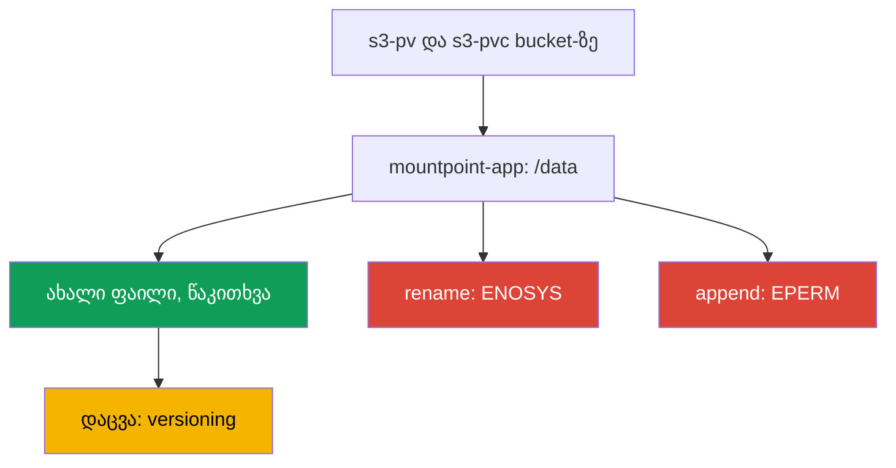
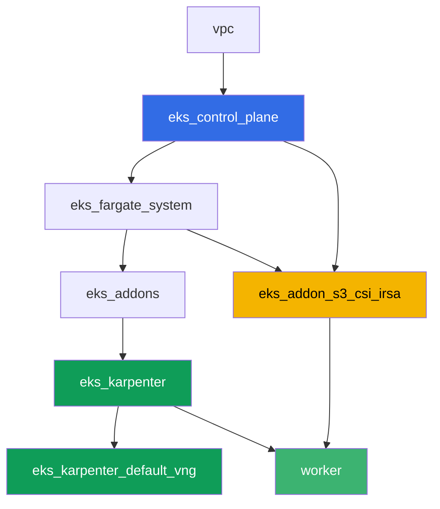

[Русская версия](README_RU.MD) · [Eng version](README.MD) · [Versión en español](README_ES.MD) · [Version française](README_FR.MD) · [Deutsche Version](README_DE.MD) · [繁體中文版](README_TW.MD) · [日本語版](README_JP.MD)

# ლაბა 129 - Mountpoint for S3: სად ირღვევა ფაილების სემანტიკა და რატომ არ არსებობს ბექაპი

## აღწერა

ლაბა ეხება Mountpoint for Amazon S3 CSI-ის ყველაზე გავრცელებულ შეცდომას: ტომი
მონტირებულია, აპლიკაცია გაშვებულია, მაგრამ ფაილური სისტემის ჩვეული ოპერაციები
ვერდომდება. თქვენ ააწყობთ სტატიკურ PV/PVC-ს რეალურ bucket-ზე, დარწმუნდებით, რომ
ახალი ფაილის შექმნა და წაკითხვა მუშაობს, შემდეგ კი აღადგენთ სიმპტომს
`rename`-ზე, დოზაწერასა (append) და ფაილის შუაში ჩაწერაზე - სამივე ვერდომდება
`Operation not permitted`-ით, რადგან S3 არის ობიექტების საცავი, არა POSIX-ფაილური
სისტემა. ბოლოს გაარკვევთ თემის მეორე ნახევარს: რატომ არ ხვდება ამ PVC-ის უკან
მდებარე ობიექტები EKS-ტომების ჩვეულ ბექაპში და რა იცავს მონაცემებს სნეპშოტის
(snapshot) ნაცვლად.

დავალებები დაწერილია production-სტილში: მოკლე დავალება პლუს მიღების
კრიტერიუმები. შემოწმება ავტომატურია, ბრძანებით `check_result`.

## მიზანი

გავამყაროთ კურსის ამ თავის მასალა:

- [თავი 25. S3 აპლიკაციებში: Mountpoint for Amazon S3 CSI და წვდომის
  პატერნები](../../course/25/ru.md) - ლაბის ძირითადი მასალა
- [თავი 41-42. AWS Backup EKS-სთვის](../../course/41/ru.md) - რატომ არ გამოდგება
  აქ EBS-სნეპშოტები

## რას ვქმნით

| ობიექტი | რა არის ეს | რისთვის ამ ლაბაში |
|--------|---------|-------------------|
| Namespace `eks-129` | კლასტერის სექცია ლაბის დატვირთვისთვის | რესურსების ცალკე შენახვა (თავი 4) |
| PV `s3-pv` / PVC `s3-pvc` | სტატიკური ტომი რეალურ bucket-ზე | Mountpoint-ს აქვს მხოლოდ სტატიკური პროვიჟინინგი (თავი 25) |
| Deployment `mountpoint-app` | პოდი ამ PVC-ით `/data`-ზე | ფაილური სისტემის ოპერაციების შემოწმების ბაზა (თავი 25) |
| არტეფაქტი `3/create.txt`, `3/read.txt` | ფაილის შექმნისა და წაკითხვის დასტური | წარმატებული ოპერაციები: ახალი ფაილი, წაკითხვა (თავი 25) |
| არტეფაქტი `4/rename.txt` | `mv`-ის გამომავალი ტომში | სიმპტომი: `rename` ვერდომდება (თავი 25) |
| არტეფაქტი `5/writesemantics.txt` | `append`-ის და შუაში ჩაწერის გამომავალი | სიმპტომი: ნაწილობრივი ჩაწერა შეუძლებელია (თავი 25) |
| არტეფაქტი `6/backup.txt` | განმარტება და `get-bucket-versioning` | რატომ არ არსებობს სნეპშოტი, არსებობს versioning (თავები 25, 41) |

გზა მუშა ოპერაციებიდან სიმპტომამდე:



## ინფრასტრუქტურა

გარემო დეპლოირდება AWS-ში (`eu-central-1`) Terragrunt-ის მეშვეობით. ლაბის
თითოეული კატალოგი არის ერთი კომპონენტი საკუთარი `terragrunt.hcl`-ით, რომელიც
მიუთითებს საერთო მოდულზე `terraform/modules/`-ში და აცხადებს დამოკიდებულებებს
`dependency` ბლოკების მეშვეობით. Terragrunt აწყობს დამოკიდებულებების გრაფს და
აპლიცირებს კომპონენტებს სწორი თანმიმდევრობით. ბაზა იგივეა, რაც ლაბა 101-ში
(control plane, Fargate სისტემური პოდებისთვის, Karpenter დატვირთვისთვის), პლუს
ცალკე კომპონენტი Mountpoint S3 CSI-სთვის და დემონსტრაციული bucket.

### მოდულები და დამოკიდებულებები

| დირექტორია (კომპონენტი) | მოდული (`terraform/modules/`) | დამოკიდებულია | რას ქმნის |
|---------------------|-------------------------------|------------|-------------|
| `vpc` | `vpc_v3` | - | VPC `10.10.0.0/16`, ქვექსელები ორ AZ-ში, NAT |
| `ssh-keys` | `ssh-keys` | - | SSH-გასაღებების წყვილი სამუშაო მანქანისა და ნოუდებისთვის |
| `eks_control_plane` | `eks_v2_control_plane` | `vpc` | EKS control plane `1.36`, OIDC, security groups |
| `eks_fargate_system` | `eks_v2_fargate` | `vpc`, `eks_control_plane` | Fargate-პროფილი `kube-system`-ისთვის და `karpenter`-ისთვის |
| `eks_addons` | `eks_v2_addons` | `eks_control_plane`, `eks_fargate_system` | დამატებები coredns, kube-proxy, vpc-cni, pod-identity |
| `eks_karpenter` | `eks_v2_karpenter` | `vpc`, `eks_control_plane`, `eks_addons`, `eks_fargate_system` | Karpenter-ის კონტროლერი, ნოუდების IAM-როლი |
| `eks_karpenter_default_vng` | `eks_v2_karpenter_vng` | `vpc`, `eks_control_plane`, `eks_karpenter` | ნაგულისხმევი NodePool `default` AL2023-ზე |
| `eks_addon_s3_csi_irsa` | `eks_v2_s3_csi_irsa` | `eks_fargate_system`, `eks_control_plane` | S3 bucket ჩართული versioning-ით, managed addon `aws-mountpoint-s3-csi-driver`, IAM-როლი IRSA-ს მეშვეობით |
| `worker` | `eks_v2_work_pc` | `ssh-keys`, `vpc`, `eks_control_plane`, `eks_karpenter`, `eks_addon_s3_csi_irsa` | სამუშაო მანქანა kubectl-ით, ტესტებით და `check_result`-ით |

კომპონენტი `eks_addon_s3_csi_irsa` ქმნის bucket-ს `<prefix>-mountpoint-demo`
ჩართული versioning-ითა და ტესტური ობიექტით `readme.txt`, აყენებს დრაივერს
როგორც managed addon-ს და გადასცემს მას IAM-როლს IRSA-ს მეშვეობით უფლებებით
`s3:ListBucket` bucket-ზე და `s3:GetObject`/`s3:PutObject`/`s3:AbortMultipartUpload`
ობიექტებზე - გარეშე `AmazonS3FullAccess`-ის. მომენტისთვის, როცა თქვენ ქმნით
PV-ს, დრაივერი უკვე მზადაა (`worker` დამოკიდებულია `eks_addon_s3_csi_irsa`-ზე).

დამოკიდებულებების გრაფი (რაც უფრო ადრე აპლიცირდება, ის ხრიხისკენ ქვემოთაა):



### სად რა კონფიგურირდება

`env.hcl` (გარემოს საერთო პარამეტრები, ყველა კომპონენტი კითხულობს მათ):

| პარამეტრი | მნიშვნელობა ლაბაში | რაზე ახდენს გავლენას |
|----------|-----------------|---------------|
| `region` | `eu-central-1` | ყველა რესურსის რეგიონი და ტომის `mountOptions` |
| `prefix` | `eks-task129` | რესურსების სახელების პრეფიქსი, bucket-ის სახელის ჩათვლით |
| `stack_name` | `eks129` | მისგან იწყობა `env_name` - კლასტერის სახელი |
| `k8_version` | `1.36.0` | kubectl-ის ვერსია სამუშაო მანქანაზე |

`inputs`-ი თითოეული კომპონენტის `terragrunt.hcl`-ში (კონკრეტული მოდულის
პარამეტრები):

| ფაილი | მთავარი პარამეტრები |
|------|--------------------|
| `eks_addon_s3_csi_irsa/terragrunt.hcl` | managed addon `aws-mountpoint-s3-csi-driver`, როლი IRSA-ს მეშვეობით კლასტერის `oidc_provider_arn`-ზე |
| `worker/terragrunt.hcl` | `test_url` და `task_script_url` ლაბა 129-ის ფაილებზე, დამოკიდებულება `eks_addon_s3_csi_irsa`-ზე |

> Managed addon `aws-mountpoint-s3-csi-driver`-ის ვერსია მოდულში
> `eks_v2_s3_csi_irsa` არის `v1.15.0-eksbuild.1`, გამოცდილია EKS 1.36-ზე
> (addon გადადის `ACTIVE`-ში). კლასტერის მინორის შეცვლისას შეადარეთ ის
> ბრძანებით `aws eks describe-addon-versions --addon-name aws-mountpoint-s3-csi-driver`.

## განლაგება

```bash
TASK=129 make run_eks_task
```

განლაგება გრძელდება დაახლოებით 15-20 წუთი. output-ში მოძებნეთ ხაზი
SSH-შეერთებით სამუშაო მანქანასთან და დაუკავშირდით მას. kubectl იქ უკვე
კონფიგურირებულია სწორ კლასტერზე, Mountpoint S3 CSI-ის დრაივერი და bucket
უკვე მზადაა.

სასარგებლო ბრძანებები სამუშაო მანქანაზე:

```bash
time_left       # რამდენი დრო დარჩა გარემოს
check_result    # გადამოწმება
```

რეალური bucket-ის სახელი ასე ნახავთ:

```bash
aws s3api list-buckets --query "Buckets[?contains(Name,'mountpoint-demo')].Name" --output text
```

> სტენდის უსაფრთხოება. `env.hcl`-ში ჩართულია `ssh_password_enable = true` და
> `access_cidrs = ["0.0.0.0/0"]` - ეს მოსახერხებელია სასწავლო გარემოსთვის, მაგრამ
> ასე არ უნდა გავხადოთ production-ში. კურსის სტანდარტების მიხედვით (თავები 0.2,
> 2, 19) სამუშაო მანქანებზე წვდომა იხსნება AWS SSM Session Manager-ის
> მეშვეობით, საჯარო SSH-პორტების გარეთ გამოტანის გარეშე, ხოლო `access_cidrs`
> ვიწროვდება კონკრეტულ მისამართებზე. აქ საჯარო SSH დარჩენილია მხოლოდ გაშვების
> გასამარტივებლად.

## დავალებები

---
|        **1**        | **Namespace ლაბის დატვირთვისთვის**                             |
| :-----------------: | :---------------------------------------------------------- |
| რას ვაკეთებთ          | შექმენით namespace სახელით `eks-129`. ლაბის ყველა ობიექტი შექმნილია მის შიგნით. |
| მიღების კრიტერიუმები    | - namespace `eks-129` არსებობს. |
---
|        **2**        | **სტატიკური PV/PVC რეალურ bucket-ზე**                    |
| :-----------------: | :---------------------------------------------------------- |
| რას ვაკეთებთ          | იპოვეთ bucket-ის სახელი (`aws s3api list-buckets --query "Buckets[?contains(Name,'mountpoint-demo')].Name" --output text`). შექმენით PV `s3-pv`: `driver: s3.csi.aws.com`, უნიკალური `volumeHandle`, `volumeAttributes.bucketName` ტოლია რეალური bucket-ის, `accessModes: ["ReadWriteMany"]`, `storageClassName: ""`, `mountOptions: ["region eu-central-1"]`. შექმენით PVC `s3-pvc` `eks-129`-ში `volumeName: s3-pv`-ით, იმავე `accessModes`-ით და `storageClassName: ""`-ით. Mountpoint-ს აქვს მხოლოდ სტატიკური პროვიჟინინგი: PV იწერება ხელით, bucket უკვე შექმნილია terraform-ის მიერ. |
| მიღების კრიტერიუმები    | - PV `s3-pv` `driver: s3.csi.aws.com`-ით, რეალური `bucketName`-ით, `accessModes: ReadWriteMany`, `storageClassName: ""`, `region eu-central-1` `mountOptions`-ში;<br/>- PVC `s3-pvc` `eks-129`-ში `Bound` მდგომარეობაშია `s3-pv`-ზე. |
---
|        **3**        | **წარმატებული ოპერაციები: ახალი ფაილი და წაკითხვა**                  |
| :-----------------: | :---------------------------------------------------------- |
| რას ვაკეთებთ          | `eks-129`-ში შექმენით Deployment `mountpoint-app` (image `busybox:1.36`, `command: ["sh", "-c", "sleep 86400"]`, `1` რეპლიკა) PVC `s3-pvc`-ით, მონტირებული `/data`-ზე. საჭიროა image shell-ითა და უტილიტებით `mv`, `dd`, `cat` - მთელი ლაბა აგებულია პოდის შიგნით ფაილური სისტემის ოპერაციებზე. `kubectl exec`-ის მეშვეობით შექმენით ახალი ფაილი `echo test > /data/newfile.txt` და წაიკითხეთ ის უკან. ცალკე წაიკითხეთ bucket-ის არსებული ტესტური ობიექტი `readme.txt` იმავე ტომის მეშვეობით. ორივე შედეგი შეინახეთ არტეფაქტებში: ახალი ფაილის შექმნა და წაკითხვა `/var/work/tests/artifacts/3/create.txt`-ში, `readme.txt`-ის შინაარსი `/var/work/tests/artifacts/3/read.txt`-ში. |
| მიღების კრიტერიუმები    | - Deployment `mountpoint-app` `eks-129`-ში, ტომი `s3-pvc` მონტირებულია `/data`-ზე, პოდი `Running`-ია;<br/>- `create.txt` არ არის ცარიელი და შეიცავს `test`-ს;<br/>- `read.txt` არ არის ცარიელი და შეიცავს `mountpoint demo bucket`-ს. |
---
|        **4**        | **სიმპტომი: `rename` ვერდომდება**                                |
| :-----------------: | :---------------------------------------------------------- |
| რას ვაკეთებთ          | პოდში `mountpoint-app` სცადეთ ფაილის გადარქმევა: `mv /data/newfile.txt /data/renamed.txt`. ბრძანება ვალდებულია ვერდომდეს. შეინახეთ შეცდომის სრული გამომავალი `/var/work/tests/artifacts/4/rename.txt`-ში. მიაქციეთ ყურადღება შეცდომის ტექსტს: აქ ეს არის `Function not implemented`, ესე იგი `ENOSYS` - Mountpoint არ იმპლემენტირებს სისტემურ გამოძახებას `rename` საერთოდ. ეს განსხვავებული ვერდომდომაა, ვიდრე დავალება 5-ში, სადაც ოპერაცია იმპლემენტირებულია, მაგრამ დაკრძალული (`EPERM`, `Operation not permitted`). დარწმუნდით, რომ bucket არ გადავიდა შუალედურ მდგომარეობაში: ობიექტი `newfile.txt` ადგილზეა, ობიექტი `renamed.txt` არ არსებობს. |
| მიღების კრიტერიუმები    | - ფაილი `4/rename.txt` არ არის ცარიელი;<br/>- შეიცავს `Function not implemented`-ს (ან `Operation not permitted`-ს, თუ დრაივერის ვერსია სხვაგვარად პასუხობს);<br/>- bucket-ში არსებობს ობიექტი `newfile.txt` და არ არსებობს ობიექტი `renamed.txt`. |
---
|        **5**        | **სიმპტომი: დოზაწერა (append) და ფაილის შუაში ჩაწერა ვერდომდება**      |
| :-----------------: | :---------------------------------------------------------- |
| რას ვაკეთებთ          | პოდში `mountpoint-app` სცადეთ არსებულ ფაილში დამატება (append): `echo more >> /data/newfile.txt`. შემდეგ სცადეთ იმავე ფაილის შუაში ჩაწერა: `dd of=/data/newfile.txt bs=1 seek=1 conv=notrunc` (შესატანი მონაცემები არ არის მნიშვნელოვანი). ორივე ბრძანება ვალდებულია ვერდომდეს `Operation not permitted`-ით. შეამოწმეთ ამასთანავე ორი მეზობელი ოპერაცია და გაერკვევით მათში: არსებული ფაილის გადაწერა (`echo test2 > /data/newfile.txt`) და წაშლა (`rm /data/newfile.txt`) ასევე ვერდომდება `Operation not permitted`-ით, რადგან ნაგულისხმევად Mountpoint არ რთავს `allow-overwrite`-ს და `allow-delete`-ს, ხოლო `mkdir /data/sub` გადის მდუმარედ, რადგან საქაღალდეები S3-ში ვირტუალურია და ობიექტი მათთვის არ იქმნება. შეინახეთ გამომავალი მოკლე განმარტებასთან ერთად (S3 ობიექტი უცვლელია და განახლდება მხოლოდ მთლიანად ახალი `PutObject`-ის მეშვეობით) `/var/work/tests/artifacts/5/writesemantics.txt`-ში. ტექსტში საჭიროა `rename`-ის ხსენებაც - როგორც კონტრასტი დავალება 4-ის სიმპტომთან. |
| მიღების კრიტერიუმები    | - ფაილი `5/writesemantics.txt` არ არის ცარიელი;<br/>- შეიცავს `Operation not permitted`-ს;<br/>- შეიცავს სულ მცირე ერთს `append`, `rename`, `середин`-იდან. |
---
|        **6**        | **რატომ არ ბექაფდება ამ PVC-ის უკან მდებარე პრეფიქსები AWS Backup-ის მეშვეობით** |
| :-----------------: | :---------------------------------------------------------- |
| რას ვაკეთებთ          | AWS Backup EKS-სთვის (თავები 41-42) იცავს EBS-ტომებს CSI-სნეპშოტების მეშვეობით. Mountpoint-ტომს არ აქვს EBS ქუდქვეშ: მონაცემები უკვე ინახება S3-ში როგორც ობიექტები, არა ბლოკურ მოწყობილობაზე, ამიტომ ასეთ PVC-ს არ აქვს სნეპშოტი (snapshot) იმავე გაგებით. მონაცემთა დაცვა აქ - S3-ის ჩვეული მექანიზმებია, პირველ რიგში bucket-ის versioning (terraform ჩართო ის ამ bucket-ზე). დაადასტურეთ ეს ბრძანებით `aws s3api get-bucket-versioning --bucket <bucket>` და შეინახეთ მისი გამომავალი განმარტებასთან ერთად (ტომი არ არის EBS, სნეპშოტი არ არსებობს, დაცვა versioning-ის მეშვეობით) `/var/work/tests/artifacts/6/backup.txt`-ში. |
| მიღების კრიტერიუმები    | - ფაილი `6/backup.txt` არ არის ცარიელი;<br/>- შეიცავს `versioning`-ს და `snapshot`-ს (ან `снапшот`-ს);<br/>- შეიცავს `Enabled`-ს (bucket-ის versioning-ის დადასტურებული სტატუსი). |
---

## შედეგის შემოწმება

სამუშაო მანქანაზე გაუშვით ავტომატური შემოწმება:

```bash
check_result
```

სკრიპტი გაუშვებს ტესტებს და გამოაჩენს შესრულებული დავალებების პროცენტს.

## გადაწყვეტა

ეტალონური გადაწყვეტა: [worker/files/solutions/1_GE.MD](worker/files/solutions/1_GE.MD)

## კლასტერისა და რესურსების წაშლა

> **პირველ ყოვლისა მოხსენით დატვირთვა და bucket-ის შინაარსი.** Bucket შექმნა
> terraform-მა, მაგრამ ობიექტები მასში გამოჩნდნენ პოდებიდან Mountpoint-ის
> მეშვეობით - terraform-ისთვის ეს არის გარეშე მონაცემები. არა ცარიელი bucket
> არ წაშლდება, და `destroy` გაჩერდება მასზე. ტომები აქ სტატიკურია (PV
> Mountpoint-ის CSI-დრაივერზე), მაგრამ namespace ყოველ შემთხვევაში წაშლილია
> პირველად, რათა პოდებმა გაათავისუფლონ მონტირების წერტილები და Karpenter-მა
> მოასწროს ნოუდის მოხსნა კლასტერის დანგრევამდე.

```bash
kubectl delete namespace eks-129 --ignore-not-found

while kubectl get nodes --no-headers 2>/dev/null | grep -qv fargate; do
  echo "EC2-ნოუდი ჯერ კიდევ ცოცხალია, ველოდებით..."; sleep 15
done

BUCKET=$(grep '^bucket_name' ~/lab129_hints.txt | awk '{print $3}')
# თუ bucket-ს ჩართული აქვს versioning, საჭიროა ორივე - ობიექტების ვერსიები და delete markers
aws s3 rm "s3://${BUCKET}" --recursive
aws s3api list-object-versions --bucket "$BUCKET" \
  --query '{Objects: Versions[].{Key:Key,VersionId:VersionId}}' --output json > /tmp/vers.json
aws s3api delete-objects --bucket "$BUCKET" --delete file:///tmp/vers.json 2>/dev/null
aws s3api list-object-versions --bucket "$BUCKET" \
  --query '{Objects: DeleteMarkers[].{Key:Key,VersionId:VersionId}}' --output json > /tmp/dm.json
aws s3api delete-objects --bucket "$BUCKET" --delete file:///tmp/dm.json 2>/dev/null

# bucket უნდა გახდეს ცარიელი: ორივე ბრძანება დაბრუნებს None-ს (ცარიელი სია)
# (length(Versions) აქ არ გამოდგება - ცარიელ bucket-ზე ველი არის null და jmespath ღრიალებს)
aws s3api list-object-versions --bucket "$BUCKET" --query 'Versions[].Key' --output text
aws s3api list-object-versions --bucket "$BUCKET" --query 'DeleteMarkers[].Key' --output text
```

ობიექტების წაშლა უწევს AWS CLI-ის მეშვეობით, არა პოდიდან: `rm` ტომის შიგნით
ვერდომდება `Operation not permitted`-ით, რადგან Mountpoint ნაგულისხმევად
მონტირდება გარეშე `allow-delete`-ს (ეს ზუსტად ის, რასაც თქვენ დაინახეთ
დავალება 5-ში).

```bash
TASK=129 make delete_eks_task
```
