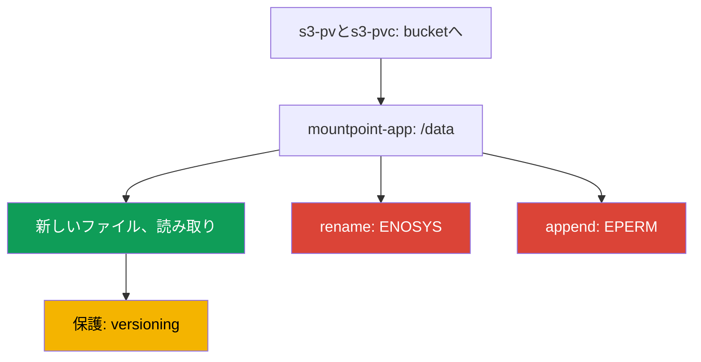
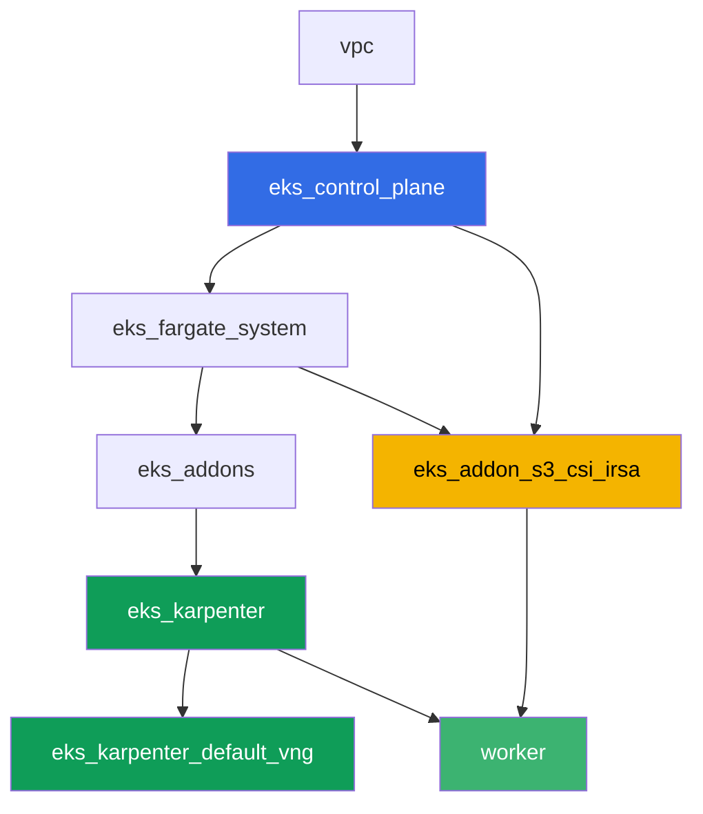

[Русская версия](README_RU.MD) · [Eng version](README.MD) · [Versión en español](README_ES.MD) · [Version française](README_FR.MD) · [Deutsche Version](README_DE.MD) · [ქართული ვერსია](README_GE.MD) · [繁體中文版](README_TW.MD)

# ラボ129 - Mountpoint for S3: ファイルのセマンティクスがどこで壊れ、なぜバックアップがないのか

## 説明

このラボはMountpoint for Amazon S3 CSIで最もよくある誤りをテーマにしています: ボ
リュームはマウントされ、アプリケーションは起動しているのに、普段どおりのファイルシ
ステム操作が失敗します。あなたは実際のbucketに対して静的なPV/PVCを立て、新しいファ
イルの作成と読み取りが動くことを確認したうえで、`rename`、append(追加書き込み)、
そしてファイルの途中への書き込みで症状を再現します - この3つはいずれもS3がオブジェ
クトストレージであってPOSIXファイルシステムではないため、`Operation not permitted`
で失敗します。最後に、このテーマの後半を解き明かします: なぜこのPVCの背後にあるオブ
ジェクトが通常のEKSボリュームバックアップの対象にならないのか、そしてスナップショッ
ト(snapshot)の代わりに何がデータを守っているのかです。

タスクはプロダクションスタイルで記述されています: 短い課題文と受け入れ基準です。チ
ェックは`check_result`コマンドによって自動的に行われます。

## ゴール

コースの章の内容を定着させます:

- [第25章 アプリケーションでのS3: Mountpoint for Amazon S3 CSIとアクセスパター
  ン](../../course/25/ru.md) - このラボの中心的な内容
- [第41-42章 EKS向けのAWS Backup](../../course/41/ru.md) - なぜここでEBSスナップシ
  ョットが使えないのか

## 作成するもの

| オブジェクト | それが何か | このラボにある理由 |
|--------|---------|-------------------|
| Namespace `eks-129` | ラボのワークロード用のクラスタ区画 | リソースを分けて保持する(第4章) |
| PV `s3-pv` / PVC `s3-pvc` | 実際のbucketに対する静的ボリューム | Mountpointには静的プロビジョニングしかない(第25章) |
| Deployment `mountpoint-app` | このPVCを`/data`に持つpod | ファイルシステム操作を確認する場 (第25章) |
| アーティファクト `3/create.txt`、`3/read.txt` | ファイル作成と読み取りの確認 | 成功する操作: 新しいファイル、読み取り(第25章) |
| アーティファクト `4/rename.txt` | ボリューム内の`mv`の出力 | 症状: `rename`が失敗する(第25章) |
| アーティファクト `5/writesemantics.txt` | `append`と途中への書き込みの出力 | 症状: 部分的な書き込みは不可能(第25章) |
| アーティファクト `6/backup.txt` | 説明と`get-bucket-versioning` | なぜスナップショットがなく、versioningがあるのか(第25、41章) |

正常な操作から症状までの道筋:



## インフラストラクチャ

環境はTerragrunt経由でAWS(`eu-central-1`)にデプロイされています。ラボの各ディレク
トリは1つのコンポーネントであり、それぞれ自分の`terragrunt.hcl`を持ち、
`terraform/modules/`内の共通モジュールを参照し、`dependency`ブロックを通じて依存関
係を宣言します。Terragruntは依存関係グラフを構築し、正しい順序でコンポーネントを適
用します。ベースはラボ101と同じです(control plane、システムpod用のFargate、ワーク
ロード用のKarpenter)、それに加えてMountpoint S3 CSI用の独立したコンポーネントとデ
モ用のbucketがあります。

### モジュールと依存関係

| ディレクトリ(コンポーネント) | モジュール(`terraform/modules/`) | 依存先 | 作成するもの |
|---------------------|-------------------------------|------------|-------------|
| `vpc` | `vpc_v3` | - | VPC `10.10.0.0/16`、2つのAZのサブネット、NAT |
| `ssh-keys` | `ssh-keys` | - | ワーカーマシンとノード用のSSHキーペア |
| `eks_control_plane` | `eks_v2_control_plane` | `vpc` | EKS control plane `1.36`、OIDC、security groups |
| `eks_fargate_system` | `eks_v2_fargate` | `vpc`、`eks_control_plane` | `kube-system`と`karpenter`用のFargateプロファイル |
| `eks_addons` | `eks_v2_addons` | `eks_control_plane`、`eks_fargate_system` | coredns、kube-proxy、vpc-cni、pod-identityアドオン |
| `eks_karpenter` | `eks_v2_karpenter` | `vpc`、`eks_control_plane`、`eks_addons`、`eks_fargate_system` | Karpenterコントローラー、ノードIAMロール |
| `eks_karpenter_default_vng` | `eks_v2_karpenter_vng` | `vpc`、`eks_control_plane`、`eks_karpenter` | AL2023上のデフォルトのNodePool `default` |
| `eks_addon_s3_csi_irsa` | `eks_v2_s3_csi_irsa` | `eks_fargate_system`、`eks_control_plane` | versioningを有効にしたS3 bucket、managed addon `aws-mountpoint-s3-csi-driver`、IRSA経由のIAMロール |
| `worker` | `eks_v2_work_pc` | `ssh-keys`、`vpc`、`eks_control_plane`、`eks_karpenter`、`eks_addon_s3_csi_irsa` | kubectl、テスト、`check_result`を備えたワーカーマシン |

コンポーネント`eks_addon_s3_csi_irsa`は、versioningを有効にし、テストオブジェクト
`readme.txt`を持つbucket `<prefix>-mountpoint-demo`を作成し、ドライバをmanaged
addonとしてインストールし、IRSA経由でIAMロールを付与します。権限はbucketに対する
`s3:ListBucket`とオブジェクトに対する
`s3:GetObject`/`s3:PutObject`/`s3:AbortMultipartUpload`のみです - `AmazonS3FullAccess`
は付与されません。あなたがPVを作成する時点では、ドライバはすでに準備できています
(`worker`は`eks_addon_s3_csi_irsa`に依存しています)。

依存関係グラフ(矢印の下にあるほど先に適用される):



### 設定箇所

`env.hcl`(共通の環境パラメータ、すべてのコンポーネントが読み取る):

| パラメータ | ラボでの値 | 影響範囲 |
|----------|-----------------|---------------|
| `region` | `eu-central-1` | すべてのリソースのリージョンとボリュームの`mountOptions` |
| `prefix` | `eks-task129` | リソース名のプレフィックス、bucketの名前を含む |
| `stack_name` | `eks129` | `env_name`(クラスタ名)の組み立てに使用 |
| `k8_version` | `1.36.0` | ワーカーマシン上のkubectlバージョン |

各コンポーネントの`terragrunt.hcl`内の`inputs`(個々のモジュールのパラメータ):

| ファイル | 主要な設定 |
|------|--------------------|
| `eks_addon_s3_csi_irsa/terragrunt.hcl` | managed addon `aws-mountpoint-s3-csi-driver`、クラスタの`oidc_provider_arn`に対するIRSA経由のロール |
| `worker/terragrunt.hcl` | `test_url`と`task_script_url`がラボ129のファイルを指す、`eks_addon_s3_csi_irsa`への依存 |

> モジュール`eks_v2_s3_csi_irsa`内のmanaged addon `aws-mountpoint-s3-csi-driver`の
> バージョンは`v1.15.0-eksbuild.1`で、EKS 1.36で検証済みです(addonは`ACTIVE`にな
> ります)。クラスタのマイナーバージョンを切り替える際は、コマンド
> `aws eks describe-addon-versions --addon-name aws-mountpoint-s3-csi-driver`で確認
> してください。

## デプロイ

```bash
TASK=129 make run_eks_task
```

デプロイには約15〜20分かかります。出力の中からワーカーマシンへのSSH接続の行を見つ
けて接続してください。そこではkubectlが対象のクラスタに対してすでに設定されてお
り、Mountpoint S3 CSIのドライバとbucketもすでに準備できています。

ワーカーマシン上で役立つコマンド:

```bash
time_left       # 環境の残り時間
check_result    # 解答を確認する
```

実際のbucketの名前はこうして見つけます:

```bash
aws s3api list-buckets --query "Buckets[?contains(Name,'mountpoint-demo')].Name" --output text
```

> 環境のセキュリティについて。`env.hcl`では`ssh_password_enable = true`と
> `access_cidrs = ["0.0.0.0/0"]`が有効になっています - トレーニング環境としては便利
> ですが、プロダクションでは行うべきではありません。コースの基準(第0.2章、第2章、
> 第19章)に従うと、ワーカーマシンへのアクセスは公開SSHポートを晒さずにAWS SSM
> Session Manager経由で行い、`access_cidrs`は特定のアドレスに絞り込むべきです。ここ
> では、セットアップを簡単にするためだけに公開SSHが残されています。

## タスク

---
|        **1**        | **ラボのワークロード用のNamespace**                             |
| :-----------------: | :---------------------------------------------------------- |
| 何をするか          | `eks-129`という名前のnamespaceを作成してください。このラボのすべてのオブジェクトはその中に作成されます。 |
| 受け入れ基準    | - namespace `eks-129`が存在する。 |
---
|        **2**        | **実際のbucketに対する静的PV/PVC**                    |
| :-----------------: | :---------------------------------------------------------- |
| 何をするか          | bucketの名前を見つけてください(`aws s3api list-buckets --query "Buckets[?contains(Name,'mountpoint-demo')].Name" --output text`)。PV `s3-pv`を作成してください: `driver: s3.csi.aws.com`、一意の`volumeHandle`、`volumeAttributes.bucketName`は実際のbucketと等しい、`accessModes: ["ReadWriteMany"]`、`storageClassName: ""`、`mountOptions: ["region eu-central-1"]`。`eks-129`にPVC `s3-pvc`を作成してください。`volumeName: s3-pv`、同じ`accessModes`と`storageClassName: ""`を設定します。Mountpointには静的プロビジョニングしかありません: PVは手動で書き、bucketはすでにterraformによって作成されています。 |
| 受け入れ基準    | - PV `s3-pv`が`driver: s3.csi.aws.com`、実際の`bucketName`、`accessModes: ReadWriteMany`、`storageClassName: ""`、`mountOptions`内の`region eu-central-1`を持つ;<br/>- PVC `s3-pvc`が`eks-129`内で`s3-pv`に対して`Bound`状態である。 |
---
|        **3**        | **成功する操作: 新しいファイルと読み取り**                  |
| :-----------------: | :---------------------------------------------------------- |
| 何をするか          | `eks-129`にDeployment `mountpoint-app`(イメージ`busybox:1.36`、`command: ["sh", "-c", "sleep 86400"]`、レプリカ数`1`)を、`/data`にマウントしたPVC `s3-pvc`と一緒に作成してください。イメージにはshellと`mv`、`dd`、`cat`が必要です - このラボ全体がpod内部のファイルシステム操作の上に成り立っています。`kubectl exec`経由で新しいファイル`echo test > /data/newfile.txt`を作成し、それを読み戻してください。別に、bucket内にすでに存在するテストオブジェクト`readme.txt`を同じボリューム経由で読み取ってください。両方の結果をアーティファクトとして保存してください: 新しいファイルの作成と読み取りは`/var/work/tests/artifacts/3/create.txt`に、`readme.txt`の内容は`/var/work/tests/artifacts/3/read.txt`に。 |
| 受け入れ基準    | - Deployment `mountpoint-app`が`eks-129`にあり、ボリューム`s3-pvc`が`/data`にマウントされ、podが`Running`である;<br/>- `create.txt`が空でなく`test`を含む;<br/>- `read.txt`が空でなく`mountpoint demo bucket`を含む。 |
---
|        **4**        | **症状: `rename`が失敗する**                                |
| :-----------------: | :---------------------------------------------------------- |
| 何をするか          | pod `mountpoint-app`内でファイルのリネームを試してください: `mv /data/newfile.txt /data/renamed.txt`。このコマンドは必ず失敗します。エラーの全出力を`/var/work/tests/artifacts/4/rename.txt`に保存してください。エラーのテキストに注目してください: ここでは`Function not implemented`、つまり`ENOSYS`です - Mountpointはシステムコール`rename`を一切実装していません。これはタスク5とは別の種類の失敗です。タスク5では操作は実装されているものの禁止されています(`EPERM`、`Operation not permitted`)。bucketが中間状態に陥っていないことを確認してください: オブジェクト`newfile.txt`はそのまま存在し、オブジェクト`renamed.txt`は存在しません。 |
| 受け入れ基準    | - ファイル`4/rename.txt`が空でない;<br/>- `Function not implemented`(またはドライバのバージョンによっては`Operation not permitted`)を含む;<br/>- bucketにオブジェクト`newfile.txt`が存在し、オブジェクト`renamed.txt`が存在しない。 |
---
|        **5**        | **症状: append(追加書き込み)とファイルの途中への書き込みが失敗する**      |
| :-----------------: | :---------------------------------------------------------- |
| 何をするか          | pod `mountpoint-app`内で、既存のファイルへの追記(append)を試してください: `echo more >> /data/newfile.txt`。次に同じファイルの途中への書き込みを試してください: `dd of=/data/newfile.txt bs=1 seek=1 conv=notrunc`(入力データの内容自体は重要ではありません)。両方のコマンドは必ず`Operation not permitted`で失敗します。さらに2つの隣接する操作も確認して自分で理解してください: 既存ファイルの上書き(`echo test2 > /data/newfile.txt`)と削除(`rm /data/newfile.txt`)も`Operation not permitted`で失敗します。これはMountpointがデフォルトで`allow-overwrite`と`allow-delete`を有効にしていないためです。一方`mkdir /data/sub`は黙って通過します。S3内のディレクトリは仮想的なものであり、それに対してオブジェクトが作成されないためです。出力を、短い説明(S3オブジェクトは不変であり、新しい`PutObject`によって全体としてのみ更新される。タスク4のrenameとの対比として)と一緒に`/var/work/tests/artifacts/5/writesemantics.txt`に保存してください。 |
| 受け入れ基準    | - ファイル`5/writesemantics.txt`が空でない;<br/>- `Operation not permitted`を含む;<br/>- `append`、`rename`、`середин`のうち少なくとも1つを含む。 |
---
|        **6**        | **なぜこのPVCの背後にあるプレフィックスがAWS Backupでバックアップされないのか** |
| :-----------------: | :---------------------------------------------------------- |
| 何をするか          | EKS向けのAWS Backup(第41-42章)はCSIスナップショットを通じてEBSボリュームを保護します。MountpointボリュームはEBSを内部に持っていません: データはすでにS3内でオブジェクトとして保存されており、ブロックデバイス上にはないため、こうしたPVCには同じ意味でのスナップショット(snapshot)がありません。ここでデータを保護しているのは、通常のS3の仕組みです。まずbucketのversioningです(terraformがこのbucketで事前に有効にしています)。コマンド`aws s3api get-bucket-versioning --bucket <bucket>`でこれを確認し、その出力を説明(このボリュームはEBSではなく、スナップショットはなく、versioningによって保護されている)と一緒に`/var/work/tests/artifacts/6/backup.txt`に保存してください。 |
| 受け入れ基準    | - ファイル`6/backup.txt`が空でない;<br/>- `versioning`と`snapshot`(または`снапшот`)を含む;<br/>- `Enabled`(bucketのversioningの確認済みステータス)を含む。 |
---

## 結果の確認

ワーカーマシン上で自動チェックを実行してください:

```bash
check_result
```

スクリプトはテストを実行し、完了したタスクの割合を表示します。

## ソリューション

参考解答: [worker/files/solutions/1_JP.MD](worker/files/solutions/1_JP.MD)

## クラスタとリソースの削除

> **まずワークロードとbucketの内容を取り除いてください。** bucketはterraformが作成
> しましたが、その中のオブジェクトはpodからMountpoint経由で生まれたものです -
> terraformにとってこれは外部のデータです。空でないbucketは削除できず、`destroy`は
> そこで止まってしまいます。ここでのボリュームは静的です(MountpointのCSIドライバ
> 上のPV)が、それでもnamespaceは最初に削除します。そうすることでpodがマウントポイ
> ントを解放し、Karpenterがクラスタを取り壊す前にノードを取り除けるようにします。

```bash
kubectl delete namespace eks-129 --ignore-not-found

while kubectl get nodes --no-headers 2>/dev/null | grep -qv fargate; do
  echo "EC2ノードはまだ残っています、待機中..."; sleep 15
done

BUCKET=$(grep '^bucket_name' ~/lab129_hints.txt | awk '{print $3}')
# bucketでバージョニングが有効な場合、オブジェクトのバージョンとdelete markersの両方が必要
aws s3 rm "s3://${BUCKET}" --recursive
aws s3api list-object-versions --bucket "$BUCKET" \
  --query '{Objects: Versions[].{Key:Key,VersionId:VersionId}}' --output json > /tmp/vers.json
aws s3api delete-objects --bucket "$BUCKET" --delete file:///tmp/vers.json 2>/dev/null
aws s3api list-object-versions --bucket "$BUCKET" \
  --query '{Objects: DeleteMarkers[].{Key:Key,VersionId:VersionId}}' --output json > /tmp/dm.json
aws s3api delete-objects --bucket "$BUCKET" --delete file:///tmp/dm.json 2>/dev/null

# bucketは空になるはずです: 両方のコマンドはNone(空のリスト)を出力します
# (length(Versions)はここでは使えません - 空のbucketではこのフィールドがnullになり、jmespathがエラーになります)
aws s3api list-object-versions --bucket "$BUCKET" --query 'Versions[].Key' --output text
aws s3api list-object-versions --bucket "$BUCKET" --query 'DeleteMarkers[].Key' --output text
```

オブジェクトの削除はpodからではなくAWS CLI経由で行う必要があります: ボリューム内で
`rm`を実行すると`Operation not permitted`で失敗します。これはMountpointがデフォルト
では`allow-delete`なしでマウントされるためです(これはタスク5で観察したのと同じで
す)。

```bash
TASK=129 make delete_eks_task
```
