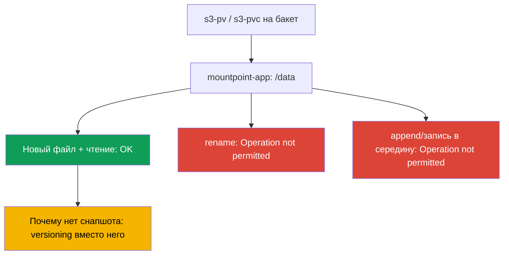
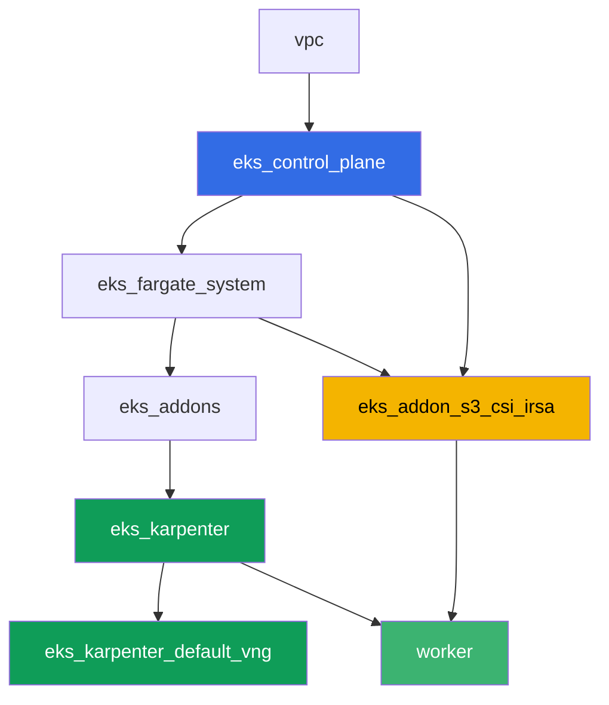

# Лаба 129 - Mountpoint for S3: где ломается семантика файлов и почему нет бэкапа

## Описание

Лаба про самую частую ошибку с Mountpoint for Amazon S3 CSI: том смонтирован, приложение
стартовало, но привычные операции файловой системы падают. Вы поднимете статический PV/PVC
на реальный бакет, убедитесь, что создание нового файла и чтение работают, а затем
воспроизведёте симптом на `rename`, дозаписи и записи в середину файла - все три падают с
`Operation not permitted`, потому что S3 - объектное хранилище, а не POSIX-ФС. В конце
разберёте вторую половину темы: почему объекты за этим PVC не попадают под обычный бэкап
EKS-томов и что защищает данные вместо снапшота.

Задания в продакшн-стиле: короткая постановка плюс критерии приёмки. Проверка -
автоматическая, командой `check_result`.

## Цель

Закрепить материал главы курса:

- [Глава 25. S3 в приложениях: Mountpoint for Amazon S3 CSI и паттерны доступа](../../course/25/ru.md) - основной материал лабы
- [Глава 41-42. AWS Backup для EKS](../../course/41/ru.md) - почему EBS-снапшоты сюда не применимы

## Что мы создаём

| Объект | Что это | Зачем в этой лабе |
|--------|---------|-------------------|
| Namespace `eks-129` | раздел кластера под нагрузку лабы | держим ресурсы отдельно (глава 4) |
| PV `s3-pv` / PVC `s3-pvc` | статический том на реальный бакет | только статический провижининг у Mountpoint (глава 25) |
| Deployment `mountpoint-app` | под с этим PVC на `/data` | площадка для проверки операций ФС (глава 25) |
| Артефакт `3/create.txt`, `3/read.txt` | подтверждение создания и чтения файла | успешные операции: новый файл, чтение (глава 25) |
| Артефакт `4/rename.txt` | вывод `mv` в томе | симптом: `rename` падает (глава 25) |
| Артефакт `5/writesemantics.txt` | вывод `append` и записи в середину | симптом: частичная запись невозможна (глава 25) |
| Артефакт `6/backup.txt` | объяснение и `get-bucket-versioning` | почему нет снапшота, а есть versioning (главы 25, 41) |

Путь от рабочих операций до симптома:



## Инфраструктура

Окружение разворачивается в AWS (`eu-central-1`) через Terragrunt. Каждый каталог лабы -
это один компонент со своим `terragrunt.hcl`, который ссылается на общий модуль в
`terraform/modules/` и объявляет зависимости через блоки `dependency`. Terragrunt строит
граф зависимостей и применяет компоненты в правильном порядке. База - та же, что в лабе
101 (control plane, Fargate под системные поды, Karpenter под нагрузку), плюс отдельный
компонент под Mountpoint S3 CSI и демонстрационный бакет.

### Модули и зависимости

| Каталог (компонент) | Модуль (`terraform/modules/`) | Зависит от | Что создаёт |
|---------------------|-------------------------------|------------|-------------|
| `vpc` | `vpc_v3` | - | VPC `10.10.0.0/16`, подсети в двух AZ, NAT |
| `ssh-keys` | `ssh-keys` | - | пара SSH-ключей для рабочей машины и нод |
| `eks_control_plane` | `eks_v2_control_plane` | `vpc` | control plane EKS `1.36`, OIDC, security groups |
| `eks_fargate_system` | `eks_v2_fargate` | `vpc`, `eks_control_plane` | Fargate-профиль для `kube-system` и `karpenter` |
| `eks_addons` | `eks_v2_addons` | `eks_control_plane`, `eks_fargate_system` | coredns, kube-proxy, vpc-cni, pod-identity |
| `eks_karpenter` | `eks_v2_karpenter` | `vpc`, `eks_control_plane`, `eks_addons`, `eks_fargate_system` | контроллер Karpenter, IAM-роль нод |
| `eks_karpenter_default_vng` | `eks_v2_karpenter_vng` | `vpc`, `eks_control_plane`, `eks_karpenter` | дефолтный NodePool `default` на AL2023 |
| `eks_addon_s3_csi_irsa` | `eks_v2_s3_csi_irsa` | `eks_fargate_system`, `eks_control_plane` | бакет S3 с versioning, managed addon `aws-mountpoint-s3-csi-driver`, IAM-роль через IRSA |
| `worker` | `eks_v2_work_pc` | `ssh-keys`, `vpc`, `eks_control_plane`, `eks_karpenter`, `eks_addon_s3_csi_irsa` | рабочая машина с kubectl, тестами и `check_result` |

Компонент `eks_addon_s3_csi_irsa` создаёт бакет `<prefix>-mountpoint-demo` с включённым
versioning и тестовым объектом `readme.txt`, ставит драйвер как managed addon и выдаёт ему
IAM-роль через IRSA с правами `s3:ListBucket` на бакет и
`s3:GetObject`/`s3:PutObject`/`s3:AbortMultipartUpload` на объекты - без
`AmazonS3FullAccess`. К моменту, когда вы создаёте PV, драйвер уже готов (`worker` зависит
от `eks_addon_s3_csi_irsa`).

Граф зависимостей (что применяется раньше, то ниже по стрелке):



### Где что настраивается

`env.hcl` (общие параметры окружения, читаются всеми компонентами):

| Параметр | Значение в лабе | На что влияет |
|----------|-----------------|---------------|
| `region` | `eu-central-1` | регион всех ресурсов и `mountOptions` тома |
| `prefix` | `eks-task129` | префикс имён ресурсов, включая имя бакета |
| `stack_name` | `eks129` | из него собирается `env_name` - имя кластера |
| `k8_version` | `1.36.0` | версия kubectl на рабочей машине |

`inputs` в `terragrunt.hcl` каждого компонента (параметры конкретного модуля):

| Файл | Ключевые настройки |
|------|--------------------|
| `eks_addon_s3_csi_irsa/terragrunt.hcl` | managed addon `aws-mountpoint-s3-csi-driver`, роль через IRSA на `oidc_provider_arn` кластера |
| `worker/terragrunt.hcl` | `test_url` и `task_script_url` на файлы лабы 129, зависимость от `eks_addon_s3_csi_irsa` |

> Версия managed addon `aws-mountpoint-s3-csi-driver` в модуле `eks_v2_s3_csi_irsa` - разумное
> предположение с комментарием в коде. Перед продом сверьте её командой
> `aws eks describe-addon-versions --addon-name aws-mountpoint-s3-csi-driver`.

## Развёртывание

```bash
TASK=129 make run_eks_task
```

Развёртывание занимает примерно 15-20 минут. В выводе найдите строку с SSH-подключением к
рабочей машине и подключитесь к ней. kubectl там уже настроен на нужный кластер, драйвер
Mountpoint S3 CSI и бакет уже готовы.

Полезные команды на рабочей машине:

```bash
time_left       # сколько осталось времени окружения
check_result    # проверить решение
```

Имя реального бакета найдёте так:

```bash
aws s3api list-buckets --query "Buckets[?contains(Name,'mountpoint-demo')].Name" --output text
```

> Безопасность стенда. В `env.hcl` включены `ssh_password_enable = true` и
> `access_cidrs = ["0.0.0.0/0"]` - это удобно для учебного окружения, но так делать в
> продакшене нельзя. По стандартам курса (главы 0.2, 2, 19) доступ к рабочим машинам
> открывают через AWS SSM Session Manager без публичных SSH-портов наружу, а `access_cidrs`
> сужают до конкретных адресов. Здесь публичный SSH оставлен только ради простоты запуска.

## Задания

---
|        **1**        | **Namespace для нагрузки лабы**                             |
| :-----------------: | :---------------------------------------------------------- |
| Что делаем          | Создайте namespace с именем `eks-129`. Все объекты лабы создаются внутри него. |
| Критерии приёмки    | - namespace `eks-129` существует. |
---
|        **2**        | **Статический PV/PVC на реальный бакет**                    |
| :-----------------: | :---------------------------------------------------------- |
| Что делаем          | Найдите имя бакета (`aws s3api list-buckets --query "Buckets[?contains(Name,'mountpoint-demo')].Name" --output text`). Создайте PV `s3-pv`: `driver: s3.csi.aws.com`, уникальный `volumeHandle`, `volumeAttributes.bucketName` равен реальному бакету, `accessModes: ["ReadWriteMany"]`, `storageClassName: ""`, `mountOptions: ["region eu-central-1"]`. Создайте PVC `s3-pvc` в `eks-129` с `volumeName: s3-pv`, тем же `accessModes` и `storageClassName: ""`. Mountpoint поддерживает только статический провижининг: PV пишется вручную, бакет уже создан terraform-ом. |
| Критерии приёмки    | - PV `s3-pv` с `driver: s3.csi.aws.com`, реальным `bucketName`, `accessModes: ReadWriteMany`, `storageClassName: ""`, `region eu-central-1` в `mountOptions`;<br/>- PVC `s3-pvc` в `eks-129` в состоянии `Bound` на `s3-pv`. |
---
|        **3**        | **Успешные операции: новый файл и чтение**                  |
| :-----------------: | :---------------------------------------------------------- |
| Что делаем          | В `eks-129` создайте Deployment `mountpoint-app` (образ `viktoruj/ping_pong:latest`, `1` реплика) с PVC `s3-pvc`, смонтированным на `/data`. Через `kubectl exec` создайте новый файл `echo test > /data/newfile.txt` и прочитайте его назад. Отдельно прочитайте существующий тестовый объект бакета `readme.txt` через тот же том. Оба результата сохраните в артефакты: создание и чтение нового файла в `/var/work/tests/artifacts/3/create.txt`, содержимое `readme.txt` в `/var/work/tests/artifacts/3/read.txt`. |
| Критерии приёмки    | - Deployment `mountpoint-app` в `eks-129`, том `s3-pvc` смонтирован на `/data`, под `Running`;<br/>- `create.txt` не пуст и содержит `test`;<br/>- `read.txt` не пуст и содержит `mountpoint demo bucket`. |
---
|        **4**        | **Симптом: `rename` падает**                                |
| :-----------------: | :---------------------------------------------------------- |
| Что делаем          | В поде `mountpoint-app` попробуйте переименовать файл: `mv /data/newfile.txt /data/renamed.txt`. Команда обязана упасть. Сохраните полный вывод ошибки в `/var/work/tests/artifacts/4/rename.txt`. |
| Критерии приёмки    | - файл `4/rename.txt` не пуст;<br/>- содержит `Operation not permitted`. |
---
|        **5**        | **Симптом: дозапись и запись в середину файла падают**      |
| :-----------------: | :---------------------------------------------------------- |
| Что делаем          | В поде `mountpoint-app` попробуйте дописать в существующий файл: `echo more >> /data/newfile.txt`. Затем попробуйте записать в середину того же файла: `dd of=/data/newfile.txt bs=1 seek=1 conv=notrunc` (данные на вход не важны). Обе команды обязаны упасть. Сохраните оба вывода вместе с коротким объяснением (объект S3 неизменяем и обновляется только целиком через новый `PutObject`) в `/var/work/tests/artifacts/5/writesemantics.txt`. |
| Критерии приёмки    | - файл `5/writesemantics.txt` не пуст;<br/>- содержит `Operation not permitted`;<br/>- содержит хотя бы одно из `append`, `rename`, `середин`. |
---
|        **6**        | **Почему префиксы за этим PVC не бэкапятся через AWS Backup** |
| :-----------------: | :---------------------------------------------------------- |
| Что делаем          | AWS Backup для EKS (главы 41-42) защищает EBS-тома через снапшоты CSI. У Mountpoint-тома нет EBS под капотом: данные уже лежат в S3 как объекты, а не на блочном устройстве, поэтому у такого PVC нет снапшота в том же смысле. Защита данных здесь - обычные механизмы S3, в первую очередь versioning бакета (terraform включил его на этом бакете). Подтвердите это командой `aws s3api get-bucket-versioning --bucket <bucket>` и сохраните её вывод вместе с объяснением (том не EBS, снапшота нет, защита через versioning) в `/var/work/tests/artifacts/6/backup.txt`. |
| Критерии приёмки    | - файл `6/backup.txt` не пуст;<br/>- содержит `versioning` и `snapshot` (или `снапшот`);<br/>- содержит `Enabled` (подтверждённый статус versioning бакета). |
---

## Проверка результата

На рабочей машине запустите автоматическую проверку:

```bash
check_result
```

Скрипт прогонит тесты и покажет процент выполненных заданий.

## Решение

Эталонное решение: [worker/files/solutions/1.MD](worker/files/solutions/1.MD)

## Удаление кластера и ресурсов

```bash
TASK=129 make delete_eks_task
```
