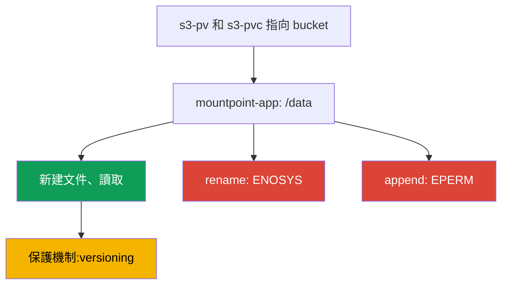
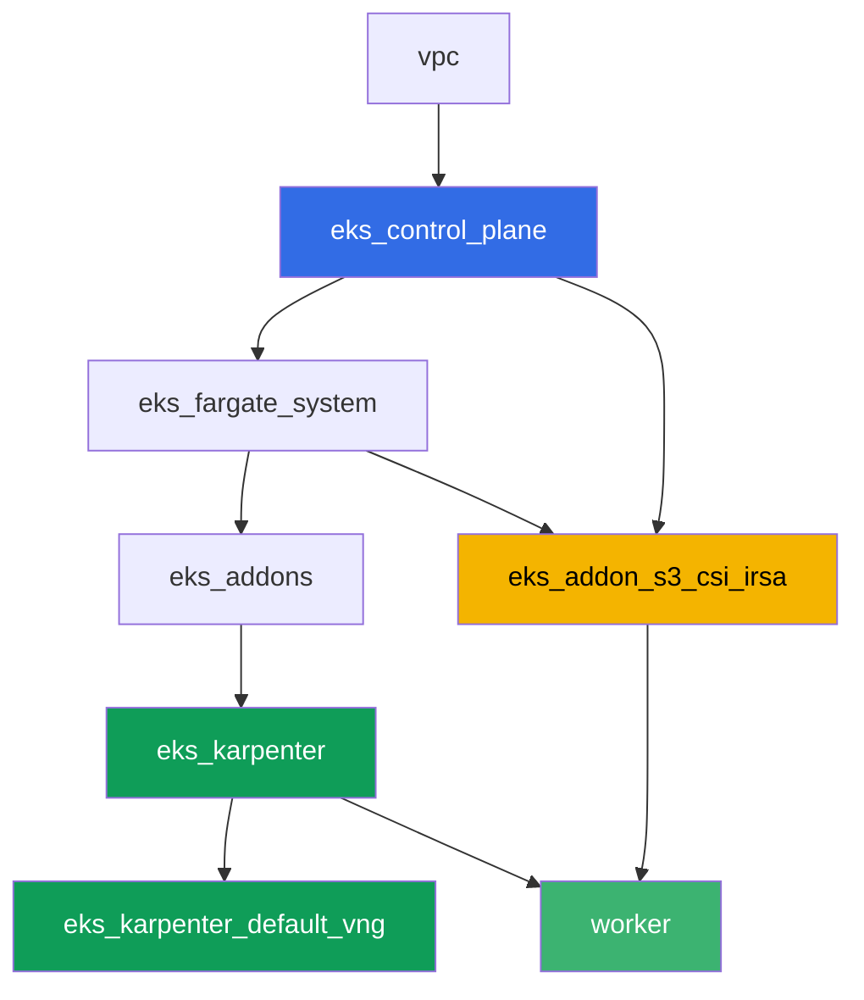

[Русская версия](README_RU.MD) · [Eng version](README.MD) · [Versión en español](README_ES.MD) · [Version française](README_FR.MD) · [Deutsche Version](README_DE.MD) · [ქართული ვერსია](README_GE.MD) · [日本語版](README_JP.MD)

# 實驗 129 - Mountpoint for S3:文件語義在哪裡會出問題,以及為什麼沒有備份

## 說明

這個實驗探討 Mountpoint for Amazon S3 CSI 最常見的錯誤:卷已經掛載,應用也已經啟
動,但常見的文件系統操作卻會失敗。你會為一個真實的 bucket 建立靜態 PV/PVC,確認建
立新文件和讀取都能正常工作,然後重現 `rename`、append(追加寫入)以及在文件中間寫
入時的症狀 - 這三種操作都會以 `Operation not permitted` 失敗,因為 S3 是物件儲存,
而不是 POSIX 文件系統。最後,你會弄清楚這個主題的另一半:為什麼這個 PVC 背後的物件
不會被常規的 EKS 卷備份覆蓋,以及是什麼在代替快照(snapshot)保護數據。

任務以生產風格編寫:簡短的任務描述加驗收標準。驗證是自動的,透過 `check_result` 命
令完成。

## 目標

鞏固以下課程章節的內容:

- [第 25 章。應用中的 S3:Mountpoint for Amazon S3 CSI 與存取模式](../../course/25/ru.md) -
  這個實驗的核心內容
- [第 41-42 章。EKS 的 AWS Backup](../../course/41/ru.md) - 為什麼 EBS 快照不適用於
  這裡

## 我們要創建什麼

| 對象 | 這是什麼 | 在這個實驗中的作用 |
|--------|---------|-------------------|
| Namespace `eks-129` | 集群中供這個實驗負載使用的區段 | 把資源分開存放(第 4 章) |
| PV `s3-pv` / PVC `s3-pvc` | 指向真實 bucket 的靜態卷 | Mountpoint 只支援靜態配置(第 25 章) |
| Deployment `mountpoint-app` | 帶有這個 PVC 的 pod,掛載在 `/data` | 用來驗證文件系統操作的場地(第 25 章) |
| 產物 `3/create.txt`、`3/read.txt` | 確認文件已建立且能讀取 | 成功的操作:新建文件、讀取(第 25 章) |
| 產物 `4/rename.txt` | 卷中 `mv` 的輸出 | 症狀:`rename` 失敗(第 25 章) |
| 產物 `5/writesemantics.txt` | `append` 和寫入文件中間的輸出 | 症狀:部分寫入是不可能的(第 25 章) |
| 產物 `6/backup.txt` | 說明以及 `get-bucket-versioning` | 為什麼沒有快照,而有 versioning(第 25、41 章) |

從正常操作到症狀的路徑:



## 基礎設施

環境透過 Terragrunt 部署在 AWS(`eu-central-1`)。實驗的每個目錄都是一個組件,擁有自
己的 `terragrunt.hcl`,它引用 `terraform/modules/` 中的共用模組,並透過 `dependency`
區塊聲明依賴關係。Terragrunt 建立依賴關係圖,並以正確的順序套用各個組件。基礎與實驗
101 相同(control plane、供系統 pod 使用的 Fargate、供負載使用的 Karpenter),再加上
一個獨立的 Mountpoint S3 CSI 組件和一個示範用的 bucket。

### 模組與依賴關係

| 目錄(組件) | 模組(`terraform/modules/`) | 依賴於 | 創建了什麼 |
|---------------------|-------------------------------|------------|-------------|
| `vpc` | `vpc_v3` | - | VPC `10.10.0.0/16`,兩個 AZ 中的子網,NAT |
| `ssh-keys` | `ssh-keys` | - | 供工作機與節點使用的一對 SSH 金鑰 |
| `eks_control_plane` | `eks_v2_control_plane` | `vpc` | EKS control plane `1.36`、OIDC、security groups |
| `eks_fargate_system` | `eks_v2_fargate` | `vpc`、`eks_control_plane` | `kube-system` 與 `karpenter` 的 Fargate 配置檔 |
| `eks_addons` | `eks_v2_addons` | `eks_control_plane`、`eks_fargate_system` | coredns、kube-proxy、vpc-cni、pod-identity 附加元件 |
| `eks_karpenter` | `eks_v2_karpenter` | `vpc`、`eks_control_plane`、`eks_addons`、`eks_fargate_system` | Karpenter 控制器、節點 IAM 角色 |
| `eks_karpenter_default_vng` | `eks_v2_karpenter_vng` | `vpc`、`eks_control_plane`、`eks_karpenter` | 基於 AL2023 的預設 NodePool `default` |
| `eks_addon_s3_csi_irsa` | `eks_v2_s3_csi_irsa` | `eks_fargate_system`、`eks_control_plane` | 啟用 versioning 的 S3 bucket、managed addon `aws-mountpoint-s3-csi-driver`、透過 IRSA 的 IAM 角色 |
| `worker` | `eks_v2_work_pc` | `ssh-keys`、`vpc`、`eks_control_plane`、`eks_karpenter`、`eks_addon_s3_csi_irsa` | 帶有 kubectl、測試腳本和 `check_result` 的工作機 |

組件 `eks_addon_s3_csi_irsa` 創建了一個啟用 versioning、帶有測試物件 `readme.txt` 的
bucket `<prefix>-mountpoint-demo`,把驅動程式安裝為 managed addon,並透過 IRSA 賦予它
一個 IAM 角色,權限僅為對 bucket 的 `s3:ListBucket` 和對物件的
`s3:GetObject`/`s3:PutObject`/`s3:AbortMultipartUpload` - 沒有 `AmazonS3FullAccess`。
在你創建 PV 的時候,驅動程式已經準備好了(`worker` 依賴於 `eks_addon_s3_csi_irsa`)。

依賴關係圖(較早套用的組件位於箭頭下方):



### 哪裡配置了什麼

`env.hcl`(環境的共用參數,所有組件都會讀取):

| 參數 | 這個實驗中的值 | 影響的內容 |
|----------|-----------------|---------------|
| `region` | `eu-central-1` | 所有資源的區域以及卷的 `mountOptions` |
| `prefix` | `eks-task129` | 資源名稱的前綴,包括 bucket 的名稱 |
| `stack_name` | `eks129` | 用來組成 `env_name` - 集群名稱 |
| `k8_version` | `1.36.0` | 工作機上的 kubectl 版本 |

每個組件 `terragrunt.hcl` 中的 `inputs`(具體模組的參數):

| 檔案 | 關鍵設定 |
|------|--------------------|
| `eks_addon_s3_csi_irsa/terragrunt.hcl` | managed addon `aws-mountpoint-s3-csi-driver`,透過集群的 `oidc_provider_arn` 建立 IRSA 角色 |
| `worker/terragrunt.hcl` | `test_url` 和 `task_script_url` 指向實驗 129 的檔案,依賴於 `eks_addon_s3_csi_irsa` |

> 模組 `eks_v2_s3_csi_irsa` 中 managed addon `aws-mountpoint-s3-csi-driver` 的版本
> 是 `v1.15.0-eksbuild.1`,已在 EKS 1.36 上驗證過(addon 會進入 `ACTIVE`)。切換集群
> 小版本時,請用命令
> `aws eks describe-addon-versions --addon-name aws-mountpoint-s3-csi-driver` 核對。

## 部署

```bash
TASK=129 make run_eks_task
```

部署大約需要 15-20 分鐘。在輸出中找到連接工作機的 SSH 那一行並連接上去。那裡的
kubectl 已經配置好對應的集群,Mountpoint S3 CSI 的驅動程式和 bucket 都已經準備好了。

工作機上的常用命令:

```bash
time_left       # 環境剩餘的時間
check_result    # 檢查解答
```

真實 bucket 的名稱可以這樣找到:

```bash
aws s3api list-buckets --query "Buckets[?contains(Name,'mountpoint-demo')].Name" --output text
```

> 環境安全性。`env.hcl` 中啟用了 `ssh_password_enable = true` 和
> `access_cidrs = ["0.0.0.0/0"]` - 這對於學習環境很方便,但在生產環境中不應該這樣做。
> 依照課程標準(第 0.2、2、19 章),對工作機的存取應透過 AWS SSM Session Manager 進
> 行,不對外暴露公開的 SSH 端口,並將 `access_cidrs` 限制到具體的位址。這裡保留公開
> SSH 只是為了簡化啟動流程。

## 任務

---
|        **1**        | **這個實驗負載用的 Namespace**                             |
| :-----------------: | :---------------------------------------------------------- |
| 我們要做什麼          | 創建一個名為 `eks-129` 的 namespace。這個實驗的所有對象都創建在它內部。 |
| 驗收標準    | - namespace `eks-129` 存在。 |
---
|        **2**        | **指向真實 bucket 的靜態 PV/PVC**                    |
| :-----------------: | :---------------------------------------------------------- |
| 我們要做什麼          | 找到 bucket 的名稱(`aws s3api list-buckets --query "Buckets[?contains(Name,'mountpoint-demo')].Name" --output text`)。創建 PV `s3-pv`:`driver: s3.csi.aws.com`、唯一的 `volumeHandle`、`volumeAttributes.bucketName` 等於真實 bucket、`accessModes: ["ReadWriteMany"]`、`storageClassName: ""`、`mountOptions: ["region eu-central-1"]`。在 `eks-129` 中創建 PVC `s3-pvc`,設定 `volumeName: s3-pv`,擁有相同的 `accessModes` 和 `storageClassName: ""`。Mountpoint 只支援靜態配置:PV 是手動寫入的,bucket 已經由 terraform 創建好了。 |
| 驗收標準    | - PV `s3-pv` 帶有 `driver: s3.csi.aws.com`、真實的 `bucketName`、`accessModes: ReadWriteMany`、`storageClassName: ""`、`mountOptions` 中的 `region eu-central-1`;<br/>- PVC `s3-pvc` 在 `eks-129` 中處於 `Bound` 狀態,綁定到 `s3-pv`。 |
---
|        **3**        | **成功的操作:新建文件與讀取**                  |
| :-----------------: | :---------------------------------------------------------- |
| 我們要做什麼          | 在 `eks-129` 中創建 Deployment `mountpoint-app`(映像 `busybox:1.36`,`command: ["sh", "-c", "sleep 86400"]`,`1` 個副本),掛載 PVC `s3-pvc` 到 `/data`。映像需要帶有 shell 以及 `mv`、`dd`、`cat` 工具 - 整個實驗都建立在 pod 內的文件系統操作之上。透過 `kubectl exec` 創建一個新文件 `echo test > /data/newfile.txt`,再把它讀回來。另外透過同一個卷讀取 bucket 中已存在的測試物件 `readme.txt`。把這兩個結果都保存為產物:新文件的建立和讀取保存到 `/var/work/tests/artifacts/3/create.txt`,`readme.txt` 的內容保存到 `/var/work/tests/artifacts/3/read.txt`。 |
| 驗收標準    | - Deployment `mountpoint-app` 在 `eks-129` 中,卷 `s3-pvc` 掛載在 `/data`,pod 為 `Running`;<br/>- `create.txt` 不為空且包含 `test`;<br/>- `read.txt` 不為空且包含 `mountpoint demo bucket`。 |
---
|        **4**        | **症狀:`rename` 會失敗**                                |
| :-----------------: | :---------------------------------------------------------- |
| 我們要做什麼          | 在 pod `mountpoint-app` 中嘗試重命名文件:`mv /data/newfile.txt /data/renamed.txt`。這個命令必須失敗。把完整的錯誤輸出保存到 `/var/work/tests/artifacts/4/rename.txt`。注意錯誤文字:這裡是 `Function not implemented`,也就是 `ENOSYS` - Mountpoint 根本沒有實作系統呼叫 `rename`。這與任務 5 中的失敗不同,那裡的操作是實作了的,但被禁止(`EPERM`、`Operation not permitted`)。確認 bucket 沒有進入中間狀態:物件 `newfile.txt` 還在原位,物件 `renamed.txt` 不存在。 |
| 驗收標準    | - 檔案 `4/rename.txt` 不為空;<br/>- 包含 `Function not implemented`(或 `Operation not permitted`,如果驅動版本回應方式不同);<br/>- bucket 中存在物件 `newfile.txt`,且不存在物件 `renamed.txt`。 |
---
|        **5**        | **症狀:append(追加寫入)和寫入文件中間會失敗**      |
| :-----------------: | :---------------------------------------------------------- |
| 我們要做什麼          | 在 pod `mountpoint-app` 中嘗試向現有文件追加內容(append):`echo more >> /data/newfile.txt`。然後嘗試寫入同一個文件的中間:`dd of=/data/newfile.txt bs=1 seek=1 conv=notrunc`(輸入的數據內容不重要)。這兩個命令都必須以 `Operation not permitted` 失敗。同時檢查兩個相鄰的操作並自行理解它們:覆寫現有文件(`echo test2 > /data/newfile.txt`)和刪除(`rm /data/newfile.txt`)也會以 `Operation not permitted` 失敗,因為 Mountpoint 預設不啟用 `allow-overwrite` 和 `allow-delete`;而 `mkdir /data/sub` 會靜默通過,因為 S3 中的目錄是虛擬的,不會為它創建物件。把輸出連同一段簡短的說明(S3 物件是不可變的,只能透過新的 `PutObject` 整體更新,對比任務 4 中的 rename)一起保存到 `/var/work/tests/artifacts/5/writesemantics.txt`。 |
| 驗收標準    | - 檔案 `5/writesemantics.txt` 不為空;<br/>- 包含 `Operation not permitted`;<br/>- 至少包含 `append`、`rename`、`середин` 中的一個。 |
---
|        **6**        | **為什麼這個 PVC 背後的前綴不會透過 AWS Backup 備份** |
| :-----------------: | :---------------------------------------------------------- |
| 我們要做什麼          | EKS 的 AWS Backup(第 41-42 章)透過 CSI 快照保護 EBS 卷。Mountpoint 卷底層根本沒有 EBS:數據已經以物件形式存放在 S3 中,而不是在區塊裝置上,所以這樣的 PVC 沒有同樣意義上的快照(snapshot)。這裡的數據保護依靠的是 S3 本身的常規機制,首先是 bucket 的 versioning(terraform 已經在這個 bucket 上啟用了它)。用命令 `aws s3api get-bucket-versioning --bucket <bucket>` 確認這一點,並把它的輸出連同說明(這個卷不是 EBS,沒有快照,靠 versioning 保護)一起保存到 `/var/work/tests/artifacts/6/backup.txt`。 |
| 驗收標準    | - 檔案 `6/backup.txt` 不為空;<br/>- 包含 `versioning` 和 `snapshot`(或 `снапшот`);<br/>- 包含 `Enabled`(bucket versioning 已確認的狀態)。 |
---

## 檢查結果

在工作機上執行自動檢查:

```bash
check_result
```

腳本會執行測試,並顯示已完成任務的百分比。

## 解決方案

參考解決方案:[worker/files/solutions/1_TW.MD](worker/files/solutions/1_TW.MD)

## 刪除集群與資源

> **先清除負載和 bucket 中的內容。** Bucket 是由 terraform 創建的,但裡面的物件是
> 從 pod 透過 Mountpoint 產生的 - 對 terraform 來說這些是外部數據。非空的 bucket 無法
> 被刪除,`destroy` 會卡在它上面。這裡的卷是靜態的(基於 Mountpoint CSI 驅動的 PV),
> 但 namespace 仍然要先刪除,這樣 pod 才能釋放掛載點,Karpenter 才能在集群拆除之前把
> 節點移除。

```bash
kubectl delete namespace eks-129 --ignore-not-found

while kubectl get nodes --no-headers 2>/dev/null | grep -qv fargate; do
  echo "EC2 節點仍然存在,等待中..."; sleep 15
done

BUCKET=$(grep '^bucket_name' ~/lab129_hints.txt | awk '{print $3}')
# 如果 bucket 啟用了版本控制,需要同時處理物件的版本和 delete markers
aws s3 rm "s3://${BUCKET}" --recursive
aws s3api list-object-versions --bucket "$BUCKET" \
  --query '{Objects: Versions[].{Key:Key,VersionId:VersionId}}' --output json > /tmp/vers.json
aws s3api delete-objects --bucket "$BUCKET" --delete file:///tmp/vers.json 2>/dev/null
aws s3api list-object-versions --bucket "$BUCKET" \
  --query '{Objects: DeleteMarkers[].{Key:Key,VersionId:VersionId}}' --output json > /tmp/dm.json
aws s3api delete-objects --bucket "$BUCKET" --delete file:///tmp/dm.json 2>/dev/null

# bucket 應該變成空的:兩個命令都會輸出 None(空列表)
# (length(Versions) 這裡不適用 - 在空 bucket 上這個欄位是 null,jmespath 會報錯)
aws s3api list-object-versions --bucket "$BUCKET" --query 'Versions[].Key' --output text
aws s3api list-object-versions --bucket "$BUCKET" --query 'DeleteMarkers[].Key' --output text
```

刪除物件必須透過 AWS CLI,而不是從 pod 內部進行:`rm` 在卷內會以
`Operation not permitted` 失敗,因為 Mountpoint 預設掛載時不帶 `allow-delete`(這正
是你在任務 5 中觀察到的現象)。

```bash
TASK=129 make delete_eks_task
```
