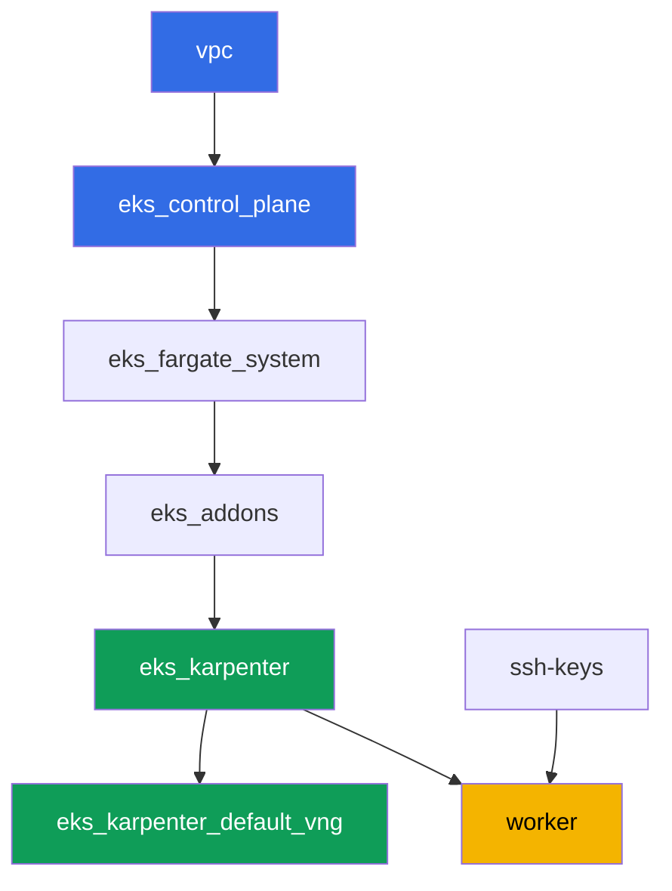

[Русская версия](README_RU.MD) · [Versión en español](README_ES.MD) · [Version française](README_FR.MD) · [Deutsche Version](README_DE.MD) · [ქართული ვერსია](README_GE.MD) · [繁體中文版](README_TW.MD) · [日本語版](README_JP.MD)

# Lab 130 - ECR and supply chain: immutable tags, scan on push, pull through cache

## Description

A cluster runs whatever sits in the registry - the question is whether you can trust that
image. In this lab you work with Amazon ECR as a production-grade registry: you set up a
repository with immutable tags, check an image with the scanner on push, deploy a pod by
digest (not by a tag that can be overwritten), and configure pull through cache for two
upstreams - one without authentication (`registry.k8s.io`) and one with a secret
(`Docker Hub`).

Tasks are written in a production style: a short problem statement plus acceptance criteria.
Checking is automatic, via the `check_result` command.

## Goal

Reinforce the material from the course chapter:

- [Chapter 20. Images and supply chain: ECR, scanning, signatures, pull through cache](../../course/20/ru.md) - where an image comes from and who checked it

## What we're creating

The cluster is already deployed as code (the same base as in lab 101). This lab doesn't
need any dedicated terraform components: you do all the ECR and Secrets Manager work
through the AWS CLI from the worker machine, which already has the required permissions
via the instance's IAM role.

| Object | What it is | Why it's in this lab |
|--------|---------|-------------------|
| Repository `eks-lab130/app` | private ECR, IMMUTABLE, scanOnPush | base for tags, scanning, and lifecycle |
| Image `:v1` | retagged public image | confirms push and IMMUTABLE behavior |
| Artifact `denied.txt` | error from re-pushing the `v1` tag | shows how IMMUTABLE protects a tag |
| Artifact `scan-summary.txt` | scanner findings by severity | checking an image before use |
| Pod `digest-app` | references the image via `@sha256:` | deploy by digest, not by an overwritable tag |
| Cache rule `k8s-cache` | pull through cache for `registry.k8s.io` | caching an upstream without credentials |
| Secret + cache rule `docker-hub` | pull through cache with credential-arn | upstream that requires a secret (the lab's topic) |
| Lifecycle policy | image retention rule | avoid accumulating old tags in the repository |

The image's path from push to a running pod:


## Infrastructure

The environment is deployed in AWS (`eu-central-1`) via Terragrunt. The base matches lab
101: no dedicated components are needed for ECR, `ecr:*` permissions and a limited set of
`secretsmanager:*` are already included in the IAM policy of the worker machine module
`eks_v2_work_pc`, and the Karpenter node role carries the managed policy
`AmazonEC2ContainerRegistryReadOnly` - added by the `eks_v2_karpenter` module - for pulling
from private ECR without `imagePullSecrets`.

### Modules and dependencies

| Directory (component) | Module (`terraform/modules/`) | Depends on | What it creates |
|---------------------|-------------------------------|------------|-------------|
| `vpc` | `vpc_v3` | - | VPC `10.10.0.0/16`, subnets in two AZs, NAT |
| `ssh-keys` | `ssh-keys` | - | SSH key pair for the worker machine and nodes |
| `eks_control_plane` | `eks_v2_control_plane` | `vpc` | EKS control plane `1.36`, OIDC, security groups |
| `eks_fargate_system` | `eks_v2_fargate` | `vpc`, `eks_control_plane` | Fargate profile for `kube-system` and `karpenter` |
| `eks_addons` | `eks_v2_addons` | `eks_control_plane`, `eks_fargate_system` | coredns, kube-proxy, vpc-cni, pod-identity addons |
| `eks_karpenter` | `eks_v2_karpenter` | `vpc`, `eks_control_plane`, `eks_addons`, `eks_fargate_system` | Karpenter controller, node IAM role with `AmazonEC2ContainerRegistryReadOnly` |
| `eks_karpenter_default_vng` | `eks_v2_karpenter_vng` | `vpc`, `eks_control_plane`, `eks_karpenter` | default `default` NodePool on AL2023 |
| `worker` | `eks_v2_work_pc` | `ssh-keys`, `vpc`, `eks_control_plane`, `eks_karpenter` | worker machine: kubectl, `podman`, `ecr:*` and `secretsmanager:*` permissions |

Dependency graph (what gets applied earlier is lower on the arrow):



You create all ECR repositories, Secrets Manager secrets, and cache rules yourself on the
worker machine via the AWS CLI - this lab doesn't need any additional terraform component,
the worker's IAM policy already grants the permissions.

### Where things are configured

`env.hcl` (shared environment parameters):

| Parameter | Value in this lab | What it affects |
|----------|-----------------|---------------|
| `region` | `eu-central-1` | region for all resources, including ECR and Secrets Manager |
| `prefix` | `eks-task130` | prefix for resource names and tags |
| `stack_name` | `eks130` | used to build `env_name` - the cluster name |
| `k8_version` | `1.36.0` | kubectl version on the worker machine |
| `instance_type_worker` | `t3.medium` | worker machine instance type |
| `ssh_password_enable`, `access_cidrs` | `true`, `0.0.0.0/0` | SSH access to the worker machine |

`inputs` in each component's `terragrunt.hcl`:

| File | Key settings |
|------|--------------------|
| `eks_control_plane/terragrunt.hcl` | `eks.version = "1.36"` |
| `eks_addons/terragrunt.hcl` | addon versions for 1.36 |
| `eks_karpenter/terragrunt.hcl` | node IAM role with `AmazonEC2ContainerRegistryReadOnly` for pulling from ECR |
| `worker/terragrunt.hcl` | `test_url` and `task_script_url` pointing to lab 130 files |

## Deployment

```bash
TASK=130 make run_eks_task
```

Deployment takes about 15-20 minutes. In the output, find the line with the SSH connection
to the worker machine and connect to it. kubectl there is already configured for the right
cluster, and the `aws` CLI works without an explicit login - via the instance's IAM role.
The worker machine already has `podman` installed, use it instead of `docker`.

> Keep tasks 2-6 in a single SSH session. `podman login` stores the token in
> `$XDG_RUNTIME_DIR/containers/auth.json`, and that directory lives with the user session:
> after logging out and back in, push and pull will start returning
> `unauthorized: authentication required`, even though the 12-hour ECR token is still valid.
> Fix it by running `aws ecr get-login-password ... | podman login ...` again.

Useful commands on the worker machine:

```bash
time_left       # how much time is left in the environment
check_result    # check the solution
```

> Test bed security. `env.hcl` has `ssh_password_enable = true` and
> `access_cidrs = ["0.0.0.0/0"]` enabled - that's convenient for a learning environment, but
> you must not do this in production. Per the course standards (chapters 0.2, 2, 19), access
> to worker machines is opened via AWS SSM Session Manager without public SSH ports facing
> out, and `access_cidrs` are narrowed to specific addresses. Here, public SSH is left in
> only for the sake of simplicity when launching.

## Tasks

---
|        **1**        | **Repository with immutable tags and scan on push**    |
| :-----------------: | :---------------------------------------------------------- |
| What to do          | Create a private ECR repository `eks-lab130/app` with `image-tag-mutability IMMUTABLE` and `image-scanning-configuration scanOnPush=true`. |
| Acceptance criteria    | - repository `eks-lab130/app` exists;<br/>- `imageTagMutability = IMMUTABLE`;<br/>- `imageScanningConfiguration.scanOnPush = true`. |
---
|        **2**        | **Push an image with the v1 tag**                                  |
| :-----------------: | :---------------------------------------------------------- |
| What to do          | Log in to the registry via `aws ecr get-login-password` and `podman login`. Take the `alpine:3.19` image, retag it, and push it into `eks-lab130/app` with the `v1` tag. Confirm the push succeeded via `aws ecr describe-images`. The image isn't chosen at random: ECR's basic scanning can parse Alpine's package database, so task 4 will get real findings. |
| Acceptance criteria    | - `eks-lab130/app` has an image tagged `v1`. |
---
|        **3**        | **Symptom: IMMUTABLE rejects a repeat push of tag v1**     |
| :-----------------: | :---------------------------------------------------------- |
| What to do          | Take a different image (`busybox:1.36`), retag it with the same `v1` tag, and try to push it into `eks-lab130/app`. The push should be rejected, since the `v1` tag is already taken and the repository is IMMUTABLE. Save the push command's output (stdout and stderr) to `/var/work/tests/artifacts/3/denied.txt`. The output will be long: podman iterates through manifest formats and gets rejected on each - the line you need appears in every attempt. |
| Acceptance criteria    | - the `denied.txt` file is not empty;<br/>- it contains `v1` and a mention of immutable/already exists (e.g. `ImageTagAlreadyExistsException`). |
---
|        **4**        | **Scan findings**                                   |
| :-----------------: | :---------------------------------------------------------- |
| What to do          | Wait for the `v1` image scan to complete (status `COMPLETE`, via `aws ecr wait image-scan-complete` or a manual retry loop). Save a summary of `aws ecr describe-image-scan-findings` (status and finding counts by severity) to `/var/work/tests/artifacts/4/scan-summary.txt`. Keep the boundary of applicability in mind: basic scanning reads the package database of known distributions, while an image built `FROM scratch` or distroless gives a `FAILED` status with the description `UnsupportedImageError: The operating system and/or package manager are not supported.` - meaning "the scan found no vulnerabilities" and "the scan couldn't look" appear differently in reports, and you need to tell them apart. |
| Acceptance criteria    | - the `scan-summary.txt` file is not empty;<br/>- the scan status of the `v1` image is `COMPLETE`;<br/>- the summary shows the distribution of findings by severity. |
---
|        **5**        | **Deploy by digest, not by tag**                           |
| :-----------------: | :---------------------------------------------------------- |
| What to do          | Get the digest of the `v1` image (`aws ecr describe-images --image-ids imageTag=v1`). In the `eks-130` namespace, create a Pod with the label `app=digest-app`, whose `image` is set to `<registry>/eks-lab130/app@sha256:...` (by digest, not by tag), the command `["sh", "-c", "sleep 86400"]`, and `nodeSelector: kubernetes.io/arch: amd64`. The selector is mandatory, and it's a lesson in itself: `podman` on the worker machine (x86_64) pushes a SINGLE-ARCH manifest, while the lab's NodePool allows `arm64` too, so without the selector the pod could land on a `t4g` and crash with `CrashLoopBackOff` and `exitCode 255` without a single log line. The Karpenter node role already carries `AmazonEC2ContainerRegistryReadOnly`, so pulling from private ECR works without `imagePullSecrets`. |
| Acceptance criteria    | - the pod labeled `app=digest-app` in `eks-130` is `Running` without restarts;<br/>- its image is specified via `eks-lab130/app@sha256:`. |
---
|        **6**        | **Pull through cache without authentication: registry.k8s.io**  |
| :-----------------: | :---------------------------------------------------------- |
| What to do          | Create a pull through cache rule with the prefix `k8s-cache` and upstream `registry.k8s.io`. When the FIRST rule in the account is created, ECR sets up the service-linked role `AWSServiceRoleForECRPullThroughCache`, so the caller needs the `iam:CreateServiceLinkedRole` permission (the worker machine has it; without it the response is `ValidationException ... The Amazon ECR action failed due to an IAM exception`). Pull the `pause` image through the cache: `podman pull <registry>/k8s-cache/pause:3.9`. Confirm that a cached repository `k8s-cache/pause` appeared in ECR. |
| Acceptance criteria    | - a cache rule with the prefix `k8s-cache` and upstream `registry.k8s.io` exists;<br/>- an ECR repository starting with `k8s-cache/pause` exists. |
---
|        **7**        | **Pull through cache with a secret: Docker Hub**                |
| :-----------------: | :---------------------------------------------------------- |
| What to do          | Create a Secrets Manager secret named `ecr-pullthroughcache/dockerhub-creds` (JSON with `username` and `accessToken` fields, values can be placeholders, real Docker Hub creds aren't needed). Create a pull through cache rule with the prefix `docker-hub`, upstream `registry-1.docker.io`, and `--credential-arn` pointing to this secret. You don't need to perform an actual pull: the task checks the configuration (the secret and the rule exist and are linked), not the fact of a successful pull. |
| Acceptance criteria    | - the secret `ecr-pullthroughcache/dockerhub-creds` exists;<br/>- a cache rule with the prefix `docker-hub` exists and its `credentialArn` points to this secret. |
---
|        **8**        | **Lifecycle policy on the repository**                          |
| :-----------------: | :---------------------------------------------------------- |
| What to do          | Configure a lifecycle policy on `eks-lab130/app`, for example keep no more than `5` images tagged `v*`. Check the policy via `aws ecr get-lifecycle-policy` and preview it via `aws ecr get-lifecycle-policy-preview`. |
| Acceptance criteria    | - `aws ecr get-lifecycle-policy` for `eks-lab130/app` returns a non-empty `lifecyclePolicyText` with a rule (`rulePriority`). |
---

## Checking the result

On the worker machine, run the automatic check:

```bash
check_result
```

The script will run the tests and show the percentage of completed tasks.

## Solution

Reference solution: [worker/files/solutions/1.MD](worker/files/solutions/1.MD)

## Deleting the cluster and resources

First remove the workload and wait for the Karpenter EC2 node to leave: if you tear down
the test bed with a live node, the secondary ENI from the VPC CNI stays in the `available`
state and holds on to the node security group, which makes `destroy` hang on it.

```bash
kubectl delete namespace eks-130 --ignore-not-found

while kubectl get nodes --no-headers 2>/dev/null | grep -qv fargate; do
  echo "Karpenter EC2 node is still alive, waiting..."; sleep 15
done
```

```bash
TASK=130 make delete_eks_task
```

ECR and Secrets Manager resources created manually via the AWS CLI (the repository
`eks-lab130/app`, cache rules, the secret `ecr-pullthroughcache/dockerhub-creds`) are not
part of the Terraform state, and `make delete_eks_task` doesn't remove them. Clean them up
separately if you don't want to leave them in the account:

```bash
aws ecr delete-repository --repository-name eks-lab130/app --force --region eu-central-1
aws ecr delete-repository --repository-name k8s-cache/pause --force --region eu-central-1
aws ecr delete-pull-through-cache-rule --ecr-repository-prefix k8s-cache --region eu-central-1
aws ecr delete-pull-through-cache-rule --ecr-repository-prefix docker-hub --region eu-central-1
aws secretsmanager delete-secret \
  --secret-id ecr-pullthroughcache/dockerhub-creds --force-delete-without-recovery \
  --region eu-central-1
```
