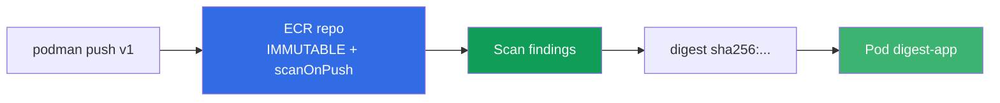
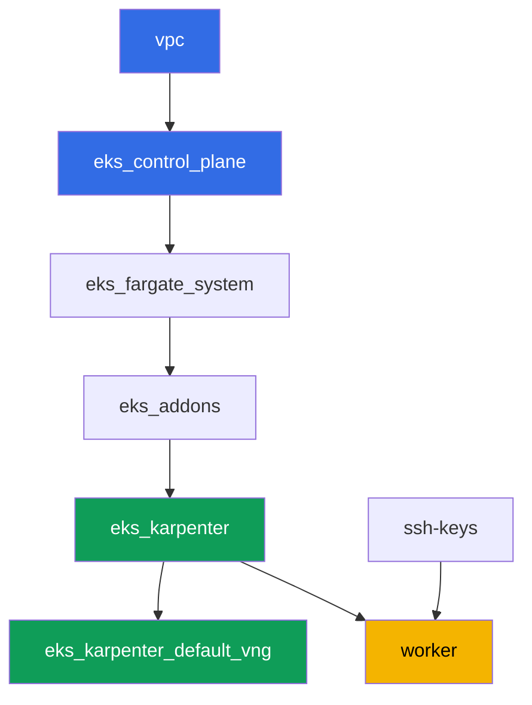

[Русская версия](README_RU.MD) · [Eng version](README.MD) · [Versión en español](README_ES.MD) · [Version française](README_FR.MD) · [ქართული ვერსია](README_GE.MD) · [繁體中文版](README_TW.MD) · [日本語版](README_JP.MD)

# Lab 130 - ECR und supply chain: unveränderliche Tags, Scan beim Push, pull through cache

## Beschreibung

Der Cluster führt aus, was im Registry liegt - die Frage ist, ob man diesem Image
vertrauen kann. In dieser Lab arbeiten Sie mit Amazon ECR wie mit einem Registry auf
Produktionsniveau: Sie legen ein Repository mit unveränderlichen Tags an, prüfen das
Image beim Push mit einem Scanner, deployen einen Pod per digest (und nicht per Tag,
der überschrieben werden kann) und richten pull through cache für zwei Upstreams ein -
ohne Authentifizierung (`registry.k8s.io`) und mit Secret (`Docker Hub`).

Die Aufgaben sind im Produktionsstil: kurze Aufgabenstellung plus Abnahmekriterien. Die
Prüfung erfolgt automatisch über den Befehl `check_result`.

## Ziel

Vertiefung des Kurskapitels:

- [Kapitel 20. Images und supply chain: ECR, Scanning, Signaturen, pull through cache](../../course/20/de.md) - woher das Image kommt und wer es geprüft hat

## Was wir erstellen

Der Cluster ist bereits als Code bereitgestellt (dieselbe Basis wie in Lab 101). Für
diese Lab sind keine speziellen Terraform-Komponenten nötig: Alle Aktionen mit ECR und
Secrets Manager führen Sie über die AWS CLI auf der Worker-Maschine aus, die über die
IAM-Rolle der Instanz bereits die nötigen Rechte hat.

| Objekt | Was ist das | Wozu in dieser Lab |
|--------|--------------|---------------------|
| Repository `eks-lab130/app` | privates ECR, IMMUTABLE, scanOnPush | Basis für Tags, Scan und Lifecycle |
| Image `:v1` | umgetaggtes öffentliches Image | bestätigt Push und die Funktion von IMMUTABLE |
| Artefakt `denied.txt` | Fehler beim erneuten Push des Tags `v1` | zeigt, wie IMMUTABLE den Tag schützt |
| Artefakt `scan-summary.txt` | Findings des Scanners nach severity | Prüfung des Images vor der Nutzung |
| Pod `digest-app` | verweist auf das Image per `@sha256:` | Deploy per digest statt per überschreibbarem Tag |
| Cache rule `k8s-cache` | pull through cache für `registry.k8s.io` | Cache für einen Upstream ohne Anmeldedaten |
| Secret + cache rule `docker-hub` | pull through cache mit credential-arn | Upstream, der ein Secret braucht (Thema der Lab) |
| Lifecycle policy | Regel zur Aufbewahrung von Images | keine Ansammlung alter Tags im Repository |

Der Weg des Images vom Push bis zum laufenden Pod:



## Infrastruktur

Die Umgebung wird in AWS (`eu-central-1`) über Terragrunt bereitgestellt. Die Basis
stimmt mit Lab 101 überein: Für ECR sind keine speziellen Komponenten nötig, die Rechte
`ecr:*` und ein begrenzter Satz `secretsmanager:*` sind bereits in der IAM-Policy der
Worker-Maschine des Moduls `eks_v2_work_pc` enthalten, und die Node-Rolle von Karpenter
trägt die Managed Policy `AmazonEC2ContainerRegistryReadOnly` - sie wird vom Modul
`eks_v2_karpenter` vergeben, für den Pull aus dem privaten ECR ohne `imagePullSecrets`.

### Module und Abhängigkeiten

| Verzeichnis (Komponente) | Modul (`terraform/modules/`) | Abhängig von | Was wird erstellt |
|---------------------------|--------------------------------|----------------|----------------------|
| `vpc` | `vpc_v3` | - | VPC `10.10.0.0/16`, Subnetze in zwei AZs, NAT |
| `ssh-keys` | `ssh-keys` | - | SSH-Schlüsselpaar für Worker-Maschine und Nodes |
| `eks_control_plane` | `eks_v2_control_plane` | `vpc` | EKS-Control-Plane `1.36`, OIDC, Security Groups |
| `eks_fargate_system` | `eks_v2_fargate` | `vpc`, `eks_control_plane` | Fargate-Profil für `kube-system` und `karpenter` |
| `eks_addons` | `eks_v2_addons` | `eks_control_plane`, `eks_fargate_system` | Addons coredns, kube-proxy, vpc-cni, pod-identity |
| `eks_karpenter` | `eks_v2_karpenter` | `vpc`, `eks_control_plane`, `eks_addons`, `eks_fargate_system` | Karpenter-Controller, IAM-Node-Rolle mit `AmazonEC2ContainerRegistryReadOnly` |
| `eks_karpenter_default_vng` | `eks_v2_karpenter_vng` | `vpc`, `eks_control_plane`, `eks_karpenter` | Standard-NodePool `default` auf AL2023 |
| `worker` | `eks_v2_work_pc` | `ssh-keys`, `vpc`, `eks_control_plane`, `eks_karpenter` | Worker-Maschine: kubectl, `podman`, Rechte `ecr:*` und `secretsmanager:*` |

Abhängigkeitsgraph (was früher angewendet wird, steht weiter unten am Pfeil):



Alle ECR-Repositories, Secrets Manager-Secrets und cache rules erstellen Sie selbst auf
der Worker-Maschine über die AWS CLI - für diese Lab ist keine zusätzliche
Terraform-Komponente nötig, die Rechte gibt bereits die IAM-Policy des Workers.

### Wo was konfiguriert wird

`env.hcl` (allgemeine Umgebungsparameter):

| Parameter | Wert in dieser Lab | Auswirkung |
|-----------|----------------------|--------------|
| `region` | `eu-central-1` | Region aller Ressourcen, einschließlich ECR und Secrets Manager |
| `prefix` | `eks-task130` | Präfix der Ressourcennamen und Tags |
| `stack_name` | `eks130` | daraus wird `env_name` gebildet - der Name des Clusters |
| `k8_version` | `1.36.0` | Version von kubectl auf der Worker-Maschine |
| `instance_type_worker` | `t3.medium` | Instanztyp der Worker-Maschine |
| `ssh_password_enable`, `access_cidrs` | `true`, `0.0.0.0/0` | SSH-Zugriff auf die Worker-Maschine |

`inputs` in der `terragrunt.hcl` jeder Komponente:

| Datei | Wichtige Einstellungen |
|-------|---------------------------|
| `eks_control_plane/terragrunt.hcl` | `eks.version = "1.36"` |
| `eks_addons/terragrunt.hcl` | Addon-Versionen für 1.36 |
| `eks_karpenter/terragrunt.hcl` | IAM-Node-Rolle mit `AmazonEC2ContainerRegistryReadOnly` für Pull aus ECR |
| `worker/terragrunt.hcl` | `test_url` und `task_script_url` für die Dateien von Lab 130 |

## Bereitstellung

```bash
TASK=130 make run_eks_task
```

Die Bereitstellung dauert etwa 15-20 Minuten. Suchen Sie in der Ausgabe die Zeile mit der
SSH-Verbindung zur Worker-Maschine und verbinden Sie sich damit. kubectl ist dort bereits
auf den richtigen Cluster konfiguriert, die `aws` CLI funktioniert ohne expliziten Login -
über die IAM-Rolle der Instanz. Auf der Worker-Maschine ist bereits `podman` installiert,
verwenden Sie es statt `docker`.

> Erledigen Sie die Aufgaben 2-6 in derselben SSH-Sitzung. `podman login` legt das Token
> unter `$XDG_RUNTIME_DIR/containers/auth.json` ab, und dieses Verzeichnis existiert nur
> für die Dauer der Benutzersitzung: nach Abmelden und erneutem Anmelden antworten push
> und pull mit `unauthorized: authentication required`, obwohl das 12-Stunden-Token von
> ECR noch gültig ist. Behoben wird das durch ein erneutes
> `aws ecr get-login-password ... | podman login ...`.

Nützliche Befehle auf der Worker-Maschine:

```bash
time_left       # wie viel Zeit der Umgebung noch bleibt
check_result    # Lösung prüfen
```

> Sicherheit der Umgebung. In `env.hcl` sind `ssh_password_enable = true` und
> `access_cidrs = ["0.0.0.0/0"]` aktiviert - das ist praktisch für eine Lernumgebung, aber
> so sollte man es im Produktionsbetrieb nicht machen. Nach den Standards des Kurses
> (Kapitel 0.2, 2, 19) öffnet man den Zugriff auf Worker-Maschinen über den AWS SSM Session
> Manager ohne öffentliche SSH-Ports nach außen, und `access_cidrs` schränkt man auf
> konkrete Adressen ein. Hier bleibt öffentliches SSH nur der Einfachheit halber erhalten.

## Aufgaben

---
|        **1**        | **Repository mit unveränderlichen Tags und Scan beim Push** |
| :-----------------: | :---------------------------------------------------------- |
| Was wir tun         | Erstellen Sie ein privates ECR-Repository `eks-lab130/app` mit `image-tag-mutability IMMUTABLE` und `image-scanning-configuration scanOnPush=true`. |
| Abnahmekriterien    | - Repository `eks-lab130/app` existiert;<br/>- `imageTagMutability = IMMUTABLE`;<br/>- `imageScanningConfiguration.scanOnPush = true`. |
---
|        **2**        | **Push eines Images mit Tag v1**                             |
| :-----------------: | :---------------------------------------------------------- |
| Was wir tun         | Melden Sie sich über `aws ecr get-login-password` und `podman login` in der Registry an. Nehmen Sie das Image `alpine:3.19`, taggen Sie es um und pushen Sie es nach `eks-lab130/app` mit dem Tag `v1`. Prüfen Sie über `aws ecr describe-images`, dass der Push funktioniert hat. Das Image ist nicht zufällig gewählt: Das Basic Scanning von ECR kann die Paketbasis von Alpine auswerten, daher liefert Aufgabe 4 echte Findings. |
| Abnahmekriterien    | - in `eks-lab130/app` gibt es ein Image mit dem Tag `v1`. |
---
|        **3**        | **Symptom: IMMUTABLE lehnt den erneuten Push des Tags v1 ab** |
| :-----------------: | :---------------------------------------------------------- |
| Was wir tun         | Nehmen Sie ein anderes Image (`busybox:1.36`), taggen Sie es mit demselben Tag `v1` um und versuchen Sie, es nach `eks-lab130/app` zu pushen. Der Push muss abgelehnt werden, da der Tag `v1` schon belegt ist und das Repository IMMUTABLE ist. Speichern Sie die Ausgabe des push-Befehls (stdout und stderr) in der Datei `/var/work/tests/artifacts/3/denied.txt`. Die Ausgabe wird lang sein: podman probiert mehrere Manifest-Formate durch und erhält bei jedem eine Ablehnung - die gesuchte Zeile steht in jedem Versuch. |
| Abnahmekriterien    | - Datei `denied.txt` ist nicht leer;<br/>- enthält `v1` und einen Hinweis auf immutable/already exists (zum Beispiel `ImageTagAlreadyExistsException`). |
---
|        **4**        | **Findings des Scans**                                       |
| :-----------------: | :---------------------------------------------------------- |
| Was wir tun         | Warten Sie ab, bis das Scannen des Images `v1` abgeschlossen ist (Status `COMPLETE`, über `aws ecr wait image-scan-complete` oder eine manuelle Retry-Schleife). Speichern Sie die Zusammenfassung von `aws ecr describe-image-scan-findings` (Status und Anzahl der Findings nach severity) in der Datei `/var/work/tests/artifacts/4/scan-summary.txt`. Merken Sie sich die Grenze der Anwendbarkeit: Das Basic Scanning liest die Paketbasis bekannter Distributionen, und ein Image, das mit `FROM scratch` oder distroless gebaut wurde, ergibt den Status `FAILED` mit der Beschreibung `UnsupportedImageError: The operating system and/or package manager are not supported.` - das heißt, „der Scan hat keine Schwachstellen gefunden“ und „der Scan konnte nicht hinsehen“ sehen in Berichten unterschiedlich aus, und das muss man unterscheiden. |
| Abnahmekriterien    | - Datei `scan-summary.txt` ist nicht leer;<br/>- der Scan-Status des Images `v1` ist `COMPLETE`;<br/>- in der Zusammenfassung ist die Verteilung der Findings nach severity sichtbar. |
---
|        **5**        | **Deploy per digest statt per Tag**                           |
| :-----------------: | :---------------------------------------------------------- |
| Was wir tun         | Ermitteln Sie den digest des Images `v1` (`aws ecr describe-images --image-ids imageTag=v1`). Erstellen Sie im namespace `eks-130` einen Pod mit dem label `app=digest-app`, bei dem `image` als `<Registry>/eks-lab130/app@sha256:...` angegeben ist (per digest, nicht per Tag), mit dem Befehl `["sh", "-c", "sleep 86400"]` und `nodeSelector: kubernetes.io/arch: amd64`. Der Selector ist verpflichtend, und das ist eine eigene Lektion: `podman` auf der Worker-Maschine (x86_64) pusht ein EINZELARCHITEKTUR-Manifest, während der NodePool der Lab auch `arm64` erlaubt, sodass der Pod ohne Selector auf einem `t4g` landen und mit `CrashLoopBackOff` und `exitCode 255` ohne eine einzige Zeile im Log abstürzen kann. Die Node-Rolle von Karpenter trägt bereits `AmazonEC2ContainerRegistryReadOnly`, daher läuft der Pull aus dem privaten ECR ohne `imagePullSecrets`. |
| Abnahmekriterien    | - Pod mit label `app=digest-app` in `eks-130` im Zustand `Running` ohne Neustarts;<br/>- sein Image ist über `eks-lab130/app@sha256:` angegeben. |
---
|        **6**        | **pull through cache ohne Authentifizierung: registry.k8s.io** |
| :-----------------: | :---------------------------------------------------------- |
| Was wir tun         | Erstellen Sie eine pull through cache rule mit dem Präfix `k8s-cache` und dem Upstream `registry.k8s.io`. Beim Anlegen der ERSTEN Regel im ECR-Konto legt ECR die service-linked role `AWSServiceRoleForECRPullThroughCache` an, daher braucht der Aufrufer das Recht `iam:CreateServiceLinkedRole` (die Worker-Maschine hat es; ohne dieses Recht lautet die Antwort `ValidationException ... The Amazon ECR action failed due to an IAM exception`). Ziehen Sie über den Cache das Image `pause`: `podman pull <Registry>/k8s-cache/pause:3.9`. Bestätigen Sie, dass in ECR das gecachte Repository `k8s-cache/pause` erschienen ist. |
| Abnahmekriterien    | - cache rule mit dem Präfix `k8s-cache` und dem Upstream `registry.k8s.io` existiert;<br/>- in ECR gibt es ein Repository, das mit `k8s-cache/pause` beginnt. |
---
|        **7**        | **pull through cache mit Secret: Docker Hub**                 |
| :-----------------: | :---------------------------------------------------------- |
| Was wir tun         | Erstellen Sie ein Secrets Manager-Secret mit dem Namen `ecr-pullthroughcache/dockerhub-creds` (JSON mit den Feldern `username` und `accessToken`, die Werte sind Platzhalter, echte Docker Hub-Credentials werden nicht benötigt). Erstellen Sie eine pull through cache rule mit dem Präfix `docker-hub`, dem Upstream `registry-1.docker.io` und `--credential-arn` dieses Secrets. Ein echter Pull ist nicht nötig: Die Aufgabe prüft die Konfiguration (Secret und Regel existieren und sind verknüpft), nicht die Tatsache eines erfolgreichen Pulls. |
| Abnahmekriterien    | - Secret `ecr-pullthroughcache/dockerhub-creds` existiert;<br/>- cache rule mit dem Präfix `docker-hub` existiert und ihr `credentialArn` zeigt auf dieses Secret. |
---
|        **8**        | **Lifecycle policy auf dem Repository**                       |
| :-----------------: | :---------------------------------------------------------- |
| Was wir tun         | Richten Sie für `eks-lab130/app` eine lifecycle policy ein, zum Beispiel nicht mehr als `5` Images mit Tags `v*` aufbewahren. Prüfen Sie die Policy über `aws ecr get-lifecycle-policy` und schauen Sie sich die Vorschau über `aws ecr get-lifecycle-policy-preview` an. |
| Abnahmekriterien    | - `aws ecr get-lifecycle-policy` für `eks-lab130/app` liefert ein nicht leeres `lifecyclePolicyText` mit einer Regel (`rulePriority`). |
---

## Ergebnisprüfung

Führen Sie auf der Worker-Maschine die automatische Prüfung aus:

```bash
check_result
```

Das Skript führt die Tests aus und zeigt den Prozentsatz der erledigten Aufgaben.

## Lösung

Referenzlösung: [worker/files/solutions/1_DE.MD](worker/files/solutions/1_DE.MD)

## Löschen des Clusters und der Ressourcen

Entfernen Sie zuerst die Workload und warten Sie, bis die EC2-Node von Karpenter
verschwindet: Wenn Sie die Umgebung mit einer laufenden Node löschen, bleibt das
sekundäre ENI von VPC CNI im Zustand `available` und hält die security group der Nodes,
wodurch `destroy` daran hängen bleibt.

```bash
kubectl delete namespace eks-130 --ignore-not-found

while kubectl get nodes --no-headers 2>/dev/null | grep -qv fargate; do
  echo "EC2-Node von Karpenter ist noch aktiv, warten..."; sleep 15
done
```

```bash
TASK=130 make delete_eks_task
```

Die ECR- und Secrets Manager-Ressourcen, die manuell über die AWS CLI erstellt wurden
(Repository `eks-lab130/app`, cache rules, Secret `ecr-pullthroughcache/dockerhub-creds`),
gehören nicht zum Terraform-State, und `make delete_eks_task` löscht sie nicht. Entfernen
Sie sie separat, wenn Sie sie nicht im Konto belassen möchten:

```bash
aws ecr delete-repository --repository-name eks-lab130/app --force --region eu-central-1
aws ecr delete-repository --repository-name k8s-cache/pause --force --region eu-central-1
aws ecr delete-pull-through-cache-rule --ecr-repository-prefix k8s-cache --region eu-central-1
aws ecr delete-pull-through-cache-rule --ecr-repository-prefix docker-hub --region eu-central-1
aws secretsmanager delete-secret \
  --secret-id ecr-pullthroughcache/dockerhub-creds --force-delete-without-recovery \
  --region eu-central-1
```
