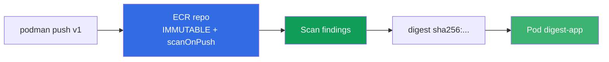
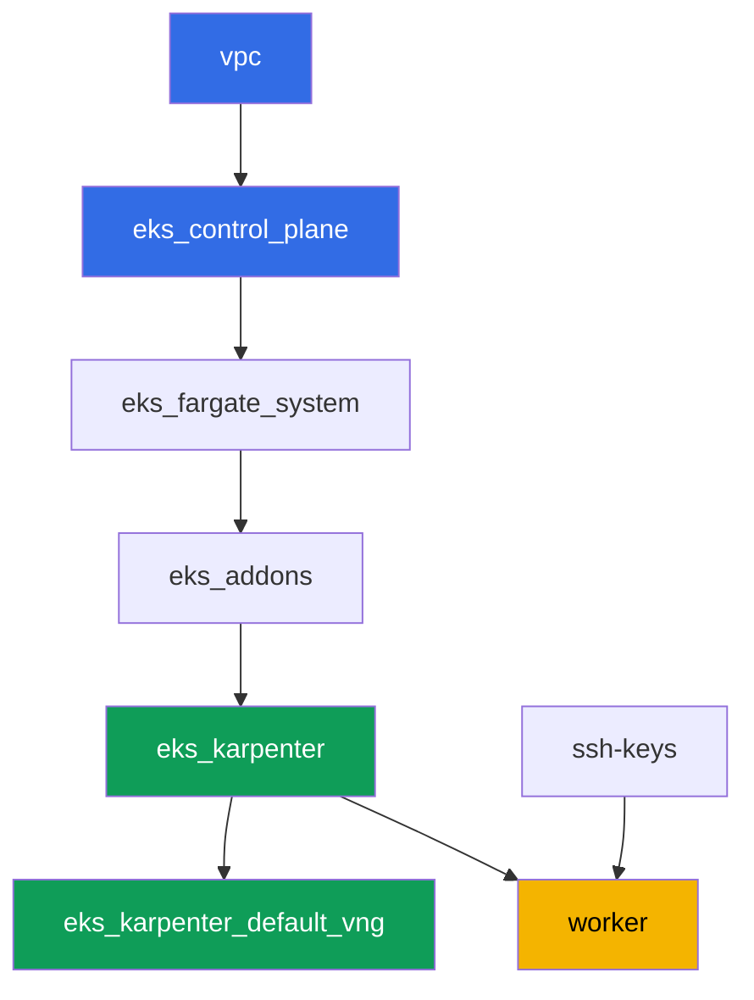

[Русская версия](README_RU.MD) · [Eng version](README.MD) · [Version française](README_FR.MD) · [Deutsche Version](README_DE.MD) · [ქართული ვერსია](README_GE.MD) · [繁體中文版](README_TW.MD) · [日本語版](README_JP.MD)

# Laboratorio 130 - ECR y supply chain: tags inmutables, escaneo al push, pull through cache

## Descripción

El clúster ejecuta lo que hay en el registro - la pregunta es si se puede confiar en esa
imagen. En este laboratorio trabajas con Amazon ECR como un registro de nivel producción:
creas un repositorio con tags inmutables, verificas la imagen con el escáner al hacer push,
despliegas un pod por digest (y no por un tag que se puede reescribir) y configuras un pull
through cache para dos upstreams - uno sin autenticación (`registry.k8s.io`) y otro con
secreto (`Docker Hub`).

Las tareas tienen estilo de producción: un planteamiento breve más criterios de aceptación.
La verificación es automática, con el comando `check_result`.

## Objetivo

Consolidar el material del capítulo del curso:

- [Capítulo 20. Imágenes y supply chain: ECR, escaneo, firmas, pull through cache](../../course/20/ru.md) - de dónde viene la imagen, quién la verificó

## Qué creamos

El clúster ya está desplegado como código (la misma base que el laboratorio 101). Este
laboratorio no requiere componentes terraform especiales: todas las acciones con ECR y
Secrets Manager las realizas desde la máquina de trabajo mediante AWS CLI, que ya tiene los
permisos necesarios a través del rol IAM de la instancia.

| Objeto | Qué es | Para qué sirve en este laboratorio |
|--------|---------|-------------------|
| Repositorio `eks-lab130/app` | ECR privado, IMMUTABLE, scanOnPush | base para tags, escaneo y lifecycle |
| Imagen `:v1` | imagen pública retageada | confirmamos el push y el funcionamiento de IMMUTABLE |
| Artefacto `denied.txt` | error al repetir el push del tag `v1` | vemos cómo IMMUTABLE protege el tag |
| Artefacto `scan-summary.txt` | findings del escáner por severity | verificación de la imagen antes de usarla |
| Pod `digest-app` | referencia la imagen por `@sha256:` | despliegue por digest, no por un tag reescribible |
| Cache rule `k8s-cache` | pull through cache para `registry.k8s.io` | caché de un upstream sin credenciales |
| Secreto + cache rule `docker-hub` | pull through cache con credential-arn | upstream que requiere secreto (tema del laboratorio) |
| Lifecycle policy | regla de retención de imágenes | no acumular tags viejos en el repositorio |

Ruta de la imagen desde el push hasta el pod en ejecución:



## Infraestructura

El entorno se despliega en AWS (`eu-central-1`) mediante Terragrunt. La base coincide con el
laboratorio 101: no se requieren componentes especiales para ECR, los permisos `ecr:*` y un
conjunto limitado de `secretsmanager:*` ya están incluidos en la política IAM de la máquina
de trabajo del módulo `eks_v2_work_pc`, y el rol del nodo de Karpenter lleva la managed
policy `AmazonEC2ContainerRegistryReadOnly` - la obtiene el módulo `eks_v2_karpenter` para
hacer pull desde ECR privado sin `imagePullSecrets`.

### Módulos y dependencias

| Directorio (componente) | Módulo (`terraform/modules/`) | Depende de | Qué crea |
|---------------------|-------------------------------|------------|-------------|
| `vpc` | `vpc_v3` | - | VPC `10.10.0.0/16`, subredes en dos AZ, NAT |
| `ssh-keys` | `ssh-keys` | - | par de claves SSH para la máquina de trabajo y los nodos |
| `eks_control_plane` | `eks_v2_control_plane` | `vpc` | control plane EKS `1.36`, OIDC, security groups |
| `eks_fargate_system` | `eks_v2_fargate` | `vpc`, `eks_control_plane` | perfil Fargate para `kube-system` y `karpenter` |
| `eks_addons` | `eks_v2_addons` | `eks_control_plane`, `eks_fargate_system` | addons coredns, kube-proxy, vpc-cni, pod-identity |
| `eks_karpenter` | `eks_v2_karpenter` | `vpc`, `eks_control_plane`, `eks_addons`, `eks_fargate_system` | controlador Karpenter, rol IAM de nodos con `AmazonEC2ContainerRegistryReadOnly` |
| `eks_karpenter_default_vng` | `eks_v2_karpenter_vng` | `vpc`, `eks_control_plane`, `eks_karpenter` | NodePool por defecto `default` en AL2023 |
| `worker` | `eks_v2_work_pc` | `ssh-keys`, `vpc`, `eks_control_plane`, `eks_karpenter` | máquina de trabajo: kubectl, `podman`, permisos `ecr:*` y `secretsmanager:*` |

Grafo de dependencias (lo que se aplica antes queda más abajo en la flecha):



Todos los repositorios ECR, secretos de Secrets Manager y cache rules los creas tú mismo en
la máquina de trabajo mediante AWS CLI - para este laboratorio no se necesita ningún
componente terraform adicional, los permisos ya los da la política IAM del worker.

### Dónde se configura cada cosa

`env.hcl` (parámetros generales del entorno):

| Parámetro | Valor en el laboratorio | Qué afecta |
|----------|-----------------|---------------|
| `region` | `eu-central-1` | región de todos los recursos, incluyendo ECR y Secrets Manager |
| `prefix` | `eks-task130` | prefijo de nombres de recursos y tags |
| `stack_name` | `eks130` | de aquí se forma `env_name` - el nombre del clúster |
| `k8_version` | `1.36.0` | versión de kubectl en la máquina de trabajo |
| `instance_type_worker` | `t3.medium` | tipo de instancia de la máquina de trabajo |
| `ssh_password_enable`, `access_cidrs` | `true`, `0.0.0.0/0` | acceso por SSH a la máquina de trabajo |

`inputs` en `terragrunt.hcl` de cada componente:

| Archivo | Configuraciones clave |
|------|--------------------|
| `eks_control_plane/terragrunt.hcl` | `eks.version = "1.36"` |
| `eks_addons/terragrunt.hcl` | versiones de addons para 1.36 |
| `eks_karpenter/terragrunt.hcl` | rol IAM del nodo con `AmazonEC2ContainerRegistryReadOnly` para pull desde ECR |
| `worker/terragrunt.hcl` | `test_url` y `task_script_url` con los archivos del laboratorio 130 |

## Despliegue

```bash
TASK=130 make run_eks_task
```

El despliegue toma aproximadamente 15-20 minutos. En la salida busca la línea con la
conexión SSH a la máquina de trabajo y conéctate a ella. kubectl ya está configurado para el
clúster correspondiente, la CLI de `aws` funciona sin login explícito - a través del rol IAM
de la instancia. En la máquina de trabajo ya está instalado `podman`, úsalo en lugar de
`docker`.

> Mantén las tareas 2-6 en una sola sesión SSH. `podman login` guarda el token en
> `$XDG_RUNTIME_DIR/containers/auth.json`, y ese directorio vive junto con la sesión del
> usuario: tras salir y volver a entrar, push y pull empezarán a responder
> `unauthorized: authentication required`, aunque el token de ECR de 12 horas siga vigente.
> Se resuelve repitiendo `aws ecr get-login-password ... | podman login ...`.

Comandos útiles en la máquina de trabajo:

```bash
time_left       # cuánto tiempo queda del entorno
check_result    # verificar la solución
```

> Seguridad del stand. En `env.hcl` están habilitados `ssh_password_enable = true` y
> `access_cidrs = ["0.0.0.0/0"]` - esto es cómodo para un entorno de aprendizaje, pero no se
> debe hacer en producción. Según los estándares del curso (capítulos 0.2, 2, 19) el acceso a
> las máquinas de trabajo se abre mediante AWS SSM Session Manager sin puertos SSH públicos
> hacia afuera, y `access_cidrs` se restringe a direcciones concretas. Aquí el SSH público se
> deja solo por simplicidad de lanzamiento.

## Tareas

---
|        **1**        | **Repositorio con tags inmutables y escaneo al push**    |
| :-----------------: | :---------------------------------------------------------- |
| Qué hacer          | Crea un repositorio privado ECR `eks-lab130/app` con `image-tag-mutability IMMUTABLE` y `image-scanning-configuration scanOnPush=true`. |
| Criterios de aceptación    | - el repositorio `eks-lab130/app` existe;<br/>- `imageTagMutability = IMMUTABLE`;<br/>- `imageScanningConfiguration.scanOnPush = true`. |
---
|        **2**        | **Push de la imagen con el tag v1**                                  |
| :-----------------: | :---------------------------------------------------------- |
| Qué hacer          | Inicia sesión en el registro con `aws ecr get-login-password` y `podman login`. Toma la imagen `alpine:3.19`, retaguéala y hazle push a `eks-lab130/app` con el tag `v1`. Verifica que el push se completó con `aws ecr describe-images`. La imagen no se eligió al azar: el escaneo básico de ECR sabe analizar la base de paquetes de Alpine, así que la tarea 4 obtendrá findings reales. |
| Criterios de aceptación    | - en `eks-lab130/app` hay una imagen con el tag `v1`. |
---
|        **3**        | **Síntoma: IMMUTABLE rechaza el push repetido del tag v1**     |
| :-----------------: | :---------------------------------------------------------- |
| Qué hacer          | Toma otra imagen (`busybox:1.36`), retaguéala con el mismo tag `v1` e intenta hacerle push a `eks-lab130/app`. El push debe ser rechazado, ya que el tag `v1` ya está ocupado y el repositorio es IMMUTABLE. Guarda la salida del comando push (stdout y stderr) en el archivo `/var/work/tests/artifacts/3/denied.txt`. La salida será larga: podman recorre varios formatos de manifiesto y en cada uno recibe un rechazo - la línea necesaria aparece en cada intento. |
| Criterios de aceptación    | - el archivo `denied.txt` no está vacío;<br/>- contiene `v1` y una mención de immutable/already exists (por ejemplo `ImageTagAlreadyExistsException`). |
---
|        **4**        | **Findings del escaneo**                                   |
| :-----------------: | :---------------------------------------------------------- |
| Qué hacer          | Espera a que termine el escaneo de la imagen `v1` (estado `COMPLETE`, con `aws ecr wait image-scan-complete` o un ciclo manual de reintentos). Guarda el resumen de `aws ecr describe-image-scan-findings` (estado y cantidad de findings por severity) en el archivo `/var/work/tests/artifacts/4/scan-summary.txt`. Recuerda el límite de aplicabilidad: el escaneo básico lee la base de paquetes de distribuciones conocidas, y una imagen construida con `FROM scratch` o distroless da el estado `FAILED` con la descripción `UnsupportedImageError: The operating system and/or package manager are not supported.` - es decir, «el escaneo no encontró vulnerabilidades» y «el escaneo no pudo revisar» se ven distinto en los reportes, y hay que diferenciarlos. |
| Criterios de aceptación    | - el archivo `scan-summary.txt` no está vacío;<br/>- el estado del escaneo de la imagen `v1` es `COMPLETE`;<br/>- en el resumen se ve la distribución de findings por severity. |
---
|        **5**        | **Despliegue por digest, no por tag**                           |
| :-----------------: | :---------------------------------------------------------- |
| Qué hacer          | Obtén el digest de la imagen `v1` (`aws ecr describe-images --image-ids imageTag=v1`). En el namespace `eks-130` crea un Pod con la label `app=digest-app`, cuyo `image` esté indicado como `<registro>/eks-lab130/app@sha256:...` (por digest, no por tag), el comando `["sh", "-c", "sleep 86400"]` y `nodeSelector: kubernetes.io/arch: amd64`. El selector es obligatorio, y es una lección aparte: `podman` en la máquina de trabajo (x86_64) hace push de un manifiesto DE UNA SOLA ARQUITECTURA, y el NodePool del laboratorio permite también `arm64`, así que sin el selector el pod puede caer en un `t4g` y quedar en `CrashLoopBackOff` con `exitCode 255` sin una sola línea en los logs. El rol del nodo de Karpenter ya lleva `AmazonEC2ContainerRegistryReadOnly`, así que el pull desde ECR privado funciona sin `imagePullSecrets`. |
| Criterios de aceptación    | - el pod con la label `app=digest-app` en `eks-130` está en estado `Running` sin reinicios;<br/>- su imagen está indicada mediante `eks-lab130/app@sha256:`. |
---
|        **6**        | **Pull through cache sin autenticación: registry.k8s.io**  |
| :-----------------: | :---------------------------------------------------------- |
| Qué hacer          | Crea una pull through cache rule con el prefijo `k8s-cache` y el upstream `registry.k8s.io`. Al crear la PRIMERA regla en la cuenta, ECR configura el service-linked role `AWSServiceRoleForECRPullThroughCache`, por lo que quien llama necesita el permiso `iam:CreateServiceLinkedRole` (la máquina de trabajo lo tiene; sin él la respuesta es `ValidationException ... The Amazon ECR action failed due to an IAM exception`). Descarga a través de la caché la imagen `pause`: `podman pull <registro>/k8s-cache/pause:3.9`. Confirma que en ECR apareció el repositorio en caché `k8s-cache/pause`. |
| Criterios de aceptación    | - existe una cache rule con el prefijo `k8s-cache` y el upstream `registry.k8s.io`;<br/>- en ECR hay un repositorio que empieza con `k8s-cache/pause`. |
---
|        **7**        | **Pull through cache con secreto: Docker Hub**                |
| :-----------------: | :---------------------------------------------------------- |
| Qué hacer          | Crea un secreto de Secrets Manager con el nombre `ecr-pullthroughcache/dockerhub-creds` (JSON con los campos `username` y `accessToken`, con valores de relleno, no se necesitan credenciales reales de Docker Hub). Crea una pull through cache rule con el prefijo `docker-hub`, el upstream `registry-1.docker.io` y `--credential-arn` de este secreto. No es necesario hacer un pull real: la tarea verifica la configuración (que el secreto y la regla existan y estén vinculados), no el hecho de un pull exitoso. |
| Criterios de aceptación    | - el secreto `ecr-pullthroughcache/dockerhub-creds` existe;<br/>- existe una cache rule con el prefijo `docker-hub` y su `credentialArn` apunta a este secreto. |
---
|        **8**        | **Lifecycle policy en el repositorio**                          |
| :-----------------: | :---------------------------------------------------------- |
| Qué hacer          | Configura en `eks-lab130/app` una lifecycle policy, por ejemplo mantener no más de `5` imágenes con tags `v*`. Verifica la política con `aws ecr get-lifecycle-policy` y revisa la vista previa con `aws ecr get-lifecycle-policy-preview`. |
| Criterios de aceptación    | - `aws ecr get-lifecycle-policy` para `eks-lab130/app` devuelve un `lifecyclePolicyText` no vacío con una regla (`rulePriority`). |
---

## Verificación del resultado

En la máquina de trabajo ejecuta la verificación automática:

```bash
check_result
```

El script ejecutará las pruebas y mostrará el porcentaje de tareas completadas.

## Solución

Solución de referencia: [worker/files/solutions/1_ES.MD](worker/files/solutions/1_ES.MD)

## Eliminación del clúster y los recursos

Primero retira la carga y espera a que el nodo EC2 de Karpenter se vaya: si eliminas el
stand con un nodo activo, el ENI secundario de VPC CNI queda en estado `available` y
mantiene el security group de los nodos, por lo que `destroy` se queda colgado en él.

```bash
kubectl delete namespace eks-130 --ignore-not-found

while kubectl get nodes --no-headers 2>/dev/null | grep -qv fargate; do
  echo "El nodo EC2 de Karpenter aún está activo, esperamos..."; sleep 15
done
```

```bash
TASK=130 make delete_eks_task
```

Los recursos de ECR y Secrets Manager creados manualmente mediante AWS CLI (el repositorio
`eks-lab130/app`, las cache rules, el secreto `ecr-pullthroughcache/dockerhub-creds`) no
forman parte del estado de Terraform y `make delete_eks_task` no los elimina. Bórralos por
separado si no quieres dejarlos en la cuenta:

```bash
aws ecr delete-repository --repository-name eks-lab130/app --force --region eu-central-1
aws ecr delete-repository --repository-name k8s-cache/pause --force --region eu-central-1
aws ecr delete-pull-through-cache-rule --ecr-repository-prefix k8s-cache --region eu-central-1
aws ecr delete-pull-through-cache-rule --ecr-repository-prefix docker-hub --region eu-central-1
aws secretsmanager delete-secret \
  --secret-id ecr-pullthroughcache/dockerhub-creds --force-delete-without-recovery \
  --region eu-central-1
```
