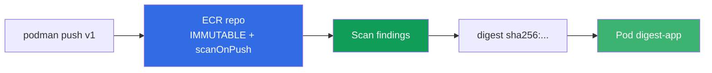
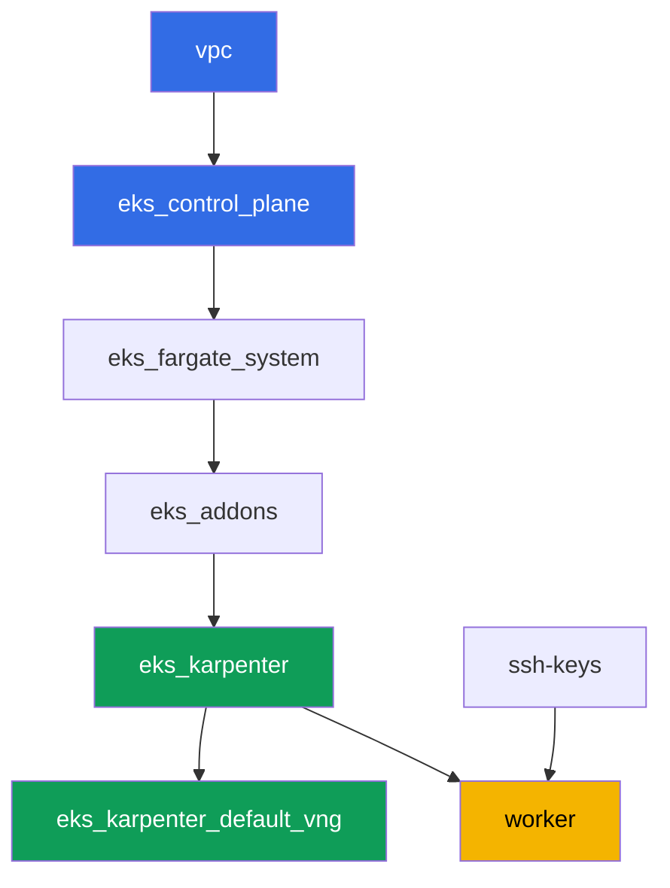

[Русская версия](README_RU.MD) · [Eng version](README.MD) · [Versión en español](README_ES.MD) · [Deutsche Version](README_DE.MD) · [ქართული ვერსია](README_GE.MD) · [繁體中文版](README_TW.MD) · [日本語版](README_JP.MD)

# Laba 130 - ECR et supply chain : tags immuables, scan au push, pull through cache

## Description

Le cluster exécute ce qui se trouve dans le registre - la question est de savoir si on
peut faire confiance à cette image. Dans cette laba, vous travaillez avec Amazon ECR comme
avec un registre de niveau production : vous créez un repository avec des tags immuables,
vous vérifiez l'image avec un scanner au push, vous déployez un pod par digest (et non par
un tag qui peut être réécrit) et vous configurez un pull through cache pour deux upstreams -
sans authentification (`registry.k8s.io`) et avec un secret (`Docker Hub`).

Les tâches sont dans un style production : un énoncé court plus des critères d'acceptation.
La vérification est automatique, via la commande `check_result`.

## Objectif

Consolider la matière du chapitre du cours :

- [Chapitre 20. Images et supply chain : ECR, scan, signatures, pull through cache](../../course/20/ru.md) - d'où vient une image, qui l'a vérifiée

## Ce que nous créons

Le cluster est déjà déployé en code (la même base que dans la laba 101). Cette laba n'a
besoin d'aucun composant terraform particulier : toutes les actions sur ECR et Secrets
Manager se font via l'AWS CLI depuis la machine de travail, qui dispose déjà des droits
nécessaires via le rôle IAM de l'instance.

| Objet | Ce que c'est | Pourquoi dans cette laba |
|--------|---------|-------------------|
| Repository `eks-lab130/app` | ECR privé, IMMUTABLE, scanOnPush | base pour les tags, le scan et le lifecycle |
| Image `:v1` | image publique retaguée | on confirme le push et le fonctionnement d'IMMUTABLE |
| Artefact `denied.txt` | erreur de push répété du tag `v1` | on voit comment IMMUTABLE protège le tag |
| Artefact `scan-summary.txt` | findings du scanner par severity | vérification de l'image avant utilisation |
| Pod `digest-app` | référence l'image par `@sha256:` | déploiement par digest, pas par un tag réécriptible |
| Cache rule `k8s-cache` | pull through cache pour `registry.k8s.io` | cache d'un upstream sans identifiants |
| Secret + cache rule `docker-hub` | pull through cache avec credential-arn | upstream nécessitant un secret (thème de la laba) |
| Lifecycle policy | règle de rétention des images | ne pas accumuler d'anciens tags dans le repository |

Le chemin de l'image, du push jusqu'au pod lancé :



## Infrastructure

L'environnement est déployé sur AWS (`eu-central-1`) via Terragrunt. La base est identique
à la laba 101 : aucun composant particulier n'est nécessaire pour ECR, les droits `ecr:*` et
un ensemble limité de `secretsmanager:*` sont déjà inclus dans la politique IAM de la
machine de travail du module `eks_v2_work_pc`, et le rôle du node Karpenter porte la managed
policy `AmazonEC2ContainerRegistryReadOnly` - le module `eks_v2_karpenter` l'obtient pour le
pull depuis ECR privé sans `imagePullSecrets`.

### Modules et dépendances

| Répertoire (composant) | Module (`terraform/modules/`) | Dépend de | Ce qui est créé |
|---------------------|-------------------------------|------------|-------------|
| `vpc` | `vpc_v3` | - | VPC `10.10.0.0/16`, sous-réseaux dans deux AZ, NAT |
| `ssh-keys` | `ssh-keys` | - | paire de clés SSH pour la machine de travail et les nodes |
| `eks_control_plane` | `eks_v2_control_plane` | `vpc` | control plane EKS `1.36`, OIDC, security groups |
| `eks_fargate_system` | `eks_v2_fargate` | `vpc`, `eks_control_plane` | profil Fargate pour `kube-system` et `karpenter` |
| `eks_addons` | `eks_v2_addons` | `eks_control_plane`, `eks_fargate_system` | addons coredns, kube-proxy, vpc-cni, pod-identity |
| `eks_karpenter` | `eks_v2_karpenter` | `vpc`, `eks_control_plane`, `eks_addons`, `eks_fargate_system` | contrôleur Karpenter, rôle IAM des nodes avec `AmazonEC2ContainerRegistryReadOnly` |
| `eks_karpenter_default_vng` | `eks_v2_karpenter_vng` | `vpc`, `eks_control_plane`, `eks_karpenter` | NodePool par défaut `default` sur AL2023 |
| `worker` | `eks_v2_work_pc` | `ssh-keys`, `vpc`, `eks_control_plane`, `eks_karpenter` | machine de travail : kubectl, `podman`, droits `ecr:*` et `secretsmanager:*` |

Graphe de dépendances (ce qui est appliqué en premier est plus bas dans la flèche) :



Tous les repositories ECR, les secrets Secrets Manager et les cache rules, vous les créez
vous-même sur la machine de travail via l'AWS CLI - aucun composant terraform additionnel
n'est nécessaire pour cette laba, les droits sont déjà donnés par la politique IAM du worker.

### Où configurer quoi

`env.hcl` (paramètres communs de l'environnement) :

| Paramètre | Valeur dans la laba | Effet |
|----------|-----------------|---------------|
| `region` | `eu-central-1` | région de toutes les ressources, y compris ECR et Secrets Manager |
| `prefix` | `eks-task130` | préfixe des noms de ressources et des tags |
| `stack_name` | `eks130` | à partir duquel `env_name` est composé - le nom du cluster |
| `k8_version` | `1.36.0` | version de kubectl sur la machine de travail |
| `instance_type_worker` | `t3.medium` | type d'instance de la machine de travail |
| `ssh_password_enable`, `access_cidrs` | `true`, `0.0.0.0/0` | accès SSH à la machine de travail |

`inputs` dans le `terragrunt.hcl` de chaque composant :

| Fichier | Réglages clés |
|------|--------------------|
| `eks_control_plane/terragrunt.hcl` | `eks.version = "1.36"` |
| `eks_addons/terragrunt.hcl` | versions des addons pour 1.36 |
| `eks_karpenter/terragrunt.hcl` | rôle IAM du node avec `AmazonEC2ContainerRegistryReadOnly` pour le pull depuis ECR |
| `worker/terragrunt.hcl` | `test_url` et `task_script_url` vers les fichiers de la laba 130 |

## Déploiement

```bash
TASK=130 make run_eks_task
```

Le déploiement prend environ 15-20 minutes. Dans la sortie, trouvez la ligne de connexion
SSH vers la machine de travail et connectez-vous. kubectl y est déjà configuré sur le bon
cluster, l'AWS CLI fonctionne sans login explicite - via le rôle IAM de l'instance. `podman`
est déjà installé sur la machine de travail, utilisez-le à la place de `docker`.

> Gardez les tâches 2-6 dans une seule session SSH. `podman login` place le token dans
> `$XDG_RUNTIME_DIR/containers/auth.json`, et ce répertoire vit avec la session
> de l'utilisateur : après une déconnexion et une reconnexion, push et pull commenceront à
> répondre `unauthorized: authentication required`, alors que le token ECR de 12 heures est
> encore valide. Le remède est de refaire
> `aws ecr get-login-password ... | podman login ...`.

Commandes utiles sur la machine de travail :

```bash
time_left       # combien de temps il reste à l'environnement
check_result    # vérifier la solution
```

> Sécurité du stand. Dans `env.hcl`, `ssh_password_enable = true` et
> `access_cidrs = ["0.0.0.0/0"]` sont activés - c'est pratique pour un environnement
> pédagogique, mais il ne faut pas faire ainsi en production. Selon les standards du cours
> (chapitres 0.2, 2, 19), l'accès aux machines de travail passe par AWS SSM Session Manager
> sans ports SSH publics ouverts vers l'extérieur, et `access_cidrs` est restreint à des
> adresses précises. Ici, le SSH public n'est laissé que pour simplifier le démarrage.

## Tâches

---
|        **1**        | **Repository avec tags immuables et scan au push**    |
| :-----------------: | :---------------------------------------------------------- |
| Ce qu'on fait          | Créez un repository ECR privé `eks-lab130/app` avec `image-tag-mutability IMMUTABLE` et `image-scanning-configuration scanOnPush=true`. |
| Critères d'acceptation    | - le repository `eks-lab130/app` existe ;<br/>- `imageTagMutability = IMMUTABLE` ;<br/>- `imageScanningConfiguration.scanOnPush = true`. |
---
|        **2**        | **Push d'une image avec le tag v1**                                  |
| :-----------------: | :---------------------------------------------------------- |
| Ce qu'on fait          | Connectez-vous au registre via `aws ecr get-login-password` et `podman login`. Prenez l'image `alpine:3.19`, retaguez-la et poussez-la dans `eks-lab130/app` avec le tag `v1`. Vérifiez que le push a réussi via `aws ecr describe-images`. Cette image n'est pas choisie au hasard : le scan de base d'ECR sait analyser la base de paquets d'Alpine, donc la tâche 4 obtiendra de vraies findings. |
| Critères d'acceptation    | - il existe dans `eks-lab130/app` une image avec le tag `v1`. |
---
|        **3**        | **Symptôme : IMMUTABLE rejette un nouveau push du tag v1**     |
| :-----------------: | :---------------------------------------------------------- |
| Ce qu'on fait          | Prenez une autre image (`busybox:1.36`), retaguez-la avec le même tag `v1` et essayez de la pousser dans `eks-lab130/app`. Le push doit être rejeté, car le tag `v1` est déjà occupé et le repository est IMMUTABLE. Enregistrez la sortie de la commande push (stdout et stderr) dans le fichier `/var/work/tests/artifacts/3/denied.txt`. La sortie sera longue : podman essaie plusieurs formats de manifeste et reçoit un refus à chaque fois - la ligne recherchée est présente dans chaque tentative. |
| Critères d'acceptation    | - le fichier `denied.txt` n'est pas vide ;<br/>- il contient `v1` et une mention d'immutable/already exists (par exemple `ImageTagAlreadyExistsException`). |
---
|        **4**        | **Findings du scan**                                   |
| :-----------------: | :---------------------------------------------------------- |
| Ce qu'on fait          | Attendez la fin du scan de l'image `v1` (statut `COMPLETE`, via `aws ecr wait image-scan-complete` ou une boucle de retry manuelle). Enregistrez le résumé de `aws ecr describe-image-scan-findings` (statut et nombre de findings par severity) dans le fichier `/var/work/tests/artifacts/4/scan-summary.txt`. Retenez la limite d'applicabilité : le scan de base lit la base de paquets des distributions connues, et une image construite `FROM scratch` ou distroless donne un statut `FAILED` avec la description `UnsupportedImageError: The operating system and/or package manager are not supported.` - c'est-à-dire que « le scan n'a pas trouvé de vulnérabilités » et « le scan n'a pas pu regarder » apparaissent différemment dans les rapports, et il faut les distinguer. |
| Critères d'acceptation    | - le fichier `scan-summary.txt` n'est pas vide ;<br/>- le statut du scan de l'image `v1` est `COMPLETE` ;<br/>- le résumé montre la répartition des findings par severity. |
---
|        **5**        | **Déploiement par digest, et non par tag**                           |
| :-----------------: | :---------------------------------------------------------- |
| Ce qu'on fait          | Récupérez le digest de l'image `v1` (`aws ecr describe-images --image-ids imageTag=v1`). Dans le namespace `eks-130`, créez un Pod avec le label `app=digest-app`, dont `image` est indiqué comme `<registre>/eks-lab130/app@sha256:...` (par digest, et non par tag), la commande `["sh", "-c", "sleep 86400"]` et `nodeSelector: kubernetes.io/arch: amd64`. Le selector est obligatoire, et c'est une leçon à part : `podman` sur la machine de travail (x86_64) pousse un manifeste MONO-ARCHITECTURE, alors que le NodePool de la laba autorise aussi `arm64`, donc sans selector le pod peut atterrir sur un `t4g` et tomber en `CrashLoopBackOff` avec `exitCode 255` sans aucune ligne dans les logs. Le rôle du node Karpenter porte déjà `AmazonEC2ContainerRegistryReadOnly`, donc le pull depuis ECR privé passe sans `imagePullSecrets`. |
| Critères d'acceptation    | - le pod avec le label `app=digest-app` dans `eks-130` est à l'état `Running` sans redémarrage ;<br/>- son image est indiquée via `eks-lab130/app@sha256:`. |
---
|        **6**        | **Pull through cache sans authentification : registry.k8s.io**  |
| :-----------------: | :---------------------------------------------------------- |
| Ce qu'on fait          | Créez une pull through cache rule avec le préfixe `k8s-cache` et l'upstream `registry.k8s.io`. Lors de la création de la PREMIÈRE règle du compte, ECR crée le service-linked role `AWSServiceRoleForECRPullThroughCache`, donc l'appelant a besoin du droit `iam:CreateServiceLinkedRole` (la machine de travail l'a ; sans lui, la réponse est `ValidationException ... The Amazon ECR action failed due to an IAM exception`). Tirez via le cache l'image `pause` : `podman pull <registre>/k8s-cache/pause:3.9`. Confirmez qu'un repository mis en cache `k8s-cache/pause` est apparu dans ECR. |
| Critères d'acceptation    | - la cache rule avec le préfixe `k8s-cache` et l'upstream `registry.k8s.io` existe ;<br/>- ECR contient un repository commençant par `k8s-cache/pause`. |
---
|        **7**        | **Pull through cache avec un secret : Docker Hub**                |
| :-----------------: | :---------------------------------------------------------- |
| Ce qu'on fait          | Créez un secret Secrets Manager nommé `ecr-pullthroughcache/dockerhub-creds` (JSON avec les champs `username` et `accessToken`, valeurs factices, de vrais identifiants Docker Hub ne sont pas nécessaires). Créez une pull through cache rule avec le préfixe `docker-hub`, l'upstream `registry-1.docker.io` et le `--credential-arn` de ce secret. Il n'est pas nécessaire de faire un vrai pull : la tâche vérifie la configuration (le secret et la règle existent et sont liés), pas le fait d'un pull réussi. |
| Critères d'acceptation    | - le secret `ecr-pullthroughcache/dockerhub-creds` existe ;<br/>- la cache rule avec le préfixe `docker-hub` existe et son `credentialArn` pointe vers ce secret. |
---
|        **8**        | **Lifecycle policy sur le repository**                          |
| :-----------------: | :---------------------------------------------------------- |
| Ce qu'on fait          | Configurez sur `eks-lab130/app` une lifecycle policy, par exemple conserver au plus `5` images avec des tags `v*`. Vérifiez la politique via `aws ecr get-lifecycle-policy` et regardez l'aperçu via `aws ecr get-lifecycle-policy-preview`. |
| Critères d'acceptation    | - `aws ecr get-lifecycle-policy` pour `eks-lab130/app` renvoie un `lifecyclePolicyText` non vide avec une règle (`rulePriority`). |
---

## Vérification du résultat

Sur la machine de travail, lancez la vérification automatique :

```bash
check_result
```

Le script fera passer les tests et affichera le pourcentage de tâches accomplies.

## Solution

Solution de référence : [worker/files/solutions/1_FR.MD](worker/files/solutions/1_FR.MD)

## Suppression du cluster et des ressources

Retirez d'abord la charge et attendez que le node EC2 de Karpenter disparaisse : si vous
supprimez le stand avec un node vivant, l'ENI secondaire du VPC CNI reste à l'état
`available` et retient le security group des nodes, ce qui bloque le `destroy` sur celui-ci.

```bash
kubectl delete namespace eks-130 --ignore-not-found

while kubectl get nodes --no-headers 2>/dev/null | grep -qv fargate; do
  echo "Le node EC2 de Karpenter est encore vivant, on attend..."; sleep 15
done
```

```bash
TASK=130 make delete_eks_task
```

Les ressources ECR et Secrets Manager créées manuellement via l'AWS CLI (repository
`eks-lab130/app`, cache rules, secret `ecr-pullthroughcache/dockerhub-creds`) ne font pas
partie de l'état Terraform et `make delete_eks_task` ne les supprime pas. Retirez-les
séparément si vous ne voulez pas les laisser dans le compte :

```bash
aws ecr delete-repository --repository-name eks-lab130/app --force --region eu-central-1
aws ecr delete-repository --repository-name k8s-cache/pause --force --region eu-central-1
aws ecr delete-pull-through-cache-rule --ecr-repository-prefix k8s-cache --region eu-central-1
aws ecr delete-pull-through-cache-rule --ecr-repository-prefix docker-hub --region eu-central-1
aws secretsmanager delete-secret \
  --secret-id ecr-pullthroughcache/dockerhub-creds --force-delete-without-recovery \
  --region eu-central-1
```
