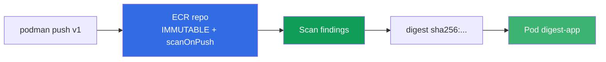
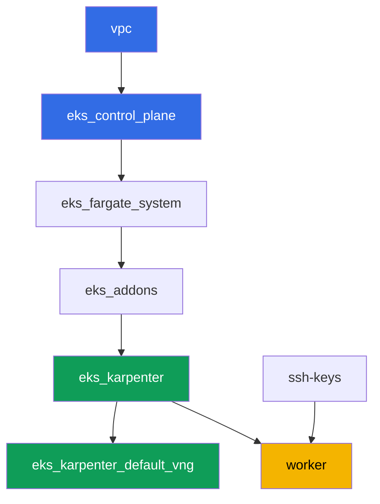

[Русская версия](README_RU.MD) · [Eng version](README.MD) · [Versión en español](README_ES.MD) · [Version française](README_FR.MD) · [Deutsche Version](README_DE.MD) · [繁體中文版](README_TW.MD) · [日本語版](README_JP.MD)

# ლაბა 130 - ECR და supply chain: უცვლელი ტეგები, სკანირება push-ისას, pull through cache

## აღწერა

კლასტერი აწარმოებს იმას, რაც რეესტრშია, - საკითხია, შესაძლებელია თუ არა ამ იმიჯის
ნდობა. ამ ლაბაში თქვენ მუშაობთ Amazon ECR-თან, როგორც პროდაქშენ დონის რეესტრთან:
ქმნით რეპოზიტორს უცვლელი ტეგებით, ამოწმებთ იმიჯს სკანერით push-ის დროს, deploy-
ავს ღრმას digest-ით (და არა ტეგით, რომელიც შესაძლებელია გადაწერო) და
ამზადებთ pull through cache-ს ორი upstream-ისთვის - ავთენტიფიკაციის გარეშე
(`registry.k8s.io`) და secret-ით (`Docker Hub`).

დავალებები პროდაქშენ სტილშია: მოკლე დასწავლა პლუს მიღების კრიტერიუმები. შემოწმება -
ავტომატური, ბრძანებით `check_result`.

## მიზანი

კურსის თავის მასალის გამტკიცება:

- [თავი 20. იმიჯები და supply chain: ECR, სკანირება, ხელმოწერები, pull through cache](../../course/20/ge.md) - საიდან მოდის იმიჯი, ვინ ამოწმა ის

## რას ვქმნით

კლასტერი უკვე გაშვებულია, როგორც კოდი (ის იგივე ბაზა, რაც ლაბა 101-ში). ლაბას
სპეციალური terraform-კომპონენტები არ ესაჭიროება: ECR-თან და Secrets Manager-თან
ყველა მოქმედება სამუშაო მანქანიდან AWS CLI-ის მეშვეობით სრულდება, რომელსაც
საჭირო უფლებები ინსტანსის IAM-როლის მეშვეობით უკვე გააჩნია.

| ობიექტი | რა არის ეს | რისთვისაა ამ ლაბაში |
|--------|---------|-------------------|
| რეპოზიტორი `eks-lab130/app` | პრივატული ECR, IMMUTABLE, scanOnPush | ბაზა ტეგებისთვის, სკანისთვის და lifecycle-ისთვის |
| იმიჯი `:v1` | ხელახლა ტეგირებული საჯარო იმიჯი | ვადასტურებთ push-ს და IMMUTABLE-ის მუშაობას |
| არტეფაქტი `denied.txt` | `v1` ტეგის ხელახალი push-ის შეცდომა | ვხედავთ, როგორ იცავს IMMUTABLE ტეგს |
| არტეფაქტი `scan-summary.txt` | სკანერის findings severity-ის მიხედვით | იმიჯის შემოწმება გამოყენებამდე |
| Pod `digest-app` | მიმართავს იმიჯს `@sha256:`-ით | deploy digest-ით და არა გადასაწერი ტეგით |
| Cache rule `k8s-cache` | pull through cache `registry.k8s.io`-სთვის | upstream-ის cache ავთენტიფიკაციის გარეშე |
| Secret + cache rule `docker-hub` | pull through cache credential-arn-ით | upstream, რომელსაც სჭირდება secret (ლაბის თემა) |
| Lifecycle policy | წესი იმიჯების შენახვისთვის | ძველი ტეგები რეპოზიტორიში არ ჩნდება |

იმიჯის გზა push-იდან გაშვებულ pod-მდე:



## ინფრასტრუქტურა

გარემო იშენდება AWS-ში (`eu-central-1`) Terragrunt-ის მეშვეობით. ბაზა ემთხვევა
ლაბა 101-ს: ECR-ისთვის სპეციალური კომპონენტები არ ესაჭიროება, `ecr:*` უფლებები
და შეზღუდული `secretsmanager:*` ნაკრები უკვე ჩართულია `eks_v2_work_pc` მოდულის
სამუშაო მანქანის IAM-პოლიტიკაში, ხოლო Karpenter-ის node-ის როლი ატარებს managed
policy `AmazonEC2ContainerRegistryReadOnly` - მას გასცემს `eks_v2_karpenter`
მოდული, პრივატული ECR-იდან pull-ისთვის `imagePullSecrets`-ის გარეშე.

### მოდულები და დამოკიდებულებები

| დირექტორია (კომპონენტი) | მოდული (`terraform/modules/`) | დამოკიდებული | რას ქმნის |
|---------------------|-------------------------------|------------|-------------|
| `vpc` | `vpc_v3` | - | VPC `10.10.0.0/16`, subnet-ები ორ AZ-ში, NAT |
| `ssh-keys` | `ssh-keys` | - | SSH-გასაღებების წყვილი სამუშაო მანქანისთვის და node-ებისთვის |
| `eks_control_plane` | `eks_v2_control_plane` | `vpc` | EKS control plane `1.36`, OIDC, security groups |
| `eks_fargate_system` | `eks_v2_fargate` | `vpc`, `eks_control_plane` | Fargate-პროფილი `kube-system`-ისთვის და `karpenter`-ისთვის |
| `eks_addons` | `eks_v2_addons` | `eks_control_plane`, `eks_fargate_system` | დანამატები coredns, kube-proxy, vpc-cni, pod-identity |
| `eks_karpenter` | `eks_v2_karpenter` | `vpc`, `eks_control_plane`, `eks_addons`, `eks_fargate_system` | Karpenter-კონტროლერი, node-ების IAM-როლი `AmazonEC2ContainerRegistryReadOnly`-ით |
| `eks_karpenter_default_vng` | `eks_v2_karpenter_vng` | `vpc`, `eks_control_plane`, `eks_karpenter` | დეფოლტ NodePool `default` AL2023-ზე |
| `worker` | `eks_v2_work_pc` | `ssh-keys`, `vpc`, `eks_control_plane`, `eks_karpenter` | სამუშაო მანქანა: kubectl, `podman`, უფლებები `ecr:*` და `secretsmanager:*` |

დამოკიდებულებების გრაფი (რაც უფრო ადრე გამოიყენება, ის ისრის ქვედა ნაწილშია):



ECR-ის ყველა რეპოზიტორს, Secrets Manager-ის secret-ებს და cache rule-ებს
თავად ქმნით სამუშაო მანქანაზე AWS CLI-ის მეშვეობით - ამ ლაბისთვის დამატებითი
terraform-კომპონენტი არ ესაჭიროება, უფლებებს უკვე გასცემს worker-ის IAM-პოლიტიკა.

### სად რა კონფიგურირდება

`env.hcl` (გარემოს ზოგადი პარამეტრები):

| პარამეტრი | მნიშვნელობა ამ ლაბაში | რაზე ახდენს ზეგავლენას |
|----------|-----------------|---------------|
| `region` | `eu-central-1` | ყველა რესურსის რეგიონი, ECR-ისა და Secrets Manager-ის ჩათვლით |
| `prefix` | `eks-task130` | რესურსების სახელების და ტეგების პრეფიქსი |
| `stack_name` | `eks130` | მისგან იწყობა `env_name` - კლასტერის სახელი |
| `k8_version` | `1.36.0` | kubectl-ის ვერსია სამუშაო მანქანაზე |
| `instance_type_worker` | `t3.medium` | სამუშაო მანქანის ინსტანსის ტიპი |
| `ssh_password_enable`, `access_cidrs` | `true`, `0.0.0.0/0` | SSH წვდომა სამუშაო მანქანასთან |

`inputs` თითოეული კომპონენტის `terragrunt.hcl`-ში:

| ფაილი | ძირითადი პარამეტრები |
|------|--------------------|
| `eks_control_plane/terragrunt.hcl` | `eks.version = "1.36"` |
| `eks_addons/terragrunt.hcl` | დანამატების ვერსიები 1.36-ისთვის |
| `eks_karpenter/terragrunt.hcl` | node-ის IAM-როლი `AmazonEC2ContainerRegistryReadOnly`-ით ECR-იდან pull-ისთვის |
| `worker/terragrunt.hcl` | `test_url` და `task_script_url` ლაბა 130-ის ფაილებზე |

## გაშვება

```bash
TASK=130 make run_eks_task
```

გაშვება დაახლოებით 15-20 წუთს გრძელდება. გამოტანილ ტექსტში მოძებნეთ სტრიქონი
SSH-შეერთებით სამუშაო მანქანასთან და დაუკავშირდით მას. kubectl უკვე
დაკონფიგურირებულია საჭირო კლასტერზე, `aws` CLI მუშაობს ცალსახა login-ის
გარეშე - ინსტანსის IAM-როლის მეშვეობით. სამუშაო მანქანაზე უკვე დაინსტალირებულია
`podman`, გამოიყენეთ ის `docker`-ის ნაცვლად.

> დავალებები 2-6 ერთ SSH-სესიაში შეასრულეთ. `podman login` ტოკენს ინახავს
> `$XDG_RUNTIME_DIR/containers/auth.json`-ში, ხოლო ეს დირექტორია არსებობს
> მომხმარებლის სესიასთან ერთად: გამოსვლისა და ხელახალი შესვლის შემდეგ push და
> pull დაიწყებენ პასუხის გაცემას `unauthorized: authentication required`,
> მიუხედავად იმისა, რომ ECR-ის 12-საათიანი ტოკენი ჯერ კიდევ ძალაშია.
> ეს გამოსწორდება ხელახალი `aws ecr get-login-password ... | podman login ...`-ით.

სასარგებლო ბრძანებები სამუშაო მანქანაზე:

```bash
time_left       # რამდენი დრო დარჩა გარემოს
check_result    # გამოსავლის შემოწმება
```

> სტენდის უსაფრთხოება. `env.hcl`-ში ჩართულია `ssh_password_enable = true` და
> `access_cidrs = ["0.0.0.0/0"]` - ეს მოსახერხებელია სასწავლო გარემოსთვის, მაგრამ
> ასე არ შეიძლება პროდაქშენში. კურსის სტანდარტების მიხედვით (თავები 0.2, 2, 19)
> სამუშაო მანქანებთან წვდომას AWS SSM Session Manager-ის მეშვეობით ხსნიან,
> საჯარო SSH-პორტების გარეშე გარედან, ხოლო `access_cidrs`-ს კონკრეტულ
> მისამართებზე ავიწროებენ. აქ საჯარო SSH მხოლოდ გაშვების სიმარტივის გამო დარჩა.

## დავალებები

---
|        **1**        | **რეპოზიტორი უცვლელი ტეგებით და სკანირებით push-ისას**    |
| :-----------------: | :---------------------------------------------------------- |
| რას ვაკეთებთ          | შექმენით პრივატული ECR რეპოზიტორი `eks-lab130/app` `image-tag-mutability IMMUTABLE`-ით და `image-scanning-configuration scanOnPush=true`-ით. |
| მიღების კრიტერიუმები    | - რეპოზიტორი `eks-lab130/app` არსებობს;<br/>- `imageTagMutability = IMMUTABLE`;<br/>- `imageScanningConfiguration.scanOnPush = true`. |
---
|        **2**        | **იმიჯის push ტეგით v1**                                  |
| :-----------------: | :---------------------------------------------------------- |
| რას ვაკეთებთ          | შედით რეესტრში `aws ecr get-login-password`-ისა და `podman login`-ის მეშვეობით. აიღეთ იმიჯი `alpine:3.19`, ხელახლა დაატეგირეთ და push გააკეთეთ `eks-lab130/app`-ში ტეგით `v1`. დარწმუნდით, რომ push-ი გავიდა `aws ecr describe-images`-ის მეშვეობით. იმიჯი შემთხვევით არ არის შერჩეული: ECR-ის საბაზისო სკანირებას შეუძლია Alpine-ის პაკეტების ბაზის დაშლა, ამიტომ დავალება 4 მიღებს ნამდვილ findings-ს. |
| მიღების კრიტერიუმები    | - `eks-lab130/app`-ში არსებობს იმიჯი ტეგით `v1`. |
---
|        **3**        | **სიმპტომი: IMMUTABLE უარყოფს v1 ტეგის ხელახალ push-ს**     |
| :-----------------: | :---------------------------------------------------------- |
| რას ვაკეთებთ          | აიღეთ სხვა იმიჯი (`busybox:1.36`), ხელახლა დაატეგირეთ იმავე ტეგით `v1` და სცადეთ push-ის გაკეთება `eks-lab130/app`-ში. push-ი უარყოფილი უნდა იყოს, რადგან ტეგი `v1` უკვე დაკავებულია და რეპოზიტორი IMMUTABLE-ია. შეინახეთ push ბრძანების გამოტანა (stdout და stderr) ფაილში `/var/work/tests/artifacts/3/denied.txt`. გამოტანა გრძელი იქნება: podman ცდის მანიფესტის ფორმატებს ერთმანეთის მიხედვით და ყოველ ჯერზე იღებს უარს - საჭირო სტრიქონი ყოველ ცდაშია. |
| მიღების კრიტერიუმები    | - ფაილი `denied.txt` ცარიელი არ არის;<br/>- შეიცავს `v1`-ს და immutable/already exists-ის ხსენებას (მაგალითად `ImageTagAlreadyExistsException`). |
---
|        **4**        | **სკანირების findings**                                   |
| :-----------------: | :---------------------------------------------------------- |
| რას ვაკეთებთ          | დაელოდეთ `v1` იმიჯის სკანირების დასრულებას (სტატუსი `COMPLETE`, `aws ecr wait image-scan-complete`-ის ან ხელით retry-ციკლის მეშვეობით). შეინახეთ `aws ecr describe-image-scan-findings`-ის შემაჯამებელი (სტატუსი და findings-ის რაოდენობა severity-ის მიხედვით) ფაილში `/var/work/tests/artifacts/4/scan-summary.txt`. დაიმახსოვრეთ გამოყენებადობის საზღვარი: საბაზისო სკანირება კითხულობს ცნობილი დისტრიბუციების პაკეტების ბაზას, ხოლო იმიჯი, რომელიც აწყობილია `FROM scratch`-ით ან distroless-ით, აძლევს სტატუსს `FAILED` აღწერით `UnsupportedImageError: The operating system and/or package manager are not supported.` - ესე იგი „სკანმა არ იპოვა მოწყვლადობები“ და „სკანს არ შესძლო დათვალვა“ ანგარიშებში სხვადასხვანაირად გამოიყურება და ეს უნდა გავარჩიოთ. |
| მიღების კრიტერიუმები    | - ფაილი `scan-summary.txt` ცარიელი არ არის;<br/>- `v1` იმიჯის სკანირების სტატუსი - `COMPLETE`;<br/>- შემაჯამებელში ჩანს findings-ის განაწილება severity-ის მიხედვით. |
---
|        **5**        | **Deploy digest-ით და არა ტეგით**                           |
| :-----------------: | :---------------------------------------------------------- |
| რას ვაკეთებთ          | მიიღეთ `v1` იმიჯის digest (`aws ecr describe-images --image-ids imageTag=v1`). namespace `eks-130`-ში შექმენით Pod label-ით `app=digest-app`, რომელშიც `image` მითითებულია როგორც `<რეესტრი>/eks-lab130/app@sha256:...` (digest-ით და არა ტეგით), ბრძანება `["sh", "-c", "sleep 86400"]` და `nodeSelector: kubernetes.io/arch: amd64`. სელექტორი სავალდებულოა და ეს ცალკე გაკვეთილია: `podman` სამუშაო მანქანაზე (x86_64) push-ავს ერთარქიტექტურულ მანიფესტს, ხოლო ლაბის NodePool უშვებს `arm64`-საც, ამიტომ სელექტორის გარეშე pod-ს შესაძლოა მოხდეს `t4g`-ზე მოხვედრა და `CrashLoopBackOff`-ში დაცემა `exitCode 255`-ით ლოგებში ერთი სტრიქონის გარეშეც. Karpenter-ის node-ის როლი უკვე ატარებს `AmazonEC2ContainerRegistryReadOnly`-ს, ამიტომ პრივატული ECR-იდან pull-ი გადის `imagePullSecrets`-ის გარეშე. |
| მიღების კრიტერიუმები    | - pod label-ით `app=digest-app` `eks-130`-ში მდგომარეობაში `Running` გადატვირთვების გარეშე;<br/>- მისი იმიჯი მითითებულია `eks-lab130/app@sha256:`-ის მეშვეობით. |
---
|        **6**        | **Pull through cache ავთენტიფიკაციის გარეშე: registry.k8s.io**  |
| :-----------------: | :---------------------------------------------------------- |
| რას ვაკეთებთ          | შექმენით pull through cache rule პრეფიქსით `k8s-cache` და upstream `registry.k8s.io`. ანგარიშში პირველი წესის შექმნისას ECR ამზადებს service-linked role `AWSServiceRoleForECRPullThroughCache`-ს, ამიტომ გამომძახებელს სჭირდება უფლება `iam:CreateServiceLinkedRole` (სამუშაო მანქანას ის გააჩნია; მის გარეშე პასუხია `ValidationException ... The Amazon ECR action failed due to an IAM exception`). გადმოიღეთ cache-ის მეშვეობით იმიჯი `pause`: `podman pull <რეესტრი>/k8s-cache/pause:3.9`. დაადასტურეთ, რომ ECR-ში გამოჩნდა cache-ირებული რეპოზიტორი `k8s-cache/pause`. |
| მიღების კრიტერიუმები    | - cache rule პრეფიქსით `k8s-cache` და upstream `registry.k8s.io` არსებობს;<br/>- ECR-ში არსებობს რეპოზიტორი, რომელიც იწყება `k8s-cache/pause`-ით. |
---
|        **7**        | **Pull through cache secret-ით: Docker Hub**                |
| :-----------------: | :---------------------------------------------------------- |
| რას ვაკეთებთ          | შექმენით Secrets Manager-ის secret სახელით `ecr-pullthroughcache/dockerhub-creds` (JSON ველებით `username` და `accessToken`, მნიშვნელობები - placeholder-ები, ნამდვილი Docker Hub credential-ები არ არის საჭირო). შექმენით pull through cache rule პრეფიქსით `docker-hub`, upstream `registry-1.docker.io`-ით და ამ secret-ის `--credential-arn`-ით. ნამდვილი pull არ არის საჭირო: დავალება ამოწმებს კონფიგურაციას (secret და rule არსებობს და დაკავშირებულია), არა წარმატებული pull-ის ფაქტს. |
| მიღების კრიტერიუმები    | - secret `ecr-pullthroughcache/dockerhub-creds` არსებობს;<br/>- cache rule პრეფიქსით `docker-hub` არსებობს და მისი `credentialArn` მიმართავს ამ secret-ს. |
---
|        **8**        | **Lifecycle policy რეპოზიტორზე**                          |
| :-----------------: | :---------------------------------------------------------- |
| რას ვაკეთებთ          | დააკონფიგურირეთ `eks-lab130/app`-ზე lifecycle policy, მაგალითად, არ შენახოთ `5`-ზე მეტი იმიჯი ტეგებით `v*`. შეამოწმეთ policy `aws ecr get-lifecycle-policy`-ის მეშვეობით და ნახეთ წინასწარი ხედი `aws ecr get-lifecycle-policy-preview`-ის მეშვეობით. |
| მიღების კრიტერიუმები    | - `aws ecr get-lifecycle-policy` `eks-lab130/app`-ისთვის აბრუნებს არაცარიელ `lifecyclePolicyText`-ს წესით (`rulePriority`). |
---

## შედეგის შემოწმება

სამუშაო მანქანაზე გაუშვით ავტომატური შემოწმება:

```bash
check_result
```

სკრიპტი გაუშვებს ტესტებს და გამოაჩენს შესრულებული დავალებების პროცენტს.

## გამოსავალი

ეტალონური გამოსავალი: [worker/files/solutions/1_GE.MD](worker/files/solutions/1_GE.MD)

## კლასტერის და რესურსების წაშლა

პირველად მოხსენით დატვირთვა და დაელოდეთ, სანამ Karpenter-ის EC2-node არ
გაქრება: თუ სტენდს წაშლით ცოცხალი node-ით, VPC CNI-ის მეორადი ENI რჩება
მდგომარეობაში `available` და ინახავს node-ების security group-ს, რის გამოც
`destroy` მასზე ჩამორჩება.

```bash
kubectl delete namespace eks-130 --ignore-not-found

while kubectl get nodes --no-headers 2>/dev/null | grep -qv fargate; do
  echo "Karpenter-ის EC2-node ჯერ კიდევ ცოცხალია, ველოდებით..."; sleep 15
done
```

```bash
TASK=130 make delete_eks_task
```

ECR-ისა და Secrets Manager-ის რესურსები, რომლებიც ხელით შექმნილია AWS CLI-ის
მეშვეობით (რეპოზიტორი `eks-lab130/app`, cache rule-ები, secret
`ecr-pullthroughcache/dockerhub-creds`), Terraform-ის state-ში არ შედის და
`make delete_eks_task` მათ არ წაშლის. წაშალეთ ისინი ცალკე, თუ არ გინდათ
ანგარიშში დარჩენა:

```bash
aws ecr delete-repository --repository-name eks-lab130/app --force --region eu-central-1
aws ecr delete-repository --repository-name k8s-cache/pause --force --region eu-central-1
aws ecr delete-pull-through-cache-rule --ecr-repository-prefix k8s-cache --region eu-central-1
aws ecr delete-pull-through-cache-rule --ecr-repository-prefix docker-hub --region eu-central-1
aws secretsmanager delete-secret \
  --secret-id ecr-pullthroughcache/dockerhub-creds --force-delete-without-recovery \
  --region eu-central-1
```
