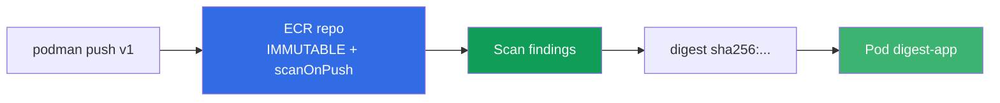
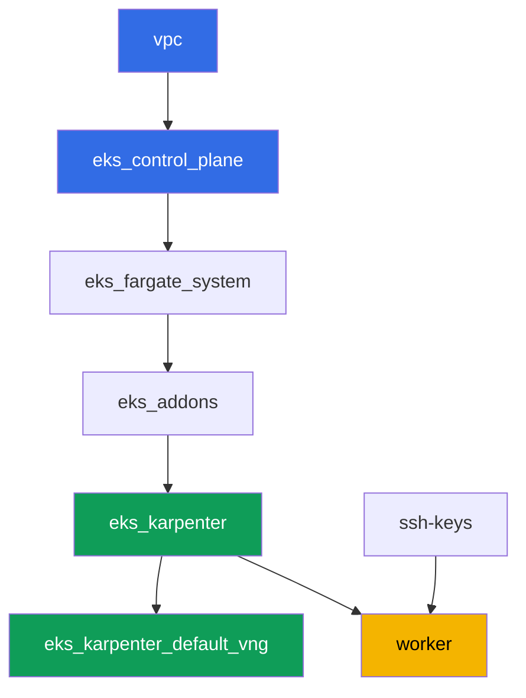

[Русская версия](README_RU.MD) · [Eng version](README.MD) · [Versión en español](README_ES.MD) · [Version française](README_FR.MD) · [Deutsche Version](README_DE.MD) · [ქართული ვერსია](README_GE.MD) · [繁體中文版](README_TW.MD)

# ラボ130 - ECRとサプライチェーン: 不変タグ、プッシュ時スキャン、pull through cache

## 概要

クラスターはレジストリにあるものを実行します - 問題は、そのイメージを信頼できるかどうかです。
このラボでは、Amazon ECRをプロダクションレベルのレジストリとして扱います。不変タグ付きの
リポジトリを作成し、プッシュ時にスキャナーでイメージを検証し、digestでpodをデプロイし
(書き換え可能なタグではなく)、認証なし(`registry.k8s.io`)と認証あり(`Docker Hub`)の
2つのアップストリーム向けにpull through cacheを設定します。

タスクはプロダクションスタイルです: 短い課題設定と受け入れ基準。検証は
`check_result`コマンドで自動的に行われます。

## 目標

コースの章の内容を定着させます:

- [第20章 イメージとサプライチェーン: ECR、スキャン、署名、pull through cache](../../course/20/jp.md) - イメージがどこから来て、誰が検証したのか

## 作成するもの

クラスターはすでにコードとしてデプロイされています(ラボ101と同じ基盤)。このラボには
専用のterraformコンポーネントは不要です。ECRとSecrets Managerに対する操作はすべて、
インスタンスのIAMロールで必要な権限を持つワーカーマシンからAWS CLIで行います。

| オブジェクト | これは何か | このラボでの目的 |
|--------|---------|-------------------|
| リポジトリ `eks-lab130/app` | プライベートECR、IMMUTABLE、scanOnPush | タグ、スキャン、lifecycleの基盤 |
| イメージ `:v1` | 再タグ付けされたパブリックイメージ | pushとIMMUTABLEの動作を確認 |
| アーティファクト `denied.txt` | タグ`v1`の再pushエラー | IMMUTABLEがタグを保護する様子を確認 |
| アーティファクト `scan-summary.txt` | severity別のスキャナーfindings | 使用前のイメージ検証 |
| Pod `digest-app` | `@sha256:`でイメージを参照 | 書き換え可能なタグではなくdigestでデプロイ |
| Cache rule `k8s-cache` | `registry.k8s.io`向けpull through cache | 認証情報なしのアップストリームキャッシュ |
| シークレット + cache rule `docker-hub` | credential-arn付きpull through cache | シークレットが必要なアップストリーム(ラボのテーマ) |
| Lifecycle policy | イメージ保持ルール | リポジトリに古いタグを溜めない |

pushから実行中のpodまでのイメージの経路:



## インフラストラクチャ

環境はAWS(`eu-central-1`)にTerragrunt経由でデプロイされます。基盤はラボ101と同じで、
ECR専用のコンポーネントは不要です。`ecr:*`権限と限定された`secretsmanager:*`権限は
すでに`eks_v2_work_pc`モジュールのワーカーマシンのIAMポリシーに含まれており、Karpenterの
ノードロールはmanaged policy `AmazonEC2ContainerRegistryReadOnly`を持っています - これは
`eks_v2_karpenter`モジュールが付与するもので、`imagePullSecrets`なしでプライベートECRから
pullするためのものです。

### モジュールと依存関係

| ディレクトリ(コンポーネント) | モジュール(`terraform/modules/`) | 依存先 | 作成するもの |
|---------------------|-------------------------------|------------|-------------|
| `vpc` | `vpc_v3` | - | VPC `10.10.0.0/16`、2つのAZのサブネット、NAT |
| `ssh-keys` | `ssh-keys` | - | ワーカーマシンとノード用のSSH鍵ペア |
| `eks_control_plane` | `eks_v2_control_plane` | `vpc` | EKS control plane `1.36`、OIDC、security groups |
| `eks_fargate_system` | `eks_v2_fargate` | `vpc`, `eks_control_plane` | `kube-system`と`karpenter`用のFargateプロファイル |
| `eks_addons` | `eks_v2_addons` | `eks_control_plane`, `eks_fargate_system` | coredns、kube-proxy、vpc-cni、pod-identityアドオン |
| `eks_karpenter` | `eks_v2_karpenter` | `vpc`, `eks_control_plane`, `eks_addons`, `eks_fargate_system` | Karpenterコントローラー、`AmazonEC2ContainerRegistryReadOnly`付きノードIAMロール |
| `eks_karpenter_default_vng` | `eks_v2_karpenter_vng` | `vpc`, `eks_control_plane`, `eks_karpenter` | AL2023上のデフォルトNodePool `default` |
| `worker` | `eks_v2_work_pc` | `ssh-keys`, `vpc`, `eks_control_plane`, `eks_karpenter` | ワーカーマシン: kubectl、`podman`、`ecr:*`と`secretsmanager:*`権限 |

依存関係グラフ(矢印の下にあるものほど先に適用される):



ECRリポジトリ、Secrets Managerのシークレット、cache rulesはすべて、ワーカーマシン上で
AWS CLIを使って自分で作成します - このラボには追加のterraformコンポーネントは不要で、
権限はすでにworkerのIAMポリシーで付与されています。

### 設定箇所

`env.hcl`(環境共通パラメータ):

| パラメータ | このラボでの値 | 影響範囲 |
|----------|-----------------|---------------|
| `region` | `eu-central-1` | ECRとSecrets Managerを含む全リソースのリージョン |
| `prefix` | `eks-task130` | リソース名とタグのプレフィックス |
| `stack_name` | `eks130` | ここから`env_name`(クラスター名)が組み立てられる |
| `k8_version` | `1.36.0` | ワーカーマシン上のkubectlバージョン |
| `instance_type_worker` | `t3.medium` | ワーカーマシンのインスタンスタイプ |
| `ssh_password_enable`, `access_cidrs` | `true`, `0.0.0.0/0` | ワーカーマシンへのSSHアクセス |

各コンポーネントの`terragrunt.hcl`の`inputs`:

| ファイル | 主要な設定 |
|------|--------------------|
| `eks_control_plane/terragrunt.hcl` | `eks.version = "1.36"` |
| `eks_addons/terragrunt.hcl` | 1.36向けアドオンバージョン |
| `eks_karpenter/terragrunt.hcl` | ECRからのpull用`AmazonEC2ContainerRegistryReadOnly`付きノードIAMロール |
| `worker/terragrunt.hcl` | ラボ130のファイル用`test_url`と`task_script_url` |

## デプロイ

```bash
TASK=130 make run_eks_task
```

デプロイには約15-20分かかります。出力の中からワーカーマシンへのSSH接続の行を見つけて
接続してください。そこではkubectlはすでに対象クラスターに設定済みで、`aws` CLIも
インスタンスのIAMロールを通じて明示的なログインなしで動作します。ワーカーマシンには
すでに`podman`がインストールされているので、`docker`の代わりにこれを使ってください。

> タスク2-6は同じSSHセッション内で行ってください。`podman login`はトークンを
> `$XDG_RUNTIME_DIR/containers/auth.json`に保存しますが、このディレクトリは
> ユーザーセッションと一緒に消えます: ログアウトして再ログインすると、ECRの12時間
> トークンがまだ有効でも、pushとpullは`unauthorized: authentication required`を
> 返すようになります。`aws ecr get-login-password ... | podman login ...`を
> 再実行すれば解決します。

ワーカーマシン上で使える便利なコマンド:

```bash
time_left       # 環境の残り時間
check_result    # 解答を検証する
```

> スタンドのセキュリティについて。`env.hcl`では`ssh_password_enable = true`と
> `access_cidrs = ["0.0.0.0/0"]`が有効になっています - 学習環境としては便利ですが、
> プロダクションでこれをやってはいけません。コースの基準(第0.2章、第2章、第19章)では、
> ワーカーマシンへのアクセスは外部への公開SSHポートなしでAWS SSM Session Manager経由で
> 開き、`access_cidrs`は特定のアドレスに絞ります。ここでは起動の簡単さのためだけに
> 公開SSHを残しています。

## タスク

---
|        **1**        | **不変タグとプッシュ時スキャン付きリポジトリ**    |
| :-----------------: | :---------------------------------------------------------- |
| やること          | `image-tag-mutability IMMUTABLE`と`image-scanning-configuration scanOnPush=true`を持つプライベートECRリポジトリ`eks-lab130/app`を作成してください。 |
| 受け入れ基準    | - リポジトリ`eks-lab130/app`が存在する;<br/>- `imageTagMutability = IMMUTABLE`;<br/>- `imageScanningConfiguration.scanOnPush = true`。 |
---
|        **2**        | **タグv1でイメージをpush**                                  |
| :-----------------: | :---------------------------------------------------------- |
| やること          | `aws ecr get-login-password`と`podman login`でレジストリにログインしてください。イメージ`alpine:3.19`を取得し、再タグ付けして`eks-lab130/app`にタグ`v1`でpushしてください。`aws ecr describe-images`でpushが成功したことを確認してください。このイメージは無作為に選んだものではありません: ECRの基本スキャンはAlpineのパッケージデータベースを解析できるため、タスク4で本物のfindingsが得られます。 |
| 受け入れ基準    | - `eks-lab130/app`にタグ`v1`のイメージが存在する。 |
---
|        **3**        | **症状: IMMUTABLEがタグv1の再pushを拒否する**     |
| :-----------------: | :---------------------------------------------------------- |
| やること          | 別のイメージ(`busybox:1.36`)を取得し、同じタグ`v1`で再タグ付けして`eks-lab130/app`へのpushを試してください。タグ`v1`はすでに使用済みでリポジトリはIMMUTABLEのため、pushは拒否されるはずです。pushコマンドの出力(stdoutとstderr)をファイル`/var/work/tests/artifacts/3/denied.txt`に保存してください。出力は長くなります: podmanは複数のマニフェスト形式を順に試し、それぞれで拒否されます - 必要な行はどの試行にも含まれています。 |
| 受け入れ基準    | - ファイル`denied.txt`が空でない;<br/>- `v1`とimmutable/already existsに関する記述(例: `ImageTagAlreadyExistsException`)が含まれている。 |
---
|        **4**        | **スキャンのfindings**                                   |
| :-----------------: | :---------------------------------------------------------- |
| やること          | イメージ`v1`のスキャン完了を待ってください(ステータス`COMPLETE`、`aws ecr wait image-scan-complete`または手動のretryループを使用)。`aws ecr describe-image-scan-findings`のサマリー(ステータスとseverity別のfindings数)をファイル`/var/work/tests/artifacts/4/scan-summary.txt`に保存してください。適用範囲の限界を覚えておいてください: 基本スキャンは既知のディストリビューションのパッケージデータベースを読み取りますが、`FROM scratch`やdistrolessでビルドされたイメージは、`UnsupportedImageError: The operating system and/or package manager are not supported.`という説明付きのステータス`FAILED`になります - つまり「スキャンで脆弱性が見つからなかった」ことと「スキャンが確認できなかった」ことはレポート上見た目が異なり、区別する必要があります。 |
| 受け入れ基準    | - ファイル`scan-summary.txt`が空でない;<br/>- イメージ`v1`のスキャンステータスが`COMPLETE`である;<br/>- サマリーにseverity別のfindings分布が確認できる。 |
---
|        **5**        | **タグではなくdigestでのデプロイ**                           |
| :-----------------: | :---------------------------------------------------------- |
| やること          | イメージ`v1`のdigestを取得してください(`aws ecr describe-images --image-ids imageTag=v1`)。namespace `eks-130`に、label `app=digest-app`を持つPodを作成し、`image`を`<レジストリ>/eks-lab130/app@sha256:...`(タグではなくdigest)、コマンドを`["sh", "-c", "sleep 86400"]`、`nodeSelector: kubernetes.io/arch: amd64`として指定してください。このセレクターは必須で、これ自体が一つの教訓です: ワーカーマシン(x86_64)上の`podman`はシングルアーキテクチャのマニフェストをpushしますが、このラボのNodePoolは`arm64`も許可しているため、セレクターがないとpodが`t4g`に配置され、ログに何も出さずに`exitCode 255`で`CrashLoopBackOff`に陥ることがあります。Karpenterのノードロールはすでに`AmazonEC2ContainerRegistryReadOnly`を持っているため、`imagePullSecrets`なしでプライベートECRからのpullが通ります。 |
| 受け入れ基準    | - `eks-130`のlabel `app=digest-app`を持つpodが再起動なしで`Running`状態にある;<br/>- そのイメージが`eks-lab130/app@sha256:`で指定されている。 |
---
|        **6**        | **認証なしのpull through cache: registry.k8s.io**  |
| :-----------------: | :---------------------------------------------------------- |
| やること          | プレフィックス`k8s-cache`、アップストリーム`registry.k8s.io`のpull through cache ruleを作成してください。アカウント内で最初のルールを作成する際、ECRはservice-linked role `AWSServiceRoleForECRPullThroughCache`を作成するため、呼び出し側には`iam:CreateServiceLinkedRole`権限が必要です(ワーカーマシンには付与済みです。付与されていない場合、応答は`ValidationException ... The Amazon ECR action failed due to an IAM exception`になります)。キャッシュ経由でイメージ`pause`をpullしてください: `podman pull <レジストリ>/k8s-cache/pause:3.9`。ECRにキャッシュされたリポジトリ`k8s-cache/pause`が現れたことを確認してください。 |
| 受け入れ基準    | - プレフィックス`k8s-cache`、アップストリーム`registry.k8s.io`のcache ruleが存在する;<br/>- ECRに`k8s-cache/pause`で始まるリポジトリが存在する。 |
---
|        **7**        | **シークレット付きpull through cache: Docker Hub**                |
| :-----------------: | :---------------------------------------------------------- |
| やること          | 名前`ecr-pullthroughcache/dockerhub-creds`のSecrets Managerシークレットを作成してください(`username`と`accessToken`フィールドを持つJSON、値はダミーで構いません、本物のDocker Hub認証情報は不要です)。プレフィックス`docker-hub`、アップストリーム`registry-1.docker.io`、このシークレットの`--credential-arn`を指定したpull through cache ruleを作成してください。実際のpullは不要です: このタスクは設定(シークレットとルールが存在し関連付けられていること)を検証するもので、pullの成功自体は確認しません。 |
| 受け入れ基準    | - シークレット`ecr-pullthroughcache/dockerhub-creds`が存在する;<br/>- プレフィックス`docker-hub`のcache ruleが存在し、その`credentialArn`がこのシークレットを指している。 |
---
|        **8**        | **リポジトリのLifecycle policy**                          |
| :-----------------: | :---------------------------------------------------------- |
| やること          | `eks-lab130/app`にlifecycle policyを設定してください。例えばタグ`v*`のイメージを5個までしか保持しないようにします。`aws ecr get-lifecycle-policy`でポリシーを確認し、`aws ecr get-lifecycle-policy-preview`で事前確認を見てください。 |
| 受け入れ基準    | - `eks-lab130/app`に対する`aws ecr get-lifecycle-policy`が、ルール(`rulePriority`)を含む空でない`lifecyclePolicyText`を返す。 |
---

## 結果の確認

ワーカーマシン上で自動検証を実行してください:

```bash
check_result
```

スクリプトはテストを実行し、完了したタスクの割合を表示します。

## 解決策

参考解決策: [worker/files/solutions/1_JP.MD](worker/files/solutions/1_JP.MD)

## クラスターとリソースの削除

まず負荷を止め、KarpenterのEC2ノードが消えるのを待ってください: ノードが動いている
状態でスタンドを削除すると、VPC CNIのセカンダリENIが`available`状態のまま残り、
ノードのsecurity groupを保持し続けるため、`destroy`がそこで止まってしまいます。

```bash
kubectl delete namespace eks-130 --ignore-not-found

while kubectl get nodes --no-headers 2>/dev/null | grep -qv fargate; do
  echo "KarpenterのEC2ノードはまだ稼働中です、待機します..."; sleep 15
done
```

```bash
TASK=130 make delete_eks_task
```

AWS CLIで手動作成したECRとSecrets Managerのリソース(リポジトリ`eks-lab130/app`、
cache rules、シークレット`ecr-pullthroughcache/dockerhub-creds`)はTerraformの状態に
含まれず、`make delete_eks_task`では削除されません。アカウントに残したくない場合は
個別に削除してください:

```bash
aws ecr delete-repository --repository-name eks-lab130/app --force --region eu-central-1
aws ecr delete-repository --repository-name k8s-cache/pause --force --region eu-central-1
aws ecr delete-pull-through-cache-rule --ecr-repository-prefix k8s-cache --region eu-central-1
aws ecr delete-pull-through-cache-rule --ecr-repository-prefix docker-hub --region eu-central-1
aws secretsmanager delete-secret \
  --secret-id ecr-pullthroughcache/dockerhub-creds --force-delete-without-recovery \
  --region eu-central-1
```
