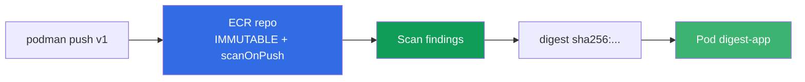
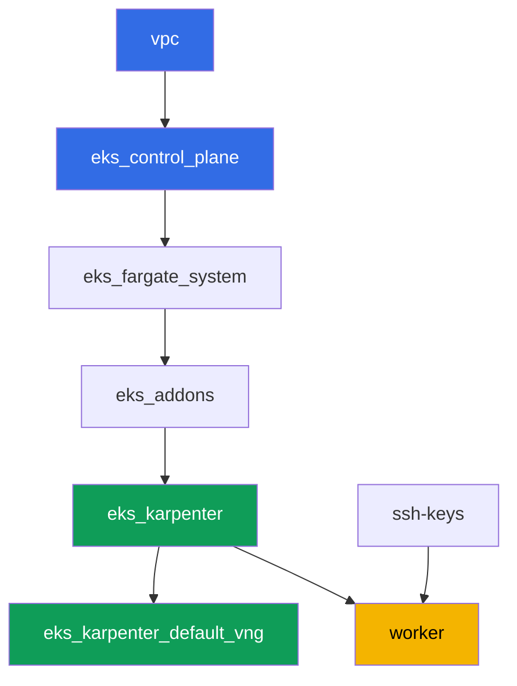

# Лаба 130 - ECR и supply chain: неизменяемые теги, скан при пуше, pull through cache

## Описание

Кластер запускает то, что лежит в реестре, - вопрос в том, можно ли доверять этому образу.
В этой лабе вы работаете с Amazon ECR как с реестром продакшн-уровня: заводите репозиторий
с неизменяемыми тегами, проверяете образ сканером при пуше, деплоите под по digest (а не по
тегу, который можно переписать) и настраиваете pull through cache для двух апстримов - без
аутентификации (`registry.k8s.io`) и с секретом (`Docker Hub`).

Задания в продакшн-стиле: короткая постановка плюс критерии приёмки. Проверка -
автоматическая, командой `check_result`.

## Цель

Закрепить материал главы курса:

- [Глава 20. Образы и supply chain: ECR, сканирование, подписи, pull through cache](../../course/20/ru.md) - откуда берётся образ, кто его проверил

## Что мы создаём

Кластер уже развёрнут как код (та же база, что в лабе 101). Специальных terraform-
компонентов лаба не требует: все действия с ECR и Secrets Manager вы делаете через AWS
CLI с рабочей машины, у которой уже есть нужные права через IAM-роль инстанса.

| Объект | Что это | Зачем в этой лабе |
|--------|---------|-------------------|
| Репозиторий `eks-lab130/app` | приватный ECR, IMMUTABLE, scanOnPush | база для тегов, скана и lifecycle |
| Образ `:v1` | перетегированный публичный образ | подтверждаем push и работу IMMUTABLE |
| Артефакт `denied.txt` | ошибка повторного push тега `v1` | видим, как IMMUTABLE защищает тег |
| Артефакт `scan-summary.txt` | findings сканера по severity | проверка образа перед использованием |
| Pod `digest-app` | ссылается на образ по `@sha256:` | деплой по digest, а не по переписываемому тегу |
| Cache rule `k8s-cache` | pull through cache для `registry.k8s.io` | кэш апстрима без учётных данных |
| Секрет + cache rule `docker-hub` | pull through cache с credential-arn | апстрим, требующий секрет (тема лабы) |
| Lifecycle policy | правило хранения образов | не копим старые теги в репозитории |

Путь образа от push до запущенного пода:



## Инфраструктура

Окружение разворачивается в AWS (`eu-central-1`) через Terragrunt. База совпадает с лабой
101: специальных компонентов под ECR не требуется, права `ecr:*` и ограниченный набор
`secretsmanager:*` уже включены в IAM-политику рабочей машины модуля `eks_v2_work_pc`, а
роль ноды Karpenter несёт managed policy `AmazonEC2ContainerRegistryReadOnly` - её достаёт
модуль `eks_v2_karpenter` для pull из приватного ECR без `imagePullSecrets`.

### Модули и зависимости

| Каталог (компонент) | Модуль (`terraform/modules/`) | Зависит от | Что создаёт |
|---------------------|-------------------------------|------------|-------------|
| `vpc` | `vpc_v3` | - | VPC `10.10.0.0/16`, подсети в двух AZ, NAT |
| `ssh-keys` | `ssh-keys` | - | пара SSH-ключей для рабочей машины и нод |
| `eks_control_plane` | `eks_v2_control_plane` | `vpc` | control plane EKS `1.36`, OIDC, security groups |
| `eks_fargate_system` | `eks_v2_fargate` | `vpc`, `eks_control_plane` | Fargate-профиль для `kube-system` и `karpenter` |
| `eks_addons` | `eks_v2_addons` | `eks_control_plane`, `eks_fargate_system` | аддоны coredns, kube-proxy, vpc-cni, pod-identity |
| `eks_karpenter` | `eks_v2_karpenter` | `vpc`, `eks_control_plane`, `eks_addons`, `eks_fargate_system` | контроллер Karpenter, IAM-роль нод с `AmazonEC2ContainerRegistryReadOnly` |
| `eks_karpenter_default_vng` | `eks_v2_karpenter_vng` | `vpc`, `eks_control_plane`, `eks_karpenter` | дефолтный NodePool `default` на AL2023 |
| `worker` | `eks_v2_work_pc` | `ssh-keys`, `vpc`, `eks_control_plane`, `eks_karpenter` | рабочая машина: kubectl, `podman`, права `ecr:*` и `secretsmanager:*` |

Граф зависимостей (что применяется раньше, то ниже по стрелке):



Все репозитории ECR, секреты Secrets Manager и cache rules вы создаёте сами на рабочей
машине через AWS CLI - для этой лабы никакого дополнительного terraform-компонента не
нужно, права уже даёт IAM-политика worker.

### Где что настраивается

`env.hcl` (общие параметры окружения):

| Параметр | Значение в лабе | На что влияет |
|----------|-----------------|---------------|
| `region` | `eu-central-1` | регион всех ресурсов, включая ECR и Secrets Manager |
| `prefix` | `eks-task130` | префикс имён ресурсов и тегов |
| `stack_name` | `eks130` | из него собирается `env_name` - имя кластера |
| `k8_version` | `1.36.0` | версия kubectl на рабочей машине |
| `instance_type_worker` | `t3.medium` | тип инстанса рабочей машины |
| `ssh_password_enable`, `access_cidrs` | `true`, `0.0.0.0/0` | доступ по SSH к рабочей машине |

`inputs` в `terragrunt.hcl` каждого компонента:

| Файл | Ключевые настройки |
|------|--------------------|
| `eks_control_plane/terragrunt.hcl` | `eks.version = "1.36"` |
| `eks_addons/terragrunt.hcl` | версии аддонов под 1.36 |
| `eks_karpenter/terragrunt.hcl` | IAM-роль ноды с `AmazonEC2ContainerRegistryReadOnly` для pull из ECR |
| `worker/terragrunt.hcl` | `test_url` и `task_script_url` на файлы лабы 130 |

## Развёртывание

```bash
TASK=130 make run_eks_task
```

Развёртывание занимает примерно 15-20 минут. В выводе найдите строку с SSH-подключением к
рабочей машине и подключитесь к ней. kubectl там уже настроен на нужный кластер, `aws` CLI
работает без явного логина - через IAM-роль инстанса. На рабочей машине уже установлен
`podman`, используйте его вместо `docker`.

> Держите задания 2-6 в одной SSH-сессии. `podman login` кладёт токен в
> `$XDG_RUNTIME_DIR/containers/auth.json`, а этот каталог живёт вместе с сессией
> пользователя: после выхода и повторного входа push и pull начнут отвечать
> `unauthorized: authentication required`, хотя 12-часовой токен ECR ещё действителен.
> Лечится повторным `aws ecr get-login-password ... | podman login ...`.

Полезные команды на рабочей машине:

```bash
time_left       # сколько осталось времени окружения
check_result    # проверить решение
```

> Безопасность стенда. В `env.hcl` включены `ssh_password_enable = true` и
> `access_cidrs = ["0.0.0.0/0"]` - это удобно для учебного окружения, но так делать в
> продакшене нельзя. По стандартам курса (главы 0.2, 2, 19) доступ к рабочим машинам
> открывают через AWS SSM Session Manager без публичных SSH-портов наружу, а `access_cidrs`
> сужают до конкретных адресов. Здесь публичный SSH оставлен только ради простоты запуска.

## Задания

---
|        **1**        | **Репозиторий с неизменяемыми тегами и сканом при пуше**    |
| :-----------------: | :---------------------------------------------------------- |
| Что делаем          | Создайте приватный репозиторий ECR `eks-lab130/app` с `image-tag-mutability IMMUTABLE` и `image-scanning-configuration scanOnPush=true`. |
| Критерии приёмки    | - репозиторий `eks-lab130/app` существует;<br/>- `imageTagMutability = IMMUTABLE`;<br/>- `imageScanningConfiguration.scanOnPush = true`. |
---
|        **2**        | **Push образа с тегом v1**                                  |
| :-----------------: | :---------------------------------------------------------- |
| Что делаем          | Залогиньтесь в реестр через `aws ecr get-login-password` и `podman login`. Возьмите образ `alpine:3.19`, перетегируйте и запушьте его в `eks-lab130/app` с тегом `v1`. Убедитесь, что push прошёл через `aws ecr describe-images`. Образ взят не случайно: базовое сканирование ECR умеет разбирать пакетную базу Alpine, поэтому задание 4 получит настоящие находки. |
| Критерии приёмки    | - в `eks-lab130/app` есть образ с тегом `v1`. |
---
|        **3**        | **Симптом: IMMUTABLE отклоняет повторный push тега v1**     |
| :-----------------: | :---------------------------------------------------------- |
| Что делаем          | Возьмите другой образ (`busybox:1.36`), перетегируйте тем же тегом `v1` и попытайтесь запушить его в `eks-lab130/app`. Push должен быть отклонён, так как тег `v1` уже занят и репозиторий IMMUTABLE. Сохраните вывод команды push (stdout и stderr) в файл `/var/work/tests/artifacts/3/denied.txt`. Вывод будет длинным: podman перебирает форматы манифеста и на каждом получает отказ - нужная строка есть в каждой попытке. |
| Критерии приёмки    | - файл `denied.txt` не пуст;<br/>- содержит `v1` и упоминание immutable/already exists (например `ImageTagAlreadyExistsException`). |
---
|        **4**        | **Findings сканирования**                                   |
| :-----------------: | :---------------------------------------------------------- |
| Что делаем          | Дождитесь завершения сканирования образа `v1` (статус `COMPLETE`, через `aws ecr wait image-scan-complete` или ручной retry-цикл). Сохраните сводку `aws ecr describe-image-scan-findings` (статус и количество находок по severity) в файл `/var/work/tests/artifacts/4/scan-summary.txt`. Запомните границу применимости: базовое сканирование читает пакетную базу известных дистрибутивов, а образ, собранный `FROM scratch` или distroless, даёт статус `FAILED` с описанием `UnsupportedImageError: The operating system and/or package manager are not supported.` - то есть «скан не нашёл уязвимостей» и «скан не смог посмотреть» выглядят в отчётах по-разному, и это надо различать. |
| Критерии приёмки    | - файл `scan-summary.txt` не пуст;<br/>- статус сканирования образа `v1` - `COMPLETE`;<br/>- в сводке видно распределение находок по severity. |
---
|        **5**        | **Деплой по digest, а не по тегу**                           |
| :-----------------: | :---------------------------------------------------------- |
| Что делаем          | Получите digest образа `v1` (`aws ecr describe-images --image-ids imageTag=v1`). В namespace `eks-130` создайте Pod с label `app=digest-app`, у которого `image` указан как `<реестр>/eks-lab130/app@sha256:...` (по digest, а не по тегу), команда `["sh", "-c", "sleep 86400"]` и `nodeSelector: kubernetes.io/arch: amd64`. Селектор обязателен, и это отдельный урок: `podman` на рабочей машине (x86_64) пушит ОДНОАРОЧНЫЙ манифест, а NodePool лабы разрешает и `arm64`, поэтому без селектора под может попасть на `t4g` и падать в `CrashLoopBackOff` с `exitCode 255` без единой строки в логах. Роль ноды Karpenter уже несёт `AmazonEC2ContainerRegistryReadOnly`, поэтому pull из приватного ECR проходит без `imagePullSecrets`. |
| Критерии приёмки    | - под с label `app=digest-app` в `eks-130` в состоянии `Running` без перезапусков;<br/>- его образ указан через `eks-lab130/app@sha256:`. |
---
|        **6**        | **Pull through cache без аутентификации: registry.k8s.io**  |
| :-----------------: | :---------------------------------------------------------- |
| Что делаем          | Создайте pull through cache rule с префиксом `k8s-cache` и апстримом `registry.k8s.io`. При создании ПЕРВОГО правила в аккаунте ECR заводит service-linked role `AWSServiceRoleForECRPullThroughCache`, поэтому вызывающему нужно право `iam:CreateServiceLinkedRole` (у рабочей машины оно есть; без него ответ - `ValidationException ... The Amazon ECR action failed due to an IAM exception`). Стяните через кэш образ `pause`: `podman pull <реестр>/k8s-cache/pause:3.9`. Подтвердите, что в ECR появился закэшированный репозиторий `k8s-cache/pause`. |
| Критерии приёмки    | - cache rule с префиксом `k8s-cache` и апстримом `registry.k8s.io` существует;<br/>- в ECR есть репозиторий, начинающийся с `k8s-cache/pause`. |
---
|        **7**        | **Pull through cache с секретом: Docker Hub**                |
| :-----------------: | :---------------------------------------------------------- |
| Что делаем          | Создайте секрет Secrets Manager с именем `ecr-pullthroughcache/dockerhub-creds` (JSON с полями `username` и `accessToken`, значения - заглушки, настоящие Docker Hub креды не нужны). Создайте pull through cache rule с префиксом `docker-hub`, апстримом `registry-1.docker.io` и `--credential-arn` этого секрета. Реальный pull делать не нужно: задание проверяет конфигурацию (секрет и правило существуют и связаны), а не факт успешного pull. |
| Критерии приёмки    | - секрет `ecr-pullthroughcache/dockerhub-creds` существует;<br/>- cache rule с префиксом `docker-hub` существует и её `credentialArn` указывает на этот секрет. |
---
|        **8**        | **Lifecycle policy на репозитории**                          |
| :-----------------: | :---------------------------------------------------------- |
| Что делаем          | Настройте на `eks-lab130/app` lifecycle policy, например хранить не больше `5` образов с тегами `v*`. Проверьте политику через `aws ecr get-lifecycle-policy` и посмотрите предпросмотр через `aws ecr get-lifecycle-policy-preview`. |
| Критерии приёмки    | - `aws ecr get-lifecycle-policy` для `eks-lab130/app` возвращает непустой `lifecyclePolicyText` с правилом (`rulePriority`). |
---

## Проверка результата

На рабочей машине запустите автоматическую проверку:

```bash
check_result
```

Скрипт прогонит тесты и покажет процент выполненных заданий.

## Решение

Эталонное решение: [worker/files/solutions/1.MD](worker/files/solutions/1.MD)

## Удаление кластера и ресурсов

Сначала снимите нагрузку и дождитесь, пока EC2-нода Karpenter уйдёт: если удалять стенд с
живой нодой, вторичный ENI от VPC CNI остаётся в состоянии `available` и держит security
group нод, из-за чего `destroy` зависает на ней.

```bash
kubectl delete namespace eks-130 --ignore-not-found

while kubectl get nodes --no-headers 2>/dev/null | grep -qv fargate; do
  echo "EC2-нода Karpenter ещё жива, ждём..."; sleep 15
done
```

```bash
TASK=130 make delete_eks_task
```

Ресурсы ECR и Secrets Manager, созданные вручную через AWS CLI (репозиторий
`eks-lab130/app`, cache rules, секрет `ecr-pullthroughcache/dockerhub-creds`), в состояние
Terraform не входят и `make delete_eks_task` их не удаляет. Уберите их отдельно, если не
хотите оставлять в аккаунте:

```bash
aws ecr delete-repository --repository-name eks-lab130/app --force --region eu-central-1
aws ecr delete-repository --repository-name k8s-cache/pause --force --region eu-central-1
aws ecr delete-pull-through-cache-rule --ecr-repository-prefix k8s-cache --region eu-central-1
aws ecr delete-pull-through-cache-rule --ecr-repository-prefix docker-hub --region eu-central-1
aws secretsmanager delete-secret \
  --secret-id ecr-pullthroughcache/dockerhub-creds --force-delete-without-recovery \
  --region eu-central-1
```
