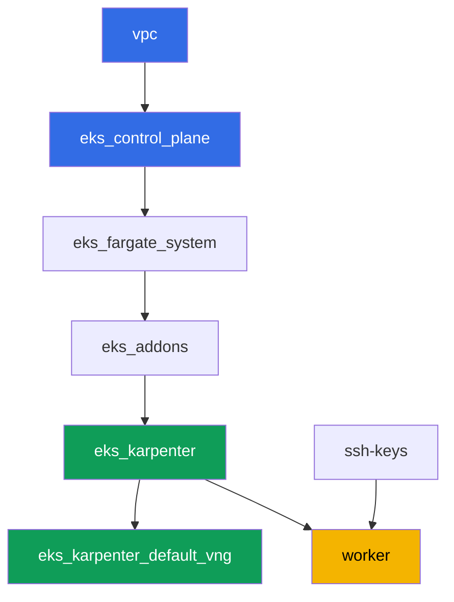

[Русская версия](README_RU.MD) · [Eng version](README.MD) · [Versión en español](README_ES.MD) · [Version française](README_FR.MD) · [Deutsche Version](README_DE.MD) · [ქართული ვერსია](README_GE.MD) · [日本語版](README_JP.MD)

# Lab 130 - ECR 與 supply chain:不可變標籤、push 時掃描、pull through cache

## 說明

叢集執行的就是登錄檔裡放的東西 - 問題在於你能不能信任這個映像。在這個實驗
中,你會把 Amazon ECR 當成生產等級的登錄檔來操作:建立一個帶有不可變標籤的
儲存庫,在 push 時用掃描器檢查映像,依 digest(而不是可以被覆寫的標籤)部署
一個 pod,並為兩個上游設定 pull through cache - 一個不需要驗證
(`registry.k8s.io`),另一個需要密鑰(`Docker Hub`)。

任務以生產風格撰寫:簡短的問題描述加上驗收標準。驗證是自動的,透過
`check_result` 指令完成。

## 目標

鞏固課程章節的內容:

- [第 20 章。映像與 supply chain:ECR、掃描、簽章、pull through cache](../../course/20/tw.md) - 映像從哪裡來,誰檢查過它

## 我們要建立什麼

叢集已經以程式碼的形式部署好(與實驗 101 相同的基礎)。這個實驗不需要任何
專用的 terraform 元件:所有 ECR 與 Secrets Manager 的操作,你都是從工作機透過
AWS CLI 完成,而工作機已經透過執行個體的 IAM role 擁有所需的權限。

| 物件 | 這是什麼 | 為什麼出現在這個實驗中 |
|--------|---------|-------------------|
| 儲存庫 `eks-lab130/app` | 私有 ECR,IMMUTABLE,scanOnPush | 標籤、掃描與 lifecycle 的基礎 |
| 映像 `:v1` | 重新標記的公開映像 | 確認 push 與 IMMUTABLE 的行為 |
| 產物 `denied.txt` | 重複 push 標籤 `v1` 的錯誤 | 看到 IMMUTABLE 如何保護標籤 |
| 產物 `scan-summary.txt` | 按 severity 分類的掃描器 findings | 在使用前檢查映像 |
| Pod `digest-app` | 依 `@sha256:` 參照映像 | 依 digest 部署,而不是依可被覆寫的標籤 |
| Cache rule `k8s-cache` | `registry.k8s.io` 的 pull through cache | 快取不需要憑證的上游 |
| 密鑰 + cache rule `docker-hub` | 帶 credential-arn 的 pull through cache | 需要密鑰的上游(本實驗的主題) |
| Lifecycle policy | 映像保留規則 | 避免在儲存庫中累積舊標籤 |

映像從 push 到執行中 pod 的路徑:


## 基礎架構

環境透過 Terragrunt 部署在 AWS(`eu-central-1`)。基礎與實驗 101 相同:ECR
不需要專用元件,`ecr:*` 權限以及一組有限的 `secretsmanager:*` 權限已經包含在
`eks_v2_work_pc` 模組的工作機 IAM 政策中,而 Karpenter 節點的 role 帶有 managed
policy `AmazonEC2ContainerRegistryReadOnly` - 由 `eks_v2_karpenter` 模組附加 -
用於不透過 `imagePullSecrets` 從私有 ECR pull。

### 模組與依賴關係

| 目錄(元件) | 模組(`terraform/modules/`) | 依賴於 | 建立的內容 |
|---------------------|-------------------------------|------------|-------------|
| `vpc` | `vpc_v3` | - | VPC `10.10.0.0/16`,兩個 AZ 中的子網路,NAT |
| `ssh-keys` | `ssh-keys` | - | 工作機與節點用的 SSH 金鑰組 |
| `eks_control_plane` | `eks_v2_control_plane` | `vpc` | EKS control plane `1.36`,OIDC,security groups |
| `eks_fargate_system` | `eks_v2_fargate` | `vpc`, `eks_control_plane` | `kube-system` 與 `karpenter` 的 Fargate profile |
| `eks_addons` | `eks_v2_addons` | `eks_control_plane`, `eks_fargate_system` | coredns、kube-proxy、vpc-cni、pod-identity 附加元件 |
| `eks_karpenter` | `eks_v2_karpenter` | `vpc`, `eks_control_plane`, `eks_addons`, `eks_fargate_system` | Karpenter controller,帶有 `AmazonEC2ContainerRegistryReadOnly` 的節點 IAM role |
| `eks_karpenter_default_vng` | `eks_v2_karpenter_vng` | `vpc`, `eks_control_plane`, `eks_karpenter` | AL2023 上的預設 NodePool `default` |
| `worker` | `eks_v2_work_pc` | `ssh-keys`, `vpc`, `eks_control_plane`, `eks_karpenter` | 工作機:kubectl、`podman`、`ecr:*` 與 `secretsmanager:*` 權限 |

依賴關係圖(較早套用的元件位於箭頭下方):



所有 ECR 儲存庫、Secrets Manager 密鑰與 cache rules,都由你自己在工作機上透過
AWS CLI 建立 - 這個實驗不需要額外的 terraform 元件,worker 的 IAM 政策已經
給了所需的權限。

### 設定位置

`env.hcl`(環境共用參數):

| 參數 | 這個實驗中的值 | 影響什麼 |
|----------|-----------------|---------------|
| `region` | `eu-central-1` | 所有資源(包括 ECR 與 Secrets Manager)所在的區域 |
| `prefix` | `eks-task130` | 資源名稱與標籤的前綴 |
| `stack_name` | `eks130` | 用來組成 `env_name` - 叢集名稱 |
| `k8_version` | `1.36.0` | 工作機上的 kubectl 版本 |
| `instance_type_worker` | `t3.medium` | 工作機的執行個體類型 |
| `ssh_password_enable`, `access_cidrs` | `true`, `0.0.0.0/0` | 對工作機的 SSH 存取 |

每個元件 `terragrunt.hcl` 中的 `inputs`:

| 檔案 | 關鍵設定 |
|------|--------------------|
| `eks_control_plane/terragrunt.hcl` | `eks.version = "1.36"` |
| `eks_addons/terragrunt.hcl` | 對應 1.36 的附加元件版本 |
| `eks_karpenter/terragrunt.hcl` | 帶有 `AmazonEC2ContainerRegistryReadOnly` 的節點 IAM role,用於從 ECR pull |
| `worker/terragrunt.hcl` | 指向實驗 130 檔案的 `test_url` 與 `task_script_url` |

## 部署

```bash
TASK=130 make run_eks_task
```

部署大約需要 15-20 分鐘。在輸出中找到連接工作機的 SSH 那一行並連線過去。
那裡的 kubectl 已經設定好指向對應的叢集,`aws` CLI 不需要明確登入就能運作 -
透過執行個體的 IAM role。工作機上已經安裝了 `podman`,請用它取代 `docker`。

> 請把任務 2-6 保持在同一個 SSH session 中。`podman login` 會把 token 存到
> `$XDG_RUNTIME_DIR/containers/auth.json`,而這個目錄與使用者 session 共存亡:
> 登出再重新登入之後,push 與 pull 會開始回應
> `unauthorized: authentication required`,即使 ECR 12 小時的 token 仍然有效。
> 解法是重新執行 `aws ecr get-login-password ... | podman login ...`。

工作機上的實用指令:

```bash
time_left       # 環境還剩多少時間
check_result    # 檢查解答
```

> 測試環境的安全性。`env.hcl` 中啟用了 `ssh_password_enable = true` 與
> `access_cidrs = ["0.0.0.0/0"]` - 這對學習環境很方便,但在生產環境中不能這樣
> 做。依照課程的標準(第 0.2、2、19 章),對工作機的存取應該透過 AWS SSM
> Session Manager 開啟,不對外開放公開的 SSH 埠,`access_cidrs` 也應該縮小到
> 特定位址。這裡留著公開 SSH 只是為了方便啟動。

## 任務

---
|        **1**        | **帶有不可變標籤與 push 時掃描的儲存庫**    |
| :-----------------: | :---------------------------------------------------------- |
| 要做什麼          | 建立一個私有 ECR 儲存庫 `eks-lab130/app`,`image-tag-mutability` 為 `IMMUTABLE`,`image-scanning-configuration` 為 `scanOnPush=true`。 |
| 驗收標準    | - 儲存庫 `eks-lab130/app` 存在;<br/>- `imageTagMutability = IMMUTABLE`;<br/>- `imageScanningConfiguration.scanOnPush = true`。 |
---
|        **2**        | **Push 帶有 v1 標籤的映像**                                  |
| :-----------------: | :---------------------------------------------------------- |
| 要做什麼          | 透過 `aws ecr get-login-password` 與 `podman login` 登入登錄檔。取得 `alpine:3.19` 映像,重新標記後 push 到 `eks-lab130/app`,標籤為 `v1`。透過 `aws ecr describe-images` 確認 push 成功。選這個映像不是隨意的:ECR 的基礎掃描能解析 Alpine 的套件資料庫,因此任務 4 會得到真正的 findings。 |
| 驗收標準    | - `eks-lab130/app` 中有一個標籤為 `v1` 的映像。 |
---
|        **3**        | **症狀:IMMUTABLE 拒絕重複 push 標籤 v1**     |
| :-----------------: | :---------------------------------------------------------- |
| 要做什麼          | 取另一個映像(`busybox:1.36`),用相同的標籤 `v1` 重新標記,並嘗試 push 到 `eks-lab130/app`。push 應該被拒絕,因為標籤 `v1` 已經被佔用,而儲存庫是 IMMUTABLE。把 push 指令的輸出(stdout 與 stderr)存到檔案 `/var/work/tests/artifacts/3/denied.txt`。輸出會很長:podman 會依序嘗試多種 manifest 格式,每一種都被拒絕 - 需要的那一行會出現在每一次嘗試中。 |
| 驗收標準    | - 檔案 `denied.txt` 不是空的;<br/>- 內容包含 `v1` 以及提到 immutable/already exists(例如 `ImageTagAlreadyExistsException`)。 |
---
|        **4**        | **掃描的 findings**                                   |
| :-----------------: | :---------------------------------------------------------- |
| 要做什麼          | 等待映像 `v1` 的掃描完成(狀態 `COMPLETE`,透過 `aws ecr wait image-scan-complete` 或手動的 retry 迴圈)。把 `aws ecr describe-image-scan-findings` 的摘要(狀態以及按 severity 分類的 findings 數量)存到檔案 `/var/work/tests/artifacts/4/scan-summary.txt`。請記住適用範圍的界線:基礎掃描讀取的是已知發行版的套件資料庫,而以 `FROM scratch` 或 distroless 建置的映像,會得到狀態 `FAILED`,說明為 `UnsupportedImageError: The operating system and/or package manager are not supported.` - 也就是說「掃描沒發現漏洞」與「掃描沒辦法看」在報告裡看起來不一樣,需要區分清楚。 |
| 驗收標準    | - 檔案 `scan-summary.txt` 不是空的;<br/>- 映像 `v1` 的掃描狀態是 `COMPLETE`;<br/>- 摘要中能看到按 severity 分類的 findings 分布。 |
---
|        **5**        | **依 digest 部署,而不是依標籤**                           |
| :-----------------: | :---------------------------------------------------------- |
| 要做什麼          | 取得映像 `v1` 的 digest(`aws ecr describe-images --image-ids imageTag=v1`)。在 namespace `eks-130` 中建立一個帶有 label `app=digest-app` 的 Pod,它的 `image` 指定為 `<登錄檔>/eks-lab130/app@sha256:...`(依 digest,而不是依標籤),指令為 `["sh", "-c", "sleep 86400"]`,並帶有 `nodeSelector: kubernetes.io/arch: amd64`。這個選擇器是必須的,這本身就是一個教訓:工作機(x86_64)上的 `podman` push 出的是單一架構的 manifest,而這個實驗的 NodePool 同時允許 `arm64`,所以沒有選擇器的話,pod 可能落到 `t4g` 上,並以 `exitCode 255` 陷入 `CrashLoopBackOff`,而且日誌裡什麼都沒有。Karpenter 節點的 role 已經帶有 `AmazonEC2ContainerRegistryReadOnly`,所以從私有 ECR pull 不需要 `imagePullSecrets`。 |
| 驗收標準    | - 帶有 label `app=digest-app` 的 pod 在 `eks-130` 中處於 `Running` 狀態且沒有重啟;<br/>- 它的映像透過 `eks-lab130/app@sha256:` 指定。 |
---
|        **6**        | **不需驗證的 pull through cache:registry.k8s.io**  |
| :-----------------: | :---------------------------------------------------------- |
| 要做什麼          | 建立一個前綴為 `k8s-cache`、上游為 `registry.k8s.io` 的 pull through cache rule。建立帳戶中「第一個」規則時,ECR 會建立 service-linked role `AWSServiceRoleForECRPullThroughCache`,因此呼叫者需要 `iam:CreateServiceLinkedRole` 權限(工作機有這個權限;沒有的話回應會是 `ValidationException ... The Amazon ECR action failed due to an IAM exception`)。透過快取拉取映像 `pause`:`podman pull <登錄檔>/k8s-cache/pause:3.9`。確認 ECR 中出現了快取的儲存庫 `k8s-cache/pause`。 |
| 驗收標準    | - 存在前綴為 `k8s-cache`、上游為 `registry.k8s.io` 的 cache rule;<br/>- ECR 中存在以 `k8s-cache/pause` 開頭的儲存庫。 |
---
|        **7**        | **帶密鑰的 pull through cache:Docker Hub**                |
| :-----------------: | :---------------------------------------------------------- |
| 要做什麼          | 建立一個名為 `ecr-pullthroughcache/dockerhub-creds` 的 Secrets Manager 密鑰(JSON,含 `username` 與 `accessToken` 欄位,值可以是佔位符,不需要真正的 Docker Hub 憑證)。建立一個前綴為 `docker-hub`、上游為 `registry-1.docker.io`、`--credential-arn` 指向這個密鑰的 pull through cache rule。不需要真正執行 pull:任務檢查的是設定(密鑰與規則存在且相互連結),不是 pull 成功的事實。 |
| 驗收標準    | - 密鑰 `ecr-pullthroughcache/dockerhub-creds` 存在;<br/>- 前綴為 `docker-hub` 的 cache rule 存在,且其 `credentialArn` 指向這個密鑰。 |
---
|        **8**        | **儲存庫上的 Lifecycle policy**                          |
| :-----------------: | :---------------------------------------------------------- |
| 要做什麼          | 在 `eks-lab130/app` 上設定一個 lifecycle policy,例如最多保留 `5` 個標籤為 `v*` 的映像。透過 `aws ecr get-lifecycle-policy` 檢查政策,並透過 `aws ecr get-lifecycle-policy-preview` 查看預覽。 |
| 驗收標準    | - 對 `eks-lab130/app` 執行 `aws ecr get-lifecycle-policy`,會回傳非空的 `lifecyclePolicyText`,其中含有規則(`rulePriority`)。 |
---

## 檢查結果

在工作機上執行自動檢查:

```bash
check_result
```

腳本會跑完測試,並顯示已完成任務的百分比。

## 解決方案

參考解答:[worker/files/solutions/1_TW.MD](worker/files/solutions/1_TW.MD)

## 刪除叢集和資源

先移除工作負載,並等待 Karpenter 的 EC2 節點離開:如果在節點還活著的時候就
把測試環境刪掉,VPC CNI 的次要 ENI 會停留在 `available` 狀態,並繼續佔用節點
的 security group,導致 `destroy` 卡在那裡。

```bash
kubectl delete namespace eks-130 --ignore-not-found

while kubectl get nodes --no-headers 2>/dev/null | grep -qv fargate; do
  echo "Karpenter 的 EC2 節點還活著,等待中..."; sleep 15
done
```

```bash
TASK=130 make delete_eks_task
```

透過 AWS CLI 手動建立的 ECR 與 Secrets Manager 資源(儲存庫
`eks-lab130/app`、cache rules、密鑰 `ecr-pullthroughcache/dockerhub-creds`),
不屬於 Terraform 的狀態,`make delete_eks_task` 不會刪除它們。如果不想在帳戶
中留下它們,請單獨清除:

```bash
aws ecr delete-repository --repository-name eks-lab130/app --force --region eu-central-1
aws ecr delete-repository --repository-name k8s-cache/pause --force --region eu-central-1
aws ecr delete-pull-through-cache-rule --ecr-repository-prefix k8s-cache --region eu-central-1
aws ecr delete-pull-through-cache-rule --ecr-repository-prefix docker-hub --region eu-central-1
aws secretsmanager delete-secret \
  --secret-id ecr-pullthroughcache/dockerhub-creds --force-delete-without-recovery \
  --region eu-central-1
```
