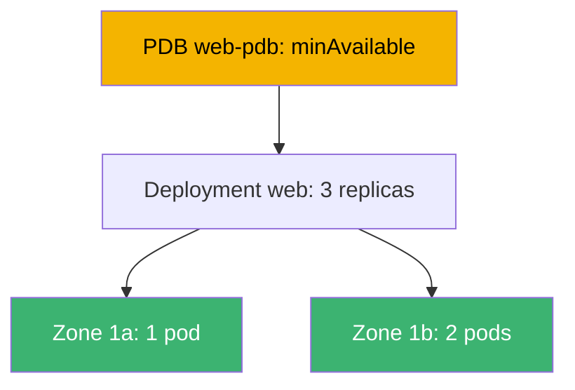
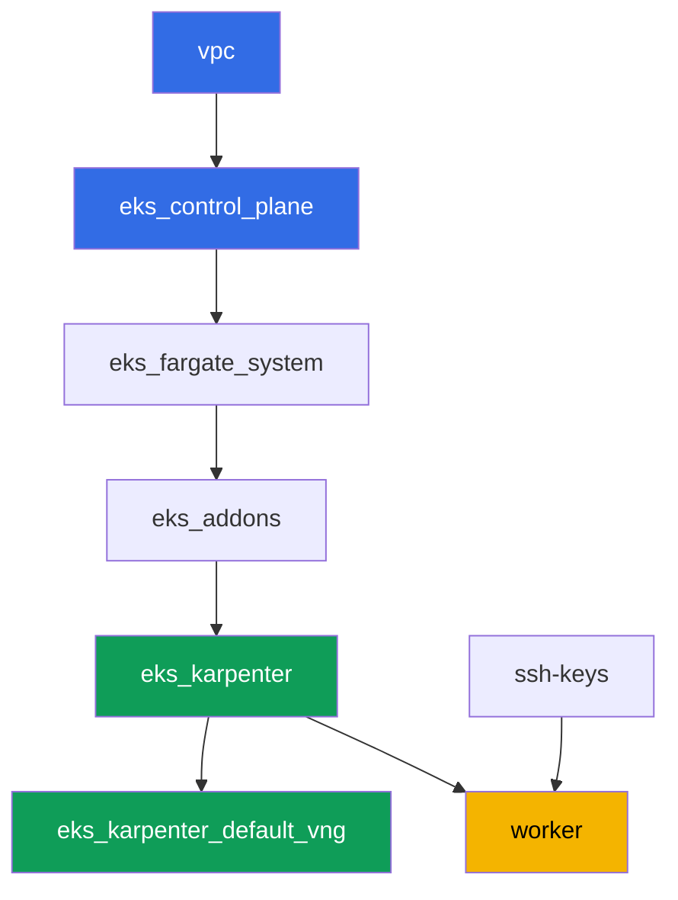

[Русская версия](README_RU.MD) · [Versión en español](README_ES.MD) · [Version française](README_FR.MD) · [Deutsche Version](README_DE.MD) · [ქართული ვერსია](README_GE.MD) · [繁體中文版](README_TW.MD) · [日本語版](README_JP.MD)

# Lab 131 - Reliability: PDB blocks drain, topology spread, matchLabelKeys

## Description

A cluster stays alive as long as operations continue: control plane upgrades, node
replacement, application updates. This lab covers four mechanisms that decide whether the
workload survives planned maintenance. You will spread a Deployment across zones with
`topologySpreadConstraints`, reproduce a classic symptom - a too strict
`PodDisruptionBudget` that permanently blocks `kubectl drain` - and fix it. Then you will
add `unhealthyPodEvictionPolicy: AlwaysAllow` so a broken pod can't hold up drain forever,
and run a rolling update, checking that the new revision stays spread across zones within
`maxSkew` on its own.

Tasks are written in a production style: a short statement plus acceptance criteria.
Checking is automatic, via the `check_result` command.

## Goal

Reinforce the material from the course chapter:

- [Chapter 40. Reliability: multi-AZ, PDB, topology spread](../../course/40/ru.md) -
  correct node draining

## What we're creating

| Object | What it is | Why it's in this lab |
|--------|---------|-------------------|
| Namespace `eks-131` | a cluster section for the lab's workload | keeps resources separate from system ones |
| Deployment `web` (3 replicas) | a ping_pong application with topology spread | spread across zones via `matchLabelKeys` |
| PDB `web-pdb` | a voluntary disruption budget | first blocks drain, then gets fixed |
| Artifact `drain_blocked.txt` | a stuck drain and an explanation | records the symptom of a strict `minAvailable` |
| Artifact `drain_ok.txt` | a successful drain after loosening the PDB | confirms the fix |
| Artifact `unhealthy_policy.txt` | an explanation of `AlwaysAllow` | an unhealthy pod doesn't block drain forever |
| Artifact `rollout.txt` | a successful rolling update | `matchLabelKeys` keeps old pods out of the way |

The overall picture of the lab's workload:



## Infrastructure

The environment is deployed in AWS (`eu-central-1`) via Terragrunt. Each lab directory is
one component with its own `terragrunt.hcl`, which references a shared module in
`terraform/modules/` and declares dependencies through `dependency` blocks. Terragrunt
builds the dependency graph and applies the components in the right order. No separate
NodePool for zones is needed: the cluster is already deployed across two AZs
(`eu-central-1a`, `eu-central-1b`), which is enough for topology spread.

### Modules and dependencies

| Directory (component) | Module (`terraform/modules/`) | Depends on | What it creates |
|---------------------|-------------------------------|------------|-------------|
| `vpc` | `vpc_v3` | - | VPC `10.10.0.0/16`, public and private subnets in two AZs, NAT |
| `ssh-keys` | `ssh-keys` | - | an SSH key pair for the worker machine and nodes |
| `eks_control_plane` | `eks_v2_control_plane` | `vpc` | EKS control plane `1.36`, OIDC, security groups |
| `eks_fargate_system` | `eks_v2_fargate` | `vpc`, `eks_control_plane` | Fargate profile for `kube-system` and `karpenter` |
| `eks_addons` | `eks_v2_addons` | `eks_control_plane`, `eks_fargate_system` | coredns, kube-proxy, vpc-cni, pod-identity addons |
| `eks_karpenter` | `eks_v2_karpenter` | `vpc`, `eks_control_plane`, `eks_addons`, `eks_fargate_system` | Karpenter controller, node IAM role |
| `eks_karpenter_default_vng` | `eks_v2_karpenter_vng` | `vpc`, `eks_control_plane`, `eks_karpenter` | default NodePool `default` in two AZs |
| `worker` | `eks_v2_work_pc` | `ssh-keys`, `vpc`, `eks_control_plane`, `eks_karpenter` | worker machine with kubectl, tests and `check_result` |

Dependency graph (what gets applied earlier is lower down the arrow):



System pods go to Fargate, worker nodes are brought up by Karpenter in two zones - this is
the failure domain the lab's topology relies on.

### Where things are configured

Settings are split across two levels: the shared `env.hcl` and each component's `inputs`.

`env.hcl` (shared environment parameters, read by every component):

| Parameter | Value in the lab | What it affects |
|----------|-----------------|---------------|
| `region` | `eu-central-1` | region of all resources |
| `vpc_default_cidr`, `subnets` | `10.10.0.0/16`, subnets per AZ | VPC address plan and zones for topology spread |
| `prefix` | `eks-task131` | resource and tag name prefix |
| `stack_name` | `eks131` | used to build `env_name` - the cluster name |
| `k8_version` | `1.36.0` | kubectl version on the worker machine |
| `instance_type_worker` | `t3.medium` | worker machine instance type |
| `ssh_password_enable`, `access_cidrs` | `true`, `0.0.0.0/0` | SSH access to the worker machine |
| `root_volume` | `gp3`, `10` | worker machine root disk |

`inputs` in each component's `terragrunt.hcl` (settings of the specific module):

| File | Key settings |
|------|--------------------|
| `eks_control_plane/terragrunt.hcl` | `eks.version = "1.36"`, private subnets for nodes in two AZs |
| `eks_addons/terragrunt.hcl` | addon versions for 1.36: kube-proxy, coredns, vpc-cni, pod-identity |
| `eks_fargate_system/terragrunt.hcl` | namespace selectors for Fargate (`kube-system`, `karpenter`) |
| `eks_karpenter/terragrunt.hcl` | Karpenter version `1.8.1`, controller resources |
| `eks_karpenter_default_vng/terragrunt.hcl` | NodePool `requirements` (arch, spot/on-demand, types) |
| `worker/terragrunt.hcl` | `test_url` and `task_script_url` pointing to lab 131's files, `exam_time_minutes` |

Rule: parameters shared across the whole lab (region, network, versions, prefixes) live in
`env.hcl`; settings of a specific module live in that module's `terragrunt.hcl` `inputs`.

## Deployment

```bash
TASK=131 make run_eks_task
```

Deployment takes roughly 15-20 minutes. In the output, find the line with the SSH
connection to the worker machine and connect to it. kubectl there is already configured on
the target cluster.

Useful commands on the worker machine:

```bash
time_left       # how much environment time is left
check_result    # check the solution
```

> Environment security. `env.hcl` has `ssh_password_enable = true` and
> `access_cidrs = ["0.0.0.0/0"]` enabled - convenient for a training environment, but this
> is not something to do in production. Per the course standards, access to worker
> machines should go through AWS SSM Session Manager without exposing public SSH ports,
> and `access_cidrs` should be narrowed down to specific addresses. Here public SSH is
> left in place only to keep the setup simple.

## Tasks

---
|        **1**        | **Namespace for the lab's workload**                             |
| :-----------------: | :---------------------------------------------------------- |
| What to do          | Create a namespace named `eks-131`. All objects in this lab are created inside it. |
| Acceptance criteria    | - namespace `eks-131` exists. |
---
|        **2**        | **Deployment spread across zones**                        |
| :-----------------: | :---------------------------------------------------------- |
| What to do          | In namespace `eks-131`, create Deployment `web`, image `viktoruj/ping_pong:latest`, `3` replicas. Add `topologySpreadConstraints` to the pod template: `maxSkew: 1`, `topologyKey: topology.kubernetes.io/zone`, `whenUnsatisfiable: DoNotSchedule`, `labelSelector.matchLabels: {app: web}`, `matchLabelKeys: [pod-template-hash]`. Wait for `3` ready replicas spread across at least two zones. Check the spread with `kubectl get pods -n eks-131 -o wide` and the node's zone label `kubectl get nodes -L topology.kubernetes.io/zone`. |
| Acceptance criteria    | - Deployment `web` in `eks-131`, image `viktoruj/ping_pong`, `3` ready replicas;<br/>- the pod spec has `topologySpreadConstraints` with the specified fields;<br/>- replicas run on nodes in at least two different zones. |
---
|        **3**        | **Symptom: a too strict PDB blocks drain**            |
| :-----------------: | :---------------------------------------------------------- |
| What to do          | Create `PodDisruptionBudget` `web-pdb` in `eks-131` with `minAvailable: 3` (equal to the number of `web` replicas) and `selector.matchLabels: {app: web}`. Take the node hosting one of the `web` replicas and run `kubectl drain <node> --ignore-daemonsets --delete-emptydir-data --timeout=60s`. The command must fail with a timeout: the budget doesn't allow evicting a single pod. Save the command output to `/var/work/tests/artifacts/3/drain_blocked.txt` and add an explanation there (words `PDB` and `minAvailable`) of why a `minAvailable` equal to the replica count blocks any drain. |
| Acceptance criteria    | - PDB `web-pdb` exists;<br/>- file `/var/work/tests/artifacts/3/drain_blocked.txt` is not empty and contains `PDB` and `minAvailable`. |
---
|        **4**        | **Fix: loosen the PDB and retry drain**                |
| :-----------------: | :---------------------------------------------------------- |
| What to do          | Bring the node from task 3 back into service (`kubectl uncordon`). Loosen `web-pdb` to `minAvailable: 2`. Repeat `kubectl drain` on the same node - eviction should now succeed (one replica is evicted, the replacement lands on another node). Save confirmation (the successful drain output and the current `kubectl get pdb web-pdb -n eks-131`) to `/var/work/tests/artifacts/4/drain_ok.txt`. |
| Acceptance criteria    | - `web-pdb` has `minAvailable: 2`;<br/>- file `/var/work/tests/artifacts/4/drain_ok.txt` is not empty. |
---
|        **5**        | **unhealthyPodEvictionPolicy: AlwaysAllow**                 |
| :-----------------: | :---------------------------------------------------------- |
| What to do          | Add field `unhealthyPodEvictionPolicy: AlwaysAllow` to `web-pdb` (via `kubectl patch` or by recreating it). Verify the value: `kubectl get pdb web-pdb -n eks-131 -o jsonpath='{.spec.unhealthyPodEvictionPolicy}'`. Save an explanation to `/var/work/tests/artifacts/5/unhealthy_policy.txt` of why this is needed: without `AlwaysAllow` (i.e. under the default `IfHealthyBudget` policy) a broken pod stuck in `crashloopbackoff` blocks the budget calculation itself and can permanently block drain (words `AlwaysAllow` and `crashloopbackoff`). |
| Acceptance criteria    | - `web-pdb` has `unhealthyPodEvictionPolicy: AlwaysAllow`;<br/>- file `/var/work/tests/artifacts/5/unhealthy_policy.txt` is not empty and contains the required words. |
---
|        **6**        | **Rolling update with no stuck Pending pods**                     |
| :-----------------: | :---------------------------------------------------------- |
| What to do          | Update Deployment `web` so a new revision appears (for example `kubectl set env deployment/web -n eks-131 RELEASE=v2`). Wait for `kubectl rollout status deployment/web -n eks-131` with no stuck `Pending` pods, and check that pods of the NEW revision (same `pod-template-hash`) are still spread across zones within `maxSkew: 1`. Save the `rollout status` output to `/var/work/tests/artifacts/6/rollout.txt`. What `matchLabelKeys: [pod-template-hash]` does here: it adds the revision label to the spread selector, so the scheduler counts the distribution ONLY among pods of its own revision, not together with departing old ones. A fair caveat: on this test bed the rollout also passes without `matchLabelKeys` (verified) - two zones, three replicas and Karpenter, which will add a node for any `Pending` pod. The difference shows up where the fleet is static, there are more than two zones, and the old replicas are unevenly spread: then the skew counted across both revisions at once leaves no room for the new pod, and it waits for an old one to be removed. |
| Acceptance criteria    | - all `3` `web` replicas are ready and updated;<br/>- no `web` pod is `Pending`;<br/>- the new revision's pod skew across zones is no more than `1`;<br/>- file `/var/work/tests/artifacts/6/rollout.txt` is not empty and confirms a successful rollout. |
---

## Checking the result

On the worker machine, run the automatic check:

```bash
check_result
```

The script runs the tests and shows the percentage of completed tasks.

## Solution

Reference solution: [worker/files/solutions/1.MD](worker/files/solutions/1.MD)

## Deleting the cluster and resources

> **First remove the PDB and the workload.** Budget `web-pdb` limits voluntary
> disruptions, i.e. it also slows down correct pod eviction when draining nodes. If you
> tear down the test bed with live workload, the Karpenter EC2 node goes away with the
> cluster, but the secondary ENI from VPC CNI stays in `available` state and holds the
> node's security group - `destroy` gets stuck on it. Order: first the PDB, then the
> namespace, then wait for the EC2 nodes to disappear.

```bash
kubectl delete pdb web-pdb -n eks-131 --ignore-not-found
kubectl delete namespace eks-131 --ignore-not-found

while kubectl get nodes --no-headers 2>/dev/null | grep -qv fargate; do
  echo "Karpenter EC2 node still alive, waiting..."; sleep 15
done
kubectl get nodes --no-headers
```

If during the lab you left a node cordoned (`kubectl drain` without a following
`uncordon`), it doesn't block deletion: Karpenter still terminates the empty node.

```bash
TASK=131 make delete_eks_task
```

If `destroy` still gets stuck on the node's security group, look for an orphaned ENI:

```bash
aws ec2 describe-network-interfaces --filters Name=status,Values=available \
  --query 'NetworkInterfaces[].[NetworkInterfaceId,Description]' --output table
aws ec2 delete-network-interface --network-interface-id <eni-id>
```
