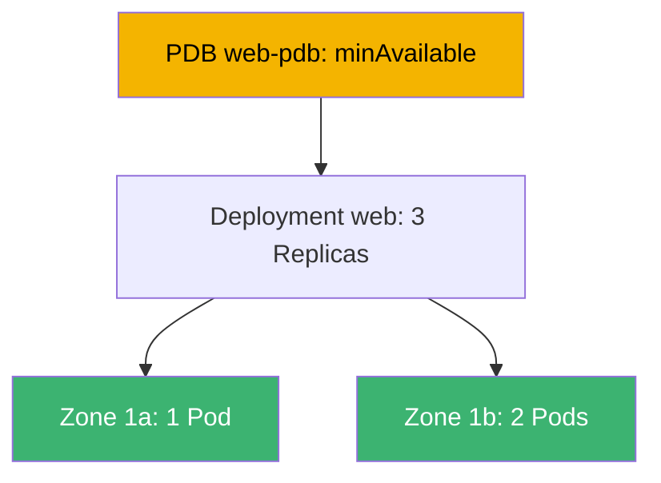
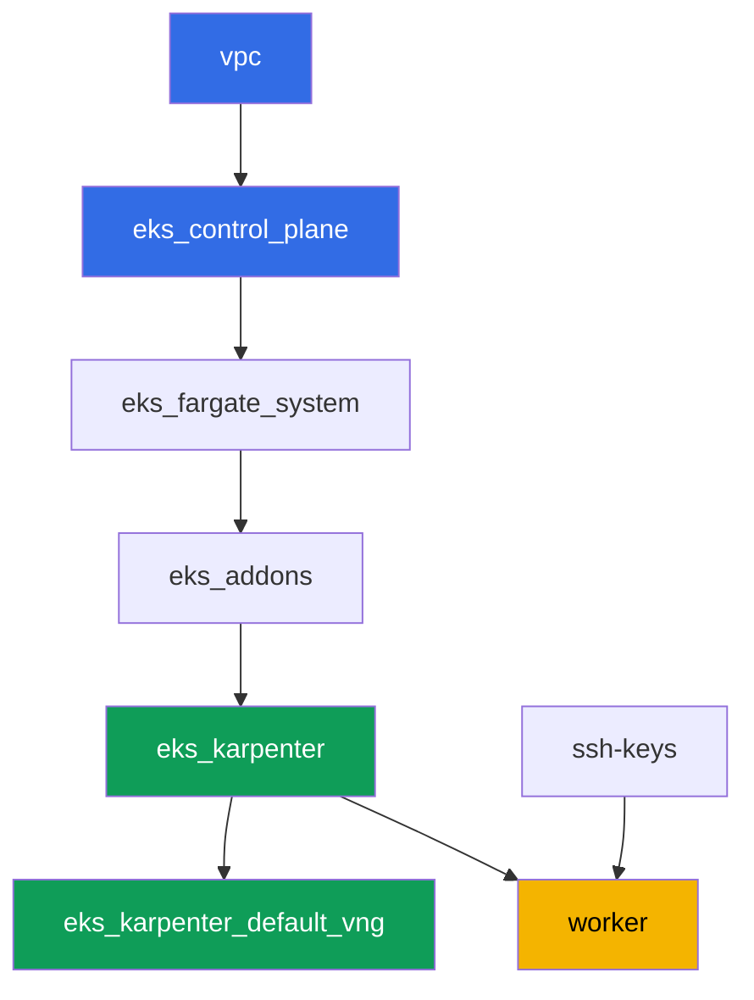

[Русская версия](README_RU.MD) · [Eng version](README.MD) · [Versión en español](README_ES.MD) · [Version française](README_FR.MD) · [ქართული ვერსია](README_GE.MD) · [繁體中文版](README_TW.MD) · [日本語版](README_JP.MD)

# Lab 131 - Zuverlässigkeit: PDB blockiert drain, topology spread, matchLabelKeys

## Beschreibung

Ein Cluster bleibt nur so lange am Leben, wie der Betrieb läuft: Control-Plane-Updates,
Knotenaustausch, Anwendungsupdates. Dieses Lab behandelt vier Mechanismen, die entscheiden,
ob die Workload eine geplante Wartung überlebt. Sie werden ein Deployment mit
`topologySpreadConstraints` über Zonen verteilen, ein klassisches Symptom reproduzieren -
ein zu strenges `PodDisruptionBudget`, das `kubectl drain` dauerhaft blockiert - und es
beheben. Danach fügen Sie `unhealthyPodEvictionPolicy: AlwaysAllow` hinzu, damit ein
kaputter Pod drain nicht ewig aufhalten kann, und führen ein Rolling Update durch, wobei Sie
prüfen, dass die neue Revision selbst innerhalb von `maxSkew` über die Zonen verteilt
bleibt.

Die Aufgaben sind im Produktionsstil geschrieben: eine kurze Aufgabenstellung plus
Abnahmekriterien. Die Prüfung ist automatisch, über den Befehl `check_result`.

## Ziel

Den Stoff des Kurskapitels vertiefen:

- [Kapitel 40. Zuverlässigkeit: Multi-AZ, PDB, topology spread](../../course/40/ru.md) -
  korrektes Abschalten von Knoten

## Was wir erstellen

| Objekt | Was es ist | Wozu in diesem Lab |
|--------|---------|-------------------|
| Namespace `eks-131` | ein Cluster-Bereich für die Workload des Labs | hält Ressourcen getrennt von Systemressourcen |
| Deployment `web` (3 Replicas) | eine ping_pong-Anwendung mit topology spread | Verteilung über Zonen via `matchLabelKeys` |
| PDB `web-pdb` | Budget für freiwillige Unterbrechungen | blockiert drain zunächst, wird dann korrigiert |
| Artefakt `drain_blocked.txt` | ein hängender drain und eine Erklärung | hält das Symptom eines strengen `minAvailable` fest |
| Artefakt `drain_ok.txt` | ein erfolgreicher drain nach Lockerung des PDB | bestätigt die Korrektur |
| Artefakt `unhealthy_policy.txt` | eine Erklärung von `AlwaysAllow` | ein ungesunder Pod blockiert drain nicht ewig |
| Artefakt `rollout.txt` | ein erfolgreiches Rolling Update | `matchLabelKeys` lässt alte Pods nicht stören |

Das Gesamtbild der Workload des Labs:



## Infrastruktur

Die Umgebung wird in AWS (`eu-central-1`) über Terragrunt bereitgestellt. Jedes
Lab-Verzeichnis ist eine Komponente mit eigenem `terragrunt.hcl`, das auf ein gemeinsames
Modul in `terraform/modules/` verweist und Abhängigkeiten über `dependency`-Blöcke
deklariert. Terragrunt baut den Abhängigkeitsgraphen und wendet die Komponenten in der
richtigen Reihenfolge an. Ein separater NodePool für Zonen ist nicht nötig: der Cluster ist
bereits in zwei AZs bereitgestellt (`eu-central-1a`, `eu-central-1b`), das reicht für
topology spread.

### Module und Abhängigkeiten

| Verzeichnis (Komponente) | Modul (`terraform/modules/`) | Abhängig von | Was erstellt wird |
|---------------------|-------------------------------|------------|-------------|
| `vpc` | `vpc_v3` | - | VPC `10.10.0.0/16`, öffentliche und private Subnetze in zwei AZs, NAT |
| `ssh-keys` | `ssh-keys` | - | ein SSH-Schlüsselpaar für die Arbeitsmaschine und die Knoten |
| `eks_control_plane` | `eks_v2_control_plane` | `vpc` | EKS-Control-Plane `1.36`, OIDC, Security Groups |
| `eks_fargate_system` | `eks_v2_fargate` | `vpc`, `eks_control_plane` | Fargate-Profil für `kube-system` und `karpenter` |
| `eks_addons` | `eks_v2_addons` | `eks_control_plane`, `eks_fargate_system` | Addons coredns, kube-proxy, vpc-cni, pod-identity |
| `eks_karpenter` | `eks_v2_karpenter` | `vpc`, `eks_control_plane`, `eks_addons`, `eks_fargate_system` | Karpenter-Controller, IAM-Rolle der Knoten |
| `eks_karpenter_default_vng` | `eks_v2_karpenter_vng` | `vpc`, `eks_control_plane`, `eks_karpenter` | Standard-NodePool `default` in zwei AZs |
| `worker` | `eks_v2_work_pc` | `ssh-keys`, `vpc`, `eks_control_plane`, `eks_karpenter` | Arbeitsmaschine mit kubectl, Tests und `check_result` |

Abhängigkeitsgraph (was früher angewendet wird, steht weiter unten am Pfeil):



Systemische Pods laufen auf Fargate, die Arbeitsknoten werden von Karpenter in zwei Zonen
hochgefahren - das ist genau die Fehlerdomäne, die die Topologie des Labs nutzt.

### Wo was konfiguriert wird

Die Einstellungen sind auf zwei Ebenen verteilt: das gemeinsame `env.hcl` und die `inputs`
jeder Komponente.

`env.hcl` (gemeinsame Umgebungsparameter, von allen Komponenten gelesen):

| Parameter | Wert im Lab | Was er beeinflusst |
|----------|-----------------|---------------|
| `region` | `eu-central-1` | Region aller Ressourcen |
| `vpc_default_cidr`, `subnets` | `10.10.0.0/16`, Subnetze pro AZ | Adressplan der VPC und Zonen für topology spread |
| `prefix` | `eks-task131` | Präfix für Ressourcen- und Tag-Namen |
| `stack_name` | `eks131` | daraus wird `env_name` gebildet - der Clustername |
| `k8_version` | `1.36.0` | kubectl-Version auf der Arbeitsmaschine |
| `instance_type_worker` | `t3.medium` | Instanztyp der Arbeitsmaschine |
| `ssh_password_enable`, `access_cidrs` | `true`, `0.0.0.0/0` | SSH-Zugang zur Arbeitsmaschine |
| `root_volume` | `gp3`, `10` | Root-Datenträger der Arbeitsmaschine |

`inputs` in `terragrunt.hcl` jeder Komponente (Einstellungen des konkreten Moduls):

| Datei | Wichtige Einstellungen |
|------|--------------------|
| `eks_control_plane/terragrunt.hcl` | `eks.version = "1.36"`, private Subnetze für Knoten in zwei AZs |
| `eks_addons/terragrunt.hcl` | Addon-Versionen für 1.36: kube-proxy, coredns, vpc-cni, pod-identity |
| `eks_fargate_system/terragrunt.hcl` | Namespace-Selektoren für Fargate (`kube-system`, `karpenter`) |
| `eks_karpenter/terragrunt.hcl` | Karpenter-Version `1.8.1`, Controller-Ressourcen |
| `eks_karpenter_default_vng/terragrunt.hcl` | `requirements` des NodePool (Arch, Spot/On-Demand, Typen) |
| `worker/terragrunt.hcl` | `test_url` und `task_script_url` zu den Dateien von Lab 131, `exam_time_minutes` |

Regel: Parameter, die für das ganze Lab gemeinsam sind (Region, Netzwerk, Versionen,
Präfixe), leben in `env.hcl`; Einstellungen eines konkreten Moduls stehen in `inputs`
seines `terragrunt.hcl`.

## Bereitstellung

```bash
TASK=131 make run_eks_task
```

Die Bereitstellung dauert etwa 15-20 Minuten. Suchen Sie in der Ausgabe die Zeile mit der
SSH-Verbindung zur Arbeitsmaschine und verbinden Sie sich damit. kubectl ist dort bereits
auf den richtigen Cluster konfiguriert.

Nützliche Befehle auf der Arbeitsmaschine:

```bash
time_left       # wie viel Umgebungszeit verbleibt
check_result    # die Lösung prüfen
```

> Sicherheit des Testaufbaus. In `env.hcl` sind `ssh_password_enable = true` und
> `access_cidrs = ["0.0.0.0/0"]` aktiviert - praktisch für eine Trainingsumgebung, aber so
> sollte man es in der Produktion nicht machen. Nach den Standards des Kurses wird der
> Zugang zu Arbeitsmaschinen über AWS SSM Session Manager ohne öffentliche SSH-Ports nach
> außen geöffnet, und `access_cidrs` werden auf konkrete Adressen eingeschränkt. Hier bleibt
> öffentliches SSH nur der Einfachheit des Starts halber bestehen.

## Aufgaben

---
|        **1**        | **Namespace für die Workload des Labs**                             |
| :-----------------: | :---------------------------------------------------------- |
| Was zu tun ist          | Erstellen Sie einen Namespace mit dem Namen `eks-131`. Alle Objekte des Labs werden darin erstellt. |
| Abnahmekriterien    | - Namespace `eks-131` existiert. |
---
|        **2**        | **Deployment mit Verteilung über Zonen**                        |
| :-----------------: | :---------------------------------------------------------- |
| Was zu tun ist          | Erstellen Sie im Namespace `eks-131` das Deployment `web`, Image `viktoruj/ping_pong:latest`, `3` Replicas. Fügen Sie dem Pod-Template `topologySpreadConstraints` hinzu: `maxSkew: 1`, `topologyKey: topology.kubernetes.io/zone`, `whenUnsatisfiable: DoNotSchedule`, `labelSelector.matchLabels: {app: web}`, `matchLabelKeys: [pod-template-hash]`. Warten Sie auf `3` bereite Replicas, verteilt auf mindestens zwei Zonen. Verteilung prüfen: `kubectl get pods -n eks-131 -o wide` und das Zonen-Label des Knotens `kubectl get nodes -L topology.kubernetes.io/zone`. |
| Abnahmekriterien    | - Deployment `web` in `eks-131`, Image `viktoruj/ping_pong`, `3` bereite Replicas;<br/>- in der Pod-Spezifikation sind `topologySpreadConstraints` mit den angegebenen Feldern gesetzt;<br/>- die Replicas laufen auf Knoten in mindestens zwei verschiedenen Zonen. |
---
|        **3**        | **Symptom: ein zu strenges PDB blockiert drain**            |
| :-----------------: | :---------------------------------------------------------- |
| Was zu tun ist          | Erstellen Sie ein `PodDisruptionBudget` `web-pdb` in `eks-131` mit `minAvailable: 3` (gleich der Anzahl der `web`-Replicas) und `selector.matchLabels: {app: web}`. Nehmen Sie den Knoten einer der `web`-Replicas und führen Sie `kubectl drain <knoten> --ignore-daemonsets --delete-emptydir-data --timeout=60s` aus. Der Befehl muss mit Timeout fehlschlagen: das Budget erlaubt keine Eviction eines einzigen Pods. Speichern Sie die Befehlsausgabe in `/var/work/tests/artifacts/3/drain_blocked.txt` und fügen Sie dort eine Erklärung hinzu (Wörter `PDB` und `minAvailable`), warum ein `minAvailable` gleich der Anzahl der Replicas jedes drain blockiert. |
| Abnahmekriterien    | - PDB `web-pdb` existiert;<br/>- die Datei `/var/work/tests/artifacts/3/drain_blocked.txt` ist nicht leer und enthält `PDB` und `minAvailable`. |
---
|        **4**        | **Korrektur: PDB lockern und drain wiederholen**                |
| :-----------------: | :---------------------------------------------------------- |
| Was zu tun ist          | Bringen Sie den Knoten aus Aufgabe 3 zurück in Betrieb (`kubectl uncordon`). Lockern Sie `web-pdb` auf `minAvailable: 2`. Wiederholen Sie `kubectl drain` auf demselben Knoten - die Eviction sollte nun erfolgreich sein (eine Replica wird evakuiert, der Ersatz erscheint auf einem anderen Knoten). Speichern Sie die Bestätigung (die Ausgabe des erfolgreichen drain und das aktuelle `kubectl get pdb web-pdb -n eks-131`) in der Datei `/var/work/tests/artifacts/4/drain_ok.txt`. |
| Abnahmekriterien    | - `web-pdb` hat `minAvailable: 2`;<br/>- die Datei `/var/work/tests/artifacts/4/drain_ok.txt` ist nicht leer. |
---
|        **5**        | **unhealthyPodEvictionPolicy: AlwaysAllow**                 |
| :-----------------: | :---------------------------------------------------------- |
| Was zu tun ist          | Fügen Sie `web-pdb` das Feld `unhealthyPodEvictionPolicy: AlwaysAllow` hinzu (über `kubectl patch` oder Neuerstellung). Prüfen Sie den Wert: `kubectl get pdb web-pdb -n eks-131 -o jsonpath='{.spec.unhealthyPodEvictionPolicy}'`. Speichern Sie in `/var/work/tests/artifacts/5/unhealthy_policy.txt` eine Erklärung, warum dies nötig ist: ohne `AlwaysAllow` (also bei der Standardpolicy `IfHealthyBudget`) blockiert ein kaputter Pod, der in `crashloopbackoff` hängt, selbst die Budgetberechnung und kann drain für immer blockieren (Wörter `AlwaysAllow` und `crashloopbackoff`). |
| Abnahmekriterien    | - `web-pdb` hat `unhealthyPodEvictionPolicy: AlwaysAllow`;<br/>- die Datei `/var/work/tests/artifacts/5/unhealthy_policy.txt` ist nicht leer und enthält die nötigen Wörter. |
---
|        **6**        | **Rolling Update ohne hängende Pending**                     |
| :-----------------: | :---------------------------------------------------------- |
| Was zu tun ist          | Aktualisieren Sie das Deployment `web`, sodass eine neue Revision entsteht (zum Beispiel `kubectl set env deployment/web -n eks-131 RELEASE=v2`). Warten Sie auf `kubectl rollout status deployment/web -n eks-131` ohne hängende `Pending`-Pods und prüfen Sie, dass die Pods der NEUEN Revision (gleicher `pod-template-hash`) weiterhin innerhalb von `maxSkew: 1` über die Zonen verteilt sind. Speichern Sie die Ausgabe von `rollout status` in der Datei `/var/work/tests/artifacts/6/rollout.txt`. Was `matchLabelKeys: [pod-template-hash]` hier tut: es fügt dem Skew-Selektor das Revisions-Label hinzu, sodass der Scheduler die Verteilung NUR unter den Pods seiner eigenen Revision zählt, nicht zusammen mit den abziehenden alten. Eine ehrliche Anmerkung: auf diesem Testaufbau geht der Rollout auch ohne `matchLabelKeys` durch (geprüft) - zwei Zonen, drei Replicas und Karpenter, der für jedes `Pending` einen Knoten hinzufügt. Der Unterschied zeigt sich dort, wo der Pool statisch ist, es mehr als zwei Zonen gibt und die alten Replicas ungleichmäßig verteilt sind: dann lässt der über beide Revisionen zusammen berechnete Skew dem neuen Pod keinen Platz, und er wartet auf die Entfernung des alten. |
| Abnahmekriterien    | - alle `3` Replicas von `web` sind bereit und aktualisiert;<br/>- kein `web`-Pod ist `Pending`;<br/>- der Skew der Pods der neuen Revision über die Zonen ist nicht größer als `1`;<br/>- die Datei `/var/work/tests/artifacts/6/rollout.txt` ist nicht leer und bestätigt einen erfolgreichen Rollout. |
---

## Prüfung des Ergebnisses

Führen Sie auf der Arbeitsmaschine die automatische Prüfung aus:

```bash
check_result
```

Das Skript führt die Tests aus und zeigt den Prozentsatz der abgeschlossenen Aufgaben.

## Lösung

Musterlösung: [worker/files/solutions/1_DE.MD](worker/files/solutions/1_DE.MD)

## Löschen des Clusters und der Ressourcen

> **Entfernen Sie zuerst das PDB und die Workload.** Das Budget `web-pdb` begrenzt
> freiwillige Unterbrechungen, was auch die korrekte Eviction von Pods beim Draining von
> Knoten verlangsamt. Wenn Sie den Testaufbau mit laufender Workload löschen, verschwindet
> der Karpenter-EC2-Knoten zusammen mit dem Cluster, aber das sekundäre ENI von VPC CNI
> bleibt im Zustand `available` und hält die Security Group des Knotens - `destroy` hängt
> daran fest. Reihenfolge: zuerst das PDB, dann der Namespace, dann warten wir auf das
> Verschwinden der EC2-Knoten.

```bash
kubectl delete pdb web-pdb -n eks-131 --ignore-not-found
kubectl delete namespace eks-131 --ignore-not-found

while kubectl get nodes --no-headers 2>/dev/null | grep -qv fargate; do
  echo "Karpenter-EC2-Knoten noch am Leben, warten..."; sleep 15
done
kubectl get nodes --no-headers
```

Wenn Sie im Laufe des Labs einen Knoten cordoned gelassen haben (`kubectl drain` ohne
anschließendes `uncordon`), stört das die Löschung nicht: Karpenter terminiert den leeren
Knoten trotzdem.

```bash
TASK=131 make delete_eks_task
```

Wenn `destroy` trotzdem an der Security Group des Knotens hängen bleibt, suchen Sie nach
einem verwaisten ENI:

```bash
aws ec2 describe-network-interfaces --filters Name=status,Values=available \
  --query 'NetworkInterfaces[].[NetworkInterfaceId,Description]' --output table
aws ec2 delete-network-interface --network-interface-id <eni-id>
```
