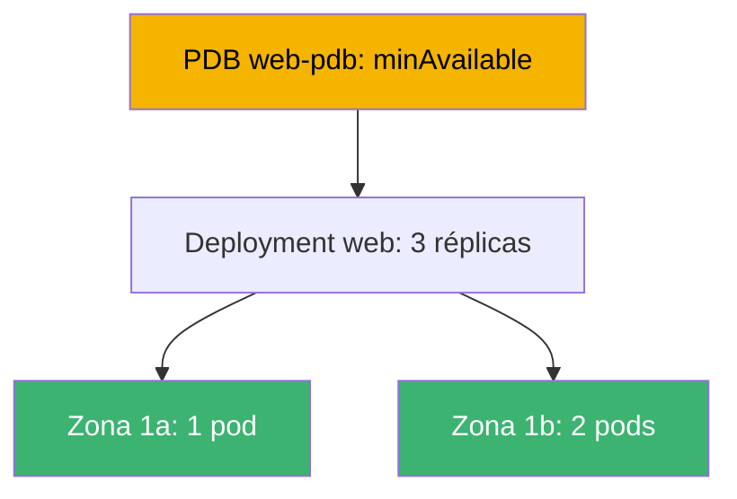
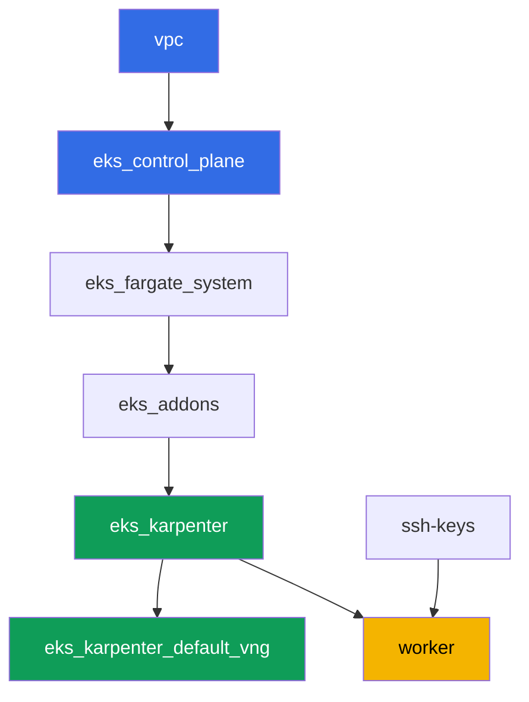

[Русская версия](README_RU.MD) · [Eng version](README.MD) · [Version française](README_FR.MD) · [Deutsche Version](README_DE.MD) · [ქართული ვერსია](README_GE.MD) · [繁體中文版](README_TW.MD) · [日本語版](README_JP.MD)

# Laboratorio 131 - Fiabilidad: el PDB bloquea drain, topology spread, matchLabelKeys

## Descripción

Un cluster se mantiene vivo mientras dura la operación: actualizaciones del control plane,
reemplazo de nodos, actualizaciones de aplicaciones. Este laboratorio trabaja cuatro
mecanismos que determinan si la carga sobrevive al mantenimiento planificado. Repartirás un
Deployment entre zonas con `topologySpreadConstraints`, reproducirás un síntoma clásico -
un `PodDisruptionBudget` demasiado estricto que bloquea `kubectl drain` para siempre - y lo
arreglarás. Luego añadirás `unhealthyPodEvictionPolicy: AlwaysAllow` para que un pod roto no
pueda retener drain indefinidamente, y harás un rolling update, comprobando que la nueva
revisión queda repartida entre zonas dentro de `maxSkew` por sí misma.

Las tareas están escritas en estilo de producción: un enunciado breve más criterios de
aceptación. La verificación es automática, con el comando `check_result`.

## Objetivo

Reforzar el material del capítulo del curso:

- [Capítulo 40. Fiabilidad: multi-AZ, PDB, topology spread](../../course/40/ru.md) -
  desconexión correcta de nodos

## Qué creamos

| Objeto | Qué es | Para qué sirve en este laboratorio |
|--------|---------|-------------------|
| Namespace `eks-131` | una sección del cluster para la carga del laboratorio | mantiene los recursos separados de los del sistema |
| Deployment `web` (3 réplicas) | una aplicación ping_pong con topology spread | reparto entre zonas mediante `matchLabelKeys` |
| PDB `web-pdb` | presupuesto de interrupciones voluntarias | primero bloquea drain, luego se corrige |
| Artefacto `drain_blocked.txt` | un drain atascado y una explicación | registra el síntoma de un `minAvailable` estricto |
| Artefacto `drain_ok.txt` | un drain exitoso tras relajar el PDB | confirma la corrección |
| Artefacto `unhealthy_policy.txt` | una explicación de `AlwaysAllow` | un pod no saludable no bloquea drain para siempre |
| Artefacto `rollout.txt` | un rolling update exitoso | `matchLabelKeys` evita que los pods viejos estorben |

El panorama general de la carga del laboratorio:



## Infraestructura

El entorno se despliega en AWS (`eu-central-1`) mediante Terragrunt. Cada directorio del
laboratorio es un componente con su propio `terragrunt.hcl`, que hace referencia a un módulo
compartido en `terraform/modules/` y declara dependencias mediante bloques `dependency`.
Terragrunt construye el grafo de dependencias y aplica los componentes en el orden correcto.
No hace falta un NodePool separado para las zonas: el cluster ya está desplegado en dos AZ
(`eu-central-1a`, `eu-central-1b`), lo cual basta para el topology spread.

### Módulos y dependencias

| Directorio (componente) | Módulo (`terraform/modules/`) | Depende de | Qué crea |
|---------------------|-------------------------------|------------|-------------|
| `vpc` | `vpc_v3` | - | VPC `10.10.0.0/16`, subredes públicas y privadas en dos AZ, NAT |
| `ssh-keys` | `ssh-keys` | - | un par de claves SSH para la máquina de trabajo y los nodos |
| `eks_control_plane` | `eks_v2_control_plane` | `vpc` | control plane de EKS `1.36`, OIDC, security groups |
| `eks_fargate_system` | `eks_v2_fargate` | `vpc`, `eks_control_plane` | perfil de Fargate para `kube-system` y `karpenter` |
| `eks_addons` | `eks_v2_addons` | `eks_control_plane`, `eks_fargate_system` | addons coredns, kube-proxy, vpc-cni, pod-identity |
| `eks_karpenter` | `eks_v2_karpenter` | `vpc`, `eks_control_plane`, `eks_addons`, `eks_fargate_system` | controlador de Karpenter, rol IAM de nodos |
| `eks_karpenter_default_vng` | `eks_v2_karpenter_vng` | `vpc`, `eks_control_plane`, `eks_karpenter` | NodePool por defecto `default` en dos AZ |
| `worker` | `eks_v2_work_pc` | `ssh-keys`, `vpc`, `eks_control_plane`, `eks_karpenter` | máquina de trabajo con kubectl, tests y `check_result` |

Grafo de dependencias (lo que se aplica antes está más abajo en la flecha):



Los pods del sistema van a Fargate, los nodos de trabajo los levanta Karpenter en dos zonas
- este es el dominio de fallo que usa la topología del laboratorio.

### Dónde se configura cada cosa

Los ajustes se reparten en dos niveles: el `env.hcl` común y los `inputs` de cada componente.

`env.hcl` (parámetros comunes del entorno, leídos por todos los componentes):

| Parámetro | Valor en el laboratorio | A qué afecta |
|----------|-----------------|---------------|
| `region` | `eu-central-1` | región de todos los recursos |
| `vpc_default_cidr`, `subnets` | `10.10.0.0/16`, subredes por AZ | plan de direcciones de la VPC y zonas para topology spread |
| `prefix` | `eks-task131` | prefijo de nombres de recursos y etiquetas |
| `stack_name` | `eks131` | a partir de él se compone `env_name` - el nombre del cluster |
| `k8_version` | `1.36.0` | versión de kubectl en la máquina de trabajo |
| `instance_type_worker` | `t3.medium` | tipo de instancia de la máquina de trabajo |
| `ssh_password_enable`, `access_cidrs` | `true`, `0.0.0.0/0` | acceso SSH a la máquina de trabajo |
| `root_volume` | `gp3`, `10` | disco raíz de la máquina de trabajo |

`inputs` en el `terragrunt.hcl` de cada componente (ajustes del módulo concreto):

| Archivo | Ajustes clave |
|------|--------------------|
| `eks_control_plane/terragrunt.hcl` | `eks.version = "1.36"`, subredes privadas para nodos en dos AZ |
| `eks_addons/terragrunt.hcl` | versiones de addons para 1.36: kube-proxy, coredns, vpc-cni, pod-identity |
| `eks_fargate_system/terragrunt.hcl` | selectores de namespace para Fargate (`kube-system`, `karpenter`) |
| `eks_karpenter/terragrunt.hcl` | versión de Karpenter `1.8.1`, recursos del controlador |
| `eks_karpenter_default_vng/terragrunt.hcl` | `requirements` del NodePool (arch, spot/on-demand, tipos) |
| `worker/terragrunt.hcl` | `test_url` y `task_script_url` hacia los archivos del laboratorio 131, `exam_time_minutes` |

Regla: los parámetros comunes a todo el laboratorio (región, red, versiones, prefijos) viven
en `env.hcl`; los ajustes de un módulo concreto van en `inputs` de su `terragrunt.hcl`.

## Despliegue

```bash
TASK=131 make run_eks_task
```

El despliegue tarda aproximadamente 15-20 minutos. En la salida busca la línea con la
conexión SSH a la máquina de trabajo y conéctate a ella. kubectl ya está configurado allí
para el cluster correcto.

Comandos útiles en la máquina de trabajo:

```bash
time_left       # cuánto tiempo de entorno queda
check_result    # verificar la solución
```

> Seguridad del entorno. En `env.hcl` están activados `ssh_password_enable = true` y
> `access_cidrs = ["0.0.0.0/0"]` - cómodo para un entorno de formación, pero no debe hacerse
> así en producción. Según los estándares del curso, el acceso a las máquinas de trabajo se
> abre mediante AWS SSM Session Manager sin puertos SSH públicos hacia fuera, y
> `access_cidrs` se restringe a direcciones concretas. Aquí se deja SSH público solo por
> simplicidad de arranque.

## Tareas

---
|        **1**        | **Namespace para la carga del laboratorio**                             |
| :-----------------: | :---------------------------------------------------------- |
| Qué hacer          | Crea un namespace llamado `eks-131`. Todos los objetos del laboratorio se crean dentro de él. |
| Criterios de aceptación    | - el namespace `eks-131` existe. |
---
|        **2**        | **Deployment repartido entre zonas**                        |
| :-----------------: | :---------------------------------------------------------- |
| Qué hacer          | En el namespace `eks-131` crea el Deployment `web`, imagen `viktoruj/ping_pong:latest`, `3` réplicas. Añade al template del pod `topologySpreadConstraints`: `maxSkew: 1`, `topologyKey: topology.kubernetes.io/zone`, `whenUnsatisfiable: DoNotSchedule`, `labelSelector.matchLabels: {app: web}`, `matchLabelKeys: [pod-template-hash]`. Espera `3` réplicas listas repartidas en al menos dos zonas. Comprueba el reparto con `kubectl get pods -n eks-131 -o wide` y la etiqueta de zona del nodo `kubectl get nodes -L topology.kubernetes.io/zone`. |
| Criterios de aceptación    | - Deployment `web` en `eks-131`, imagen `viktoruj/ping_pong`, `3` réplicas listas;<br/>- la especificación del pod tiene `topologySpreadConstraints` con los campos indicados;<br/>- las réplicas están en nodos de al menos dos zonas distintas. |
---
|        **3**        | **Síntoma: un PDB demasiado estricto bloquea drain**            |
| :-----------------: | :---------------------------------------------------------- |
| Qué hacer          | Crea un `PodDisruptionBudget` `web-pdb` en `eks-131` con `minAvailable: 3` (igual al número de réplicas de `web`) y `selector.matchLabels: {app: web}`. Toma el nodo de una de las réplicas de `web` y ejecuta `kubectl drain <nodo> --ignore-daemonsets --delete-emptydir-data --timeout=60s`. El comando debe fallar por timeout: el presupuesto no permite retirar ni un pod. Guarda la salida del comando en `/var/work/tests/artifacts/3/drain_blocked.txt` y añade allí una explicación (palabras `PDB` y `minAvailable`) de por qué un `minAvailable` igual al número de réplicas bloquea cualquier drain. |
| Criterios de aceptación    | - el PDB `web-pdb` existe;<br/>- el archivo `/var/work/tests/artifacts/3/drain_blocked.txt` no está vacío y contiene `PDB` y `minAvailable`. |
---
|        **4**        | **Corrección: relajamos el PDB y repetimos drain**                |
| :-----------------: | :---------------------------------------------------------- |
| Qué hacer          | Devuelve a servicio el nodo de la tarea 3 (`kubectl uncordon`). Relaja `web-pdb` a `minAvailable: 2`. Repite `kubectl drain` en el mismo nodo - ahora la expulsión debe completarse con éxito (una réplica se expulsa, el reemplazo aparece en otro nodo). Guarda la confirmación (la salida del drain exitoso y el `kubectl get pdb web-pdb -n eks-131` actual) en el archivo `/var/work/tests/artifacts/4/drain_ok.txt`. |
| Criterios de aceptación    | - `web-pdb` tiene `minAvailable: 2`;<br/>- el archivo `/var/work/tests/artifacts/4/drain_ok.txt` no está vacío. |
---
|        **5**        | **unhealthyPodEvictionPolicy: AlwaysAllow**                 |
| :-----------------: | :---------------------------------------------------------- |
| Qué hacer          | Añade a `web-pdb` el campo `unhealthyPodEvictionPolicy: AlwaysAllow` (mediante `kubectl patch` o recreación). Comprueba el valor: `kubectl get pdb web-pdb -n eks-131 -o jsonpath='{.spec.unhealthyPodEvictionPolicy}'`. Guarda en `/var/work/tests/artifacts/5/unhealthy_policy.txt` una explicación de por qué es necesario: sin `AlwaysAllow` (es decir, con la política por defecto `IfHealthyBudget`) un pod roto atascado en `CrashLoopBackOff` bloquea por sí mismo el cálculo del presupuesto y puede bloquear drain para siempre (palabras `AlwaysAllow` y `CrashLoopBackOff`). |
| Criterios de aceptación    | - `web-pdb` tiene `unhealthyPodEvictionPolicy: AlwaysAllow`;<br/>- el archivo `/var/work/tests/artifacts/5/unhealthy_policy.txt` no está vacío y contiene las palabras necesarias. |
---
|        **6**        | **Rolling update sin Pending atascados**                     |
| :-----------------: | :---------------------------------------------------------- |
| Qué hacer          | Actualiza el Deployment `web` para que aparezca una nueva revisión (por ejemplo `kubectl set env deployment/web -n eks-131 RELEASE=v2`). Espera `kubectl rollout status deployment/web -n eks-131` sin pods `Pending` atascados y comprueba que los pods de la NUEVA revisión (mismo `pod-template-hash`) siguen repartidos entre zonas dentro de `maxSkew: 1`. Guarda la salida de `rollout status` en el archivo `/var/work/tests/artifacts/6/rollout.txt`. Qué hace aquí `matchLabelKeys: [pod-template-hash]`: añade al selector del skew la etiqueta de revisión, así que el planificador cuenta la distribución SOLO entre los pods de su propia revisión, no junto con los viejos que se están retirando. Una aclaración honesta: en este entorno el rollout también pasa sin `matchLabelKeys` (comprobado) - dos zonas, tres réplicas y Karpenter, que añadirá un nodo para cualquier `Pending`. La diferencia se nota donde el parque es estático, hay más de dos zonas y las réplicas viejas están mal repartidas: entonces el skew contado sobre ambas revisiones a la vez no deja sitio al pod nuevo, y este espera a que se elimine el viejo. |
| Criterios de aceptación    | - las `3` réplicas de `web` están listas y actualizadas;<br/>- ningún pod `web` está `Pending`;<br/>- el skew de los pods de la nueva revisión entre zonas no es mayor que `1`;<br/>- el archivo `/var/work/tests/artifacts/6/rollout.txt` no está vacío y confirma un rollout exitoso. |
---

## Verificación del resultado

En la máquina de trabajo, ejecuta la verificación automática:

```bash
check_result
```

El script ejecuta los tests y muestra el porcentaje de tareas completadas.

## Solución

Solución de referencia: [worker/files/solutions/1_ES.MD](worker/files/solutions/1_ES.MD)

## Eliminación del cluster y los recursos

> **Primero retira el PDB y la carga.** El presupuesto `web-pdb` limita las interrupciones
> voluntarias, es decir, también ralentiza la expulsión correcta de pods al drenar nodos. Si
> se elimina el entorno con carga viva, el nodo EC2 de Karpenter se va junto con el cluster,
> pero el ENI secundario de VPC CNI queda en estado `available` y retiene el security group
> del nodo - `destroy` se queda atascado en él. Orden: primero el PDB, luego el namespace,
> luego se espera a que desaparezcan los nodos EC2.

```bash
kubectl delete pdb web-pdb -n eks-131 --ignore-not-found
kubectl delete namespace eks-131 --ignore-not-found

while kubectl get nodes --no-headers 2>/dev/null | grep -qv fargate; do
  echo "El nodo EC2 de Karpenter todavía está vivo, esperando..."; sleep 15
done
kubectl get nodes --no-headers
```

Si durante el laboratorio dejaste un nodo cordoned (`kubectl drain` sin el `uncordon`
posterior), eso no impide la eliminación: Karpenter termina igualmente el nodo vacío.

```bash
TASK=131 make delete_eks_task
```

Si `destroy` sigue atascado en el security group del nodo, busca un ENI huérfano:

```bash
aws ec2 describe-network-interfaces --filters Name=status,Values=available \
  --query 'NetworkInterfaces[].[NetworkInterfaceId,Description]' --output table
aws ec2 delete-network-interface --network-interface-id <eni-id>
```
