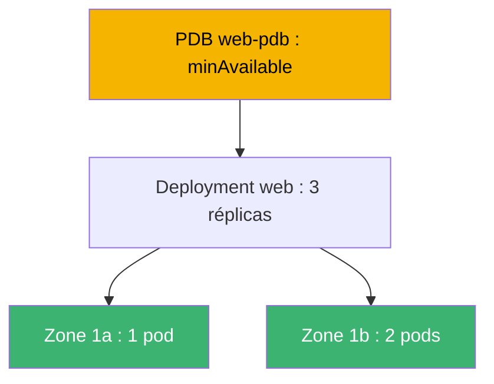
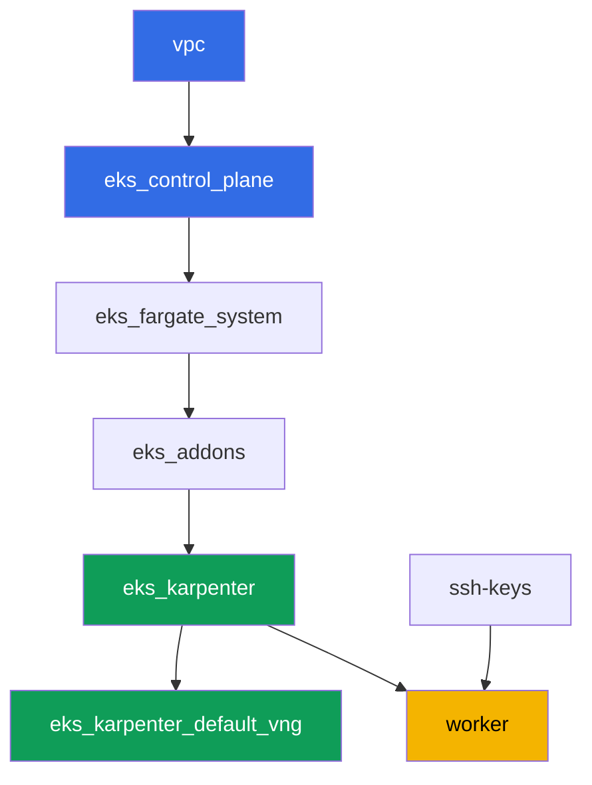

[Русская версия](README_RU.MD) · [Eng version](README.MD) · [Versión en español](README_ES.MD) · [Deutsche Version](README_DE.MD) · [ქართული ვერსია](README_GE.MD) · [繁體中文版](README_TW.MD) · [日本語版](README_JP.MD)

# Lab 131 - Fiabilité : le PDB bloque drain, topology spread, matchLabelKeys

## Description

Un cluster reste vivant tant que l'exploitation continue : mises à jour du control plane,
remplacement de nœuds, mises à jour des applications. Ce lab travaille quatre mécanismes
qui déterminent si la charge survit à une maintenance planifiée. Vous répartirez un
Deployment entre les zones avec `topologySpreadConstraints`, reproduirez un symptôme
classique - un `PodDisruptionBudget` trop strict qui bloque définitivement `kubectl
drain` - et le corrigerez. Vous ajouterez ensuite `unhealthyPodEvictionPolicy: AlwaysAllow`
pour qu'un pod cassé ne puisse pas retenir drain indéfiniment, puis effectuerez un rolling
update en vérifiant que la nouvelle révision reste répartie entre les zones dans les
limites de `maxSkew` par elle-même.

Les tâches sont écrites dans un style production : un énoncé court plus des critères
d'acceptation. La vérification est automatique, via la commande `check_result`.

## Objectif

Renforcer le contenu du chapitre du cours :

- [Chapitre 40. Fiabilité : multi-AZ, PDB, topology spread](../../course/40/fr.md) -
  arrêt correct des nœuds

## Ce que nous créons

| Objet | Ce que c'est | Pourquoi dans ce lab |
|--------|---------|-------------------|
| Namespace `eks-131` | une section du cluster pour la charge du lab | garde les ressources séparées des ressources système |
| Deployment `web` (3 réplicas) | une application ping_pong avec topology spread | répartition entre zones via `matchLabelKeys` |
| PDB `web-pdb` | budget de perturbations volontaires | bloque d'abord drain, puis est corrigé |
| Artefact `drain_blocked.txt` | un drain bloqué et une explication | consigne le symptôme d'un `minAvailable` strict |
| Artefact `drain_ok.txt` | un drain réussi après assouplissement du PDB | confirme la correction |
| Artefact `unhealthy_policy.txt` | une explication de `AlwaysAllow` | un pod non sain ne bloque pas drain pour toujours |
| Artefact `rollout.txt` | un rolling update réussi | `matchLabelKeys` empêche les anciens pods de gêner |

Le tableau d'ensemble de la charge du lab :



## Infrastructure

L'environnement est déployé sur AWS (`eu-central-1`) via Terragrunt. Chaque répertoire du
lab est un composant avec son propre `terragrunt.hcl`, qui référence un module partagé dans
`terraform/modules/` et déclare des dépendances via des blocs `dependency`. Terragrunt
construit le graphe de dépendances et applique les composants dans le bon ordre. Aucun
NodePool séparé pour les zones n'est nécessaire : le cluster est déjà déployé sur deux AZ
(`eu-central-1a`, `eu-central-1b`), ce qui suffit pour le topology spread.

### Modules et dépendances

| Répertoire (composant) | Module (`terraform/modules/`) | Dépend de | Ce qu'il crée |
|---------------------|-------------------------------|------------|-------------|
| `vpc` | `vpc_v3` | - | VPC `10.10.0.0/16`, sous-réseaux publics et privés sur deux AZ, NAT |
| `ssh-keys` | `ssh-keys` | - | une paire de clés SSH pour la machine de travail et les nœuds |
| `eks_control_plane` | `eks_v2_control_plane` | `vpc` | control plane EKS `1.36`, OIDC, security groups |
| `eks_fargate_system` | `eks_v2_fargate` | `vpc`, `eks_control_plane` | profil Fargate pour `kube-system` et `karpenter` |
| `eks_addons` | `eks_v2_addons` | `eks_control_plane`, `eks_fargate_system` | addons coredns, kube-proxy, vpc-cni, pod-identity |
| `eks_karpenter` | `eks_v2_karpenter` | `vpc`, `eks_control_plane`, `eks_addons`, `eks_fargate_system` | contrôleur Karpenter, rôle IAM des nœuds |
| `eks_karpenter_default_vng` | `eks_v2_karpenter_vng` | `vpc`, `eks_control_plane`, `eks_karpenter` | NodePool par défaut `default` sur deux AZ |
| `worker` | `eks_v2_work_pc` | `ssh-keys`, `vpc`, `eks_control_plane`, `eks_karpenter` | machine de travail avec kubectl, tests et `check_result` |

Graphe de dépendances (ce qui est appliqué en premier est plus bas dans la flèche) :



Les pods système vont sur Fargate, les nœuds de travail sont créés par Karpenter dans deux
zones - c'est précisément le domaine de panne qu'utilise la topologie du lab.

### Où chaque chose est configurée

Les réglages sont répartis sur deux niveaux : le `env.hcl` commun et les `inputs` de chaque
composant.

`env.hcl` (paramètres communs de l'environnement, lus par tous les composants) :

| Paramètre | Valeur dans le lab | Ce qu'il affecte |
|----------|-----------------|---------------|
| `region` | `eu-central-1` | région de toutes les ressources |
| `vpc_default_cidr`, `subnets` | `10.10.0.0/16`, sous-réseaux par AZ | plan d'adressage de la VPC et zones pour le topology spread |
| `prefix` | `eks-task131` | préfixe des noms de ressources et des tags |
| `stack_name` | `eks131` | permet de composer `env_name` - le nom du cluster |
| `k8_version` | `1.36.0` | version de kubectl sur la machine de travail |
| `instance_type_worker` | `t3.medium` | type d'instance de la machine de travail |
| `ssh_password_enable`, `access_cidrs` | `true`, `0.0.0.0/0` | accès SSH à la machine de travail |
| `root_volume` | `gp3`, `10` | disque racine de la machine de travail |

`inputs` dans le `terragrunt.hcl` de chaque composant (réglages du module spécifique) :

| Fichier | Réglages clés |
|------|--------------------|
| `eks_control_plane/terragrunt.hcl` | `eks.version = "1.36"`, sous-réseaux privés pour les nœuds sur deux AZ |
| `eks_addons/terragrunt.hcl` | versions des addons pour 1.36 : kube-proxy, coredns, vpc-cni, pod-identity |
| `eks_fargate_system/terragrunt.hcl` | sélecteurs de namespace pour Fargate (`kube-system`, `karpenter`) |
| `eks_karpenter/terragrunt.hcl` | version de Karpenter `1.8.1`, ressources du contrôleur |
| `eks_karpenter_default_vng/terragrunt.hcl` | `requirements` du NodePool (arch, spot/on-demand, types) |
| `worker/terragrunt.hcl` | `test_url` et `task_script_url` vers les fichiers du lab 131, `exam_time_minutes` |

Règle : les paramètres communs à tout le lab (région, réseau, versions, préfixes) vivent
dans `env.hcl` ; les réglages d'un module spécifique vont dans les `inputs` de son
`terragrunt.hcl`.

## Déploiement

```bash
TASK=131 make run_eks_task
```

Le déploiement prend environ 15-20 minutes. Dans la sortie, trouvez la ligne avec la
connexion SSH à la machine de travail et connectez-vous. kubectl y est déjà configuré sur
le bon cluster.

Commandes utiles sur la machine de travail :

```bash
time_left       # temps d'environnement restant
check_result    # vérifier la solution
```

> Sécurité du banc d'essai. Dans `env.hcl`, `ssh_password_enable = true` et
> `access_cidrs = ["0.0.0.0/0"]` sont activés - pratique pour un environnement de
> formation, mais à ne pas faire en production. Selon les standards du cours, l'accès aux
> machines de travail doit passer par AWS SSM Session Manager sans ports SSH publics
> ouverts vers l'extérieur, et `access_cidrs` doit être restreint à des adresses précises.
> Ici, le SSH public est laissé uniquement pour simplifier le démarrage.

## Tâches

---
|        **1**        | **Namespace pour la charge du lab**                             |
| :-----------------: | :---------------------------------------------------------- |
| Ce qu'il faut faire          | Créez un namespace nommé `eks-131`. Tous les objets du lab sont créés à l'intérieur. |
| Critères d'acceptation    | - le namespace `eks-131` existe. |
---
|        **2**        | **Deployment réparti entre les zones**                        |
| :-----------------: | :---------------------------------------------------------- |
| Ce qu'il faut faire          | Dans le namespace `eks-131`, créez le Deployment `web`, image `viktoruj/ping_pong:latest`, `3` réplicas. Ajoutez au template du pod `topologySpreadConstraints` : `maxSkew: 1`, `topologyKey: topology.kubernetes.io/zone`, `whenUnsatisfiable: DoNotSchedule`, `labelSelector.matchLabels: {app: web}`, `matchLabelKeys: [pod-template-hash]`. Attendez `3` réplicas prêts répartis sur au moins deux zones. Vérifiez la répartition avec `kubectl get pods -n eks-131 -o wide` et le label de zone du nœud `kubectl get nodes -L topology.kubernetes.io/zone`. |
| Critères d'acceptation    | - Deployment `web` dans `eks-131`, image `viktoruj/ping_pong`, `3` réplicas prêts;<br/>- la spec du pod définit `topologySpreadConstraints` avec les champs indiqués;<br/>- les réplicas tournent sur des nœuds d'au moins deux zones différentes. |
---
|        **3**        | **Symptôme : un PDB trop strict bloque drain**            |
| :-----------------: | :---------------------------------------------------------- |
| Ce qu'il faut faire          | Créez un `PodDisruptionBudget` `web-pdb` dans `eks-131` avec `minAvailable: 3` (égal au nombre de réplicas de `web`) et `selector.matchLabels: {app: web}`. Prenez le nœud d'un des réplicas de `web` et exécutez `kubectl drain <nœud> --ignore-daemonsets --delete-emptydir-data --timeout=60s`. La commande doit échouer par timeout : le budget n'autorise l'éviction d'aucun pod. Enregistrez la sortie de la commande dans `/var/work/tests/artifacts/3/drain_blocked.txt` et ajoutez-y une explication (mots `PDB` et `minAvailable`) de la raison pour laquelle un `minAvailable` égal au nombre de réplicas bloque tout drain. |
| Critères d'acceptation    | - le PDB `web-pdb` existe;<br/>- le fichier `/var/work/tests/artifacts/3/drain_blocked.txt` n'est pas vide et contient `PDB` et `minAvailable`. |
---
|        **4**        | **Correction : on assouplit le PDB et on refait drain**                |
| :-----------------: | :---------------------------------------------------------- |
| Ce qu'il faut faire          | Remettez en service le nœud de la tâche 3 (`kubectl uncordon`). Assouplissez `web-pdb` à `minAvailable: 2`. Refaites `kubectl drain` sur le même nœud - l'éviction doit maintenant réussir (un réplica est évincé, le remplacement apparaît sur un autre nœud). Enregistrez la confirmation (la sortie du drain réussi et le `kubectl get pdb web-pdb -n eks-131` actuel) dans le fichier `/var/work/tests/artifacts/4/drain_ok.txt`. |
| Critères d'acceptation    | - `web-pdb` a `minAvailable: 2`;<br/>- le fichier `/var/work/tests/artifacts/4/drain_ok.txt` n'est pas vide. |
---
|        **5**        | **unhealthyPodEvictionPolicy: AlwaysAllow**                 |
| :-----------------: | :---------------------------------------------------------- |
| Ce qu'il faut faire          | Ajoutez à `web-pdb` le champ `unhealthyPodEvictionPolicy: AlwaysAllow` (via `kubectl patch` ou recréation). Vérifiez la valeur : `kubectl get pdb web-pdb -n eks-131 -o jsonpath='{.spec.unhealthyPodEvictionPolicy}'`. Enregistrez dans `/var/work/tests/artifacts/5/unhealthy_policy.txt` une explication de pourquoi c'est nécessaire : sans `AlwaysAllow` (c'est-à-dire avec la politique par défaut `IfHealthyBudget`), un pod cassé bloqué en `CrashLoopBackOff` bloque lui-même le calcul du budget et peut bloquer drain pour toujours (mots `AlwaysAllow` et `CrashLoopBackOff`). |
| Critères d'acceptation    | - `web-pdb` a `unhealthyPodEvictionPolicy: AlwaysAllow`;<br/>- le fichier `/var/work/tests/artifacts/5/unhealthy_policy.txt` n'est pas vide et contient les mots requis. |
---
|        **6**        | **Rolling update sans Pending bloqués**                     |
| :-----------------: | :---------------------------------------------------------- |
| Ce qu'il faut faire          | Mettez à jour le Deployment `web` pour faire apparaître une nouvelle révision (par exemple `kubectl set env deployment/web -n eks-131 RELEASE=v2`). Attendez `kubectl rollout status deployment/web -n eks-131` sans pods `Pending` bloqués et vérifiez que les pods de la NOUVELLE révision (même `pod-template-hash`) restent répartis entre les zones dans les limites de `maxSkew: 1`. Enregistrez la sortie de `rollout status` dans le fichier `/var/work/tests/artifacts/6/rollout.txt`. Ce que fait ici `matchLabelKeys: [pod-template-hash]` : il ajoute au sélecteur du skew le label de révision, si bien que le scheduler compte la distribution SEULEMENT parmi les pods de sa propre révision, pas ensemble avec les anciens en train de partir. Une précision honnête : sur ce banc d'essai, le rollout passe aussi sans `matchLabelKeys` (vérifié) - deux zones, trois réplicas et Karpenter, qui ajoutera un nœud pour tout `Pending`. La différence se voit là où le parc est statique, où il y a plus de deux zones, et où les anciens réplicas sont mal répartis : alors le skew calculé sur les deux révisions à la fois ne laisse pas de place au nouveau pod, qui attend la suppression de l'ancien. |
| Critères d'acceptation    | - les `3` réplicas de `web` sont prêts et mis à jour;<br/>- aucun pod `web` n'est `Pending`;<br/>- le skew des pods de la nouvelle révision entre les zones n'est pas supérieur à `1`;<br/>- le fichier `/var/work/tests/artifacts/6/rollout.txt` n'est pas vide et confirme un rollout réussi. |
---

## Vérification du résultat

Sur la machine de travail, lancez la vérification automatique :

```bash
check_result
```

Le script exécute les tests et affiche le pourcentage de tâches accomplies.

## Solution

Solution de référence : [worker/files/solutions/1_FR.MD](worker/files/solutions/1_FR.MD)

## Suppression du cluster et des ressources

> **Retirez d'abord le PDB et la charge.** Le budget `web-pdb` limite les perturbations
> volontaires, ce qui ralentit aussi l'éviction correcte des pods lors du drain des nœuds.
> Si vous détruisez le banc d'essai avec une charge vivante, le nœud EC2 de Karpenter part
> avec le cluster, mais l'ENI secondaire du VPC CNI reste dans l'état `available` et retient
> le security group du nœud - `destroy` s'y bloque. Ordre : d'abord le PDB, puis le
> namespace, puis on attend la disparition des nœuds EC2.

```bash
kubectl delete pdb web-pdb -n eks-131 --ignore-not-found
kubectl delete namespace eks-131 --ignore-not-found

while kubectl get nodes --no-headers 2>/dev/null | grep -qv fargate; do
  echo "Le nœud EC2 de Karpenter est encore vivant, on attend..."; sleep 15
done
kubectl get nodes --no-headers
```

Si pendant le lab vous avez laissé un nœud cordonné (`kubectl drain` sans `uncordon`
ultérieur), cela n'empêche pas la suppression : Karpenter termine tout de même le nœud vide.

```bash
TASK=131 make delete_eks_task
```

Si `destroy` reste bloqué sur le security group du nœud, cherchez un ENI orphelin :

```bash
aws ec2 describe-network-interfaces --filters Name=status,Values=available \
  --query 'NetworkInterfaces[].[NetworkInterfaceId,Description]' --output table
aws ec2 delete-network-interface --network-interface-id <eni-id>
```
