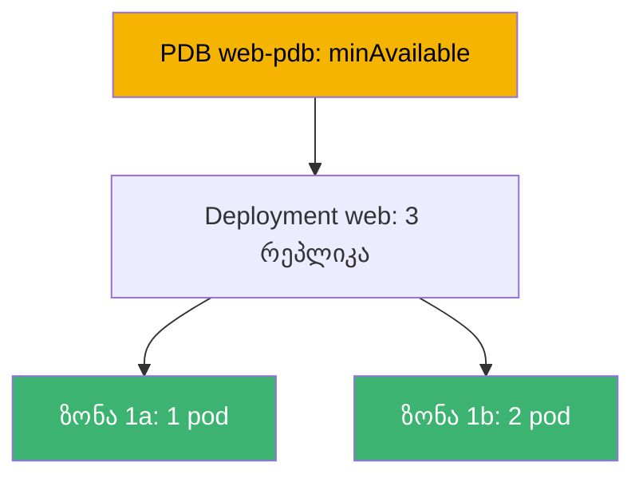
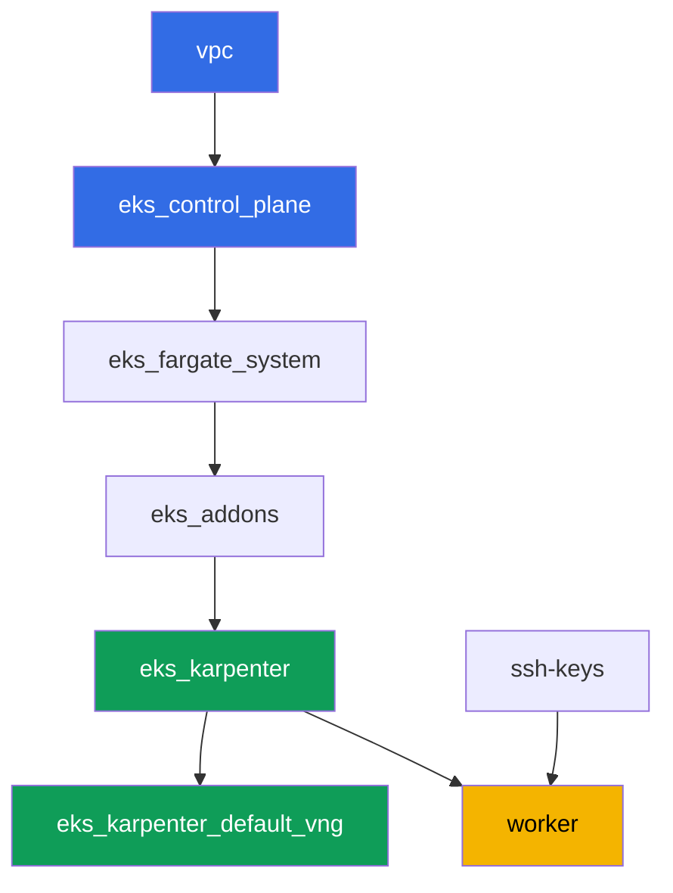

[Русская версия](README_RU.MD) · [Eng version](README.MD) · [Versión en español](README_ES.MD) · [Version française](README_FR.MD) · [Deutsche Version](README_DE.MD) · [繁體中文版](README_TW.MD) · [日本語版](README_JP.MD)

# ლაბა 131 - საიმედოობა: PDB ბლოკავს drain-ს, topology spread, matchLabelKeys

## აღწერა

კლასტერი ცოცხალია მანამ, სანამ გრძელდება ექსპლუატაცია: control plane-ის განახლებები,
ნოუდების ჩანაცვლება, აპლიკაციების განახლება. ეს ლაბა ამუშავებს ოთხ მექანიზმს, რომლებიც
განსაზღვრავენ, გადარჩება თუ არა დატვირთვა დაგეგმილ ტექნიკურ მომსახურებას.
`topologySpreadConstraints`-ის საშუალებით განაწილებთ Deployment-ს ზონებზე, გამოიწვევთ
კლასიკურ სიმპტომს - ზედმეტად მკაცრი `PodDisruptionBudget`, რომელიც სამუდამოდ ბლოკავს
`kubectl drain`-ს - და გამოასწორებთ მას. შემდეგ დაამატებთ
`unhealthyPodEvictionPolicy: AlwaysAllow`, რათა გატეხილმა pod-მა არ შეძლოს drain-ის
სამუდამო შეკავება, და გაატარებთ rolling update-ს, დაადასტურებთ, რომ ახალი რევიზია
თავისთავად დარჩა ზონებზე განაწილებული `maxSkew`-ის ფარგლებში.

დავალებები დაწერილია production-სტილში: მოკლე დაპოსტულებული ამოცანა პლუს მიღების
კრიტერიუმები. შემოწმება ავტომატურია, ბრძანებით `check_result`.

## მიზანი

კურსის თავის მასალის გამტკიცება:

- [თავი 40. საიმედოობა: multi-AZ, PDB, topology spread](../../course/40/ru.md) -
  ნოუდების სწორი გამორთვა

## რას ვქმნით

| ობიექტი | რა არის | რისთვის ამ ლაბაში |
|--------|---------|-------------------|
| Namespace `eks-131` | კლასტერის ლაბის დატვირთვის ნაწილი | რესურსებს ცალკე ვინახავთ სისტემურისგან |
| Deployment `web` (3 რეპლიკა) | ping_pong აპლიკაცია topology spread-ით | ზონებზე განაწილება `matchLabelKeys`-ის საშუალებით |
| PDB `web-pdb` | ნებაყოფლობითი დარღვევების ბიუჯეტი | ჯერ ბლოკავს drain-ს, შემდეგ ვასწორებთ |
| არტეფაქტი `drain_blocked.txt` | გაჭედილი drain და განმარტება | ვაფიქსირებთ მკაცრი `minAvailable`-ის სიმპტომს |
| არტეფაქტი `drain_ok.txt` | წარმატებული drain PDB-ის შემსუბუქების შემდეგ | ვადასტურებთ გამოსწორებას |
| არტეფაქტი `unhealthy_policy.txt` | `AlwaysAllow`-ის განმარტება | არაჯანსაღი pod არ ბლოკავს drain-ს სამუდამოდ |
| არტეფაქტი `rollout.txt` | წარმატებული rolling update | `matchLabelKeys` არ ანებებს ძველ pod-ებს ხელისშეშლას |

ლაბის დატვირთვის საერთო სურათი:



## ინფრასტრუქტურა

გარემო იშენება AWS-ში (`eu-central-1`) Terragrunt-ის საშუალებით. ლაბის ყოველი კატალოგი
არის ერთი კომპონენტი თავისი `terragrunt.hcl`-ით, რომელიც მიუთითებს საერთო მოდულზე
`terraform/modules/`-ში და აცხადებს დამოკიდებულებებს `dependency` ბლოკების საშუალებით.
Terragrunt აგებს დამოკიდებულებების გრაფს და იყენებს კომპონენტებს სწორი მიმდევრობით.
ცალკე NodePool ზონებისთვის არ არის საჭირო: კლასტერი უკვე აშენებულია ორ AZ-ში
(`eu-central-1a`, `eu-central-1b`), ეს საკმარისია topology spread-ისთვის.

### მოდულები და დამოკიდებულებები

| კატალოგი (კომპონენტი) | მოდული (`terraform/modules/`) | დამოკიდებულია | რას ქმნის |
|---------------------|-------------------------------|------------|-------------|
| `vpc` | `vpc_v3` | - | VPC `10.10.0.0/16`, საჯარო და პრივატული ქვექსელები ორ AZ-ში, NAT |
| `ssh-keys` | `ssh-keys` | - | SSH-გასაღებების წყვილი სამუშაო მანქანისა და ნოუდებისთვის |
| `eks_control_plane` | `eks_v2_control_plane` | `vpc` | EKS control plane `1.36`, OIDC, security groups |
| `eks_fargate_system` | `eks_v2_fargate` | `vpc`, `eks_control_plane` | Fargate-პროფილი `kube-system`-ისა და `karpenter`-ისთვის |
| `eks_addons` | `eks_v2_addons` | `eks_control_plane`, `eks_fargate_system` | დამატებები coredns, kube-proxy, vpc-cni, pod-identity |
| `eks_karpenter` | `eks_v2_karpenter` | `vpc`, `eks_control_plane`, `eks_addons`, `eks_fargate_system` | Karpenter-კონტროლერი, ნოუდების IAM-როლი |
| `eks_karpenter_default_vng` | `eks_v2_karpenter_vng` | `vpc`, `eks_control_plane`, `eks_karpenter` | ნაგულისხმევი NodePool `default` ორ AZ-ში |
| `worker` | `eks_v2_work_pc` | `ssh-keys`, `vpc`, `eks_control_plane`, `eks_karpenter` | სამუშაო მანქანა kubectl-ით, ტესტებით და `check_result`-ით |

დამოკიდებულებების გრაფი (რაც უფრო ადრე გამოიყენება, ის ისარზე უფრო დაბლა დგას):



სისტემური pod-ები მიდიან Fargate-ზე, სამუშაო ნოუდებს ამაღლებს Karpenter ორ ზონაში - ეს
არის ის ავარიის დომენი, რომელსაც ლაბის ტოპოლოგია იყენებს.

### სად რა კონფიგურირდება

პარამეტრები გადანაწილებულია ორ დონეზე: საერთო `env.hcl` და თითოეული კომპონენტის `inputs`.

`env.hcl` (გარემოს საერთო პარამეტრები, იკითხება ყველა კომპონენტის მიერ):

| პარამეტრი | მნიშვნელობა ლაბაში | რაზე ახდენს გავლენას |
|----------|-----------------|---------------|
| `region` | `eu-central-1` | ყველა რესურსის რეგიონი |
| `vpc_default_cidr`, `subnets` | `10.10.0.0/16`, ქვექსელები AZ-ის მიხედვით | VPC-ის მისამართების გეგმა და ზონები topology spread-ისთვის |
| `prefix` | `eks-task131` | რესურსების და ტეგების სახელების პრეფიქსი |
| `stack_name` | `eks131` | მისგან ყალიბდება `env_name` - კლასტერის სახელი |
| `k8_version` | `1.36.0` | kubectl-ის ვერსია სამუშაო მანქანაზე |
| `instance_type_worker` | `t3.medium` | სამუშაო მანქანის ინსტანციის ტიპი |
| `ssh_password_enable`, `access_cidrs` | `true`, `0.0.0.0/0` | SSH-წვდომა სამუშაო მანქანასთან |
| `root_volume` | `gp3`, `10` | სამუშაო მანქანის root დისკი |

`inputs` თითოეული კომპონენტის `terragrunt.hcl`-ში (კონკრეტული მოდულის პარამეტრები):

| ფაილი | ძირითადი პარამეტრები |
|------|--------------------|
| `eks_control_plane/terragrunt.hcl` | `eks.version = "1.36"`, პრივატული ქვექსელები ნოუდებისთვის ორ AZ-ში |
| `eks_addons/terragrunt.hcl` | დამატებების ვერსიები 1.36-ისთვის: kube-proxy, coredns, vpc-cni, pod-identity |
| `eks_fargate_system/terragrunt.hcl` | namespace-სელექტორები Fargate-სთვის (`kube-system`, `karpenter`) |
| `eks_karpenter/terragrunt.hcl` | Karpenter-ის ვერსია `1.8.1`, კონტროლერის რესურსები |
| `eks_karpenter_default_vng/terragrunt.hcl` | NodePool-ის `requirements` (arch, spot/on-demand, ტიპები) |
| `worker/terragrunt.hcl` | `test_url` და `task_script_url` ლაბა 131-ის ფაილებზე, `exam_time_minutes` |

წესი: მთელი ლაბისთვის საერთო პარამეტრები (რეგიონი, ქსელი, ვერსიები, პრეფიქსები) ცხოვრობს
`env.hcl`-ში; კონკრეტული მოდულის პარამეტრები - მისი `terragrunt.hcl`-ის `inputs`-ში.

## გაშენება

```bash
TASK=131 make run_eks_task
```

გაშენება გრძელდება დაახლოებით 15-20 წუთი. გამოსავალში მოძებნეთ სტრიქონი SSH-კავშირით
სამუშაო მანქანასთან და დაუკავშირდით მას. kubectl იქ უკვე კონფიგურირებულია საჭირო
კლასტერზე.

სასარგებლო ბრძანებები სამუშაო მანქანაზე:

```bash
time_left       # რამდენი დროა დარჩენილი გარემოსთვის
check_result    # გადაწყვეტის შემოწმება
```

> სტენდის უსაფრთხოება. `env.hcl`-ში ჩართულია `ssh_password_enable = true` და
> `access_cidrs = ["0.0.0.0/0"]` - მოსახერხებელია სასწავლო გარემოსთვის, მაგრამ ასე არ
> შეიძლება production-ში. კურსის სტანდარტების მიხედვით, სამუშაო მანქანებთან წვდომა
> იხსნება AWS SSM Session Manager-ის საშუალებით საჯარო SSH-პორტების გარეთ გატანის გარეშე,
> ხოლო `access_cidrs` ვიწროვდება კონკრეტულ მისამართებზე. აქ საჯარო SSH დარჩენილია მხოლოდ
> გაშვების სიმარტივისთვის.

## დავალებები

---
|        **1**        | **Namespace ლაბის დატვირთვისთვის**                             |
| :-----------------: | :---------------------------------------------------------- |
| რას ვაკეთებთ          | შექმენით namespace სახელით `eks-131`. ლაბის ყველა ობიექტი იქმნება მის შიგნით. |
| მიღების კრიტერიუმები    | - namespace `eks-131` არსებობს. |
---
|        **2**        | **Deployment ზონებზე განაწილებით**                        |
| :-----------------: | :---------------------------------------------------------- |
| რას ვაკეთებთ          | namespace `eks-131`-ში შექმენით Deployment `web`, image `viktoruj/ping_pong:latest`, `3` რეპლიკა. pod-ის შაბლონში დაამატეთ `topologySpreadConstraints`: `maxSkew: 1`, `topologyKey: topology.kubernetes.io/zone`, `whenUnsatisfiable: DoNotSchedule`, `labelSelector.matchLabels: {app: web}`, `matchLabelKeys: [pod-template-hash]`. დაუცადეთ `3` მზა რეპლიკას, განაწილებულს მინიმუმ ორ ზონაზე. განაწილების შემოწმება: `kubectl get pods -n eks-131 -o wide` და ნოუდის ზონის ლეიბლი `kubectl get nodes -L topology.kubernetes.io/zone`. |
| მიღების კრიტერიუმები    | - Deployment `web` `eks-131`-ში, image `viktoruj/ping_pong`, `3` მზა რეპლიკა;<br/>- pod-ის სპეციფიკაციაში მითითებულია `topologySpreadConstraints` მითითებული ველებით;<br/>- რეპლიკები დგანან მინიმუმ ორი სხვადასხვა ზონის ნოუდებზე. |
---
|        **3**        | **სიმპტომი: ზედმეტად მკაცრი PDB ბლოკავს drain-ს**            |
| :-----------------: | :---------------------------------------------------------- |
| რას ვაკეთებთ          | შექმენით `PodDisruptionBudget` `web-pdb` `eks-131`-ში `minAvailable: 3`-ით (ტოლი `web`-ის რეპლიკების რაოდენობის) და `selector.matchLabels: {app: web}`-ით. აიღეთ ნოუდი `web`-ის ერთ-ერთი რეპლიკით და გაუშვათ `kubectl drain <ნოუდი> --ignore-daemonsets --delete-emptydir-data --timeout=60s`. ბრძანება უნდა ჩავარდეს ტაიმაუთით: ბიუჯეტი არ ანებებს ერთი pod-ის გამოვევასაც. შედეგი შეინახეთ `/var/work/tests/artifacts/3/drain_blocked.txt`-ში და დაამატეთ განმარტება (სიტყვები `PDB` და `minAvailable`), თუ რატომ ბლოკავს `minAvailable`, რომელიც ტოლია რეპლიკების რაოდენობის, ნებისმიერ drain-ს. |
| მიღების კრიტერიუმები    | - PDB `web-pdb` არსებობს;<br/>- ფაილი `/var/work/tests/artifacts/3/drain_blocked.txt` არ არის ცარიელი და შეიცავს `PDB` და `minAvailable`. |
---
|        **4**        | **გამოსწორება: ვასუბუქებთ PDB-ს და ვამეორებთ drain-ს**                |
| :-----------------: | :---------------------------------------------------------- |
| რას ვაკეთებთ          | დაბრუნეთ ნოუდი 3-ე დავალებიდან სამუშაოში (`kubectl uncordon`). შემსუბუქეთ `web-pdb` `minAvailable: 2`-მდე. გაიმეორეთ `kubectl drain` იმავე ნოუდზე - ახლა გამოვევა უნდა წარმატებით დასრულდეს (ერთი რეპლიკა გამოვევდება, ჩანაცვლება დგება სხვა ნოუდზე). შედეგის დადასტურება (წარმატებული drain-ის შედეგი და მიმდინარე `kubectl get pdb web-pdb -n eks-131`) შეინახეთ ფაილში `/var/work/tests/artifacts/4/drain_ok.txt`. |
| მიღების კრიტერიუმები    | - `web-pdb`-ს აქვს `minAvailable: 2`;<br/>- ფაილი `/var/work/tests/artifacts/4/drain_ok.txt` არ არის ცარიელი. |
---
|        **5**        | **unhealthyPodEvictionPolicy: AlwaysAllow**                 |
| :-----------------: | :---------------------------------------------------------- |
| რას ვაკეთებთ          | დაამატეთ `web-pdb`-ს ველი `unhealthyPodEvictionPolicy: AlwaysAllow` (`kubectl patch`-ის ან ხელახალი შექმნის საშუალებით). გადაამოწმეთ მნიშვნელობა: `kubectl get pdb web-pdb -n eks-131 -o jsonpath='{.spec.unhealthyPodEvictionPolicy}'`. შეინახეთ `/var/work/tests/artifacts/5/unhealthy_policy.txt`-ში განმარტება, რატომ არის ეს საჭირო: `AlwaysAllow`-ის გარეშე (ანუ ნაგულისხმევი პოლიტიკით `IfHealthyBudget`) გატეხილი pod, რომელიც ჩარჩენილა `crashloopbackoff`-ში, თავად ბლოკავს ბიუჯეტის გამოთვლას და შესაძლოა სამუდამოდ დაბლოკოს drain (სიტყვები `AlwaysAllow` და `crashloopbackoff`). |
| მიღების კრიტერიუმები    | - `web-pdb`-ს აქვს `unhealthyPodEvictionPolicy: AlwaysAllow`;<br/>- ფაილი `/var/work/tests/artifacts/5/unhealthy_policy.txt` არ არის ცარიელი და შეიცავს საჭირო სიტყვებს. |
---
|        **6**        | **Rolling update ჩარჩენილი Pending-ის გარეშე**                     |
| :-----------------: | :---------------------------------------------------------- |
| რას ვაკეთებთ          | განაახლეთ Deployment `web`, რათა გამოჩნდეს ახალი რევიზია (მაგალითად `kubectl set env deployment/web -n eks-131 RELEASE=v2`). დაუცადეთ `kubectl rollout status deployment/web -n eks-131` ჩარჩენილი `Pending` pod-ების გარეშე და გადაამოწმეთ, რომ ახალ რევიზიის pod-ები (ერთი და იგივე `pod-template-hash`) კვლავ განაწილებულია ზონებზე `maxSkew: 1`-ის ფარგლებში. `rollout status`-ის შედეგი შეინახეთ ფაილში `/var/work/tests/artifacts/6/rollout.txt`. რას აკეთებს აქ `matchLabelKeys: [pod-template-hash]`: ის ამატებს skew-ის სელექტორს რევიზიის ლეიბლს, ამიტომ სქედულერი ითვლის განაწილებას მხოლოდ საკუთარი რევიზიის pod-ებში, არა წამომავალ ძველებთან ერთად. გულწრფელი განმარტება: ამ სტენდზე rollout გადის `matchLabelKeys`-ის გარეშეც (გადამოწმებული) - ორი ზონა, სამი რეპლიკა და Karpenter, რომელიც ნებისმიერი `Pending`-ისთვის დაამატებს ნოუდს. სხვაობა ჩანს იმ შემთხვევაში, სადაც პარკი სტატიკური, ზონები ორზე მეტია, და ძველი რეპლიკები არათანაბრად განაწილებულია: მაშინ ორივე რევიზიაზე ერთდროულად გამოთვლილი skew ახალ pod-ს ადგილს არ ტოვებს, და ის ელოდება ძველის მოცილებას. |
| მიღების კრიტერიუმები    | - `web`-ის ყველა `3` რეპლიკა მზადაა და განახლებული;<br/>- `web`-ის ერთი pod-იც არ არის `Pending`;<br/>- ახალი რევიზიის pod-ების skew ზონებზე არ აღემატება `1`-ს;<br/>- ფაილი `/var/work/tests/artifacts/6/rollout.txt` არ არის ცარიელი და ადასტურებს წარმატებულ rollout-ს. |
---

## შედეგის შემოწმება

სამუშაო მანქანაზე გაუშვათ ავტომატური შემოწმება:

```bash
check_result
```

სკრიპტი გაუშვებს ტესტებს და გამოაჩენს შესრულებული დავალებების პროცენტს.

## გადაწყვეტა

ეტალონური გადაწყვეტა: [worker/files/solutions/1_GE.MD](worker/files/solutions/1_GE.MD)

## კლასტერისა და რესურსების წაშლა

> **პირველად ამოშალეთ PDB და დატვირთვა.** ბიუჯეტი `web-pdb` ზღუდავს ნებაყოფლობით
> დარღვევებს, ანუ ანელებს ნოუდების გამოყვანისას pod-ების სწორ გამოვევასაც. თუ სტენდს
> წაშლით ცოცხალი დატვირთვით, Karpenter-ის EC2-ნოუდი წავა კლასტერთან ერთად, მაგრამ VPC
> CNI-ის მეორადი ENI დარჩება `available` მდგომარეობაში და დაიჭერს ნოუდის security
> group-ს - `destroy` მასზე გაჭედება. თანმიმდევრობა: ჯერ PDB, შემდეგ namespace, შემდეგ
> ველოდებით EC2-ნოუდების გაქრობას.

```bash
kubectl delete pdb web-pdb -n eks-131 --ignore-not-found
kubectl delete namespace eks-131 --ignore-not-found

while kubectl get nodes --no-headers 2>/dev/null | grep -qv fargate; do
  echo "Karpenter-ის EC2-ნოუდი კიდევ ცოცხალია, ველოდებით..."; sleep 15
done
kubectl get nodes --no-headers
```

თუ ლაბის მიმდინარეობისას დარჩენილი ნოუდი cordoned-ია (`kubectl drain` შემდგომი
`uncordon`-ის გარეშე), ეს არ ხელს არ უშლის წაშლას: Karpenter ისევე ტერმინირებს ცარიელ
ნოუდს.

```bash
TASK=131 make delete_eks_task
```

თუ `destroy` მაინც გაჭედება ნოუდის security group-ზე, მოძებნეთ დაობლებული ENI:

```bash
aws ec2 describe-network-interfaces --filters Name=status,Values=available \
  --query 'NetworkInterfaces[].[NetworkInterfaceId,Description]' --output table
aws ec2 delete-network-interface --network-interface-id <eni-id>
```
