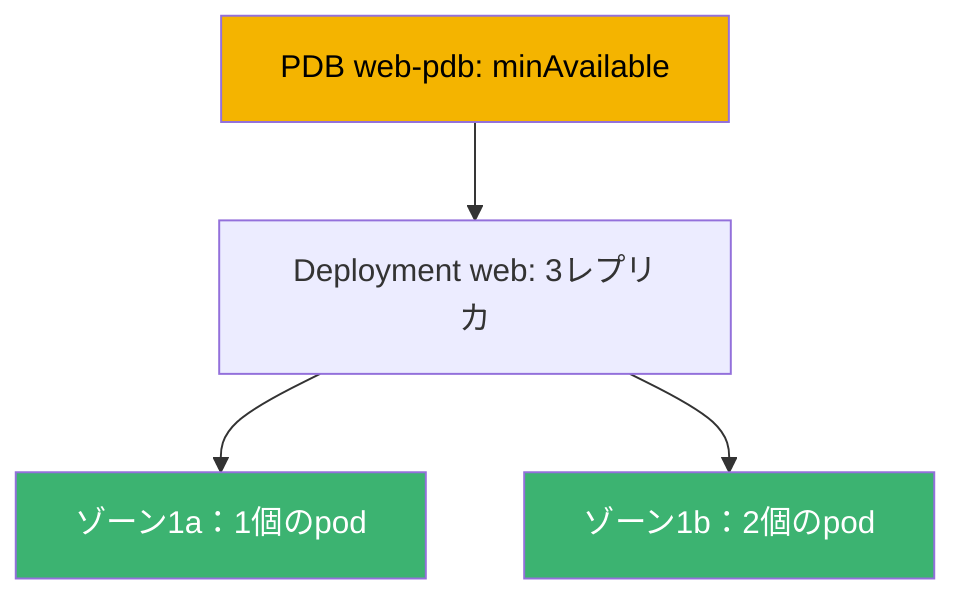
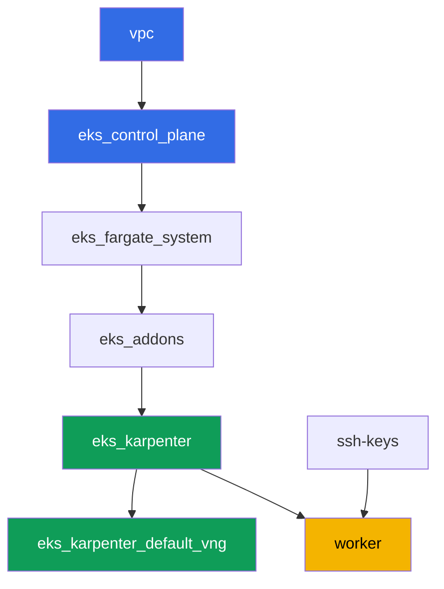

[Русская версия](README_RU.MD) · [Eng version](README.MD) · [Versión en español](README_ES.MD) · [Version française](README_FR.MD) · [Deutsche Version](README_DE.MD) · [ქართული ვერსია](README_GE.MD) · [繁體中文版](README_TW.MD)

# ラボ131 - 信頼性：PDBがdrainをブロックする、topology spread、matchLabelKeys

## 説明

クラスタは運用が続く間だけ生き続けます。control planeのアップグレード、ノードの入れ替え、
アプリケーションの更新などです。このラボでは、負荷が計画的なメンテナンスを乗り切れるかを
左右する4つのメカニズムを扱います。`topologySpreadConstraints`でDeploymentをゾーンに分散
させ、典型的な症状 - 厳しすぎる`PodDisruptionBudget`が`kubectl drain`を永久にブロックする
という現象 - を再現し、それを修正します。次に`unhealthyPodEvictionPolicy: AlwaysAllow`を
追加し、壊れたpodがdrainを永遠に止められないようにし、rolling updateを実行して、新しい
リビジョンが単独でも`maxSkew`の範囲内でゾーンに分散したままであることを確認します。

タスクは本番スタイルで書かれています。短い課題文と受け入れ基準です。チェックは自動で、
`check_result`コマンドで行われます。

## 目標

コースの章の内容を定着させる：

- [第40章。信頼性：multi-AZ、PDB、topology spread](../../course/40/ru.md) -
  ノードの正しいドレイン

## 作成するもの

| オブジェクト | 何か | このラボでの役割 |
|--------|---------|-------------------|
| Namespace `eks-131` | このラボの負荷用のクラスタ区画 | システムのリソースと分けておく |
| Deployment `web`（3レプリカ） | topology spreadを持つping_pongアプリケーション | `matchLabelKeys`によるゾーンへの分散 |
| PDB `web-pdb` | 自発的な中断の予算 | 最初はdrainをブロックし、その後修正される |
| アーティファクト `drain_blocked.txt` | 止まったdrainと説明 | 厳しい`minAvailable`の症状を記録する |
| アーティファクト `drain_ok.txt` | PDBを緩めた後の成功したdrain | 修正を確認する |
| アーティファクト `unhealthy_policy.txt` | `AlwaysAllow`の説明 | 不健全なpodがdrainを永久にブロックしない |
| アーティファクト `rollout.txt` | 成功したrolling update | `matchLabelKeys`が古いpodを邪魔させない |

このラボの負荷の全体像：



## インフラストラクチャ

環境はTerragruntを使ってAWS（`eu-central-1`）にデプロイされます。ラボの各ディレクトリは
独自の`terragrunt.hcl`を持つ1つのコンポーネントであり、`terraform/modules/`内の共有モジ
ュールを参照し、`dependency`ブロックで依存関係を宣言します。Terragruntは依存関係グラフを
構築し、正しい順序でコンポーネントを適用します。ゾーン用に別のNodePoolは不要です。クラス
タはすでに2つのAZ（`eu-central-1a`、`eu-central-1b`）にデプロイされており、これがtopology
spreadに十分です。

### モジュールと依存関係

| ディレクトリ（コンポーネント） | モジュール（`terraform/modules/`） | 依存先 | 作成するもの |
|---------------------|-------------------------------|------------|-------------|
| `vpc` | `vpc_v3` | - | VPC `10.10.0.0/16`、2つのAZのパブリック・プライベートサブネット、NAT |
| `ssh-keys` | `ssh-keys` | - | ワークマシンとノード用のSSH鍵ペア |
| `eks_control_plane` | `eks_v2_control_plane` | `vpc` | EKS control plane `1.36`、OIDC、security groups |
| `eks_fargate_system` | `eks_v2_fargate` | `vpc`、`eks_control_plane` | `kube-system`と`karpenter`用のFargateプロファイル |
| `eks_addons` | `eks_v2_addons` | `eks_control_plane`、`eks_fargate_system` | coredns、kube-proxy、vpc-cni、pod-identityのアドオン |
| `eks_karpenter` | `eks_v2_karpenter` | `vpc`、`eks_control_plane`、`eks_addons`、`eks_fargate_system` | Karpenterコントローラー、ノードIAMロール |
| `eks_karpenter_default_vng` | `eks_v2_karpenter_vng` | `vpc`、`eks_control_plane`、`eks_karpenter` | 2つのAZにデフォルトのNodePool `default` |
| `worker` | `eks_v2_work_pc` | `ssh-keys`、`vpc`、`eks_control_plane`、`eks_karpenter` | kubectl、テスト、`check_result`を備えたワークマシン |

依存関係グラフ（先に適用されるものほど矢印の下側にあります）：



システムのpodはFargateに乗り、ワークノードはKarpenterが2つのゾーンで立ち上げます - これ
がこのラボのトポロジーが利用する障害ドメインです。

### どこで何が設定されるか

設定は2つのレベルに分かれています：共通の`env.hcl`と各コンポーネントの`inputs`です。

`env.hcl`（すべてのコンポーネントが読む共通の環境パラメータ）：

| パラメータ | このラボでの値 | 何に影響するか |
|----------|-----------------|---------------|
| `region` | `eu-central-1` | すべてのリソースのリージョン |
| `vpc_default_cidr`、`subnets` | `10.10.0.0/16`、AZごとのサブネット | VPCのアドレス計画とtopology spread用のゾーン |
| `prefix` | `eks-task131` | リソースとタグ名のプレフィックス |
| `stack_name` | `eks131` | これから`env_name`が組み立てられる - クラスタ名 |
| `k8_version` | `1.36.0` | ワークマシン上のkubectlのバージョン |
| `instance_type_worker` | `t3.medium` | ワークマシンのインスタンスタイプ |
| `ssh_password_enable`、`access_cidrs` | `true`、`0.0.0.0/0` | ワークマシンへのSSHアクセス |
| `root_volume` | `gp3`、`10` | ワークマシンのルートディスク |

各コンポーネントの`terragrunt.hcl`内の`inputs`（具体的なモジュールの設定）：

| ファイル | 主な設定 |
|------|--------------------|
| `eks_control_plane/terragrunt.hcl` | `eks.version = "1.36"`、2つのAZのノード用プライベートサブネット |
| `eks_addons/terragrunt.hcl` | 1.36向けのアドオンバージョン：kube-proxy、coredns、vpc-cni、pod-identity |
| `eks_fargate_system/terragrunt.hcl` | Fargate用のnamespaceセレクタ（`kube-system`、`karpenter`） |
| `eks_karpenter/terragrunt.hcl` | Karpenterバージョン`1.8.1`、コントローラーのリソース |
| `eks_karpenter_default_vng/terragrunt.hcl` | NodePoolの`requirements`（アーキ、spot/on-demand、タイプ） |
| `worker/terragrunt.hcl` | ラボ131のファイルへの`test_url`と`task_script_url`、`exam_time_minutes` |

原則：ラボ全体で共通のパラメータ（リージョン、ネットワーク、バージョン、プレフィックス）
は`env.hcl`に置き、具体的なモジュールの設定はその`terragrunt.hcl`の`inputs`に置きます。

## デプロイ

```bash
TASK=131 make run_eks_task
```

デプロイには約15-20分かかります。出力の中でワークマシンへのSSH接続の行を見つけて接続し
てください。そこではkubectlが既に目的のクラスタに設定されています。

ワークマシン上で便利なコマンド：

```bash
time_left       # 環境の残り時間
check_result    # 解答を確認する
```

> テスト環境のセキュリティ。`env.hcl`では`ssh_password_enable = true`と
> `access_cidrs = ["0.0.0.0/0"]`が有効になっています - トレーニング環境には便利です
> が、本番環境ではこのようにしてはいけません。コースの標準では、ワークマシンへのアクセ
> スはパブリックなSSHポートを外部に公開せずにAWS SSM Session Managerを通して開かれ、
> `access_cidrs`は具体的なアドレスに絞られます。ここではパブリックSSHは起動を簡単にす
> るためだけに残されています。

## タスク

---
|        **1**        | **このラボの負荷用のNamespace**                             |
| :-----------------: | :---------------------------------------------------------- |
| やること          | `eks-131`という名前のnamespaceを作成してください。このラボのすべてのオブジェクトはその中に作成されます。 |
| 受け入れ基準    | - namespace `eks-131`が存在する。 |
---
|        **2**        | **ゾーンに分散したDeployment**                        |
| :-----------------: | :---------------------------------------------------------- |
| やること          | namespace `eks-131`内にDeployment `web`を作成し、イメージ`viktoruj/ping_pong:latest`、`3`レプリカとします。podテンプレートに`topologySpreadConstraints`を追加してください：`maxSkew: 1`、`topologyKey: topology.kubernetes.io/zone`、`whenUnsatisfiable: DoNotSchedule`、`labelSelector.matchLabels: {app: web}`、`matchLabelKeys: [pod-template-hash]`。少なくとも2つのゾーンに分散した`3`個のReadyレプリカを待ってください。分散の確認：`kubectl get pods -n eks-131 -o wide`とノードのゾーンラベル`kubectl get nodes -L topology.kubernetes.io/zone`。 |
| 受け入れ基準    | - Deployment `web`が`eks-131`にあり、イメージ`viktoruj/ping_pong`、`3`個のReadyレプリカ;<br/>- podのspecに指定されたフィールドを持つ`topologySpreadConstraints`が設定されている;<br/>- レプリカは少なくとも2つの異なるゾーンのノード上にある。 |
---
|        **3**        | **症状：厳しすぎるPDBがdrainをブロックする**            |
| :-----------------: | :---------------------------------------------------------- |
| やること          | `eks-131`に`PodDisruptionBudget` `web-pdb`を作成してください。`minAvailable: 3`（`web`のレプリカ数に等しい）、`selector.matchLabels: {app: web}`とします。`web`のレプリカのいずれかが乗っているノードを取り、`kubectl drain <ノード> --ignore-daemonsets --delete-emptydir-data --timeout=60s`を実行してください。コマンドはタイムアウトで失敗するはずです：予算はどのpodのevictionも許可しません。コマンドの出力を`/var/work/tests/artifacts/3/drain_blocked.txt`に保存し、レプリカ数に等しい`minAvailable`がなぜすべてのdrainをブロックするのかの説明（単語`PDB`と`minAvailable`）を追記してください。 |
| 受け入れ基準    | - PDB `web-pdb`が存在する;<br/>- ファイル`/var/work/tests/artifacts/3/drain_blocked.txt`が空でなく、`PDB`と`minAvailable`を含む。 |
---
|        **4**        | **修正：PDBを緩めてdrainをやり直す**                |
| :-----------------: | :---------------------------------------------------------- |
| やること          | タスク3のノードをサービスに戻してください（`kubectl uncordon`）。`web-pdb`を`minAvailable: 2`まで緩めてください。同じノードで`kubectl drain`をやり直します - 今度はevictionが成功するはずです（1つのレプリカがevictされ、代わりが別のノードに立ちます）。確認結果（成功したdrainの出力と現在の`kubectl get pdb web-pdb -n eks-131`）をファイル`/var/work/tests/artifacts/4/drain_ok.txt`に保存してください。 |
| 受け入れ基準    | - `web-pdb`の`minAvailable`が`2`である;<br/>- ファイル`/var/work/tests/artifacts/4/drain_ok.txt`が空でない。 |
---
|        **5**        | **unhealthyPodEvictionPolicy: AlwaysAllow**                 |
| :-----------------: | :---------------------------------------------------------- |
| やること          | `web-pdb`にフィールド`unhealthyPodEvictionPolicy: AlwaysAllow`を追加してください（`kubectl patch`または再作成）。値を確認：`kubectl get pdb web-pdb -n eks-131 -o jsonpath='{.spec.unhealthyPodEvictionPolicy}'`。`/var/work/tests/artifacts/5/unhealthy_policy.txt`に、なぜこれが必要かの説明を保存してください：`AlwaysAllow`がなければ（つまりデフォルトの`IfHealthyBudget`ポリシーでは）、`CrashLoopBackOff`に陥った壊れたpodがそれ自体で予算の計算をブロックし、drainを永久にブロックしかねません（単語`AlwaysAllow`と`CrashLoopBackOff`）。 |
| 受け入れ基準    | - `web-pdb`の`unhealthyPodEvictionPolicy`が`AlwaysAllow`である;<br/>- ファイル`/var/work/tests/artifacts/5/unhealthy_policy.txt`が空でなく、必要な単語を含む。 |
---
|        **6**        | **Pendingが詰まらないrolling update**                     |
| :-----------------: | :---------------------------------------------------------- |
| やること          | Deployment `web`を更新して新しいリビジョンが出るようにしてください（例えば`kubectl set env deployment/web -n eks-131 RELEASE=v2`）。`Pending`が詰まったpodがない状態で`kubectl rollout status deployment/web -n eks-131`を待ち、新しいリビジョンのpod（同じ`pod-template-hash`）が依然として`maxSkew: 1`の範囲内でゾーンに分散していることを確認してください。`rollout status`の出力をファイル`/var/work/tests/artifacts/6/rollout.txt`に保存してください。ここで`matchLabelKeys: [pod-template-hash]`が何をするか：skewのセレクタにリビジョンのラベルを追加し、スケジューラは自分自身のリビジョンのpod間だけで分布を数え、去っていく古いpodと一緒には数えません。公平な補足：このテスト環境では`matchLabelKeys`がなくてもrolloutは通ります（確認済み） - 2つのゾーン、3つのレプリカ、そして任意の`Pending`にノードを追加するKarpenterがあるためです。差が現れるのは、固定的なノード群、2つより多いゾーン、古いレプリカが不均等に分散している場合です。そのとき両方のリビジョンを同時に数えたskewは新しいpodに空きゾーンを残さず、古いレプリカが取り除かれるのを待つことになります。 |
| 受け入れ基準    | - `web`の`3`個すべてのレプリカがReadyかつ更新済み;<br/>- どの`web`のpodも`Pending`でない;<br/>- 新しいリビジョンのpodのゾーン間のskewが`1`を超えない;<br/>- ファイル`/var/work/tests/artifacts/6/rollout.txt`が空でなく、成功したrolloutを確認できる。 |
---

## 結果の確認

ワークマシンで自動チェックを実行してください：

```bash
check_result
```

スクリプトはテストを実行し、完了したタスクの割合を表示します。

## 解答

参考解答：[worker/files/solutions/1_JP.MD](worker/files/solutions/1_JP.MD)

## クラスタとリソースの削除

> **まずPDBと負荷を取り除いてください。** 予算`web-pdb`は自発的な中断を制限するため、
> ノードのドレイン時のpodの正しいevictionも遅らせます。負荷が生きている状態でスタンド
> を削除すると、KarpenterのEC2ノードはクラスタと一緒に消えますが、VPC CNIのセカンダリ
> ENIは`available`状態のまま残り、ノードのsecurity groupを保持し続けます -
> `destroy`はそこで止まります。順序：まずPDB、次にnamespace、その後EC2ノードが消える
> のを待ちます。

```bash
kubectl delete pdb web-pdb -n eks-131 --ignore-not-found
kubectl delete namespace eks-131 --ignore-not-found

while kubectl get nodes --no-headers 2>/dev/null | grep -qv fargate; do
  echo "KarpenterのEC2ノードはまだ生きています、待機中..."; sleep 15
done
kubectl get nodes --no-headers
```

ラボの途中でノードをcordonされた状態にしたまま（`kubectl drain`の後に`uncordon`をして
いない）場合でも、削除の妨げにはなりません：Karpenterは空のノードをそのまま終了させます。

```bash
TASK=131 make delete_eks_task
```

それでも`destroy`がノードのsecurity groupで止まる場合は、孤立したENIを探してください：

```bash
aws ec2 describe-network-interfaces --filters Name=status,Values=available \
  --query 'NetworkInterfaces[].[NetworkInterfaceId,Description]' --output table
aws ec2 delete-network-interface --network-interface-id <eni-id>
```
