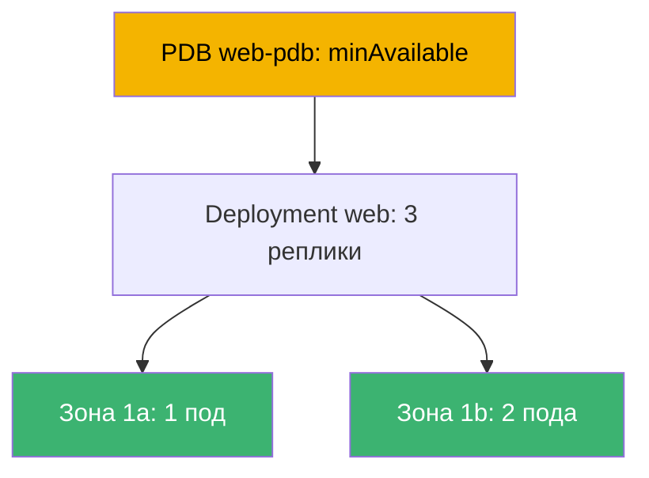
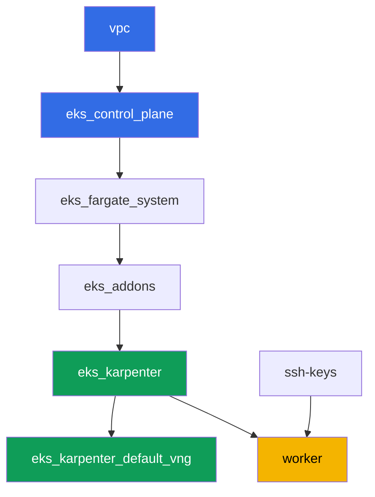

# Лаба 131 - Надёжность: PDB блокирует drain, topology spread, matchLabelKeys

## Описание

Кластер живёт, пока идёт эксплуатация: обновления control plane, замена нод,
обновление приложений. Эта лаба отрабатывает четыре механизма, которые определяют,
переживёт ли нагрузка плановое обслуживание. Вы разложите Deployment по зонам через
`topologySpreadConstraints`, воспроизведёте классический симптом - слишком жёсткий
`PodDisruptionBudget`, который навсегда блокирует `kubectl drain`, - и почините его.
Затем добавите `unhealthyPodEvictionPolicy: AlwaysAllow`, чтобы сломанный под не мог
держать drain вечно, и проведёте rolling update, проверив, что новая ревизия сама по себе
осталась разложенной по зонам в пределах `maxSkew`.

Задания в продакшн-стиле: короткая постановка плюс критерии приёмки. Проверка -
автоматическая, командой `check_result`.

## Цель

Закрепить материал главы курса:

- [Глава 40. Надёжность: multi-AZ, PDB, topology spread](../../course/40/ru.md) -
  корректное выключение нод

## Что мы создаём

| Объект | Что это | Зачем в этой лабе |
|--------|---------|-------------------|
| Namespace `eks-131` | раздел кластера под нагрузку лабы | держим ресурсы отдельно от системных |
| Deployment `web` (3 реплики) | приложение ping_pong с topology spread | раскладка по зонам через `matchLabelKeys` |
| PDB `web-pdb` | бюджет добровольных нарушений | сначала блокирует drain, потом лечится |
| Артефакт `drain_blocked.txt` | зависший drain и объяснение | фиксируем симптом жёсткого `minAvailable` |
| Артефакт `drain_ok.txt` | успешный drain после ослабления PDB | подтверждаем лечение |
| Артефакт `unhealthy_policy.txt` | объяснение `AlwaysAllow` | нездоровый под не блокирует drain навсегда |
| Артефакт `rollout.txt` | успешный rolling update | `matchLabelKeys` не даёт старым подам мешать |

Итоговая картина нагрузки лабы:



## Инфраструктура

Окружение разворачивается в AWS (`eu-central-1`) через Terragrunt. Каждый каталог лабы -
это один компонент со своим `terragrunt.hcl`, который ссылается на общий модуль в
`terraform/modules/` и объявляет зависимости через блоки `dependency`. Terragrunt строит
граф зависимостей и применяет компоненты в правильном порядке. Отдельного NodePool под
зоны не требуется: кластер уже поднят в двух AZ (`eu-central-1a`, `eu-central-1b`), этого
достаточно для topology spread.

### Модули и зависимости

| Каталог (компонент) | Модуль (`terraform/modules/`) | Зависит от | Что создаёт |
|---------------------|-------------------------------|------------|-------------|
| `vpc` | `vpc_v3` | - | VPC `10.10.0.0/16`, публичные и приватные подсети в двух AZ, NAT |
| `ssh-keys` | `ssh-keys` | - | пара SSH-ключей для рабочей машины и нод |
| `eks_control_plane` | `eks_v2_control_plane` | `vpc` | control plane EKS `1.36`, OIDC, security groups |
| `eks_fargate_system` | `eks_v2_fargate` | `vpc`, `eks_control_plane` | Fargate-профиль для `kube-system` и `karpenter` |
| `eks_addons` | `eks_v2_addons` | `eks_control_plane`, `eks_fargate_system` | аддоны coredns, kube-proxy, vpc-cni, pod-identity |
| `eks_karpenter` | `eks_v2_karpenter` | `vpc`, `eks_control_plane`, `eks_addons`, `eks_fargate_system` | контроллер Karpenter, IAM-роль нод |
| `eks_karpenter_default_vng` | `eks_v2_karpenter_vng` | `vpc`, `eks_control_plane`, `eks_karpenter` | дефолтный NodePool `default` в двух AZ |
| `worker` | `eks_v2_work_pc` | `ssh-keys`, `vpc`, `eks_control_plane`, `eks_karpenter` | рабочая машина с kubectl, тестами и `check_result` |

Граф зависимостей (что применяется раньше, то ниже по стрелке):



Системные поды идут на Fargate, рабочие ноды поднимает Karpenter в двух зонах - это
и есть домен отказа, который топология лабы использует.

### Где что настраивается

Настройки разнесены по двум уровням: общий `env.hcl` и `inputs` каждого компонента.

`env.hcl` (общие параметры окружения, читаются всеми компонентами):

| Параметр | Значение в лабе | На что влияет |
|----------|-----------------|---------------|
| `region` | `eu-central-1` | регион всех ресурсов |
| `vpc_default_cidr`, `subnets` | `10.10.0.0/16`, подсети по AZ | адресный план VPC и зоны для topology spread |
| `prefix` | `eks-task131` | префикс имён ресурсов и тегов |
| `stack_name` | `eks131` | из него собирается `env_name` - имя кластера |
| `k8_version` | `1.36.0` | версия kubectl на рабочей машине |
| `instance_type_worker` | `t3.medium` | тип инстанса рабочей машины |
| `ssh_password_enable`, `access_cidrs` | `true`, `0.0.0.0/0` | доступ по SSH к рабочей машине |
| `root_volume` | `gp3`, `10` | корневой диск рабочей машины |

`inputs` в `terragrunt.hcl` каждого компонента (параметры конкретного модуля):

| Файл | Ключевые настройки |
|------|--------------------|
| `eks_control_plane/terragrunt.hcl` | `eks.version = "1.36"`, приватные подсети под ноды в двух AZ |
| `eks_addons/terragrunt.hcl` | версии аддонов под 1.36: kube-proxy, coredns, vpc-cni, pod-identity |
| `eks_fargate_system/terragrunt.hcl` | селекторы namespace для Fargate (`kube-system`, `karpenter`) |
| `eks_karpenter/terragrunt.hcl` | версия Karpenter `1.8.1`, ресурсы контроллера |
| `eks_karpenter_default_vng/terragrunt.hcl` | `requirements` NodePool (arch, spot/on-demand, типы) |
| `worker/terragrunt.hcl` | `test_url` и `task_script_url` на файлы лабы 131, `exam_time_minutes` |

Правило: параметры, общие для всей лабы (регион, сеть, версии, префиксы), живут в `env.hcl`;
параметры конкретного модуля - в `inputs` его `terragrunt.hcl`.

## Развёртывание

```bash
TASK=131 make run_eks_task
```

Развёртывание занимает примерно 15-20 минут. В выводе найдите строку с SSH-подключением к
рабочей машине и подключитесь к ней. kubectl там уже настроен на нужный кластер.

Полезные команды на рабочей машине:

```bash
time_left       # сколько осталось времени окружения
check_result    # проверить решение
```

> Безопасность стенда. В `env.hcl` включены `ssh_password_enable = true` и
> `access_cidrs = ["0.0.0.0/0"]` - это удобно для учебного окружения, но так делать в
> продакшене нельзя. По стандартам курса доступ к рабочим машинам открывают через AWS
> SSM Session Manager без публичных SSH-портов наружу, а `access_cidrs` сужают до
> конкретных адресов. Здесь публичный SSH оставлен только ради простоты запуска.

## Задания

---
|        **1**        | **Namespace для нагрузки лабы**                             |
| :-----------------: | :---------------------------------------------------------- |
| Что делаем          | Создайте namespace с именем `eks-131`. Все объекты лабы создаются внутри него. |
| Критерии приёмки    | - namespace `eks-131` существует. |
---
|        **2**        | **Deployment с раскладкой по зонам**                        |
| :-----------------: | :---------------------------------------------------------- |
| Что делаем          | В namespace `eks-131` создайте Deployment `web`, образ `viktoruj/ping_pong:latest`, `3` реплики. Добавьте в шаблон пода `topologySpreadConstraints`: `maxSkew: 1`, `topologyKey: topology.kubernetes.io/zone`, `whenUnsatisfiable: DoNotSchedule`, `labelSelector.matchLabels: {app: web}`, `matchLabelKeys: [pod-template-hash]`. Дождитесь `3` готовых реплик, разложенных минимум по двум зонам. Проверка раскладки: `kubectl get pods -n eks-131 -o wide` и метка зоны ноды `kubectl get nodes -L topology.kubernetes.io/zone`. |
| Критерии приёмки    | - Deployment `web` в `eks-131`, образ `viktoruj/ping_pong`, `3` готовые реплики;<br/>- в спецификации пода заданы `topologySpreadConstraints` с указанными полями;<br/>- реплики стоят на нодах как минимум двух разных зон. |
---
|        **3**        | **Симптом: слишком жёсткий PDB блокирует drain**            |
| :-----------------: | :---------------------------------------------------------- |
| Что делаем          | Создайте `PodDisruptionBudget` `web-pdb` в `eks-131` с `minAvailable: 3` (равно числу реплик `web`) и `selector.matchLabels: {app: web}`. Возьмите ноду с одной из реплик `web` и выполните `kubectl drain <нода> --ignore-daemonsets --delete-emptydir-data --timeout=60s`. Команда должна провалиться по таймауту: бюджет не разрешает вывести ни один под. Сохраните вывод команды в `/var/work/tests/artifacts/3/drain_blocked.txt` и добавьте туда объяснение (слова `PDB` и `minAvailable`), почему `minAvailable`, равный числу реплик, блокирует любой drain. |
| Критерии приёмки    | - PDB `web-pdb` существует;<br/>- файл `/var/work/tests/artifacts/3/drain_blocked.txt` не пуст и содержит `PDB` и `minAvailable`. |
---
|        **4**        | **Лечение: ослабляем PDB и повторяем drain**                |
| :-----------------: | :---------------------------------------------------------- |
| Что делаем          | Верните ноду из задания 3 в работу (`kubectl uncordon`). Ослабьте `web-pdb` до `minAvailable: 2`. Повторите `kubectl drain` той же ноды - теперь выселение должно пройти успешно (одна реплика выселяется, замена встаёт на другой ноде). Сохраните подтверждение (вывод успешного drain и текущий `kubectl get pdb web-pdb -n eks-131`) в файл `/var/work/tests/artifacts/4/drain_ok.txt`. |
| Критерии приёмки    | - `web-pdb` имеет `minAvailable: 2`;<br/>- файл `/var/work/tests/artifacts/4/drain_ok.txt` не пуст. |
---
|        **5**        | **unhealthyPodEvictionPolicy: AlwaysAllow**                 |
| :-----------------: | :---------------------------------------------------------- |
| Что делаем          | Добавьте в `web-pdb` поле `unhealthyPodEvictionPolicy: AlwaysAllow` (через `kubectl patch` или пересоздание). Проверьте значение полем: `kubectl get pdb web-pdb -n eks-131 -o jsonpath='{.spec.unhealthyPodEvictionPolicy}'`. Сохраните в `/var/work/tests/artifacts/5/unhealthy_policy.txt` объяснение, почему это нужно: без `AlwaysAllow` (то есть при политике по умолчанию `IfHealthyBudget`) сломанный под в `CrashLoopBackOff` сам блокирует расчёт бюджета и может навсегда заблокировать drain (слова `AlwaysAllow` и `CrashLoopBackOff` или `нездоров`). |
| Критерии приёмки    | - `web-pdb` имеет `unhealthyPodEvictionPolicy: AlwaysAllow`;<br/>- файл `/var/work/tests/artifacts/5/unhealthy_policy.txt` не пуст и содержит нужные слова. |
---
|        **6**        | **Rolling update без зависших Pending**                     |
| :-----------------: | :---------------------------------------------------------- |
| Что делаем          | Обновите Deployment `web`, чтобы появилась новая ревизия (например `kubectl set env deployment/web -n eks-131 RELEASE=v2`). Дождитесь `kubectl rollout status deployment/web -n eks-131` без зависших `Pending` подов и проверьте, что поды НОВОЙ ревизии (одинаковый `pod-template-hash`) по-прежнему разложены по зонам в пределах `maxSkew: 1`. Сохраните вывод `rollout status` в файл `/var/work/tests/artifacts/6/rollout.txt`. Что тут делает `matchLabelKeys: [pod-template-hash]`: он добавляет к селектору перекоса метку ревизии, поэтому планировщик считает распределение ТОЛЬКО среди подов своей ревизии, а не вместе с уходящими старыми. Честная оговорка: на этом стенде выкатка проходит и без `matchLabelKeys` (проверено) - две зоны, три реплики и Karpenter, который добавит ноду под любой `Pending`. Разница видна там, где парк статичный, зон больше двух, а старые реплики разложены неровно: тогда перекос, посчитанный по обеим ревизиям сразу, не даёт новому поду место, и он ждёт удаления старого. |
| Критерии приёмки    | - все `3` реплики `web` готовы и обновлены;<br/>- ни один под `web` не в `Pending`;<br/>- перекос подов новой ревизии по зонам не больше `1`;<br/>- файл `/var/work/tests/artifacts/6/rollout.txt` не пуст и подтверждает успешный rollout. |
---

## Проверка результата

На рабочей машине запустите автоматическую проверку:

```bash
check_result
```

Скрипт прогонит тесты и покажет процент выполненных заданий.

## Решение

Эталонное решение: [worker/files/solutions/1.MD](worker/files/solutions/1.MD)

## Удаление кластера и ресурсов

> **Сначала снимите PDB и нагрузку.** Бюджет `web-pdb` ограничивает добровольные
> прерывания, то есть замедляет и корректное выселение подов при выводе нод. Если удалять
> стенд с живой нагрузкой, EC2-нода Karpenter уходит вместе с кластером, а вторичный ENI от
> VPC CNI остаётся в состоянии `available` и держит security group нод - `destroy` зависает
> на ней. Порядок: сначала PDB, затем namespace, затем ждём исчезновения EC2-нод.

```bash
kubectl delete pdb web-pdb -n eks-131 --ignore-not-found
kubectl delete namespace eks-131 --ignore-not-found

while kubectl get nodes --no-headers 2>/dev/null | grep -qv fargate; do
  echo "EC2-нода Karpenter ещё жива, ждём..."; sleep 15
done
kubectl get nodes --no-headers
```

Если в ходе лабы вы оставили ноду закордоненной (`kubectl drain` без последующего
`uncordon`), это не мешает удалению: Karpenter всё равно терминирует пустую ноду.

```bash
TASK=131 make delete_eks_task
```

Если `destroy` всё же зависает на security group нод, ищите осиротевший ENI:

```bash
aws ec2 describe-network-interfaces --filters Name=status,Values=available \
  --query 'NetworkInterfaces[].[NetworkInterfaceId,Description]' --output table
aws ec2 delete-network-interface --network-interface-id <eni-id>
```
