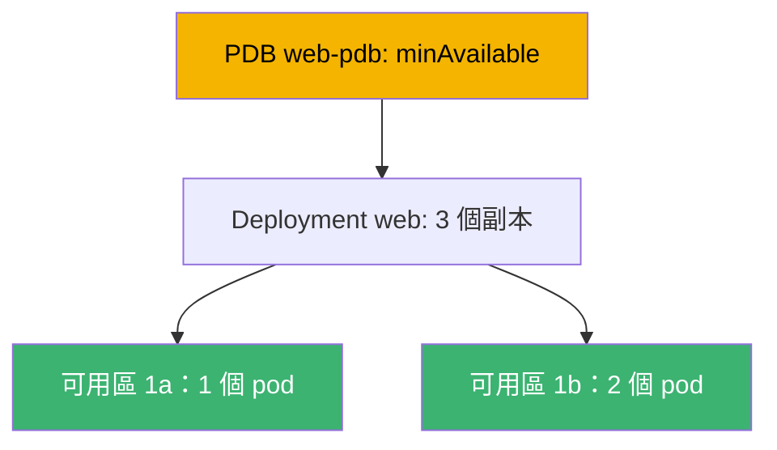
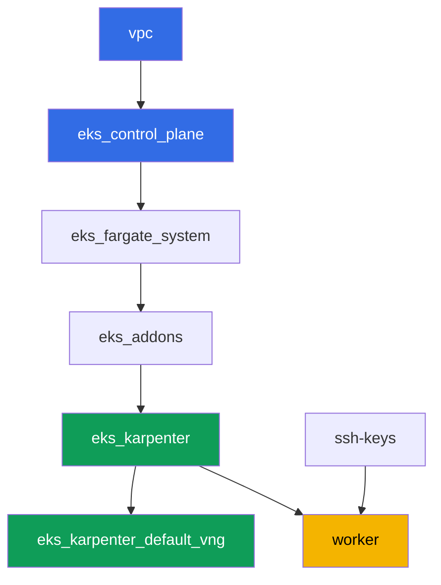

[Русская версия](README_RU.MD) · [Eng version](README.MD) · [Versión en español](README_ES.MD) · [Version française](README_FR.MD) · [Deutsche Version](README_DE.MD) · [ქართული ვერსია](README_GE.MD) · [日本語版](README_JP.MD)

# 實驗 131 - 可靠性：PDB 阻塞 drain、topology spread、matchLabelKeys

## 描述

集群只要持續運維就能存活：control plane 升級、節點替換、應用更新。這個實驗練習四種決定
負載能否挺過計劃性維護的機制。您將用 `topologySpreadConstraints` 把 Deployment 分散到多
個可用區，重現一個經典症狀 - 過於嚴格的 `PodDisruptionBudget` 永久阻塞 `kubectl drain` -
並修復它。接著您會加入 `unhealthyPodEvictionPolicy: AlwaysAllow`，讓故障的 pod 無法永遠卡
住 drain，然後執行滾動更新，驗證新版本自身仍在 `maxSkew` 範圍內分散於各可用區。

任務以生產風格書寫：簡短的任務描述加驗收標準。檢查是自動的，透過 `check_result` 命令。

## 目標

鞏固課程章節內容：

- [第 40 章。可靠性：multi-AZ、PDB、topology spread](../../course/40/ru.md) -
  正確停用節點

## 我們要創建的內容

| 對象 | 是什麼 | 在本實驗中的作用 |
|--------|---------|-------------------|
| Namespace `eks-131` | 本實驗負載所在的集群分區 | 讓資源與系統資源分開 |
| Deployment `web`（3 個副本） | 帶 topology spread 的 ping_pong 應用 | 透過 `matchLabelKeys` 分散到各可用區 |
| PDB `web-pdb` | 自願中斷預算 | 先阻塞 drain，之後修復 |
| 產物 `drain_blocked.txt` | 卡住的 drain 與說明 | 記錄嚴格 `minAvailable` 的症狀 |
| 產物 `drain_ok.txt` | 放寬 PDB 後成功的 drain | 確認修復 |
| 產物 `unhealthy_policy.txt` | `AlwaysAllow` 的說明 | 不健康的 pod 不會永遠阻塞 drain |
| 產物 `rollout.txt` | 成功的滾動更新 | `matchLabelKeys` 讓舊 pod 不再礙事 |

本實驗負載的整體圖景：



## 基礎設施

環境透過 Terragrunt 部署在 AWS（`eu-central-1`）。實驗中的每個目錄都是一個組件，擁有自己
的 `terragrunt.hcl`，它引用 `terraform/modules/` 中的共享模組，並透過 `dependency` 區塊
聲明依賴關係。Terragrunt 構建依賴圖並按正確順序套用各組件。無需為可用區單獨建立
NodePool：集群已在兩個 AZ（`eu-central-1a`、`eu-central-1b`）中部署，這對 topology spread
已經足夠。

### 模組與依賴

| 目錄（組件） | 模組（`terraform/modules/`） | 依賴於 | 創建的內容 |
|---------------------|-------------------------------|------------|-------------|
| `vpc` | `vpc_v3` | - | VPC `10.10.0.0/16`，兩個 AZ 中的公有和私有子網，NAT |
| `ssh-keys` | `ssh-keys` | - | 用於工作機和節點的 SSH 密鑰對 |
| `eks_control_plane` | `eks_v2_control_plane` | `vpc` | EKS control plane `1.36`、OIDC、security groups |
| `eks_fargate_system` | `eks_v2_fargate` | `vpc`、`eks_control_plane` | `kube-system` 和 `karpenter` 的 Fargate profile |
| `eks_addons` | `eks_v2_addons` | `eks_control_plane`、`eks_fargate_system` | coredns、kube-proxy、vpc-cni、pod-identity 等 addon |
| `eks_karpenter` | `eks_v2_karpenter` | `vpc`、`eks_control_plane`、`eks_addons`、`eks_fargate_system` | Karpenter 控制器，節點 IAM 角色 |
| `eks_karpenter_default_vng` | `eks_v2_karpenter_vng` | `vpc`、`eks_control_plane`、`eks_karpenter` | 兩個 AZ 中的預設 NodePool `default` |
| `worker` | `eks_v2_work_pc` | `ssh-keys`、`vpc`、`eks_control_plane`、`eks_karpenter` | 帶 kubectl、測試和 `check_result` 的工作機 |

依賴圖（越早套用的組件在箭頭方向上越靠下）：



系統 pod 運行在 Fargate 上，工作節點由 Karpenter 在兩個可用區中拉起 - 這正是本實驗拓撲
所依賴的故障域。

### 配置位置

配置分佈在兩個層級：共享的 `env.hcl` 和每個組件自己的 `inputs`。

`env.hcl`（所有組件共讀的共享環境參數）：

| 參數 | 實驗中的值 | 影響什麼 |
|----------|-----------------|---------------|
| `region` | `eu-central-1` | 所有資源的區域 |
| `vpc_default_cidr`、`subnets` | `10.10.0.0/16`，按 AZ 劃分的子網 | VPC 地址規劃及 topology spread 所用的可用區 |
| `prefix` | `eks-task131` | 資源和標籤名稱前綴 |
| `stack_name` | `eks131` | 用於構建 `env_name` - 集群名稱 |
| `k8_version` | `1.36.0` | 工作機上的 kubectl 版本 |
| `instance_type_worker` | `t3.medium` | 工作機實例類型 |
| `ssh_password_enable`、`access_cidrs` | `true`、`0.0.0.0/0` | 對工作機的 SSH 訪問 |
| `root_volume` | `gp3`、`10` | 工作機根磁碟 |

每個組件 `terragrunt.hcl` 中的 `inputs`（具體模組的設定）：

| 檔案 | 關鍵設定 |
|------|--------------------|
| `eks_control_plane/terragrunt.hcl` | `eks.version = "1.36"`，兩個 AZ 中節點用的私有子網 |
| `eks_addons/terragrunt.hcl` | 適配 1.36 的 addon 版本：kube-proxy、coredns、vpc-cni、pod-identity |
| `eks_fargate_system/terragrunt.hcl` | Fargate 的 namespace 選擇器（`kube-system`、`karpenter`） |
| `eks_karpenter/terragrunt.hcl` | Karpenter 版本 `1.8.1`，控制器資源 |
| `eks_karpenter_default_vng/terragrunt.hcl` | NodePool 的 `requirements`（架構、spot/on-demand、類型） |
| `worker/terragrunt.hcl` | 指向實驗 131 檔案的 `test_url` 和 `task_script_url`，`exam_time_minutes` |

規則：整個實驗共用的參數（區域、網絡、版本、前綴）放在 `env.hcl` 中；具體模組的設定放在其
`terragrunt.hcl` 的 `inputs` 中。

## 部署

```bash
TASK=131 make run_eks_task
```

部署大約需要 15-20 分鐘。在輸出中找到連接工作機的 SSH 那一行並連接上去。那裡的 kubectl
已經配置好指向目標集群。

工作機上的常用命令：

```bash
time_left       # 環境剩餘時間
check_result    # 檢查解答
```

> 測試環境的安全性。`env.hcl` 中啟用了 `ssh_password_enable = true` 和
> `access_cidrs = ["0.0.0.0/0"]` - 這對訓練環境很方便，但在生產環境中不應這樣做。按照課
> 程標準，對工作機的訪問應通過 AWS SSM Session Manager 進行，不對外暴露公有 SSH 端口，
> 且 `access_cidrs` 應限定到具體地址。這裡保留公有 SSH 只是為了簡化啟動流程。

## 任務

---
|        **1**        | **本實驗負載的 Namespace**                             |
| :-----------------: | :---------------------------------------------------------- |
| 要做什麼          | 創建一個名為 `eks-131` 的 namespace。本實驗的所有對象都在其中創建。 |
| 驗收標準    | - namespace `eks-131` 存在。 |
---
|        **2**        | **分散到各可用區的 Deployment**                        |
| :-----------------: | :---------------------------------------------------------- |
| 要做什麼          | 在 namespace `eks-131` 中創建 Deployment `web`，鏡像 `viktoruj/ping_pong:latest`，`3` 個副本。在 pod 模板中加入 `topologySpreadConstraints`：`maxSkew: 1`、`topologyKey: topology.kubernetes.io/zone`、`whenUnsatisfiable: DoNotSchedule`、`labelSelector.matchLabels: {app: web}`、`matchLabelKeys: [pod-template-hash]`。等待 `3` 個就緒副本分散在至少兩個可用區。用 `kubectl get pods -n eks-131 -o wide` 和節點的可用區標籤 `kubectl get nodes -L topology.kubernetes.io/zone` 檢查分散情況。 |
| 驗收標準    | - Deployment `web` 在 `eks-131` 中，鏡像 `viktoruj/ping_pong`，`3` 個就緒副本;<br/>- pod 規格中設有指定字段的 `topologySpreadConstraints`;<br/>- 副本運行在至少兩個不同可用區的節點上。 |
---
|        **3**        | **症狀：過於嚴格的 PDB 阻塞 drain**            |
| :-----------------: | :---------------------------------------------------------- |
| 要做什麼          | 在 `eks-131` 中創建 `PodDisruptionBudget` `web-pdb`，`minAvailable: 3`（等於 `web` 的副本數）以及 `selector.matchLabels: {app: web}`。取一個運行著 `web` 副本的節點，執行 `kubectl drain <節點> --ignore-daemonsets --delete-emptydir-data --timeout=60s`。命令必須因超時失敗：預算不允許驅逐任何一個 pod。將命令輸出保存到 `/var/work/tests/artifacts/3/drain_blocked.txt`，並在其中加入說明（詞語 `PDB` 和 `minAvailable`），解釋為何等於副本數的 `minAvailable` 會阻塞任何 drain。 |
| 驗收標準    | - PDB `web-pdb` 存在;<br/>- 檔案 `/var/work/tests/artifacts/3/drain_blocked.txt` 不為空且包含 `PDB` 和 `minAvailable`。 |
---
|        **4**        | **修復：放寬 PDB 並重試 drain**                |
| :-----------------: | :---------------------------------------------------------- |
| 要做什麼          | 把任務 3 中的節點恢復到服務中（`kubectl uncordon`）。將 `web-pdb` 放寬到 `minAvailable: 2`。在同一節點上重複 `kubectl drain` - 現在驅逐應該成功（一個副本被驅逐，替代副本出現在另一個節點上）。將確認結果（成功的 drain 輸出以及當前的 `kubectl get pdb web-pdb -n eks-131`）保存到檔案 `/var/work/tests/artifacts/4/drain_ok.txt`。 |
| 驗收標準    | - `web-pdb` 的 `minAvailable` 為 `2`;<br/>- 檔案 `/var/work/tests/artifacts/4/drain_ok.txt` 不為空。 |
---
|        **5**        | **unhealthyPodEvictionPolicy: AlwaysAllow**                 |
| :-----------------: | :---------------------------------------------------------- |
| 要做什麼          | 給 `web-pdb` 加上字段 `unhealthyPodEvictionPolicy: AlwaysAllow`（透過 `kubectl patch` 或重建）。用以下命令驗證該值：`kubectl get pdb web-pdb -n eks-131 -o jsonpath='{.spec.unhealthyPodEvictionPolicy}'`。將解釋保存到 `/var/work/tests/artifacts/5/unhealthy_policy.txt`，說明為何需要它：沒有 `AlwaysAllow`（即在默認策略 `IfHealthyBudget` 下），卡在 `CrashLoopBackOff` 中的故障 pod 本身就會阻塞預算計算，並可能永久阻塞 drain（詞語 `AlwaysAllow` 和 `CrashLoopBackOff`）。 |
| 驗收標準    | - `web-pdb` 的 `unhealthyPodEvictionPolicy` 為 `AlwaysAllow`;<br/>- 檔案 `/var/work/tests/artifacts/5/unhealthy_policy.txt` 不為空且包含所需詞語。 |
---
|        **6**        | **沒有卡住的 Pending 的滾動更新**                     |
| :-----------------: | :---------------------------------------------------------- |
| 要做什麼          | 更新 Deployment `web`，使其出現新的版本（例如 `kubectl set env deployment/web -n eks-131 RELEASE=v2`）。等待 `kubectl rollout status deployment/web -n eks-131` 且沒有卡住的 `Pending` pod，並檢查新版本的 pod（相同的 `pod-template-hash`）是否仍在 `maxSkew: 1` 範圍內分散於各可用區。將 `rollout status` 的輸出保存到檔案 `/var/work/tests/artifacts/6/rollout.txt`。`matchLabelKeys: [pod-template-hash]` 在這裡的作用：它給 skew 選擇器加上版本標籤，於是調度器只在自己版本的 pod 之間計算分佈，而不是與正在離開的舊 pod 一起算。一個公道的說明：在這個測試環境中，即使不用 `matchLabelKeys`（已驗證）rollout 也能通過 - 兩個可用區、三個副本，以及會為任何 `Pending` 添加節點的 Karpenter。差異會出現在靜態機群、可用區超過兩個、舊版本分佈不均的場景：此時同時按兩個版本計算的 skew 不會給新 pod 留下位置，它就要等舊副本被移除。 |
| 驗收標準    | - `web` 的全部 `3` 個副本已就緒並已更新;<br/>- 沒有任何 `web` pod 處於 `Pending`;<br/>- 新版本 pod 在各可用區間的 skew 不超過 `1`;<br/>- 檔案 `/var/work/tests/artifacts/6/rollout.txt` 不為空且確認 rollout 成功。 |
---

## 檢查結果

在工作機上運行自動檢查：

```bash
check_result
```

腳本會運行測試並顯示已完成任務的百分比。

## 解答

參考解答：[worker/files/solutions/1_TW.MD](worker/files/solutions/1_TW.MD)

## 刪除集群和資源

> **先移除 PDB 和負載。** 預算 `web-pdb` 限制了自願中斷，也就是說在排空節點時也會延緩正
> 常的 pod 驅逐。如果在負載仍存活時銷毀測試環境，Karpenter 的 EC2 節點會隨集群一起消失，
> 但 VPC CNI 的次要 ENI 會停留在 `available` 狀態並佔住節點的 security group -
> `destroy` 會卡在上面。順序：先 PDB，再 namespace，然後等待 EC2 節點消失。

```bash
kubectl delete pdb web-pdb -n eks-131 --ignore-not-found
kubectl delete namespace eks-131 --ignore-not-found

while kubectl get nodes --no-headers 2>/dev/null | grep -qv fargate; do
  echo "Karpenter 的 EC2 節點仍然存活，等待中..."; sleep 15
done
kubectl get nodes --no-headers
```

如果在實驗過程中留下了一個被 cordon 的節點（`kubectl drain` 之後沒有 `uncordon`），這不
會妨礙刪除：Karpenter 仍會終止這個空節點。

```bash
TASK=131 make delete_eks_task
```

如果 `destroy` 仍卡在節點的 security group 上，尋找一個孤立的 ENI：

```bash
aws ec2 describe-network-interfaces --filters Name=status,Values=available \
  --query 'NetworkInterfaces[].[NetworkInterfaceId,Description]' --output table
aws ec2 delete-network-interface --network-interface-id <eni-id>
```
