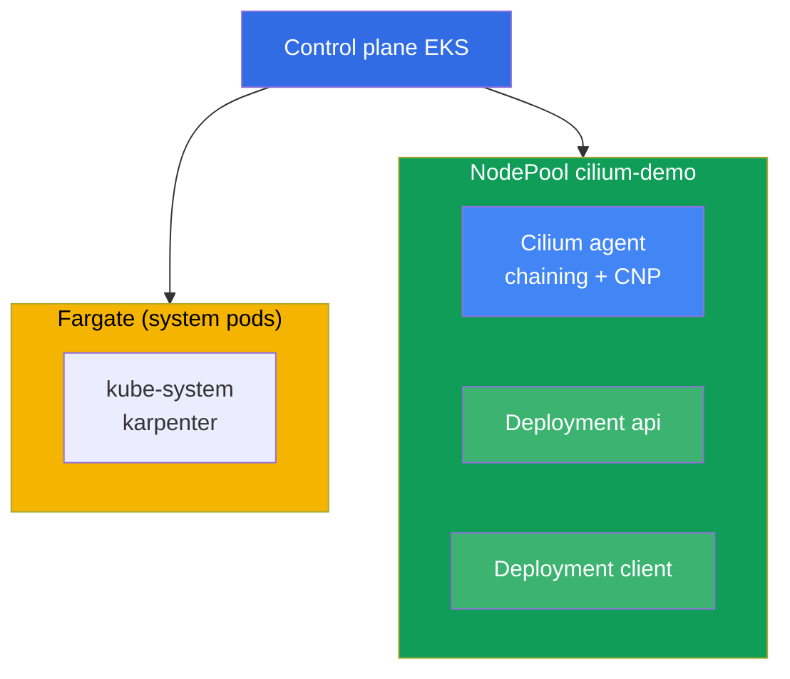
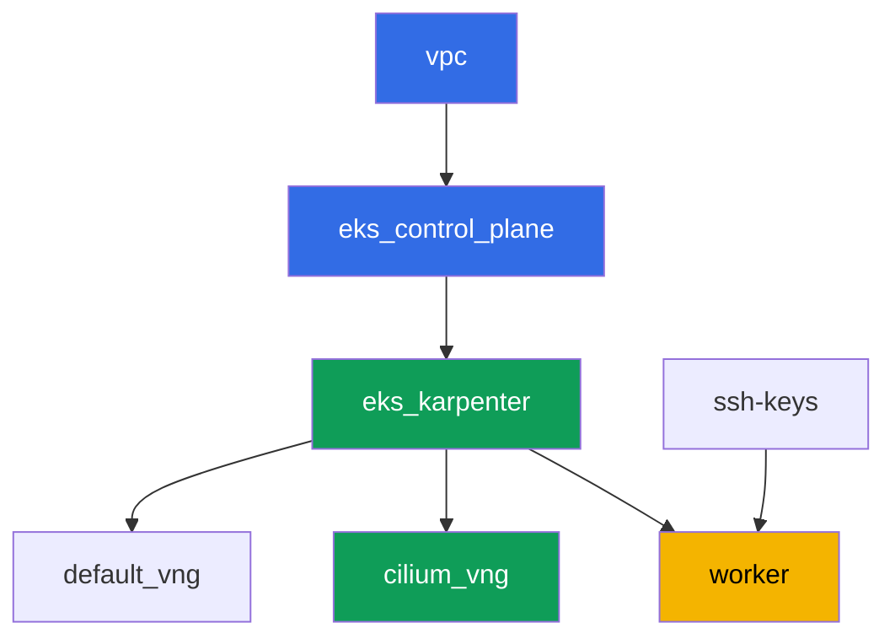

[Русская версия](README_RU.MD) · [Versión en español](README_ES.MD) · [Version française](README_FR.MD) · [Deutsche Version](README_DE.MD) · [ქართული ვერსია](README_GE.MD) · [繁體中文版](README_TW.MD) · [日本語版](README_JP.MD)

# Lab 132 - Alternative CNI: Cilium in CNI chaining mode over VPC CNI

## Description

In this lab you add Cilium on top of the standard VPC CNI in CNI chaining mode: pod
addresses are still handed out by VPC CNI through the ENI, and Cilium plugs into the chain
and adds its own eBPF programs on top of the already configured pod interface. You get
what the built-in VPC CNI network policy (lab 110) does not have - L7 rules by HTTP
method, DNS-name (FQDN) policies, and flow observability through Hubble, while IPAM and
VPC integrations stay exactly where they are.

A full replacement of VPC CNI (where `aws-node` is removed and Cilium becomes the IPAM
itself) is out of scope for this lab. Such a migration requires recreating nodes as a
blue/green operation, not flipping a flag on a live cluster (chapter 8, section 8.8), and
doing it in this lab's shared cluster NodePool would be unsafe. Only chaining is exercised
here - the most common and lowest-risk way to get L7/DNS policies and Hubble.

Tasks are written in a production style: a short statement plus acceptance criteria.
Checking is automatic, via the `check_result` command.

## Goal

Reinforce the material from the course chapters:

- [Chapter 8. Alternatives to VPC CNI: Cilium, network modes](../../course/08/en.md) - CNI
  chaining versus a full replacement, the honest cost of switching
- [Chapter 30. NetworkPolicy: rules, DNS, testing](../../course/30/en.md) - the limits of
  the built-in VPC CNI network policy and what Cilium adds

## What we're creating

The cluster is deployed as code (base as in lab 101), with a separate NodePool
`cilium-demo` added on top, with a taint, dedicated only to Cilium and this lab's
workload. Cilium is installed via Helm manually, and you create the workload and policies
on top of it.

| Object | What it is | Why it's in this lab |
|--------|---------|-------------------|
| NodePool `cilium-demo` | a second Karpenter NodePool, taint `dedicated=cilium-demo` | isolates Cilium and the demo workload from system pods and the default pool |
| Namespace `eks-132` | a cluster section for the lab's workload | keeps resources separate from system ones |
| DaemonSet `cilium` (kube-system) | Cilium agent in chaining mode | adds eBPF programs on top of the interface already configured by VPC CNI |
| Deployment `api` (2 replicas) + Service `api` | ping_pong server | target for L7 and FQDN policies |
| Deployment `client` | curl, `sleep 3600` | traffic source for testing policies |
| `CiliumNetworkPolicy` L7 | allows only `GET` on port `8080` | a capability the built-in VPC CNI NP does not have |
| `CiliumNetworkPolicy` FQDN | allows egress only to `aws.amazon.com` | a DNS-name policy unavailable to VPC CNI NP |
| Hubble relay | flow observability | `hubble observe` with verdict, instead of just agent logs |

The resulting cluster picture:



## Infrastructure

The environment is deployed in AWS (`eu-central-1`) via Terragrunt. Each lab directory is
one component with its own `terragrunt.hcl`, which references a shared module in
`terraform/modules/` and declares dependencies through `dependency` blocks. Terragrunt
builds a dependency graph and applies the components in the right order.

### Modules and dependencies

| Directory (component) | Module (`terraform/modules/`) | Depends on | What it creates |
|---------------------|-------------------------------|------------|-------------|
| `vpc` | `vpc_v3` | - | VPC `10.10.0.0/16`, subnets in two AZs, NAT |
| `ssh-keys` | `ssh-keys` | - | an SSH key pair for the worker machine and nodes |
| `eks_control_plane` | `eks_v2_control_plane` | `vpc` | EKS control plane `1.36`, OIDC |
| `eks_fargate_system` | `eks_v2_fargate` | `vpc`, `eks_control_plane` | Fargate profile: `coredns` in `kube-system` plus all of `karpenter` |
| `eks_addons` | `eks_v2_addons` | `eks_control_plane`, `eks_fargate_system` | coredns, kube-proxy, vpc-cni, pod-identity |
| `eks_karpenter` | `eks_v2_karpenter` | `vpc`, `eks_control_plane`, `eks_addons`, `eks_fargate_system` | Karpenter controller, node IAM role |
| `eks_karpenter_default_vng` | `eks_v2_karpenter_vng` | `vpc`, `eks_control_plane`, `eks_karpenter` | default NodePool `default`, no taint |
| `eks_karpenter_cilium_vng` | `eks_v2_karpenter_vng` | `vpc`, `eks_control_plane`, `eks_karpenter` | NodePool `cilium-demo`: taint `dedicated=cilium-demo` |
| `worker` | `eks_v2_work_pc` | `ssh-keys`, `vpc`, `eks_control_plane`, `eks_karpenter` | worker machine with kubectl, helm, tests and `check_result` |

Dependency graph (what gets applied earlier is lower down the arrow; `eks_fargate_system`
and `eks_addons` are not shown on the diagram due to the 8-node limit, but in fact sit
between `eks_control_plane` and `eks_karpenter`, as in the table above):



### Settings of NodePool `cilium-demo`

Key `requirements` in `eks_karpenter_cilium_vng/terragrunt.hcl`:

| Requirement | Value | Why |
|-------------|----------|-------|
| taint | `dedicated=cilium-demo:NoSchedule` | only pods with a toleration land on the pool |
| `vng.labels.work_type` | `cilium-demo` | Cilium and the workload are bound to this label via `nodeSelector` |
| `karpenter.sh/capacity-type` | `In ["on-demand"]` | predictable capacity for demonstrating Cilium |
| `karpenter.k8s.aws/instance-category` | `In ["c", "m", "r"]` | a reasonable set of families |
| `disruption.consolidationPolicy` | `WhenEmptyOrUnderutilized`, `consolidateAfter: 30s` | fast consolidation of empty nodes |

Cilium is not installed via Terraform but via Helm manually on the worker machine (task
3) - this is a deliberate choice: the lifecycle of a CNI you take on yourself should not be
disguised as managed infrastructure (chapter 8).

### Why the Fargate profile is narrowed to a label selector here

In the other labs of the course, the profile covers the whole `kube-system` namespace. Here
the selector for `kube-system` has the label `eks.amazonaws.com/component = coredns` added
to it, and `karpenter` remains a separate entry with no labels. This is not cosmetic.

The Fargate webhook tags with its profile ANY pod that lands in a listed namespace at the
moment the pod is created. After that the pod is scheduled only by `fargate-scheduler`,
which knows neither `hostNetwork` nor `nodeSelector` and never falls back to the regular
scheduler. The Cilium agent and operator use `hostNetwork`, so with a broad selector they
would stay stuck in `Pending` forever with `Pod not supported on Fargate: fields not
supported: HostNetwork`, Cilium's CRDs would never register, and the lab would not work at
all. The only system component that actually needs Fargate here is `coredns` (it carries
the standard EKS label `eks.amazonaws.com/component=coredns`), so the profile is narrowed
down to it.

The remaining parameters (region, network, versions, prefixes) are read from `env.hcl`, as
in lab 101; there is no need to change their logic.

## Deployment

```bash
TASK=132 make run_eks_task
```

Deployment takes roughly 15-20 minutes. In the output, find the line with the SSH
connection to the worker machine and connect to it. kubectl and helm there are already
configured for the right cluster.

Useful commands on the worker machine:

```bash
time_left       # how much environment time is left
check_result    # check the solution
```

> Installing Cilium via Helm takes 1-2 minutes, but until the agent comes up on a
> `cilium-demo` node, pods on it won't get its eBPF programs. Wait for all `cilium` pods to
> reach `Running` before moving on to the next task.

> In this cluster the short name `cnp` is ambiguous: VPC CNI brings its own resource
> `clusternetworkpolicies.networking.k8s.aws`, and kubectl warns about it. Use the full name
> `ciliumnetworkpolicies.cilium.io`.

> If Karpenter brings up a second node in the `cilium-demo` pool (the workload didn't fit
> on one), the Cilium DaemonSet will land on it too, and `api` pods may end up spread across
> both nodes. This is normal and doesn't break anything.

> Environment security. `env.hcl` has `ssh_password_enable = true` and
> `access_cidrs = ["0.0.0.0/0"]` enabled - convenient for a training environment, but this
> is not something to do in production. Per the course standards (chapters 0.2, 2, 19),
> access to worker machines should go through AWS SSM Session Manager without exposing
> public SSH ports, and `access_cidrs` should be narrowed down to specific addresses. Here
> public SSH is left in place only to keep the setup simple.

## Tasks

---
|        **1**        | **Namespace for the lab's workload**                             |
| :-----------------: | :---------------------------------------------------------- |
| What to do          | Create a namespace named `eks-132`. All objects in this lab are created inside it. |
| Acceptance criteria    | - namespace `eks-132` exists. |
---
|        **2**        | **Workload on the `cilium-demo` pool and connectivity on plain VPC CNI** |
| :-----------------: | :---------------------------------------------------------- |
| What to do          | In `eks-132`, create Deployment `api` (image `viktoruj/ping_pong:latest`, `2` replicas, port `8080`) and Service `api`. Create Deployment `client` (image `curlimages/curl:latest`, command `sleep 3600`). Both Deployments should have `nodeSelector` `work_type: cilium-demo` and a toleration for `dedicated=cilium-demo:NoSchedule` - this gives Karpenter a signal to bring up a node in the `cilium-demo` pool (an empty DaemonSet on its own would not request a node). Wait for readiness. At this step Cilium is not installed yet, all traffic goes through plain VPC CNI. Check `curl` from `client` to `api.eks-132.svc.cluster.local:8080` and save `HTTP_CODE=<code>` to the file `/var/work/tests/artifacts/2/connectivity_before.txt`. |
| Acceptance criteria    | - Deployment `api`, `2` ready replicas, Service `api` port `8080`;<br/>- Deployment `client`, `1` ready replica;<br/>- both on nodes `work_type=cilium-demo`;<br/>- file `2/connectivity_before.txt` contains `HTTP_CODE=200`. |
---
|        **3**        | **Cilium in CNI chaining mode, only on the `cilium-demo` pool** |
| :-----------------: | :---------------------------------------------------------- |
| What to do          | Install Cilium via Helm in chaining mode (`cni.chainingMode: aws-cni`), restricting `nodeSelector`/`tolerations` to nodes labeled `work_type: cilium-demo` only. Account for two chart quirks: the top-level `nodeSelector` is only inherited by the `cilium` DaemonSet, `cilium-envoy` and `cilium-operator` have their own sections (`envoy.*`, `operator.*`); and be sure to turn off `operator.unmanagedPodWatcher.restart` - otherwise the operator will keep deleting `coredns` pods on Fargate in a loop, since they cannot and never will have a `CiliumEndpoint`, and cluster DNS will go down. Wait until all Cilium pods reach `Running` and are located only on `cilium-demo` nodes. The `api` and `client` pods were started before Cilium was installed and are not connected to the chain - run `kubectl rollout restart` for both Deployments so they reconnect through Cilium (this is explicitly described in Cilium's documentation for chaining). Install the Cilium CLI and confirm `cilium status` - lines `Cilium:` and `OK`. Save the output to the file `/var/work/tests/artifacts/3/cilium_status.txt`. |
| Acceptance criteria    | - DaemonSet `cilium` in `kube-system` with `nodeSelector.work_type: cilium-demo`;<br/>- all `cilium` pods are `Running`;<br/>- file `3/cilium_status.txt` is not empty, contains `Cilium:` and `OK`. |
---
|        **4**        | **Proof of chaining: addresses are still from VPC CNI**       |
| :-----------------: | :---------------------------------------------------------- |
| What to do          | Save `kubectl get pods -n eks-132 -o wide` to the file `/var/work/tests/artifacts/4/podips.txt`. Confirm that the IPs of the `api` and `client` pods belong to the lab's VPC CIDR `10.10.0.0/16`, not a separate overlay range. This confirms that IPAM stayed with VPC CNI - Cilium only added policies and observability, it did not replace the addressing model (chapter 8, the section on chaining). |
| Acceptance criteria    | - file `4/podips.txt` is not empty;<br/>- contains at least two addresses starting with `10.10.`. |
---
|        **5**        | **L7 policy: allow only GET**                        |
| :-----------------: | :---------------------------------------------------------- |
| What to do          | Create `CiliumNetworkPolicy` `cilium-l7-allow-get` in `eks-132`: `endpointSelector` on `app: api`, ingress from `app: client` on port `8080/TCP` with `rules.http` - method `GET` allowed, all other methods denied. Check `curl` (GET) from `client` to `api` - save `HTTP_CODE=200` to the file `/var/work/tests/artifacts/5/allowed_get.txt`. Check `curl -X POST` from `client` to `api` - save the result (not `200`) to the file `/var/work/tests/artifacts/5/blocked_post.txt`. This L7 filter is unavailable to the built-in VPC CNI NetworkPolicy (chapter 8). |
| Acceptance criteria    | - `CiliumNetworkPolicy` `cilium-l7-allow-get` with `rules.http.method: GET`;<br/>- file `5/allowed_get.txt` contains `HTTP_CODE=200`;<br/>- file `5/blocked_post.txt` does not contain `HTTP_CODE=200`. |
---
|        **6**        | **FQDN policy: egress to only one domain name**        |
| :-----------------: | :---------------------------------------------------------- |
| What to do          | Create `CiliumNetworkPolicy` `cilium-fqdn-allow-aws` in `eks-132`: `endpointSelector` on `app: client`, the first egress block (`egress[0]`) is `toFQDNs.matchName: aws.amazon.com` on port `443/TCP`. Then two more blocks, without which the lab breaks. Allow DNS by CIDR (`toCIDRSet` with the service range `172.20.0.0/16` and the VPC CIDR `10.10.0.0/16`) on port `53` with `rules.dns`: a rule by the label `k8s-app: kube-dns` will not work here, because `coredns` lives on Fargate, has no `CiliumEndpoint`, and is only visible in the policy as `reserved:world`. And explicitly allow egress to `app: api` port `8080/TCP`: the `endpointSelector` turns on default-deny for all egress of the `client` pod, otherwise GET from task 5 will stop working. Check `curl` to `aws.amazon.com` - save `HTTP_CODE=<code>` to the file `/var/work/tests/artifacts/6/allowed_fqdn.txt`. Check `curl` to another external domain (e.g. `example.com`) with a timeout - save the result (not a successful code) to the file `/var/work/tests/artifacts/6/blocked_other_domain.txt`. The built-in VPC CNI NetworkPolicy has no rules by DNS name at all (chapter 8). |
| Acceptance criteria    | - `CiliumNetworkPolicy` `cilium-fqdn-allow-aws` with `egress[].toFQDNs[].matchName: aws.amazon.com`;<br/>- file `6/allowed_fqdn.txt` is not empty and contains `HTTP_CODE=`, where the code is `2xx` or `3xx`;<br/>- file `6/blocked_other_domain.txt` is not empty and does not contain `HTTP_CODE=200`. |
---
|        **7**        | **Hubble: flow observability with verdict**                  |
| :-----------------: | :---------------------------------------------------------- |
| What to do          | Enable Hubble relay (`helm upgrade cilium ... --set hubble.relay.enabled=true`, the same `nodeSelector` on `cilium-demo`). Install the Hubble CLI. Repeat a blocked request from task 5 or 6 to get a `DROPPED` event. Run `hubble observe` filtered by namespace `eks-132` and save the output, containing verdict `DROPPED`, to the file `/var/work/tests/artifacts/7/hubble_denied.txt`. The built-in VPC CNI NP's diagnostics has no such flow map with verdicts - only agent logs (chapter 8). |
| Acceptance criteria    | - Deployment `hubble-relay` in `kube-system` with `1` ready replica;<br/>- file `7/hubble_denied.txt` is not empty and contains `DROPPED`. |
---
|        **8**        | **Comparison: what Cilium added and what it costs you**            |
| :-----------------: | :---------------------------------------------------------- |
| What to do          | Save to the file `/var/work/tests/artifacts/8/comparison.txt` text (3-5 points) about what the built-in VPC CNI NetworkPolicy can do, what Cilium added in this lab, and what you pay for it. The text must contain the words `L7`, `FQDN` and `Hubble`. Separately state that a full replacement of VPC CNI is out of scope for this lab, referencing chapter 8 (the section on migrating CNI as a blue/green operation). |
| Acceptance criteria    | - file `8/comparison.txt` is not empty;<br/>- contains the words `L7`, `FQDN`, `Hubble`;<br/>- contains a mention of chapter 8 (`chapter 8`) and the word `blue` (from `blue/green`). |
---

## Checking the result

On the worker machine, run the automatic check:

```bash
check_result
```

The script runs the tests and shows the percentage of completed tasks.

## Solution

Reference solution: [worker/files/solutions/1.MD](worker/files/solutions/1.MD)

## Deleting the cluster and resources

First remove what you installed by hand from the cluster and wait for Karpenter to remove
the nodes. If you skip this, Terraform will try to delete the node security group while it
is still held by an orphaned ENI, and `destroy` will hang until it times out.

The order matters: Cilium goes first, then the workload. If you delete the workload first,
Karpenter will start collapsing the `cilium-demo` node together with the Cilium agent
running on it.

```bash
# 1. Remove Cilium (hubble-relay, cilium-envoy and the operator go with it)
# The pattern in brackets is mandatory: without it pkill matches its own command line
# and cuts off the rest of the block if you paste the commands as a batch, not one by one.
pkill -f "[p]ort-forward service/hubble-relay" || true
helm uninstall cilium -n kube-system

# 2. Remove the lab's policies and workload
kubectl delete ciliumnetworkpolicies.cilium.io -n eks-132 --all --ignore-not-found
kubectl delete namespace eks-132 --wait=true

# 3. Wait for Karpenter to remove the nodes of the cilium-demo pool (usually 1-2 minutes)
kubectl get nodes -l work_type=cilium-demo -w
```

Once there are no `cilium-demo` nodes left in the output, delete the infrastructure:

```bash
TASK=132 make delete_eks_task
```

If `destroy` still gets stuck on the node security group, find and delete the orphaned ENI:

```bash
aws ec2 describe-network-interfaces \
  --filters "Name=group-id,Values=<sg-id-from-the-error>" \
  --query 'NetworkInterfaces[].{Id:NetworkInterfaceId,Status:Status,Desc:Description}'
aws ec2 delete-network-interface --network-interface-id <eni-id>
```

After checking the lab, delete the environment's working directory, otherwise this lab's
modules will end up in the next one:

```bash
rm -rf terraform/environments/eks-labs
```
