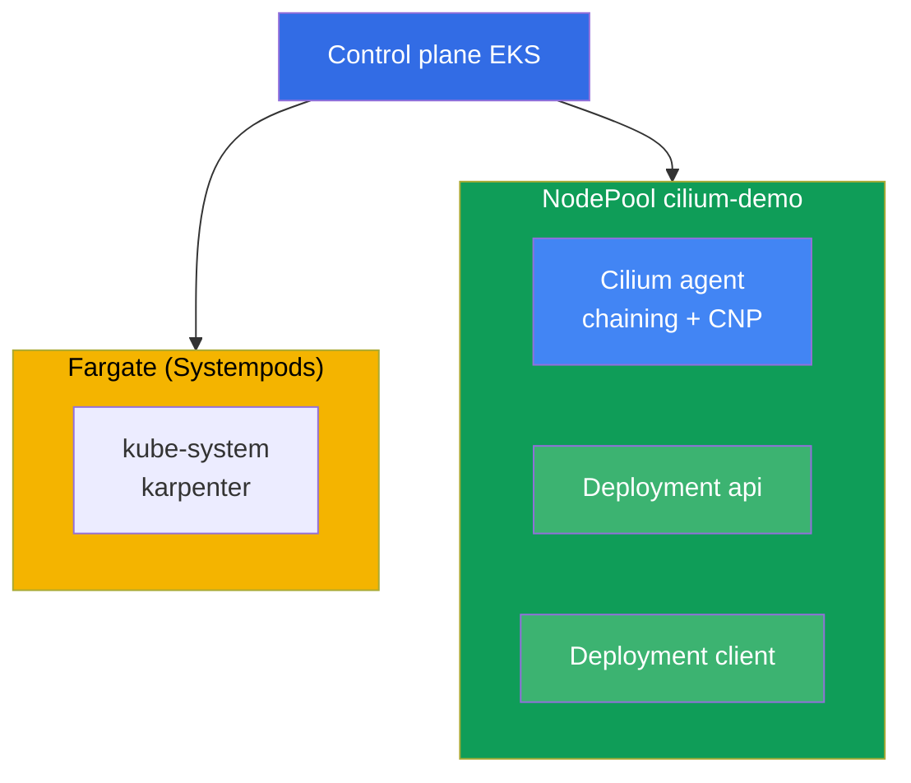
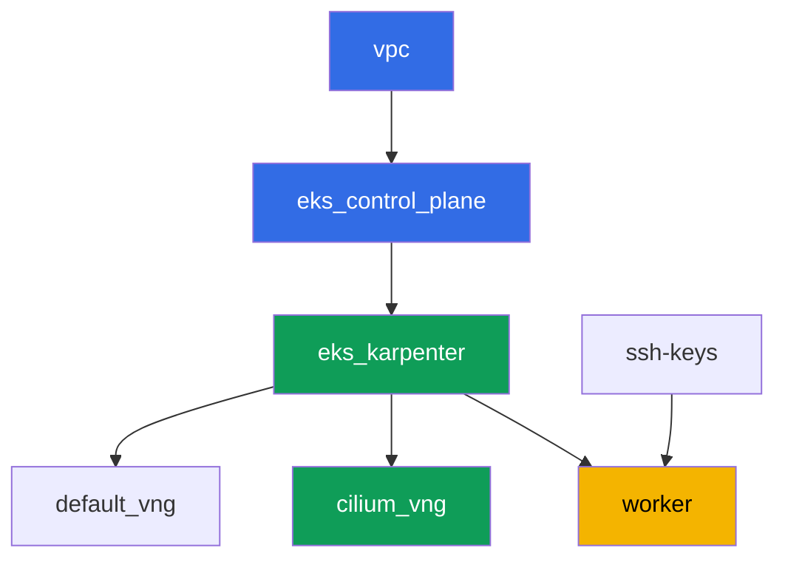

[Русская версия](README_RU.MD) · [Eng version](README.MD) · [Versión en español](README_ES.MD) · [Version française](README_FR.MD) · [ქართული ვერსია](README_GE.MD) · [繁體中文版](README_TW.MD) · [日本語版](README_JP.MD)

# Lab 132 - Alternatives CNI: Cilium im CNI-Chaining-Modus über VPC CNI

## Beschreibung

In diesem Lab fügst du Cilium über dem regulären VPC CNI im CNI-Chaining-Modus hinzu: die
Pod-Adressen werden weiterhin von VPC CNI über das ENI vergeben, und Cilium klinkt sich in
die Kette ein und fügt seine eigenen eBPF-Programme über der bereits konfigurierten
Pod-Schnittstelle hinzu. Du erhältst, was die eingebaute VPC CNI Network Policy (Lab 110)
nicht hat - L7-Regeln nach HTTP-Methode, Richtlinien nach DNS-Namen (FQDN) und
Flow-Observability über Hubble, während IPAM und die VPC-Integrationen an ihrem Platz
bleiben.

Ein vollständiger Ersatz von VPC CNI (bei dem `aws-node` entfernt wird und Cilium selbst
zum IPAM wird) gehört nicht zum Umfang dieses Labs. Eine solche Migration erfordert das
Neuerstellen der Nodes nach dem Blue/Green-Schema, nicht das Umschalten eines Flags auf
einem laufenden Cluster (Chapter 8, Abschnitt 8.8), und sie im gemeinsamen NodePool des
Clusters dieses Labs durchzuführen wäre unsicher. Hier wird nur das Chaining geübt - die
häufigste und risikoärmste Methode, um L7/DNS-Richtlinien und Hubble zu erhalten.

Die Aufgaben sind im Produktionsstil geschrieben: eine kurze Aufgabenstellung plus
Abnahmekriterien. Die Prüfung erfolgt automatisch über den Befehl `check_result`.

## Ziel

Den Stoff der Kurskapitel festigen:

- [Kapitel 8. Alternativen zu VPC CNI: Cilium, Netzwerkmodi](../../course/08/de.md) - CNI
  Chaining gegenüber einem vollständigen Ersatz, die ehrlichen Kosten des Umstiegs
- [Kapitel 30. NetworkPolicy: Regeln, DNS, Tests](../../course/30/de.md) - die Grenzen der
  eingebauten VPC CNI Network Policy und was Cilium hinzufügt

## Was wir erstellen

Der Cluster wird als Code bereitgestellt (Basis wie in Lab 101), darüber wird ein separater
NodePool `cilium-demo` mit einem Taint hinzugefügt, ausschließlich für Cilium und die Last
dieses Labs. Cilium wird manuell über Helm installiert, und du erstellst die Last und die
Richtlinien darüber.

| Objekt | Was es ist | Wozu es in diesem Lab dient |
|--------|---------|-------------------|
| NodePool `cilium-demo` | ein zweiter Karpenter-NodePool, Taint `dedicated=cilium-demo` | isoliert Cilium und die Demo-Last von Systempods und dem Default-Pool |
| Namespace `eks-132` | ein Cluster-Abschnitt für die Last dieses Labs | hält Ressourcen getrennt von Systemressourcen |
| DaemonSet `cilium` (kube-system) | Cilium-Agent im Chaining-Modus | fügt eBPF-Programme über der von VPC CNI bereits konfigurierten Schnittstelle hinzu |
| Deployment `api` (2 Replicas) + Service `api` | ping_pong-Server | Ziel für L7- und FQDN-Richtlinien |
| Deployment `client` | curl, `sleep 3600` | Traffic-Quelle zum Testen der Richtlinien |
| `CiliumNetworkPolicy` L7 | erlaubt nur `GET` auf Port `8080` | eine Fähigkeit, die die eingebaute VPC CNI NP nicht hat |
| `CiliumNetworkPolicy` FQDN | erlaubt Egress nur zu `aws.amazon.com` | eine DNS-Namens-Richtlinie, die VPC CNI NP nicht bietet |
| Hubble relay | Flow-Observability | `hubble observe` mit Verdict, statt nur Agent-Logs |

Das resultierende Cluster-Bild:



## Infrastruktur

Die Umgebung wird in AWS (`eu-central-1`) über Terragrunt bereitgestellt. Jedes
Lab-Verzeichnis ist eine Komponente mit eigenem `terragrunt.hcl`, das auf ein gemeinsames
Modul in `terraform/modules/` verweist und Abhängigkeiten über `dependency`-Blöcke
deklariert. Terragrunt baut einen Abhängigkeitsgraphen und wendet die Komponenten in der
richtigen Reihenfolge an.

### Module und Abhängigkeiten

| Verzeichnis (Komponente) | Modul (`terraform/modules/`) | Abhängig von | Was es erstellt |
|---------------------|-------------------------------|------------|-------------|
| `vpc` | `vpc_v3` | - | VPC `10.10.0.0/16`, Subnetze in zwei AZs, NAT |
| `ssh-keys` | `ssh-keys` | - | ein SSH-Schlüsselpaar für die Worker-Maschine und die Nodes |
| `eks_control_plane` | `eks_v2_control_plane` | `vpc` | EKS Control Plane `1.36`, OIDC |
| `eks_fargate_system` | `eks_v2_fargate` | `vpc`, `eks_control_plane` | Fargate-Profil: `coredns` in `kube-system` plus das gesamte `karpenter` |
| `eks_addons` | `eks_v2_addons` | `eks_control_plane`, `eks_fargate_system` | coredns, kube-proxy, vpc-cni, pod-identity |
| `eks_karpenter` | `eks_v2_karpenter` | `vpc`, `eks_control_plane`, `eks_addons`, `eks_fargate_system` | Karpenter-Controller, IAM-Rolle der Nodes |
| `eks_karpenter_default_vng` | `eks_v2_karpenter_vng` | `vpc`, `eks_control_plane`, `eks_karpenter` | Standard-NodePool `default`, ohne Taint |
| `eks_karpenter_cilium_vng` | `eks_v2_karpenter_vng` | `vpc`, `eks_control_plane`, `eks_karpenter` | NodePool `cilium-demo`: Taint `dedicated=cilium-demo` |
| `worker` | `eks_v2_work_pc` | `ssh-keys`, `vpc`, `eks_control_plane`, `eks_karpenter` | Worker-Maschine mit kubectl, helm, Tests und `check_result` |

Abhängigkeitsgraph (was früher angewendet wird, steht weiter unten im Pfeil;
`eks_fargate_system` und `eks_addons` werden im Diagramm wegen der Grenze von 8 Knoten nicht
angezeigt, stehen aber tatsächlich zwischen `eks_control_plane` und `eks_karpenter`, wie in
der Tabelle oben):



### Einstellungen des NodePool `cilium-demo`

Wichtige `requirements` in `eks_karpenter_cilium_vng/terragrunt.hcl`:

| Requirement | Wert | Wozu |
|-------------|----------|-------|
| taint | `dedicated=cilium-demo:NoSchedule` | nur Pods mit passender Toleration landen im Pool |
| `vng.labels.work_type` | `cilium-demo` | Cilium und die Last werden über `nodeSelector` an dieses Label gebunden |
| `karpenter.sh/capacity-type` | `In ["on-demand"]` | vorhersagbare Kapazität für die Cilium-Demonstration |
| `karpenter.k8s.aws/instance-category` | `In ["c", "m", "r"]` | eine sinnvolle Menge an Familien |
| `disruption.consolidationPolicy` | `WhenEmptyOrUnderutilized`, `consolidateAfter: 30s` | schnelle Konsolidierung leerer Nodes |

Cilium wird nicht über Terraform installiert, sondern manuell über Helm auf der
Worker-Maschine (Aufgabe 3) - das ist eine bewusste Entscheidung: der Lebenszyklus eines
CNI, den du selbst übernimmst, sollte sich nicht als verwaltete Infrastruktur ausgeben
(Chapter 8).

### Warum das Fargate-Profil hier auf einen Label-Selektor eingeschränkt ist

In den übrigen Labs des Kurses deckt das Profil den gesamten Namespace `kube-system` ab.
Hier wurde dem Selektor für `kube-system` zusätzlich das Label
`eks.amazonaws.com/component = coredns` hinzugefügt, und `karpenter` bleibt ein separater
Eintrag ohne Labels. Das ist kein kosmetisches Detail.

Der Fargate-Webhook markiert mit seinem Profil JEDEN Pod, der im Moment seiner Erstellung
in einen aufgeführten Namespace fällt. Danach wird der Pod nur noch vom
`fargate-scheduler` geplant, der weder `hostNetwork` noch `nodeSelector` kennt und niemals
auf den regulären Scheduler zurückfällt. Der Cilium-Agent und -Operator nutzen
`hostNetwork`, daher würden sie bei einem breiten Selektor für immer in `Pending` mit
`Pod not supported on Fargate: fields not supported: HostNetwork` bleiben, die CRDs von
Cilium würden sich nie registrieren, und das Lab würde überhaupt nicht funktionieren. Die
einzige Systemkomponente, die Fargate hier tatsächlich braucht, ist `coredns` (es trägt das
standardmäßige EKS-Label `eks.amazonaws.com/component=coredns`), deshalb ist das Profil
darauf eingeschränkt.

Die übrigen Parameter (Region, Netzwerk, Versionen, Präfixe) werden aus `env.hcl` gelesen,
wie in Lab 101; ihre Logik muss nicht geändert werden.

## Bereitstellung

```bash
TASK=132 make run_eks_task
```

Die Bereitstellung dauert etwa 15-20 Minuten. Suche in der Ausgabe die Zeile mit der
SSH-Verbindung zur Worker-Maschine und verbinde dich damit. kubectl und helm sind dort
bereits für den richtigen Cluster konfiguriert.

Nützliche Befehle auf der Worker-Maschine:

```bash
time_left       # wie viel Zeit der Umgebung noch bleibt
check_result    # die Lösung prüfen
```

> Die Installation von Cilium über Helm dauert 1-2 Minuten, aber solange der Agent auf
> einem `cilium-demo`-Node nicht hochgefahren ist, erhalten die Pods dort seine
> eBPF-Programme nicht. Warte, bis alle `cilium`-Pods `Running` erreicht haben, bevor du zur
> nächsten Aufgabe übergehst.

> In diesem Cluster ist der Kurzname `cnp` mehrdeutig: VPC CNI bringt seine eigene Ressource
> `clusternetworkpolicies.networking.k8s.aws` mit, und kubectl warnt davor. Verwende den
> vollständigen Namen `ciliumnetworkpolicies.cilium.io`.

> Wenn Karpenter einen zweiten Node im Pool `cilium-demo` hochfährt (die Last passte nicht
> auf einen), landet das Cilium-DaemonSet auch dort, und die `api`-Pods können sich auf
> beide Nodes verteilen. Das ist normal und stört nichts.

> Sicherheit der Umgebung. In `env.hcl` sind `ssh_password_enable = true` und
> `access_cidrs = ["0.0.0.0/0"]` aktiviert - praktisch für eine Lernumgebung, aber so sollte
> man es in der Produktion nicht machen. Nach den Kursstandards (Kapitel 0.2, 2, 19) sollte
> der Zugriff auf Worker-Maschinen über AWS SSM Session Manager erfolgen, ohne öffentliche
> SSH-Ports nach außen zu öffnen, und `access_cidrs` sollte auf konkrete Adressen
> eingeschränkt werden. Hier bleibt öffentliches SSH nur der Einfachheit halber erhalten.

## Aufgaben

---
|        **1**        | **Namespace für die Last dieses Labs**                             |
| :-----------------: | :---------------------------------------------------------- |
| Was zu tun ist          | Erstelle einen Namespace mit dem Namen `eks-132`. Alle Objekte dieses Labs werden darin erstellt. |
| Abnahmekriterien    | - Namespace `eks-132` existiert. |
---
|        **2**        | **Last im Pool `cilium-demo` und Konnektivität über reines VPC CNI** |
| :-----------------: | :---------------------------------------------------------- |
| Was zu tun ist          | Erstelle in `eks-132` das Deployment `api` (Image `viktoruj/ping_pong:latest`, `2` Replicas, Port `8080`) und den Service `api`. Erstelle das Deployment `client` (Image `curlimages/curl:latest`, Befehl `sleep 3600`). Beide Deployments sollten `nodeSelector` `work_type: cilium-demo` und eine Toleration für `dedicated=cilium-demo:NoSchedule` haben - das gibt Karpenter das Signal, einen Node im Pool `cilium-demo` hochzufahren (ein leeres DaemonSet würde von sich aus keinen Node anfordern). Warte auf die Bereitschaft. In diesem Schritt ist Cilium noch nicht installiert, der gesamte Traffic läuft über reines VPC CNI. Prüfe `curl` von `client` zu `api.eks-132.svc.cluster.local:8080` und speichere `HTTP_CODE=<Code>` in der Datei `/var/work/tests/artifacts/2/connectivity_before.txt`. |
| Abnahmekriterien    | - Deployment `api`, `2` bereite Replicas, Service `api` Port `8080`;<br/>- Deployment `client`, `1` bereite Replica;<br/>- beide auf Nodes `work_type=cilium-demo`;<br/>- Datei `2/connectivity_before.txt` enthält `HTTP_CODE=200`. |
---
|        **3**        | **Cilium im CNI-Chaining-Modus, nur im Pool `cilium-demo`** |
| :-----------------: | :---------------------------------------------------------- |
| Was zu tun ist          | Installiere Cilium über Helm im Chaining-Modus (`cni.chainingMode: aws-cni`), wobei `nodeSelector`/`tolerations` nur auf Nodes mit dem Label `work_type: cilium-demo` beschränkt werden. Beachte zwei Besonderheiten des Charts: der oberste `nodeSelector` wird nur vom DaemonSet `cilium` übernommen, `cilium-envoy` und `cilium-operator` haben eigene Abschnitte (`envoy.*`, `operator.*`); und deaktiviere unbedingt `operator.unmanagedPodWatcher.restart` - sonst löscht der Operator immer wieder im Kreis die `coredns`-Pods auf Fargate, die kein `CiliumEndpoint` haben und nie haben können, und das DNS im Cluster fällt aus. Warte, bis alle Cilium-Pods `Running` erreicht haben und sich nur auf `cilium-demo`-Nodes befinden. Die Pods `api` und `client` wurden vor der Installation von Cilium gestartet und sind nicht an die Kette angebunden - führe `kubectl rollout restart` für beide Deployments aus, damit sie sich über Cilium neu verbinden (das ist in der Cilium-Dokumentation für Chaining explizit beschrieben). Installiere die Cilium CLI und bestätige `cilium status` - Zeilen `Cilium:` und `OK`. Speichere die Ausgabe in der Datei `/var/work/tests/artifacts/3/cilium_status.txt`. |
| Abnahmekriterien    | - DaemonSet `cilium` in `kube-system` mit `nodeSelector.work_type: cilium-demo`;<br/>- alle `cilium`-Pods sind `Running`;<br/>- Datei `3/cilium_status.txt` ist nicht leer, enthält `Cilium:` und `OK`. |
---
|        **4**        | **Beweis des Chaining: Adressen kommen immer noch von VPC CNI**       |
| :-----------------: | :---------------------------------------------------------- |
| Was zu tun ist          | Speichere `kubectl get pods -n eks-132 -o wide` in der Datei `/var/work/tests/artifacts/4/podips.txt`. Stelle sicher, dass die IPs der Pods `api` und `client` aus dem VPC-CIDR dieses Labs `10.10.0.0/16` stammen, nicht aus einem separaten Overlay-Bereich. Das bestätigt, dass IPAM bei VPC CNI geblieben ist - Cilium hat nur Richtlinien und Observability hinzugefügt, nicht das Adressierungsmodell ersetzt (Chapter 8, der Abschnitt über Chaining). |
| Abnahmekriterien    | - Datei `4/podips.txt` ist nicht leer;<br/>- enthält mindestens zwei Adressen, die mit `10.10.` beginnen. |
---
|        **5**        | **L7-Richtlinie: nur GET erlauben**                        |
| :-----------------: | :---------------------------------------------------------- |
| Was zu tun ist          | Erstelle `CiliumNetworkPolicy` `cilium-l7-allow-get` in `eks-132`: `endpointSelector` auf `app: api`, Ingress von `app: client` auf Port `8080/TCP` mit `rules.http` - Methode `GET` erlaubt, alle anderen Methoden verboten. Prüfe `curl` (GET) von `client` zu `api` - speichere `HTTP_CODE=200` in der Datei `/var/work/tests/artifacts/5/allowed_get.txt`. Prüfe `curl -X POST` von `client` zu `api` - speichere das Ergebnis (nicht `200`) in der Datei `/var/work/tests/artifacts/5/blocked_post.txt`. Dieser L7-Filter ist bei der eingebauten VPC CNI NetworkPolicy nicht verfügbar (Chapter 8). |
| Abnahmekriterien    | - `CiliumNetworkPolicy` `cilium-l7-allow-get` mit `rules.http.method: GET`;<br/>- Datei `5/allowed_get.txt` enthält `HTTP_CODE=200`;<br/>- Datei `5/blocked_post.txt` enthält nicht `HTTP_CODE=200`. |
---
|        **6**        | **FQDN-Richtlinie: Egress nur zu einem Domainnamen**        |
| :-----------------: | :---------------------------------------------------------- |
| Was zu tun ist          | Erstelle `CiliumNetworkPolicy` `cilium-fqdn-allow-aws` in `eks-132`: `endpointSelector` auf `app: client`, der erste Egress-Block (`egress[0]`) ist `toFQDNs.matchName: aws.amazon.com` auf Port `443/TCP`. Danach zwei weitere Blöcke, ohne die das Lab nicht funktioniert. Erlaube DNS per CIDR (`toCIDRSet` mit dem Service-Bereich `172.20.0.0/16` und dem VPC-CIDR `10.10.0.0/16`) auf Port `53` mit `rules.dns`: eine Regel über das Label `k8s-app: kube-dns` funktioniert hier nicht, weil `coredns` auf Fargate läuft, kein `CiliumEndpoint` hat und in der Richtlinie nur als `reserved:world` sichtbar ist. Und erlaube explizit Egress zu `app: api` Port `8080/TCP`: der `endpointSelector` aktiviert Default-Deny für den gesamten Egress des Pods `client`, sonst funktioniert das GET aus Aufgabe 5 nicht mehr. Prüfe `curl` zu `aws.amazon.com` - speichere `HTTP_CODE=<Code>` in der Datei `/var/work/tests/artifacts/6/allowed_fqdn.txt`. Prüfe `curl` zu einer anderen externen Domain (z. B. `example.com`) mit Timeout - speichere das Ergebnis (keinen erfolgreichen Code) in der Datei `/var/work/tests/artifacts/6/blocked_other_domain.txt`. Die eingebaute VPC CNI NetworkPolicy hat überhaupt keine Regeln nach DNS-Namen (Chapter 8). |
| Abnahmekriterien    | - `CiliumNetworkPolicy` `cilium-fqdn-allow-aws` mit `egress[].toFQDNs[].matchName: aws.amazon.com`;<br/>- Datei `6/allowed_fqdn.txt` ist nicht leer und enthält `HTTP_CODE=`, wobei der Code `2xx` oder `3xx` ist;<br/>- Datei `6/blocked_other_domain.txt` ist nicht leer und enthält nicht `HTTP_CODE=200`. |
---
|        **7**        | **Hubble: Flow-Observability mit Verdict**                  |
| :-----------------: | :---------------------------------------------------------- |
| Was zu tun ist          | Aktiviere Hubble relay (`helm upgrade cilium ... --set hubble.relay.enabled=true`, derselbe `nodeSelector` auf `cilium-demo`). Installiere die Hubble CLI. Wiederhole eine blockierte Anfrage aus Aufgabe 5 oder 6, um ein `DROPPED`-Ereignis zu erhalten. Führe `hubble observe` gefiltert nach Namespace `eks-132` aus und speichere die Ausgabe, die das Verdict `DROPPED` enthält, in der Datei `/var/work/tests/artifacts/7/hubble_denied.txt`. Die Diagnose der eingebauten VPC CNI NP hat keine solche Flow-Karte mit Verdicts - nur Agent-Logs (Chapter 8). |
| Abnahmekriterien    | - Deployment `hubble-relay` in `kube-system` mit `1` bereiter Replica;<br/>- Datei `7/hubble_denied.txt` ist nicht leer und enthält `DROPPED`. |
---
|        **8**        | **Vergleich: was Cilium hinzugefügt hat und was es kostet**            |
| :-----------------: | :---------------------------------------------------------- |
| Was zu tun ist          | Speichere in der Datei `/var/work/tests/artifacts/8/comparison.txt` einen Text (3-5 Punkte) darüber, was die eingebaute VPC CNI NetworkPolicy kann, was Cilium in diesem Lab hinzugefügt hat, und was du dafür bezahlst. Der Text muss die Wörter `L7`, `FQDN` und `Hubble` enthalten. Weise gesondert darauf hin, dass ein vollständiger Ersatz von VPC CNI nicht zum Umfang dieses Labs gehört, mit Verweis auf Chapter 8 (den Abschnitt über die CNI-Migration als Blue/Green-Operation). |
| Abnahmekriterien    | - Datei `8/comparison.txt` ist nicht leer;<br/>- enthält die Wörter `L7`, `FQDN`, `Hubble`;<br/>- enthält eine Erwähnung von Chapter 8 (`chapter 8`) und das Wort `blue` (von `blue/green`). |
---

## Ergebnisprüfung

Führe auf der Worker-Maschine die automatische Prüfung aus:

```bash
check_result
```

Das Skript führt die Tests durch und zeigt den Prozentsatz der erledigten Aufgaben an.

## Lösung

Referenzlösung: [worker/files/solutions/1_DE.MD](worker/files/solutions/1_DE.MD)

## Löschen des Clusters und der Ressourcen

Entferne zuerst das, was du manuell im Cluster installiert hast, und warte, bis Karpenter
die Nodes entfernt hat. Andernfalls versucht Terraform, die Security Group der Nodes zu
löschen, während sie noch von einem verwaisten ENI gehalten wird, und `destroy` bleibt bis
zum Timeout hängen.

Die Reihenfolge ist wichtig: zuerst geht Cilium, dann die Last. Wenn du die Last zuerst
löschst, beginnt Karpenter, den `cilium-demo`-Node zusammen mit dem darauf laufenden
Cilium-Agenten einzuklappen.

```bash
# 1. Cilium entfernen (mit ihm gehen hubble-relay, cilium-envoy und der Operator)
# Das Muster in Klammern ist obligatorisch: ohne es matcht pkill seine eigene Kommandozeile
# und bricht den Rest des Blocks ab, wenn du die Befehle im Block einfügst, nicht einzeln.
pkill -f "[p]ort-forward service/hubble-relay" || true
helm uninstall cilium -n kube-system

# 2. Richtlinien und Last dieses Labs entfernen
kubectl delete ciliumnetworkpolicies.cilium.io -n eks-132 --all --ignore-not-found
kubectl delete namespace eks-132 --wait=true

# 3. Warten, bis Karpenter die Nodes des Pools cilium-demo entfernt hat (normalerweise 1-2 Minuten)
kubectl get nodes -l work_type=cilium-demo -w
```

Wenn keine `cilium-demo`-Nodes mehr in der Ausgabe stehen, lösche die Infrastruktur:

```bash
TASK=132 make delete_eks_task
```

Wenn `destroy` trotzdem an der Security Group der Nodes hängen bleibt, finde und lösche das
verwaiste ENI:

```bash
aws ec2 describe-network-interfaces \
  --filters "Name=group-id,Values=<sg-id-aus-dem-fehler>" \
  --query 'NetworkInterfaces[].{Id:NetworkInterfaceId,Status:Status,Desc:Description}'
aws ec2 delete-network-interface --network-interface-id <eni-id>
```

Lösche nach der Prüfung des Labs das Arbeitsverzeichnis der Umgebung, sonst landen die
Module dieses Labs im nächsten:

```bash
rm -rf terraform/environments/eks-labs
```
