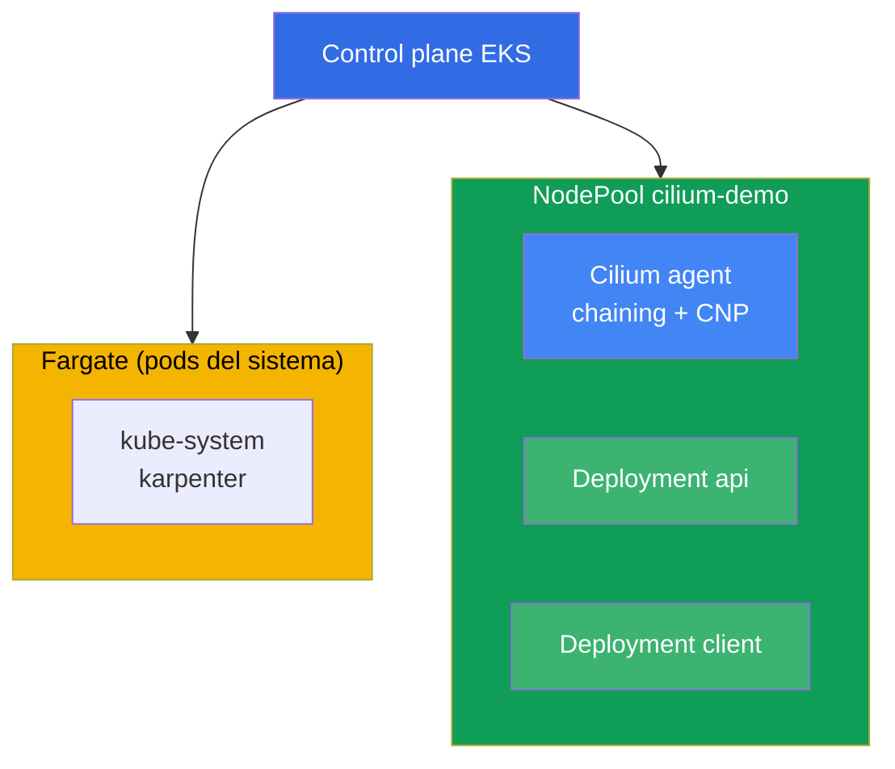
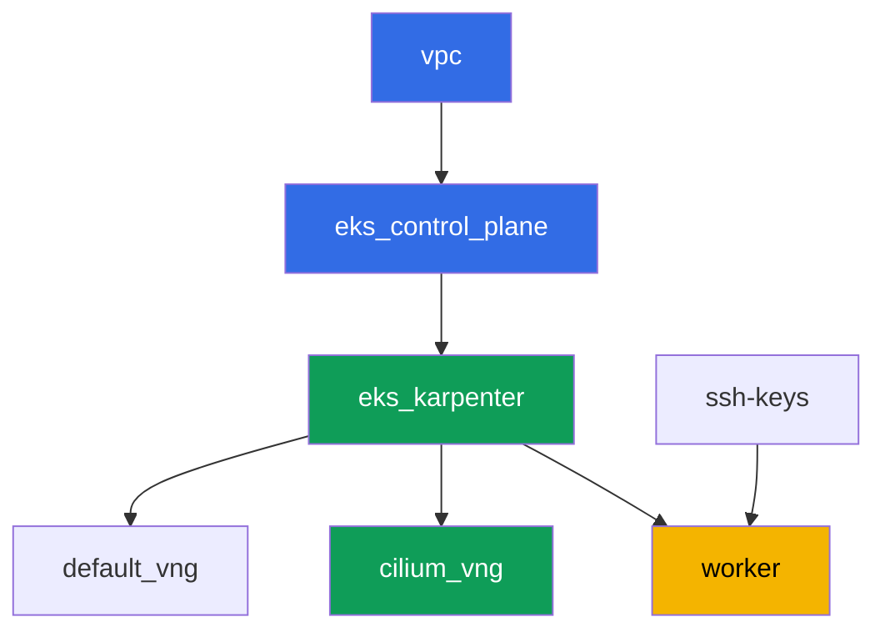

[Русская версия](README_RU.MD) · [Eng version](README.MD) · [Version française](README_FR.MD) · [Deutsche Version](README_DE.MD) · [ქართული ვერსია](README_GE.MD) · [繁體中文版](README_TW.MD) · [日本語版](README_JP.MD)

# Lab 132 - CNI alternativo: Cilium en modo CNI chaining sobre VPC CNI

## Descripción

En esta lab añades Cilium encima del VPC CNI estándar en modo CNI chaining: las direcciones
de los pods siguen siendo asignadas por VPC CNI a través del ENI, y Cilium se conecta en la
cadena y añade sus propios programas eBPF encima de la interfaz del pod ya configurada.
Obtienes lo que la network policy integrada de VPC CNI (lab 110) no tiene - reglas L7 por
método HTTP, políticas por nombre DNS (FQDN) y observabilidad de flujos mediante Hubble,
mientras que el IPAM y las integraciones con VPC permanecen exactamente donde están.

Un reemplazo completo de VPC CNI (donde se elimina `aws-node` y Cilium se convierte en el
propio IPAM) está fuera del alcance de esta lab. Esa migración requiere recrear los nodos
mediante una operación blue/green, no cambiar un flag en un clúster en vivo (chapter 8,
sección 8.8), y hacerlo en el NodePool compartido del clúster de esta lab sería inseguro.
Aquí solo se practica el chaining - la forma más común y de menor riesgo de obtener
políticas L7/DNS y Hubble.

Las tareas están escritas en estilo producción: un enunciado breve más criterios de
aceptación. La verificación es automática, mediante el comando `check_result`.

## Objetivo

Reforzar el material de los capítulos del curso:

- [Capítulo 8. Alternativas a VPC CNI: Cilium, modos de red](../../course/08/ru.md) - CNI
  chaining frente a un reemplazo completo, el coste honesto del cambio
- [Capítulo 30. NetworkPolicy: reglas, DNS, pruebas](../../course/30/ru.md) - los límites de
  la network policy integrada de VPC CNI y qué añade Cilium

## Qué creamos

El clúster se despliega como código (base como en la lab 101), con un NodePool separado
`cilium-demo` añadido encima, con un taint, dedicado únicamente a Cilium y a la carga de
esta lab. Cilium se instala mediante Helm manualmente, y tú creas la carga y las políticas
encima de él.

| Objeto | Qué es | Por qué está en esta lab |
|--------|---------|-------------------|
| NodePool `cilium-demo` | un segundo NodePool de Karpenter, taint `dedicated=cilium-demo` | aísla Cilium y la carga de demostración de los pods del sistema y del pool por defecto |
| Namespace `eks-132` | una sección del clúster para la carga de la lab | mantiene los recursos separados de los del sistema |
| DaemonSet `cilium` (kube-system) | agente de Cilium en modo chaining | añade programas eBPF encima de la interfaz ya configurada por VPC CNI |
| Deployment `api` (2 réplicas) + Service `api` | servidor ping_pong | objetivo de las políticas L7 y FQDN |
| Deployment `client` | curl, `sleep 3600` | fuente de tráfico para probar las políticas |
| `CiliumNetworkPolicy` L7 | permite solo `GET` en el puerto `8080` | una capacidad que la NP integrada de VPC CNI no tiene |
| `CiliumNetworkPolicy` FQDN | permite egress solo hacia `aws.amazon.com` | una política por nombre DNS no disponible en VPC CNI NP |
| Hubble relay | observabilidad de flujos | `hubble observe` con verdict, en lugar de solo logs del agente |

Imagen final del clúster:



## Infraestructura

El entorno se despliega en AWS (`eu-central-1`) mediante Terragrunt. Cada directorio de la
lab es un componente con su propio `terragrunt.hcl`, que referencia un módulo compartido en
`terraform/modules/` y declara dependencias mediante bloques `dependency`. Terragrunt
construye un grafo de dependencias y aplica los componentes en el orden correcto.

### Módulos y dependencias

| Directorio (componente) | Módulo (`terraform/modules/`) | Depende de | Qué crea |
|---------------------|-------------------------------|------------|-------------|
| `vpc` | `vpc_v3` | - | VPC `10.10.0.0/16`, subredes en dos AZ, NAT |
| `ssh-keys` | `ssh-keys` | - | un par de claves SSH para la máquina de trabajo y los nodos |
| `eks_control_plane` | `eks_v2_control_plane` | `vpc` | control plane de EKS `1.36`, OIDC |
| `eks_fargate_system` | `eks_v2_fargate` | `vpc`, `eks_control_plane` | perfil Fargate: `coredns` en `kube-system` más todo `karpenter` |
| `eks_addons` | `eks_v2_addons` | `eks_control_plane`, `eks_fargate_system` | coredns, kube-proxy, vpc-cni, pod-identity |
| `eks_karpenter` | `eks_v2_karpenter` | `vpc`, `eks_control_plane`, `eks_addons`, `eks_fargate_system` | controlador de Karpenter, IAM role de los nodos |
| `eks_karpenter_default_vng` | `eks_v2_karpenter_vng` | `vpc`, `eks_control_plane`, `eks_karpenter` | NodePool por defecto `default`, sin taint |
| `eks_karpenter_cilium_vng` | `eks_v2_karpenter_vng` | `vpc`, `eks_control_plane`, `eks_karpenter` | NodePool `cilium-demo`: taint `dedicated=cilium-demo` |
| `worker` | `eks_v2_work_pc` | `ssh-keys`, `vpc`, `eks_control_plane`, `eks_karpenter` | máquina de trabajo con kubectl, helm, tests y `check_result` |

Grafo de dependencias (lo que se aplica antes está más abajo en la flecha;
`eks_fargate_system` y `eks_addons` no se muestran en el diagrama por el límite de 8 nodos,
pero de hecho están entre `eks_control_plane` y `eks_karpenter`, como en la tabla anterior):



### Configuración del NodePool `cilium-demo`

`requirements` clave en `eks_karpenter_cilium_vng/terragrunt.hcl`:

| Requirement | Valor | Por qué |
|-------------|----------|-------|
| taint | `dedicated=cilium-demo:NoSchedule` | solo los pods con toleration entran en el pool |
| `vng.labels.work_type` | `cilium-demo` | Cilium y la carga se enlazan a esta etiqueta mediante `nodeSelector` |
| `karpenter.sh/capacity-type` | `In ["on-demand"]` | capacidad predecible para la demostración de Cilium |
| `karpenter.k8s.aws/instance-category` | `In ["c", "m", "r"]` | un conjunto razonable de familias |
| `disruption.consolidationPolicy` | `WhenEmptyOrUnderutilized`, `consolidateAfter: 30s` | consolidación rápida de nodos vacíos |

Cilium no se instala mediante Terraform sino mediante Helm manualmente en la máquina de
trabajo (tarea 3) - es una decisión deliberada: el ciclo de vida de un CNI que asumes tú
mismo no debe disfrazarse de infraestructura gestionada (chapter 8).

### Por qué el perfil de Fargate está reducido aquí a un selector de etiquetas

En el resto de labs del curso, el perfil cubre todo el namespace `kube-system`. Aquí al
selector de `kube-system` se le ha añadido la etiqueta `eks.amazonaws.com/component =
coredns`, y `karpenter` permanece como una entrada separada sin etiquetas. Esto no es
cosmético.

El webhook de Fargate marca con su perfil a CUALQUIER pod que caiga en un namespace listado
en el momento de crearse. A partir de entonces el pod es programado solo por
`fargate-scheduler`, que no entiende ni `hostNetwork` ni `nodeSelector` y nunca vuelve al
scheduler normal. El agente y el operador de Cilium usan `hostNetwork`, así que con un
selector amplio se quedarían para siempre en `Pending` con `Pod not supported on Fargate:
fields not supported: HostNetwork`, los CRD de Cilium nunca se registrarían y la lab no
funcionaría en absoluto. El único componente del sistema que realmente necesita Fargate
aquí es `coredns` (lleva la etiqueta estándar de EKS
`eks.amazonaws.com/component=coredns`), por eso el perfil se reduce a él.

El resto de parámetros (región, red, versiones, prefijos) se leen de `env.hcl`, como en la
lab 101; no hace falta cambiar su lógica.

## Despliegue

```bash
TASK=132 make run_eks_task
```

El despliegue tarda aproximadamente 15-20 minutos. En la salida, busca la línea con la
conexión SSH a la máquina de trabajo y conéctate a ella. kubectl y helm ya están
configurados allí para el clúster correcto.

Comandos útiles en la máquina de trabajo:

```bash
time_left       # cuánto tiempo queda del entorno
check_result    # comprobar la solución
```

> La instalación de Cilium mediante Helm tarda 1-2 minutos, pero hasta que el agente no
> arranque en un nodo de `cilium-demo`, los pods de ese nodo no obtendrán sus programas
> eBPF. Espera a que todos los pods `cilium` lleguen a `Running` antes de pasar a la
> siguiente tarea.

> En este clúster el nombre corto `cnp` es ambiguo: VPC CNI trae su propio recurso
> `clusternetworkpolicies.networking.k8s.aws`, y kubectl avisa de ello. Usa el nombre
> completo `ciliumnetworkpolicies.cilium.io`.

> Si Karpenter levanta un segundo nodo en el pool `cilium-demo` (la carga no cabía en uno
> solo), el DaemonSet de Cilium también aterrizará en él, y los pods `api` pueden acabar
> repartidos entre ambos nodos. Esto es normal y no rompe nada.

> Seguridad del entorno. En `env.hcl` están activados `ssh_password_enable = true` y
> `access_cidrs = ["0.0.0.0/0"]` - cómodo para un entorno de formación, pero no es algo que
> se deba hacer en producción. Según los estándares del curso (capítulos 0.2, 2, 19), el
> acceso a las máquinas de trabajo debería pasar por AWS SSM Session Manager sin exponer
> puertos SSH públicos, y `access_cidrs` debería restringirse a direcciones concretas. Aquí
> se deja el SSH público solo para simplificar el arranque.

## Tareas

---
|        **1**        | **Namespace para la carga de la lab**                             |
| :-----------------: | :---------------------------------------------------------- |
| Qué hacer          | Crea un namespace llamado `eks-132`. Todos los objetos de esta lab se crean dentro de él. |
| Criterios de aceptación    | - el namespace `eks-132` existe. |
---
|        **2**        | **Carga en el pool `cilium-demo` y conectividad sobre VPC CNI puro** |
| :-----------------: | :---------------------------------------------------------- |
| Qué hacer          | En `eks-132`, crea el Deployment `api` (imagen `viktoruj/ping_pong:latest`, `2` réplicas, puerto `8080`) y el Service `api`. Crea el Deployment `client` (imagen `curlimages/curl:latest`, comando `sleep 3600`). Ambos Deployment deben tener `nodeSelector` `work_type: cilium-demo` y una toleration para `dedicated=cilium-demo:NoSchedule` - esto le da a Karpenter la señal para levantar un nodo en el pool `cilium-demo` (un DaemonSet vacío por sí solo no pediría un nodo). Espera a que estén listos. En este paso Cilium todavía no está instalado, todo el tráfico pasa por VPC CNI puro. Comprueba el `curl` desde `client` hacia `api.eks-132.svc.cluster.local:8080` y guarda `HTTP_CODE=<código>` en el archivo `/var/work/tests/artifacts/2/connectivity_before.txt`. |
| Criterios de aceptación    | - Deployment `api`, `2` réplicas listas, Service `api` puerto `8080`;<br/>- Deployment `client`, `1` réplica lista;<br/>- ambos en nodos `work_type=cilium-demo`;<br/>- el archivo `2/connectivity_before.txt` contiene `HTTP_CODE=200`. |
---
|        **3**        | **Cilium en modo CNI chaining, solo en el pool `cilium-demo`** |
| :-----------------: | :---------------------------------------------------------- |
| Qué hacer          | Instala Cilium mediante Helm en modo chaining (`cni.chainingMode: aws-cni`), restringiendo `nodeSelector`/`tolerations` solo a nodos con la etiqueta `work_type: cilium-demo`. Ten en cuenta dos particularidades del chart: el `nodeSelector` de nivel superior solo lo hereda el DaemonSet `cilium`, `cilium-envoy` y `cilium-operator` tienen sus propias secciones (`envoy.*`, `operator.*`); y desactiva sin falta `operator.unmanagedPodWatcher.restart` - de lo contrario el operador seguirá eliminando en bucle los pods `coredns` de Fargate, que no pueden ni podrán tener un `CiliumEndpoint`, y el DNS del clúster caerá. Espera a que todos los pods de Cilium lleguen a `Running` y estén solo en nodos `cilium-demo`. Los pods `api` y `client` se arrancaron antes de instalar Cilium y no están conectados a la cadena - ejecuta `kubectl rollout restart` en ambos Deployment para que se reconecten a través de Cilium (esto está descrito explícitamente en la documentación de Cilium para chaining). Instala el Cilium CLI y confirma `cilium status` - líneas `Cilium:` y `OK`. Guarda la salida en el archivo `/var/work/tests/artifacts/3/cilium_status.txt`. |
| Criterios de aceptación    | - DaemonSet `cilium` en `kube-system` con `nodeSelector.work_type: cilium-demo`;<br/>- todos los pods `cilium` están `Running`;<br/>- el archivo `3/cilium_status.txt` no está vacío, contiene `Cilium:` y `OK`. |
---
|        **4**        | **Prueba del chaining: las direcciones siguen siendo de VPC CNI**       |
| :-----------------: | :---------------------------------------------------------- |
| Qué hacer          | Guarda `kubectl get pods -n eks-132 -o wide` en el archivo `/var/work/tests/artifacts/4/podips.txt`. Confirma que las IP de los pods `api` y `client` pertenecen al CIDR de la VPC de la lab `10.10.0.0/16`, y no a un rango overlay separado. Esto confirma que el IPAM se quedó en manos de VPC CNI - Cilium solo añadió políticas y observabilidad, no reemplazó el modelo de direccionamiento (chapter 8, la sección sobre chaining). |
| Criterios de aceptación    | - el archivo `4/podips.txt` no está vacío;<br/>- contiene al menos dos direcciones que empiezan por `10.10.`. |
---
|        **5**        | **Política L7: permitir solo GET**                        |
| :-----------------: | :---------------------------------------------------------- |
| Qué hacer          | Crea `CiliumNetworkPolicy` `cilium-l7-allow-get` en `eks-132`: `endpointSelector` sobre `app: api`, ingress desde `app: client` en el puerto `8080/TCP` con `rules.http` - método `GET` permitido, el resto de métodos denegados. Comprueba el `curl` (GET) desde `client` hacia `api` - guarda `HTTP_CODE=200` en el archivo `/var/work/tests/artifacts/5/allowed_get.txt`. Comprueba `curl -X POST` desde `client` hacia `api` - guarda el resultado (distinto de `200`) en el archivo `/var/work/tests/artifacts/5/blocked_post.txt`. Este filtro L7 no está disponible en la NetworkPolicy integrada de VPC CNI (chapter 8). |
| Criterios de aceptación    | - `CiliumNetworkPolicy` `cilium-l7-allow-get` con `rules.http.method: GET`;<br/>- el archivo `5/allowed_get.txt` contiene `HTTP_CODE=200`;<br/>- el archivo `5/blocked_post.txt` no contiene `HTTP_CODE=200`. |
---
|        **6**        | **Política FQDN: egress solo a un nombre de dominio**        |
| :-----------------: | :---------------------------------------------------------- |
| Qué hacer          | Crea `CiliumNetworkPolicy` `cilium-fqdn-allow-aws` en `eks-132`: `endpointSelector` sobre `app: client`, el primer bloque de egress (`egress[0]`) es `toFQDNs.matchName: aws.amazon.com` en el puerto `443/TCP`. Después dos bloques más, sin los cuales la lab se rompe. Permite el DNS por CIDR (`toCIDRSet` con el rango de servicio `172.20.0.0/16` y el CIDR de la VPC `10.10.0.0/16`) en el puerto `53` con `rules.dns`: una regla por la etiqueta `k8s-app: kube-dns` no funcionará aquí, porque `coredns` vive en Fargate, no tiene `CiliumEndpoint`, y en la política solo es visible como `reserved:world`. Y permite explícitamente el egress hacia `app: api` puerto `8080/TCP`: el `endpointSelector` activa el default-deny para todo el egress del pod `client`, de lo contrario el GET de la tarea 5 dejará de funcionar. Comprueba el `curl` hacia `aws.amazon.com` - guarda `HTTP_CODE=<código>` en el archivo `/var/work/tests/artifacts/6/allowed_fqdn.txt`. Comprueba el `curl` hacia otro dominio externo (por ejemplo `example.com`) con timeout - guarda el resultado (código no exitoso) en el archivo `/var/work/tests/artifacts/6/blocked_other_domain.txt`. La NetworkPolicy integrada de VPC CNI no tiene reglas por nombre DNS en absoluto (chapter 8). |
| Criterios de aceptación    | - `CiliumNetworkPolicy` `cilium-fqdn-allow-aws` con `egress[].toFQDNs[].matchName: aws.amazon.com`;<br/>- el archivo `6/allowed_fqdn.txt` no está vacío y contiene `HTTP_CODE=`, donde el código es `2xx` o `3xx`;<br/>- el archivo `6/blocked_other_domain.txt` no está vacío y no contiene `HTTP_CODE=200`. |
---
|        **7**        | **Hubble: observabilidad de flujos con verdict**                  |
| :-----------------: | :---------------------------------------------------------- |
| Qué hacer          | Activa Hubble relay (`helm upgrade cilium ... --set hubble.relay.enabled=true`, el mismo `nodeSelector` en `cilium-demo`). Instala el Hubble CLI. Repite una petición bloqueada de la tarea 5 o 6 para obtener un evento `DROPPED`. Ejecuta `hubble observe` filtrando por el namespace `eks-132` y guarda la salida, que debe contener el verdict `DROPPED`, en el archivo `/var/work/tests/artifacts/7/hubble_denied.txt`. El diagnóstico de la NP integrada de VPC CNI no tiene un mapa de flujos así con verdicts - solo logs del agente (chapter 8). |
| Criterios de aceptación    | - Deployment `hubble-relay` en `kube-system` con `1` réplica lista;<br/>- el archivo `7/hubble_denied.txt` no está vacío y contiene `DROPPED`. |
---
|        **8**        | **Comparación: qué añadió Cilium y qué cuesta**            |
| :-----------------: | :---------------------------------------------------------- |
| Qué hacer          | Guarda en el archivo `/var/work/tests/artifacts/8/comparison.txt` un texto (3-5 puntos) sobre qué sabe hacer la NetworkPolicy integrada de VPC CNI, qué añadió Cilium en esta lab, y qué pagas por ello. El texto debe contener las palabras `L7`, `FQDN` y `Hubble`. Indica por separado que el reemplazo completo de VPC CNI no entra en el alcance de esta lab, con referencia al chapter 8 (la sección sobre la migración del CNI como operación blue/green). |
| Criterios de aceptación    | - el archivo `8/comparison.txt` no está vacío;<br/>- contiene las palabras `L7`, `FQDN`, `Hubble`;<br/>- contiene una mención del chapter 8 (`chapter 8`) y la palabra `blue` (de `blue/green`). |
---

## Comprobación del resultado

En la máquina de trabajo, ejecuta la comprobación automática:

```bash
check_result
```

El script ejecuta las pruebas y muestra el porcentaje de tareas completadas.

## Solución

Solución de referencia: [worker/files/solutions/1_ES.MD](worker/files/solutions/1_ES.MD)

## Eliminación del clúster y los recursos

Primero retira del clúster lo que instalaste a mano y espera a que Karpenter elimine los
nodos. Si no lo haces, Terraform intentará eliminar el security group de los nodos mientras
sigue retenido por un ENI huérfano, y `destroy` se quedará esperando hasta agotar el
timeout.

El orden importa: Cilium se retira primero, luego la carga. Si eliminas la carga primero,
Karpenter empezará a colapsar el nodo `cilium-demo` junto con el agente de Cilium que
funciona en él.

```bash
# 1. Retirar Cilium (con él se van hubble-relay, cilium-envoy y el operador)
# El patrón entre corchetes es obligatorio: sin él pkill coincide con su propia línea de
# comando y corta el resto del bloque si pegas los comandos en lote, no uno a uno.
pkill -f "[p]ort-forward service/hubble-relay" || true
helm uninstall cilium -n kube-system

# 2. Eliminar las políticas y la carga de la lab
kubectl delete ciliumnetworkpolicies.cilium.io -n eks-132 --all --ignore-not-found
kubectl delete namespace eks-132 --wait=true

# 3. Esperar a que Karpenter elimine los nodos del pool cilium-demo (normalmente 1-2 minutos)
kubectl get nodes -l work_type=cilium-demo -w
```

Cuando ya no queden nodos `cilium-demo` en la salida, elimina la infraestructura:

```bash
TASK=132 make delete_eks_task
```

Si `destroy` se queda atascado en el security group de los nodos, busca y elimina el ENI
huérfano:

```bash
aws ec2 describe-network-interfaces \
  --filters "Name=group-id,Values=<sg-id-del-error>" \
  --query 'NetworkInterfaces[].{Id:NetworkInterfaceId,Status:Status,Desc:Description}'
aws ec2 delete-network-interface --network-interface-id <eni-id>
```

Después de comprobar la lab, elimina el directorio de trabajo del entorno, de lo contrario
los módulos de esta lab acabarán en la siguiente:

```bash
rm -rf terraform/environments/eks-labs
```
