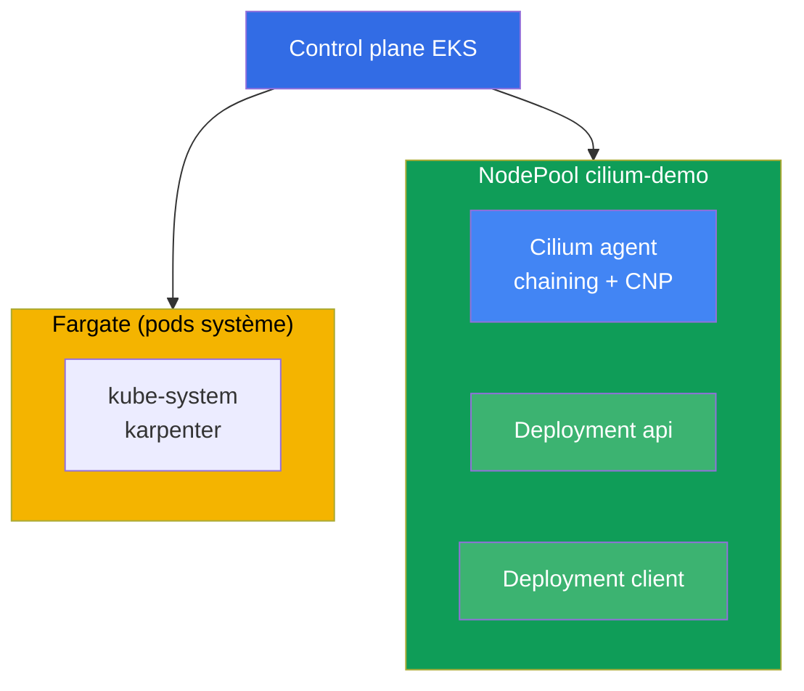
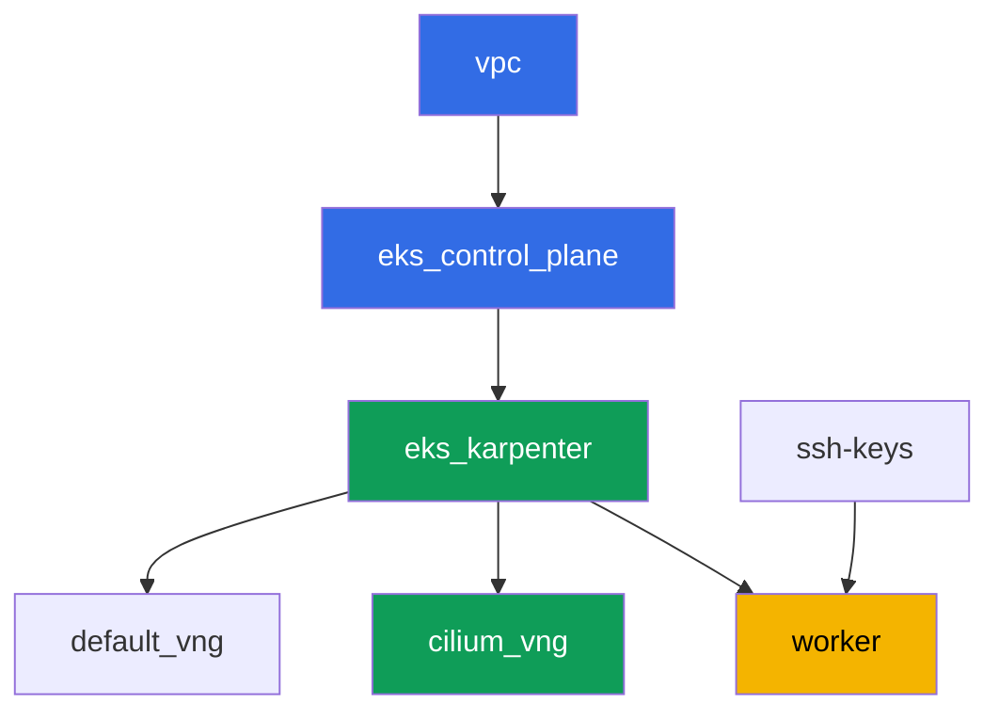

[Русская версия](README_RU.MD) · [Eng version](README.MD) · [Versión en español](README_ES.MD) · [Deutsche Version](README_DE.MD) · [ქართული ვერსია](README_GE.MD) · [繁體中文版](README_TW.MD) · [日本語版](README_JP.MD)

# Lab 132 - CNI alternatif : Cilium en mode CNI chaining sur VPC CNI

## Description

Dans ce lab, vous ajoutez Cilium au-dessus du VPC CNI standard en mode CNI chaining : les
adresses des pods continuent d'être attribuées par VPC CNI via l'ENI, et Cilium se branche
dans la chaîne et ajoute ses propres programmes eBPF au-dessus de l'interface du pod déjà
configurée. Vous obtenez ce que la network policy intégrée de VPC CNI (lab 110) n'a pas -
des règles L7 par méthode HTTP, des politiques par nom DNS (FQDN) et une observabilité des
flux via Hubble, tandis que l'IPAM et les intégrations VPC restent exactement où elles sont.

Un remplacement complet de VPC CNI (où `aws-node` est supprimé et Cilium devient lui-même
l'IPAM) n'entre pas dans le périmètre de ce lab. Une telle migration nécessite de recréer
les nœuds via une opération blue/green, pas de basculer un flag sur un cluster en
production (chapter 8, section 8.8), et le faire dans le NodePool partagé du cluster de ce
lab serait risqué. Seul le chaining est pratiqué ici - le moyen le plus courant et le
moins risqué d'obtenir des politiques L7/DNS et Hubble.

Les tâches sont rédigées dans un style production : un énoncé court plus des critères
d'acceptation. La vérification est automatique, via la commande `check_result`.

## Objectif

Consolider la matière des chapitres du cours :

- [Chapitre 8. Alternatives à VPC CNI : Cilium, modes réseau](../../course/08/fr.md) - CNI
  chaining face à un remplacement complet, le coût réel du changement
- [Chapitre 30. NetworkPolicy : règles, DNS, tests](../../course/30/fr.md) - les limites de
  la network policy intégrée de VPC CNI et ce que Cilium ajoute

## Ce que nous créons

Le cluster est déployé comme du code (base identique au lab 101), avec un NodePool séparé
`cilium-demo` ajouté par-dessus, avec un taint, dédié uniquement à Cilium et à la charge de
ce lab. Cilium est installé via Helm manuellement, et vous créez la charge et les
politiques par-dessus.

| Objet | Ce que c'est | Pourquoi dans ce lab |
|--------|---------|-------------------|
| NodePool `cilium-demo` | un second NodePool Karpenter, taint `dedicated=cilium-demo` | isole Cilium et la charge de démonstration des pods système et du pool par défaut |
| Namespace `eks-132` | une section du cluster pour la charge du lab | garde les ressources séparées de celles du système |
| DaemonSet `cilium` (kube-system) | agent Cilium en mode chaining | ajoute des programmes eBPF au-dessus de l'interface déjà configurée par VPC CNI |
| Deployment `api` (2 réplicas) + Service `api` | serveur ping_pong | cible des politiques L7 et FQDN |
| Deployment `client` | curl, `sleep 3600` | source de trafic pour tester les politiques |
| `CiliumNetworkPolicy` L7 | autorise uniquement `GET` sur le port `8080` | une capacité que la NP intégrée de VPC CNI n'a pas |
| `CiliumNetworkPolicy` FQDN | autorise l'egress uniquement vers `aws.amazon.com` | une politique par nom DNS indisponible pour VPC CNI NP |
| Hubble relay | observabilité des flux | `hubble observe` avec verdict, au lieu de simples logs d'agent |

Vue d'ensemble finale du cluster :



## Infrastructure

L'environnement est déployé sur AWS (`eu-central-1`) via Terragrunt. Chaque répertoire de
lab est un composant avec son propre `terragrunt.hcl`, qui référence un module partagé dans
`terraform/modules/` et déclare des dépendances via des blocs `dependency`. Terragrunt
construit un graphe de dépendances et applique les composants dans le bon ordre.

### Modules et dépendances

| Répertoire (composant) | Module (`terraform/modules/`) | Dépend de | Ce qu'il crée |
|---------------------|-------------------------------|------------|-------------|
| `vpc` | `vpc_v3` | - | VPC `10.10.0.0/16`, sous-réseaux dans deux AZ, NAT |
| `ssh-keys` | `ssh-keys` | - | une paire de clés SSH pour la machine de travail et les nœuds |
| `eks_control_plane` | `eks_v2_control_plane` | `vpc` | control plane EKS `1.36`, OIDC |
| `eks_fargate_system` | `eks_v2_fargate` | `vpc`, `eks_control_plane` | profil Fargate : `coredns` dans `kube-system` plus tout `karpenter` |
| `eks_addons` | `eks_v2_addons` | `eks_control_plane`, `eks_fargate_system` | coredns, kube-proxy, vpc-cni, pod-identity |
| `eks_karpenter` | `eks_v2_karpenter` | `vpc`, `eks_control_plane`, `eks_addons`, `eks_fargate_system` | contrôleur Karpenter, rôle IAM des nœuds |
| `eks_karpenter_default_vng` | `eks_v2_karpenter_vng` | `vpc`, `eks_control_plane`, `eks_karpenter` | NodePool par défaut `default`, sans taint |
| `eks_karpenter_cilium_vng` | `eks_v2_karpenter_vng` | `vpc`, `eks_control_plane`, `eks_karpenter` | NodePool `cilium-demo` : taint `dedicated=cilium-demo` |
| `worker` | `eks_v2_work_pc` | `ssh-keys`, `vpc`, `eks_control_plane`, `eks_karpenter` | machine de travail avec kubectl, helm, tests et `check_result` |

Graphe de dépendances (ce qui est appliqué le plus tôt est plus bas dans la flèche ;
`eks_fargate_system` et `eks_addons` ne sont pas montrés sur le diagramme à cause de la
limite de 8 nœuds, mais se trouvent en réalité entre `eks_control_plane` et
`eks_karpenter`, comme dans le tableau ci-dessus) :



### Paramètres du NodePool `cilium-demo`

`requirements` clés dans `eks_karpenter_cilium_vng/terragrunt.hcl` :

| Requirement | Valeur | Pourquoi |
|-------------|----------|-------|
| taint | `dedicated=cilium-demo:NoSchedule` | seuls les pods avec toleration atteignent le pool |
| `vng.labels.work_type` | `cilium-demo` | Cilium et la charge sont liés à cette étiquette via `nodeSelector` |
| `karpenter.sh/capacity-type` | `In ["on-demand"]` | capacité prévisible pour démontrer Cilium |
| `karpenter.k8s.aws/instance-category` | `In ["c", "m", "r"]` | un ensemble raisonnable de familles |
| `disruption.consolidationPolicy` | `WhenEmptyOrUnderutilized`, `consolidateAfter: 30s` | consolidation rapide des nœuds vides |

Cilium n'est pas installé via Terraform mais via Helm manuellement sur la machine de
travail (tâche 3) - c'est un choix délibéré : le cycle de vie d'un CNI que vous prenez en
charge vous-même ne doit pas se déguiser en infrastructure gérée (chapter 8).

### Pourquoi le profil Fargate est restreint ici par un sélecteur d'étiquette

Dans les autres labs du cours, le profil couvre tout le namespace `kube-system`. Ici, le
sélecteur pour `kube-system` porte en plus l'étiquette `eks.amazonaws.com/component =
coredns`, et `karpenter` reste une entrée séparée sans étiquette. Ce n'est pas
cosmétique.

Le webhook Fargate marque de son profil TOUT pod qui atterrit dans un namespace listé au
moment de sa création. Ensuite le pod n'est ordonnancé que par `fargate-scheduler`, qui ne
connaît ni `hostNetwork` ni `nodeSelector` et ne revient jamais au scheduler classique.
L'agent et l'opérateur Cilium utilisent `hostNetwork`, donc avec un sélecteur large ils
resteraient à jamais en `Pending` avec `Pod not supported on Fargate: fields not supported:
HostNetwork`, les CRD de Cilium ne s'enregistreraient jamais, et le lab ne fonctionnerait
pas du tout. Le seul composant système qui a réellement besoin de Fargate ici est
`coredns` (il porte l'étiquette EKS standard `eks.amazonaws.com/component=coredns`), c'est
pourquoi le profil est restreint à celui-ci.

Les autres paramètres (région, réseau, versions, préfixes) sont lus depuis `env.hcl`, comme
dans le lab 101 ; il n'est pas nécessaire d'en changer la logique.

## Déploiement

```bash
TASK=132 make run_eks_task
```

Le déploiement prend environ 15-20 minutes. Dans la sortie, trouvez la ligne avec la
connexion SSH à la machine de travail et connectez-vous. kubectl et helm y sont déjà
configurés pour le bon cluster.

Commandes utiles sur la machine de travail :

```bash
time_left       # temps restant de l'environnement
check_result    # vérifier la solution
```

> L'installation de Cilium via Helm prend 1-2 minutes, mais tant que l'agent n'est pas monté
> sur un nœud `cilium-demo`, les pods qui s'y trouvent ne reçoivent pas ses programmes eBPF.
> Attendez que tous les pods `cilium` passent en `Running` avant de passer à la tâche
> suivante.

> Dans ce cluster, le nom court `cnp` est ambigu : VPC CNI apporte sa propre ressource
> `clusternetworkpolicies.networking.k8s.aws`, et kubectl vous en avertit. Utilisez le nom
> complet `ciliumnetworkpolicies.cilium.io`.

> Si Karpenter monte un second nœud dans le pool `cilium-demo` (la charge ne rentrait pas
> sur un seul), le DaemonSet Cilium s'y installera aussi, et les pods `api` peuvent se
> répartir sur les deux nœuds. C'est normal et ne casse rien.

> Sécurité de l'environnement. Dans `env.hcl`, `ssh_password_enable = true` et
> `access_cidrs = ["0.0.0.0/0"]` sont activés - pratique pour un environnement de
> formation, mais à ne pas faire en production. Selon les standards du cours (chapitres
> 0.2, 2, 19), l'accès aux machines de travail devrait passer par AWS SSM Session Manager
> sans exposer de ports SSH publics, et `access_cidrs` devrait être restreint à des adresses
> précises. Ici, le SSH public est laissé uniquement pour simplifier le démarrage.

## Tâches

---
|        **1**        | **Namespace pour la charge du lab**                             |
| :-----------------: | :---------------------------------------------------------- |
| Ce qu'il faut faire          | Créez un namespace nommé `eks-132`. Tous les objets de ce lab y sont créés. |
| Critères d'acceptation    | - le namespace `eks-132` existe. |
---
|        **2**        | **Charge sur le pool `cilium-demo` et connectivité en VPC CNI pur** |
| :-----------------: | :---------------------------------------------------------- |
| Ce qu'il faut faire          | Dans `eks-132`, créez le Deployment `api` (image `viktoruj/ping_pong:latest`, `2` réplicas, port `8080`) et le Service `api`. Créez le Deployment `client` (image `curlimages/curl:latest`, commande `sleep 3600`). Les deux Deployment doivent avoir `nodeSelector` `work_type: cilium-demo` et une toleration pour `dedicated=cilium-demo:NoSchedule` - cela donne à Karpenter le signal pour monter un nœud dans le pool `cilium-demo` (un DaemonSet vide seul ne demanderait pas de nœud). Attendez la disponibilité. À cette étape, Cilium n'est pas encore installé, tout le trafic passe par VPC CNI pur. Vérifiez le `curl` depuis `client` vers `api.eks-132.svc.cluster.local:8080` et enregistrez `HTTP_CODE=<code>` dans le fichier `/var/work/tests/artifacts/2/connectivity_before.txt`. |
| Critères d'acceptation    | - Deployment `api`, `2` réplicas prêts, Service `api` port `8080`;<br/>- Deployment `client`, `1` réplica prêt;<br/>- les deux sur des nœuds `work_type=cilium-demo`;<br/>- le fichier `2/connectivity_before.txt` contient `HTTP_CODE=200`. |
---
|        **3**        | **Cilium en mode CNI chaining, uniquement sur le pool `cilium-demo`** |
| :-----------------: | :---------------------------------------------------------- |
| Ce qu'il faut faire          | Installez Cilium via Helm en mode chaining (`cni.chainingMode: aws-cni`), en limitant `nodeSelector`/`tolerations` uniquement aux nœuds portant l'étiquette `work_type: cilium-demo`. Tenez compte de deux particularités du chart : le `nodeSelector` de premier niveau n'est hérité que par le DaemonSet `cilium`, `cilium-envoy` et `cilium-operator` ont leurs propres sections (`envoy.*`, `operator.*`); et désactivez impérativement `operator.unmanagedPodWatcher.restart` - sinon l'opérateur supprimera en boucle les pods `coredns` sur Fargate, qui n'ont et n'auront jamais de `CiliumEndpoint`, et le DNS du cluster tombera. Attendez que tous les pods Cilium passent en `Running` et ne se trouvent que sur des nœuds `cilium-demo`. Les pods `api` et `client` ont été démarrés avant l'installation de Cilium et ne sont pas connectés à la chaîne - exécutez `kubectl rollout restart` sur les deux Deployment pour qu'ils se reconnectent via Cilium (c'est explicitement décrit dans la documentation Cilium pour le chaining). Installez le Cilium CLI et confirmez `cilium status` - lignes `Cilium:` et `OK`. Enregistrez la sortie dans le fichier `/var/work/tests/artifacts/3/cilium_status.txt`. |
| Critères d'acceptation    | - DaemonSet `cilium` dans `kube-system` avec `nodeSelector.work_type: cilium-demo`;<br/>- tous les pods `cilium` sont `Running`;<br/>- le fichier `3/cilium_status.txt` n'est pas vide, contient `Cilium:` et `OK`. |
---
|        **4**        | **Preuve du chaining : les adresses viennent toujours de VPC CNI**       |
| :-----------------: | :---------------------------------------------------------- |
| Ce qu'il faut faire          | Enregistrez `kubectl get pods -n eks-132 -o wide` dans le fichier `/var/work/tests/artifacts/4/podips.txt`. Vérifiez que les IP des pods `api` et `client` appartiennent au CIDR de la VPC du lab `10.10.0.0/16`, et non à une plage overlay séparée. Cela confirme que l'IPAM est resté du côté de VPC CNI - Cilium n'a fait qu'ajouter des politiques et de l'observabilité, sans remplacer le modèle d'adressage (chapter 8, la section sur le chaining). |
| Critères d'acceptation    | - le fichier `4/podips.txt` n'est pas vide;<br/>- il contient au moins deux adresses commençant par `10.10.`. |
---
|        **5**        | **Politique L7 : n'autoriser que GET**                        |
| :-----------------: | :---------------------------------------------------------- |
| Ce qu'il faut faire          | Créez `CiliumNetworkPolicy` `cilium-l7-allow-get` dans `eks-132` : `endpointSelector` sur `app: api`, ingress depuis `app: client` sur le port `8080/TCP` avec `rules.http` - méthode `GET` autorisée, les autres méthodes refusées. Vérifiez le `curl` (GET) depuis `client` vers `api` - enregistrez `HTTP_CODE=200` dans le fichier `/var/work/tests/artifacts/5/allowed_get.txt`. Vérifiez `curl -X POST` depuis `client` vers `api` - enregistrez le résultat (différent de `200`) dans le fichier `/var/work/tests/artifacts/5/blocked_post.txt`. Ce filtre L7 n'est pas disponible dans la NetworkPolicy intégrée de VPC CNI (chapter 8). |
| Critères d'acceptation    | - `CiliumNetworkPolicy` `cilium-l7-allow-get` avec `rules.http.method: GET`;<br/>- le fichier `5/allowed_get.txt` contient `HTTP_CODE=200`;<br/>- le fichier `5/blocked_post.txt` ne contient pas `HTTP_CODE=200`. |
---
|        **6**        | **Politique FQDN : egress vers un seul nom de domaine**        |
| :-----------------: | :---------------------------------------------------------- |
| Ce qu'il faut faire          | Créez `CiliumNetworkPolicy` `cilium-fqdn-allow-aws` dans `eks-132` : `endpointSelector` sur `app: client`, le premier bloc d'egress (`egress[0]`) est `toFQDNs.matchName: aws.amazon.com` sur le port `443/TCP`. Ensuite deux blocs supplémentaires, sans lesquels le lab casse. Autorisez le DNS par CIDR (`toCIDRSet` avec la plage de service `172.20.0.0/16` et le CIDR de la VPC `10.10.0.0/16`) sur le port `53` avec `rules.dns` : une règle par l'étiquette `k8s-app: kube-dns` ne fonctionnera pas ici, car `coredns` vit sur Fargate, n'a pas de `CiliumEndpoint`, et n'est visible dans la politique que comme `reserved:world`. Et autorisez explicitement l'egress vers `app: api` port `8080/TCP` : le `endpointSelector` active le default-deny pour tout l'egress du pod `client`, sinon le GET de la tâche 5 cessera de fonctionner. Vérifiez le `curl` vers `aws.amazon.com` - enregistrez `HTTP_CODE=<code>` dans le fichier `/var/work/tests/artifacts/6/allowed_fqdn.txt`. Vérifiez le `curl` vers un autre domaine externe (par exemple `example.com`) avec un timeout - enregistrez le résultat (code non réussi) dans le fichier `/var/work/tests/artifacts/6/blocked_other_domain.txt`. La NetworkPolicy intégrée de VPC CNI n'a aucune règle par nom DNS (chapter 8). |
| Critères d'acceptation    | - `CiliumNetworkPolicy` `cilium-fqdn-allow-aws` avec `egress[].toFQDNs[].matchName: aws.amazon.com`;<br/>- le fichier `6/allowed_fqdn.txt` n'est pas vide et contient `HTTP_CODE=`, où le code est `2xx` ou `3xx`;<br/>- le fichier `6/blocked_other_domain.txt` n'est pas vide et ne contient pas `HTTP_CODE=200`. |
---
|        **7**        | **Hubble : observabilité des flux avec verdict**                  |
| :-----------------: | :---------------------------------------------------------- |
| Ce qu'il faut faire          | Activez Hubble relay (`helm upgrade cilium ... --set hubble.relay.enabled=true`, le même `nodeSelector` sur `cilium-demo`). Installez le Hubble CLI. Répétez une requête bloquée de la tâche 5 ou 6 pour obtenir un événement `DROPPED`. Exécutez `hubble observe` filtré par namespace `eks-132` et enregistrez la sortie, contenant le verdict `DROPPED`, dans le fichier `/var/work/tests/artifacts/7/hubble_denied.txt`. Le diagnostic de la NP intégrée de VPC CNI n'a pas une telle carte de flux avec verdicts - seulement des logs d'agent (chapter 8). |
| Critères d'acceptation    | - Deployment `hubble-relay` dans `kube-system` avec `1` réplica prêt;<br/>- le fichier `7/hubble_denied.txt` n'est pas vide et contient `DROPPED`. |
---
|        **8**        | **Comparaison : ce qu'a ajouté Cilium et ce que cela coûte**            |
| :-----------------: | :---------------------------------------------------------- |
| Ce qu'il faut faire          | Enregistrez dans le fichier `/var/work/tests/artifacts/8/comparison.txt` un texte (3-5 points) sur ce que sait faire la NetworkPolicy intégrée de VPC CNI, ce qu'a ajouté Cilium dans ce lab, et ce que cela vous coûte. Le texte doit contenir les mots `L7`, `FQDN` et `Hubble`. Indiquez séparément que le remplacement complet de VPC CNI n'entre pas dans le périmètre de ce lab, avec une référence au chapter 8 (la section sur la migration du CNI comme opération blue/green). |
| Critères d'acceptation    | - le fichier `8/comparison.txt` n'est pas vide;<br/>- contient les mots `L7`, `FQDN`, `Hubble`;<br/>- contient une mention du chapter 8 (`chapter 8`) et le mot `blue` (de `blue/green`). |
---

## Vérification du résultat

Sur la machine de travail, lancez la vérification automatique :

```bash
check_result
```

Le script exécute les tests et affiche le pourcentage de tâches accomplies.

## Solution

Solution de référence : [worker/files/solutions/1_FR.MD](worker/files/solutions/1_FR.MD)

## Suppression du cluster et des ressources

Retirez d'abord du cluster ce que vous avez installé à la main et attendez que Karpenter
retire les nœuds. Si vous ne le faites pas, Terraform va essayer de supprimer le security
group des nœuds tant qu'il est encore retenu par un ENI orphelin, et `destroy` restera
bloqué jusqu'au timeout.

L'ordre compte : Cilium part en premier, puis la charge. Si vous supprimez la charge en
premier, Karpenter commencera à replier le nœud `cilium-demo` avec l'agent Cilium qui y
fonctionne encore.

```bash
# 1. Retirer Cilium (avec lui partent hubble-relay, cilium-envoy et l'opérateur)
# Le motif entre crochets est obligatoire : sans lui, pkill correspond à sa propre ligne
# de commande et coupe le reste du bloc si vous collez les commandes en une fois, pas une
# par une.
pkill -f "[p]ort-forward service/hubble-relay" || true
helm uninstall cilium -n kube-system

# 2. Supprimer les politiques et la charge du lab
kubectl delete ciliumnetworkpolicies.cilium.io -n eks-132 --all --ignore-not-found
kubectl delete namespace eks-132 --wait=true

# 3. Attendre que Karpenter retire les nœuds du pool cilium-demo (généralement 1-2 minutes)
kubectl get nodes -l work_type=cilium-demo -w
```

Une fois qu'il ne reste plus de nœuds `cilium-demo` dans la sortie, supprimez
l'infrastructure :

```bash
TASK=132 make delete_eks_task
```

Si `destroy` reste bloqué sur le security group des nœuds, trouvez et supprimez l'ENI
orphelin :

```bash
aws ec2 describe-network-interfaces \
  --filters "Name=group-id,Values=<sg-id-de-l-erreur>" \
  --query 'NetworkInterfaces[].{Id:NetworkInterfaceId,Status:Status,Desc:Description}'
aws ec2 delete-network-interface --network-interface-id <eni-id>
```

Après avoir vérifié le lab, supprimez le répertoire de travail de l'environnement, sinon
les modules de ce lab se retrouveront dans le suivant :

```bash
rm -rf terraform/environments/eks-labs
```
