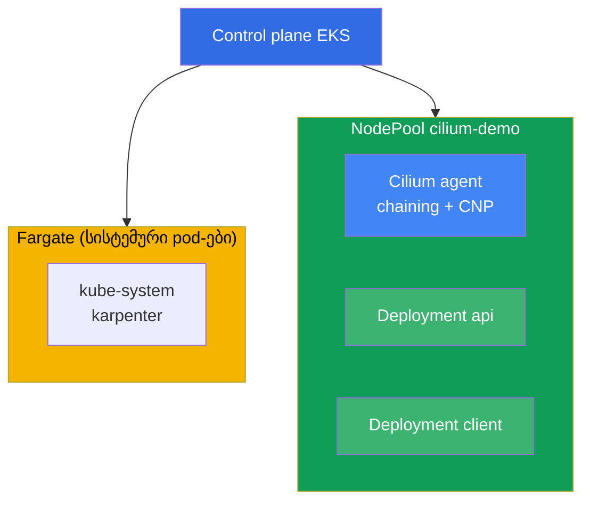
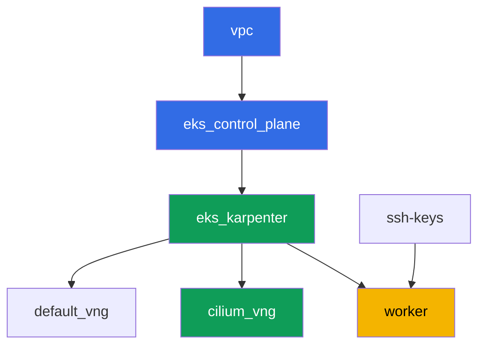

[Русская версия](README_RU.MD) · [Eng version](README.MD) · [Versión en español](README_ES.MD) · [Version française](README_FR.MD) · [Deutsche Version](README_DE.MD) · [繁體中文版](README_TW.MD) · [日本語版](README_JP.MD)

# ლაბა 132 - ალტერნატიული CNI: Cilium CNI chaining რეჟიმში VPC CNI-ს ზემოთ

## აღწერა

ამ ლაბაში ამატებთ Cilium-ს შტატულ VPC CNI-ს ზემოთ CNI chaining რეჟიმში: pod-ების
მისამართებს კვლავ გასცემს VPC CNI ENI-ის საშუალებით, ხოლო Cilium ერთვება ჯაჭვში და
ამატებს თავის eBPF-პროგრამებს pod-ის უკვე კონფიგურირებული ინტერფეისის ზემოთ. მიიღებთ
იმას, რაც არ არსებობს VPC CNI-ის ჩაშენებულ network policy-ში (ლაბა 110) - L7-წესებს
HTTP-მეთოდის მიხედვით, პოლიტიკებს DNS-სახელის (FQDN) მიხედვით და ნაკადების
დაკვირვებადობას Hubble-ის საშუალებით, ამასთანავე IPAM და VPC-ის ინტეგრაციები ადგილზე
რჩება.

VPC CNI-ის სრული ჩანაცვლება (როცა `aws-node` წაიშლება და Cilium თავად ხდება IPAM) ამ
ლაბის ფარგლებში არ შედის. ასეთი მიგრაცია მოითხოვს ნოუდების ხელახლა შექმნას blue/green
სქემით და არა flag-ის გადართვას ცოცხალ კლასტერზე (chapter 8, ნაწილი 8.8), და მისი
გარჩევა ამ ლაბის საერთო NodePool-ში არასაფრთხოა. აქ ვამუშავებთ მხოლოდ chaining-ს - ყველაზე
ხშირ და რისკის მიხედვით ყველაზე იაფ გზას L7/DNS-პოლიტიკებისა და Hubble-ის მისაღებად.

დავალებები დაწერილია production-სტილში: მოკლე დაპოსტულებული ამოცანა პლუს მიღების
კრიტერიუმები. შემოწმება ავტომატურია, ბრძანებით `check_result`.

## მიზანი

კურსის თავის მასალის გამტკიცება:

- [თავი 8. VPC CNI-ის ალტერნატივები: Cilium, ქსელის რეჟიმები](../../course/08/ge.md) -
  CNI chaining სრული ჩანაცვლების წინააღმდეგ, გადასვლის ჯანსაღი ფასი
- [თავი 30. NetworkPolicy: წესები, DNS, ტესტირება](../../course/30/ge.md) - VPC CNI-ის
  ჩაშენებული network policy-ის საზღვრები და რას ამატებს Cilium

## რას ვქმნით

კლასტერი იშენება როგორც კოდი (ბაზა - როგორც ლაბა 101-ში), მის ზემოთ დამატებულია
ცალკე NodePool `cilium-demo` taint-ით, მხოლოდ Cilium-ისა და ამ ლაბის დატვირთვისთვის.
Cilium დგება Helm-ის საშუალებით ხელით, თქვენ ქმნით დატვირთვას და პოლიტიკებს მის
ზემოთ.

| ობიექტი | რა არის | რისთვის ამ ლაბაში |
|--------|---------|-------------------|
| NodePool `cilium-demo` | მეორე Karpenter NodePool, taint `dedicated=cilium-demo` | Cilium-ს და დემო-დატვირთვას ცალკე ინახავს სისტემური pod-ებისა და default-პულისგან |
| Namespace `eks-132` | კლასტერის ლაბის დატვირთვის ნაწილი | რესურსებს ცალკე ვინახავთ სისტემურისგან |
| DaemonSet `cilium` (kube-system) | Cilium-ის აგენტი chaining რეჟიმში | ამატებს eBPF-პროგრამებს VPC CNI-ის მიერ კონფიგურირებული ინტერფეისის ზემოთ |
| Deployment `api` (2 რეპლიკა) + Service `api` | ping_pong სერვერი | სამიზნე L7- და FQDN-პოლიტიკებისთვის |
| Deployment `client` | curl, `sleep 3600` | ტრაფიკის წყარო პოლიტიკების შესამოწმებლად |
| `CiliumNetworkPolicy` L7 | აძლევს ნებას მხოლოდ `GET`-ს პორტ `8080`-ზე | შესაძლებლობა, რომელიც არ აქვს ჩაშენებულ VPC CNI NP-ს |
| `CiliumNetworkPolicy` FQDN | აძლევს ნებას egress-ს მხოლოდ `aws.amazon.com`-ზე | პოლიტიკა DNS-სახელის მიხედვით, მიუწვდომელი VPC CNI NP-სთვის |
| Hubble relay | ნაკადების დაკვირვებადობა | `hubble observe` verdict-ით, მხოლოდ აგენტის ლოგების ნაცვლად |

კლასტერის საბოლოო სურათი:



## ინფრასტრუქტურა

გარემო იშენება AWS-ში (`eu-central-1`) Terragrunt-ის საშუალებით. ლაბის ყოველი
კატალოგი არის ერთი კომპონენტი თავისი `terragrunt.hcl`-ით, რომელიც მიუთითებს საერთო
მოდულზე `terraform/modules/`-ში და აცხადებს დამოკიდებულებებს `dependency` ბლოკების
საშუალებით. Terragrunt აგებს დამოკიდებულებების გრაფს და იყენებს კომპონენტებს სწორი
მიმდევრობით.

### მოდულები და დამოკიდებულებები

| კატალოგი (კომპონენტი) | მოდული (`terraform/modules/`) | დამოკიდებულია | რას ქმნის |
|---------------------|-------------------------------|------------|-------------|
| `vpc` | `vpc_v3` | - | VPC `10.10.0.0/16`, ქვექსელები ორ AZ-ში, NAT |
| `ssh-keys` | `ssh-keys` | - | SSH-გასაღებების წყვილი სამუშაო მანქანისა და ნოუდებისთვის |
| `eks_control_plane` | `eks_v2_control_plane` | `vpc` | EKS control plane `1.36`, OIDC |
| `eks_fargate_system` | `eks_v2_fargate` | `vpc`, `eks_control_plane` | Fargate-პროფილი: `coredns` `kube-system`-ში პლუს მთელი `karpenter` |
| `eks_addons` | `eks_v2_addons` | `eks_control_plane`, `eks_fargate_system` | coredns, kube-proxy, vpc-cni, pod-identity |
| `eks_karpenter` | `eks_v2_karpenter` | `vpc`, `eks_control_plane`, `eks_addons`, `eks_fargate_system` | Karpenter-კონტროლერი, ნოუდების IAM-როლი |
| `eks_karpenter_default_vng` | `eks_v2_karpenter_vng` | `vpc`, `eks_control_plane`, `eks_karpenter` | ნაგულისხმევი NodePool `default`, taint-ის გარეშე |
| `eks_karpenter_cilium_vng` | `eks_v2_karpenter_vng` | `vpc`, `eks_control_plane`, `eks_karpenter` | NodePool `cilium-demo`: taint `dedicated=cilium-demo` |
| `worker` | `eks_v2_work_pc` | `ssh-keys`, `vpc`, `eks_control_plane`, `eks_karpenter` | სამუშაო მანქანა kubectl-ით, helm-ით, ტესტებით და `check_result`-ით |

დამოკიდებულებების გრაფი (რაც უფრო ადრე გამოიყენება, ის ისარზე უფრო დაბლა დგას;
`eks_fargate_system` და `eks_addons` დიაგრამაზე არ ჩნდება 8-ნოუდის ლიმიტის გამო, მაგრამ
ფაქტობრივად დგანან `eks_control_plane`-სა და `eks_karpenter`-ს შორის, როგორც ზემოთ
ცხრილში):



### NodePool `cilium-demo`-ის პარამეტრები

ძირითადი `requirements` `eks_karpenter_cilium_vng/terragrunt.hcl`-ში:

| Requirement | მნიშვნელობა | რისთვის |
|-------------|----------|-------|
| taint | `dedicated=cilium-demo:NoSchedule` | პულზე ხდება მხოლოდ toleration-ის მქონე pod-ები |
| `vng.labels.work_type` | `cilium-demo` | ამ ლეიბლით Cilium და დატვირთვა უკავშირდებიან `nodeSelector`-ით |
| `karpenter.sh/capacity-type` | `In ["on-demand"]` | Cilium-ის დემონსტრირებისთვის განკუთვნილი, პროგნოზირებადი ტევადობა |
| `karpenter.k8s.aws/instance-category` | `In ["c", "m", "r"]` | ოჯახების გონივრული ნაკრები |
| `disruption.consolidationPolicy` | `WhenEmptyOrUnderutilized`, `consolidateAfter: 30s` | ცარიელი ნოუდების სწრაფი კონსოლიდაცია |

Cilium დგება არა Terraform-ის საშუალებით, არამედ Helm-ის საშუალებით ხელით სამუშაო
მანქანაზე (დავალება 3) - ეს გააზრებული არჩევანია: CNI-ის ცხოვრების ციკლი, რომელიც
თქვენ თავზე იღებთ, არ უნდა შენიღბოს მართული ინფრასტრუქტურის ქვეშ (chapter 8).

### რატომ არის Fargate-პროფილი აქ ვიწრო label-სელექტორით

კურსის დანარჩენ ლაბებში პროფილი მთლიანად ფარავს namespace `kube-system`-ს. აქ
`kube-system`-ისთვის სელექტორს დამატებული აქვს label `eks.amazonaws.com/component =
coredns`, ხოლო `karpenter` დარჩა ცალკე ჩანაწერად ლეიბლების გარეშე. ეს არ არის
კოსმეტიკა.

Fargate-webhook თავის პროფილს ანიშნავს ჩამოთვლილ namespace-ში მოხვედრილ ნებისმიერ
pod-ს pod-ის შექმნის მომენტში. ამის შემდეგ pod-ს სქედულს უწევს მხოლოდ
`fargate-scheduler`, რომელიც არ იცის ვერც `hostNetwork`, ვერც `nodeSelector` და
არასდროს ბრუნდება ჩვეულებრივ scheduler-ზე. Cilium-ის აგენტი და ოპერატორი იყენებენ
`hostNetwork`-ს, ამიტომ ფართო სელექტორის დროს ისინი სამუდამოდ რჩებიან `Pending`-ში
`Pod not supported on Fargate: fields not supported: HostNetwork`-ით, Cilium-ის CRD
არ რეგისტრირდება, და ლაბა საერთოდ არ სრულდება. ერთადერთი სისტემური კომპონენტი,
რომელსაც Fargate ზუსტად აქ ესაჭიროება, არის `coredns` (მას აქვს შტატული EKS-ლეიბლი
`eks.amazonaws.com/component=coredns`), ამიტომ პროფილი მასზეა ვიწროვებული.

დანარჩენი პარამეტრები (რეგიონი, ქსელი, ვერსიები, პრეფიქსები) იკითხება `env.hcl`-იდან,
როგორც ლაბა 101-ში; მათი ლოგიკის შეცვლა არ არის საჭირო.

## გაშენება

```bash
TASK=132 make run_eks_task
```

გაშენება გრძელდება დაახლოებით 15-20 წუთი. გამოსავალში მოძებნეთ სტრიქონი SSH-კავშირით
სამუშაო მანქანასთან და დაუკავშირდით მას. kubectl და helm იქ უკვე კონფიგურირებულია
საჭირო კლასტერზე.

სასარგებლო ბრძანებები სამუშაო მანქანაზე:

```bash
time_left       # რამდენი დროა დარჩენილი გარემოსთვის
check_result    # გადაწყვეტის შემოწმება
```

> Cilium-ის დაყენება Helm-ის საშუალებით გრძელდება 1-2 წუთს, მაგრამ სანამ აგენტი არ
> ამოვა ნოუდზე `cilium-demo`, მასზე pod-ები არ მიიღებენ მის eBPF-პროგრამებს.
> დაუცადეთ `Running`-ს ყველა pod-ს `cilium`-ს შემდეგ დავალებაზე გადასვლამდე.

> ამ კლასტერში მოკლე სახელი `cnp` არაცალსახა: VPC CNI მოიტანს თავის რესურსს
> `clusternetworkpolicies.networking.k8s.aws`, და kubectl ამის შესახებ გაფრთხილებას
> გამოსცემს. წერეთ სრული სახელით `ciliumnetworkpolicies.cilium.io`.

> თუ Karpenter ამოაყენებს მეორე ნოუდს პულში `cilium-demo` (დატვირთვა ერთში არ
> ჩავიდა), Cilium-ის DaemonSet ამაზეც დგება, და `api`-ის pod-ები შესაძლოა
> გადანაწილდნენ ორივე ნოუდზე. ეს ნორმალურია და არაფერს არ ტოტალურად.

> სტენდის უსაფრთხოება. `env.hcl`-ში ჩართულია `ssh_password_enable = true` და
> `access_cidrs = ["0.0.0.0/0"]` - მოსახერხებელია სასწავლო გარემოსთვის, მაგრამ ასე
> არ შეიძლება production-ში. კურსის სტანდარტების მიხედვით (თავები 0.2, 2, 19),
> სამუშაო მანქანებთან წვდომა იხსნება AWS SSM Session Manager-ის საშუალებით საჯარო
> SSH-პორტების გარეთ გატანის გარეშე, ხოლო `access_cidrs` ვიწროვდება კონკრეტულ
> მისამართებზე. აქ საჯარო SSH დარჩენილია მხოლოდ გაშვების სიმარტივისთვის.

## დავალებები

---
|        **1**        | **Namespace ლაბის დატვირთვისთვის**                             |
| :-----------------: | :---------------------------------------------------------- |
| რას ვაკეთებთ          | შექმენით namespace სახელით `eks-132`. ლაბის ყველა ობიექტი იქმნება მის შიგნით. |
| მიღების კრიტერიუმები    | - namespace `eks-132` არსებობს. |
---
|        **2**        | **დატვირთვა პულზე `cilium-demo` და connectivity სუფთა VPC CNI-ზე** |
| :-----------------: | :---------------------------------------------------------- |
| რას ვაკეთებთ          | `eks-132`-ში შექმენით Deployment `api` (image `viktoruj/ping_pong:latest`, `2` რეპლიკა, პორტი `8080`) და Service `api`. შექმენით Deployment `client` (image `curlimages/curl:latest`, ბრძანება `sleep 3600`). ორივე Deployment - `nodeSelector`-ით `work_type: cilium-demo` და toleration-ით `dedicated=cilium-demo:NoSchedule`-ზე, ეს მისცემს Karpenter-ს სიგნალს ამოაყენოს ნოუდი პულში `cilium-demo` (ცარიელი DaemonSet თავად ნოუდს არ მოითხოვს). დაუცადეთ მზადყოფნას. ამ ეტაპზე Cilium ჯერ არ არის დაყენებული, ყველა ტრაფიკი გადის შტატული VPC CNI-ის მეშვეობით. გადაამოწმეთ `curl` `client`-იდან `api.eks-132.svc.cluster.local:8080`-ზე და შეინახეთ `HTTP_CODE=<კოდი>` ფაილში `/var/work/tests/artifacts/2/connectivity_before.txt`. |
| მიღების კრიტერიუმები    | - Deployment `api`, `2` მზა რეპლიკა, Service `api` პორტი `8080`;<br/>- Deployment `client`, `1` მზა რეპლიკა;<br/>- ორივე ნოუდებზე `work_type=cilium-demo`;<br/>- ფაილი `2/connectivity_before.txt` შეიცავს `HTTP_CODE=200`. |
---
|        **3**        | **Cilium CNI chaining რეჟიმში, მხოლოდ პულზე `cilium-demo`** |
| :-----------------: | :---------------------------------------------------------- |
| რას ვაკეთებთ          | დააინსტალირეთ Cilium Helm-ის საშუალებით chaining რეჟიმში (`cni.chainingMode: aws-cni`), შემოისღვედით `nodeSelector`/`tolerations` მხოლოდ ნოუდებზე ლეიბლით `work_type: cilium-demo`. გაითვალისწინეთ chart-ის ორი თავისებურება: ზედა `nodeSelector` ერიდება მხოლოდ DaemonSet `cilium`-ს, `cilium-envoy`-სა და `cilium-operator`-ს თავიანთი სექციები აქვთ (`envoy.*`, `operator.*`); და აუცილებლად გამორთეთ `operator.unmanagedPodWatcher.restart` - თუ არა, ოპერატორი წრეზე წაშლის `coredns` pod-ებს Fargate-ზე, რომლებსაც არ აქვთ და არც ჰექნება `CiliumEndpoint`, და DNS კლასტერში ჩავარდება. დაუცადეთ, სანამ ყველა Cilium-ის pod გადავა `Running`-ში და მდებარეობს მხოლოდ ნოუდებზე `cilium-demo`. `api`-ისა და `client`-ის pod-ები ამოქმედდნენ Cilium-ის დაყენებამდე და ჯაჭვში არ არიან ჩართული - შეასრულეთ `kubectl rollout restart` ორივე Deployment-ისთვის, რათა ხელახლა დაუკავშირდნენ Cilium-ის მეშვეობით (ეს პირდაპირ აღწერილია Cilium-ის დოკუმენტაციაში chaining-ისთვის). დააინსტალირეთ Cilium CLI და დაადასტურეთ `cilium status` - სტრიქონები `Cilium:` და `OK`. შედეგი შეინახეთ ფაილში `/var/work/tests/artifacts/3/cilium_status.txt`. |
| მიღების კრიტერიუმები    | - DaemonSet `cilium` `kube-system`-ში `nodeSelector.work_type: cilium-demo`-ით;<br/>- ყველა pod `cilium` `Running`-ში;<br/>- ფაილი `3/cilium_status.txt` არ არის ცარიელი, შეიცავს `Cilium:` და `OK`. |
---
|        **4**        | **Chaining-ის დამტკიცება: მისამართები კვლავ VPC CNI-დან**       |
| :-----------------: | :---------------------------------------------------------- |
| რას ვაკეთებთ          | შეინახეთ `kubectl get pods -n eks-132 -o wide` ფაილში `/var/work/tests/artifacts/4/podips.txt`. დარწმუნდით, რომ `api`-ისა და `client`-ის pod-ების IP ლაბის VPC-ის CIDR-იდან `10.10.0.0/16`-ია, არა ცალკე overlay-დიაპაზონიდან. ეს ადასტურებს, რომ IPAM დარჩა VPC CNI-ს ხელში - Cilium-მა დაამატა მხოლოდ პოლიტიკები და დაკვირვებადობა, არა ჩაანაცვლა მისამართების მოდელი (chapter 8, ნაწილი chaining-ის შესახებ). |
| მიღების კრიტერიუმები    | - ფაილი `4/podips.txt` არ არის ცარიელი;<br/>- შეიცავს მინიმუმ ორ მისამართს, რომლებიც იწყება `10.10.`-ით. |
---
|        **5**        | **L7-პოლიტიკა: ნება მხოლოდ GET-ისთვის**                        |
| :-----------------: | :---------------------------------------------------------- |
| რას ვაკეთებთ          | შექმენით `CiliumNetworkPolicy` `cilium-l7-allow-get` `eks-132`-ში: `endpointSelector` `app: api`-ზე, ingress `app: client`-იდან პორტ `8080/TCP`-ზე `rules.http`-ით - მეთოდი `GET` ნებადართული, დანარჩენი მეთოდები დაშლილი. გადაამოწმეთ `curl` (GET) `client`-იდან `api`-მდე - შეინახეთ `HTTP_CODE=200` ფაილში `/var/work/tests/artifacts/5/allowed_get.txt`. გადაამოწმეთ `curl -X POST` `client`-იდან `api`-მდე - შეინახეთ შედეგი (არა `200`) ფაილში `/var/work/tests/artifacts/5/blocked_post.txt`. ასეთი L7-ფილტრი მიუწვდომელია ჩაშენებული VPC CNI NetworkPolicy-სთვის (chapter 8). |
| მიღების კრიტერიუმები    | - `CiliumNetworkPolicy` `cilium-l7-allow-get` `rules.http.method: GET`-ით;<br/>- ფაილი `5/allowed_get.txt` შეიცავს `HTTP_CODE=200`;<br/>- ფაილი `5/blocked_post.txt` არ შეიცავს `HTTP_CODE=200`. |
---
|        **6**        | **FQDN-პოლიტიკა: egress მხოლოდ ერთ დომენურ სახელზე**        |
| :-----------------: | :---------------------------------------------------------- |
| რას ვაკეთებთ          | შექმენით `CiliumNetworkPolicy` `cilium-fqdn-allow-aws` `eks-132`-ში: `endpointSelector` `app: client`-ზე, პირველ ბლოკად egress (`egress[0]`) - `toFQDNs.matchName: aws.amazon.com` პორტ `443/TCP`-ზე. შემდეგ ორი ბლოკი, რომელთა გარეშე ლაბა ინგრევა. DNS დაუშვით CIDR-ის მიხედვით (`toCIDRSet` სერვისული დიაპაზონით `172.20.0.0/16` და VPC-ის CIDR-ით `10.10.0.0/16`) პორტ `53`-ზე `rules.dns`-ით: წესი ლეიბლის `k8s-app: kube-dns` მიხედვით არ იმუშავებს, რადგან `coredns` ცხოვრობს Fargate-ზე, `CiliumEndpoint` არ აქვს და პოლიტიკაში ჩნდება მხოლოდ `reserved:world`-ად. და ცალსახად დაუშვით egress `app: api`-ზე პორტ `8080/TCP`-ზე: `endpointSelector` ჩართავს default-deny-ს pod `client`-ის მთელ egress-ზე, თუ არა, GET დავალება 5-იდან შეწყვეტს გავლას. გადაამოწმეთ `curl` `aws.amazon.com`-ზე - შეინახეთ `HTTP_CODE=<კოდი>` ფაილში `/var/work/tests/artifacts/6/allowed_fqdn.txt`. გადაამოწმეთ `curl` სხვა გარეშე დომენზე (მაგალითად `example.com`) ტაიმაუთით - შეინახეთ შედეგი (არა წარმატებული კოდი) ფაილში `/var/work/tests/artifacts/6/blocked_other_domain.txt`. წესები DNS-სახელის მიხედვით ჩაშენებულ VPC CNI NetworkPolicy-ს არ აქვს (chapter 8). |
| მიღების კრიტერიუმები    | - `CiliumNetworkPolicy` `cilium-fqdn-allow-aws` `egress[].toFQDNs[].matchName: aws.amazon.com`-ით;<br/>- ფაილი `6/allowed_fqdn.txt` არ არის ცარიელი და შეიცავს `HTTP_CODE=`, სადაც კოდი `2xx` ან `3xx`;<br/>- ფაილი `6/blocked_other_domain.txt` არ არის ცარიელი და არ შეიცავს `HTTP_CODE=200`. |
---
|        **7**        | **Hubble: ნაკადების დაკვირვებადობა verdict-ით**                  |
| :-----------------: | :---------------------------------------------------------- |
| რას ვაკეთებთ          | ჩართეთ Hubble relay (`helm upgrade cilium ... --set hubble.relay.enabled=true`, იმავე `nodeSelector` `cilium-demo`-ზე). დააინსტალირეთ Hubble CLI. გაიმეორეთ დაბლოკილი მოთხოვნა დავალება 5 ან 6-იდან, რათა მიიღოთ `DROPPED` მოვლენა. შესრულეთ `hubble observe` ფილტრით namespace `eks-132`-ის მიხედვით და შეინახეთ შედეგი, რომელიც შეიცავს verdict `DROPPED`-ს, ფაილში `/var/work/tests/artifacts/7/hubble_denied.txt`. ასეთი ნაკადების ვერდიქტიანი რუკა ჩაშენებული VPC CNI NP-ის დიაგნოსტიკას არ აქვს - მხოლოდ აგენტის ლოგები (chapter 8). |
| მიღების კრიტერიუმები    | - Deployment `hubble-relay` `kube-system`-ში `1` მზა რეპლიკით;<br/>- ფაილი `7/hubble_denied.txt` არ არის ცარიელი და შეიცავს `DROPPED`. |
---
|        **8**        | **შედარება: რა დაამატა Cilium-მა და რას იხდით**            |
| :-----------------: | :---------------------------------------------------------- |
| რას ვაკეთებთ          | შეინახეთ ფაილში `/var/work/tests/artifacts/8/comparison.txt` ტექსტი (3-5 პუნქტი) იმის შესახებ, რას შეუძლია ჩაშენებულ VPC CNI NetworkPolicy-ს, რა დაამატა Cilium-მა ამ ლაბაში, და რას იხდით ამისთვის. ტექსტში უნდა იყოს სიტყვები `L7`, `FQDN` და `Hubble`. ცალკე მიუთითეთ, რომ VPC CNI-ის სრული ჩანაცვლება ამ ლაბის ფარგლებში არ შედის, chapter 8-ზე მითითებით (ნაწილი CNI-ის მიგრაციის შესახებ როგორც blue/green-ოპერაცია). |
| მიღების კრიტერიუმები    | - ფაილი `8/comparison.txt` არ არის ცარიელი;<br/>- შეიცავს სიტყვებს `L7`, `FQDN`, `Hubble`;<br/>- შეიცავს ხსენებას chapter 8-ის შესახებ (`chapter 8`) და სიტყვას `blue` (`blue/green`-იდან). |
---

## შედეგის შემოწმება

სამუშაო მანქანაზე გაუშვათ ავტომატური შემოწმება:

```bash
check_result
```

სკრიპტი გაუშვებს ტესტებს და გამოაჩენს შესრულებული დავალებების პროცენტს.

## გადაწყვეტა

ეტალონური გადაწყვეტა: [worker/files/solutions/1_GE.MD](worker/files/solutions/1_GE.MD)

## კლასტერისა და რესურსების წაშლა

პირველად მოხსენით კლასტერისგან ის, რაც ხელით დააყენეთ, და დაუცადეთ, სანამ Karpenter
წაშლის ნოუდებს. თუ ეს არ გაკეთდება, Terraform ცდილობს წაშალოს ნოუდების security
group, სანამ მას იჭერს მიხვედრილი ENI, და `destroy` ტაიმაუტში ჩავარდება.

მიმდევრობა მნიშვნელოვანია: ჯერ მიდის Cilium, შემდეგ დატვირთვა. თუ დატვირთვას წაშლით
პირველ, Karpenter დაიწყებს ნოუდ `cilium-demo`-ს შემცირებას მასზე მოქმედ Cilium-ის
აგენტთან ერთად.

```bash
# 1. Cilium-ის მოხსნა (მასთან ერთად მიდის hubble-relay, cilium-envoy და ოპერატორი)
# ფრჩხილებში შაბლონი აუცილებელია: მის გარეშე pkill დაემატება საკუთარ
# ბრძანების ხაზს და გაწყვეტს ბლოკის დარჩენილ ნაწილს, თუ ბრძანებებს ერთდროულად ჩასვამთ.
pkill -f "[p]ort-forward service/hubble-relay" || true
helm uninstall cilium -n kube-system

# 2. ლაბის პოლიტიკებისა და დატვირთვის მოხსნა
kubectl delete ciliumnetworkpolicies.cilium.io -n eks-132 --all --ignore-not-found
kubectl delete namespace eks-132 --wait=true

# 3. დაუცადეთ, სანამ Karpenter მოხსნის cilium-demo პულის ნოუდებს (ჩვეულებრივ 1-2 წუთი)
kubectl get nodes -l work_type=cilium-demo -w
```

როცა `cilium-demo`-ის ნოუდები გამოსავალში არ დარჩება, წაშალეთ ინფრასტრუქტურა:

```bash
TASK=132 make delete_eks_task
```

თუ `destroy` მაინც გაჭედა ნოუდების security group-ზე, მოძებნეთ და წაშალეთ
მიხვედრილი ENI:

```bash
aws ec2 describe-network-interfaces \
  --filters "Name=group-id,Values=<sg-id-შეცდომიდან>" \
  --query 'NetworkInterfaces[].{Id:NetworkInterfaceId,Status:Status,Desc:Description}'
aws ec2 delete-network-interface --network-interface-id <eni-id>
```

ლაბის შემოწმების შემდეგ წაშალეთ გარემოს სამუშაო კატალოგი, თუ არა - ამ ლაბის მოდულები
გავრცელდება შემდეგზეც:

```bash
rm -rf terraform/environments/eks-labs
```
