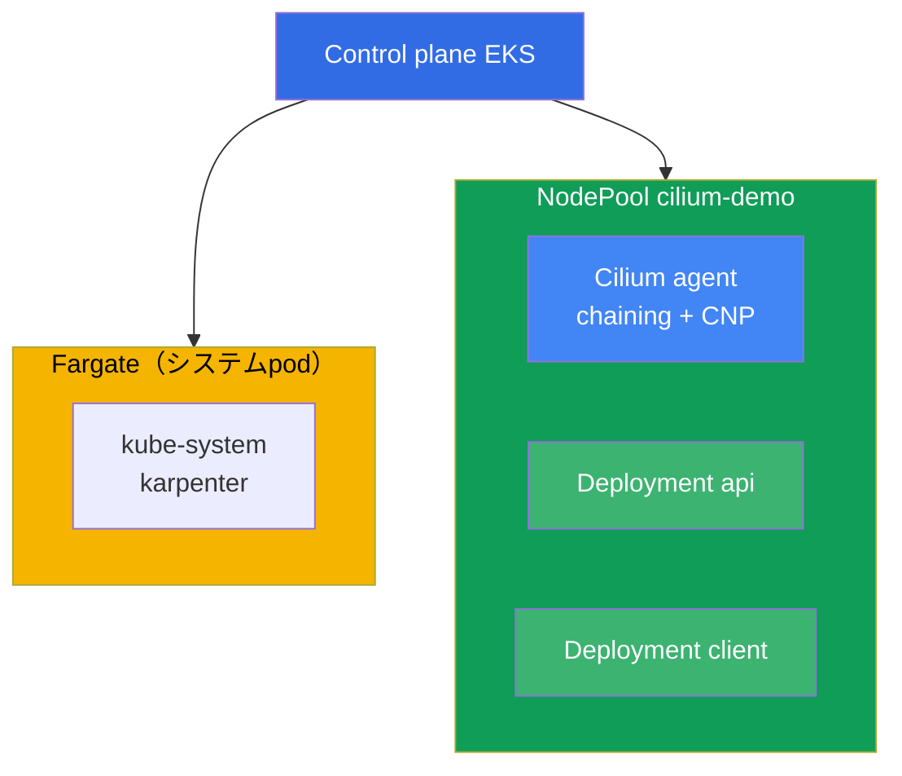
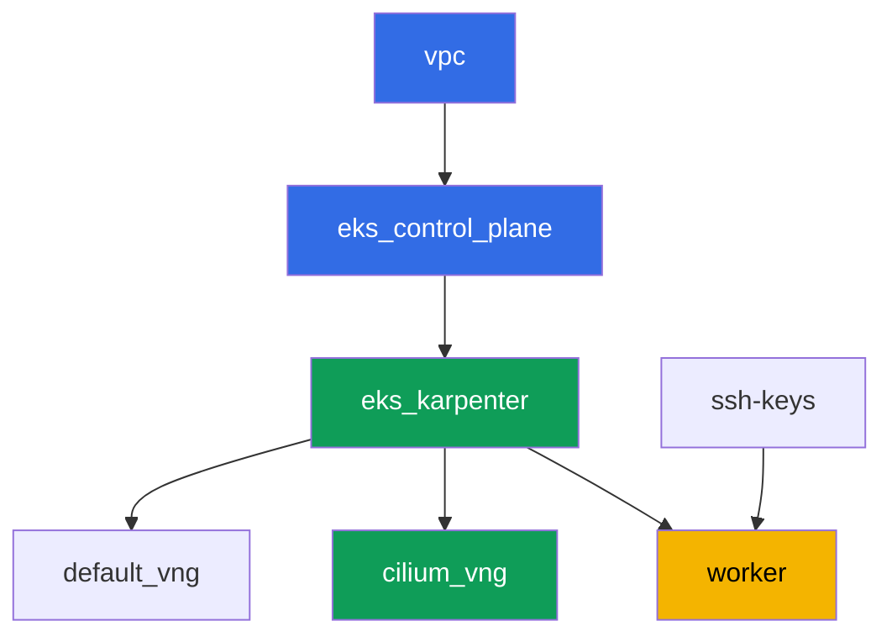

[Русская версия](README_RU.MD) · [Eng version](README.MD) · [Versión en español](README_ES.MD) · [Version française](README_FR.MD) · [Deutsche Version](README_DE.MD) · [ქართული ვერსია](README_GE.MD) · [繁體中文版](README_TW.MD)

# ラボ132 - 代替CNI：VPC CNIの上でCNI chainingモードで動くCilium

## 説明

このラボでは、標準のVPC CNIの上にCNI chainingモードでCiliumを追加します：podのアドレ
スは引き続きVPC CNIがENI経由で発行しますが、Ciliumはチェーンに加わり、既に設定済みの
podのインターフェースの上に自分のeBPFプログラムを追加します。これにより、VPC CNIの組
み込みnetwork policy（ラボ110）にはない機能 - HTTPメソッドによるL7ルール、DNS名
（FQDN）によるポリシー、Hubbleによるフローの可観測性 - が手に入りますが、IPAMとVPCの
統合はそのままです。

VPC CNIの完全な置き換え（`aws-node`を削除し、Cilium自身がIPAMになる）はこのラボの範囲
には含まれません。そのような移行はblue/green方式でノードを再作成する必要があり、稼働
中のクラスタでフラグを切り替えるようなものではありません（第8章、8.8節）。このラボの
クラスタが共有するNodePoolでそれを扱うのは安全ではありません。ここではchainingだけを
練習します - L7/DNSポリシーとHubbleを得るための、最も一般的でリスクが最も低い方法です。

タスクは本番スタイルで書かれています。短い課題文と受け入れ基準です。チェックは自動で、
`check_result`コマンドで行われます。

## 目標

コースの章の内容を定着させる：

- [第8章。VPC CNIの代替：Cilium、ネットワークモード](../../course/08/ru.md) -
  CNI chainingと完全な置き換えの比較、移行の正直なコスト
- [第30章。NetworkPolicy：ルール、DNS、テスト](../../course/30/ru.md) - VPC CNIの
  組み込みnetwork policyの限界とCiliumが追加するもの

## 作成するもの

クラスタはコードとしてデプロイされます（ベースはラボ101と同様）。その上に、Cilium
とこのラボの負荷専用のtaint付きの独立したNodePool `cilium-demo`が追加されています。
Ciliumは手動でHelm経由でインストールし、その上に負荷とポリシーを作成します。

| オブジェクト | 何か | このラボでの役割 |
|--------|---------|-------------------|
| NodePool `cilium-demo` | 2番目のKarpenter NodePool、taint `dedicated=cilium-demo` | Ciliumとデモ負荷をシステムpodとdefaultプールから分離する |
| Namespace `eks-132` | このラボの負荷用のクラスタ区画 | システムのリソースと分けておく |
| DaemonSet `cilium`（kube-system） | chainingモードのCiliumエージェント | VPC CNIが設定したインターフェースの上にeBPFプログラムを追加する |
| Deployment `api`（2レプリカ）+ Service `api` | ping_pongサーバー | L7ポリシーとFQDNポリシーの対象 |
| Deployment `client` | curl、`sleep 3600` | ポリシーを検証するためのトラフィック源 |
| `CiliumNetworkPolicy` L7 | ポート`8080`で`GET`のみ許可 | 組み込みのVPC CNI NPにはない機能 |
| `CiliumNetworkPolicy` FQDN | egressを`aws.amazon.com`のみに許可 | VPC CNI NPでは実現できないDNS名によるポリシー |
| Hubble relay | フローの可観測性 | agentのログだけでなく、verdict付きの`hubble observe` |

クラスタの全体像：



## インフラストラクチャ

環境はTerragruntを使ってAWS（`eu-central-1`）にデプロイされます。ラボの各ディレクトリ
は独自の`terragrunt.hcl`を持つ1つのコンポーネントであり、`terraform/modules/`内の共有
モジュールを参照し、`dependency`ブロックで依存関係を宣言します。Terragruntは依存関係
グラフを構築し、正しい順序でコンポーネントを適用します。

### モジュールと依存関係

| ディレクトリ（コンポーネント） | モジュール（`terraform/modules/`） | 依存先 | 作成するもの |
|---------------------|-------------------------------|------------|-------------|
| `vpc` | `vpc_v3` | - | VPC `10.10.0.0/16`、2つのAZのサブネット、NAT |
| `ssh-keys` | `ssh-keys` | - | ワークマシンとノード用のSSH鍵ペア |
| `eks_control_plane` | `eks_v2_control_plane` | `vpc` | EKS control plane `1.36`、OIDC |
| `eks_fargate_system` | `eks_v2_fargate` | `vpc`、`eks_control_plane` | Fargateプロファイル：`kube-system`の`coredns`と`karpenter`全体 |
| `eks_addons` | `eks_v2_addons` | `eks_control_plane`、`eks_fargate_system` | coredns、kube-proxy、vpc-cni、pod-identity |
| `eks_karpenter` | `eks_v2_karpenter` | `vpc`、`eks_control_plane`、`eks_addons`、`eks_fargate_system` | Karpenterコントローラー、ノードIAMロール |
| `eks_karpenter_default_vng` | `eks_v2_karpenter_vng` | `vpc`、`eks_control_plane`、`eks_karpenter` | デフォルトのNodePool `default`、taintなし |
| `eks_karpenter_cilium_vng` | `eks_v2_karpenter_vng` | `vpc`、`eks_control_plane`、`eks_karpenter` | NodePool `cilium-demo`：taint `dedicated=cilium-demo` |
| `worker` | `eks_v2_work_pc` | `ssh-keys`、`vpc`、`eks_control_plane`、`eks_karpenter` | kubectl、helm、テスト、`check_result`を備えたワークマシン |

依存関係グラフ（先に適用されるものほど矢印の下側にあります。`eks_fargate_system`と
`eks_addons`は8ノードの上限のため図には示されていませんが、実際には
`eks_control_plane`と`eks_karpenter`の間にあります。上の表の通りです）：



### NodePool `cilium-demo`の設定

`eks_karpenter_cilium_vng/terragrunt.hcl`内の主な`requirements`：

| Requirement | 値 | 理由 |
|-------------|----------|-------|
| taint | `dedicated=cilium-demo:NoSchedule` | tolerationを持つpodだけがこのプールに乗る |
| `vng.labels.work_type` | `cilium-demo` | このラベルによりCiliumと負荷が`nodeSelector`で結び付けられる |
| `karpenter.sh/capacity-type` | `In ["on-demand"]` | Ciliumのデモ用に予測可能なキャパシティ |
| `karpenter.k8s.aws/instance-category` | `In ["c", "m", "r"]` | 合理的なファミリーの集合 |
| `disruption.consolidationPolicy` | `WhenEmptyOrUnderutilized`、`consolidateAfter: 30s` | 空のノードの高速な統合 |

CiliumはTerraformではなく、ワークマシン上でHelm経由で手動でインストールします（タスク
3） - これは意図的な選択です：自分で担うことにしたCNIのライフサイクルは、管理された
インフラストラクチャの下に隠されるべきではありません（第8章）。

### なぜここでFargateプロファイルがlabelセレクタで絞られているのか

コースの他のラボでは、プロファイルはnamespace `kube-system`全体をカバーします。ここで
は`kube-system`用のセレクタにラベル`eks.amazonaws.com/component = coredns`が追加され、
`karpenter`はラベルのない別のエントリとして残っています。これは装飾ではありません。

Fargate webhookは、列挙されたnamespaceに入ったあらゆるpodに、そのpodが作成された瞬間
に自分のプロファイルの印を付けます。その後、そのpodは`fargate-scheduler`だけがスケジ
ュールし、これは`hostNetwork`も`nodeSelector`も対応しておらず、通常のscheduler
に戻ることも決してありません。Ciliumのagentとoperatorは`hostNetwork`を使うため、セレ
クタが広すぎると、それらは永久に`Pending`のままとなり、
`Pod not supported on Fargate: fields not supported: HostNetwork`というエラーが出て、
CiliumのCRDが登録されず、ラボがまったく実行できなくなります。ここで本当にFargateが必
要な唯一のシステムコンポーネントは`coredns`です（標準のEKSラベル
`eks.amazonaws.com/component=coredns`を持っています）。そのためプロファイルはそれに
絞られています。

その他のパラメータ（リージョン、ネットワーク、バージョン、プレフィックス）は
`env.hcl`から読み込まれます。ラボ101と同様で、そのロジックを変更する必要はありません。

## デプロイ

```bash
TASK=132 make run_eks_task
```

デプロイには約15-20分かかります。出力の中でワークマシンへのSSH接続の行を見つけて接続
してください。そこではkubectlとhelmが既に目的のクラスタに設定されています。

ワークマシン上で便利なコマンド：

```bash
time_left       # 環境の残り時間
check_result    # 解答を確認する
```

> HelmでのCiliumのインストールは1-2分かかりますが、agentが`cilium-demo`ノードで起動す
> るまでは、そのノード上のpodはeBPFプログラムを受け取りません。次のタスクに進む前に、
> すべての`cilium`podが`Running`になるのを待ってください。

> このクラスタでは短い名前`cnp`はあいまいです：VPC CNIが自分のリソース
> `clusternetworkpolicies.networking.k8s.aws`を持ち込むため、kubectlはこれについて警
> 告を出します。完全な名前`ciliumnetworkpolicies.cilium.io`を使ってください。

> Karpenterが`cilium-demo`プールに2番目のノードを立てた場合（負荷が1つに収まらなかっ
> た場合）、CiliumのDaemonSetもそこに乗り、`api`のpodが両方のノードに分散することが
> あります。これは正常であり、何も壊しません。

> テスト環境のセキュリティ。`env.hcl`では`ssh_password_enable = true`と
> `access_cidrs = ["0.0.0.0/0"]`が有効になっています - トレーニング環境には便利です
> が、本番環境ではこのようにしてはいけません。コースの標準（第0.2章、第2章、第19章）
> では、ワークマシンへのアクセスはパブリックなSSHポートを外部に公開せずにAWS SSM
> Session Managerを通して開かれ、`access_cidrs`は具体的なアドレスに絞られます。ここで
> はパブリックSSHは起動を簡単にするためだけに残されています。

## タスク

---
|        **1**        | **このラボの負荷用のNamespace**                             |
| :-----------------: | :---------------------------------------------------------- |
| やること          | `eks-132`という名前のnamespaceを作成してください。このラボのすべてのオブジェクトはその中に作成されます。 |
| 受け入れ基準    | - namespace `eks-132`が存在する。 |
---
|        **2**        | **`cilium-demo`プール上の負荷と、純粋なVPC CNI上での接続性** |
| :-----------------: | :---------------------------------------------------------- |
| やること          | `eks-132`にDeployment `api`（イメージ`viktoruj/ping_pong:latest`、`2`レプリカ、ポート`8080`）とService `api`を作成してください。Deployment `client`（イメージ`curlimages/curl:latest`、コマンド`sleep 3600`）を作成してください。両方のDeploymentは`nodeSelector` `work_type: cilium-demo`とtoleration `dedicated=cilium-demo:NoSchedule`を持ちます。これによりKarpenterに`cilium-demo`プールでノードを立ち上げるシグナルが送られます（空のDaemonSetだけではノードを要求しません）。Readyになるまで待ちます。この段階ではCiliumはまだインストールされておらず、すべてのトラフィックは標準のVPC CNIを経由します。`client`から`api.eks-132.svc.cluster.local:8080`への`curl`を確認し、`HTTP_CODE=<コード>`をファイル`/var/work/tests/artifacts/2/connectivity_before.txt`に保存してください。 |
| 受け入れ基準    | - Deployment `api`、`2`個のReadyレプリカ、Service `api`ポート`8080`;<br/>- Deployment `client`、`1`個のReadyレプリカ;<br/>- 両方がラベル`work_type=cilium-demo`のノード上にある;<br/>- ファイル`2/connectivity_before.txt`が`HTTP_CODE=200`を含む。 |
---
|        **3**        | **CNI chainingモードのCilium、`cilium-demo`プールのみ** |
| :-----------------: | :---------------------------------------------------------- |
| やること          | Helm経由でchainingモード（`cni.chainingMode: aws-cni`）でCiliumをインストールし、`nodeSelector`/`tolerations`をラベル`work_type: cilium-demo`のノードだけに限定してください。chartの2つの特徴に注意してください：トップレベルの`nodeSelector`はDaemonSet `cilium`にのみ効き、`cilium-envoy`と`cilium-operator`には独自のセクション（`envoy.*`、`operator.*`）があります。また必ず`operator.unmanagedPodWatcher.restart`を無効にしてください - そうしないとoperatorがFargate上の`coredns`podを繰り返し削除し続けます（これらは`CiliumEndpoint`を持たず、持つこともできません）。そしてクラスタのDNSが壊れます。すべてのCilium podが`Running`になり、`cilium-demo`ノードにのみ存在することを確認してください。`api`と`client`のpodはCiliumのインストール前に起動されており、チェーンに接続されていません - 両方のDeploymentに対して`kubectl rollout restart`を実行し、Cilium経由で再接続してください（これはCiliumのドキュメントでchainingについて明確に説明されています）。Cilium CLIをインストールし、`cilium status`を確認してください - `Cilium:`と`OK`が出力されます。出力をファイル`/var/work/tests/artifacts/3/cilium_status.txt`に保存してください。 |
| 受け入れ基準    | - `kube-system`内のDaemonSet `cilium`が`nodeSelector.work_type: cilium-demo`を持つ;<br/>- すべての`cilium`podが`Running`である;<br/>- ファイル`3/cilium_status.txt`が空でなく、`Cilium:`と`OK`を含む。 |
---
|        **4**        | **chainingの証明：アドレスは依然VPC CNIから**       |
| :-----------------: | :---------------------------------------------------------- |
| やること          | `kubectl get pods -n eks-132 -o wide`の出力をファイル`/var/work/tests/artifacts/4/podips.txt`に保存してください。`api`と`client`のpodのIPが、ラボのVPCのCIDR`10.10.0.0/16`から来ていて、別のoverlay範囲から来ていないことを確認してください。これはIPAMが依然VPC CNIの管理下にあることを証明します - Ciliumはポリシーと可観測性を追加しただけで、アドレスモデルを置き換えていません（第8章、chainingについての節）。 |
| 受け入れ基準    | - ファイル`4/podips.txt`が空でない;<br/>- `10.10.`で始まるアドレスが少なくとも2つ含まれる。 |
---
|        **5**        | **L7ポリシー：GETのみ許可**                        |
| :-----------------: | :---------------------------------------------------------- |
| やること          | `eks-132`に`CiliumNetworkPolicy` `cilium-l7-allow-get`を作成してください：`endpointSelector`を`app: api`に、ingressを`app: client`からポート`8080/TCP`に、`rules.http`でメソッド`GET`を許可し、他のメソッドは禁止してください。`client`から`api`への`curl`（GET）を確認し、`HTTP_CODE=200`をファイル`/var/work/tests/artifacts/5/allowed_get.txt`に保存してください。`client`から`api`への`curl -X POST`を確認し、結果（`200`ではない）をファイル`/var/work/tests/artifacts/5/blocked_post.txt`に保存してください。組み込みのVPC CNI NetworkPolicyにはこのようなL7フィルタはありません（第8章）。 |
| 受け入れ基準    | - `rules.http.method: GET`を持つ`CiliumNetworkPolicy` `cilium-l7-allow-get`;<br/>- ファイル`5/allowed_get.txt`が`HTTP_CODE=200`を含む;<br/>- ファイル`5/blocked_post.txt`が`HTTP_CODE=200`を含まない。 |
---
|        **6**        | **FQDNポリシー：egressを1つのドメイン名のみに許可**        |
| :-----------------: | :---------------------------------------------------------- |
| やること          | `eks-132`に`CiliumNetworkPolicy` `cilium-fqdn-allow-aws`を作成してください：`endpointSelector`を`app: client`に、最初のegressブロック（`egress[0]`）で`toFQDNs.matchName: aws.amazon.com`をポート`443/TCP`に設定します。続いて、それらがないとラボが壊れる2つのブロックがあります。DNSはCIDRで許可します（サービス範囲`172.20.0.0/16`とVPC CIDR`10.10.0.0/16`を`toCIDRSet`で）、ポート`53`で`rules.dns`を使います：ラベル`k8s-app: kube-dns`によるルールはここでは機能しません。`coredns`はFargate上で動作しており、`CiliumEndpoint`を持たず、ポリシー上では`reserved:world`としてしか見えないからです。そして`app: api`へのegressをポート`8080/TCP`で明示的に許可してください：`endpointSelector`はpod `client`の全egressに対してdefault-denyを有効にするため、これがないとタスク5のGETが通らなくなります。`aws.amazon.com`への`curl`を確認し、`HTTP_CODE=<コード>`をファイル`/var/work/tests/artifacts/6/allowed_fqdn.txt`に保存してください。タイムアウト付きで他の外部ドメイン（例えば`example.com`）への`curl`を確認し、結果（成功コードではない）をファイル`/var/work/tests/artifacts/6/blocked_other_domain.txt`に保存してください。組み込みのVPC CNI NetworkPolicyにはDNS名によるポリシーがまったくありません（第8章）。 |
| 受け入れ基準    | - `egress[].toFQDNs[].matchName: aws.amazon.com`を持つ`CiliumNetworkPolicy` `cilium-fqdn-allow-aws`;<br/>- ファイル`6/allowed_fqdn.txt`が空でなく、`HTTP_CODE=`（コードが`2xx`または`3xx`）を含む;<br/>- ファイル`6/blocked_other_domain.txt`が空でなく、`HTTP_CODE=200`を含まない。 |
---
|        **7**        | **Hubble：verdict付きのフロー可観測性**                  |
| :-----------------: | :---------------------------------------------------------- |
| やること          | Hubble relayを有効にしてください（`helm upgrade cilium ... --set hubble.relay.enabled=true`、同じ`nodeSelector`で`cilium-demo`に）。Hubble CLIをインストールしてください。タスク5または6でブロックされたリクエストを繰り返し、`DROPPED`イベントを取得してください。namespace `eks-132`でフィルタした`hubble observe`を実行し、verdict `DROPPED`を含む出力をファイル`/var/work/tests/artifacts/7/hubble_denied.txt`に保存してください。組み込みのVPC CNI NPの診断には、このようなper-flow verdict付きのフローマップはまったくありません - agentのログだけです（第8章）。 |
| 受け入れ基準    | - `kube-system`内のDeployment `hubble-relay`、`1`個のReadyレプリカ;<br/>- ファイル`7/hubble_denied.txt`が空でなく、`DROPPED`を含む。 |
---
|        **8**        | **比較：Ciliumが何を追加し、何を代償にするか**            |
| :-----------------: | :---------------------------------------------------------- |
| やること          | 組み込みのVPC CNI NetworkPolicyができること、このラボでCiliumが追加したもの、そのために何を代償にするかについてのテキスト（3-5項目）をファイル`/var/work/tests/artifacts/8/comparison.txt`に保存してください。テキストには単語`L7`、`FQDN`、`Hubble`が含まれている必要があります。別途、VPC CNIの完全な置き換えはこのラボの範囲に含まれないことを、第8章（CNIの移行をblue/green操作として扱う節）を引用して記述してください。 |
| 受け入れ基準    | - ファイル`8/comparison.txt`が空でない;<br/>- 単語`L7`、`FQDN`、`Hubble`を含む;<br/>- 第8章への言及（`chapter 8`）と単語`blue`（`blue/green`から）を含む。 |
---

## 結果の確認

ワークマシンで自動チェックを実行してください：

```bash
check_result
```

スクリプトはテストを実行し、完了したタスクの割合を表示します。

## 解答

参考解答：[worker/files/solutions/1_JP.MD](worker/files/solutions/1_JP.MD)

## クラスタとリソースの削除

まず手動でインストールしたものをクラスタから取り除き、Karpenterがノードを削除するの
を待ちます。これを行わないと、Terraformはノードのsecurity groupを削除しようとします
が、孤立したENIがそれを保持しているため、`destroy`がタイムアウトで止まります。

順序が重要です：まずCiliumを取り除き、その後負荷を取り除きます。負荷を先に削除する
と、Karpenterはその上で動いているCiliumのagentとともに`cilium-demo`ノードを縮小し始
めます。

```bash
# 1. Ciliumの削除（それに伴いhubble-relay、cilium-envoy、operatorも削除される）
# 括弧内のパターンは必須です：これがないと、コマンドを1つずつではなくまとめて
# 貼り付けた場合、pkillは自分自身のコマンドラインにマッチしてブロックの残りを中断します。
pkill -f "[p]ort-forward service/hubble-relay" || true
helm uninstall cilium -n kube-system

# 2. ラボのポリシーと負荷の削除
kubectl delete ciliumnetworkpolicies.cilium.io -n eks-132 --all --ignore-not-found
kubectl delete namespace eks-132 --wait=true

# 3. Karpenterがcilium-demoプールのノードを削除するのを待つ（通常1-2分）
kubectl get nodes -l work_type=cilium-demo -w
```

出力に`cilium-demo`のノードがなくなったら、インフラストラクチャを削除してください：

```bash
TASK=132 make delete_eks_task
```

それでも`destroy`がノードのsecurity groupで止まる場合は、孤立したENIを見つけて削除
してください：

```bash
aws ec2 describe-network-interfaces \
  --filters "Name=group-id,Values=<sg-id-from-error>" \
  --query 'NetworkInterfaces[].{Id:NetworkInterfaceId,Status:Status,Desc:Description}'
aws ec2 delete-network-interface --network-interface-id <eni-id>
```

ラボの確認後は環境の作業ディレクトリを削除してください。そうしないと、このラボの
モジュールが次のラボに影響します：

```bash
rm -rf terraform/environments/eks-labs
```
