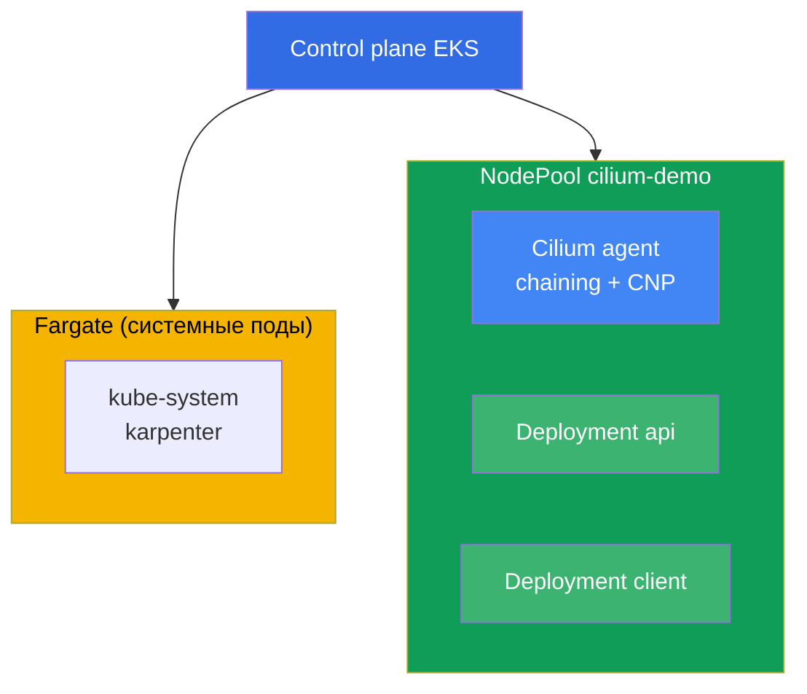
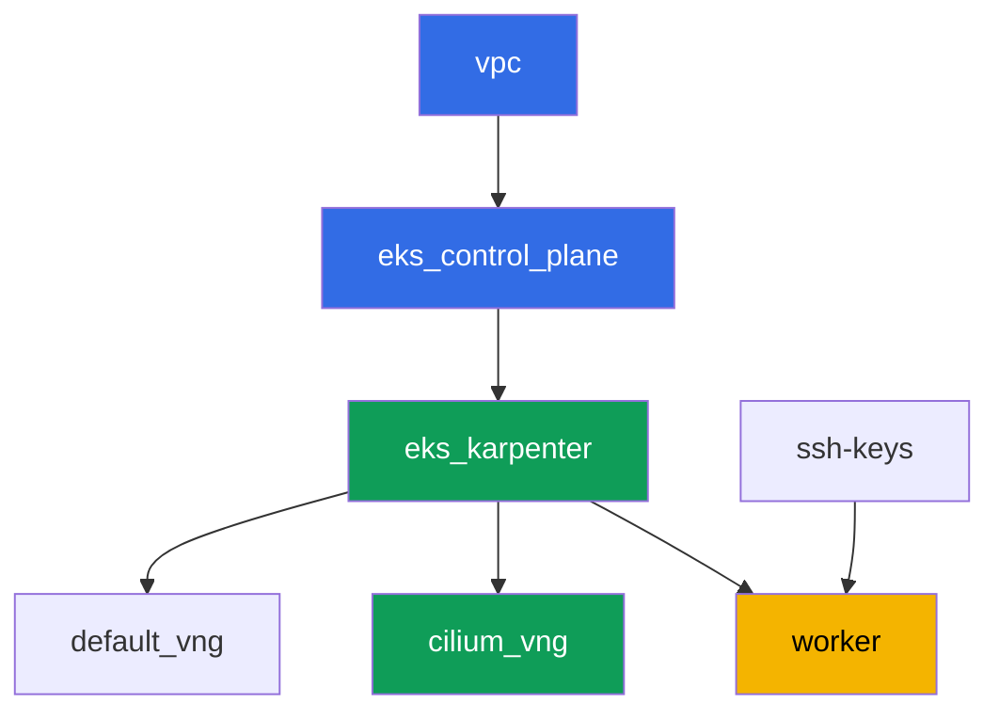

# Лаба 132 - Альтернативный CNI: Cilium в режиме CNI chaining над VPC CNI

## Описание

В этой лабе вы добавляете Cilium поверх штатного VPC CNI в режиме CNI chaining: адреса
подов продолжает выдавать VPC CNI через ENI, а Cilium подключается в цепочку и добавляет
свои eBPF-программы поверх уже настроенного интерфейса пода. Вы получаете то, чего нет во
встроенной network policy VPC CNI (лаба 110) - L7-правила по HTTP-методу, политики по
DNS-имени (FQDN) и наблюдаемость потоков через Hubble, при этом IPAM и интеграции VPC
остаются на месте.

Полная замена VPC CNI (когда `aws-node` удаляется и Cilium сам становится IPAM) в объём
этой лабы не входит. Такая миграция требует пересоздания нод по схеме blue/green, а не
переключения флага на живом кластере (глава 8, раздел 8.8), и разбирать её в общем
NodePool кластера этой лабы небезопасно. Здесь отрабатывается только chaining - самый
частый и самый дешёвый по риску способ получить L7/DNS-политики и Hubble.

Задания в продакшн-стиле: короткая постановка плюс критерии приёмки. Проверка -
автоматическая, командой `check_result`.

## Цель

Закрепить материал глав курса:

- [Глава 8. Альтернативы VPC CNI: Cilium, режимы сети](../../course/08/ru.md) - CNI
  chaining против полной замены, честная цена перехода
- [Глава 30. NetworkPolicy: правила, DNS, тестирование](../../course/30/ru.md) - границы
  встроенной network policy VPC CNI и что добавляет Cilium

## Что мы создаём

Кластер разворачивается как код (база - как в лабе 101), поверх него добавлен отдельный
NodePool `cilium-demo` с taint, только под нагрузку Cilium и этой лабы. Cilium ставится
через Helm вручную, вы создаёте нагрузку и политики поверх него.

| Объект | Что это | Зачем в этой лабе |
|--------|---------|-------------------|
| NodePool `cilium-demo` | второй Karpenter NodePool, taint `dedicated=cilium-demo` | изолирует Cilium и демо-нагрузку от системных подов и default-пула |
| Namespace `eks-132` | раздел кластера под нагрузку лабы | держим ресурсы отдельно от системных |
| DaemonSet `cilium` (kube-system) | агент Cilium в режиме chaining | добавляет eBPF-программы поверх интерфейса, настроенного VPC CNI |
| Deployment `api` (2 реплики) + Service `api` | сервер ping_pong | цель для L7- и FQDN-политик |
| Deployment `client` | curl, `sleep 3600` | источник трафика для проверки политик |
| `CiliumNetworkPolicy` L7 | разрешает только `GET` на порт `8080` | возможность, которой нет у встроенного VPC CNI NP |
| `CiliumNetworkPolicy` FQDN | разрешает egress только на `aws.amazon.com` | политика по DNS-имени, недоступная VPC CNI NP |
| Hubble relay | наблюдаемость потоков | `hubble observe` с verdict, вместо только логов агента |

Итоговая картина кластера:



## Инфраструктура

Окружение разворачивается в AWS (`eu-central-1`) через Terragrunt. Каждый каталог лабы -
это один компонент со своим `terragrunt.hcl`, который ссылается на общий модуль в
`terraform/modules/` и объявляет зависимости через блоки `dependency`. Terragrunt строит
граф зависимостей и применяет компоненты в правильном порядке.

### Модули и зависимости

| Каталог (компонент) | Модуль (`terraform/modules/`) | Зависит от | Что создаёт |
|---------------------|-------------------------------|------------|-------------|
| `vpc` | `vpc_v3` | - | VPC `10.10.0.0/16`, подсети в двух AZ, NAT |
| `ssh-keys` | `ssh-keys` | - | пара SSH-ключей для рабочей машины и нод |
| `eks_control_plane` | `eks_v2_control_plane` | `vpc` | control plane EKS `1.36`, OIDC |
| `eks_fargate_system` | `eks_v2_fargate` | `vpc`, `eks_control_plane` | Fargate-профиль: `coredns` в `kube-system` плюс весь `karpenter` |
| `eks_addons` | `eks_v2_addons` | `eks_control_plane`, `eks_fargate_system` | coredns, kube-proxy, vpc-cni, pod-identity |
| `eks_karpenter` | `eks_v2_karpenter` | `vpc`, `eks_control_plane`, `eks_addons`, `eks_fargate_system` | контроллер Karpenter, IAM-роль нод |
| `eks_karpenter_default_vng` | `eks_v2_karpenter_vng` | `vpc`, `eks_control_plane`, `eks_karpenter` | дефолтный NodePool `default`, без taint |
| `eks_karpenter_cilium_vng` | `eks_v2_karpenter_vng` | `vpc`, `eks_control_plane`, `eks_karpenter` | NodePool `cilium-demo`: taint `dedicated=cilium-demo` |
| `worker` | `eks_v2_work_pc` | `ssh-keys`, `vpc`, `eks_control_plane`, `eks_karpenter` | рабочая машина с kubectl, helm, тестами и `check_result` |

Граф зависимостей (что применяется раньше, то ниже по стрелке; `eks_fargate_system` и
`eks_addons` на диаграмме не показаны ради лимита в 8 узлов, но по факту стоят между
`eks_control_plane` и `eks_karpenter`, как в таблице выше):



### Настройки NodePool `cilium-demo`

Ключевые `requirements` в `eks_karpenter_cilium_vng/terragrunt.hcl`:

| Requirement | Значение | Зачем |
|-------------|----------|-------|
| taint | `dedicated=cilium-demo:NoSchedule` | на пул попадают только поды с toleration |
| `vng.labels.work_type` | `cilium-demo` | по этой метке Cilium и нагрузка привязываются `nodeSelector` |
| `karpenter.sh/capacity-type` | `In ["on-demand"]` | предсказуемая ёмкость для демонстрации Cilium |
| `karpenter.k8s.aws/instance-category` | `In ["c", "m", "r"]` | разумный набор семейств |
| `disruption.consolidationPolicy` | `WhenEmptyOrUnderutilized`, `consolidateAfter: 30s` | быстрая консолидация пустых нод |

Cilium ставится не через Terraform, а через Helm вручную на рабочей машине (задание 3) -
это осознанный выбор: жизненный цикл CNI, который вы взяли на себя, не должен маскироваться
под управляемую инфраструктуру (глава 8).

### Почему Fargate-профиль здесь сужен label-селектором

В остальных лабах курса профиль накрывает namespace `kube-system` целиком. Здесь у
селектора для `kube-system` добавлен label `eks.amazonaws.com/component = coredns`, а
`karpenter` остался отдельной записью без меток. Это не косметика.

Fargate-webhook помечает своим профилем ЛЮБОЙ под, попавший в перечисленный namespace, в
момент создания пода. После этого под шедулит только `fargate-scheduler`, который не умеет
ни `hostNetwork`, ни `nodeSelector` и никогда не откатывается на обычный scheduler. Агент и
оператор Cilium используют `hostNetwork`, поэтому при широком селекторе они навсегда
остаются в `Pending` с `Pod not supported on Fargate: fields not supported: HostNetwork`,
CRD Cilium не регистрируются, и лаба не выполняется вовсе. Единственный системный
компонент, которому Fargate нужен именно здесь, - `coredns` (у него штатный EKS-label
`eks.amazonaws.com/component=coredns`), поэтому профиль сужен до него.

Остальные параметры (регион, сеть, версии, префиксы) читаются из `env.hcl`, как в лабе 101;
менять их логику не нужно.

## Развёртывание

```bash
TASK=132 make run_eks_task
```

Развёртывание занимает примерно 15-20 минут. В выводе найдите строку с SSH-подключением к
рабочей машине и подключитесь к ней. kubectl и helm там уже настроены на нужный кластер.

Полезные команды на рабочей машине:

```bash
time_left       # сколько осталось времени окружения
check_result    # проверить решение
```

> Установка Cilium через Helm занимает 1-2 минуты, но пока агент не поднялся на ноде
> `cilium-demo`, поды на ней не получат его eBPF-программы. Дождитесь `Running` у всех
> подов `cilium` перед тем, как переходить к следующему заданию.

> В этом кластере короткое имя `cnp` неоднозначно: VPC CNI приносит свой ресурс
> `clusternetworkpolicies.networking.k8s.aws`, и kubectl предупреждает об этом. Пишите
> полное имя `ciliumnetworkpolicies.cilium.io`.

> Если Karpenter поднимет вторую ноду в пуле `cilium-demo` (нагрузка не влезла в одну),
> DaemonSet Cilium встанет и на неё, а поды `api` могут разъехаться по обеим нодам. Это
> нормально и ничего не ломает.

> Безопасность стенда. В `env.hcl` включены `ssh_password_enable = true` и
> `access_cidrs = ["0.0.0.0/0"]` - это удобно для учебного окружения, но так делать в
> продакшене нельзя. По стандартам курса (главы 0.2, 2, 19) доступ к рабочим машинам
> открывают через AWS SSM Session Manager без публичных SSH-портов наружу, а `access_cidrs`
> сужают до конкретных адресов. Здесь публичный SSH оставлен только ради простоты запуска.

## Задания

---
|        **1**        | **Namespace для нагрузки лабы**                             |
| :-----------------: | :---------------------------------------------------------- |
| Что делаем          | Создайте namespace с именем `eks-132`. Все объекты лабы создаются внутри него. |
| Критерии приёмки    | - namespace `eks-132` существует. |
---
|        **2**        | **Нагрузка на пуле `cilium-demo` и связность на чистом VPC CNI** |
| :-----------------: | :---------------------------------------------------------- |
| Что делаем          | В `eks-132` создайте Deployment `api` (образ `viktoruj/ping_pong:latest`, `2` реплики, порт `8080`) и Service `api`. Создайте Deployment `client` (образ `curlimages/curl:latest`, команда `sleep 3600`). Оба Deployment - с `nodeSelector` `work_type: cilium-demo` и toleration на `dedicated=cilium-demo:NoSchedule`, это даст Karpenter сигнал поднять ноду в пуле `cilium-demo` (пустой DaemonSet сам ноду не запросит). Дождитесь готовности. На этом шаге Cilium ещё не установлен, весь трафик идёт через штатный VPC CNI. Проверьте `curl` от `client` до `api.eks-132.svc.cluster.local:8080` и сохраните `HTTP_CODE=<код>` в файл `/var/work/tests/artifacts/2/connectivity_before.txt`. |
| Критерии приёмки    | - Deployment `api`, `2` готовые реплики, Service `api` порт `8080`;<br/>- Deployment `client`, `1` готовая реплика;<br/>- оба на нодах `work_type=cilium-demo`;<br/>- файл `2/connectivity_before.txt` содержит `HTTP_CODE=200`. |
---
|        **3**        | **Cilium в режиме CNI chaining, только на пуле `cilium-demo`** |
| :-----------------: | :---------------------------------------------------------- |
| Что делаем          | Установите Cilium через Helm в режиме chaining (`cni.chainingMode: aws-cni`), ограничив `nodeSelector`/`tolerations` только нодами с меткой `work_type: cilium-demo`. Учтите две особенности chart: верхний `nodeSelector` наследует только DaemonSet `cilium`, у `cilium-envoy` и `cilium-operator` свои секции (`envoy.*`, `operator.*`); и обязательно выключите `operator.unmanagedPodWatcher.restart` - иначе оператор будет по кругу удалять поды `coredns` на Fargate, у которых нет и не может быть `CiliumEndpoint`, и DNS в кластере ляжет. Дождитесь, пока все поды Cilium перейдут в `Running` и находятся только на нодах `cilium-demo`. Поды `api` и `client` были запущены до установки Cilium и не подключены к цепочке - выполните `kubectl rollout restart` для обоих Deployment, чтобы они переподключились через Cilium (это явно описано в документации Cilium для chaining). Установите Cilium CLI и подтвердите `cilium status` - строки `Cilium:` и `OK`. Сохраните вывод в файл `/var/work/tests/artifacts/3/cilium_status.txt`. |
| Критерии приёмки    | - DaemonSet `cilium` в `kube-system` с `nodeSelector.work_type: cilium-demo`;<br/>- все поды `cilium` в `Running`;<br/>- файл `3/cilium_status.txt` не пуст, содержит `Cilium:` и `OK`. |
---
|        **4**        | **Доказательство chaining: адреса всё ещё от VPC CNI**       |
| :-----------------: | :---------------------------------------------------------- |
| Что делаем          | Сохраните `kubectl get pods -n eks-132 -o wide` в файл `/var/work/tests/artifacts/4/podips.txt`. Убедитесь, что IP подов `api` и `client` из CIDR VPC лабы `10.10.0.0/16`, а не из отдельного overlay-диапазона. Это подтверждает, что IPAM остался за VPC CNI - Cilium добавил только политики и наблюдаемость, а не заменил адресную модель (глава 8, раздел про chaining). |
| Критерии приёмки    | - файл `4/podips.txt` не пуст;<br/>- содержит хотя бы два адреса, начинающихся с `10.10.`. |
---
|        **5**        | **L7-политика: разрешить только GET**                        |
| :-----------------: | :---------------------------------------------------------- |
| Что делаем          | Создайте `CiliumNetworkPolicy` `cilium-l7-allow-get` в `eks-132`: `endpointSelector` на `app: api`, ingress от `app: client` на порт `8080/TCP` с `rules.http` - метод `GET` разрешён, остальные методы запрещены. Проверьте `curl` (GET) от `client` до `api` - сохраните `HTTP_CODE=200` в файл `/var/work/tests/artifacts/5/allowed_get.txt`. Проверьте `curl -X POST` от `client` до `api` - сохраните результат (не `200`) в файл `/var/work/tests/artifacts/5/blocked_post.txt`. Такой L7-фильтр недоступен встроенному VPC CNI NetworkPolicy (глава 8). |
| Критерии приёмки    | - `CiliumNetworkPolicy` `cilium-l7-allow-get` с `rules.http.method: GET`;<br/>- файл `5/allowed_get.txt` содержит `HTTP_CODE=200`;<br/>- файл `5/blocked_post.txt` не содержит `HTTP_CODE=200`. |
---
|        **6**        | **FQDN-политика: egress только на одно доменное имя**        |
| :-----------------: | :---------------------------------------------------------- |
| Что делаем          | Создайте `CiliumNetworkPolicy` `cilium-fqdn-allow-aws` в `eks-132`: `endpointSelector` на `app: client`, первым блоком egress (`egress[0]`) - `toFQDNs.matchName: aws.amazon.com` на порт `443/TCP`. Дальше два блока, без которых лаба ломается. DNS разрешите по CIDR (`toCIDRSet` с сервисным диапазоном `172.20.0.0/16` и CIDR VPC `10.10.0.0/16`) на порт `53` с `rules.dns`: правило по метке `k8s-app: kube-dns` тут не сработает, потому что `coredns` живёт на Fargate, `CiliumEndpoint` у него нет и в политике он виден только как `reserved:world`. И явно разрешите egress на `app: api` порт `8080/TCP`: `endpointSelector` включает default-deny на весь egress пода `client`, иначе GET из задания 5 перестанет проходить. Проверьте `curl` до `aws.amazon.com` - сохраните `HTTP_CODE=<код>` в файл `/var/work/tests/artifacts/6/allowed_fqdn.txt`. Проверьте `curl` до другого внешнего домена (например `example.com`) с таймаутом - сохраните результат (не успешный код) в файл `/var/work/tests/artifacts/6/blocked_other_domain.txt`. Правил по DNS-имени у встроенного VPC CNI NetworkPolicy нет (глава 8). |
| Критерии приёмки    | - `CiliumNetworkPolicy` `cilium-fqdn-allow-aws` с `egress[].toFQDNs[].matchName: aws.amazon.com`;<br/>- файл `6/allowed_fqdn.txt` не пуст и содержит `HTTP_CODE=`, где код `2xx` или `3xx`;<br/>- файл `6/blocked_other_domain.txt` не пуст и не содержит `HTTP_CODE=200`. |
---
|        **7**        | **Hubble: наблюдаемость потоков с verdict**                  |
| :-----------------: | :---------------------------------------------------------- |
| Что делаем          | Включите Hubble relay (`helm upgrade cilium ... --set hubble.relay.enabled=true`, тот же `nodeSelector` на `cilium-demo`). Установите Hubble CLI. Повторите заблокированный запрос из задания 5 или 6, чтобы получить событие `DROPPED`. Выполните `hubble observe` с фильтром по namespace `eks-132` и сохраните вывод, содержащий verdict `DROPPED`, в файл `/var/work/tests/artifacts/7/hubble_denied.txt`. Такой карты потоков с verdict у диагностики встроенного VPC CNI NP нет - там только логи агента (глава 8). |
| Критерии приёмки    | - Deployment `hubble-relay` в `kube-system` с `1` готовой репликой;<br/>- файл `7/hubble_denied.txt` не пуст и содержит `DROPPED`. |
---
|        **8**        | **Сравнение: что добавил Cilium и чем вы платите**            |
| :-----------------: | :---------------------------------------------------------- |
| Что делаем          | Сохраните в файл `/var/work/tests/artifacts/8/comparison.txt` текст (3-5 пунктов) о том, что умеет встроенный VPC CNI NetworkPolicy, что добавил Cilium в этой лабе, и чем вы за это платите. В тексте должны быть слова `L7`, `FQDN` и `Hubble`. Отдельно укажите, что полная замена VPC CNI не входит в объём этой лабы, со ссылкой на главу 8 (раздел про миграцию CNI как blue/green-операцию). |
| Критерии приёмки    | - файл `8/comparison.txt` не пуст;<br/>- содержит слова `L7`, `FQDN`, `Hubble`;<br/>- содержит упоминание главы 8 (`глава 8` или `chapter 8`) и слово `blue` (от `blue/green`). |
---

## Проверка результата

На рабочей машине запустите автоматическую проверку:

```bash
check_result
```

Скрипт прогонит тесты и покажет процент выполненных заданий.

## Решение

Эталонное решение: [worker/files/solutions/1.MD](worker/files/solutions/1.MD)

## Удаление кластера и ресурсов

Сначала снимите с кластера то, что вы поставили руками, и дождитесь, пока Karpenter уберёт
ноды. Если этого не сделать, Terraform будет пытаться удалить security group нод, пока её
держит осиротевший ENI, и `destroy` встанет в таймаут.

Порядок важен: сначала уходит Cilium, потом нагрузка. Если удалить нагрузку первой,
Karpenter начнёт схлопывать ноду `cilium-demo` вместе с работающим на ней агентом Cilium.

```bash
# 1. Снять Cilium (вместе с ним уходят hubble-relay, cilium-envoy и оператор)
# Шаблон в скобках обязателен: без него pkill сматчит собственную командную строку
# и оборвёт остаток блока, если вы вставляете команды пачкой, а не по одной.
pkill -f "[p]ort-forward service/hubble-relay" || true
helm uninstall cilium -n kube-system

# 2. Убрать политики и нагрузку лабы
kubectl delete ciliumnetworkpolicies.cilium.io -n eks-132 --all --ignore-not-found
kubectl delete namespace eks-132 --wait=true

# 3. Дождаться, пока Karpenter уберёт ноды пула cilium-demo (обычно 1-2 минуты)
kubectl get nodes -l work_type=cilium-demo -w
```

Когда нод `cilium-demo` в выводе не осталось, удаляйте инфраструктуру:

```bash
TASK=132 make delete_eks_task
```

Если `destroy` всё-таки встал на security group нод, найдите и удалите осиротевший ENI:

```bash
aws ec2 describe-network-interfaces \
  --filters "Name=group-id,Values=<sg-id-из-ошибки>" \
  --query 'NetworkInterfaces[].{Id:NetworkInterfaceId,Status:Status,Desc:Description}'
aws ec2 delete-network-interface --network-interface-id <eni-id>
```

После проверки лабы удалите рабочий каталог окружения, иначе модули этой лабы попадут в
следующую:

```bash
rm -rf terraform/environments/eks-labs
```
