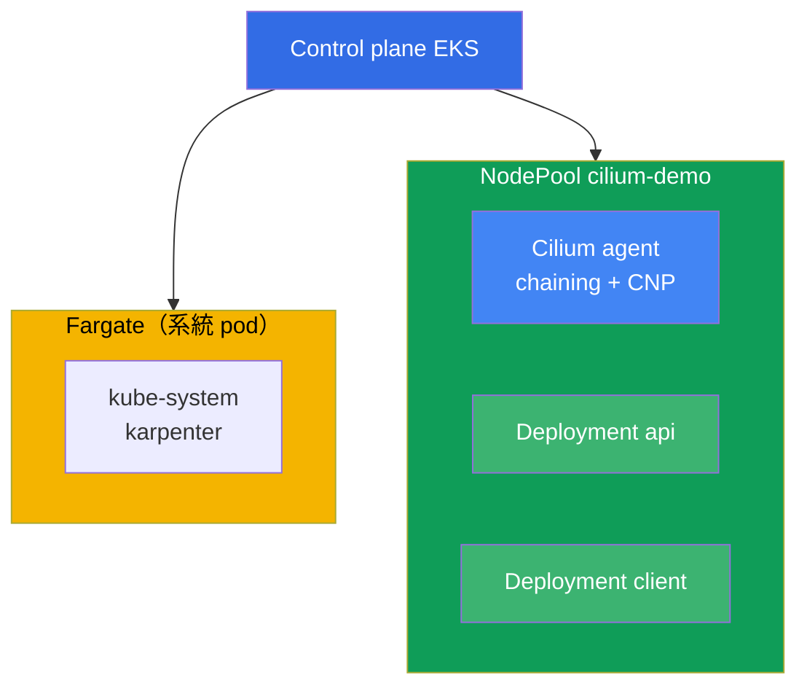
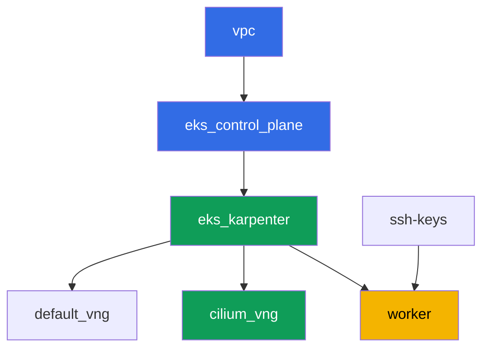

[Русская версия](README_RU.MD) · [Eng version](README.MD) · [Versión en español](README_ES.MD) · [Version française](README_FR.MD) · [Deutsche Version](README_DE.MD) · [ქართული ვერსია](README_GE.MD) · [日本語版](README_JP.MD)

# 實驗 132 - 替代 CNI：Cilium 在 CNI chaining 模式下疊加於 VPC CNI

## 描述

在這個實驗中，您會在標準 VPC CNI 之上以 CNI chaining 模式添加 Cilium：pod 的地址仍由
VPC CNI 透過 ENI 分配，而 Cilium 加入鏈路，在 pod 已配置好的接口之上添加自己的
eBPF 程式。您將獲得內建的 VPC CNI network policy（實驗 110）所不具備的能力 - 按
HTTP 方法的 L7 規則、按 DNS 名稱（FQDN）的政策，以及透過 Hubble 對流量的可觀測性，
同時 IPAM 和 VPC 的整合保持不變。

完全替換 VPC CNI（即刪除 `aws-node`，Cilium 自身成為 IPAM）不在本實驗範圍內。這樣的
遷移需要按 blue/green 方案重建節點，而不是在存活集群上切換一個標誌
（chapter 8，8.8 節），而在本實驗集群共用的 NodePool 中做這種遷移並不安全。這裡只練習
chaining - 獲得 L7/DNS 政策和 Hubble 最常見、風險最低的方式。

任務以生產風格書寫：簡短的任務描述加驗收標準。檢查是自動的，透過 `check_result` 命令。

## 目標

鞏固課程章節內容：

- [第 8 章。VPC CNI 的替代方案：Cilium、網絡模式](../../course/08/tw.md) - CNI
  chaining 與完全替換的對比，遷移的真實代價
- [第 30 章。NetworkPolicy：規則、DNS、測試](../../course/30/tw.md) - 內建 VPC CNI
  network policy 的邊界以及 Cilium 添加了什麼

## 我們要創建的內容

集群按代碼方式部署（基礎與實驗 101 相同），在其之上添加了一個獨立的 NodePool
`cilium-demo`，帶 taint，只用於 Cilium 和本實驗的負載。Cilium 透過 Helm 手動安裝，您在
其之上創建負載和政策。

| 對象 | 是什麼 | 在本實驗中的作用 |
|--------|---------|-------------------|
| NodePool `cilium-demo` | 第二個 Karpenter NodePool，taint `dedicated=cilium-demo` | 讓 Cilium 和演示負載與系統 pod、default 池隔離 |
| Namespace `eks-132` | 本實驗負載所在的集群分區 | 讓資源與系統資源分開 |
| DaemonSet `cilium`（kube-system） | chaining 模式下的 Cilium agent | 在 VPC CNI 已配置的接口之上添加 eBPF 程式 |
| Deployment `api`（2 個副本）+ Service `api` | ping_pong 伺服器 | L7 和 FQDN 政策的目標 |
| Deployment `client` | curl，`sleep 3600` | 用於驗證政策的流量來源 |
| `CiliumNetworkPolicy` L7 | 只允許 `GET` 訪問端口 `8080` | 內建 VPC CNI NP 所不具備的能力 |
| `CiliumNetworkPolicy` FQDN | 只允許 egress 到 `aws.amazon.com` | VPC CNI NP 無法提供的按 DNS 名稱的政策 |
| Hubble relay | 流量可觀測性 | 透過 `hubble observe` 帶 verdict，而非只有 agent 日誌 |

集群的整體圖景：



## 基礎設施

環境透過 Terragrunt 部署在 AWS（`eu-central-1`）。實驗中的每個目錄都是一個組件，擁有
自己的 `terragrunt.hcl`，它引用 `terraform/modules/` 中的共享模組，並透過 `dependency`
區塊聲明依賴關係。Terragrunt 構建依賴圖並按正確順序套用各組件。

### 模組與依賴

| 目錄（組件） | 模組（`terraform/modules/`） | 依賴於 | 創建的內容 |
|---------------------|-------------------------------|------------|-------------|
| `vpc` | `vpc_v3` | - | VPC `10.10.0.0/16`，兩個 AZ 中的子網，NAT |
| `ssh-keys` | `ssh-keys` | - | 用於工作機和節點的 SSH 密鑰對 |
| `eks_control_plane` | `eks_v2_control_plane` | `vpc` | EKS control plane `1.36`、OIDC |
| `eks_fargate_system` | `eks_v2_fargate` | `vpc`、`eks_control_plane` | Fargate profile：`kube-system` 中的 `coredns` 加上整個 `karpenter` |
| `eks_addons` | `eks_v2_addons` | `eks_control_plane`、`eks_fargate_system` | coredns、kube-proxy、vpc-cni、pod-identity |
| `eks_karpenter` | `eks_v2_karpenter` | `vpc`、`eks_control_plane`、`eks_addons`、`eks_fargate_system` | Karpenter 控制器，節點 IAM 角色 |
| `eks_karpenter_default_vng` | `eks_v2_karpenter_vng` | `vpc`、`eks_control_plane`、`eks_karpenter` | 預設 NodePool `default`，無 taint |
| `eks_karpenter_cilium_vng` | `eks_v2_karpenter_vng` | `vpc`、`eks_control_plane`、`eks_karpenter` | NodePool `cilium-demo`：taint `dedicated=cilium-demo` |
| `worker` | `eks_v2_work_pc` | `ssh-keys`、`vpc`、`eks_control_plane`、`eks_karpenter` | 帶 kubectl、helm、測試和 `check_result` 的工作機 |

依賴圖（越早套用的組件在箭頭方向上越靠下；`eks_fargate_system` 和 `eks_addons` 因為
8 節點的限制未在圖中顯示，但實際上位於 `eks_control_plane` 和 `eks_karpenter` 之間，
如上表所示）：



### NodePool `cilium-demo` 的設定

`eks_karpenter_cilium_vng/terragrunt.hcl` 中的關鍵 `requirements`：

| Requirement | 值 | 作用 |
|-------------|----------|-------|
| taint | `dedicated=cilium-demo:NoSchedule` | 只有帶 toleration 的 pod 才能進入這個池 |
| `vng.labels.work_type` | `cilium-demo` | Cilium 和負載透過這個標籤用 `nodeSelector` 綁定 |
| `karpenter.sh/capacity-type` | `In ["on-demand"]` | 為演示 Cilium 提供可預測的容量 |
| `karpenter.k8s.aws/instance-category` | `In ["c", "m", "r"]` | 合理的機型系列集合 |
| `disruption.consolidationPolicy` | `WhenEmptyOrUnderutilized`、`consolidateAfter: 30s` | 快速整合空節點 |

Cilium 不是透過 Terraform 安裝的，而是在工作機上透過 Helm 手動安裝（任務 3） - 這是
一個有意的選擇：您親自承擔的 CNI 生命週期不應被掩蓋成受管理的基礎設施（chapter 8）。

### 為什麼這裡的 Fargate profile 縮小到了 label 選擇器

在課程的其他實驗中，profile 覆蓋整個 namespace `kube-system`。這裡 `kube-system` 的
選擇器加上了 label `eks.amazonaws.com/component = coredns`，而 `karpenter` 保留為沒有
標籤的獨立項目。這不是裝飾性設計。

Fargate webhook 會在 pod 創建的那一刻，給落入所列 namespace 的任何 pod 打上自己的
profile 標記。之後這個 pod 只能由 `fargate-scheduler` 調度，它不支援 `hostNetwork`，也
不支援 `nodeSelector`，且永遠不會回退到普通 scheduler。Cilium 的 agent 和 operator 使用
`hostNetwork`，因此若選擇器過寬，它們會永久卡在 `Pending`，報錯
`Pod not supported on Fargate: fields not supported: HostNetwork`，Cilium 的 CRD 無法
註冊，實驗完全無法完成。這裡唯一真正需要 Fargate 的系統組件是 `coredns`（它有標準的
EKS label `eks.amazonaws.com/component=coredns`），因此 profile 縮小到它。

其餘參數（區域、網絡、版本、前綴）從 `env.hcl` 中讀取，與實驗 101 相同；無需修改其邏輯。

## 部署

```bash
TASK=132 make run_eks_task
```

部署大約需要 15-20 分鐘。在輸出中找到連接工作機的 SSH 那一行並連接上去。那裡的 kubectl
和 helm 已經配置好指向目標集群。

工作機上的常用命令：

```bash
time_left       # 環境剩餘時間
check_result    # 檢查解答
```

> 透過 Helm 安裝 Cilium 需要 1-2 分鐘，但只要 agent 還沒在 `cilium-demo` 節點上啟動，
> 該節點上的 pod 就不會獲得它的 eBPF 程式。在進入下一個任務之前，請等待所有 `cilium`
> pod 進入 `Running`。

> 在這個集群中，短名稱 `cnp` 是有歧義的：VPC CNI 帶來了自己的資源
> `clusternetworkpolicies.networking.k8s.aws`，kubectl 會對此發出警告。請使用完整名稱
> `ciliumnetworkpolicies.cilium.io`。

> 如果 Karpenter 在 `cilium-demo` 池中拉起了第二個節點（負載沒能容納在一個節點裡），
> Cilium 的 DaemonSet 也會在它上面啟動，`api` 的 pod 可能分散到兩個節點上。這是正常的，
> 不會破壞任何東西。

> 測試環境的安全性。`env.hcl` 中啟用了 `ssh_password_enable = true` 和
> `access_cidrs = ["0.0.0.0/0"]` - 這對訓練環境很方便，但在生產環境中不應這樣做。按照
> 課程標準（第 0.2、2、19 章），對工作機的訪問應通過 AWS SSM Session Manager 進行，不
> 對外暴露公有 SSH 端口，且 `access_cidrs` 應限定到具體地址。這裡保留公有 SSH 只是為了
> 簡化啟動流程。

## 任務

---
|        **1**        | **本實驗負載的 Namespace**                             |
| :-----------------: | :---------------------------------------------------------- |
| 要做什麼          | 創建一個名為 `eks-132` 的 namespace。本實驗的所有對象都在其中創建。 |
| 驗收標準    | - namespace `eks-132` 存在。 |
---
|        **2**        | **池 `cilium-demo` 上的負載，以及純 VPC CNI 上的連通性** |
| :-----------------: | :---------------------------------------------------------- |
| 要做什麼          | 在 `eks-132` 中創建 Deployment `api`（鏡像 `viktoruj/ping_pong:latest`，`2` 個副本，端口 `8080`）和 Service `api`。創建 Deployment `client`（鏡像 `curlimages/curl:latest`，命令 `sleep 3600`）。兩個 Deployment 都設置 `nodeSelector` `work_type: cilium-demo` 和 toleration `dedicated=cilium-demo:NoSchedule`，這會給 Karpenter 一個信號，讓它在 `cilium-demo` 池中拉起節點（空的 DaemonSet 本身不會要求節點）。等待就緒。此時 Cilium 尚未安裝，所有流量都經過標準 VPC CNI。透過 `curl` 從 `client` 到 `api.eks-132.svc.cluster.local:8080` 進行檢查，並將 `HTTP_CODE=<代碼>` 保存到檔案 `/var/work/tests/artifacts/2/connectivity_before.txt`。 |
| 驗收標準    | - Deployment `api`，`2` 個就緒副本，Service `api` 端口 `8080`;<br/>- Deployment `client`，`1` 個就緒副本;<br/>- 兩者都在標籤 `work_type=cilium-demo` 的節點上;<br/>- 檔案 `2/connectivity_before.txt` 包含 `HTTP_CODE=200`。 |
---
|        **3**        | **CNI chaining 模式下的 Cilium，僅限於池 `cilium-demo`** |
| :-----------------: | :---------------------------------------------------------- |
| 要做什麼          | 透過 Helm 以 chaining 模式（`cni.chainingMode: aws-cni`）安裝 Cilium，將 `nodeSelector`/`tolerations` 限制在標籤為 `work_type: cilium-demo` 的節點上。注意 chart 的兩個特點：頂層 `nodeSelector` 只作用於 DaemonSet `cilium`，`cilium-envoy` 和 `cilium-operator` 有各自的區塊（`envoy.*`、`operator.*`）；並務必關閉 `operator.unmanagedPodWatcher.restart` - 否則 operator 會不斷刪除 Fargate 上的 `coredns` pod（它們沒有也不可能有 `CiliumEndpoint`），導致集群 DNS 故障。等待所有 Cilium pod 進入 `Running` 且只位於 `cilium-demo` 節點上。`api` 和 `client` 的 pod 在 Cilium 安裝之前就已啟動，未接入鏈路 - 對兩個 Deployment 都執行 `kubectl rollout restart`，使它們透過 Cilium 重新連接（Cilium 文檔對 chaining 明確說明了這一點）。安裝 Cilium CLI 並確認 `cilium status` - 出現 `Cilium:` 和 `OK`。將輸出保存到檔案 `/var/work/tests/artifacts/3/cilium_status.txt`。 |
| 驗收標準    | - `kube-system` 中的 DaemonSet `cilium` 帶有 `nodeSelector.work_type: cilium-demo`;<br/>- 所有 `cilium` pod 都是 `Running`;<br/>- 檔案 `3/cilium_status.txt` 不為空，包含 `Cilium:` 和 `OK`。 |
---
|        **4**        | **證明 chaining：地址仍來自 VPC CNI**       |
| :-----------------: | :---------------------------------------------------------- |
| 要做什麼          | 將 `kubectl get pods -n eks-132 -o wide` 的輸出保存到檔案 `/var/work/tests/artifacts/4/podips.txt`。確認 `api` 和 `client` pod 的 IP 屬於實驗 VPC 的 CIDR `10.10.0.0/16`，而不是來自單獨的 overlay 範圍。這證實了 IPAM 仍由 VPC CNI 負責 - Cilium 只添加了政策和可觀測性，沒有替換地址模型（chapter 8，關於 chaining 的章節）。 |
| 驗收標準    | - 檔案 `4/podips.txt` 不為空;<br/>- 包含至少兩個以 `10.10.` 開頭的地址。 |
---
|        **5**        | **L7 政策：只允許 GET**                        |
| :-----------------: | :---------------------------------------------------------- |
| 要做什麼          | 在 `eks-132` 中創建 `CiliumNetworkPolicy` `cilium-l7-allow-get`：`endpointSelector` 指向 `app: api`，ingress 來自 `app: client`，端口 `8080/TCP`，帶 `rules.http` - 方法 `GET` 允許，其他方法禁止。透過 `curl`（GET）從 `client` 到 `api` 驗證 - 將 `HTTP_CODE=200` 保存到檔案 `/var/work/tests/artifacts/5/allowed_get.txt`。透過 `curl -X POST` 從 `client` 到 `api` 驗證 - 將結果（非 `200`）保存到檔案 `/var/work/tests/artifacts/5/blocked_post.txt`。內建的 VPC CNI NetworkPolicy 沒有這樣的 L7 過濾能力（chapter 8）。 |
| 驗收標準    | - `CiliumNetworkPolicy` `cilium-l7-allow-get`，帶 `rules.http.method: GET`;<br/>- 檔案 `5/allowed_get.txt` 包含 `HTTP_CODE=200`;<br/>- 檔案 `5/blocked_post.txt` 不包含 `HTTP_CODE=200`。 |
---
|        **6**        | **FQDN 政策：egress 只允許一個域名**        |
| :-----------------: | :---------------------------------------------------------- |
| 要做什麼          | 在 `eks-132` 中創建 `CiliumNetworkPolicy` `cilium-fqdn-allow-aws`：`endpointSelector` 指向 `app: client`，第一個 egress 區塊（`egress[0]`） - `toFQDNs.matchName: aws.amazon.com`，端口 `443/TCP`。接著是另外兩個區塊，沒有它們實驗就會失敗。按 CIDR 允許 DNS（`toCIDRSet` 使用服務範圍 `172.20.0.0/16` 和 VPC CIDR `10.10.0.0/16`），端口 `53`，帶 `rules.dns`：按標籤 `k8s-app: kube-dns` 的規則在這裡不會生效，因為 `coredns` 運行在 Fargate 上，沒有 `CiliumEndpoint`，在政策中只顯示為 `reserved:world`。並明確允許 egress 到 `app: api`，端口 `8080/TCP`：`endpointSelector` 會對 pod `client` 的整個 egress 啟用 default-deny，否則任務 5 中的 GET 就會無法通過。透過 `curl` 訪問 `aws.amazon.com` 驗證 - 將 `HTTP_CODE=<代碼>` 保存到檔案 `/var/work/tests/artifacts/6/allowed_fqdn.txt`。透過 `curl` 帶超時訪問其他外部域名（例如 `example.com`） - 將結果（非成功代碼）保存到檔案 `/var/work/tests/artifacts/6/blocked_other_domain.txt`。內建的 VPC CNI NetworkPolicy 完全沒有按 DNS 名稱的政策（chapter 8）。 |
| 驗收標準    | - `CiliumNetworkPolicy` `cilium-fqdn-allow-aws`，帶 `egress[].toFQDNs[].matchName: aws.amazon.com`;<br/>- 檔案 `6/allowed_fqdn.txt` 不為空且包含 `HTTP_CODE=`，代碼為 `2xx` 或 `3xx`;<br/>- 檔案 `6/blocked_other_domain.txt` 不為空且不包含 `HTTP_CODE=200`。 |
---
|        **7**        | **Hubble：帶 verdict 的流量可觀測性**                  |
| :-----------------: | :---------------------------------------------------------- |
| 要做什麼          | 啟用 Hubble relay（`helm upgrade cilium ... --set hubble.relay.enabled=true`，同樣使用 `nodeSelector` 指向 `cilium-demo`）。安裝 Hubble CLI。重複任務 5 或 6 中被阻止的請求，以獲得 `DROPPED` 事件。執行帶 namespace `eks-132` 過濾條件的 `hubble observe`，並將包含 verdict `DROPPED` 的輸出保存到檔案 `/var/work/tests/artifacts/7/hubble_denied.txt`。內建 VPC CNI NP 的診斷完全沒有這種帶 per-flow verdict 的流量地圖 - 只有 agent 日誌（chapter 8）。 |
| 驗收標準    | - `kube-system` 中的 Deployment `hubble-relay`，`1` 個就緒副本;<br/>- 檔案 `7/hubble_denied.txt` 不為空且包含 `DROPPED`。 |
---
|        **8**        | **比較：Cilium 添加了什麼，代價是什麼**            |
| :-----------------: | :---------------------------------------------------------- |
| 要做什麼          | 將文字（3-5 點）保存到檔案 `/var/work/tests/artifacts/8/comparison.txt`，說明內建 VPC CNI NetworkPolicy 能做什麼，Cilium 在本實驗中添加了什麼，以及您為此付出了什麼代價。文字中必須包含 `L7`、`FQDN` 和 `Hubble` 這些詞。另外指出完全替換 VPC CNI 不在本實驗範圍內，並引用第 8 章（關於把 CNI 遷移視為 blue/green 操作的部分）。 |
| 驗收標準    | - 檔案 `8/comparison.txt` 不為空;<br/>- 包含詞語 `L7`、`FQDN`、`Hubble`;<br/>- 包含對第 8 章的提及（`chapter 8`）以及詞語 `blue`（來自 `blue/green`）。 |
---

## 檢查結果

在工作機上運行自動檢查：

```bash
check_result
```

腳本會運行測試並顯示已完成任務的百分比。

## 解答

參考解答：[worker/files/solutions/1_TW.MD](worker/files/solutions/1_TW.MD)

## 刪除集群和資源

首先移除您手動安裝的部分，並等待 Karpenter 移除節點。如果不這樣做，Terraform 會嘗試
刪除節點的 security group，但它被一個孤立的 ENI 佔用著，`destroy` 就會卡在超時上。

順序很重要：先移除 Cilium，再移除負載。如果先刪除負載，Karpenter 會開始收縮
`cilium-demo` 節點，而它上面還運行著 Cilium 的 agent。

```bash
# 1. 移除 Cilium（隨之移除的還有 hubble-relay、cilium-envoy 和 operator）
# 括號中的模式是必須的：沒有它，pkill 會匹配到自己的命令行，
# 如果您是成批而不是逐條粘貼命令，就會中斷代碼塊的其餘部分。
pkill -f "[p]ort-forward service/hubble-relay" || true
helm uninstall cilium -n kube-system

# 2. 移除實驗的政策和負載
kubectl delete ciliumnetworkpolicies.cilium.io -n eks-132 --all --ignore-not-found
kubectl delete namespace eks-132 --wait=true

# 3. 等待 Karpenter 移除 cilium-demo 池的節點（通常需要 1-2 分鐘）
kubectl get nodes -l work_type=cilium-demo -w
```

當輸出中不再有 `cilium-demo` 的節點時，刪除基礎設施：

```bash
TASK=132 make delete_eks_task
```

如果 `destroy` 仍卡在節點的 security group 上，找到並刪除孤立的 ENI：

```bash
aws ec2 describe-network-interfaces \
  --filters "Name=group-id,Values=<sg-id-from-error>" \
  --query 'NetworkInterfaces[].{Id:NetworkInterfaceId,Status:Status,Desc:Description}'
aws ec2 delete-network-interface --network-interface-id <eni-id>
```

檢查完實驗後刪除環境的工作目錄，否則本實驗的模組會影響到下一個實驗：

```bash
rm -rf terraform/environments/eks-labs
```
