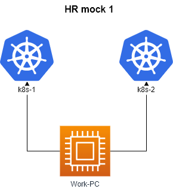

**This script is an example of a scenario that can be used as part of the interview screening process to hire employees for SRE (Site Reliability Engineer) and DevOps positions. The expected execution time should not exceed 25 minutes. The technology stack includes AWS, Kubernetes, Helm, and Prometheus.**

# Allowed resources

## **Kubernetes Documentation:**

<https://kubernetes.io/docs/> and their subdomains

<https://kubernetes.io/blog/> and their subdomains

<https://docs.aws.amazon.com/> and their subdomains

<https://prometheus.io/>  and their subdomains

<https://github.com/prometheus-community/helm-charts/>  and their subdomains

<https://github.com/prometheus-operator/prometheus-operator/tree/main/Documentation/user-guides/> and their subdomains

- run ``time_left`` on work pc to **check time**
- run ``check_result`` on work pc to **check result**
- time = **20 minutes**

## Questions

|        **1**        | **Using AWS CLI, get all ec2 instances with the tag `env_name=hr-mock`.**                                    |
| :-----------------: |:-------------------------------------------------------------------------------------------------------------|
|     Task weight     | 1%                                                                                                           |
|       Cluster       | -                                                                                                            |
| Acceptance criteria | - region: `eu-north-1`  - output: `json` - save output to : `/var/work/tests/artifacts/1/ec2_1.json` |

|        **2**        | **Update deployment named `test-app` in ns = `dev-team`.**                    |
|:-------------------:|:--------------------------------------------------------------------------|
|     Task weight     | 1%                                                                        |
|       Cluster       | cluster2                                                                  |
| Acceptance criteria | - ns: `dev-team`  - deployment name: `test-app` -  replicas: `4`  -  image: `nginx:stable` |

|        **3**        | **Install helm  release  kube-prometheus-stack**                                                                                                                                                                                               |
|:-------------------:|:-----------------------------------------------------------------------------------------------------------------------------------------------------------------------------------------------------------------------------------------------|
|     Task weight     | 1%                                                                                                                                                                                                                                             |
|       Cluster       | cluster1                                                                                                                                                                                                                                       |
| Acceptance criteria | - ns: `monitoring`  - release name : `kube-prometheus-stack` -  repository: `https://prometheus-community.github.io/helm-charts`  -  version: `45.4.0`  -  values file: `/var/work/tests/artifacts/kube-prometheus-stack.yaml` |

|        **4**        | **Create prometheus operator crd serviceMonitor**                                                                                                                                                                                             |
|:-------------------:|:----------------------------------------------------------------------------------------------------------------------------------------------------------------------------------------------------------------------------------------------|
|     Task weight     | 1%                                                                                                                                                                                                                                            |
|       Cluster       | cluster1                                                                                                                                                                                                                                      |
| Acceptance criteria | - ns: `prod`  - service: `app` -  service.port: `metrics`  -  for checking  result you can make  http request to   : `kube-prometheus-stack-prometheus.monitoring.svc.cluster.local:9090/api/v1/query?query=requests_per_second ` |

|        **5**        | **Get  nodes with the label `work_type=infra`**                                                                 |
|:-------------------:|:----------------------------------------------------------------------------------------------------------------|
|     Task weight     | 1%                                                                                                              |
|       Cluster       | cluster1                                                                                                        |
| Acceptance criteria | - node label: `work_type=infra`  - format type: `json`  -  save path : `/var/work/tests/artifacts/5/nodes.json` |
